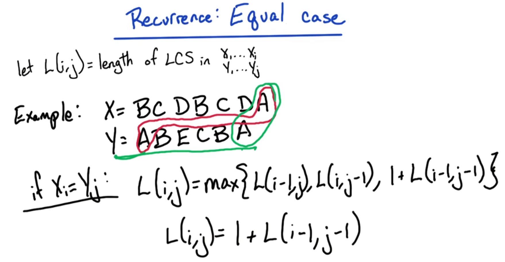
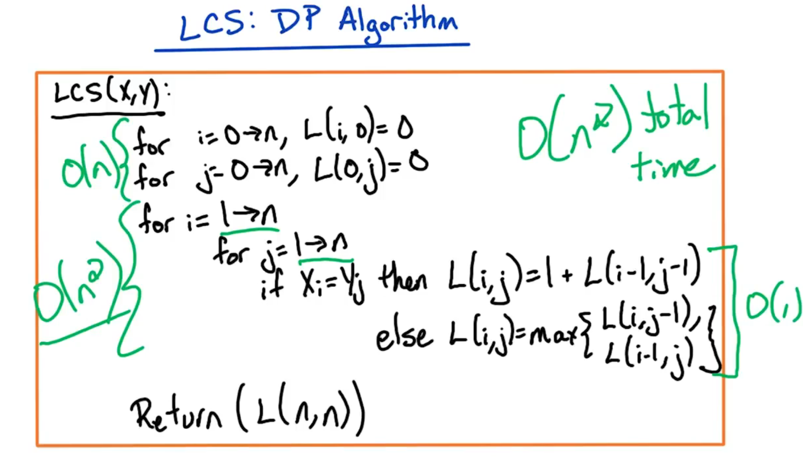

# Dynamic Programming: Topic Introduction

<center>

</center>

**Dynamic programming** (**DP**) is an extremely useful technique.
  * ***N.B.*** Students often have trouble with this topic, however, with sufficient practice, it will become more intuitive and familiar. The lectures will also demonstrate illustrative examples for this purpose.

The ***key*** to mastering dynamic programming is to perform lots of practice problems. While the homeworks are a starting point, perform additional textbook problems and consult other/external references (e.g., textbooks, courses, etc.) for further practice.

The ***outline*** for this section is as follows:
  * **Fibonacci numbers** → This is a "toy example" to illustrate the basic idea of dynamic programming
  * Subsequently to computing Fibonacci numbers, we will dive into a variety of example problems to get a feel for the different styles of dynamic programming algorithms, including:
    * **Longest Increasing Subsequence** (**LIS**)
    * **Longest Common Subsequence** (**LCS**)
    * **Knapsack**
    * **Chain Matrix Multiplication**
    * **Shortest Path Algorithms**

# Dynamic Programming 1: Fibonacci, Longest Increasing Subsequence (LIS), Longest Common Subsequence (LCS)

## Fibonacci Numbers

### 2. Introduction

<center>

</center>

Given an integer $n$, we wil look at an algorithm for generating the corresponding $n$<sup>th</sup> Fibonacci number. This is a very simple algorithm, but it will illustrate the idea of dynamic programming; later we will examine dynamic programming more generally (i.e., techniques for designing a dynamic programming algorithm, as well as more sophisticated examples).

Recall that the Fibonacci numbers are the following sequence:

$$0, 1, 1, 2, 3, 5, 8, 13, 21, 34, \dots$$

There is a simple recursive formula that defines the Fibonacci numbers as follows:

```math
\boxed{
\begin{array}{l}
{F_{0} = 0,\ F_{1} = 1}\\
{{\rm{for\ }}n > 1:}\\
\ \ \ \ {F_{n} = F_{n-1} + F_{n-2}}
\end{array}
}
```

Furthermore:
  * ***Input***: integer $n \ge 0$
  * ***Output***: $n$<sup>th</sup> Fibonacci number

We want an ***efficient*** algorithm to achieve this goal/output. Therefore, we are aiming for a ***running time*** which is ***polynomial*** in $n$ (i.e., $O(n)$ ).

Since the Fibonacci numbers are defined by this simple recursive formula, we might therefore think that a recursive algorithm is a natural algorithm for this particular problem. We will look at this recursive algorithm next, as well as analyze it accordingly.

### 3. Recursive Algorithm

#### Algorithm

Let us now examine the natural recursive algorithm for computing the $n$<sup>th</sup> Fibonacci number.

<center>

</center>

Recall (cf. Section 2) that the recursive formula for the $n$<sup>th</sup> Fibonacci number is the sum of the previous two Fibonacci numbers, i.e.,:

$$
{\rm{for\ }}n > 1:\ F_n = F_{n-1} + F_{n-2}
$$

The recursive algorithm (${\rm{Fib1}}(n)$ ) can be specified in more detail as follows:

```math
\boxed{
\begin{array}{l}
{{\rm{Fib1}}(n):}\\
\ \ \ \ {{\rm{input:\ integer\ }} n \ge 0}\\
\ \ \ \ {{\rm{output:\ }}{F_{n}}}\\
\ \ \ \ {{\rm{if\ }}n = 0,\ {\rm{return\ }} (0)}\\
\ \ \ \ {{\rm{if\ }}n = 1,\ {\rm{return\ }} (1)}\\
\ \ \ \ {{\rm{return\ }} ({\rm{Fib1}}(n-1) + {\rm{Fib1}}(n-2))}
\end{array}
}
```

In the ***base cases***, the Fibonacci numbers $0$ and $1$ are simply returned.

In the more general ***recursive cases***, the previous two Fibonacci numbers are computed and returned recursively as a sum.

This completes the definition of the recursive algorithm.

#### Analysis

Let us now consider the ***running time*** of this recursive algorithm.

<center>

</center>

To analyze this algorithm, let us create a function $T(n)$ which denotes the number of steps in the algorithm (i.e., ${\rm{Fib1}}(n)$ ), given an input size of $n$ .

The two base cases each require $O(1)$ time.

The two recursive calls require time $T(n-1) + T(n-2)$ .

Combining these two gives the following general formula:

$$
T(n) \le O(1) + T(n-1) + T(n-2)
$$

This formula may be familiar: It resembles the Fibonacci numbers themselves!
  * ***N.B.*** cf. $F_{n} = F_{n-1} + F_{n-2}$ from previously in this section. Furthermore, the constant term $O(1)$ is dominated by the other two terms as $n$ increases.

Therefore, in general:

$$
T(n) \ge F_{n}
$$

Unfortunately, the Fibonacci numbers grow exponentially in $n$ , i.e.,:

$$
T(n) \ge F_{n} \approx {\phi^{n}  \over {\sqrt 5 }}
$$

where the constant $\phi$ is called the **golden ratio**, defined as:

$$
\phi = {{1 + \sqrt{5}} \over {2}} \approx 1.618
$$

Therefore, since the running time grows ***exponentially*** in $n$ for this recursive algorithm ${\rm{Fib1}}(n)$ , it is a *terrible* algorithm with respect to performance. Let us examine *why* the running time is so terrible next (which in turn will inform the design of a more efficient algorithm to rectify this).

### 4. Exponential Running Time

Let us now consider the ***recursive*** nature of this recursive algorithm.

<center>

</center>

At the top level of the recursion, the $n$<sup>th</sup> Fibonacci number is computed. From there, recursive sub-calls are made to compute the $n-1$ and $n-2$ Fibonacci numbers. The recursive calls similarly proceed in this manner.

Observe that several of the sub-calls are computed *multiple* times (e.g., ${\rm{Fib1}}(n-4)$ , as circled in the figure shown above). In fact, these "redundant sub-computations" increase exponentially with $n$ ; indeed, this is the root cause of the inefficiency in this recursive algorithm (i.e., repeated computation of the smaller sub-problems).

<center>

</center>

To resolve this inefficiency (i.e., redundant computations), the algorithm will be "flipped on its head": We will compute the *smallest* sub-problems *first*, and then proceed in this manner up to the larger sub-problems (until reaching $n$ ).

To accomplish this, an ***array*** $F$ is defined, where $F_i$ denotes the $i$<sup>th</sup> Fibonacci number. Correspondingly, starting at index $i = 0$ , the first Fibonacci number is recorded as $0$ . Proceeding in this manner yields the following:

| $i$ | $F[i]$ |
|:--:|:--:|
| $0$ | $0$ |
| $1$ | $1$ |
| $2$ | $1$ |
| $3$ | $2$ |
| $\vdots$ | $\vdots$ |
| $n$ | $F[n]$ |

where in general $F[i] = F[i-1] + F[i-2]$ (i.e., until reaching $F[i] = F[n]$ accordingly).

This constitutes the corresponding ***dynamic programming algorithm*** in question, which will be defined more precisely next.

### 5. Dynamic Programming Algorithm

#### Algorithm

Now, let us detail our dynamic programming algorithm for computing the $n$<sup>th</sup> Fibonacci number.

<center>

</center>

The second attempt (cf. Section 3 for the first) at computing the $n$<sup>th</sup> Fibonacci number is as follows:

```math
\boxed{
\begin{array}{l}
{{\rm{Fib2}}(n):}\\
\ \ \ \ {F[0]=0}\\
\ \ \ \ {F[1]=1}\\
\ \ \ \ {{\rm{for\ }} i=2 \to n:}\\
\ \ \ \ \ \ \ \ {F[i] = F[i-1] + F[i-2]}\\
\ \ \ \ {{\rm{return\ }} (F[n])}\\
\end{array}
}
```

Recall (cf. Section 4) that the array $F$ stores the Fibonacci numbers.

At the first two indices (i.e., $0$ and $1$ ), the two **base cases** are stored (i.e., $0$ and $1$ , respectively).

From there, the **subsequent iterations** are handled via corresponding $\rm{for}$ loop, which is the sum of the previous two array elements (which in turn are already stored in the array, and readily available, rather than requiring recomputation at this point).

Finally, the $n$<sup>th</sup> Fibonacci number is simply returned as the value $F[n]$ , the last index in the array.

This completes the definition of the algorithm. Observe that there is ***no*** recursion present in this algorithm.
  * ***N.B.*** A *recursive formula* is used to define $F[i]$ , however, there is *no* corresponding recursive call (i.e., to ${\rm{Fib2}}(i)$ itself) here.

#### Analysis

Let us now analyze the running time of this algorithm, ${\rm{Fib2}}(n)$ .

<center>

</center>

As before (cf. Section 3), the base cases have a running time of $O(1)$ apiece.

With respect to the subsequent iterations, there is a $\rm{for}$ loop of size $O(n)$ , which in turn iterates on $O(1)$ steps. Correspondingly, the total running time for the $\rm{for}$ loop is $O(n)$ .

Therefore, the total running time for this algorithm is $O(n)$ total time. This completes the algorithm, and gives a glimpse of a dynamic programming algorithm.

### 6. Dynamic Programming Recap

<center>

</center>

Before moving onto a more sophisticated example, let us recap a few ***key issues***.

One important point must be stressed regarding dynamic programming algorithms: There is ***no*** recursion within the algorithm itself.
  * ***N.B.*** While the recursive nature of a given problem can be used to design the corresponding dynamic programming algorithm, the algorithm itself has *no* such recursion in its own definition.

***N.B.*** There is an alternative approach to dynamic programming called **memoization**, whereby a hash table (or other similar structure) is used to maintain the sub-problems solved at a given point, in order to avoid their recomputation. However, this technique will ***not*** be used in this course. The purpose for its omission is due to the larger goal of learning dynamic programming; to avoid confusion, a "no recursion in our algorithms" policy will be enforced for present purposes. Along these lines, dynamic programming has several advantages over memoization (and other similar techniques): Some may say that the algorithms themselves are "more beautiful" (they are certainly faster, due to less overhead incurred by avoiding recursion altogether), but beyond this, it is much more simple and straightforward to analyze the running time of dynamic programming algorithms.

Dynamic programming is widely used. At first, students often find it challenging; however, with sufficient practice, the dynamic programming algorithms will become increasingly more resembling of each other, at which point, more intuition/insight will be gained into how to devise such algorithms accordingly. Therefore, achieving this point requires practice, practice, practice!

## Longest Increasing Subsequence (LIS)

### 7. Introduction

Let us now consider a more sophisticated example of dynamic programming. The problem we will consider is the **longest increasing subsequence** (**LIS**) problem.

<center>

</center>

In the longest increasing subsequence (LIS) problem, the ***input*** is $n$ numbers, denoted as follows:

$$
a_1, a_2, \dots, a_n
$$

Correspondingly, the ***goal*** is to compute the *length* of the longest increasing subsequence in these $n$ input numbers $a_1, \dots, a_n$ .
  * ***N.B.*** The objective here is only to find the *length* of this subsequence, *not* the (constituent numbers/elements of the) subsequence itself. Upon determining the length, it is relatively trivial to transform this output into the corresponding algorithm to produce the underlying subsequence itself.

Consider an example sequence as follows (where $n = 12$ ):

$$
5, 7, 4, -3, 9, 1, 10, 4, 5, 8, 9, 3
$$

Before defining the subsequence, consider the more common term substring. A **substring** is a string (i.e., consecutive set of elements) which occurs within the larger string. For example, the following are substrings of this sequence (denoted by red annotations in the figure shown above):

$$
-3, 9, 1, 10
$$

$$
4
$$

$$
9, 1, 10, 4, 5, 8, 9, 3
$$

A substring can be specified in this manner via its start and end indices; therefore, there is at most order of $O(n^2)$ such substrings accordingly.

However, the problem at hand is not defined with respect to *substrings*, but rather with respect to *subsequences*. Correspondingly, a **subsequence** is a string which can be obtained by ***deleting*** corresponding elements of the larger string (i.e., the subset of elements is ordered, but given this ordered subset, elements can be ***skipped*** accordingly, rather than being strictly consecutive). The following are representative subsequences of the sequence (denoted by green annotations in the figure shown above):

$$
4, -3, 1, 9
$$

$$
1
$$

$$
5, 7, 3
$$

In this particular problem, we are attempting to find such a subsequence which is ***increasing***, i.e., wherein each element is strictly larger than the previous.
  * In the case of $5, 7, 3$ , this is *not* an increasing subsequence, because $3 < 7$ .
  * However, a representative increasing subsequence includes $4, 9, 10$ .
  * Conversely, $4, 4, 8, 9$ is also *not* a permissible subsequence under this definition, because it is not *strictly* increasing (i.e., $4 = 4$ ).

With these definitions in mind, to reiterate, the ***goal*** is to find the ***longest*** such increasing subsequence for the input array. Correspondingly, in this particular example, the longest increasing subsequence (LIS) is:

$$-3, 1, 4, 5, 8, 9$$

having a length of $6$ , with this length being the corresponding output of the algorithm. Now, let us attempt to design a dynamic programming algorithm for this purpose.

### 8-9. Attempt 1

#### 8. Sub-Problem

Now, consider a "recipe" for designing such a dynamic programming algorithm.

<center>

</center>

The first step is to define the **sub-problem** in words.
  * Recalling (cf. Section 5) the example of Fibonacci numbers, $F[i]$ is defined as the $i$<sup>th</sup> Fibonacci number.

The second step is to state the **recursive relation**. Here, we want to express the solution to the $i$<sup>th</sup> sub-problem in terms of smaller sub-problems.
  * Recalling (cf. Section 5) the example of Fibonacci numbers, $F[i]$ is expressed in terms of $F[1], \dots, F[i-1]$ , where $i - 1 < i$ . In this particular algorithm, these values are stored in the corresponding array $F$ for subsequent use in computing $F[i]$ accordingly, i.e., $F[i] = F[i-1] + F[i-2]$ can be readily computed in this manner.

<center>

</center>

Now, let us consider how to follow this recipe for the longest increasing subsequence (LIS) problem:
  * In the first step, let function $L(i) =$ length of longest increasing subsequence (LIS) on $a_1, a_2, \dots, a_i$ .
    * ***N.B.*** Generally, the first attempt for defining this step will *always* involve using the *identical* problem on a *prefix* of the input (i.e., in this case, the longest increasing subsequence on the first $i$ elements of the input array).
  * In the second step, we express $L(i)$ in terms of $L(1), \dots, L(i-1)$ (i.e., smaller sub-problems $1, \dots, i-1$ relative to $i$ itself). To do this, we will next revisit our earlier example to gain some intuition.

#### 9. Recurrence

Recall (cf. Section 8) that our sub-problem definition is: Let function $L(i) =$ length of longest increasing subsequence (LIS) on input array $a_1, a_2, \dots, a_i$ . The goal is then to express $L(i)$ in terms of $L(i)$ in terms of $L(1), \dots, L(i-1)$ (the solutions of smaller sub-problems).

<center>

</center>

Recall (cf. Section 7) the earlier example input array as follows (with $n = 12$ ):

$$
5, 7, 4, -3, 9, 1, 10, 4, 5, 8, 9, 3
$$

Initially, with respect to the one-element sub-array $5$ (i.e., the first element), the longest increasing subsequence (LIS) has corresponding length $1$ accordingly. Similarly, the two-element sub-array $5, 7$ has a longest increasing subsequence (LIS) of length $2$ .

Proceeding in this manner yields the following:

| $i$ | $a_i$ | $L(i)$ | LIS |
|:--:|:--:|:--:|:--:|
| $0$ | $5$ | $1$ | $5$ |
| $1$ | $7$ | $2$ | $5, 7$ |
| $2$ | $4$ | $2$ | $5, 7$ |
| $3$ | $-3$ | $2$ | $5, 7$ |
| $4$ | $9$ | $3$ | $5, 7, 9$ |
| $5$ | $1$ | $3$ | $5, 7, 9$ |
| $6$ | $10$ | $4$ | $5, 7, 9, 10$ |
| $7$ | $4$ | $4$ | $5, 7, 9, 10$ |
| $8$ | $5$ | $4$ | $5, 7, 9, 10$ |
| $9$ | $8$ | $4$ | $5, 7, 9, 10$ |

Let us pay special attention to the case of $i = 9$ . While we can append $8$ here to produce subsequence $5, 7, 9, 10$ (as shown provisionally in the table above), there is in fact *another* possible solution: $-3, 1, 4, 5, 8$ .

The problem, then, is as follows: How can we compute $L(9)$ using $L(0), \dots, L(8)$ ? In particular, how do we know whether or not we can append $8$ to the current solution at that point, if we do not otherwise maintain the current solution explicitly (but even if we were to do so, how would we know to append $8$ at the end of it)?
  * In particular, for the solution $5, 7, 9, 10$ , it is *not* appropriate to append $8$ , however, for the solution $-3, 1, 4, 5$ it *is* appropriate to append $8$ .

So, then, suppose we did keep track of the current solution; in that case, what do we need to know? What we need to know is the *ending* element of the current solution (e.g., $10$ or $5$ in this case). Correspondingly, the ***key fact*** here is knowing the longest increasing subsequence with the *minimum* such element (e.g., $5$ in this case). Given the minimum such element, this yields the *most* corresponding opportunities to append an additional element onto the end of the subsequence.

Therefore, in this case, in order to compute $L(9)$ using $L(0), \dots, L(8)$ , we need to keep track of the longest increasing subsequence solution with the minimum ending element (e.g., $5$ , which consequently allows to append $8$ to the end of the subsequence, thereby increasing the corresponding solution length from $4$ to $5$ accordingly).

<center>

</center>

Let us return to $i = 8$ and see the subsequent complication in ths solution. At this point, our previous solution was $5, 7, 9, 10$ . However, with our *new* formulation, we want to maintain $-3, 1, 4, 5$ , since it is also of length $4$ while additionally ending in a smaller element (i.e., $5 < 10$ ).

<center>

</center>

Similarly, let us now return to $i = 7$ . At this point, the longest increasing subsequence is $5, 7, 9, 10$ . However, note that at this point, we need to have sequence $-3, 1, 4$ , which at this point is sub-optimal, but nevertheless we need to maintain it in order to later obtain the solution $-3, 1, 4, 5$ of length $4$ .

So, then, how do we maintain such a "sub-optimal" solution? The ***key*** is that for every possible ending element (e.g., $10$ in subsequence $5, 7, 9, 10$ , and $4$ in subsequence $-3, 1, 4$ ), we want to maintain the longest increasing solution with that particular ending element.

<center>

</center>

Therefore, we need to know the length fo the longest increasing subsequence for every possible ending element. If we know every possible ending element, then upon examining a new element (e.g., $5$ ) we can correspondingly match this against the previous ending elements to determine the appropriate current solution accordingly.

This begs the question: How many possible ending elements exist at any given solution point, and what are they? Necessarily, one of the ending elements must be an earlier element in the input array, therefore the potential candidates are finite (i.e., at most $i - 1$ such possible candidates).

This, then, gives an idea of how to modify our sub-problem formulation accordingly: We want to know the length of the longest increasing subsequence (LIS) for every possible ending element, subject to the constraint that this will exist within the previous $i - 1$ elements. Therefore, we want to maintain the longest increasing subsequence (LIS) for every element of the array.

To accomplish this, we will ***modify*** the definition of the sub-problem accordingly as follows: Let function $L(i) =$ length of longest increasing subsequence (LIS) on input array $a_1, a_2, \dots, a_i$ ***and*** includes $a_i$ .
  * This in turn will give the longest increasing subsequence (LIS) which ends at the $i$<sup>th</sup> element of the array (i.e., $a_i$ ), e.g., ending at $5$ for $i = 8$ . By maintaining this from $i = 0$ through $i - 1$ , this can be used consequently to determine the longest increasing subsequence (LIS) at $i$ itself.

We will next formulate this restated sub-problem more precisely, and then subsequently examine the corresponding recurrence.

### 10-11. Attempt 2

#### 10. Sub-Problem

<center>

</center>

We now have a new sub-problem formulation:

> Let $L(i)$ = length of longest-increasing subsequence in $a_1, \ldots, a_i$ , ***including*** $a_i$ itself.

The latter is an extra restriction added to the sub-problem. This in turn will expedite the expressing of a recurrence, which formulates $L(i)$ in terms of $L(1), \ldots, L(i-1)$ .

Let us return to the previous example (cf. Section 7). The correspondingly more straightforward recurrence arises as follows:

| $i$ | $a_i$ | $L(i)$ | LIS |
|:--:|:--:|:--:|:--:|
| $1$ | $5$ | $1$ | $1$ |
| $2$ | $7$ | $2$ | $5, 7$ |
| $3$ | $4$ | $1$ | $4$ |
| $4$ | $-3$ | $1$ | $4$ |
| $5$ | $9$ | $3$ | $5, 7, 9$ |
| $6$ | $1$ | $2$ | $-3, 1$ |
| $7$ | $10$ | $4$ | $5, 7, 9, 10$ |
| $8$ | $4$ | $3$ | $-3, 1, 4$ |
| $9$ | $5$ | $4$ | $-3, 1, 4, 5$ |

Observe that a difference/divergence begins to occurs starting with $i = 3$ , wherein $L(i) = 1$ (via corresponding LIS of $4$ ).
  * ***N.B.*** In the previous definition of $L(i)$ (cf. Section 8), the corresponding value was $L(i) = 2$ for $i = 3$ (note that the previous example started from index $0$ rather than $1$ ).

<center>

</center>

Finally, consider the case of $i = 10$ (as in the figure shown above), the case which caused problems in the previous definition of $L(i)$ (cf. Section 9).

In this case, we want to observe which sub-problems allow us to append $8$ to the end of the LIS. Accordingly, $8$ can be appended to any of the candidate subsequences, excluding those ending in $9$ or $10$ (i.e., thereby excluding candidates $L(5)$ and $L(7)$ , respectively). Therefore, among the remaining candidates subsequences, we will append $8$ to the longest one (i.e., $L(9) = 4$ ), as follows:

| $i$ | $a_i$ | $L(i)$ | LIS |
|:--:|:--:|:--:|:--:|
| $1$ | $5$ | $1$ | $1$ |
| $2$ | $7$ | $2$ | $5, 7$ |
| $3$ | $4$ | $1$ | $4$ |
| $4$ | $-3$ | $1$ | $4$ |
| $5$ | $9$ | $3$ | $5, 7, 9$ |
| $6$ | $1$ | $2$ | $-3, 1$ |
| $7$ | $10$ | $4$ | $5, 7, 9, 10$ |
| $8$ | $4$ | $3$ | $-3, 1, 4$ |
| $9$ | $5$ | $4$ | $-3, 1, 4, 5$ |
| $10$ | $8$ | $5$ | $-3, 1, 4, 5, 8$ |

Note that it is not strictly necessary to know the subsequence itself to append this next element, but rather it is only necessary to know that it has (in this case) a length of $4$ and ends in element $5$ .

This highlights the recurrence for the solution of $L(i)$ in terms of smaller sub-problems $L(1), \ldots, L(i-1)$ .

#### 11. Recurrence

<center>

</center>

Now, let us formally state the recurrence for $L(i)$ in terms of smaller sub-problems:

```math
L(i) = 1 + \mathop {\max }\limits_j \big\{ {L(j):{a_j} < {a_i}{\text{ and }}j < i} \big\}
```

The first term $1$ accounts for the fact that $a_i$ is *included* in the definition of $L(i)$ .

Furthermore, the second term $\mathop {\max }\limits_j { \cdots }$ is the longest subsequence which can be appended onto the beginning. This is comprised of the subsequence $L(j)$ ending at element $a_j$ , to which $a_i$ can be appended only if (strictly) $a_j < a_i$ (where in general $j$ occurs earlier in the subsequence than $i$ , i.e., $j < i$ ).

This recurrence can also be re-expressed as follows:

```math
L(i) = 1 + \max\limits_{\underset{a_j < a_i}{1 \leq j \leq i - 1}} \big\{ L(j) \big\}
```

Here, the second term $\max\limits_{\underset{a_j < a_i}{1 \leq j \leq i - 1}}$ { $L(j)$ } considers some sequence $a_1, \ldots, a_j, a_i$ , where element $a_j$ is at some index $j$ occurring earlier than index $i$ of element $a_i$ (i.e., somewhere in the range $1, \ldots, j, \ldots, i-1$ , wherein strictly $j < i$ and $a_j < a_i$ ), which in turn contains the value $L(j)$ accordingly.

This comprises the full definition, along with the definition of the sub-problem (cf. Section 10), which fully satisfies the problem.

Next, we will define the dynamic programming algorithm corresponding to this definition.

### 12-13. Dynamic Programming Algorithm

#### 12. Pseudocode

<center>

</center>

The pseudocode for the dynamic programming algorithm for the longest-increasing subsequence problem can be stated as follows:

```math
\boxed{
\begin{array}{l}
{{\rm{LIS}}(a_1,\ldots,a_n):}\\
\ \ \ \ {{\rm{for\ }} i=1 \to n:}\\
\ \ \ \ \ \ \ \ {L(i) = 1}\\
\ \ \ \ \ \ \ \ {{\rm{for\ }} j=1 \to i-1:}\\
\ \ \ \ \ \ \ \ \ \ \ \ {{\rm{if\ }} a_j < a_i {\rm{\ and\ }} L(i) < 1 + L(j) {\rm{\ then\ }} L(i) = 1 + L(j)}\\
\ \ \ \ {\max = 1}\\
\ \ \ \ {{\rm{for\ }} i=2 \to n:}\\
\ \ \ \ \ \ \ \ {{\rm{if\ }} L(i) > L(\max) {\rm{\ then\ }} \max = i}\\
\ \ \ \ {{\rm{return\ }} (L(\max))}\\
\end{array}
}
```

***N.B.*** Recall (cf. Section 11) the definition for the recurrence as follows:
```math
L(i) = 1 + \mathop {\max }\limits_j \big\{ {L(j):{a_j} < {a_i}{\text{ and }}j < i} \big\}
```

The solution is expressed as a one-dimensional array, $L$ , which is filled in a "bottom-up" approach (i.e., starting from index $i = 1$ , and then proceeding up through index $i = n$ , as expressed by the outer $\rm{for}$ loop).

Since the sub-problem *includes* $a_i$ in the sub-problem, $L(i)$ is initialized to $L(i) = 1$ . The nested $\rm{for}$ loop then iterates over $j$ (ranging from $1$ to $i - j$ ), with corresponding check that strictly $a_j < a_i$ . If the solution obtained by appending $a_i$ onto the end of the solution ending at $a_j$ must be strictly longer than the current solution (i.e., $L(i) < 1 + L(j)$ ). If both of these conditions are satisfied, then $L(i)$ is updated to $L(i) = 1 + L(j)$ accordingly (i.e., the current best solution, obtained by appending $a_i$ to the end of $a_j$ ). This defines the table $L$ .

Now, in order to obtain the actual solution (i.e., $L(\max)$ , the longest-increasing subsequence), we must obtain the corresponding output from the table (cf. the last element of the table generated for Fibonacci numbers, as per Section 5). In this case, the solution is the longest-increasing subsequence ending at some arbitrary position $i$ (in the range of $1, \ldots, n$ ). This is obtained straightforwardly by iterating over the entire array $L$ to determine $i$ such that $L(i) > L(\max)$ , and updating value $\max$ (initialized to value $1$ ) accordingly. This corresponding value is then consequently returned as $L(\max)$ accordingly, thereby completing the formulation of the dynamic programming algorithm.

Now, let us consider the running time of this algorithm.

#### 13. Running Time Quiz and Answers

<center>

</center>

The outer $\rm{for}$ loop varies over $n$ elements with corresponding running time of $O(n)$ . Furthermore, the nested $\rm{for}$ loop similarly varies over at most $O(n)$ elements. Within the nested for loop, each $\rm{if\ }\ldots$ statement takes and order of $O(1)$ running time. Therefore, the overall running time of the nested $\rm{for}$ loops is $O(n^2)$ .

Furthermore, the subsequent $\rm{for}$ loop for determining $L(\max)$ has a running time of $O(n)$ .

Therefore, the overall running time is $O(n^2)$ , as dominated/determined by the first set of nested $\rm{for}$ loops.

### 14. Recap

<center>

</center>

This completes the formulation of our dynamic programming algorithm and the analysis of its running time. Now, let us consider/review some ***important aspects*** of the algorithm design.
  * The first step of the algorithm design process was to define the algorithm in words, i.e., expressing $L(i)$ in terms of words.
    * Our initial attempt (cf. Section 8) used the prefix of the input, in order to find the longest-increasing subsequence on the first $i$ elements of the array $L$ .
  * Next, the second step is to find a recurrence relation that the solution's sub-problems satisfy.
    * In the initial attempt (cf. Section 9), the resulting recurrence relation was inadequate. To rectify this, we returned to the first step and reformulated the sub-problem definition (cf. Section 10), wherein an extra condition was added which consequently yielded the corresponding recurrence for the sub-problems, defined there as:

  ```math
  L(i) = 1 + \mathop {\max }\limits_j \big\{ {L(j):{a_j} < {a_i}{\text{ and }}j < i} \big\}
  ```

Furthermore, consider the ***intuition*** for why we wanted to strengthen the sub-problem definition.
  * Recall (cf. discrete mathematics prerequisite course, or equivalent) that when attempting to prove some statement by **induction**, you first begin by stating the inductive hypothesis (typically having the same form as the statement to be proved). 
  * Then, you attempt to prove that hypothesis by using induction, however, occasionally this yields difficulties. To rectify this, you go back and alter the inductive hypothesis; typically, this involves strengthening the inductive hypothesis by adding ***extra conditions*** to it (e.g., in the case of the present algorithm, adding the extra condition that the sub-problem $L(i)$ must also *include* $a_i$ itself).
  * From there, you strengthen the inductive hypothesis and consequently prove that stronger statement (e.g., finding the length of the longest-increasing subsequence with a specific element at the end).
  * Using the solution to this stronger problem, we can then solve the weaker problem (e.g., without particular concern to the identity of the ending element itself).

Therefore, a lot of the intuition for dynamic programming originates from ideas in induction proofs.

## Longest Common Subsequence

### 15. Introduction

<center>

</center>

The next dynamic programming example is the **longest common subsequence** (**LCS**) problem.

The ***input*** to the problem is two strings denoted as $X = x_1 \cdots x_n$ and $Y = y_1 \cdots y_n$ , which for simplicity (for now) are assumed to be of equal lengths $n$ .

The ***goal*** is to find the *length* of the longest string which is a subsequence (*not* a substring) of *both* $X$ and $Y$ .
  * Furthermore, with this length determined, it is possible to determine the corresponding substring appearing in the subsequence, which will also be demonstrated.

### 16. Example Quiz and Answers

Consider an example of the longest-common subsequence problem, in order to become more familiarized with the corresponding terminology.

<center>

</center>

Consider the following two strings, both of length $7$ :

$$
X=BCDBCDA
$$

$$
Y=ABECBAB
$$

What is the longest-common subsequence (LCS), and what is its corresponding length?

The corresponding solution is substring $BCBA$ having length $4$ .

The main motivation of this example is to demonstrate another variation of the dynamic programming approach. Furthermore, this simple problem is used in the Unix-based application `diff`, which compares differences between two inputs (e.g., files' respective contents).

### 17-19 Attempt 1

#### 17. Sub-Problem

Let us consider again the two-step process for defining the dynamic programming algorithm for this problem, the longest-common subsequence (LCS).

<center>

</center>

The first step is to define the ***sub-problem***, in words (cf. Sections 5 and 8). Generally, the first attempt is to always try to devise the sub-problem as the *same* problem on a ***prefix*** of the input. Therefore, the ***key*** is to perform the *identical* problem, but only on a prefix of it (i.e., from length $n$ reduced to some smaller, intermediate length $i$ ). Formally, this can be stated as:

> For $i$ where $0\le i \le n$ , let $L(i)$ = the length of the longest-common subsequence (LCS) in $x_1 \cdots x_n$ and $y_1 \cdots y_n$ .

The second step is to define the ***recurrence***. We want to express $L(i)$ in terms of $L(1), \dots, L(i-1)$ , as discussed next.

#### 18. Recurrence

<center>

</center>

Let us detail the sub-problem definition proposed previously (cf. Section 17):

> For $i$ (the prefix length) where $0 \le i \le n$ , let $L(i)$ = length of the longest-common subsequence (LCS) in prefixes $x_1 \cdots x_i$ and $y_1 \cdots y_i$

***N.B.*** This is analogous to the original problem, except that here the sub-problem is specified as *prefixes* of the respective inputs. Furthermore, $L(i)$ does not store the subsequence itself, but rather only its *length* (here, we want the table to store a number, or true/false).

Now, recalling (cf. Section 16) the previous example:

$$
X=BCDBCDA
$$

$$
Y=ABECBAB
$$

we would like to express a recurrence relation $L(i)$ such that $L(i)$ is defined in terms of smaller sub-problems $L(i), \dots, L(i-1)$ .

In order to yield such a smaller sub-problem, consider the last character in each string, i.e.,:

$$
X=\cdots A
$$

$$
Y=\cdots B
$$

Given these last characters, we will examine how $x_i$ and $y_i$ (respectively) are used in the solution of $L(i)$ , and then we can use the solution to the subproblem of size $i-1$ (i.e., $L(i-1)$ ). We then take the optimal solution for the subproblem of size $i-1$ and then we append on the solution for $x_i$ and $y_i$ .

<center>

</center>

Proceeding in this manner, there are ***two cases*** two consider:
  * 1 - The last characters are the *same* (i.e., $x_i = y_i$ )
  * 2 - The last characters are *different* (i.e., $x_i \ne y_i$ )

Consider the first case first, which turns out to be the relatively easier case. Let us modify the example accordingly as follows (i.e., with both strings terminating in character $C$ ):

$$
X=BCDBCDAC
$$

$$
Y=ABECBABC
$$

When both ending characters are the same, we know that the longest-common subsequence (LCS) must end in this same character as well.
  * ***N.B.*** Why is this necessarily true? Consider a longest-common subsequence (LCS) for which this last character is *not* included. If that is the case, then this last character can be appended to such a subsequence, thereby yielding a *longer* subsequence accordingly. Therefore, it must be necessarily true that the *longest* subsequence contains this last character.

Therefore, in the case where the last character is equal in both strings, we can define $L(i)$ as follows:

$$
L(i) = 1 + L(i-1)
$$

where the first term accounts for the (common) last character, appended onto the longest-common subsequence (LCS) of length $L(i-1)$ in the prefix subsequence. Observe that this constitutes a recurrence relation accordingly (i.e., $L(i)$ expressed in terms of $L(i-1)$ ).

Next, consider the case where $x_i \ne y_i$ .

#### 19. Recurrence Problem

Consider the case when the last characters of the two input strings are different (i.e., $x_i \ne y_i$ ), returning to the previous example (cf. Section 18) as follows:

$$
X=BCDBCDA
$$

$$
Y=ABECBAB
$$

In this particular example, there are three possibilities for the last character:
  * $A$ (via $x_i$ ),
  * $B$ (via $y_i$ ), or
  * neither.

##### Case A: The last character is $x_i$

<center>

</center>

Suppose the first case holds, whereby the last character is $A$ (i.e., $x_i$ ). In string $Y$ , the last character $B$ is eliminated by default, since its matches in $X$ have been exhausted by that point.

##### Case B: The last character is $y_i$

<center>

</center>

By similar rationale, in the second case, wherein the last character is $B$ (i.e., $y_i$ ), then in string $X$ , the last character $A$ (as well as the other preceding characters back to the last-occurring $B$ in string $X$ ) is eliminated by default, due to exhaustion of corresponding matches in $X$ .

##### Case C: The last character is neither $x_i$ nor $y_i$

<center>

</center>

Finally, in the third/final case, wherein the last character matches neither $A$ nor $B$ (i.e., neither $x_i$ nor $y_i$ , respectively).

##### Defining the recurrence (a problem!)

Now, consider how we might express $L(i)$ for these three cases.

<center>

</center>

In the case where neither $x_i$ nor $y_i$ are the last character, this simply omits the corresponding $1$ count in $L(i)$ relative to the corresponding expression for $x_i = y_i$ (cf. Section 18), since the character in question is not a contributor to the length, i.e.,:

```math
L(i) = \cancel{{1}}+L(i - 1)
```

<center>

</center>

In the case where $y_i$ is the last character (i.e., $x_i$ is dropped), an ***ambiguity*** arises: $X$ now has a prefix length of $i-1$ , whereas $Y$ has a prefix length of $i$ . Therefore, there is no (unambiguous) way to find the corresponding value in table $L(i)$ , i.e., the solution does not exist there, because the candidates prefix strings $X$ and $Y$ are of *different* lengths.

Furthermore, even if the length were determinate in terms of how the last characters in the resulting prefix strings matched (e.g., $B$ of $y_i$ matching with the fourth character $B$ in $x_i$ in this particular example), this would still result in inconsistent prefix lengths (i.e., length $3$ for prefix $X$ vs. length $7$ for prefix $Y$ via match on character $B$ ).

<center>

</center>

By symmetrical reasoning, with $x_i$ as the last character (and $y_i$ correspondingly dropped), this similarly yields unequal lengths in the resulting prefix strings (i.e., $7$ and $6$ for $X$ and $Y$ , respectively, if matching on last character $A$ ), giving rise to an ambiguous match in the table $L(i)$ accordingly. Therefore, in this case, a corresponding lookup would require searching for the longest-common subsequence (LCS) in $x_1 \cdots x_i$ and separately in $y_1 \cdots y_{i-1}$ accordingly. Proceeding in this manner will also yield further asymmetries in the resulting prefix strings.

<center>

</center>

Therefore, for the sub-problem definition given as follows (cf. Section 18):

> For $i$ where $0\le i \le n$ , let $L(i)$ = the length of the longest-common subsequence (LCS) in  $x_1 \cdots x_i$ and $y_1 \cdots y_i$ .

it is not possible to (unambiguously) define a corresponding recurrence (i.e., expressing $i$ in terms of smaller sub-problems). However, the preceding discussion did provide some insight into what constitutes a potential ***valid*** sub-problem definition: The difficulty which arises is due to the generally ***varying*** prefix lengths of the input strings.

Therefore, to reconcile this impasse, we ***modify*** our sub-problem definition as follows:

> For $i$ where $0\le i \le n$ and $j$ where $0\le j \le n$ , let $L(i, j)$ = the length of the longest-common subsequence (LCS) in $x_1 \cdots x_i$ and $y_1 \cdots y_j$ .

Here, the single parameter $i$ is now expanded to parameters $i$ and $j$ , and correspondingly the one-dimensional table $L(i)$ is now expanded to a two-dimensional table $L(i, j)$ in order to accommodate the possibility of variably sized prefix strings.

### 20-24. Attempt 2

#### 20. Sub-Problem

<center>

</center>

Let us now revise our sub-problem definitions with the insight from the first attempt; recall (cf. Section 19) that these insights were as follows:
  * The two prefix strings are independently indexed as $i$ (prefix in string $X$ ) and $j$ (prefix in string $Y$ )
  * The resulting table is two-dimensional (i.e., $L(i, j)$ )
    * cf. In previous examples, tables were generally one-dimensional up to this point

Therefore, formalizing the sub-problem definition gives the following:

> For $i$ and $j$ where $0 \le i \le n$ and $0 \le j \le n$ , let $L(i, j)$ = length of the longest-common subsequence (LCS) in $x_1 \cdots x_i$ and $y_1 \cdots y_j$ .

With this new sub-problem definition, the corresponding ***recurrences*** can be defined with the following ***base cases***:
 * $L(i, 0) = 0$
 * $L(0, j) = 0$

Intuitively, in these cases, the prefix string for the longest-common subsequence (LCS) has trivial length $0$ .

Next, we will consider the ***recursive cases***.

#### 21-23. Recurrence

##### 21. Unequal Case

Given the new sub-problem definition (cf. Section 20), now consider defining the corresponding recurrence relation, starting with the case of unequal last characters in the respective prefix strings (i.e., $x_i \ne y_j$ ).

<center>

</center>

For this purpose, we return to the example from previously (cf. Section 19):

$$
X=BCDBCDA
$$

$$
Y=ABECBABD
$$

***N.B.*** Here, to make the strings of unequal length, character $D$ is appended to the end of $Y$ (relative to previously).

The ***key insight*** is that if the last characters are unequal, then the last character in the optimal-length longest-common subsequence (LCS) ends in either $x_i$ , $y_j$ , or neither.
  * If neither, then the respective last characters can be dropped from both prefix strings. 
  * Therefore, there are only two additional cases to consider: Dropping either $x_i$ *or* $y_j$ , and consequently taking one of these results as the optimal one.

<center>

</center>

Following this approach, the respective recurrence relations can be correspondingly defined as follows:
  * If dropping $x_i$ , then $L(i, j) = L(i-1, j)$
  * If dropping $y_j$ , then $L(i, j) = L(i, j-1)$

<center>

</center>

So, then, how to determine which of these is the most optimal of the two? This is simply follows directly from whichever of the two is *longer*, i.e.,:

```math
L(i,j) = \max \big\{ L(i-1,j), L(i, j-1) \big\}
```

This constitutes the recurrence relation for the case where $x_i \ne y_j$ . Next, we consider the case where $x_i = y_j$ .

##### 22-23. Equal Case

###### 22. Overview

Now consider defining the recurrence relation for the case of unequal last characters in the respective prefix strings (i.e., $x_i = y_j$ ).

<center>

</center>

For this purpose, we return to the example from previously (cf. Section 19):

$$
X=BCDBCDA
$$

$$
Y=ABECBA
$$

***N.B.*** Here, to make the strings of unequal length but of equal last character (i.e., $A$ ), character $B$ is truncated from the end of $Y$ (relative to previously).

Here, there are three possibilities to consider for the optimal-length solution to the longest-common subsequence (LCS):
  * drop $x_i$ ,
  * drop $y_j$ (which is equivalent to previous, given that $x_i = y_j$ ), or
  * ends at $x_i = $y_j$
    * ***N.B.*** This is a distinctly different consideration from the previous scenario of $x_i \ne y_j$ (cf. Section 21)

Proceeding similarly to before as in the case of $x_i \ne $y_j$ (cf. Section 21), we will consider these three cases, taking the "best" (longest-length) of the three:
  * If dropping $x_i$ , then $L(i, j) = L(i-1, j)$
  * If dropping $y_j$ , then $L(i, j) = L(i, j-1)$
  * If $x_i = y_j$ , then $L(i,j) = 1 + L(i-1, j-1)$
    * In this case (i.e., $x_i = y_j$ ), the first term $1$ represents the common character. Furthermore, this common last character is correspondingly dropped, with the optimal solution taken as the resulting smaller prefix $L(i-1, j-1)$ .

###### 23. Recap

Let us recap the case where $x_i = y_j$ .

<center>

</center>

This case results in three possibilities (cf. Section 22), which can be expressed/consolidated as follows:

```math
L(i,j) = \max \big\{ L(i-1,j), L(i,j-1), 1 + L(i-1,j-1) \big\}
```

An astute observer will likely note that only the last case is relevant here, since it will necessarily be the longest of the three; therefore, this simplifies to:

$$
L(i,j) = 1 + L(i-1,j-1)
$$

Consider a brief ***intuition*** for why this is necessarily always the case. Consider again (cf. Section 22) the present example:

$$
X=BCDBCDA
$$

$$
Y=ABECBA
$$

If the optimal solution does not contain this last character (i.e., $A$ ), then it could otherwise be appended to the longest-common subsequence (LCS), thereby yielding a longer prefix (and thus the candidate in question was sub-optimal to begin with). Therefore, it is necessarily true that the longest-common subsequence (LCS) must include either $x_i$ or $y_j$ (but *not* neither).

<center>

</center>

It may also be the case that $x_i$ matches with some earlier/non-last occurrence of the character in string $Y$ (e.g., $A$ of $x_i$ matching $y_1$ in the figure shown above). However, any case in which the last character matches an earlier occurrence of the character in the other candidate string would still otherwise be consistent with matching the same-occurring last character (i.e., any such subsequence occurs in the larger subsequence with the longest-matching last character regardless). Consequently, the expression $L(i-1,j-1)$ is comprehensively encompassing of these potential "shorter" (i.e., "earlier-matching") subsequences.

#### 24. Recurrence Summary

Let us now summarize the recurrence relation for the longest-common subsequence (LCS) problem.

<center>

</center>

For the case of two non-empty input strings (i.e., $i \ge 1$ and $j \ge 1$ ), recurrence relation for the ***recursive cases*** is defined as follows:

```math
L(i,j) = 
\begin{cases}
  {\max \big\{ {L(i - 1,j),L(i,j - 1)} \big\}}&{{\rm{if\ }}{x_i} \ne {y_j}}\\ 
  {1 + L(i - 1,j - 1)}&{{\rm{if\ }}{x_i} = {y_j}} 
\end{cases}
```

In the case where $x_i = y_j$ (i.e., the *same* last character), the resulting length is simply the sum of $1$ (the last character in question) and the correspondingly reduced prefix strings (i.e., of lengths $-1$ ).

In the case where $x_i \ne y_j$ (i.e., *different* last characters), this gives rise to two scenarios:
  * drop the last character from $x_i$ (i.e., $L(i-1,j)$ ), or
  * drop the last character from $y_i$ (i.e., $L(i, j-1)$ )

with the optimal being the longer of the two (i.e., $\max$ { $\cdots$ } ).

Otherwise, recall (cf. Section 20) that the ***base cases*** are as follows:
  * $L(i, 0) = 0$
  * $L(0, j) = 0$

In a two-dimensional array $L(i, j)$ filled out row-wise (i.e., increasing $i$ and increasing $j$ directions), at some arbitrary entry $i, j$ , this definition corresponds the following "directions" (as in the figure shown above):
  * diagonal $\nwarrow$ , $L(i-1,j-1)$
  * directly above $\uparrow$ , $L(i,j-1)$
  * directly left $\leftarrow$ , $L(i-1,j)$

***N.B.*** Populating the table in such a row-wise manner ensures that this entry $i, j$ will be well-defined.

Now, we can finally state the dynamic programming algorithm, as will be done next.

### 25. Dynamic Programming Algorithm

#### Pseudocode

<center>

</center>

The pseudocode for the dynamic programming algorithm for the longest-common subsequence (LCS) problem is given as follows:

```math
\boxed{
\begin{array}{l}
{{\rm{LCS}}(X,Y):}\\
\ \ \ \ {{\rm{for\ }} i=0 \to n},\ L(i,0)=0\\
\ \ \ \ {{\rm{for\ }} j=0 \to n},\ L(0,j)=0\\
\ \ \ \ {{\rm{for\ }} i=1 \to n}\\
\ \ \ \ \ \ \ \ {{\rm{for\ }} j=1 \to n}\\
\ \ \ \ \ \ \ \ \ \ \ \ {{\rm{if\ }} x_i = y_j {\rm{\ then\ }} L(i,j) = 1 + L(i-1,j-1)}\\
\ \ \ \ \ \ \ \ \ \ \ \ {{\rm{else\ }} L(i,j) = \max \big\{ L(i,j-1), L(i-1, j) \big\}}\\
\ \ \ \ {{\rm{return\ }} (L(n,n))}
\end{array}
}
```

Here, $X$ and $Y$ are the two input strings.

First, the base cases are defined (i.e., zero-initializing the top row and first column).

Next, the table $L(i,j)$ is populated on a row-increasing basis via the recursive cases, with consideration for two scenarios:
  * If the current last characters are equal ($x_i = y_j$ ), then the common last character is appended to the optimal solution, and then the solution recurses "diagonally"
  * Otherwise if the current last characters are not equal ($x_i \ne $y_j$ ), then the optimal solution takes the greater of the two lengths and recursing accordingly (i.e., upwards if dropping $y_j$ , or otherwise to the left if dropping $x_i$ )

Finally, the optimal length is returned in the entry $L(n,n)$ , the bottom-right entry of the table, which constitutes the longest-common subsequence (LCS) of the two input strings.

#### Running Time Quiz and Answers

<center>

</center>

Consider the running time for the dynamic programming algorithm for the least-common subsequence (LCS) problem.

Each initializing $\rm{for\ } \dots$ loop has a running time of $O(n)$ .

In the subsequently nested $\rm{for\ } \dots$ loops, each have a running time of $O(n)$ and perform an inner operation (i.e., update of $L(i,j)$ ) having a running time of $O(1)$ . Due to the nesting, this yields an overall running time of $O(n^2)$ for the nested $\rm{for\ } \dots$ loops. Furthermore, this running time dominates the algorithm, therefore comprising its overall total running time accordingly.

This concludes analysis of the longest-common subsequence (LCS) algorithm. This particular algorithm was interesting, due to its requirement of a two-dimensional table $L(i, j)$ , in order to accommodate the fact that in general the prefix strings at any given intermediate result may be of unequal length and/or having unequal last characters.

### 26-27. Dynamic Programming Table

#### 26. Dynamic Programming Table Quiz and Answers

<center>

</center>

Given the dynamic programming algorithm for the longest-common subsequence (LCS) problem, consider the corresponding (partially filled) ***table*** as in the figure shown above, for the previous example (cf. Section 22) having the following input strings:

$$
X = BCDBCDA
$$

$$
Y = ABECBA
$$

Complete the rest of the table accordingly.

<center>

</center>

The figure shown above is the resulting completed table.

As the table indicates, the longest-common subsequence (LCS) has length $4$ (per entry $L(n,n)$ in the bottom-right corner).

#### 27. Extract Sequence Quiz and Answers

Given the completed dynamic programming table (cf. Section 26), now consider how to extract the corresponding longest-common subsequence (LCS).
  * ***N.B.*** As a hint, start with the last matching cell.

<center>

</center>

As in the figure shown above, tracing back from the last matching cell, this yields the corresponding longest-common subsequence $BCBA$ for this example.

### 28-30. Addendum: Practice Problems

#### 28. Overview


#### 29-30. Practice Problem 6.1

##### 29. Problem

##### 30. Solution
