# Dynamic Programming: Topic Introduction

> [!NOTE]
> ***Instructor's Note***: See [DPV] Chapter 6 (Dynamic Programming).

{ width=300px }

**Dynamic programming** (**DP**) is an extremely useful technique.
  * ***N.B.*** Students often have trouble with this topic, however, with sufficient practice, it will become more intuitive and familiar. The lectures will also demonstrate illustrative examples for this purpose.

The ***key*** to mastering dynamic programming is to perform lots of practice problems. While the homeworks are a starting point, perform additional textbook problems and consult other/external references (e.g., textbooks, courses, etc.) for further practice.

The ***outline*** for this section is as follows:
  * **Fibonacci numbers** → This is a "toy example" to illustrate the basic idea of dynamic programming
  * Subsequently to computing Fibonacci numbers, we will dive into a variety of example problems to get a feel for the different styles of dynamic programming algorithms, including:
    * **Longest Increasing Subsequence** (**LIS**)
    * **Longest Common Subsequence** (**LCS**)
    * **Knapsack**
    * **Chain Matrix Multiplication**
    * **Shortest Path Algorithms**

# Dynamic Programming 1: Fibonacci, Longest Increasing Subsequence (LIS), Longest Common Subsequence (LCS)

## Fibonacci Numbers

### 2. Introduction

> [!NOTE]
> ***Instructor's Note***: Notes [DP Part 1](https://cs6505.wordpress.com/schedule/dp-1/)

{ width=650px }

Given an integer $n$ , we will look at an algorithm for generating the corresponding $n$th Fibonacci number. This is a very simple algorithm, but it will illustrate the idea of dynamic programming; later we will examine dynamic programming more generally (i.e., techniques for designing a dynamic programming algorithm, as well as more sophisticated examples).

Recall that the Fibonacci numbers are the following sequence:

$$0, 1, 1, 2, 3, 5, 8, 13, 21, 34, \dots$$

There is a simple recursive formula that defines the Fibonacci numbers as follows:

$$
\boxed{
\begin{array}{l}
{F_{0} = 0,\ F_{1} = 1}\\
{{\text{for\ }}n > 1:}\\
\ \ \ \ {F_{n} = F_{n-1} + F_{n-2}}
\end{array}
}
$$

Furthermore:
  * ***Input***: integer $n \ge 0$
  * ***Output***: $n$th Fibonacci number

We want an ***efficient*** algorithm to achieve this goal/output. Therefore, we are aiming for a ***running time*** which is ***polynomial*** in $n$ (i.e., $O(n)$ ).

Since the Fibonacci numbers are defined by this simple recursive formula, we might therefore think that a recursive algorithm is a natural algorithm for this particular problem. We will look at this recursive algorithm next, as well as analyze it accordingly.

### 3. Recursive Algorithm

#### Algorithm

Let us now examine the natural recursive algorithm for computing the $n$th Fibonacci number.

{ width=650px }

Recall (cf. Section 2) that the recursive formula for the $n$th Fibonacci number is the sum of the previous two Fibonacci numbers, i.e.,:

$$
{\text{for\ }}n > 1:\ F_n = F_{n-1} + F_{n-2}
$$

The recursive algorithm (${\text{Fib1}}(n)$ ) can be specified in more detail as follows:

$$
\boxed{
\begin{array}{l}
{{\text{Fib1}}(n):}\\
\ \ \ \ {{\text{input:\ integer\ }} n \ge 0}\\
\ \ \ \ {{\text{output:\ }}{F_{n}}}\\
\\
\ \ \ \ {{\text{if\ }}n = 0,\ {\text{return\ }} (0)}\\
\ \ \ \ {{\text{if\ }}n = 1,\ {\text{return\ }} (1)}\\
\ \ \ \ {{\text{return\ }} ({\text{Fib1}}(n-1) + {\text{Fib1}}(n-2))}
\end{array}
}
$$

In the ***base cases***, the Fibonacci numbers $0$ and $1$ are simply returned.

In the more general ***recursive cases***, the previous two Fibonacci numbers are computed and returned recursively as a sum.

This completes the definition of the recursive algorithm.

#### Analysis

Let us now consider the ***running time*** of this recursive algorithm.

{ width=650px }

To analyze this algorithm, let us create a function $T(n)$ which denotes the number of steps in the algorithm (i.e., ${\text{Fib1}}(n)$ ), given an input size of $n$ .

The two base cases each require $O(1)$ time.

The two recursive calls require time $T(n-1) + T(n-2)$ .

Combining these two gives the following general formula:

$$
T(n) \le O(1) + T(n-1) + T(n-2)
$$

This formula may be familiar: It resembles the Fibonacci numbers themselves!
  * ***N.B.*** cf. $F_{n} = F_{n-1} + F_{n-2}$ from previously in this section. Furthermore, the constant term $O(1)$ is dominated by the other two terms as $n$ increases.

Therefore, in general:

$$
T(n) \ge F_{n}
$$

Unfortunately, the Fibonacci numbers grow exponentially in $n$ , i.e.,:

$$
T(n) \ge F_{n} \approx \frac{\phi^{n}}{\sqrt{5}}
$$

where the constant $\phi$ is called the **golden ratio**, defined as:

$$
\phi = \frac{1 + \sqrt{5}}{2} \approx 1.618
$$

Therefore, since the running time grows ***exponentially*** in $n$ for this recursive algorithm ${\text{Fib1}}(n)$ , it is a *terrible* algorithm with respect to performance. Let us examine *why* the running time is so terrible next (which in turn will inform the design of a more efficient algorithm to rectify this).

### 4. Exponential Running Time

Let us now consider the ***recursive*** nature of this recursive algorithm.

{ width=650px }

At the top level of the recursion, the $n$th Fibonacci number is computed. From there, recursive sub-calls are made to compute the $n-1$ and $n-2$ Fibonacci numbers. The recursive calls similarly proceed in this manner.

Observe that several of the sub-calls are computed *multiple* times (e.g., ${\text{Fib1}}(n-4)$ , as circled in the figure shown above). In fact, these "redundant sub-computations" increase exponentially with $n$ ; indeed, this is the root cause of the inefficiency in this recursive algorithm (i.e., repeated computation of the smaller sub-problems).

{ width=650px }

To resolve this inefficiency (i.e., redundant computations), the algorithm will be "flipped on its head": We will compute the *smallest* sub-problems *first*, and then proceed in this manner up to the larger sub-problems (until reaching $n$ ).

To accomplish this, an ***array*** $F$ is defined, where $F_i$ denotes the $i$th Fibonacci number. Correspondingly, starting at index $i = 0$ , the first Fibonacci number is recorded as $0$ . Proceeding in this manner yields the following:

| $i$ | $F[i]$ |
|:--:|:--:|
| $0$ | $0$ |
| $1$ | $1$ |
| $2$ | $1$ |
| $3$ | $2$ |
| $\vdots$ | $\vdots$ |
| $n$ | $F[n]$ |

where in general $F[i] = F[i-1] + F[i-2]$ (i.e., until reaching $F[i] = F[n]$ accordingly).

This constitutes the corresponding ***dynamic programming algorithm*** in question, which will be defined more precisely next.

### 5. Dynamic Programming Algorithm

#### Algorithm

Now, let us detail our dynamic programming algorithm for computing the $n$th Fibonacci number.

{ width=650px }

The second attempt (cf. Section 3 for the first) at computing the $n$th Fibonacci number is as follows:

$$
\boxed{
\begin{array}{l}
{{\text{Fib2}}(n):}\\
\ \ \ \ {F[0]=0}\\
\ \ \ \ {F[1]=1}\\
\ \ \ \ {{\text{for\ }} i=2 \to n:}\\
\ \ \ \ \ \ \ \ {F[i] = F[i-1] + F[i-2]}\\
\ \ \ \ {{\text{return\ }} (F[n])}
\end{array}
}
$$

Recall (cf. Section 4) that the array $F$ stores the Fibonacci numbers.

At the first two indices (i.e., $0$ and $1$ ), the two **base cases** are stored (i.e., $0$ and $1$ , respectively).

From there, the **subsequent iterations** are handled via corresponding $\text{for}$ loop, which is the sum of the previous two array elements (which in turn are already stored in the array, and readily available, rather than requiring recomputation at this point).

Finally, the $n$th Fibonacci number is simply returned as the value $F[n]$ , the last index in the array.

This completes the definition of the algorithm. Observe that there is ***no*** recursion present in this algorithm.
  * ***N.B.*** A *recursive formula* is used to define $F[i]$ , however, there is *no* corresponding recursive call (i.e., to ${\text{Fib2}}(i)$ itself) here.

#### Analysis

Let us now analyze the running time of this algorithm, ${\text{Fib2}}(n)$ .

{ width=650px }

As before (cf. Section 3), the base cases have a running time of $O(1)$ apiece.

With respect to the subsequent iterations, there is a $\text{for}$ loop of size $O(n)$ , which in turn iterates on $O(1)$ steps. Correspondingly, the total running time for the $\text{for}$ loop is $O(n)$ .

Therefore, the total running time for this algorithm is $O(n)$ total time. This completes the algorithm, and gives a glimpse of a dynamic programming algorithm.

### 6. Dynamic Programming Recap

{ width=650px }

Before moving onto a more sophisticated example, let us recap a few ***key issues***.

One important point must be stressed regarding dynamic programming algorithms: There is ***no*** recursion within the algorithm itself.
  * ***N.B.*** While the recursive nature of a given problem can be used to design the corresponding dynamic programming algorithm, the algorithm itself has *no* such recursion in its own definition.

***N.B.*** There is an alternative approach to dynamic programming called **memoization**, whereby a hash table (or other similar structure) is used to maintain the sub-problems solved at a given point, in order to avoid their recomputation. However, this technique will ***not*** be used in this course. The purpose for its omission is due to the larger goal of learning dynamic programming; to avoid confusion, a "no recursion in our algorithms" policy will be enforced for present purposes. Along these lines, dynamic programming has several advantages over memoization (and other similar techniques): Some may say that the algorithms themselves are "more beautiful" (they are certainly faster, due to less overhead incurred by avoiding recursion altogether), but beyond this, it is much more simple and straightforward to analyze the running time of dynamic programming algorithms.

Dynamic programming is widely used. At first, students often find it challenging; however, with sufficient practice, the dynamic programming algorithms will become increasingly more resembling of each other, at which point, more intuition/insight will be gained into how to devise such algorithms accordingly. Therefore, achieving this point requires practice, practice, practice!

## Longest Increasing Subsequence (LIS)

### 7. Introduction

> [!NOTE]
> ***Instructor's Note***: Notes [DP Part 1](https://cs6505.wordpress.com/schedule/dp-1/)

Let us now consider a more sophisticated example of dynamic programming. The problem we will consider is the **longest increasing subsequence** (**LIS**) problem.

{ width=650px }

In the longest increasing subsequence (LIS) problem, the ***input*** is $n$ numbers, denoted as follows:

$$
a_1, a_2, \dots, a_n
$$

Correspondingly, the ***goal*** is to compute the *length* of the longest increasing subsequence in these $n$ input numbers $a_1, \dots, a_n$ .
  * ***N.B.*** The objective here is only to find the *length* of this subsequence, *not* the (constituent numbers/elements of the) subsequence itself. Upon determining the length, it is relatively trivial to transform this output into the corresponding algorithm to produce the underlying subsequence itself.

Consider an example sequence as follows (where $n = 12$ ):

$$
5, 7, 4, -3, 9, 1, 10, 4, 5, 8, 9, 3
$$

Before defining the subsequence, consider the more common term substring. A **substring** is a string (i.e., consecutive set of elements) which occurs within the larger string. For example, the following are substrings of this sequence (denoted by red annotations in the figure shown above):

$$
-3, 9, 1, 10
$$

$$
4
$$

$$
9, 1, 10, 4, 5, 8, 9, 3
$$

A substring can be specified in this manner via its start and end indices; therefore, there is at most order of $O(n^2)$ such substrings accordingly.

However, the problem at hand is not defined with respect to *substrings*, but rather with respect to *subsequences*. Correspondingly, a **subsequence** is a string which can be obtained by ***deleting*** corresponding elements of the larger string (i.e., the subset of elements is ordered, but given this ordered subset, elements can be ***skipped*** accordingly, rather than being strictly consecutive). The following are representative subsequences of the sequence (denoted by green annotations in the figure shown above):

$$
4, -3, 1, 9
$$

$$
1
$$

$$
5, 7, 3
$$

In this particular problem, we are attempting to find such a subsequence which is ***increasing***, i.e., wherein each element is strictly larger than the previous.
  * In the case of $5, 7, 3$ , this is *not* an increasing subsequence, because $3 < 7$ .
  * However, a representative increasing subsequence includes $4, 9, 10$ .
  * Conversely, $4, 4, 8, 9$ is also *not* a permissible subsequence under this definition, because it is not *strictly* increasing (i.e., $4 = 4$ ).

With these definitions in mind, to reiterate, the ***goal*** is to find the ***longest*** such increasing subsequence for the input array. Correspondingly, in this particular example, the longest increasing subsequence (LIS) is:

$$-3, 1, 4, 5, 8, 9$$

having a length of $6$ , with this length being the corresponding output of the algorithm. Now, let us attempt to design a dynamic programming algorithm for this purpose.

### 8-9. Attempt 1

#### 8. Sub-Problem

Now, consider a "recipe" for designing such a dynamic programming algorithm.

{ width=650px }

The first step is to define the **sub-problem** in words.
  * Recalling (cf. Section 5) the example of Fibonacci numbers, $F[i]$ is defined as the $i$th Fibonacci number.

The second step is to state the **recursive relation**. Here, we want to express the solution to the $i$th sub-problem in terms of smaller sub-problems.
  * Recalling (cf. Section 5) the example of Fibonacci numbers, $F[i]$ is expressed in terms of $F[1], \dots, F[i-1]$ , where $i - 1 < i$ . In this particular algorithm, these values are stored in the corresponding array $F$ for subsequent use in computing $F[i]$ accordingly, i.e., $F[i] = F[i-1] + F[i-2]$ can be readily computed in this manner.

{ width=650px }

Now, let us consider how to follow this recipe for the longest increasing subsequence (LIS) problem:
  * In the first step, let function $L(i) =$ length of longest increasing subsequence (LIS) on $a_1, a_2, \dots, a_i$ .
    * ***N.B.*** Generally, the first attempt for defining this step will *always* involve using the *identical* problem on a *prefix* of the input (i.e., in this case, the longest increasing subsequence on the first $i$ elements of the input array).
  * In the second step, we express $L(i)$ in terms of $L(1), \dots, L(i-1)$ (i.e., smaller sub-problems $1, \dots, i-1$ relative to $i$ itself). To do this, we will next revisit our earlier example to gain some intuition.

#### 9. Recurrence

> [!NOTE]
> ***Instructor's Note***: There is an error in this video -- the reference to $L(9)$ should be $L(10)$ , and $L(8)$ should be $L(9)$

Recall (cf. Section 8) that our sub-problem definition is: Let function $L(i) =$ length of longest increasing subsequence (LIS) on input array $a_1, a_2, \dots, a_i$ . The goal is then to express $L(i)$ in terms of $L(i)$ in terms of $L(1), \dots, L(i-1)$ (the solutions of smaller sub-problems).

{ width=650px }

Recall (cf. Section 7) the earlier example input array as follows (with $n = 12$ ):

$$
5, 7, 4, -3, 9, 1, 10, 4, 5, 8, 9, 3
$$

Initially, with respect to the one-element sub-array $5$ (i.e., the first element), the longest increasing subsequence (LIS) has corresponding length $1$ accordingly. Similarly, the two-element sub-array $5, 7$ has a longest increasing subsequence (LIS) of length $2$ .

Proceeding in this manner yields the following:

| $i$ | $a_i$ | $L(i)$ | LIS |
|:--:|:--:|:--:|:--:|
| $0$ | $5$ | $1$ | $5$ |
| $1$ | $7$ | $2$ | $5, 7$ |
| $2$ | $4$ | $2$ | $5, 7$ |
| $3$ | $-3$ | $2$ | $5, 7$ |
| $4$ | $9$ | $3$ | $5, 7, 9$ |
| $5$ | $1$ | $3$ | $5, 7, 9$ |
| $6$ | $10$ | $4$ | $5, 7, 9, 10$ |
| $7$ | $4$ | $4$ | $5, 7, 9, 10$ |
| $8$ | $5$ | $4$ | $5, 7, 9, 10$ |
| $9$ | $8$ | $4$ | $5, 7, 9, 10$ |

Let us pay special attention to the case of $i = 9$ . While we can append $8$ here to produce subsequence $5, 7, 9, 10$ (as shown provisionally in the table above), there is in fact *another* possible solution: $-3, 1, 4, 5, 8$ .

The problem, then, is as follows: How can we compute $L(9)$ using $L(0), \dots, L(8)$ ? In particular, how do we know whether or not we can append $8$ to the current solution at that point, if we do not otherwise maintain the current solution explicitly (but even if we were to do so, how would we know to append $8$ at the end of it)?
  * In particular, for the solution $5, 7, 9, 10$ , it is *not* appropriate to append $8$ , however, for the solution $-3, 1, 4, 5$ it *is* appropriate to append $8$ .

So, then, suppose we did keep track of the current solution; in that case, what do we need to know? What we need to know is the *ending* element of the current solution (e.g., $10$ or $5$ in this case). Correspondingly, the ***key fact*** here is knowing the longest increasing subsequence with the *minimum* such element (e.g., $5$ in this case). Given the minimum such element, this yields the *most* corresponding opportunities to append an additional element onto the end of the subsequence.

Therefore, in this case, in order to compute $L(9)$ using $L(0), \dots, L(8)$ , we need to keep track of the longest increasing subsequence solution with the minimum ending element (e.g., $5$ , which consequently allows to append $8$ to the end of the subsequence, thereby increasing the corresponding solution length from $4$ to $5$ accordingly).

{ width=650px }

Let us return to $i = 8$ and see the subsequent complication in ths solution. At this point, our previous solution was $5, 7, 9, 10$ . However, with our *new* formulation, we want to maintain $-3, 1, 4, 5$ , since it is also of length $4$ while additionally ending in a smaller element (i.e., $5 < 10$ ).

{ width=650px }

Similarly, let us now return to $i = 7$ . At this point, the longest increasing subsequence is $5, 7, 9, 10$ . However, note that at this point, we need to have sequence $-3, 1, 4$ , which at this point is sub-optimal, but nevertheless we need to maintain it in order to later obtain the solution $-3, 1, 4, 5$ of length $4$ .

So, then, how do we maintain such a "sub-optimal" solution? The ***key*** is that for every possible ending element (e.g., $10$ in subsequence $5, 7, 9, 10$ , and $4$ in subsequence $-3, 1, 4$ ), we want to maintain the longest increasing solution with that particular ending element.

{ width=650px }

Therefore, we need to know the length fo the longest increasing subsequence for every possible ending element. If we know every possible ending element, then upon examining a new element (e.g., $5$ ) we can correspondingly match this against the previous ending elements to determine the appropriate current solution accordingly.

This begs the question: How many possible ending elements exist at any given solution point, and what are they? Necessarily, one of the ending elements must be an earlier element in the input array, therefore the potential candidates are finite (i.e., at most $i - 1$ such possible candidates).

This, then, gives an idea of how to modify our sub-problem formulation accordingly: We want to know the length of the longest increasing subsequence (LIS) for every possible ending element, subject to the constraint that this will exist within the previous $i - 1$ elements. Therefore, we want to maintain the longest increasing subsequence (LIS) for every element of the array.

To accomplish this, we will ***modify*** the definition of the sub-problem accordingly as follows: Let function $L(i) =$ length of longest increasing subsequence (LIS) on input array $a_1, a_2, \dots, a_i$ ***and*** includes $a_i$ .
  * This in turn will give the longest increasing subsequence (LIS) which ends at the $i$th element of the array (i.e., $a_i$ ), e.g., ending at $5$ for $i = 8$ . By maintaining this from $i = 0$ through $i - 1$ , this can be used consequently to determine the longest increasing subsequence (LIS) at $i$ itself.

We will next formulate this restated sub-problem more precisely, and then subsequently examine the corresponding recurrence.

### 10-11. Attempt 2

#### 10. Sub-Problem

{ width=650px }

We now have a new sub-problem formulation:

> Let $L(i)$ = length of longest-increasing subsequence in $a_1, \ldots, a_i$ , ***including*** $a_i$ itself.

The latter is an extra restriction added to the sub-problem. This in turn will expedite the expressing of a recurrence, which formulates $L(i)$ in terms of $L(1), \ldots, L(i-1)$ .

Let us return to the previous example (cf. Section 7). The correspondingly more straightforward recurrence arises as follows:

| $i$ | $a_i$ | $L(i)$ | LIS |
|:--:|:--:|:--:|:--:|
| $1$ | $5$ | $1$ | $1$ |
| $2$ | $7$ | $2$ | $5, 7$ |
| $3$ | $4$ | $1$ | $4$ |
| $4$ | $-3$ | $1$ | $4$ |
| $5$ | $9$ | $3$ | $5, 7, 9$ |
| $6$ | $1$ | $2$ | $-3, 1$ |
| $7$ | $10$ | $4$ | $5, 7, 9, 10$ |
| $8$ | $4$ | $3$ | $-3, 1, 4$ |
| $9$ | $5$ | $4$ | $-3, 1, 4, 5$ |

Observe that a difference/divergence begins to occurs starting with $i = 3$ , wherein $L(i) = 1$ (via corresponding LIS of $4$ ).
  * ***N.B.*** In the previous definition of $L(i)$ (cf. Section 8), the corresponding value was $L(i) = 2$ for $i = 3$ (note that the previous example started from index $0$ rather than $1$ ).

{ width=650px }

Finally, consider the case of $i = 10$ (as in the figure shown above), the case which caused problems in the previous definition of $L(i)$ (cf. Section 9).

In this case, we want to observe which sub-problems allow us to append $8$ to the end of the LIS. Accordingly, $8$ can be appended to any of the candidate subsequences, excluding those ending in $9$ or $10$ (i.e., thereby excluding candidates $L(5)$ and $L(7)$ , respectively). Therefore, among the remaining candidates subsequences, we will append $8$ to the longest one (i.e., $L(9) = 4$ ), as follows:

| $i$ | $a_i$ | $L(i)$ | LIS |
|:--:|:--:|:--:|:--:|
| $1$ | $5$ | $1$ | $1$ |
| $2$ | $7$ | $2$ | $5, 7$ |
| $3$ | $4$ | $1$ | $4$ |
| $4$ | $-3$ | $1$ | $4$ |
| $5$ | $9$ | $3$ | $5, 7, 9$ |
| $6$ | $1$ | $2$ | $-3, 1$ |
| $7$ | $10$ | $4$ | $5, 7, 9, 10$ |
| $8$ | $4$ | $3$ | $-3, 1, 4$ |
| $9$ | $5$ | $4$ | $-3, 1, 4, 5$ |
| $10$ | $8$ | $5$ | $-3, 1, 4, 5, 8$ |

Note that it is not strictly necessary to know the subsequence itself to append this next element, but rather it is only necessary to know that it has (in this case) a length of $4$ and ends in element $5$ .

This highlights the recurrence for the solution of $L(i)$ in terms of smaller sub-problems $L(1), \ldots, L(i-1)$ .

#### 11. Recurrence

{ width=650px }

Now, let us formally state the recurrence for $L(i)$ in terms of smaller sub-problems:

$$
L(i) = 1 + \mathop {\max }\limits_j \big\{ {L(j):{a_j} < {a_i}{\text{ and }}j < i} \big\}
$$

The first term $1$ accounts for the fact that $a_i$ is *included* in the definition of $L(i)$ .

Furthermore, the second term $\mathop {\max }\limits_j$ { $\cdots$ } is the longest subsequence which can be appended onto the beginning. This is comprised of the subsequence $L(j)$ ending at element $a_j$ , to which $a_i$ can be appended only if (strictly) $a_j < a_i$ (where in general $j$ occurs earlier in the subsequence than $i$ , i.e., $j < i$ ).

This recurrence can also be re-expressed as follows:

$$
L(i) = 1 + \max\limits_{\underset{a_j < a_i}{1 \leq j \leq i - 1}} \big\{ L(j) \big\}
$$

Here, the second term $\max\limits_{\underset{a_j < a_i}{1 \leq j \leq i - 1}}$ { $L(j)$ } considers some sequence $a_1, \ldots, a_j, a_i$ , where element $a_j$ is at some index $j$ occurring earlier than index $i$ of element $a_i$ (i.e., somewhere in the range $1, \ldots, j, \ldots, i-1$ , wherein strictly $j < i$ and $a_j < a_i$ ), which in turn contains the value $L(j)$ accordingly.

This comprises the full definition, along with the definition of the sub-problem (cf. Section 10), which fully satisfies the problem.

Next, we will define the dynamic programming algorithm corresponding to this definition.

### 12-13. Dynamic Programming Algorithm

#### 12. Pseudocode

{ width=650px }

The pseudocode for the dynamic programming algorithm for the longest-increasing subsequence problem can be stated as follows:

$$
\boxed{
\begin{array}{l}
{{\text{LIS}}(a_1,\ldots,a_n):}\\
\ \ \ \ {{\text{for\ }} i=1 \to n:}\\
\ \ \ \ \ \ \ \ {L(i) = 1}\\
\ \ \ \ \ \ \ \ {{\text{for\ }} j=1 \to i-1:}\\
\ \ \ \ \ \ \ \ \ \ \ \ {{\text{if\ }} a_j < a_i {\text{\ and\ }} L(i) < 1 + L(j) {\text{\ then\ }} L(i) = 1 + L(j)}\\
\ \ \ \ {\max = 1}\\
\ \ \ \ {{\text{for\ }} i=2 \to n:}\\
\ \ \ \ \ \ \ \ {{\text{if\ }} L(i) > L(\max) {\text{\ then\ }} \max = i}\\
\ \ \ \ {{\text{return\ }} (L(\max))}
\end{array}
}
$$

***N.B.*** Recall (cf. Section 11) the definition for the recurrence as follows:
$$
L(i) = 1 + \mathop {\max }\limits_j \big\{ {L(j):{a_j} < {a_i}{\text{ and }}j < i} \big\}
$$

The solution is expressed as a one-dimensional array, $L$ , which is filled in a "bottom-up" approach (i.e., starting from index $i = 1$ , and then proceeding up through index $i = n$ , as expressed by the outer $\text{for}$ loop).

Since the sub-problem *includes* $a_i$ in the sub-problem, $L(i)$ is initialized to $L(i) = 1$ . The nested $\text{for}$ loop then iterates over $j$ (ranging from $1$ to $i - j$ ), with corresponding check that strictly $a_j < a_i$ . If the solution obtained by appending $a_i$ onto the end of the solution ending at $a_j$ must be strictly longer than the current solution (i.e., $L(i) < 1 + L(j)$ ). If both of these conditions are satisfied, then $L(i)$ is updated to $L(i) = 1 + L(j)$ accordingly (i.e., the current best solution, obtained by appending $a_i$ to the end of $a_j$ ). This defines the table $L$ .

Now, in order to obtain the actual solution (i.e., $L(\max)$ , the longest-increasing subsequence), we must obtain the corresponding output from the table (cf. the last element of the table generated for Fibonacci numbers, as per Section 5). In this case, the solution is the longest-increasing subsequence ending at some arbitrary position $i$ (in the range of $1, \ldots, n$ ). This is obtained straightforwardly by iterating over the entire array $L$ to determine $i$ such that $L(i) > L(\max)$ , and updating value $\max$ (initialized to value $1$ ) accordingly. This corresponding value is then consequently returned as $L(\max)$ accordingly, thereby completing the formulation of the dynamic programming algorithm.

Now, let us consider the running time of this algorithm.

#### 13. Running Time Quiz and Answers

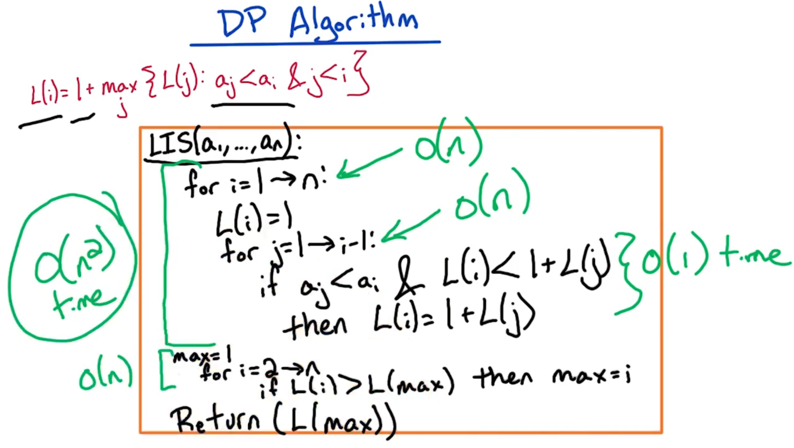{ width=650px }

The outer $\text{for}$ loop varies over $n$ elements with corresponding running time of $O(n)$ . Furthermore, the nested $\text{for}$ loop similarly varies over at most $O(n)$ elements. Within the nested for loop, each $\text{if\ }\ldots$ statement takes and order of $O(1)$ running time. Therefore, the overall running time of the nested $\text{for}$ loops is $O(n^2)$ .

Furthermore, the subsequent $\text{for}$ loop for determining $L(\max)$ has a running time of $O(n)$ .

Therefore, the overall running time is $O(n^2)$ , as dominated/determined by the first set of nested $\text{for}$ loops.

### 14. Recap

{ width=650px }

This completes the formulation of our dynamic programming algorithm and the analysis of its running time. Now, let us consider/review some ***important aspects*** of the algorithm design.
  * The first step of the algorithm design process was to define the algorithm in words, i.e., expressing $L(i)$ in terms of words.
    * Our initial attempt (cf. Section 8) used the prefix of the input, in order to find the longest-increasing subsequence on the first $i$ elements of the array $L$ .
  * Next, the second step is to find a recurrence relation that the solution's sub-problems satisfy.
    * In the initial attempt (cf. Section 9), the resulting recurrence relation was inadequate. To rectify this, we returned to the first step and reformulated the sub-problem definition (cf. Section 10), wherein an extra condition was added which consequently yielded the corresponding recurrence for the sub-problems, defined there as:

  $$
  L(i) = 1 + \mathop {\max }\limits_j \big\{ {L(j):{a_j} < {a_i}{\text{ and }}j < i} \big\}
  $$

Furthermore, consider the ***intuition*** for why we wanted to strengthen the sub-problem definition.
  * Recall (cf. discrete mathematics prerequisite course, or equivalent) that when attempting to prove some statement by **induction**, you first begin by stating the inductive hypothesis (typically having the same form as the statement to be proved). 
  * Then, you attempt to prove that hypothesis by using induction, however, occasionally this yields difficulties. To rectify this, you go back and alter the inductive hypothesis; typically, this involves strengthening the inductive hypothesis by adding ***extra conditions*** to it (e.g., in the case of the present algorithm, adding the extra condition that the sub-problem $L(i)$ must also *include* $a_i$ itself).
  * From there, you strengthen the inductive hypothesis and consequently prove that stronger statement (e.g., finding the length of the longest-increasing subsequence with a specific element at the end).
  * Using the solution to this stronger problem, we can then solve the weaker problem (e.g., without particular concern to the identity of the ending element itself).

Therefore, a lot of the intuition for dynamic programming originates from ideas in induction proofs.

## Longest Common Subsequence (LCS)

### 15. Introduction

> [!NOTE]
> ***Instructor's Note***: Notes [DP Part 1](https://cs6505.wordpress.com/schedule/dp-1/)

{ width=650px }

The next dynamic programming example is the **longest common subsequence** (**LCS**) problem.

The ***input*** to the problem is two strings denoted as $X = x_1 \cdots x_n$ and $Y = y_1 \cdots y_n$ , which for simplicity (for now) are assumed to be of equal lengths $n$ .

The ***goal*** is to find the *length* of the longest string which is a subsequence (*not* a substring) of *both* $X$ and $Y$ .
  * Furthermore, with this length determined, it is possible to determine the corresponding substring appearing in the subsequence, which will also be demonstrated.

### 16. Example Quiz and Answers

> [!NOTE]
> ***Instructor's Note***: Enter the length of the Longest Common Subsequence (as an integer), not the string itself.

Consider an example of the longest-common subsequence problem, in order to become more familiarized with the corresponding terminology.

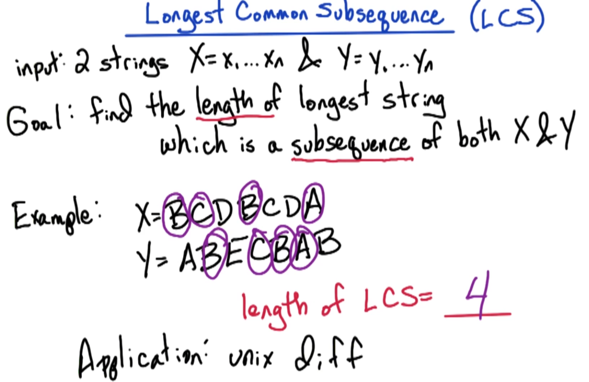{ width=650px }

Consider the following two strings, both of length $7$ :

$$
X=BCDBCDA
$$

$$
Y=ABECBAB
$$

What is the longest-common subsequence (LCS), and what is its corresponding length?

The corresponding solution is substring $BCBA$ having length $4$ .

The main motivation of this example is to demonstrate another variation of the dynamic programming approach. Furthermore, this simple problem is used in the Unix-based application `diff`, which compares differences between two inputs (e.g., files' respective contents).

### 17-19 Attempt 1

#### 17. Sub-Problem

Let us consider again the two-step process for defining the dynamic programming algorithm for this problem, the longest-common subsequence (LCS).

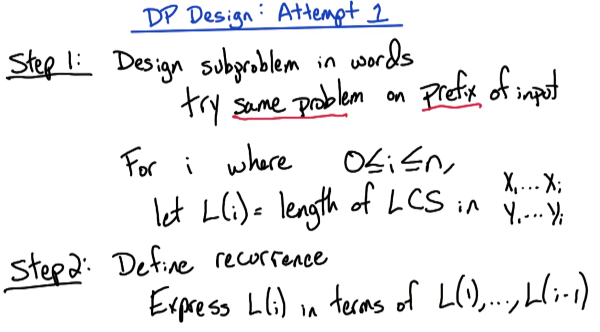{ width=650px }

The first step is to define the ***sub-problem***, in words (cf. Sections 5 and 8). Generally, the first attempt is to always try to devise the sub-problem as the *same* problem on a ***prefix*** of the input. Therefore, the ***key*** is to perform the *identical* problem, but only on a prefix of it (i.e., from length $n$ reduced to some smaller, intermediate length $i$ ). Formally, this can be stated as:

> For $i$ where $0\le i \le n$ , let $L(i)$ = the length of the longest-common subsequence (LCS) in $x_1 \cdots x_n$ and $y_1 \cdots y_n$ .

The second step is to define the ***recurrence***. We want to express $L(i)$ in terms of $L(1), \dots, L(i-1)$ , as discussed next.

#### 18. Recurrence

{ width=650px }

Let us detail the sub-problem definition proposed previously (cf. Section 17):

> For $i$ (the prefix length) where $0 \le i \le n$ , let $L(i)$ = length of the longest-common subsequence (LCS) in prefixes $x_1 \cdots x_i$ and $y_1 \cdots y_i$

***N.B.*** This is analogous to the original problem, except that here the sub-problem is specified as *prefixes* of the respective inputs. Furthermore, $L(i)$ does not store the subsequence itself, but rather only its *length* (here, we want the table to store a number, or true/false).

Now, recalling (cf. Section 16) the previous example:

$$
X=BCDBCDA
$$

$$
Y=ABECBAB
$$

we would like to express a recurrence relation $L(i)$ such that $L(i)$ is defined in terms of smaller sub-problems $L(i), \dots, L(i-1)$ .

In order to yield such a smaller sub-problem, consider the last character in each string, i.e.,:

$$
X=\cdots A
$$

$$
Y=\cdots B
$$

Given these last characters, we will examine how $x_i$ and $y_i$ (respectively) are used in the solution of $L(i)$ , and then we can use the solution to the subproblem of size $i-1$ (i.e., $L(i-1)$ ). We then take the optimal solution for the subproblem of size $i-1$ and then we append on the solution for $x_i$ and $y_i$ .

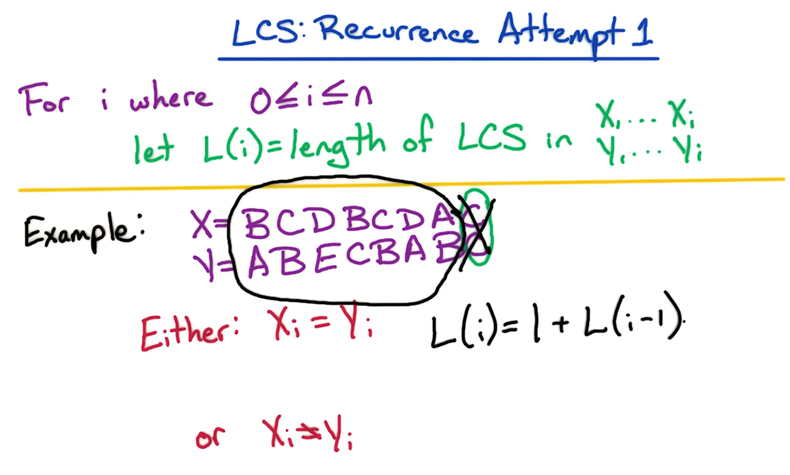{ width=650px }

Proceeding in this manner, there are ***two cases*** two consider:
  * 1 - The last characters are the *same* (i.e., $x_i = y_i$ )
  * 2 - The last characters are *different* (i.e., $x_i \ne y_i$ )

Consider the first case first, which turns out to be the relatively easier case. Let us modify the example accordingly as follows (i.e., with both strings terminating in character $C$ ):

$$
X=BCDBCDAC
$$

$$
Y=ABECBABC
$$

When both ending characters are the same, we know that the longest-common subsequence (LCS) must end in this same character as well.
  * ***N.B.*** Why is this necessarily true? Consider a longest-common subsequence (LCS) for which this last character is *not* included. If that is the case, then this last character can be appended to such a subsequence, thereby yielding a *longer* subsequence accordingly. Therefore, it must be necessarily true that the *longest* subsequence contains this last character.

Therefore, in the case where the last character is equal in both strings, we can define $L(i)$ as follows:

$$
L(i) = 1 + L(i-1)
$$

where the first term accounts for the (common) last character, appended onto the longest-common subsequence (LCS) of length $L(i-1)$ in the prefix subsequence. Observe that this constitutes a recurrence relation accordingly (i.e., $L(i)$ expressed in terms of $L(i-1)$ ).

Next, consider the case where $x_i \ne y_i$ .

#### 19. Recurrence Problem

Consider the case when the last characters of the two input strings are different (i.e., $x_i \ne y_i$ ), returning to the previous example (cf. Section 18) as follows:

$$
X=BCDBCDA
$$

$$
Y=ABECBAB
$$

In this particular example, there are three possibilities for the last character:
  * $A$ (via $x_i$ ),
  * $B$ (via $y_i$ ), or
  * neither.

##### Case A: The last character is $x_i$

{ width=650px }

Suppose the first case holds, whereby the last character is $A$ (i.e., $x_i$ ). In string $Y$ , the last character $B$ is eliminated by default, since its matches in $X$ have been exhausted by that point.

##### Case B: The last character is $y_i$

{ width=650px }

By similar rationale, in the second case, wherein the last character is $B$ (i.e., $y_i$ ), then in string $X$ , the last character $A$ (as well as the other preceding characters back to the last-occurring $B$ in string $X$ ) is eliminated by default, due to exhaustion of corresponding matches in $X$ .

##### Case C: The last character is neither $x_i$ nor $y_i$

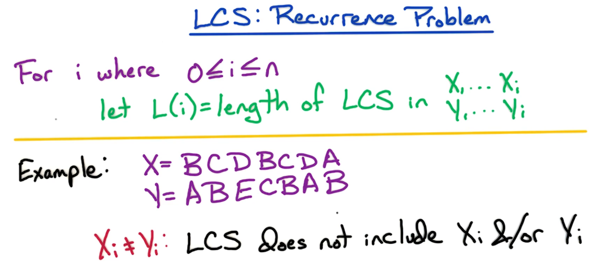{ width=650px }

Finally, in the third/final case, wherein the last character matches neither $A$ nor $B$ (i.e., neither $x_i$ nor $y_i$ , respectively).

##### Defining the recurrence (a problem!)

Now, consider how we might express $L(i)$ for these three cases.

{ width=650px }

In the case where neither $x_i$ nor $y_i$ are the last character, this simply omits the corresponding $1$ count in $L(i)$ relative to the corresponding expression for $x_i = y_i$ (cf. Section 18), since the character in question is not a contributor to the length, i.e.,:

$$
L(i) = \cancel{{1}}+L(i - 1)
$$

{ width=650px }

In the case where $y_i$ is the last character (i.e., $x_i$ is dropped), an ***ambiguity*** arises: $X$ now has a prefix length of $i-1$ , whereas $Y$ has a prefix length of $i$ . Therefore, there is no (unambiguous) way to find the corresponding value in table $L(i)$ , i.e., the solution does not exist there, because the candidates prefix strings $X$ and $Y$ are of *different* lengths.

Furthermore, even if the length were determinate in terms of how the last characters in the resulting prefix strings matched (e.g., $B$ of $y_i$ matching with the fourth character $B$ in $x_i$ in this particular example), this would still result in inconsistent prefix lengths (i.e., length $3$ for prefix $X$ vs. length $7$ for prefix $Y$ via match on character $B$ ).

{ width=650px }

By symmetrical reasoning, with $x_i$ as the last character (and $y_i$ correspondingly dropped), this similarly yields unequal lengths in the resulting prefix strings (i.e., $7$ and $6$ for $X$ and $Y$ , respectively, if matching on last character $A$ ), giving rise to an ambiguous match in the table $L(i)$ accordingly. Therefore, in this case, a corresponding lookup would require searching for the longest-common subsequence (LCS) in $x_1 \cdots x_i$ and separately in $y_1 \cdots y_{i-1}$ accordingly. Proceeding in this manner will also yield further asymmetries in the resulting prefix strings.

{ width=650px }

Therefore, for the sub-problem definition given as follows (cf. Section 18):

> For $i$ where $0\le i \le n$ , let $L(i)$ = the length of the longest-common subsequence (LCS) in  $x_1 \cdots x_i$ and $y_1 \cdots y_i$ .

it is not possible to (unambiguously) define a corresponding recurrence (i.e., expressing $i$ in terms of smaller sub-problems). However, the preceding discussion did provide some insight into what constitutes a potential ***valid*** sub-problem definition: The difficulty which arises is due to the generally ***varying*** prefix lengths of the input strings.

Therefore, to reconcile this impasse, we ***modify*** our sub-problem definition as follows:

> For $i$ where $0\le i \le n$ and $j$ where $0\le j \le n$ , let $L(i, j)$ = the length of the longest-common subsequence (LCS) in $x_1 \cdots x_i$ and $y_1 \cdots y_j$ .

Here, the single parameter $i$ is now expanded to parameters $i$ and $j$ , and correspondingly the one-dimensional table $L(i)$ is now expanded to a two-dimensional table $L(i, j)$ in order to accommodate the possibility of variably sized prefix strings.

### 20-24. Attempt 2

#### 20. Sub-Problem

{ width=650px }

Let us now revise our sub-problem definitions with the insight from the first attempt; recall (cf. Section 19) that these insights were as follows:
  * The two prefix strings are independently indexed as $i$ (prefix in string $X$ ) and $j$ (prefix in string $Y$ )
  * The resulting table is two-dimensional (i.e., $L(i, j)$ )
    * cf. In previous examples, tables were generally one-dimensional up to this point

Therefore, formalizing the sub-problem definition gives the following:

> For $i$ and $j$ where $0 \le i \le n$ and $0 \le j \le n$ , let $L(i, j)$ = length of the longest-common subsequence (LCS) in $x_1 \cdots x_i$ and $y_1 \cdots y_j$ .

With this new sub-problem definition, the corresponding ***recurrences*** can be defined with the following ***base cases***:
 * $L(i, 0) = 0$
 * $L(0, j) = 0$

Intuitively, in these cases, the prefix string for the longest-common subsequence (LCS) has trivial length $0$ .

Next, we will consider the ***recursive cases***.

#### 21-23. Recurrence

##### 21. Unequal Case

Given the new sub-problem definition (cf. Section 20), now consider defining the corresponding recurrence relation, starting with the case of unequal last characters in the respective prefix strings (i.e., $x_i \ne y_j$ ).

{ width=650px }

For this purpose, we return to the example from previously (cf. Section 19):

$$
X=BCDBCDA
$$

$$
Y=ABECBABD
$$

***N.B.*** Here, to make the strings of unequal length, character $D$ is appended to the end of $Y$ (relative to previously).

The ***key insight*** is that if the last characters are unequal, then the last character in the optimal-length longest-common subsequence (LCS) ends in either $x_i$ , $y_j$ , or neither.
  * If neither, then the respective last characters can be dropped from both prefix strings. 
  * Therefore, there are only two additional cases to consider: Dropping either $x_i$ *or* $y_j$ , and consequently taking one of these results as the optimal one.

{ width=650px }

Following this approach, the respective recurrence relations can be correspondingly defined as follows:
  * If dropping $x_i$ , then $L(i, j) = L(i-1, j)$
  * If dropping $y_j$ , then $L(i, j) = L(i, j-1)$

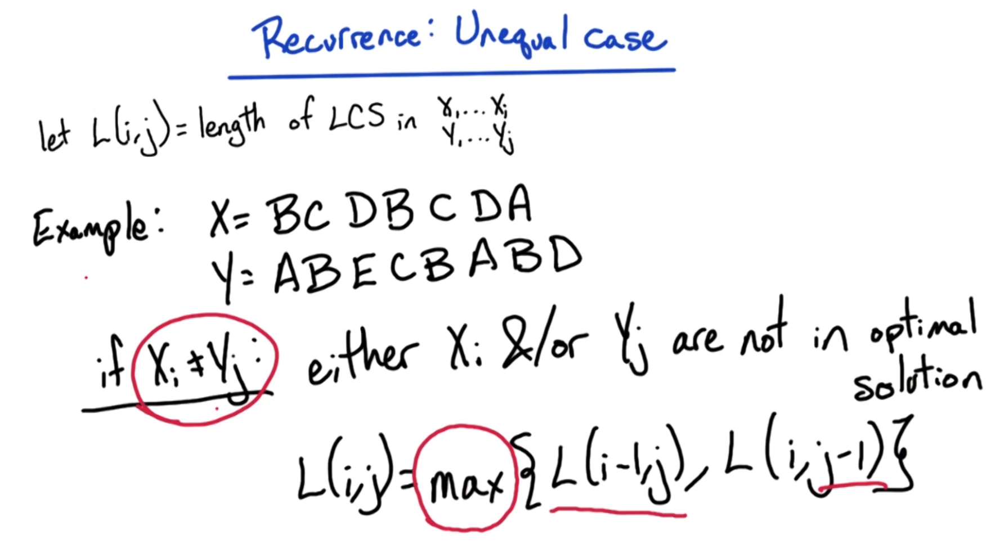{ width=650px }

So, then, how to determine which of these is the most optimal of the two? This is simply follows directly from whichever of the two is *longer*, i.e.,:

$$
L(i,j) = \max \big\{ L(i-1,j), L(i, j-1) \big\}
$$

This constitutes the recurrence relation for the case where $x_i \ne y_j$ . Next, we consider the case where $x_i = y_j$ .

##### 22-23. Equal Case

###### 22. Overview

Now consider defining the recurrence relation for the case of equal last characters in the respective prefix strings (i.e., $x_i = y_j$ ).

{ width=650px }

For this purpose, we return to the example from previously (cf. Section 19):

$$
X=BCDBCDA
$$

$$
Y=ABECBA
$$

***N.B.*** Here, to make the strings of unequal length but of equal last character (i.e., $A$ ), character $B$ is truncated from the end of $Y$ (relative to previously).

Here, there are three possibilities to consider for the optimal-length solution to the longest-common subsequence (LCS):
  * drop $x_i$ ,
  * drop $y_j$ (which is equivalent to previous, given that $x_i = y_j$ ), or
  * ends at $x_i = y_j$
    * ***N.B.*** This is a distinctly different consideration from the previous scenario of $x_i \ne y_j$ (cf. Section 21)

Proceeding similarly to before as in the case of $x_i \ne y_j$ (cf. Section 21), we will consider these three cases, taking the "best" (longest-length) of the three:
  * If dropping $x_i$ , then $L(i, j) = L(i-1, j)$
  * If dropping $y_j$ , then $L(i, j) = L(i, j-1)$
  * If $x_i = y_j$ , then $L(i,j) = 1 + L(i-1, j-1)$
    * In this case (i.e., $x_i = y_j$ ), the first term $1$ represents the common character. Furthermore, this common last character is correspondingly dropped, with the optimal solution taken as the resulting smaller prefix $L(i-1, j-1)$ .

###### 23. Recap

Let us recap the case where $x_i = y_j$ .

{ width=650px }

This case results in three possibilities (cf. Section 22), which can be expressed/consolidated as follows:

$$
L(i,j) = \max \big\{ L(i-1,j), L(i,j-1), 1 + L(i-1,j-1) \big\}
$$

An astute observer will likely note that only the last case is relevant here, since it will necessarily be the longest of the three; therefore, this simplifies to:

$$
L(i,j) = 1 + L(i-1,j-1)
$$

Consider a brief ***intuition*** for why this is necessarily always the case. Consider again (cf. Section 22) the present example:

$$
X=BCDBCDA
$$

$$
Y=ABECBA
$$

If the optimal solution does not contain this last character (i.e., $A$ ), then it could otherwise be appended to the longest-common subsequence (LCS), thereby yielding a longer prefix (and thus the candidate in question was sub-optimal to begin with). Therefore, it is necessarily true that the longest-common subsequence (LCS) must include either $x_i$ or $y_j$ (but *not* neither).

{ width=650px }

It may also be the case that $x_i$ matches with some earlier/non-last occurrence of the character in string $Y$ (e.g., $A$ of $x_i$ matching $y_1$ in the figure shown above). However, any case in which the last character matches an earlier occurrence of the character in the other candidate string would still otherwise be consistent with matching the same-occurring last character (i.e., any such subsequence occurs in the larger subsequence with the longest-matching last character regardless). Consequently, the expression $L(i-1,j-1)$ is comprehensively encompassing of these potential "shorter" (i.e., "earlier-matching") subsequences.

#### 24. Recurrence Summary

Let us now summarize the recurrence relation for the longest-common subsequence (LCS) problem.

{ width=650px }

For the case of two non-empty input strings (i.e., $i \ge 1$ and $j \ge 1$ ), recurrence relation for the ***recursive cases*** is defined as follows:

$$
L(i,j) = 
\begin{cases}
  {\max \big\{ {L(i - 1,j),L(i,j - 1)} \big\}}&{{\text{if\ }}{x_i} \ne {y_j}}\\ 
  {1 + L(i - 1,j - 1)}&{{\text{if\ }}{x_i} = {y_j}} 
\end{cases}
$$

In the case where $x_i = y_j$ (i.e., the *same* last character), the resulting length is simply the sum of $1$ (the last character in question) and the correspondingly reduced prefix strings (i.e., of lengths $-1$ ).

In the case where $x_i \ne y_j$ (i.e., *different* last characters), this gives rise to two scenarios:
  * drop the last character from $x_i$ (i.e., $L(i-1,j)$ ), or
  * drop the last character from $y_i$ (i.e., $L(i, j-1)$ )

with the optimal being the longer of the two (i.e., $\max$ { $\cdots$ } ).

Otherwise, recall (cf. Section 20) that the ***base cases*** are as follows:
  * $L(i, 0) = 0$
  * $L(0, j) = 0$

In a two-dimensional array $L(i, j)$ filled out row-wise (i.e., increasing $i$ and increasing $j$ directions), at some arbitrary entry $i, j$ , this definition corresponds the following "directions" (as in the figure shown above):
  * diagonal $\nwarrow$ , $L(i-1,j-1)$
  * directly above $\uparrow$ , $L(i,j-1)$
  * directly left $\leftarrow$ , $L(i-1,j)$

***N.B.*** Populating the table in such a row-wise manner ensures that this entry $i, j$ will be well-defined.

Now, we can finally state the dynamic programming algorithm, as will be done next.

### 25. Dynamic Programming Algorithm

#### Pseudocode

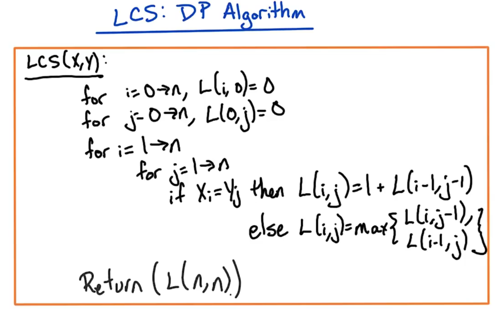{ width=650px }

The pseudocode for the dynamic programming algorithm for the longest-common subsequence (LCS) problem is given as follows:

$$
\boxed{
\begin{array}{l}
{{\text{LCS}}(X,Y):}\\
\ \ \ \ {{\text{for\ }} i=0 \to n},\ L(i,0)=0\\
\ \ \ \ {{\text{for\ }} j=0 \to n},\ L(0,j)=0\\
\ \ \ \ {{\text{for\ }} i=1 \to n}\\
\ \ \ \ \ \ \ \ {{\text{for\ }} j=1 \to n}\\
\ \ \ \ \ \ \ \ \ \ \ \ {{\text{if\ }} x_i = y_j {\text{\ then\ }} L(i,j) = 1 + L(i-1,j-1)}\\
\ \ \ \ \ \ \ \ \ \ \ \ {{\text{else\ }} L(i,j) = \max \big\{ L(i,j-1), L(i-1, j) \big\}}\\
\ \ \ \ {{\text{return\ }} (L(n,n))}
\end{array}
}
$$

Here, $X$ and $Y$ are the two input strings.

First, the base cases are defined (i.e., zero-initializing the top row and first column).

Next, the table $L(i,j)$ is populated on a row-increasing basis via the recursive cases, with consideration for two scenarios:
  * If the current last characters are equal ($x_i = y_j$ ), then the common last character is appended to the optimal solution, and then the solution recurses "diagonally"
  * Otherwise if the current last characters are not equal ($x_i \ne y_j$ ), then the optimal solution takes the greater of the two lengths and recursing accordingly (i.e., upwards if dropping $y_j$ , or otherwise to the left if dropping $x_i$ )

Finally, the optimal length is returned in the entry $L(n,n)$ , the bottom-right entry of the table, which constitutes the longest-common subsequence (LCS) of the two input strings.

#### Running Time Quiz and Answers

{ width=650px }

Consider the running time for the dynamic programming algorithm for the least-common subsequence (LCS) problem.

Each initializing $\text{for\ } \dots$ loop has a running time of $O(n)$ .

In the subsequently nested $\text{for\ } \dots$ loops, each have a running time of $O(n)$ and perform an inner operation (i.e., update of $L(i,j)$ ) having a running time of $O(1)$ . Due to the nesting, this yields an overall running time of $O(n^2)$ for the nested $\text{for\ } \dots$ loops. Furthermore, this running time dominates the algorithm, therefore comprising its overall total running time accordingly.

This concludes analysis of the longest-common subsequence (LCS) algorithm. This particular algorithm was interesting, due to its requirement of a two-dimensional table $L(i, j)$ , in order to accommodate the fact that in general the prefix strings at any given intermediate result may be of unequal length and/or having unequal last characters.

### 26-27. Dynamic Programming Table

#### 26. Dynamic Programming Table Quiz and Answers

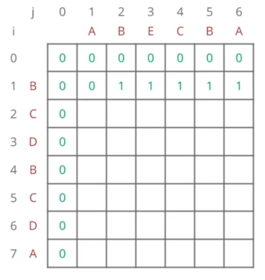{ width=350px }

Given the dynamic programming algorithm for the longest-common subsequence (LCS) problem, consider the corresponding (partially filled) ***table*** as in the figure shown above, for the previous example (cf. Section 22) having the following input strings:

$$
X = BCDBCDA
$$

$$
Y = ABECBA
$$

Complete the rest of the table accordingly.

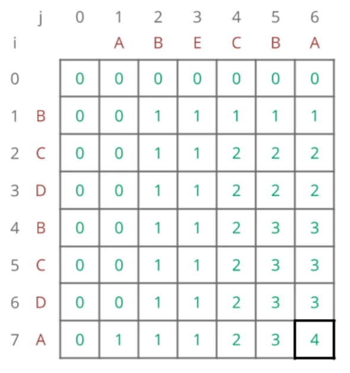{ width=350px }

The figure shown above is the resulting completed table.

As the table indicates, the longest-common subsequence (LCS) has length $4$ (per entry $L(n,n)$ in the bottom-right corner).

#### 27. Extract Sequence Quiz and Answers

Given the completed dynamic programming table (cf. Section 26), now consider how to extract the corresponding longest-common subsequence (LCS).
  * ***N.B.*** As a hint, start with the last matching cell.

{ width=650px }

As in the figure shown above, tracing back from the last matching cell, this yields the corresponding longest-common subsequence $BCBA$ for this example.

### 28-30. Addendum: Practice Problems

#### 28. Overview

At this point, it is advisable to perform some practice problems in dynamic programming.

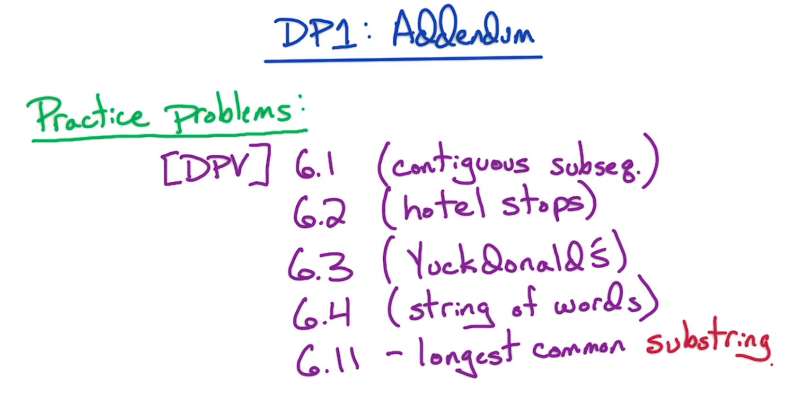{ width=650px }

The instructor recommends the following practice problems from the course companion textbook *Algorithms* by Dasgupta et al.:
  * 6.1 - find the contiguous subsequence of maximum sum
    * ***N.B.*** A contiguous subsequence is equivalent to a substring (cf. Section 7)
  * 6.2 - hotel stops with minimal penalty
  * 6.3 - Yuckdonald's
  * 6.4 - break up a string into words
  * 6.11 - longest-common subsequence (LCS)
    * This topic was already covered in the current lesson, however, also consider practicing the variant of a longest-common *substring*, which demonstrates variants (i.e., subsequence vs. substring) in how the dynamic programming algorithm is applied

***N.B.*** In general, the suggested practice problems in the lectures will be accompanied by a short descriptor, in order to disambiguate among potential numbering discrepancies across textbook versions.

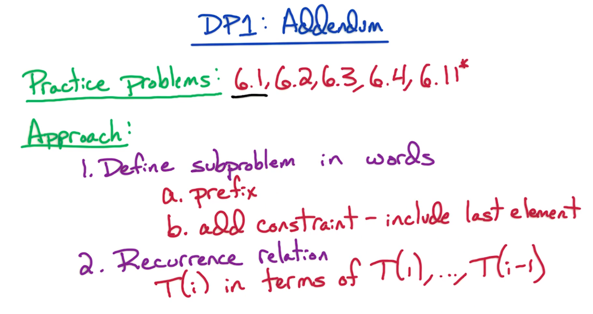{ width=650px }

Now, consider a summary of the general ***approach*** when solving dynamic programming algorithm problems.

The first step is to define the sub-problem in words.
  * Begin with the original problem, and devise a ***prefix*** (i.e., indexed as $i$ , or equivalent) having the same general form as the original input

The next step is to define a recurrence relation. 
  * For a problem involving a one-dimensional table, express entry $T(i)$ in terms of smaller sub-problems $T(i), \dots, T(i-1)$ .

In certain problems (e.g., longest-increasing subsequence [LIS]), these steps may be insufficient to adequately devise the corresponding algorithm. In this case, revisit the first step and redefine/strengthen the sub-problem, by correspondingly adding a ***constraint*** (which typically involves somehow ***including*** the last element in the recurrence-relation definition for the sub-problem itself).
  * ***N.B.*** One thing to keep in mind is that typically when adding such a constraint to the sub-problem, whereby consequently the final output is no longer necessarily the last element of the table, this will additionally require a traversal over the entire table via $\max$  { $\cdots$ } or $\min$  { $\cdots$ } in order to further identify the corresponding optimum.

Let us now demonstrate this via Dasgupta Practice Problem 6.1 accordingly.

#### 29-30. Practice Problem 6.1

##### 29. Problem

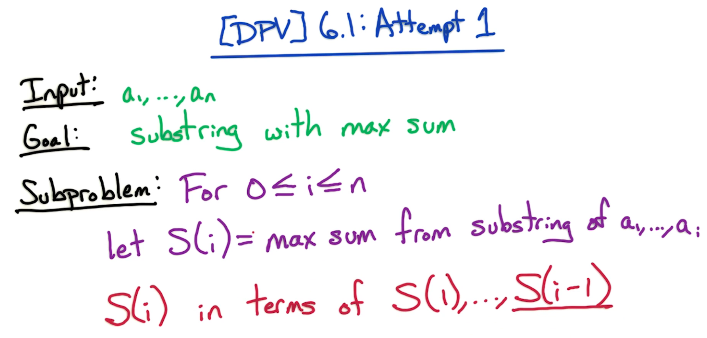{ width=650px }

The ***input*** to this problem is the numeric sequence $a_1, \dots, a_n$ .

The ***goal*** of the problem is to find a contiguous subsequence (or equivalently a substring) with a maximum sum.

Let us now attempt to define the ***sub-problem***. We can attempt the same problem on a prefix of the input via corresponding prefix parameter $i$ , which varies as $0 \le i \le n$ . We can then define the sub-problem in words as follows:

> Let $S(i)$ = max sum from a substring of $a_1, \dots, a_i$

***N.B.*** Here, "max sum" is the original problem, and the substring $a_1, \dots, a_i$ is a prefix of the input $a_1, \dots, a_n$ .

Now, we attempt to define a recurrence relation, whereby $S(i)$ is defined in terms of smaller sub-problems $S(1), \dots, S(i-1)$ . Consider $S(i-1)$ , which is the max sum obtained from a substring of $a_1, \dots, a_i$ . There are now two possibilities to consider:
  * append $a_i$ to the end of this substring, or
  * do not append $a_i$ to the end of the substring

Given that the substring must be contiguous, it is indeterminate a priori whether or not it is necessarily/generally appropriate to append $a_i$ to the substring. Therefore, it must be further determined where $S(i-1)$ ends in order to make this determination more definitively; however, this is not possible with the current definition of $S(i)$ . Nevertheless, a resolution for this would be feasible if it were known whether or not the expression for $S(i)$ contains $a_{i-1}$ , thereby allowing to make the determination of inclusion/exclusion of $a_i$ accordingly. Therefore, it is necessary to revisit the sub-problem definition for $S(i)$ , in order to strengthen it accordingly, as discussed next.

##### 30. Solution

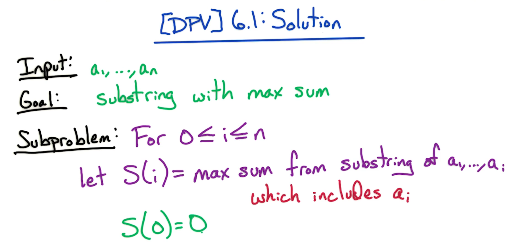{ width=650px }

To solve Practice Problem 6.1, let us reformulate the sub-problem per the insight gained in defining the initial approach (cf. Section 29). We correspondingly redefine the (stronger) sub-problem with an extra restriction as follows:

> Let $S(i)$ = max sum from a substring of $a_1, \dots, a_i$ , which ***includes*** $a_i$

Now, we can express the recurrence for $S(i)$ accordingly.

The ***base case*** is simply $S(0) = 0$ , the trivial result for an empty input string.

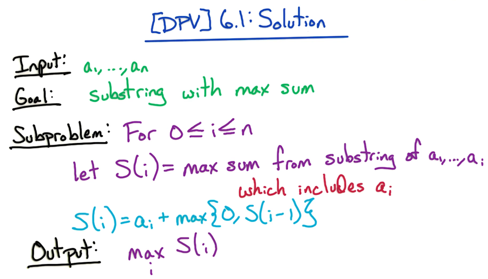{ width=650px }

The ***recursive cases*** require use of $a_i$ in the definition of $S(i)$ (i.e., $S(i) = a_i + \cdots$ ), as we determined. Furthermore, appended to this are two possibilities:  
  * $a_i$ by itself, or
  * the max sum of the prefix substring $S(i-1)$

Summarizing these observations yields the following:

$$
S(i) = a_i + \max \big\{ 0, S(i-1) \big\}
$$

***N.B.*** As expressed here, if $S(i-1) < 0$ , then $\max$ { $\cdots$ } simply calculates $S(i)$ as $S(i) = a_i + 0 = a_i$ .

Given this definition, the corresponding ***table*** $S(i)$ can be readily populated accordingly for $0 \le i \le n$ .

The final ***output*** of the algorithm is not necessarily $S(n)$ (the longest max-sum substring which *includes* $a_n$ ), but rather we are looking for the max sum for *any* arbitrary substring (which may or may not include the last element, $a_n$ ). Therefore, this can be determined simply as follows:

$$
\mathop {\max }\limits_i \big\{ {S(i)} \big\}
$$

To determine the ***running time*** for this algorithm, each entry into the table requires a running time of $O(1)$ (via corresponding comparison $\max$ { $0, S(i-1)$ }), and a maximum of $n$ such entries are performed; therefore, the overall running time is $O(n)$ .

# Dynamic Programming 2: Knapsack, Chain Multiply

## Knapsack Problem

### 1. Introduction

> [!NOTE]
> ***Instructor's Note***: See [DPV] Chapter 6.4 (Knapsack) and Eric's notes [DP Part 2](https://cs6505.wordpress.com/schedule/dp-part-ii/)

The next problem under consideration is the knapsack problem.

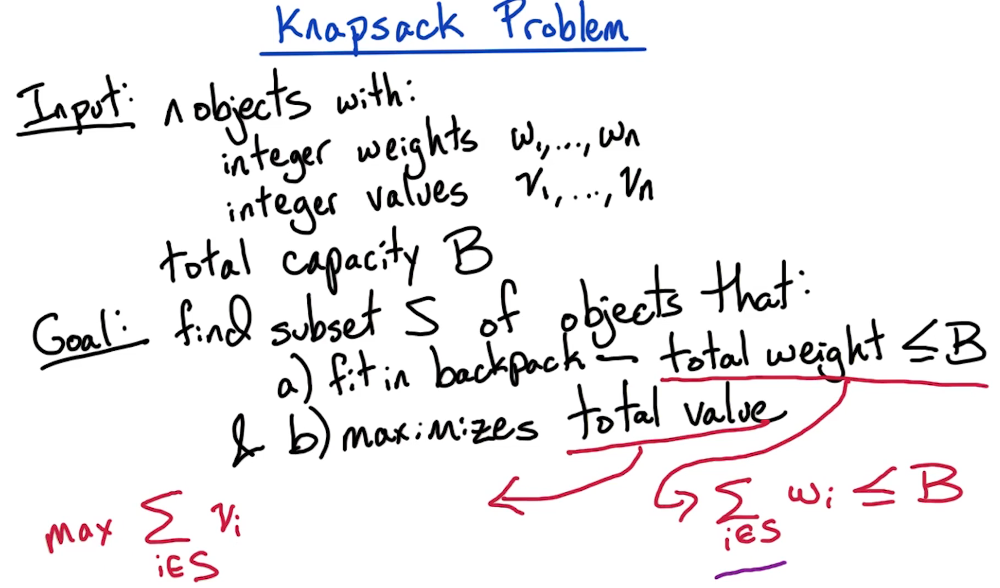{ width=650px }

In the knapsack problem, the ***input*** is $n$ objects, each characterized by the following (integer) values:
  * integer weights: $w_1, \dots, w_n$
  * integer values: $v_i, \dots, v_n$
  * total weight capacity of the knapsack: $B$

The corresponding ***goal*** in this problem is to find subset $S$ among these objects which satisfies the following requirements:
  * the objects fit in the knapsack, i.e., total weight $\le B$
  * the value of the selected subset of objects is maximized

We can restate these goals in more mathematically precise terms as follows (respectively):

$$
\sum\limits_{i \in S} {\big[ {{w_i} \le B} \big]}
$$

$$
\max \big\{ {\sum\limits_{i \in S} {{v_i}} } \big\}
$$

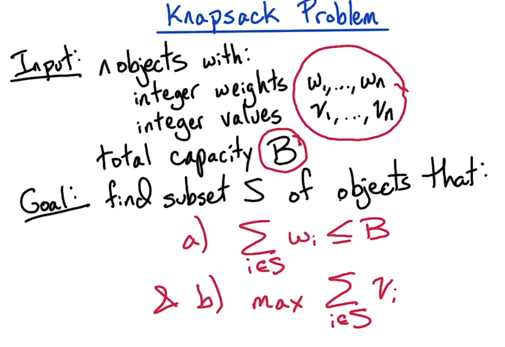{ width=650px }

Let us further summarize the problem to reinforce understanding of it. Given (integer) inputs for weights $w_i, \dots, w_n$ , values $v_i, \dots, v_n$ , and total knapsack capacity $B$ , the corresponding goal is to find a subset of objects (i.e., among those given from $i$ to $n$ ) such that this subset fits in the knapsack (i.e., relative to its total capacity $B$ ), in such a manner that the corresponding value of this subset of objects is maximized (i.e., per corresponding total value of constituent values $v_i, \dots, v_n$ ).

***N.B.*** A notable application of this problem include scheduling jobs given limited computation-time resources. Furthermore, it serves as a representative example of another style of problem that can be solved effectively with a dynamic programming algorithm.

### 2. Problem Variants

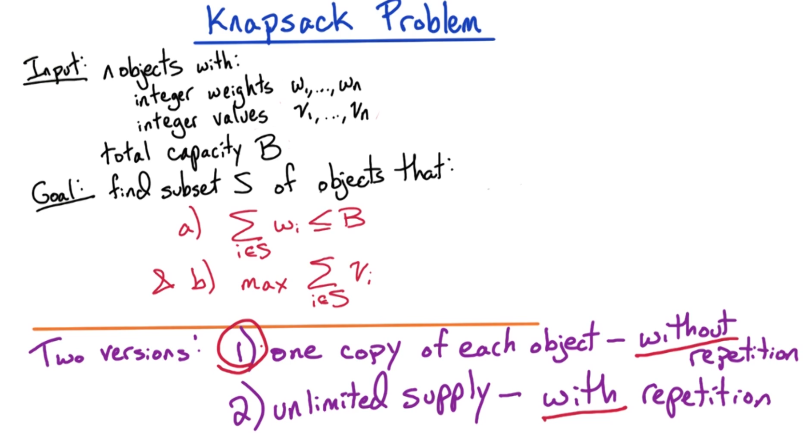{ width=650px }

There are two natural variants of the knapsack problem, with each having a corresponding dynamic programming solution (and thus it is useful to examine both accordingly):
 * 1 - In the first version, there is *one* copy of each object, i.e., determining the corresponding solution comprised of object subsets *without* repetition
 * 2 - In the other version, there is an *unlimited* supply of each object in order to satisfy the goal/constraints of the problem, including *with* repetition of objects (i.e., a resulting multi-set solution) if applicable

Our discussion will begin with the first version, and then proceed onto the other.

### 3-9. First Variant: Knapsack Problem without Repetition

#### 3. Greedy Algorithm Quiz and Answers

To motivate discussion of the dynamic programming solution, first consider a greedy algorithm approach to this problem (which yields a corresponding pitfall, as will be demonstrated shortly). 

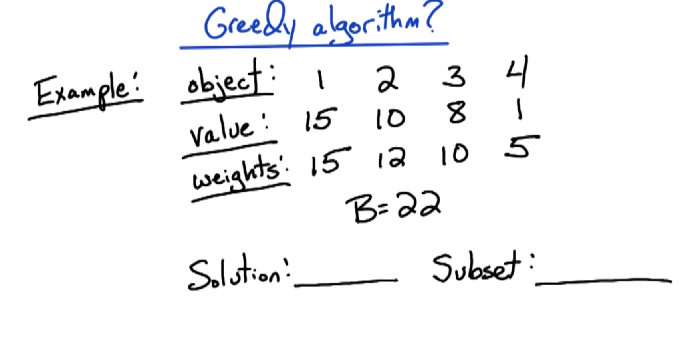{ width=650px }

Consider the inputs comprised of the following:

| Object | Value | Weight |
|:--:|:--:|:--:|
| $1$ | $15$ | $15$ |
| $2$ | $10$ | $12$ |
| $3$ | $8$ | $10$ |
| $4$ | $1$ | $5$ |

Furthermore, the total weight capacity of the knapsack is $B = 22$ .

Now, consider how to achieve the optimal solution using a greedy approach.

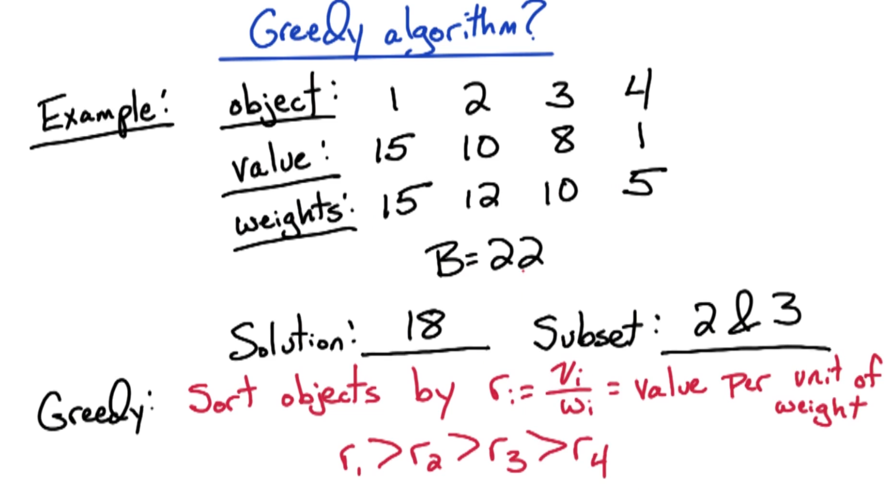{ width=650px }

By inspection, the maximum value obtained is $18$ via objects subset { $2, 3$ }.

In a greedy approach, we start with the most valuable object, and proceed accordingly to the next-most-valuable object, etc. To express "most valuable" in this manner, we consider the value per unit of weight (i.e., $r_i = \tfrac{v_i}{w_i}$ ), as follows:

| Object | Value | Weight | Ratio |
|:--:|:--:|:--:|:--:|
| $1$ | $15$ | $15$ | $1$ |
| $2$ | $10$ | $12$ | $0.83$ |
| $3$ | $8$ | $10$ | $0.8$ |
| $4$ | $1$ | $5$ | $0.2$ |

Therefore, here, $r_1 > r_2 > r_3 > r_4$ .

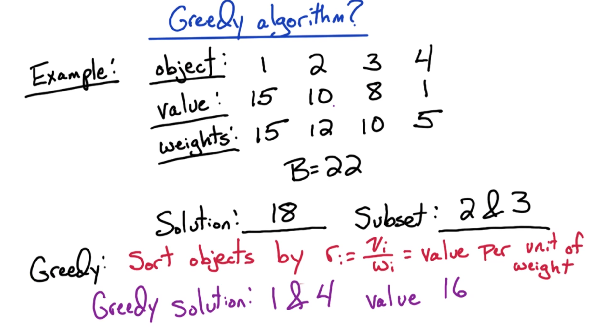{ width=650px }

However, following this greedy approach, the corresponding (sub-optimal) solution yields objects subset { $1, 4$ } having total value $16$ (obtained by starting with the "most valuable" object $1$ having weight $15$ , which then leaves a remaining capacity of $22 - 15 = 7$ in the knapsack, satisfied by the next-most-valuable object subject to these constraints, object $4$ having weight $5$ ), which is less than the maximum-possible total value for this example (cf. $18$ ).

This example demonstrates why the greedy approach ***fails***: Selecting the initially most valuable object exhausts the remaining/residual capacity of the knapsack in such a manner which induces subsequently sub-optimal selection. In this case, the optimal solution is obtained by skipping this most valuable object and instead selecting a different subset among the remaining objects, which correspondingly yield a higher overall value.

We will now proceed onto devising a more optimal dynamic programming solution.

#### 4-5. Attempt 1

##### 4. Sub-Problem

> [!NOTE]
> ***Instructor's Note***: See [DPV] Chapter 6.4 (Knapsack) and Eric's notes [DP Part 2](https://cs6505.wordpress.com/schedule/dp-part-ii/)

Recall (cf. Dynamic Programming 1, Section 8) the basic process for devising a dynamic programming algorithm.

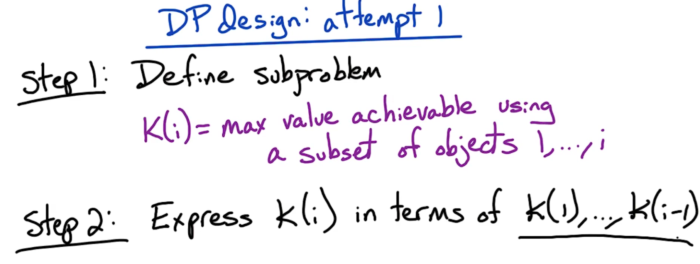{ width=650px }

First, we define the sub-problem in words. The first attempt typically involves defining the *same* problem on a *prefix* of the input. Therefore:

> Let $K(i)$ = maximum value achievable using a subset of object $1, \dots, i$

where objects $1, \dots\, i$ are a subset of the total set of objects $1, \dots, n$ .

The next step is to find a recursive relation which expresses the $i$th sub-problem (i.e., $K(i)$ ) in terms of smaller sub-problems (i.e., $K(1), \dots, K(i-1)$ ). We will examine this next. 

##### 5. Recurrence

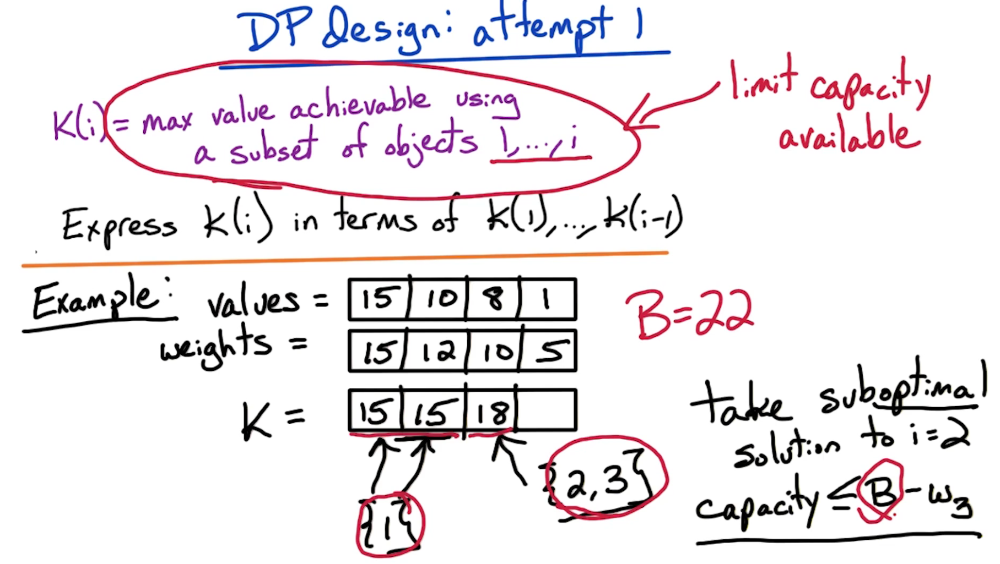{ width=650px }

To summarize the first attempt of the dynamic programming algorithm (cf. Section 4), we define the following sub-problem:

> Let $K(i)$ = maximum value achievable using a subset of object $1, \dots, i$

Furthermore, we must now find the recurrence relation to express $K(i)$ in terms of $K(1), \dots, K(i-1)$ .

Let us know return to the previous example (cf. Section 3), with the following inputs:

| Object | Value | Weight |
|:--:|:--:|:--:|
| $1$ | $15$ | $15$ |
| $2$ | $10$ | $12$ |
| $3$ | $8$ | $10$ |
| $4$ | $1$ | $5$ |

Furthermore, the corresponding knapsack capacity is $B = 22$ .

We now attempt to create a table $K$ which contains the prefix maximum value (as comprised of the subset of corresponding objects), defined via recurrence relation accordingly. Conceptually, this can be described as follows:

| $i$ | $K(i)$ | Subset |
|:--:|:--:|:--:|
| $1$ | $15$ | { $1$ } |
| $2$ | $15$ | { $1$ } |
| $3$ | $18$ | { $2, 3$ } |

Examining $K(3)$ , is it possible to obtain this value $18$ via either $K(1)$ or $K(2)$ ? Since object $3$ is added as a sub-optimal selection relative to $K(2)$ (which uses object $1$ but correspondingly eliminates the capacity to contain object $3$ ), we must correspondingly take such a sub-optimal solution to $i = 2$ accordingly. However, the ***key*** is to select such a sub-optimal solution in a manner whereby there is sufficient remaining capacity to eventually accommodate the corresponding value-maximizing objects subset, i.e., capacity $\le B - w_3$ (where $B$ is the total available capacity, and $w_3$ is the additional object weight introduced as a prospective subset member as of $i = 3$ ). Therefore, we want to optimize the smaller prefix relative to this "effective" capacity.

Proceeding in this manner, given constraint $B - w_3 = 22 - 10 = 12$ , object $1$ no longer fits within this constraint, and therefore object $2$ is selected accordingly, yielding a corresponding total value of $8 + 10 = 18$ via corresponding subset { $3, 2$ }.

However, as this attempt demonstrates, the definition of the sub-problem is insufficient to express $K(i)$ in terms of its prefix (i.e., $K(3)$ in terms of $K(1)$ or $K(2)$ ), because the solution itself does not directly derive from the prefix value(s), but rather the prefix values are based on a sub-optimal solution (i.e., object $1$ in this case) having insufficient/limited remaining capacity relative to the optimal solution.

Therefore, to resolve this issue with the sub-problem definition, we must additional ***limit*** the capacity available of the corresponding prefixes/sub-problems (i.e., consider the objects $1, \dots, i$ ***and*** limiting of the resulting capacity). This correspondingly motivates the second attempt at devising a dynamic programming algorithm for this problem, as discussed next.

#### 6-7. Attempt 2

##### 6. Sub-Problem

Now, let us revise our sub-problem definition, based on insight gained from the first attempt (cf. Section 5).

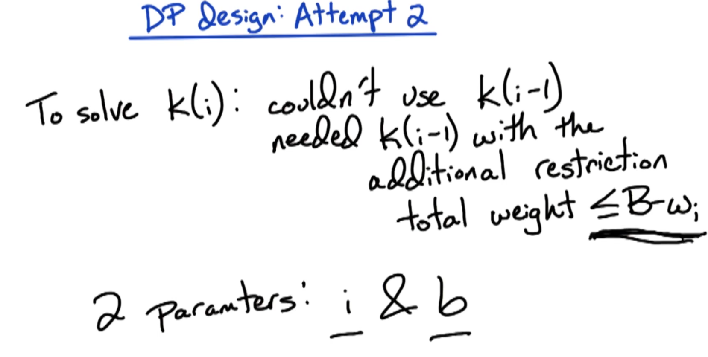{ width=650px }

Our initial definition of the sub-problem was as follows:

> Let $K(i)$ = maximum value achievable using a subset of object $1, \dots, i$

However, this is an insufficient definition, because it does not allow use of $K(i-1)$ in the definition of $K(i)$ . Instead, we must additional add the restriction that the total weight $\le B - w_i$ . By including the weight of object $i$ (i.e., $w_i$ ) in the sub-problem definition, while this may result in a sub-optimal solution locally, it ultimately gives rise to a globally optimal solution (i.e., maximizing $K$ relative to constraint $B$ ).

Therefore, we redefine the sub-problem as having two parameters $i$ (the object) and $b$ (the total weight available for object $i$ ), correspondingly giving rise to a two-dimensional table accordingly. 

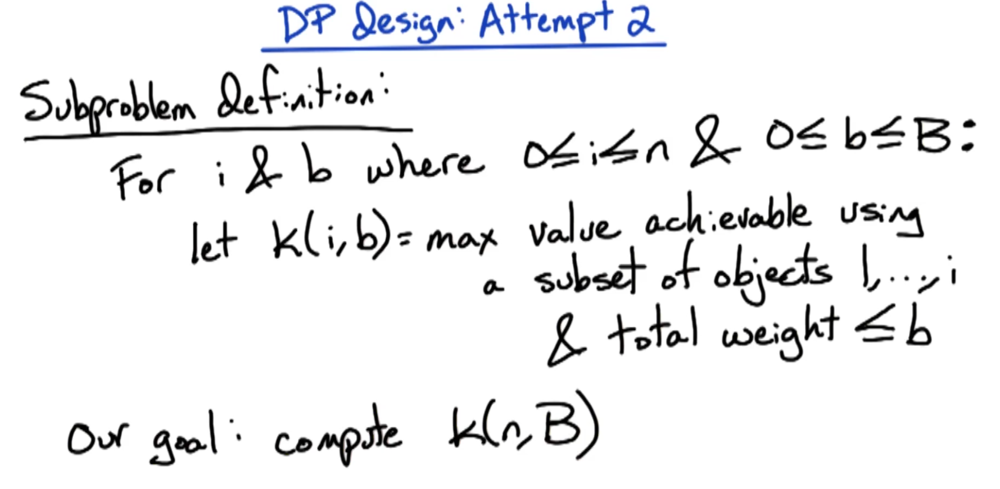{ width=650px }

This updated sub-problem can now be formally redefined as follows:

> For $i$ and $b$ where $0 \le i \le n$ and $0 \le b \le B$ , let $K(i, b)$ = maximum value achievable using a subset of objects $1, \dots, i$ and total weight $\le b$

Now, the ***goal*** is to compute entry $K(n, B)$ (i.e., bottom-right corner entry of the table), the maximum value obtained by using a subset of the $n$ objects to obtain a total weight of at most $B$ .

##### 7. Recurrence

Now, let us consider the recurrence relation.

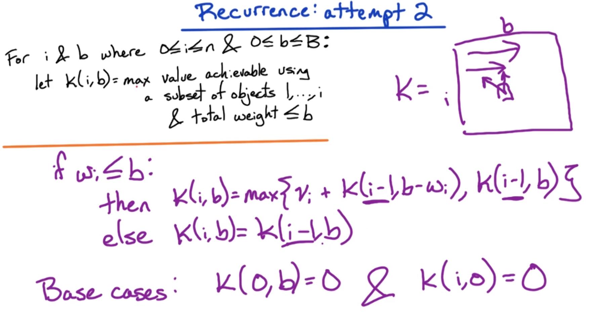{ width=650px }

In general, the recurrence relation will involve two potential scenarios: Object $i$ is either included or omitted.

First, we must determine whether or not object $i$ even fits in the remaining capacity of the knapsack to be considered at all.
  * If $w_i \le b$ (i.e., object $i$ *does* fit in the remaining capacity), then the corresponding value is that of object $i$ added to the value of the prefix $i-1$ having total capacity $b - w_i$ (where $w_i$ is correspondingly included), i.e., $K(i,b) = v_i + K(i-1,b-w_i)$ .
  * Otherwise, if object $i$ is *not* included (i.e., even if $w_i \le b$ holds), then correspondingly $K(i,b) = 0 + K(i-1,b) = K(i-1,b)$ , where object $i$ is excluded and therefore the available capacity to the remaining objects is simply $b$ .

Therefore, we take the corresponding maximum among these two possibilities, as follows:

$$
K(i,b) = \max \big\{ v_i + K(i-1,b-w_i), K(i-1, b) \big\}
$$

Additionally, if $w_i > b$ (and therefore cannot be included in the knapsack in the first place), then similarly $K(i,b) = 0 + K(i-1,b) = K(i-1,b)$ .

Finally, to complete the definition, we must also consider the ***base cases***:
  * $K(0, b) = 0$
  * $K(i, 0) = 0$

which correspondingly populate the table's first row and first column (respectively) with zeros.

Following this definition, the table $K(i, b)$ is therefore correspondingly populated row-wise (i.e., increasing $i$ and increasing $b$ directions), whereby at some arbitrary entry $i, b$ , this definition corresponds the following "directions" (as in the figure shown above):
  * diagonal $\nwarrow$ , $L(i,b-w_i)$
  * directly above $\uparrow$ , $L(i-1,b)$

#### 8-9. Dynamic Programming Algorithm

##### 8. Pseudocode

Now, consider the pseudocode for implementing the dynamic programming algorithm to solve the knapsack problem with *no* repetition of candidate objects in the subset (i.e., any given object can only be used *once* at most).

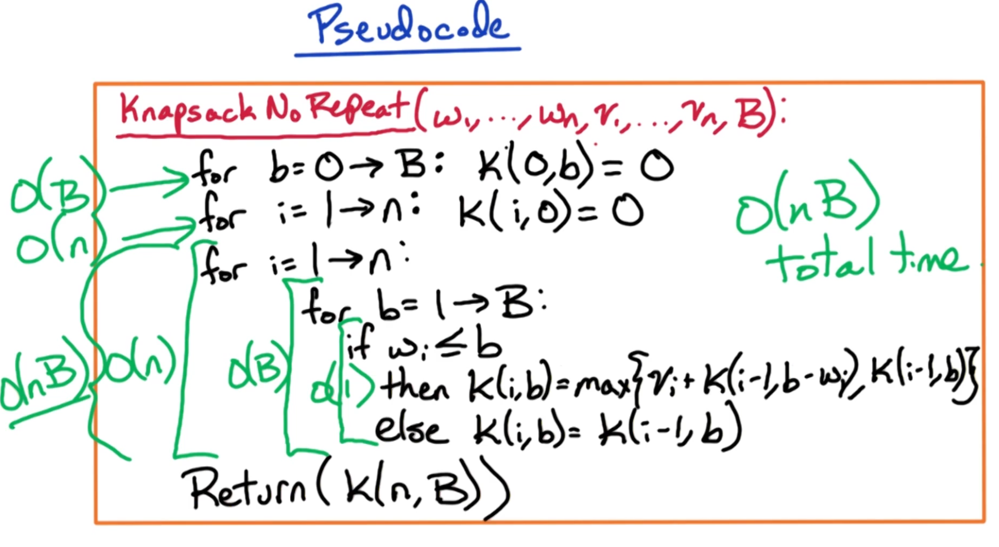{ width=650px }

$$
\boxed{
\begin{array}{l}
{{\text{KnapsackNoRepeat}}(w_1,\dots,w_n,v_1,\dots,v_n,B):}\\
\ \ \ \ {{\text{for\ }} b=0 \to B:\ K(0,b)=0}\\
\ \ \ \ {{\text{for\ }} i=1 \to n:\ K(i,0)=0}\\
\ \ \ \ {{\text{for\ }} i=1 \to n:}\\
\ \ \ \ \ \ \ \ {{\text{for\ }} b=1 \to B:}\\
\ \ \ \ \ \ \ \ \ \ \ \ {{\text{if\ }} w_i \le b {\text{\ then\ }} K(i,b) = \max \big\{ v_i + K(i-1,b-w_i), K(i-1, b) \big\}}\\
\ \ \ \ \ \ \ \ \ \ \ \ {{\text{else\ }} K(i,b) = K(i-1,b)}\\
\ \ \ \ {{\text{return\ }} (K(n,B))}
\end{array}
}
$$

The ***inputs*** to the algorithm are the weights of the objects $w_1, \dots, w_n$ , their corresponding values $v_1, \dots, v_n$ , and the total knapsack capacity $B$ .

The ***base cases*** populate the corresponding first-row and first-column entries of the table $K(i,b)$ .

Next, to populate the interior of the table (i.e., recursive cases), this is done in a row-wise manner (i.e., increasing $i$ and increasing $b$ directions) via corresponding nested loops. The subsequent determination is based on the check $w_i \le b$ , which dictates whether or not object $i$ is included: Its inclusion adds value $v_i$ and reduces corresponding capacity by $w_i$ (i.e., $b-w_i$ ), otherwise its exclusion correspondingly adds no additional value relative to the optimal solution of the prefix (i.e., $K(i-1, b)$ ).

Finally, the algorithm returns the optimal value in entry table $K(n, B)$ (i.e., the solution to the original problem), corresponding to the bottom-right corner of the table.

###### Running Time

The ***running time*** of the algorithm can be determined readily/straightforwardly.

The row-initializing and column-initializing loops have a running time of $O(B)$ and $O(n)$ (respectively).

The nested $\text{for}$ loops comprise an overall running time of $O(B) \times O(n) = O(nB)$ , with each operation itself (i.e., populating value $K(i,b)$ ) taking $O(1)$ . Furthermore, $O(nB)$ is the dominating operation of the algorithm, thereby constituting its overall running time accordingly.

##### 9. Polynomial Time Quiz and Answers

Recall (cf. Section 8) that the running time of the dynamic programming algorithm just described is $O(nB)$ . Is this an ***efficient*** algorithm? More precisely, is the running time at worst ***polynomial*** in the input size?

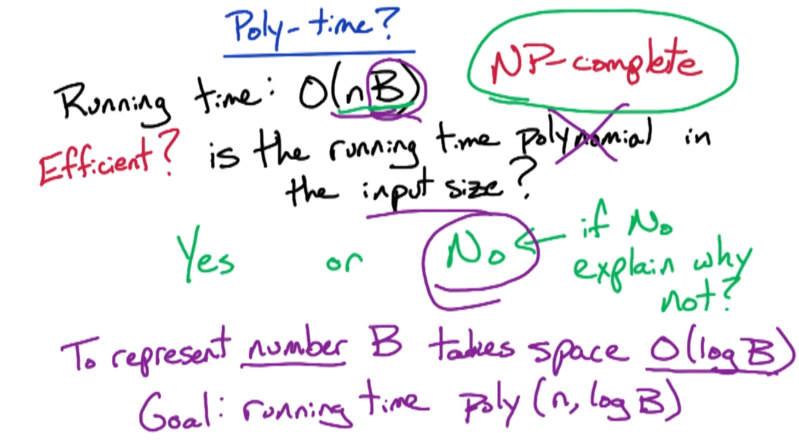{ width=650px }

This algorithm is ***not*** polynomial in the input size. While $nB$ is indeed a polynomial expression (i.e., with respect to the running time), the corresponding ***input size*** is nevertheless not polynomial.

To represent number $B$ , the corresponding memory/space required (i.e., as bits) is $O(\log B)$ . Furthermore, representing number $n$ (i.e., the weights $w_1, \dots, w_n$ and values $v_1, \dots, v_n$ of the objects $1, \dots, n$ ) also requires $2n \times O(1)$ bits. Therefore, the corresponding input size is $O(n\log B)$ .

Therefore, while goal of the running time is polynomial with respect to inputs $n$ and $logB$ , the actual running time $O(nB)$ is ***exponential*** with respect to these inputs.

As it turns out, this form of knapsack problem is **NP-complete**, meaning that while such a polynomial-time algorithm may exist, it is not certain to be so. Furthermore, if such a polynomial-time algorithm were discovered for this problem, then it would correspondingly *also* resolve this issue in all other NP-complete problems as well.
  * ***N.B.*** NP-completeness is discussed later in this course, in a dedicated lesson.

### 10-16. Second Variant: Knapsack Problem with Repetition

#### 10. Sub-Problem

> [!NOTE]
> ***Instructor's Note***: See [DPV] Chapter 6.4 (Knapsack) and Eric's notes [DP Part 2](https://cs6505.wordpress.com/schedule/dp-part-ii/)

Now, consider the second variant of the knapsack problem, wherein each candidate object can be included multiplicatively (cf. strictly only *one* inclusion of each object in the first variant, as discussed previously in this section).

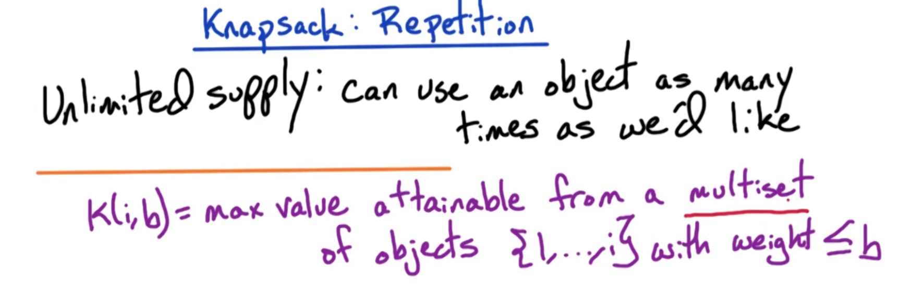{ width=650px }

To design a dynamic programming algorithm, recall (cf. Dynamic Programming 1, Section 8) that the first step is to define a sub-problem. For this, let us repurpose the corresponding definition (cf. Section 6) from the first variant, i.e.,:

> Let $K(i,b)$ = maximum value attainable from a multiset of objects { $1, \dots, i$ } with weight $\le b$

Since this variant of the problem allows multiple inclusions of the *same* object, here we correspondingly define a "multiset" for this purpose (cf. subset in the case of the first variant).

#### 11-13. Recurrence

##### 11. Initial Attempt

Now, consider writing the recurrence relation for the sub-problem definition devised previously (cf. Section 10).

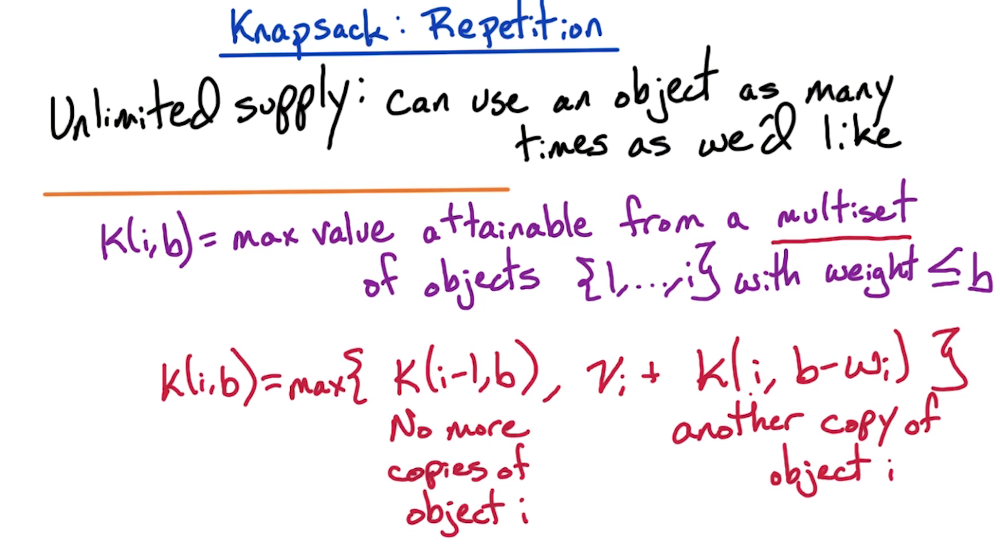{ width=650px }

Here, we attempt to express $K(i,b)$ in terms of smaller sub-problems. Using the insight gained in the first variant of the knapsack problem (cf. Section 7), there are two possible scenarios: Object $i$ is either included or excluded in the knapsack (with the resulting higher value dictating the choice). This will yield the following general expression:

$$
K(i,b) = \max \big\{ \cdots \big\}
$$

Furthermore, in this particular variant (i.e., *with* permissible repetition of object $i$ ), there are two additional decisions to make: Either include another copy of object $i$ or do not include any more copies of object $i$ (with the remaining elements being comprised of items $1, \dots, i-1$ and having remaining total capacity $b$ ). These are correspondingly expressed as follows:
  * Include another copy of object $i$ : $K(i,b) = v_i + K(i,b-w_i)$
    * ***N.B.*** Here, in the expression $K(i,b-w_i)$ , index $i$ is used because object $i$ may be reused (cf. $i-1$ in Section 7, wherein exclusive use of $i$ precluded its reuse)
  * No more copies of object $i$ : $K(i,b) = K(i-1,b)$

Therefore, combining these observations yields the following:

$$
K(i,b) = \max \big\{ K(i-1,b), v_i + K(i,b-w_i) \big\}
$$

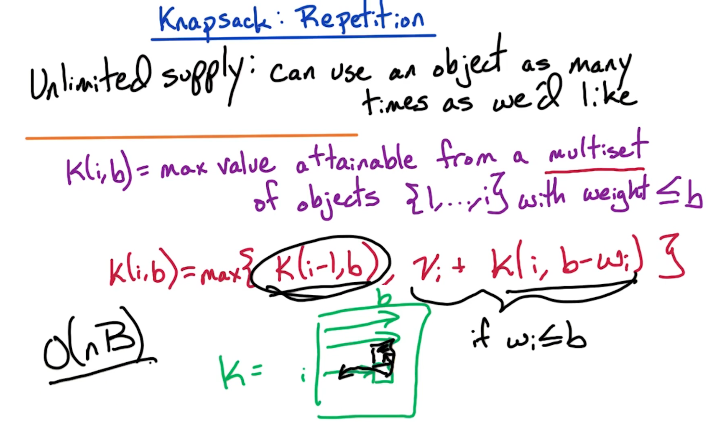{ width=650px }

Let us now consider whether or not this is a valid recurrence (i.e., is $K(i,b)$ expressed in terms of smaller sub-problems?). Previously, when expressing the current entry, we did so with respect to entries in previous rows of the table. However, this expression includes a reference to the current row (i.e., expression $K(i,b-w_i)$ via $K(i,\dots)$ ).

Consider arbitrary table entry $K(i,b)$ , which has been populated row-wise (i.e., increasing $i$ and increasing $b$ directions), as in the figure shown above. Populating in this manner, indeed both entries will have been populated by this point, i.e.,:
  * in the previous row ($K(i-1,b)$ via direction $\uparrow$ ), and
  * in the previous column in the same row ($K(i,b-w_i)$ via direction $\leftarrow$ ) 

Therefore, this is indeed a valid recurrence relation (i.e., $K(i,b)$ is validly expressed in terms of smaller sub-problems). Accordingly, we can repurpose the pseudocode from before (cf. Section 8), with the slightly modified recurrence relation and a corresponding check to ensure that the $i$th object fits within the remaining capacity $b-w_i$ (i.e., check if $w_i \le b$ ).

Furthermore, given a table of dimension $n \times B$ , with each entry requiring running time $O(1)$ to populate, this yields an overall running time of $O(nB)$ as before (cf. Section 8).
  * ***N.B.*** This analysis is abbreviated here, due to the similarity with the previous version (cf. Section 8).

##### 12. Recap

{ width=650px }

Let us examine the algorithm devised previously (cf. Section 11). Oftentimes, when generating a solution involving a two- or three-dimensional table, it is useful to critically examine the solution in order to determine if a smaller table could otherwise be used instead (or otherwise a solution that is faster, has a smaller space/memory requirement, is simpler, etc.).

Consider the parameter $i$ in the expression for $K(i,b)$ . In the first variant of the knapsack problem (cf. Section 7), the purpose of $i$ was to track which of the objects $1, \dots, i$ have been considered or not up to that point (i.e., after examining object $i$ , proceed onto object $i-1$ , and so on). However, in the current variant of the knapsack problem (i.e., wherein repetition of object $i$ is permitted), it is not clear as to why it is even necessary to consider object $i$ explicitly in the recurrence relation; in fact, it is *not* necessary here at all.

Therefore, let us now rewrite the sub-problem in such a manner which eliminates parameter $i$ and simply considers the weight via parameter $b$ .

##### 13. Simpler Sub-Problem

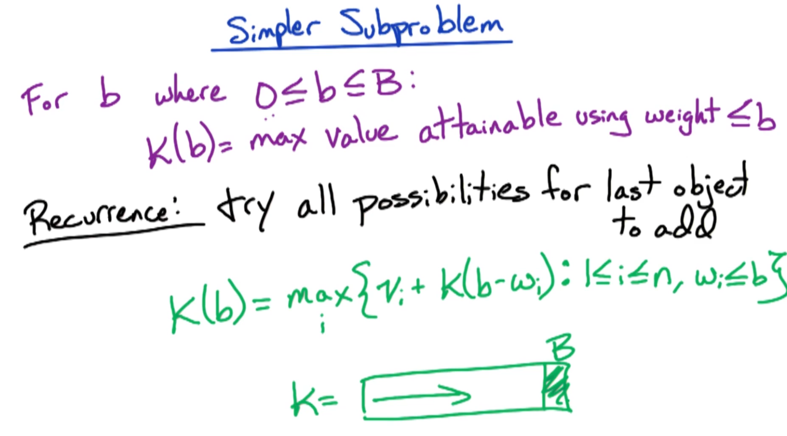{ width=650px }

In the updated version of the knapsack problem (cf. Section 12), we now have a single parameter $b$ , giving rise to the following redefinition of the sub-problem accordingly:

> For $b$ where $0 \le b \le B$ : $K(b)$ = maximum value attainable using weight $\le b$

***N.B.*** Recall (cf. Section 10) that this variant of the knapsack problem allows for multiplicative inclusions of object $i$ , giving rise to a multiset accordingly.

The corresponding recurrence relation does not make explicit consideration of object $i$ , but rather simply considers *all* possibilities for the last object to add to the prefix in the given current sub-problem. This is defined formally as follows:

$$
K(b) = \mathop{\max}\limits_i \big\{ v_i + K(b-w_i): 1 \le i \le n, w_i \le b \big\}
$$

Here, the total weight of the optimal solution is reduced by $b-w_i$ , subject to the appropriate constraints of $1 \le i \le n$ (possible objects) and $w_i \le b$ (valid weights). The result of this overall simplification is a one-dimensional table, $K(b)$ , which is simply populated from $K(0), \dots, K(B)$ , where final entry $K(B)$ is the solution to the problem.

Next, we will create the appropriate pseudocode for this simplified algorithm.

#### 14-16. Dynamic Programming Algorithm

##### 14. Pseudocode

Now, consider the pseudocode for the updated algorithm (cf. Section 13).

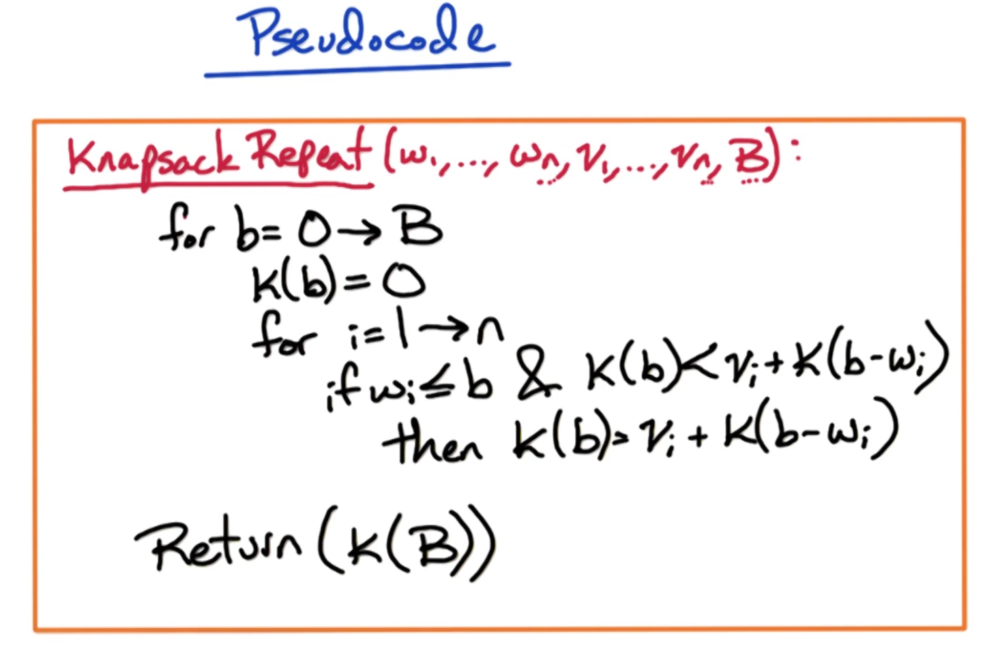{ width=650px }

$$
\boxed{
\begin{array}{l}
{{\text{KnapsackRepeat}}(w_1,\dots,w_n,v_1,\dots,v_n,B):}\\
\ \ \ \ {{\text{for\ }} b=0 \to B}\\
\ \ \ \ \ \ \ \ {K(b)=0}\\
\ \ \ \ \ \ \ \ {{\text{for\ }} i=1 \to n}\\
\ \ \ \ \ \ \ \ \ \ \ \ {{\text{if\ }} w_i \le b {\text{\ and\ }} K(b) < v_i + K(b-w_i) {\text{\ then\ }} K(b) = v_i + K(b-w_i)}\\
\ \ \ \ {{\text{return\ }} (K(B))}
\end{array}
}
$$

The ***inputs*** to the problem are the same as previously (cf. Section 8), i.e., the weights of the objects $w_1, \dots, w_n$ , their corresponding values $v_1, \dots, v_n$ , and the total knapsack capacity $B$ .

In this one-dimensional table, there is *no* corresponding base case to consider; instead, the one-dimensional array/table $K(b)$ is populated in a "bottom-up" manner accordingly.
  * The value is initialized to $0$ at position $K(b)$ , in case no objects are available at this current capacity $b$ .
  * From there, each object $i, \dots, n$ is considered as the candidate for the *last* object to be added to the prefix in the current sub-problem/iteration (i.e., and correspondingly updating a previous iteration's solution if so). In particular, this candidate object must fit within the constraint of $w_i \le b$ , and also whether it satisfies the constraint of $v_i + K(b - w_i) > K(b)$ (i.e., having a higher value than previously for given object $i$ having current value $K(b)$ immediately prior to update). 

Finally, the solution to the problem is returned as the last entry in the table, $K(B)$ .

##### 15. Running Time

Now, consider the running time for the algorithm (cf. Section 14).

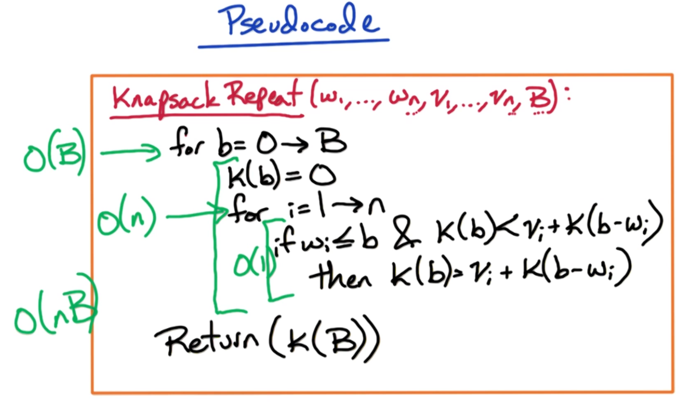{ width=650px }

The outer $\text{for}$ loop has a running time of $O(B)$ . Furthermore, the nested $\text{for}$ loop has a running time of $O(n)$ , with each operation (i.e., populating table value $K(b)$ ) requiring a running time of $O(1)$ . Therefore, the overall running time is $O(nB)$ , similarly to previously (cf. Section 11), however, it requires less space/memory and also constitutes a comparatively simpler solution (i.e., a one-dimensional table rather than a two-dimensional table).

##### 16. Traceback

> [!NOTE]
> ***Instructor's Note***: For further discussion, see the illustration in Lecture DP1: LCS: Extract Sequence. In addition, see [DPV] Chapter 6.2 (which points back to the analogous use of the prev[] array in Dijkstra's algorithm), and also try problem 6.4(b) which partitions a string into a sequence of words.

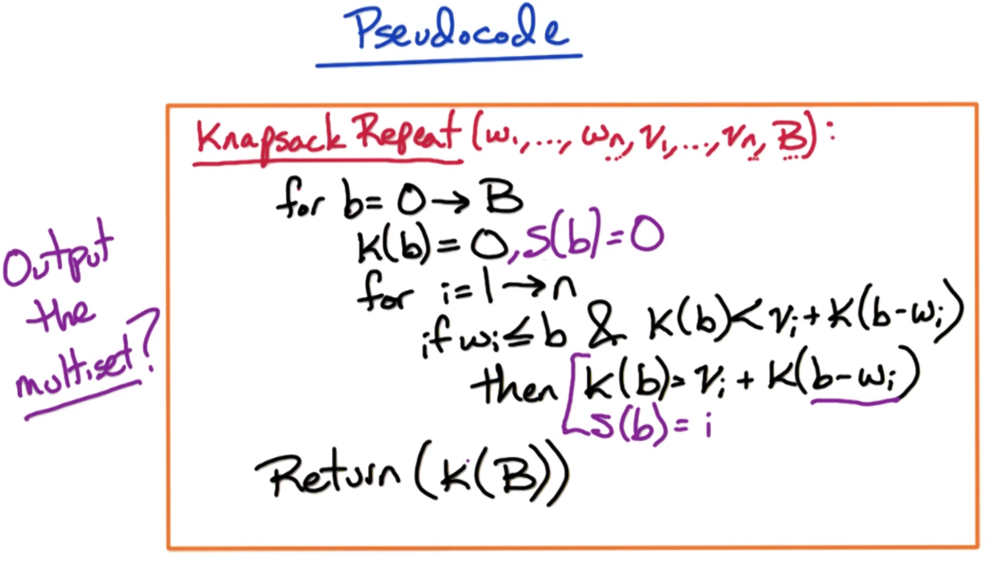{ width=650px }

To output the actual multiset of the constituent objects corresponding to the solution, we must explicitly keep track of object $i$ used to obtain the currently optimal solution at sub-problem $k(b)$ . The following pseudocode contains the appropriate adjustments for this purpose:

$$
\boxed{
\begin{array}{l}
{{\text{KnapsackRepeat}}(w_1,\dots,w_n,v_1,\dots,v_n,B):}\\
\ \ \ \ {{\text{for\ }} b=0 \to B}\\
\ \ \ \ \ \ \ \ {K(b)=0}\\
\ \ \ \ \ \ \ \ {S(b)=\emptyset}\\
\ \ \ \ \ \ \ \ {{\text{for\ }} i=1 \to n}\\
\ \ \ \ \ \ \ \ \ \ \ \ {{\text{if\ }} w_i \le b {\text{\ and\ }} K(b) < v_i + K(b-w_i) {\text{\ then\ }} K(b) = v_i + K(b-w_i) {\text{\ and\ }} S(b) = i}\\
\ \ \ \ {{\text{return\ }} (K(B))}
\end{array}
}
$$

Here, we introduce an additional multiset $S$ which contains the corresponding objects (initialized as empty set $\emptyset$ ). Now, we can use this multiset $S$ to hold $i$ , and subsequently recurse on the sub-problem solution $K(b-w_i)$ . In this manner of backtracking, multiset $S$ is updated accordingly, ultimately producing the multiset containing the corresponding objects for the solution $K(B)$ on completion of running the algorithm.
  * ***N.B.*** The details of this backtracking are similar to what was done previously for the longest common subsequence (cf. Dynamic Programming 1, Section 27).

## Chain Matrix Multiply

### 17-19. Background

#### 17. Introduction

> [!NOTE]
> ***Instructor's Note***: See [DPV] Chapter 6.4 (Knapsack) and Eric's notes [DP Part 2](https://cs6505.wordpress.com/schedule/dp-part-ii/)

The next dynamic programming problem under consideration is Chain Matrix Multiply. This problem will be somewhat different in nature/style from previously, resulting in a comparatively more complicated solution accordingly.

Let us now consider a more specific example to motivate this problem accordingly, and then we will later return to defining the more general problem.

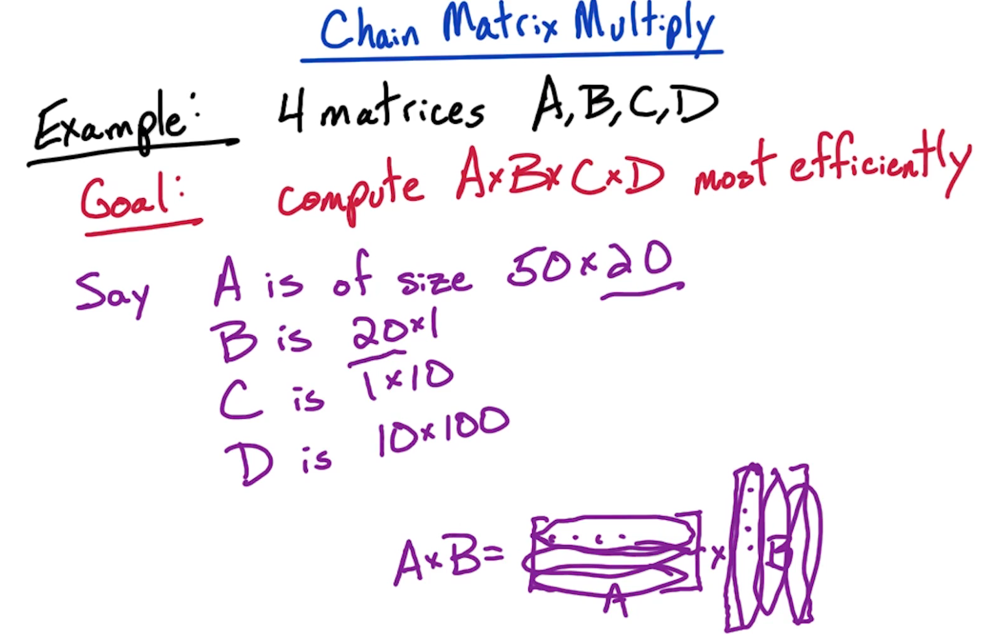{ width=650px }

Consider four matrices $A$ , $B$ , $C$ , and $D$ having integer-value entries. The ***goal*** is to compute the product of these four matrices, i.e., $A \times B \times C \times D$ . Furthermore, this multiplication should be performed in the ***most efficient*** manner possible. But what do we mean by "most efficient" in this context?

Let us further consider a more specific/concrete example, wherein these for matrices are defined as having the following dimensions:
  * $A$ is of size $50 \times 20$
  * $B$ is of size $20 \times 1$
  * $C$ is of size $1 \times 10$
  * $D$ is of size $10 \times 100$

Note that for matrix multiplication, in general the "inner dimensions" of the two operand matrices must match (e.g., $A \times B$ is a valid matrix multiplication by virtue of "matching" dimension $20$ , and so on), i.e.,:

$$
A \times B =
\begin{bmatrix}
  {a_{1,1}}&{\cdots}&{a_{1,k}}&{\cdots}&{a_{1,p}}\\ 
  {\vdots}&{\ddots}&{\vdots}&{\ddots}&{\vdots}\\
  {a_{i,1}}&{\cdots}&{a_{i,k}}&{\cdots}&{a_{i,p}}\\
  {\vdots}&{\ddots}&{\vdots}&{\ddots}&{\vdots}\\
  {a_{m,1}}&{\cdots}&{a_{m,k}}&{\cdots}&{a_{m,p}}
\end{bmatrix}
\times
\begin{bmatrix}
  {b_{1,1}}&{\cdots}&{b_{1,j}}&{\cdots}&{b_{1,n}}\\ 
  {\vdots}&{\ddots}&{\vdots}&{\ddots}&{\vdots}\\
  {b_{k,1}}&{\cdots}&{b_{k,j}}&{\cdots}&{b_{k,n}}\\
  {\vdots}&{\ddots}&{\vdots}&{\ddots}&{\vdots}\\
  {b_{p,1}}&{\cdots}&{b_{p,j}}&{\cdots}&{b_{p,n}}
\end{bmatrix}
=
\begin{bmatrix}
  {\sum_{k=1}^p a_{1,k}b_{k,1}}&{\cdots}&{\sum_{k=1}^p a_{1,k}b_{k,j}}&{\cdots}&{\sum_{k=1}^p a_{1,k}b_{k,n}}\\ 
  {\vdots}&{\ddots}&{\vdots}&{\ddots}&{\vdots}\\
  {\sum_{k=1}^p a_{i,k}b_{k,1}}&{\cdots}&{\sum_{k=1}^p a_{i,k}b_{k,j}}&{\cdots}&{\sum_{k=1}^p a_{i,k}b_{k,n}}\\
  {\vdots}&{\ddots}&{\vdots}&{\ddots}&{\vdots}\\
  {\sum_{k=1}^p a_{m,k}b_{k,1}}&{\cdots}&{\sum_{k=1}^p a_{m,k}b_{k,j}}&{\cdots}&{\sum_{k=1}^p a_{m,k}b_{k,n}}
\end{bmatrix}
$$

where $A$ has dimensions $m \times p$ and $B$ has dimensions $p \times n$ with matching inner dimension $p$ , resulting in a product matrix of size $m \times n$ .

As a representative example, the product of the first row of $A$ multiplied by the first column of $B$ yields the following element in the resulting product matrix (i.e., at position $1,1$ ):

$$
a_{1,1}b_{1,1} + \cdots + a_{1,k}b_{k,1} + \cdots + a_{1,p}b_{p,1} = \sum_{k=1}^p a_{1,k}b_{k,1}
$$

And similarly for the remaining entries in the resulting product matrix.

#### 18. Order of Operation

{ width=650px }

Recall (cf. Section 17) that the goal is to compute the matrix product $A \times B \times C \times D$ . Matrix multiplication is an ***associative*** operation, and therefore there are many ways to determine this target matrix product accordingly.

The standard approach would be to perform this as $((A \times B) \times C) \times D$ , where $A \times B$ is performed first, followed by $(\cdots) \times C$ , and then finally $((\cdots) \times \cdots) \times D$ .

However, this is not the only possibility; other valid/correct approaches include the following:
  * $(A \times B) \times (C \times D)$
  * $(A \times (B \times C)) \times D$
  * $A \times (B \times (C \times D))$

So, then, which of these is the best? And what is the corresponding cost of this optimal parenthesization? In order to make this determination, it is necessary to assign a corresponding ***cost*** for each of these operations, as discussed next.

#### 19. Cost for Matrix Multiply

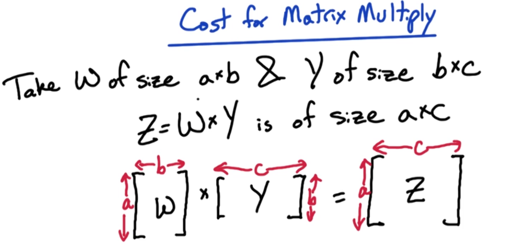{ width=650px }

Consider a matrix $W$ of six $a \times b$ and another matrix $Y$ of size $b \times c$ . Furthermore, consider the product $Z$ of these matrices, i.e., $Z = W \times Y$ , having corresponding size $a \times c$ .

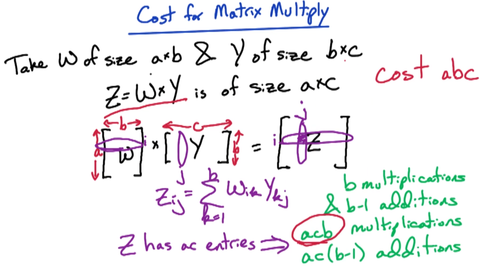{ width=650px }

Now, consider an arbitrary element $z_{i,j}$ of the product matrix $Z$ . To determine this entry, this requires the following computation:

$$
z_{i,j} = w_{i,1}y_{1,j} + \cdots + w_{i,k}y_{k,j} + \cdots + w_{i,b}y_{b,j} = \sum_{k=1}^b w_{i,k}y_{k,j}
$$

where each row-wise element of $W$ (i.e., of general form $w_{i,k}$ with respect to row $i$ in matrix $A$ ) is multiplied by each column-wise element of $Y$ (i.e., of general form $y_{k,j}$ with respect to column $j$ in matrix $B$ ), and the resulting product-matrix element $z_{i,j}$ is the sum of these sub-elements' inner products.

Therefore, to compute *one* such element in product matrix $Z$ , this requires correspondingly $b$ such multiplication operations and $b-1$ such addition operations. Furthermore, product matrix $Z$ has $a \times c$ such elements, correspondingly requiring $a \times c \times b$ multiplication operations and $a \times c \times (b-1)$ addition operations accordingly; therefore, this overall ***cost*** can be summarized simply as $a \times c \times b$ such operations.
  * ***N.B.*** $a \times c \times b \approx a \times c \times (b-1)$ , and furthermore typically multiplication operations are more expensive than addition operations, and thus $a \times c \times b$ is dominating and generally/broadly encompassing in this scenario.

### 20-21. General Problem

#### 20. Introduction

> [!NOTE]
> ***Instructor's Note***: See [DPV] Chapter 6.6 (Chain Matrix Multiplication) and Eric's notes [DP Part 2](https://cs6505.wordpress.com/schedule/dp-part-ii/)

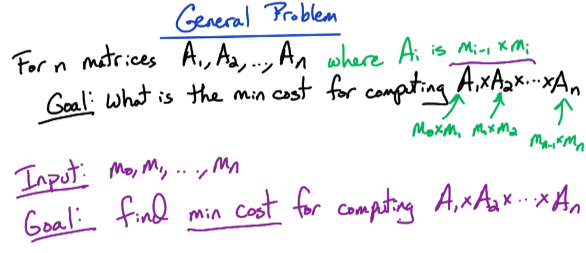{ width=650px }

In the general problem, there are $n$ matrices $A_1, A_2, \dots, A_n$ as inputs, where each matrix $A_i$ has corresponding size $m_{i-1} \times m_i$ (i.e., matrices $A_1, A_2, \dots, A_n$ having corresponding sizes $m_0 \times m_1$ , $m_1 \times m_2$ , $\dots$ , $m_{n-1} \times m_n$ , respectively, whereby each inner dimension is correspondingly matching).
  * ***N.B.*** For purposes of this problem, only the *size* of the corresponding input matrices must be known, but otherwise the (identify of the) constituent elements can be regarded as arbitrary/insignificant.

Therefore, the corresponding ***input*** is $m_0, m_1, \dots, m_n$ (i.e., the sizes of the respective input matrices) accordingly.

The ***goal*** is to compute the corresponding product matrix $A_1 \times A_2 \times \cdots \times A_n$ with minimal cost. Once this is determined, the correspondingly optimal parenthesization can be readily determined accordingly.

#### 21. Graphical View

To gain some additional intuition for the problem of matrix multiplication, consider an alternative representation: Rather than considering this as a parenthesization, instead let us represent the problem as a binary tree.

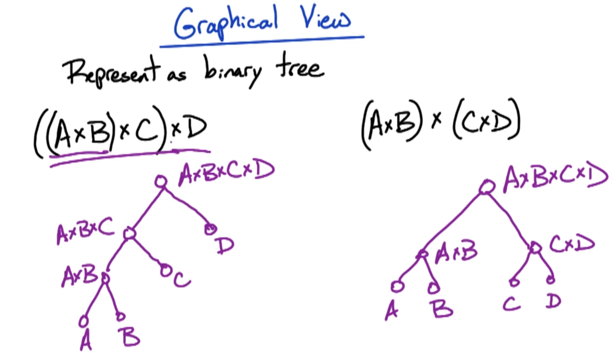{ width=650px }

Recall (cf. Section 18) the product of matrices $A \times B \times C \times D$ , with the standard computation method being $((A \times B) \times C) \times D$ , where $A \times B$ . To represent this parenthesization as a binary tree (cf. left side of the figure shown above), the leaves of the tree will represent the constituent matrices, and the internal nodes will represent intermediate computations, i.e.,:
  * The root of the tree represents the final computation $((A \times B) \times C) \times D$ , where $A \times B$ .
  * The first computation $A \times B$ is at the highest tree level, whose product is at the next-highest level along with leaf $C$ , and so on, until eventually the root is expressed accordingly.

Conversely, in the case of parenthesization $((A \times B) \times C) \times D$ , where $A \times B$ (cf. right side of the figure shown above), the resulting binary tree is more symmetric/balanced and with a shorter height (i.e., 3 levels vs. 2), with the root of the resulting tree representing the same overall product $A \times B \times C \times D$ as before.

***N.B.*** Observe that how the resulting binary tree is structured translates directly to how the parenthesization is performed for a given sub-problem.

### 22-27. Chain Multiply 

#### 22-23. Sub-Problem

##### 22. Attempt 1

Now, let us attempt to devise the dynamic programming algorithm for the matrix multiplication problem.

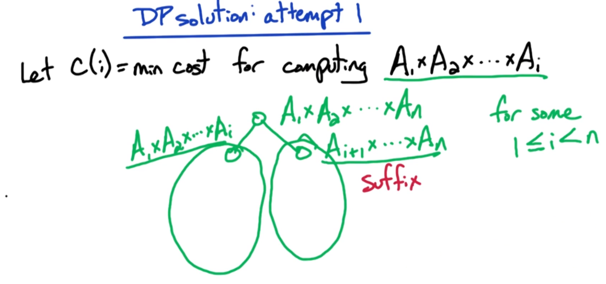{ width=650px }

The first step is to define the sub-problem in words. Here, we have:

> Let $C(i)$ = minimum cost for computing product matrix $A_1 \times A_2 \times \cdots \times A_i$

Furthermore, let us attempt to define a recurrence relation for this sub-problem. Recalling (cf. Section 21) the graphical view of this problem, the target overall product $A_1 \times A_2 \times \cdots \times A_n$ resides at the root node in this representation, where the respective children nodes relative to the root are:
  * $A_1 \times A_2 \times \cdots \times A_i$ for $1 \le i < n$ (left child), and 
  * $A_{i+1} \times \cdots \times A_{n-1} \times A_n$ for $i \le n$ (right child)

Given this "split point" $i$ , we will examine all possibilities recursively in the resulting subtree, and so on. However, given that we are generally attempting to examine *prefixes* (i.e., decreasing the problem size with each recursive level), note that the "right" subtree results in a *suffix*; so, then, should we proceed similarly with the suffix?

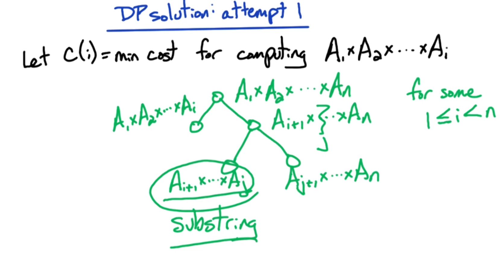{ width=650px }

To further examine the suffix, let us expand the tree by another level (as in the figure shown above), having corresponding "split point" $j$ , yielding subtrees $A_{i+1} \times \cdots \times A_j$ (left) and $A_{j+1} \times \cdots \times A_n$ (right) accordingly. Proceeding as before, we attempt to examine the respective costs of these sub-trees in the table accordingly. However, observe that subtree $A_{i+1} \times \cdots \times A_j$ (left) is neither a prefix nor a suffix, but rather it is a ***substring***. This turns out to be a useful intermediate result/computation which is sufficient for devising the solution; however, we will need to revise our sub-problem definition accordingly (i.e., to consider substrings rather than prefixes), as discussed next.

##### 23. Substrings

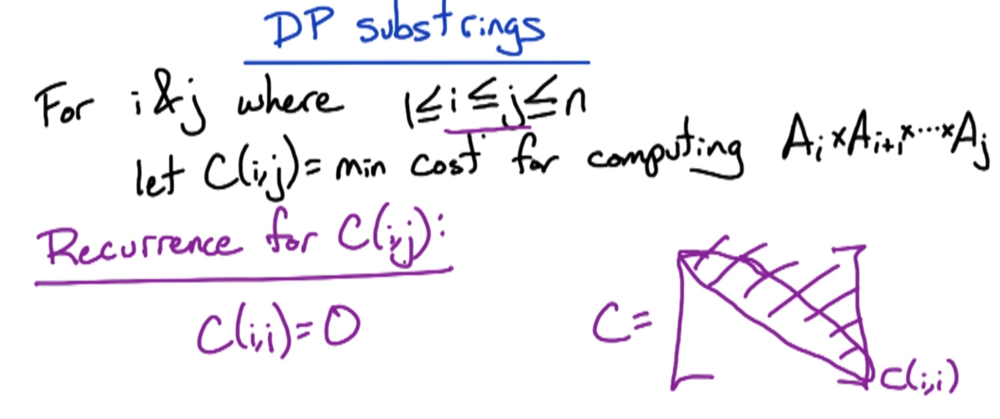{ width=650px }

The revised sub-problem definition involves two parameters, $i$ and $j$ (intermediate positions within substring $1, \dots, n$ ). The corresponding sub-problem definition is as follows:

> For $i$ and $j$ where $1 \le i \le j \le n$ , let $C(i,j)$ = minimum cost for computing product matrix $A_i \times A_{i+1} \times \cdots \times A_j$

Now, let us attempt to define a recurrence relation for this sub-problem definition. The most straightforward case to compute is the ***base case*** when $i = j$ , which has corresponding cost $C(i,i) = 0$ . Furthermore, consider this base case more conceptually (as in the figure shown above): This corresponds to the main diagonal in the resulting product matrix.

For the remaining ***recursive cases***, we are attempting to compute the upper-right section (relative to the main diagonal) of the product matrix (as in the figure shown above), per corresponding relationship $i \le j$ . We next examine this computation accordingly.

#### 24-26. Recurrence

##### 24. Introduction

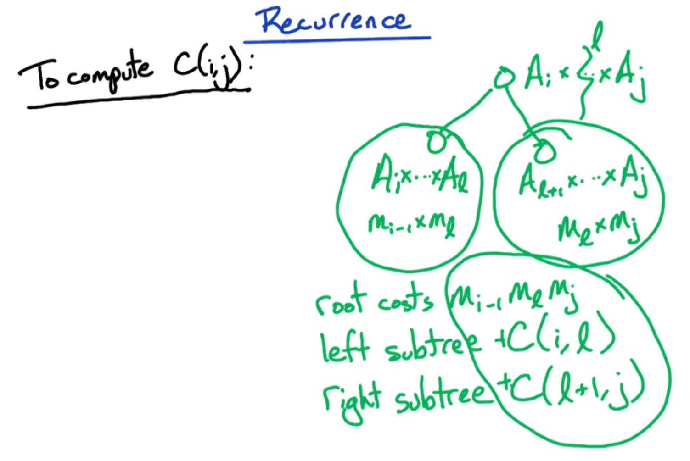{ width=650px }

Now, consider the more general recurrence relation for arbitrary element $C(i,j)$ in the product matrix, which corresponds to the product of the matrices defined by the substring $i \cdots j$ .

To determine this, consider the graphical representation of the problem (as in the figure shown above). The root of the tree corresponds to the product of the (intermediate) matrices $A_i \times \cdots \times A_j$ . Furthermore, we examine the "split" point $\ell$ , resulting in the following subtrees:
  * $A_i \times \cdots \times A_{\ell}$ of size $m_{i-1} \times m_{\ell}$ (left child), and 
  * $A_{\ell+1} \times \cdots \times A_j$ of size $m_{\ell} \times m_j$ (right child)

These subtrees comprise a smaller substring, with the combined total cost of these comprising the corresponding cost of the parent. In the case of the left subtree, the root has cost $\times m_{\ell} \times m_j$ . Furthermore, the total cost for the left subtree (i.e., the left root along with its own constituent children subtrees) is thus as follows:

$$
(m_{i-1} \times m_{\ell} \times m_j) + C(i,\ell) + C(\ell + 1,j)
$$

Furthermore, we will try all possibilities of $\ell$ , in order to determine which is cost-minimizing.

##### 25. Summary

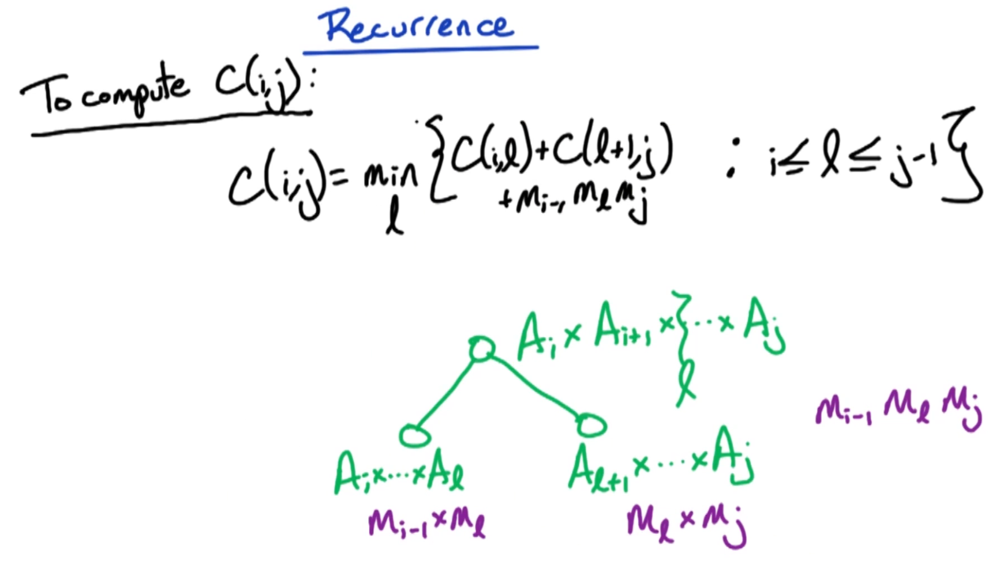{ width=650px }

Let us now more formally define the recurrence relation for $C(i,j)$ , which corresponds to the computation at the "root" of the left subtree of intermediate computation $A_i \times A_{i+1} \times \cdots \times A_{\ell} \times \cdots \times A_j$ (relative to "split" point $\ell$ ), where $i \le \ell < j$ and the corresponding subtrees are as follows:
  * left subtree $A_i \times \cdots \times A_{\ell}$ of size $m_{i-1} \times m_{\ell}$ and cost $C(i,\ell)$ , and
  * right subtree $A_{\ell +1} \times \cdots \times A_j$ of size $m_{\ell} \times m_j$ and cost $C(\ell + 1,j)$

Therefore, combining gives the following expression for the recurrence relation:

$$
C(i,j) = \mathop {\min }\limits_{\ell} \big\{ C(i,\ell) + C(\ell + 1,j) + m_{i-1}m_{\ell}m_j : i \le \ell \le j-1 \big\}
$$

where additional term $+ m_{i-1}m_{\ell}m_j$ is incurred due to the cost for combining the subtrees.

##### 26. Filling the Table

Before detailing the pseudocode for the corresponding dynamic programming algorithm, let us examine the recurrence relation more carefully, with consideration for how the corresponding table is populated (which is less straightforward in this problem than as was encountered/performed previously).

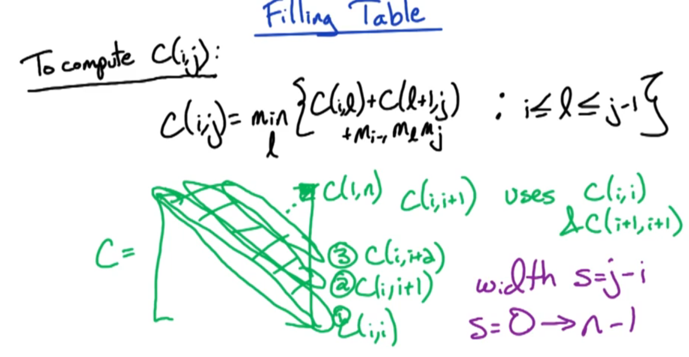{ width=650px }

Given a two-dimensional table (i.e., matrix) $C$ , we are attempting to populate the upper-right region, relative to the main diagonal (as in the figure shown above), i.e., where $i \le j$ .

Recall (cf. Section 23) that the base case $C(i,i) = 0$ (where $i = j$ ) is the main diagonal itself, which is populated first accordingly.

The next set of entries are the subsequent diagonal (moving in the direction of the upper-right corner), having general form $C(i,i+1)$ , which is computed using $C(i,i)$ (direction $\leftarrow$ relative to $C(i,i+1)$ ) and $C(i+1,i+1)$ (direction $\downarrow$ relative to $C(i,i+1)$ ). Proceeding in this manner, eventually $C(1,n)$ is computed (the upper-right corner entry), corresponding to the minimum cost to compute the matrix product $A_1 \times \cdots \times A_n$ .

To account for this "diagonal traversal," let us define width $s = j - i$ , where the main diagonal has value $s = 0$ , the next diagonal moving in the direction of the upper-right corner has value $s = 1$ , and so on. Correspondingly, the width $s$ is therefore varied as $0 \to n-1$ accordingly.

Next, we will detail the pseudocode for the corresponding dynamic programming algorithm.

#### 27. Dynamic Programming Algorithm

##### Pseudocode

Now, let us detail the pseudocode of the dynamic programming algorithm for the chain matrix multiplication problem, which computes the minimum cost of multiplying matrices $A_1 \times \cdots \times A_n$ .

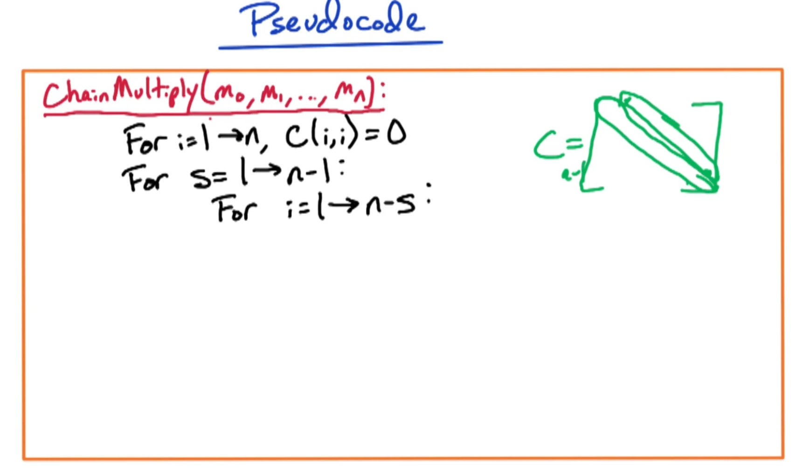{ width=650px }

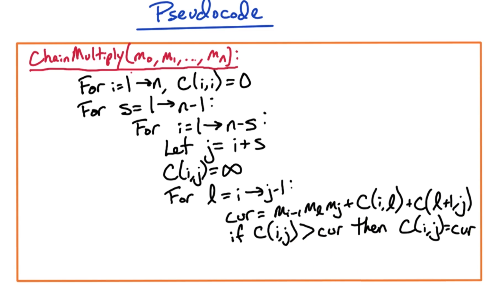{ width=650px }

The corresponding pseudocode is given as follows:

$$
\boxed{
\begin{array}{l}
{{\text{ChainMultiply}}(m_0,m_1,\dots,m_n):}\\
\ \ \ \ {{\text{for\ }} i=1 \to n:}\\
\ \ \ \ \ \ \ \ {C(i,i) = 0}\\
\ \ \ \ {{\text{for\ }} s=1 \to n-1:}\\
\ \ \ \ \ \ \ \ {{\text{for\ }} i=1 \to n-s:}\\
\ \ \ \ \ \ \ \ \ \ \ \ {{\text{let\ }} j = i + s}\\
\ \ \ \ \ \ \ \ \ \ \ \ {C(i,j) = \infty}\\
\ \ \ \ \ \ \ \ \ \ \ \ {{\text{for\ }} \ell = i \to j-1:}\\
\ \ \ \ \ \ \ \ \ \ \ \ \ \ \ \ {{\text{cur}} = m_{i-1}m_{\ell}m_j + C(i,\ell) + c(\ell + 1,j)}\\
\ \ \ \ \ \ \ \ \ \ \ \ \ \ \ \ {{\text{if\ }} C(i,j) > {\text{cur\ then\ }} C(i,j) = {\text{cur}}}\\
\ \ \ \ {{\text{return\ }} (C(1,n))}
\end{array}
}
$$

Recall (cf. Section 20) that the ***input*** to the algorithm is the sizes of the respective constituent matrices, i.e., $m_0,m_1,\dots,m_n$ .

The ***base case*** is simply the main diagonal entries, having general form $C(i,i) = 0$ (i.e., where $i = j$ ).

The ***recursive cases*** involve the width parameter $s$ (cf. Section 26), which varies as $1 \to n-1$ (i.e., towards the upper-right corner). Furthermore, parameter $i$ represents the row, which is truncated in size with each iteration (as in the figure shown above, in green), with any given terminating in row $i-1$ relative to to the previous iteration $i$ (i.e., up to row $n-1$ in the first iteration, and proceeding in this manner until reaching the upper-right diagonal entry). Given $i$ and $j$ for a given iteration, this is sufficient to define $j$ as $j = i + s$ , i.e., the end of the corresponding substring.

To compute entry $C(i,j)$ , we determine this minimum-cost value by varying $\ell$ over range $i \to j-1$ , keeping track of the current minimum $\text{cur}$ accordingly during this process, with $C(i,j)$ initialized as $C(i,j) = \infty$ . For a given split point $\ell$ , the current minimum $\text{cur}$ is defined as:

$$
m_{i-1}m_{\ell}m_j + C(i,\ell) + C(\ell + 1,j)
$$

where recall (cf. Section 25) that $m_{i-1}m_{\ell}m_j$ is the cost of combining the subtrees, with the subtrees having respective costs $C(i,\ell)$ and $C(\ell + 1,j)$ .

Furthermore, a comparison is made with respect to the current minimum $\text{cur}$ , such that if $C(i,j) > {\text{cur}}$ , then the value $C(i,j)$ is correspondingly replaced with this new minimum, $\text{cur}$ .

Finally, the algorithm returns value $C(1,n)$ , the upper-right corner value, which corresponds to the minimum-cost matrix multiplication for matrix product $A_1 \times \cdots \times A_n$ .

##### Running Time

Given the dynamic programming algorithm, now consider its overall running time.

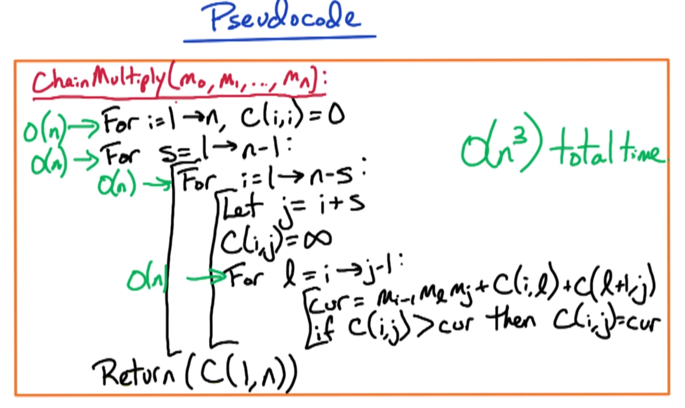{ width=650px }

The base case (which initializes the main diagonal) has a running time of $O(n)$ .

Similarly, the subsequent set of outer nested $\text{for}$ loops (corresponding to parameters $s$ and $i$ , respectively) each have a running time of $O(n)$ as well. Furthermore, the innermost $\text{for}$ loop (corresponding to parameter $\ell$ ) also has a running time of $O(n)$ , with each loop iteration performing an operation (i.e., setting of values $\text{cur}$ and $C(i,j)$ ) having a running time of $O(1)$ .

Therefore, the latter set of nested $\text{for}$ loops has a running time of $O(n^3)$ , which dominates the overall running time of the algorithm accordingly.

As a final note, observe that a ***key component*** of this algorithm involved the use of ***substrings*** rather than ***prefixes*** (cf. Section 22), which was necessary to effectively define the sub-problem accordingly. Furthermore, populating the table was less straightforward here, requiring a more complex diagonal traversal (i.e., from the main diagonal towards the upper-right corner).

### 28. Addendum: Practice Problems

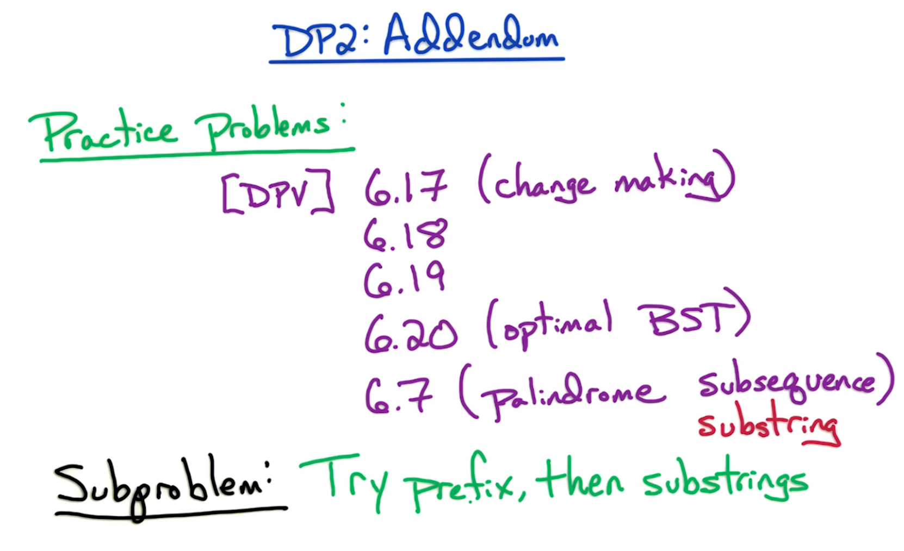{ width=650px }

At this point, you should be capable of approaching any problem from Chapter 6 in the course companion textbook *Algorithms* by Dasgupta et al.

Furthermore, the instructor recommends the following practice problems from Chapter 6:
  * 6.17, 6.18, 6.19 - making change from a given set of coins/denominations
    * These are three variants of the *same* problem; the instructor recommends attempting all three
  * 6.20 - an optimal binary search tree (BST)
  * 6.7 - the longest palindromic subsequence
    * The professor additionally recommends attempting the variant version, longest palindromic substring (i.e., a contiguous subsequence)

Additionally, to summarize the technique for dynamic programming demonstrated throughout this lesson, when defining the ***sub-problem***, first attempt this with a prefix, and then (if necessary) with a substring. Note that if proceeding onto a substring-based approach yields a sufficient sub-problem definition, review the sub-problem to validate whether the substring was in fact necessary; at this point, it may still be possible that a prefix exists which may otherwise simplify the solution and/or improve its efficiency (however, it is still useful to find a valid/correct solution, first, nevertheless).

The ***key*** to building proficiency in the dynamic programming algorithm technique is to attempt many such practice problems. In addition to those recommended here by the professor, also consult external sources as well (e.g., other textbooks, courses, websites, etc.).

# Dynamic Programming 3: Shortest Paths

## 1-2. Introduction

### 1. Problem Setup

> [!NOTE]
> ***Instructor's Note***: See [DPV] Chapter 6.6 (Shortest Paths) and Eric's notes [DP Part 3](https://cs6505.wordpress.com/schedule/dp-sp)

#### Directed Graphs

This lesson will focus on several shortest-path problems, utilizing dynamic programming techniques to design fast/efficient algorithms for these problems. 

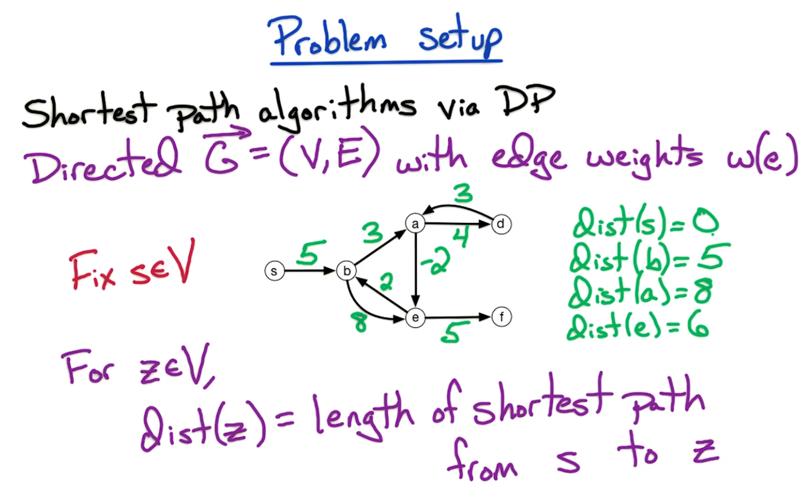{ width=650px }

The context for these problems is based around the notion of a **directed graph** $\vec G = (V,E)$ (where the arrow denotes a *directed* graph), having **edge weights** $w(e)$ .

The figure shown above depicts such a representative directed graph, having six vertices and corresponding weighted edges. Furthermore, observe that *negative* weights are also permissible (e.g., $-2$ ), as well as anti-parallel edges (e.g., $a \rightarrow d$ and $a \leftarrow d$ , having different weights). Such anti-parallel edges are useful, because they allow to encode an otherwise undirected graph as a directed graph, by correspondingly replacing the (undirected) edge by an equivalent anti-parallel pair; in this manner, a directed graph gives rise to a more general problem than the undirected-graph counterpart.

In the first problem, we have a designated/fixed ***starting vertex*** $s \in V$ , and attempt to determine the length of the ***shortest path*** from this starting vertex to every other vertex in the graph. To accomplish this, we define a function ${\text{dist}}(z)$ as follows:

> For $z \in V$ , ${\text{dist}}(z)$ = length fo shortest path from $s$ to $z$

where $z$ denotes each vertex in the graph.

${\text{dist}}(z)$ is defined for every vertex in the graph, giving rise to a corresponding array of length $n$ (i.e., for $n$ total vertices in $V$ ). Therefore, the goal is to compute this array.

In this particular example, this can be determined by inspection as follows:

| $z$ | ${\text{dist}}(z)$ |
|:--:|:--:|
| $s$ | $0$ |
| $b$ | $5$ |
| $a$ | $8$ |
| $e$ | $6$ |
| $d$ | $12$ |
| $f$ | $11$ |

#### Dijkstra's Algorithm

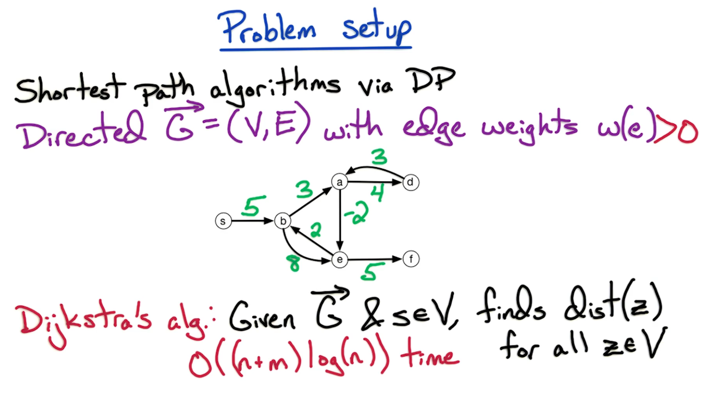{ width=650px }

The classical algorithm for this problem is **Dijkstra's algorithm**, which in its abbreviated form can be summarized as follows:

> Given $\vec G$ and and $s \in V$ , finds ${\text{dist}}(z)$ for all $z \in V$

Dijkstra's algorithm works in a manner analogous to breadth-first search (BFS), exploring the graph in such a "layered" approach. Recall (cf. previous coursework) that breadth-first search (BFS), similarly to depth-first search (DFS), has a running time of $O(n+m)$ (linear) with respect to $n$ vertices and $m$ edges; however, due to weighting of the edges, Dijkstra's algorithm additionally requires a min-heap or priority queue data structure (with each requiring $O(\log (n))$ running time operations), therefore, with this added overhead, the total running time for Dijkstra's algorithm is $O((m+n) \log (n))$ in order to compute the resulting array for ${\text{dist}}(z)$ .

There is a notable ***limitation*** in Dijkstra's algorithm: It is strictly necessary that $w(e) > 0$ in order to use this algorithm for a given input graph. This is due to the fact that negative edge weights do not guarantee to converge on a correct solution as certain paths "short-circuit" via negative weights towards "shorter" paths.

We will next examine the more general problem which *does* allow for such negative weights to be present in the input graph.

### 2. Negative Weight Cycles

> [!NOTE]
> ***Instructor's Note***: Typo: The path length of $s \rightarrow b \rightarrow a \rightarrow d$ is $12$ (not $11$ as I said in the video).

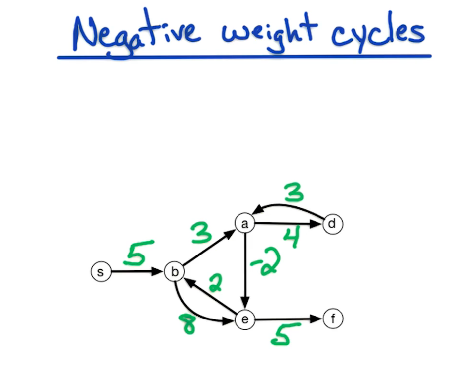{ width=300px }

Recall (cf. Section 1) the directed graph from previously, as in the figure shown above. Negative edge weights are present/permissible, and the goal is to find the shortest path from source vertex $s$ to all other vertices in the graph.

The first question is whether the problem is well defined. In this example, it is: We have already previously determined by inspection (cf. Section 1) the shortest paths in this graph.

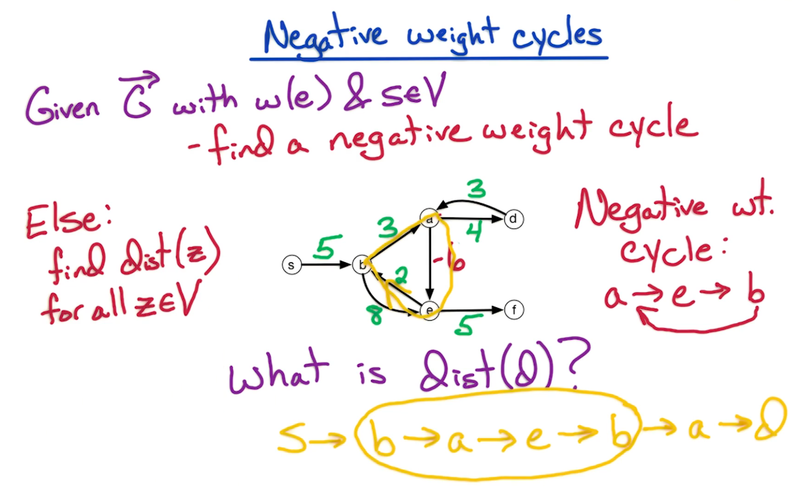{ width=650px }

However, let us now modify the graph to have a more extreme negative-weight value, as in the figure shown above (i.e., changing weight of edge $a \rightarrow e$ from $-2$ to $-6$ ). With this modification, what is ${\text{dist}}(d)$ ?

Recall (cf. Section 1) that before changing the weight, the shortest path ${\text{dist}}(d)$ was $11$ . However, now, observe that the ***cycle*** $b \rightarrow a \rightarrow e \rightarrow b$ (denoted by goldenrod in the figure shown above) has length $-1$ . Therefore, an alternative route from $s$ to $d$ is now $s \rightarrow b \rightarrow a \rightarrow e \rightarrow b \rightarrow a \rightarrow d$ , which yields ${\text{dist}}(d) = 10$ . Similarly, this cycle can be repeated several times, with each traversal decreasing ${\text{dist}}(d)$ by $1$ accordingly; therefore, the "shortest" path would traverse this cycle infinitely many times.
  * ***N.B.*** Such a cyclic traversal along the same/repeating vertices is called a "walk" rather than a "path."

Such a cycle (e.g., $a \rightarrow e \rightarrow b \rightarrow a$ ) is called a ***negative weight cycle*** (i.e., having a net-negative sum in its edges' weights). When a graph contains such a negative weight cycle, the shortest path problem is no longer well defined. However, encountering such a negative weight cycle is nevertheless a useful observation/occurrence.

Let us now consider a more general problem:

> Given a directed graph $\vec G$ with edge weights $w(e)$ and starting vertex $s \in V$ , find negative weight cycles in the graph (if they exist at all) which is reachable from $s$ (otherwise, if such cycles are not reachable, then they are not considered). If no such negative weight cycles are found, then the shortest path problem is well defined, and in which case find ${\text{dist}}(z)$ for all $z \in V$ .

We will next examine how to use dynamic programming to solve this problem.

## 3-7. Single-Source Shortest Path

### 3. Sub-Problem

Let us now design an algorithm for the single-source shortest path problem.

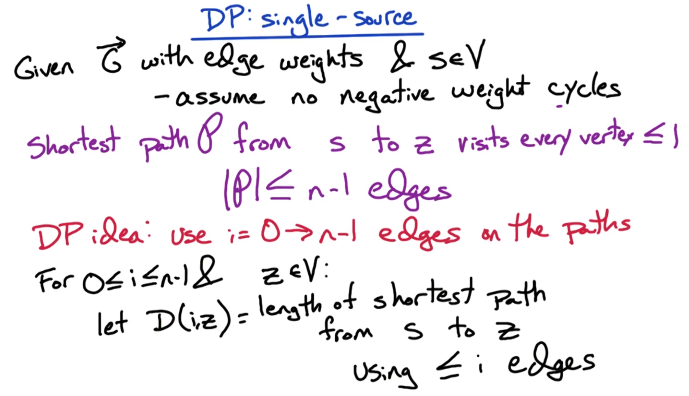{ width=650px }

Given directed graph $\vec G$ with edge weights (which in general can be positive or negative) and some start/source vertex $s \in V$ , the ***goal*** is to find the shortest path from $s$ to every other vertex in the graph. For now, let us ***assume*** that there are *no* negative weight cycles present in the graph, thereby guaranteeing a well defined path from $s$ to every other vertex in the graph (i.e., wherein each intermediate vertex along the path is only visited strictly *once*).
  * ***N.B.*** Later, we will relax this assumption, and correspondingly modify the algorithm to detect the presence of negative weight cycles.

Since there are no negative weight cycles present in the graph, the shortest path $P$ from $s$ to any vertex $z$ in the graph visits every vertex at most *once*. Therefore, it follows directly that $|P| \le n-1$ edges.

Now, consider defining the sub-problem for the dynamic programming algorithm for this single-source shortest path problem. Normally, we attempt to use a prefix of the original problem to define the sub-problem; however, in this problem, we will use a different approach. Given that path length $|P| \le n-1$ edges, let us attempt to use a prefix of the *path*, i.e., putting a corresponding constraint on the path accordingly. More precisely stated:

> For $0 \le i \le n-1$ and $z \in V$ : Let $D(i,z)$ = length of the shortest path from $s$ to $z$ using $\le i$ edges

where $i = 0 \to n-1$ edges on the path are used.

In the ***base case*** ($i = 0$ ), there are no edges or corresponding paths.

Next, we will express the recurrence relation for $D(i,z)$ , with the goal being to express this in terms of $i-1$ . 

### 4-5. Recurrence

#### 4. Introduction

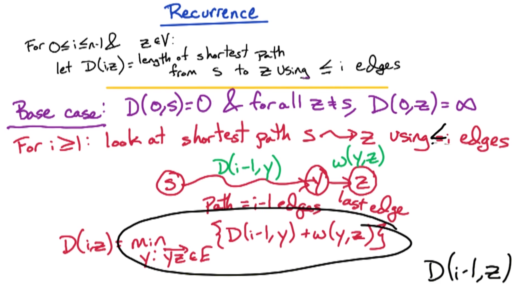{ width=650px }

Recall (cf. Section 3) the definition of the sub-problem, as follows:

> For $0 \le i \le n-1$ and $z \in V$ : Let $D(i,z)$ = length of the shortest path from $s$ to $z$ using $\le i$ edges

The final solution of interest is $i = n-1$ , and the corresponding ***base case*** is $D(0,s) = 0$ and for all $z \ne s$ , $D(0,z) = \infty$ (i.e., all other vertices are unreachable from $s$ in the base case).

Now, consider the ***recursive cases***, for which $i \ge 1$ . Here, we examine the shortest path $s \rightsquigarrow z$ using exactly $i$ edges (as in the figure shown above). In this path, there is some penultimate vertex $y$ having a corresponding path of $i-1$ edges, as well as a last edge from $y$ to $z$ ; therefore $s \rightsquigarrow y$ constitutes a "prefix path" (i.e., having length $i-1$ ) accordingly. However, there is a slight variation in the resulting prefix here: While the sub-problem definition allows for $\le i$ edges, the path $s \rightsquigarrow z$ as defined here is exactly/strictly $= i$ edges.

First, let us consider this latter case, i.e., $= i$ edges. In this case, to define a recurrence relation $D(i,z)$ , we will consider all possibilities for the penultimate vertex $y$ on the path, and taking the optimal (i.e., shortest) result among these accordingly. This gives rise to the following definition:

$$
D(i,z) = \mathop {\min}\limits_{y:\vec{yz} \in E} \big\{ D(i-1,y) + w(y,z) \big\}
$$

where $y:\vec{yz} \in E$ is a directed edge, $D(i-1,y)$ represents the length of the path $s \rightsquigarrow y$ , and $w(y,z)$ is the weight of the last edge (i.e., $y \rightarrow z$ ); thus, the sum $D(i-1,y) + w(y,z)$ represents the total path length for $s \rightsquigarrow z$ , and we minimize this accordingly (with respect to directed edges $y$ ).

This yields a valid recurrence for $D(i,z)$ in the case where it is true that there are exactly/strictly $= i$ edges, however, when attempting to determine the optimal value for $\text{dist}(z)$ , in general $\le i$ may be true, i.e.,:

$$
{\text{dist}}(z) = \mathop {\min}\limits_i \big\{ D(i,z) \big\}
$$

Therefore, to conform to this original (more general) sub-problem definition, we additionally account for $D(i-1,z)$ , which stores the length of the shortest path from $s \rightsquigarrow z$ using at most $i-1$ edges, with the net result being a choice among these two cases (i.e., exactly $=i$ vs. $\le i$ prefix edges).

We will express $D(i,z)$ more formally taking this into account next.

#### 5. Summary

Let us now recap and summarize the recurrence.

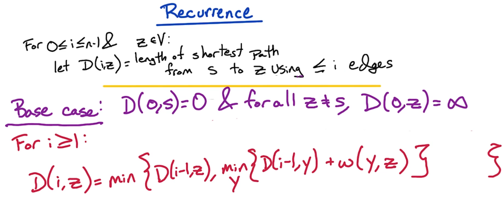{ width=650px }

We are defining $D(i,z)$ , the shortest path $s \rightsquigarrow z$ using at most $i$ edges.

In the ***base case***, $D(0,s) = 0$ and for all $z \ne s$ , $D(0,z) = \infty$ .

For the ***recursive cases***, where $i \ge 1$ , $D(i,z)$ uses either at most $i$ edges (i.e., $\le i$ ) or exactly $i$ edges (i.e., $= i$ ), with the optimal being the shortest of the two. This can be stated more formally as follows:

$$
D(i,z) = \min \bigg\{ D(i-1,z) , \mathop {\min}\limits_{y:\vec{yz} \in E} \big\{ D(i-1,y) + w(y,z) \big\} \bigg\}
$$

If the path requires $\le i$ edges, then the solution is simply $D(i-1,z)$ . Otherwise, if the path requires exactly $= i$ edges, then we check all possible choices for $y$ which minimize this penultimate path to $z$ . The optimal solution is then the shortest/minimum of these two.

Observe that as defined here, $D(i,z)$ is expressed in terms of $D(i-1,\dots)$ , therefore, this appropriately generates the necessary table to satisfy the solution to the problem.

Next, we will detail/define this algorithm more formally.

### 6. Dynamic Programming Algorithm

#### Pseudocode

Let us now detail the pseudocode for the dynamic programming algorithm to solve the single-source shortest path problem.

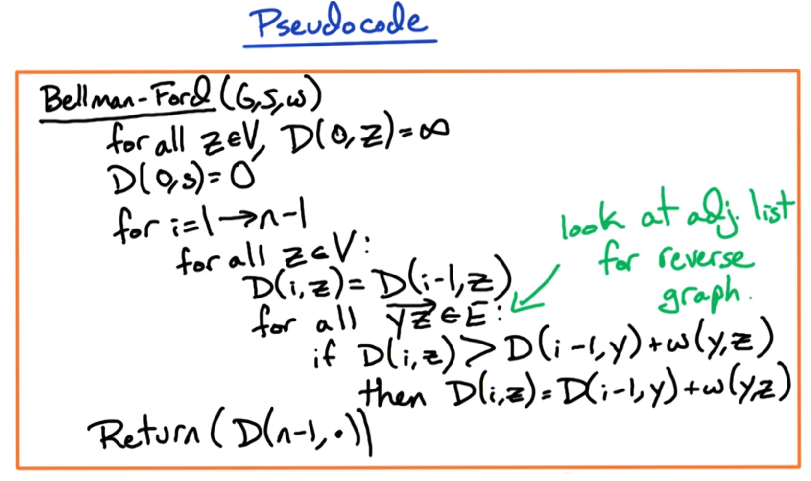{ width=650px }

The corresponding algorithm called the **Bellman-Ford algorithm** is given as follows:

$$
\boxed{
\begin{array}{l}
{{\text{Bellman-Ford}}(G,s,w):}\\
\ \ \ \ {{\text{for\ all\ }} z \in V:}\\
\ \ \ \ \ \ \ \ {D(0,z) = \infty}\\
\ \ \ \ {D(0,s) = 0}\\
\ \ \ \ {{\text{for\ }} i=1 \to n-1:}\\
\ \ \ \ \ \ \ \ {{\text{for\ all\ }} z \in V:}\\
\ \ \ \ \ \ \ \ \ \ \ \ {D(i,z) = D(i-1,z)}\\
\ \ \ \ \ \ \ \ \ \ \ \ {{\text{for\ all\ }} \vec{yz} \in E:}\\
\ \ \ \ \ \ \ \ \ \ \ \ \ \ \ \ {{\text{if\ }} D(i,z) > D(i-1,y) + w(y,z) {\text{\ then\ }} D(i,z) = D(i-1,y) + w(y,z)}\\
\ \ \ \ {{\text{return\ }} (D(n-1,\cdot))}
\end{array}
}
$$

***N.B.*** The namesake of the algorithm, Richard Bellman, originally developed the dynamic programming algorithmic technique in the 1940s.

The ***inputs*** to the algorithm are the directed graph $G$ , source vertex $s$ , and the edge weights $w$ .

First, $D(0,\cdots)$ is initialized for $s$ and all other vertices.

Next, the vertices are iterated over the range $i = 1 \to n$ , initialized as $D(i,z) = D(i-1,z)$ (i.e., using at most $i-1$ edges).

Next, the directed edges $\vec {yz}$ are iterated over, to determine if $D(i,z)$ should be updated with respect to the last edge (i.e., the case of edge strictly equal $=i$ ). If this last-edge path is optimal relative to the current optimal solution, then $D(i,z)$ is updated accordingly.
  * ***N.B.*** At this step, to determine the edge *into* vertex $z$ (i.e., $\vec{yz}$ ), we examine the adjacency list for the *reverse* graph accordingly (i.e., by correspondingly "flipping" the edges of the graph in this manner, which requires $O(n + m)$ such operations given $n$ vertices and $m$ edges). In the "original" version of the graph, the edges are directed *out* of $z$ , thereby necessitating this reversal accordingly.

Finally, the solution is returned as $D(n-1,\cdot)$ , via a two-dimensional table/array $D$ of size $(n-1) \times m$ (where the corresponding return value is the last row of this table). 

#### Running Time

Now, consider the overall running time for this algorithm.

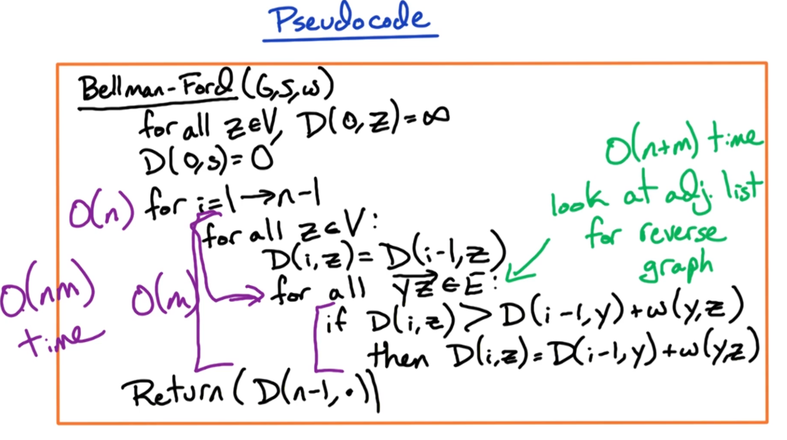{ width=650px }

Examining the nested $\text{for}$ loops (which, by inspection, dominate the overall algorithm running time), the outer loop requires $O(n)$ running time with respect to $n$ vertices. Furthermore, the innermost $\text{for}$ loop is performed with respect to all $m$ edges of the graph (where the two inner loops together effectively iterate over every edge exactly once in the process of this), with each innermost loop performing an $O(1)$ operation (i.e., checking and setting $D(i,z)$ ). Therefore, the overall running time is $O(nm)$ .

Observe that while this algorithm is slower than Dijkstra's algorithm (cf. Section 1, $O((m+n) \log (n))$ ), it nevertheless allows for negative weight edges to exist in the input graph. Furthermore, it is also generally able to identify negative weight cycles within the input graph (otherwise, if absent, then the algorithm will determine the shortest path from source vertex $s$ , which is generally well defined).

Next, let us determine how to explicitly detect such a negative weight cycle in the input graph.

### 7. Finding Negative Weight Cycle

How do we determine whether the input graph contains a negative weight cycle?

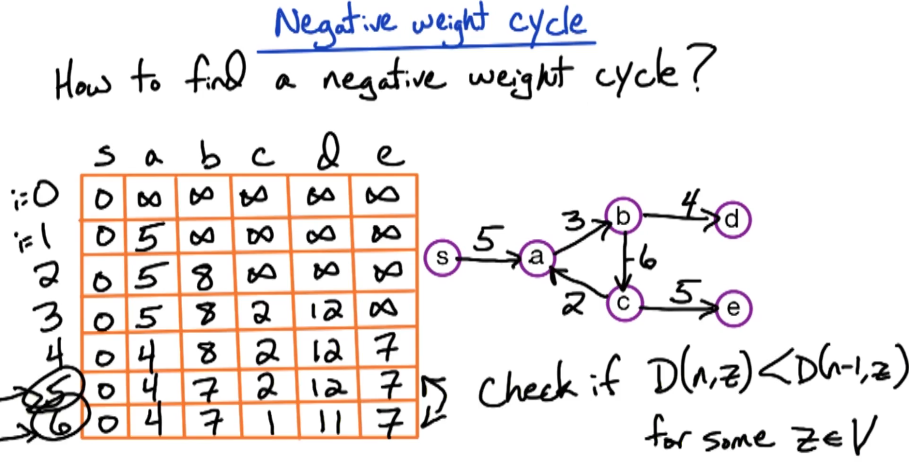{ width=650px }

Recalling (cf. Section 2) our previous example, we enumerate the Bellman-Ford algorithm steps (cf. Section 6) as follows:

| $i$ | $s$ | $a$ | $b$ | $c$ | $d$ | $e$ |
|:--:|:--:|:--:|:--:|:--:|:--:|:--:|
| $0$ | $0$ | $\infty$ | $\infty$ | $\infty$ | $\infty$ | $\infty$ |
| $1$ | $0$ | $5$ | $\infty$ | $\infty$ | $\infty$ | $\infty$ |
| $2$ | $0$ | $5$ | $8$ | $\infty$ | $\infty$ | $\infty$ |
| $3$ | $0$ | $5$ | $8$ | $2$ | $12$ | $\infty$ |
| $4$ | $0$ | $4$ | $8$ | $2$ | $12$ | $7$ |
| $5$ | $0$ | $4$ | $7$ | $2$ | $12$ | $7$ |
| $6$ | $0$ | $4$ | $7$ | $1$ | $11$ | $7$ |

In iteration $i = 0$ , the base case initializes the vertices straightforwardly.

In iteration $i = 1$ , the path $s \rightsquigarrow a$ is defined and updated accordingly, while all others are still inaccessible at this point.

In iteration $i = 2$ , the path $s \rightsquigarrow b$ is defined and updated accordingly, while $s \rightsquigarrow a$ remains as before.

In iteration $i = 3$ , the paths $s \rightsquigarrow c$ and $s \rightsquigarrow d$ are defined and updated accordingly, while $s \rightsquigarrow a$ and $s \rightsquigarrow b$ remain as before.

In iteration $i = 4$ , the path $s \rightsquigarrow e$ is defined and updated accordingly. However, interestingly, at this point, there is now a shorter path for $s \rightsquigarrow a$ via $s \rightarrow a \rightarrow b \rightarrow c \rightarrow a$ (i.e., around the negative weight cycle), which reduces $D(s,a)$ from $5$ down to $4$ . (The remaining paths are the same as before.)

In iteration $i = 5$ , with the reduction in $D(s,a)$ from the previous iteration, $D(s,b)$ is now correspondingly reduced from $8$ to $7$ accordingly. (The remaining paths are the same as before.)
  * ***N.B.*** At this point (i.e., $i = n-1$ , where $n-1 = 5$ in this example), the algorithm would otherwise terminate in the absence of a negative weight cycle, and constitute the final solution for the algorithm accordingly.

Examining a subsequent iteration (i.e., $i = 6$ ), the presence of the negative weight cycle similarly further reduces values, i.e., $D(s,c) = 1$ and $D(s,d) = 11$ in iteration $i = 6$ . More generally, with a negative weight cycle being present in the input graph, *every* row will continue to change with each iteration relative to the previous one (i.e., rather than converging on a solution at iteration $i = n - 1$ ). Correspondingly, such a ***check*** of row $n$ relative to $n-1$ (i.e., with respect to whether or not a change is observed) constitutes such a detection of a negative weight cycle within the input graph accordingly. More formally:

> Check if $D(n,z) < D(n-1,z)$ for some $z \in V$

Furthermore, the table can be used to explicitly identify this negative weight cycle (e.g., via changing values for vertices $a$ , $b$ , and $c$ in this example).

## 8-19. All-Pairs Shortest Path

### 8. Introduction

Let us now consider another variant of the shortest-path problem, which will give rise to a slightly different style of dynamic programming algorithm solution in the process of its examination.

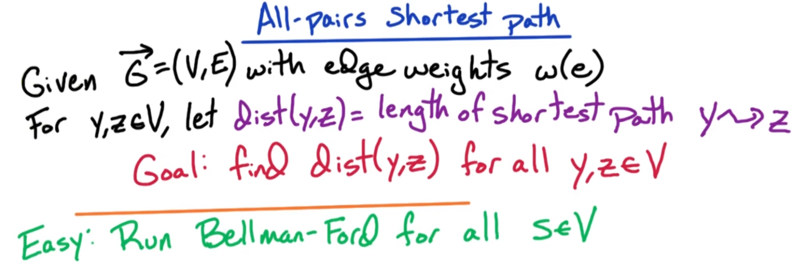{ width=650px }

Recall (cf. Section 6) that in the Bellman-Ford algorithm, a *single* source vertex $s$ was examined for its path length to the other constituent vertices in the input graph. Now, we consider *all* pairs of such shortest paths (i.e., among the constituent vertices in the input graph).

In this latter problem, we define it formally as follows:

> Given direct graph $\vec G = (V,E)$ with edge weights $w(e)$ (where in general the edge weights can be either positive or negative), for all vertex pairs $y,z \in V$ , let ${\text{dist}}(y,z)$ = length of the shortest path $y \rightsquigarrow z$

***N.B.*** Previously (cf. Section 1), we only considered the path $s \rightsquigarrow z$ for the single-source vertex $s$ . Conversely, here in this all-pairs consideration, this will give rise to a corresponding $n \times n$ matrix/table accordingly.

The ***goal*** is to find ${\text{dist}}(y,z)$ for all vertex pairs $y,z \in V$ .

The ***naive*** approach for solving the all-pairs version of the problem is to simply use the same Bellman-Ford algorithm from before (cf. Section 6) , performed $n$ times with respect to each vertex as the corresponding "source" vertex $s$ .

### 9. Naive Approach Quiz and Answers

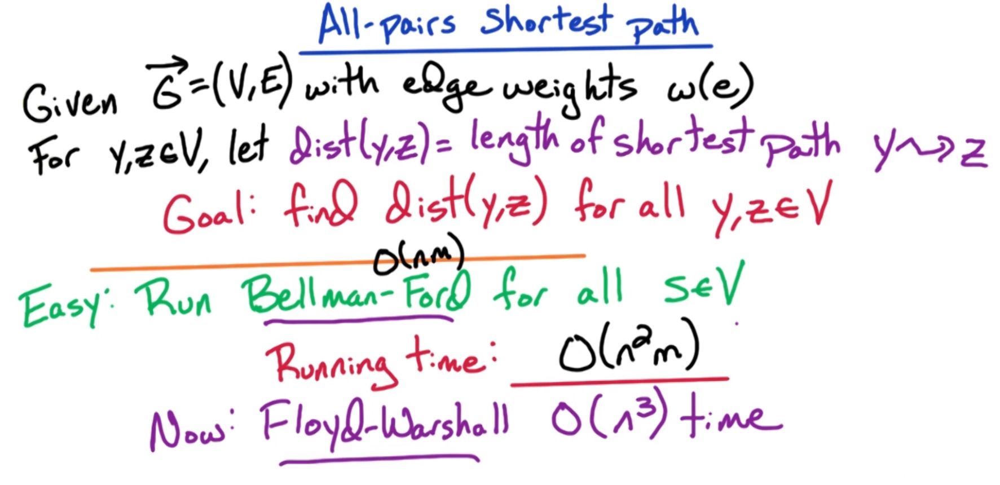{ width=650px }

Using the naive approach (cf. Section 8) of running the Bellman-Ford algorithm $n$ times to determine the all-pairs shortest paths, what is the overall running time for this approach?

Recall (cf. Section 6) that the Bellman-Ford algorithm has an overall running time of $O(nm)$ . Therefore, running this algorithm $n$ times yields a corresponding overall running time of $O(n^2m)$ accordingly.

Next, we will describe another algorithm called the **Floyd-Warshall** algorithm, having a comparatively better running time of $O(n^3)$ .
  * ***N.B.*** The reason for this "improvement" is that $m$ (the number of edges in the graph) can be up to $n^2$ , and if the graph is connected then there will be at least $n - 1$ edges (i.e., $n-1 \le m \le n^2$ per these constraints), giving a corresponding equivalent range of $O(n^3)$ to $O(n^4)$ via the naive approach using the Bellman-Ford algorithm.

***N.B.*** In general, the specific names of the algorithms are not of particular concern, but rather the objective is to understand their respective approaches and to be able to reason about their running time from this basic high-level intuition.

### 10. Sub-Problem

Let us now consider the basic idea for the dynamic programming algorithm for the all-pairs shortest paths problem.

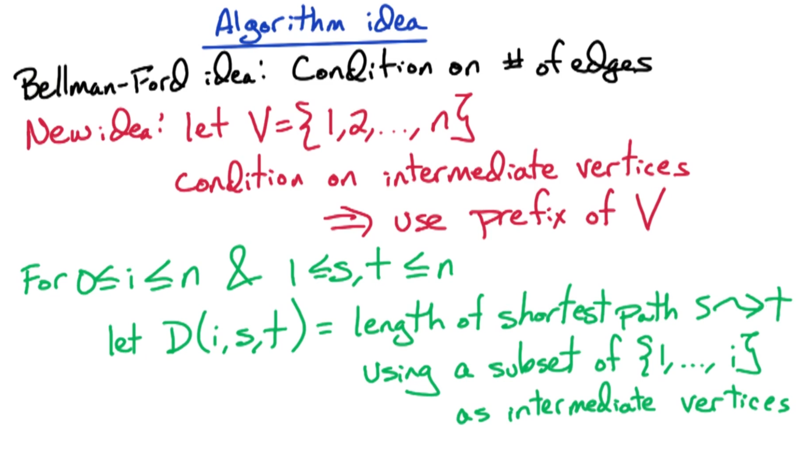{ width=650px }

First, let us reconsider (cf. Section 6) the Bellman-Ford algorithm, which determined the single-source shortest path for some source vertex $s$ . In that case, the dynamic programming approach involved conditioning on the number of edges in the length of the path. However, is there something else that we can condition on as well?

In the dynamic programming approach, we generally attempt to define a *prefix* of the input. Here, the prefix is the graph, and more specifically, the vertices of the input graph. We can formalize this notion of the graph's vertices as a prefix by letting $V =$ { $1,2,\dots,n$ }, where the vertices in $V$ are numbered and ordered (this allows to readily index the vertices accordingly). Now, we can examine a prefix of these vertices accordingly, i.e., solving the same all-pairs shortest paths sub-problem on a prefix of these vertices. Therefore, we can now condition on these intermediate vertices, using the corresponding prefix of $V$ accordingly.

Let us now formalize this discussion with a sub-problem definition:

> For $0 \le i \le n$ and $i \le s, t \le n$ , let $D(i,s,t)$ = length of the shortest path $s \rightsquigarrow t$ using a subset of { $1, \dots, i$ } as intermediate vertices

where the three parameters are defined as follows:
  * $i$ is the prefix of the vertex set $V$ which are allowable as intermediates on the prefix path of consideration
  * $s$ is the start vertex
  * $t$ is the end vertex

Here, we have a three-dimensional table $D(i,s,t)$ , whose elements contains the lengths of the shortest path between vertices $s$ and $t$ .

Next, we will define the recurrence relation for this sub-problem definition.

### 11-16. Recurrence

#### 11. Base Case Quiz and Answers

Let us now define the recurrence relation for the sub-problem defined previously (cf. Section 10) for the all-pairs shortest paths problem, starting with the base case.

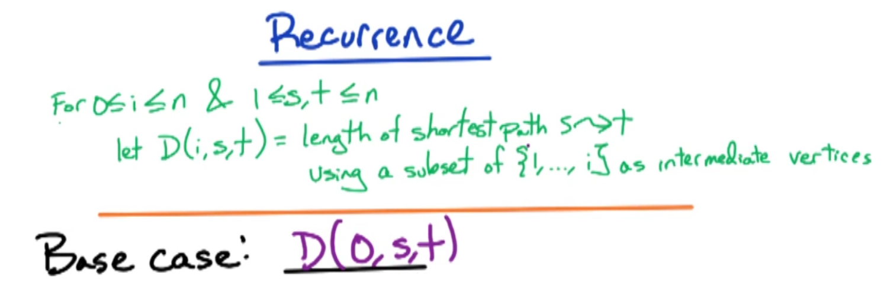{ width=650px }

For intuition for the base case, recall (cf. Section 4) the corresponding analog for the single-source shortest path problem via the Bellman-Ford algorithm.

Similarly, here, the corresponding ***base case*** is $D(0,s,t)$ , corresponding to the empty set of intermediate vertices , i.e., directly from $s$ to $t$ without any intermediate vertices in between.

#### 12-15. Recursive Cases

##### 12. Introduction

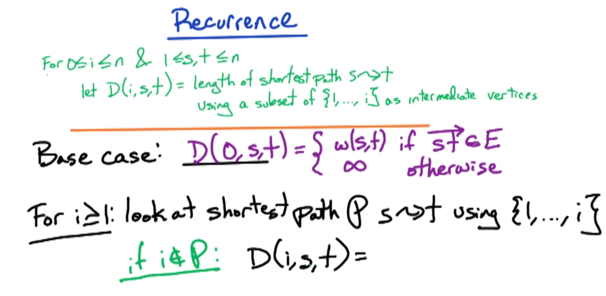{ width=650px }

Recalling (cf. Section 11) the ***base case***, we can further formalize its definition as follows:

$$
D(0,s,t) = 
\begin{cases}
  {w(s,t)}&{{\text{if\ }} \vec{st} \in E}\\ 
  {\infty}&{{\text{otherwise}}} 
\end{cases}
$$

If there is a directed edge $\vec{st} \in E$ present, then $D(0,s,t)$ is exactly the length of this edge (i.e., $w(s,t)$ ). Otherwise, there is no such available path (i.e., no intermediate vertices available).

Now, let us consider the ***recursive cases***. We can define the corresponding sub-problem as follows:

> For $i \ge 1$ : Examine the shortest path $P \equiv s \rightsquigarrow t$ using vertices { $1, \dots, i$ }

where this path $P$ is the solution to the sub-problem. If there are multiple such paths, than any of them can be chosen arbitrarily.

Now, the ***goal*** is to determine $D(i,s,t)$ given this definition, i.e., define recursively in terms of $i-1$ . This gives rise to two potential cases with respect to vertex $i$ itself:
  * 1 - $i \notin P$ ($i$ is *not* included in the prefix path)
  * 2 - $i \in P$ ($i$ is *included* in the prefix path)

The first case is more straightforward, so we shall examine it next.

##### 13. Case: $i$ Not on Path Quiz and Answers

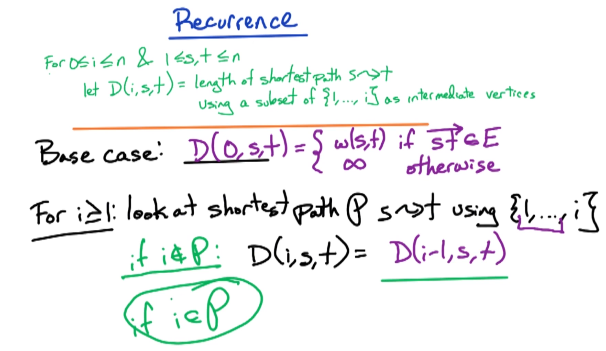{ width=650px }

If $i \notin P$ (i.e., vertex $i$ is *not* on the prefix path $P$ ), then the prefix path will only use the vertices { $1, \dots, i-1$ } as the intermediate vertices. Therefore, this gives rise to the straightforward recursive definition as follows:

$$
D(i,s,t) = D(i-1,s,t)
$$

Next, let us consider the more complicated case wherein $i \in P$ .

##### 14-15. Case: $i$ Is on Path

###### 14. Introduction

Now, consider the recursive case where $i \in P$ (i.e., vertex $i$ *is* on the prefix path $P$ ).

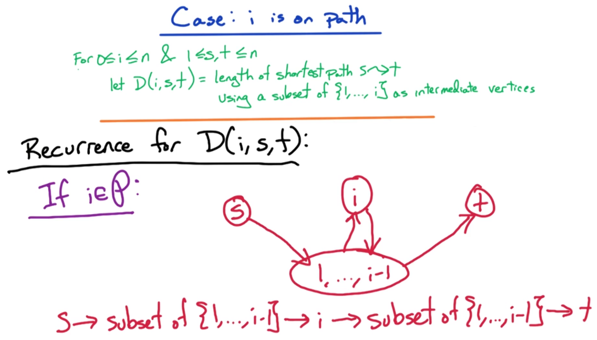{ width=650px }

Consider the path $s \rightsquigarrow i \rightsquigarrow t$ (as in the figure shown above), where $i$ is some intermediate vertex between vertices $s$ and $t$ .

In the first segment $s \rightsquigarrow i$ , the potential intermediate vertices are { $1, \dots, i-1$ } (in no particular order, and potentially even an empty subset).

Conceptually, this overall path resembles something along the lines of $s \rightarrow$ { $1, \dots, i-1$ } $\rightarrow \cdots$ , where eventually the path terminates on vertex $i$ . From there, the path may further proceed as $i \rightarrow$ { $1, \dots, i-1$ } $\rightarrow \cdots$ , ultimately terminating on vertex $t$ .

In summary:

$$
s \rightarrow \{ 1, \dots, i-1 \} \rightarrow \cdots i \rightarrow \{ 1, \dots, i-1 \} \rightarrow \cdots t
$$

which comprises four distinct subsets of the overall prefix path (i.e., as delimited by respective arrows $\rightarrow$ in above), where in general { $1, \dots, i-1$ } denotes some subset of these vertices (including the empty subset).

Now, the task at hand is to define $D(i,s,t)$ accordingly (i.e., expressed as smaller sub-problems) in this case, as discussed next.

###### 15. Quiz and Answers

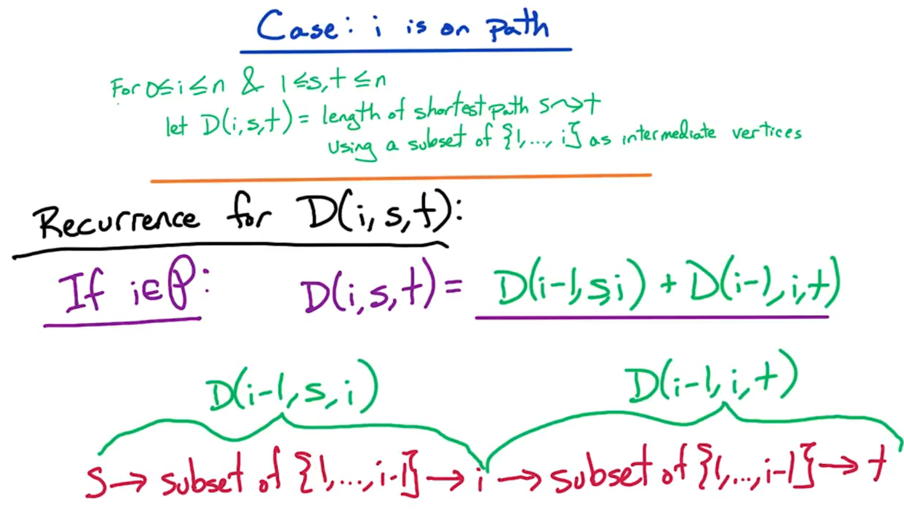{ width=650px }

To express the recurrence relation $D(i,s,t)$ in the case of $i \in P$ , we want to express this in terms of $i-1$ (i.e., a smaller sub-problem), for some pair of vertices $s$ and $t$ .

Examining the path $s \rightarrow$ { $1, \dots, i-1$ } $\rightarrow \cdots \rightarrow i$ , we can express this directly as $D(i-1,s,i)$ .

Similarly, the path $i \rightarrow$ { $1, \dots, i-1$ } $\rightarrow \cdots \rightarrow t$ , can express this directly as $D(i-1,i,t)$ .

Therefore, the total length of this path is the sum of these two terms, i.e.,:

$$
D(i,s,t) = D(i-1,s,i) + D(i-1,i,t)
$$

Now, given (cf. Section 13 for complementary case $i \notin P$ ) the full expression for the recursive relation as follows:

$$
D(i,s,t) = 
\begin{cases}
  {D(i-1,s,t)}&{i \notin P}\\ 
  {D(i-1,s,i) + D(i-1,i,t)}&{i \in P}
\end{cases}
$$

we simply take the optimal (i.e., shortest) of these paths.

##### 16. Summary

Having now handled both cases $i \notin P$ and $i \in P$ for the recurrence relation (cf. Section 15), let us now summarize the recurrence relation $D(i,s,t)$ .

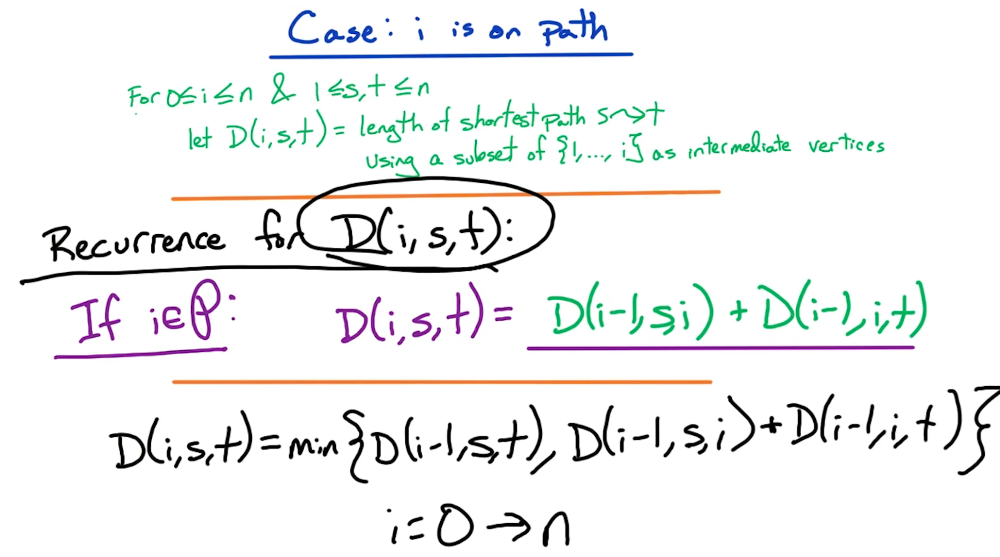{ width=650px }

Since we are attempting to find the optimal (i.e., shortest) path among these, we take the minimum as follows:

$$
D(i,s,t) = \min \big\{ D(i-1,s,t), D(i-1,s,i) + D(i-1,i,t) \big\}
$$

Observe that in this expression, $D(i,s,t)$ is defined in terms of $D(i-1, \cdots)$ (i.e., smaller sub-problems), with vertex $i$ varying as $i = 0 \to n$ accordingly.

Next, we consider the dynamic programming algorithm for this problem.

### 17-19. Dynamic Programming Algorithm

#### 17. Pseudocode

Now, we can write the pseudocode for the all-pairs shortest path problem. The corresponding algorithm is called the **Floyd-Warshall algorithm**.

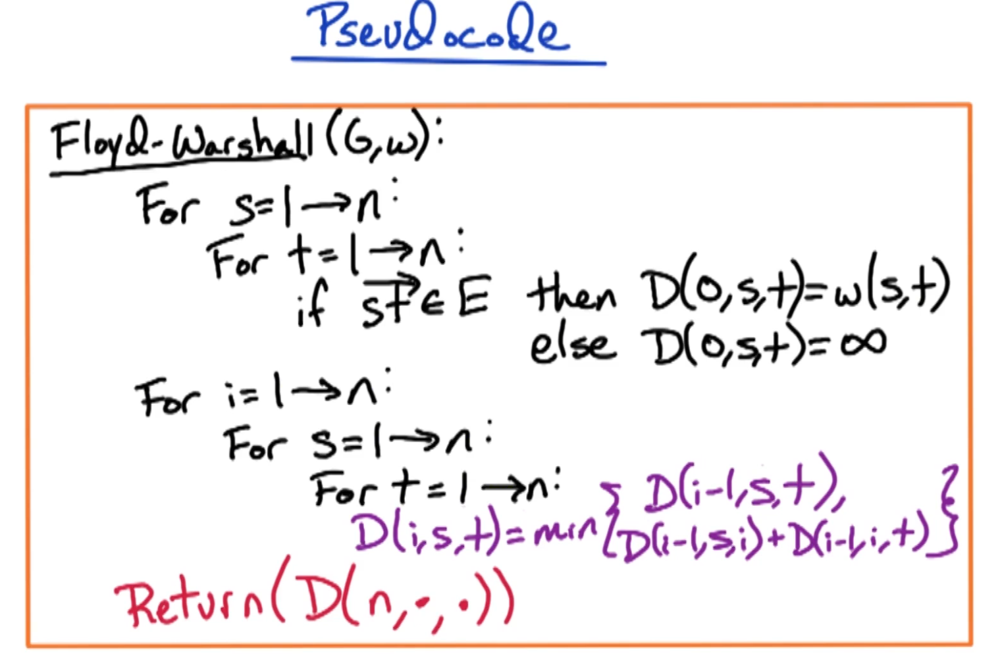{ width=650px }

$$
\boxed{
\begin{array}{l}
{{\text{Floyd-Warshall}}(G,w):}\\
\ \ \ \ {{\text{for\ }} s = 1 \to n:}\\
\ \ \ \ \ \ \ \ {{\text{for\ }} t = 1 \to n:}\\
\ \ \ \ \ \ \ \ \ \ \ \ {{\text{if\ }} \vec{st} \in E {\text{\ then\ }} D(0,s,t) = w(s,t)}\\
\ \ \ \ \ \ \ \ \ \ \ \ {{\text{else\ }} D(0,s,t) = \infty}\\
\ \ \ \ {{\text{for\ }} i = 1 \to n:}\\
\ \ \ \ \ \ \ \ {{\text{for\ }} s = 1 \to n:}\\
\ \ \ \ \ \ \ \ \ \ \ \ {{\text{for\ }} t = 1 \to n:}\\
\ \ \ \ \ \ \ \ \ \ \ \ \ \ \ \ {D(i,s,t) = \min \big\{ D(i-1,s,t), D(i-1,s,i) + D(i-1,i,t) \big\}}\\
\ \ \ \ {{\text{return\ }} (D(n,\cdot,\cdot))}
\end{array}
}
$$

The ***inputs*** to the algorithm are directed graph $G$ and edge weights $w$ (where in general the weights can be either positive or negative).

The initial pair of $\text{for}$ loops constitute the ***base case***, i.e., populating $D(0,s,t)$ accordingly for all pairs. Recall (cf. Section 10) that the vertices are numbered $1, ..., n$ . If an edge exists between candidates $s$ and $t$ , then the corresponding weight $w(s,t)$ is populated accordingly; otherwise, if no such edge exists, then $D(0,s,t)$ is simply initialized as $\infty$ .

Next, the more general ***recursive cases*** are handled accordingly, i.e., populating $D(i,s,t)$ for all intermediate vertices $i$ (where $i$ varies across $1 \to n$ ). Furthermore, this is similarly performed across all vertex pairs $s, t$ accordingly. The corresponding recurrence relation is as defined previously (cf. Section 16), i.e.,:

$$
D(i,s,t) = \min \big\{ D(i-1,s,t), D(i-1,s,i) + D(i-1,i,t) \big\}
$$

where the two cases correspond to whether or not (respectively) $i$ is present in the prefix path.

Finally, the algorithm ***returns*** the value $D(n,\cdot,\cdot)$ , which is a two-dimensional array/matrix containing all pairs shortest paths (i.e., having $n \times n$ such entries) corresponding to the last "slice" of the three-dimensional table $D$ .

#### 18. Running Time Quiz and Answers

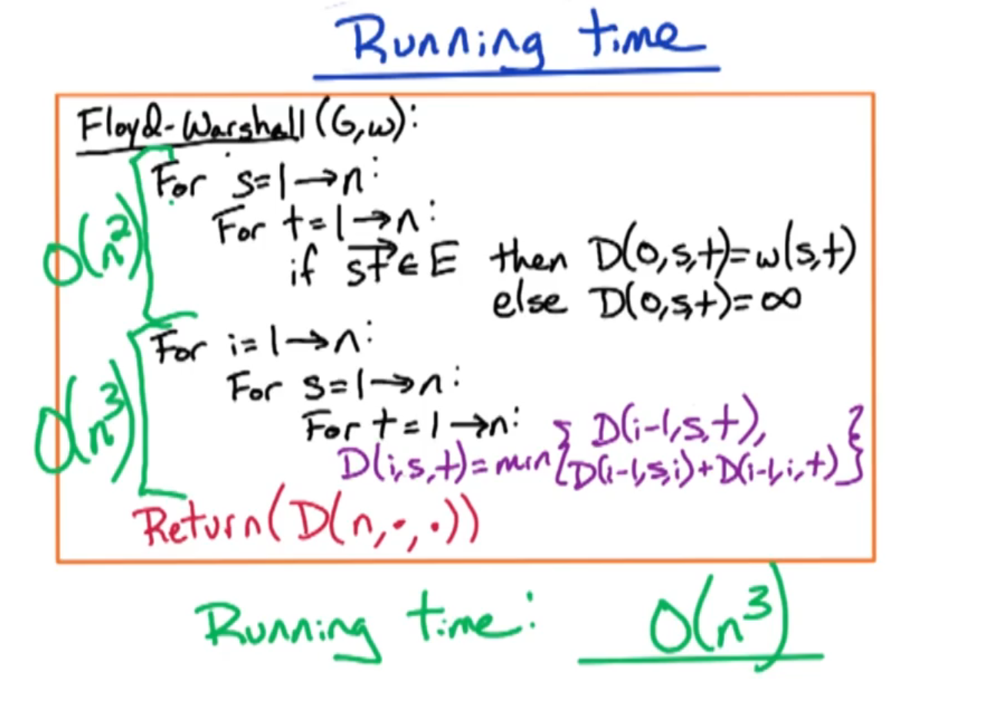{ width=650px }

The running time for the Floyd-Warshall algorithm (cf. Section 17) is fairly straightforward to analyze.

The first set of $\text{for}$ loops perform an operation of running time $O(1)$ (i.e., initializing the base case) via $n^2$ such iterations, i.e., a corresponding running time of $O(n^2)$ .

The next set of $\text{for}$ loops (i.e., recursive cases) similarly perform an operation of running time $O(1)$ via $n^3$ such iterations, i.e., a corresponding running time of $O(n^3)$ . Furthermore, this set of operations is dominating, thereby constituting the overall running time of the algorithm accordingly.

#### 19-20. Negative Weight Cycles

##### 19. Introduction

How does the presence of negative weight cycles (cf. Section 2) affect our algorithm for all-pairs shortest paths?

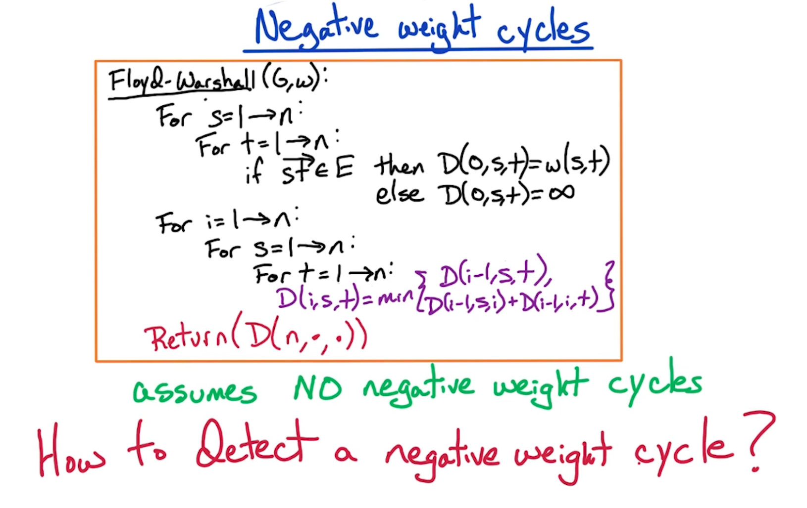{ width=650px }

As given (cf. Section 18), the algorithm assumes that ***no*** such negative weight cycles exist in the input graph (which is a separate/distinct assumption from the simple presence of negative-weight *edges* $w$ in the input graph). So, then, how to detect such a negative weight cycle?

{ width=650px }

To get a better idea of how to detect negative weight cycles in the graph, consider the example as in the figure shown above, which contains such a negative weight cycle $a \rightarrow b \rightarrow c$ . How can we detect this negative weight cycle in the graph?

Note that the final output of the algorithm is $D(n,s,t)$ for all vertex pairs $s,t$ . Consider vertex $a$ in this example, i.e.,:

$$
D(n,a,a) = -1
$$

which is obtained by traversing the negative weight cycle with $s = a$ and $t = a$ .

By similar reasoning, $D(n,b,b) = D(n,c,c) = -1$ as well.

More generally, any such diagonal entry in the two-dimensional array/matrix $D(n,\cdot,\cdot)$ having a negative value indicates the presence of a negative weight cycle, i.e.,:

> Check if $D(n,y,y)$ < 0 for some vertex $y \in V$

where in general $D(n,y,y)$ is such a diagonal entry.

Observe that now we have two algorithms (cf. Section 7 for analogous detection via the single-source shortest pair Bellman-Ford algorithm) for detecting such negative weight cycles. However, there are some important distinctions between their respective detection methods, as discussed next.

##### 20. Comparing Algorithms

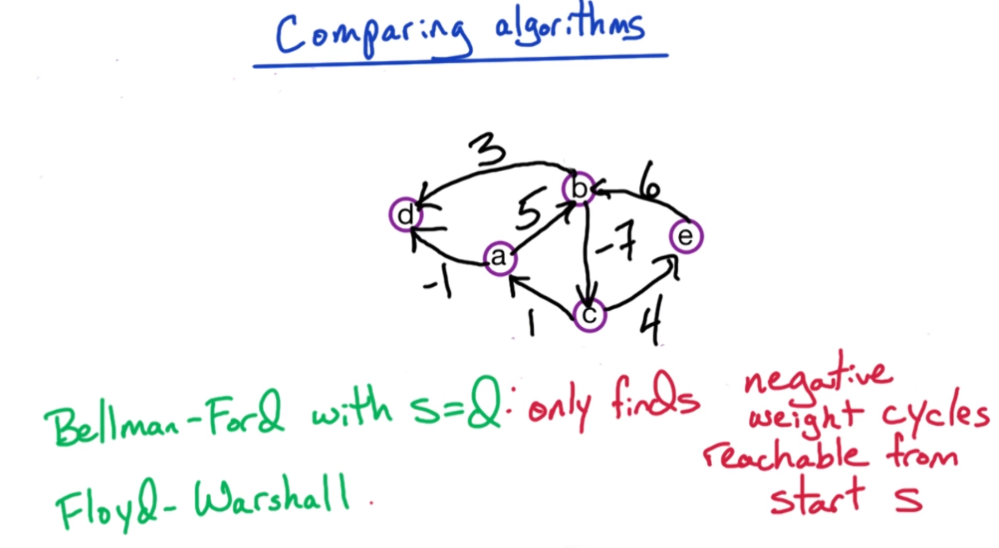{ width=650px }

Consider a revision of the previous example (cf. Section 19), as in the figure shown above, whereby the direction of the edge $d \rightarrow b$ is now inverted to $b \rightarrow d$ . Let us now compared the two algorithms in question for detecting negative weight cycles, i.e., single-source shortest path via Bellman-Ford (cf. Section 7) and all-pairs shortest paths via Floyd-Warshall (cf. Section 19).

In this updated example, consider running the Bellman-Ford algorithm starting with source vertex $d$ . Observe that with this source vertex selected, no other vertex is reachable, including those comprising the present negative weight cycle (i.e., vertices $a$, $b$, and $c$ ). Because of this inability to reach the negative weight cycle, the algorithm ***fails*** to detect it. Therefore, the Bellman-Ford algorithm ***only*** detects negative weight cycles which are ***reachable*** from source vertex $s$ .

Conversely, the Floyd-Warshall algorithm is capable of generally detecting negative weight cycles in the input graph (i.e., those vertices present as negative values on its main diagonal in the output matrix), due to its more systematic examination of ***all*** vertex pairs in the input graph.

## 21. Addendum: Practice Problems

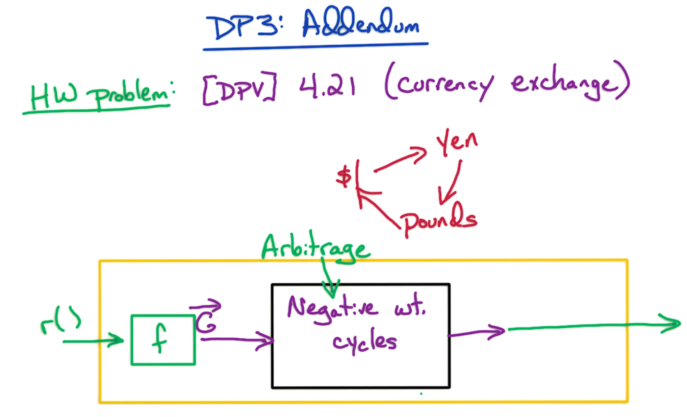{ width=650px }

At the conclusion of the lesson on shortest paths, the professor recommends practice problem 4.21 from Chapter 4 in the course companion textbook *Algorithms* by Dasgupta et al.

This problem deals with currency exchange, and the corresponding arbitrage problem. Starting with some currency (e.g., $1 USD), this is exchanged for another currency (e.g., yen), which is then exchanged for yet another currency (e.g., GB pounds), and then finally exchanged back to the original currency (i.e., USD). After this cycle concludes, we are looking to encounter a situation whereby the original value is *increased* on final conversion (in finance, such an anomaly is called an *arbitrage*).

Although this problem is in the context of graphs (Chapter 4), in the present context, we can reduce this problem to the negative weight cycle detection problem. Recall (cf. Section 20) that we have two such algorithms readily available: single-pair shortest path via Bellman-Ford and all-pairs shortest paths via Floyd-Warshall.
  * ***N.B.*** Rather than modifying these algorithms, we can use them here as "black boxes," i.e., subroutines, library code, or equivalent.

Given a directed graph $\vec G$ as input, we obtain the negative weight cycle(s) in the graph (if present). With such a "black box" readily available, we further wish to construct an algorithm for this currency exchange problem, i.e., an algorithm to detect arbitrage. As input, this algorithm takes exchange rates $r()$ , which are converted into a graph via function $f$ (which reduces the currency exchange problem into a graph problem with negative weight cycle detection). The corresponding output from the "black box" is taken as the output of this algorithm. Therefore, the ***goal*** is to define $r()$ and $f$ accordingly for this algorithm.

More generally, this process is called **reduction** (e.g., reducing the arbitrage problem to a graph problem).
  * ***N.B.*** Such reductions will be an underlying theme in this course, where we first design efficient algorithms, and then later use them for solving other problems. Additionally, we will use such reductions to prove the property of "problem hardness" in the context of NP-completeness.
