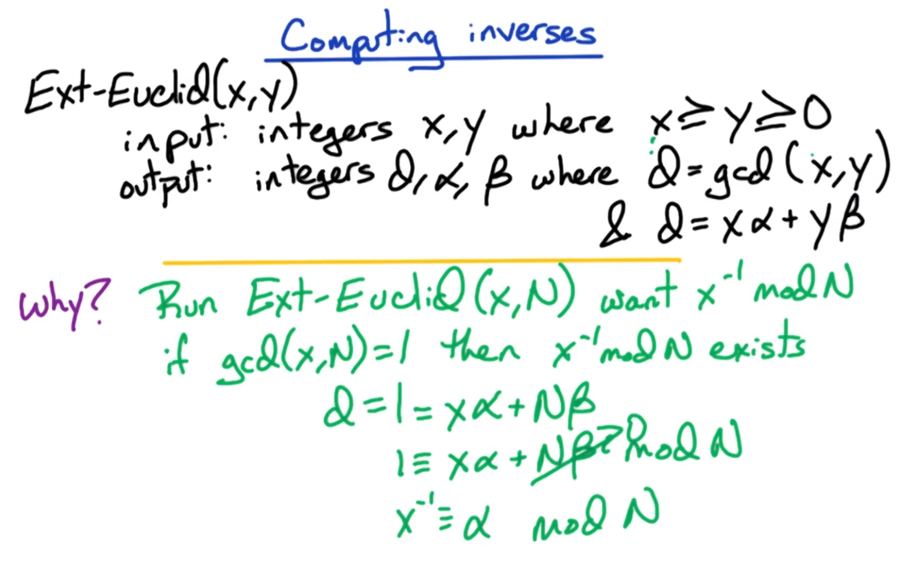
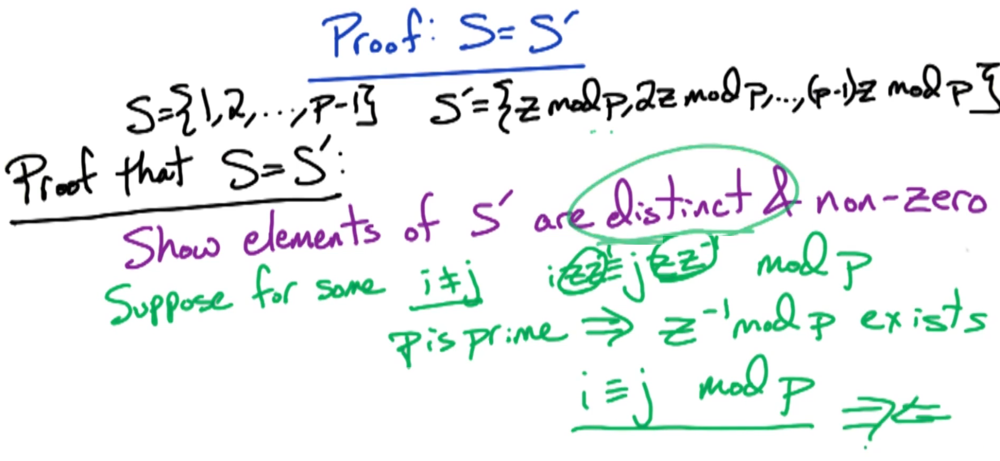

# Randomized Algorithms: Topic Introduction

## Introduction

{ width=300px }

In this lecture, we will dive into **randomized algorithms**. Hopefully by the end, the student will appreciate the beauty and power of this algorithmic tool.

Discussion begins with cryptography, examining the **RSA cryptosystem**, which is widely used. It is extremely elegant; once we examine the basic mathematics of its underlying **modular arithmetic**, you will consequently appreciate the ingenuity of the RSA protocol accordingly. From there, you will have a basis for understanding of many of today's commonly used cryptosystems.

Another useful application of randomized algorithms we will examine is **hashing**. In particular, we will study the hashing scheme known as **Bloom filters**, which is quite popular in many fields. We will examine its underlying mathematics, as well as involve some relevant probability analysis. This will conclude with a programming project which implements and studies Bloom filters accordingly.

## Lecture Overview

> [!NOTE]
> ***Instructor's Note***: This topic is covered in [DPV] Chapter 1 (Algorithms with numbers), and we closely follow their presentation. For Eric's notes see [here](https://cs6505.wordpress.com/rsa-1/).

{ width=650px }

Now, consider an ***outline*** of the topics we will study in this lecture.

The mathematics of the RSA cryptosystem are very beautiful, and fairly simple to understand with a sufficient mathematical background accordingly. Therefore, the lecture begins with a short primer on the relevant mathematical topics, which include the following:
  * **modular arithmetic**
    * ***N.B.*** This topic may be familiar from previous coursework, exposure, etc.
  * **multiplicative inverses**
  * **Euclid's greatest common divisor (GCD) algorithm**

Next, we will examine **Fermat's little theorem**, a key tool in the design of the RSA algorithm; indeed, at this point, we will be able to detail the **RSA algorithm** accordingly.

Finally, we will examine **primarily testing**, i.e., given a number, determine whether it is prime or composite (non-prime); we accomplish this using the aforementioned Fermat's little theorem. From there, we will be able to **generate random primes**, which is a key component in the RSA algorithm, thereby concluding its discussion accordingly.

We therefore next shall commence with discussion of these algorithms pertaining to the RSA algorithm.

# Randomized Algorithms 1: Modular Arithmetic

## 3. Huge Integers

Let us first consider the context for the RSA algorithm.

{ width=650px }

In cryptography, we typically work with $n$-bit numbers (e.g., $x$ , $y$ , and $N$ ), where the size of constituent bits in these numbers is *huge* (i.e., with $n$ being on the order of $1024$ or $2048$ bits, representing correspondingly $2^{1024} - 1$ or $2^{2048} - 1$ distinct integers, respectively, including integer $0$ in both cases). While we typically consider arithmetic operations on hardware as $O(1)$ "fast" operations, in practice, this is only strictly the case for $n$ being a $32$- or $64$-bit number.

Therefore, let us now review exactly how "expensive" such corresponding arithmetic operations are when dealing with these large-bit numbers.

## 4-6. Modular Arithmetic Overview

### 4. Introduction

> [!NOTE]
> ***Instructor's Note***: See also [DPV] Chapter 1.2 (Modular arithmetic).

Now, let us review **modular arithmetic**, the basic mathematics underlying the RSA algorithm.

{ width=650px }

Consider the simple example $x \mod 2$ , where $x$ is an integer and $\text{mod}$ denotes the "modulo" operator. $x \mod 2$ is the ***least-significant bit*** of $x$ , which in turn indicates whether $x$ is odd or even, i.e.,:

$$
x \mod 2 = 
\begin{cases}
  {1}&{{\text{if\ }} x {\text{\ is\ odd}}}\\ 
  {0}&{{\text{if\ }} x {\text{\ is\ even}}}
\end{cases}
$$

Another way to look at this is to divide $x$ by $2$ , and examining the resulting remainder (i.e., if divisible by $2$ then the remainder is $0$ , otherwise the remainder is $1$ ).

Now, consider an arbitrary integer $N$ where $N \ge 1$ . The corresponding definition is:

> $x \mod N$ = remainder when $x$ is divided by $N$

Let us also consider some important ***notation*** for modular arithmetic. Suppose we have two numbers $x$ and $y$ , with both having the same/common $\mod N$ . These two numbers are *not* necessarily *equal*, however, they are ***congruent/equivalent***. We therefore denote this relationship as follows:

$$
x \equiv y \mod N
$$

where notation $\equiv$ is read as "is congruent to."

This means that $\frac{x}{N}$ and $\frac{y}{N}$ have the *same* remainder.

### 5. Example: $\mod 3$

> [!NOTE]
> ***Instructor's Note***: See also [DPV] Chapter 1.2 (Modular arithmetic).

To better understand the concept of modular arithmetic, let us consider another simple example, $\mod 3$ .

{ width=650px }

When examining $\mod 3$ , there are three possible values:

$$
0, 1, 2
$$

Formally, this is defined as an **equivalence class**, i.e., $\mod 3$ has three such equivalence classes.

We can further enumerate these three (distinct) equivalence classes for $\mod 3$ as follows:

$$
\begin{matrix}
{\cdots}&{-9}&{-6}&{-3}&{0}&{3}&{6}&{9}&{\cdots}\\
{\cdots}&{-8}&{-5}&{-2}&{1}&{4}&{7}&{10}&{\cdots}\\
{\cdots}&{-7}&{-4}&{-1}&{2}&{5}&{8}&{11}&{\cdots}
\end{matrix}
$$

The first row represents the equivalence class for $0$ , e.g., $3 \mod 3 = 0$ , $3 \mod 6 = 0$ , etc.

Similarly, the second row represents the equivalence class for $1$ , e.g., $4 \mod 3 = 1$ , $7 \mod 3 = 1$ , etc.

Furthermore, the third row represents the equivalence class for $2$ , e.g., $5 \mod 3 = 2$ , $8 \mod 3 = 2$ , etc.

Note that these equivalence classes also extend into the negative integers as well. 

These equivalence classes follow directly from the following definition:

> $x \mod N = r$ if $x = qN + r$ for integers $q,r$

where $q$ is the quotient and $r$ is the remainder.

This means that there is some multiple $N$ for which $q$ such integer multiples added to $r$ reconstitutes the original number $x$ (e.g., $-2 \mod 3$ in this form is represented as $q = -1$ , $N = 3$ , and $r = 1$ which yields back $x = (-1)(3) + 1 = -2$ , with $r$ corresponding to the appropriate equivalence class $1$ and $q$ corresponding to the appropriate "offset" [from position $0$ at the centerline] $-1$ in the row representation above).

Therefore, within a given equivalence class (i.e., "row" in the representation above), the corresponding numbers are all the "same" (i.e., *congruent*) with respect to $\mod 3$ .

### 6. Basic Fact Quiz and Answers

> [!NOTE]
> ***Instructor's Note***: See also [DPV] Chapter 1.2 (Modular arithmetic): the substitution rule.

{ width=650px }

A basic fact that we will use repeatedly is given as follows:

> If $x \equiv y \mod N$ and $a \equiv b \mod N$ , then $x + a \equiv y + b \mod N$ and $xa \equiv yb \mod N$

In this formalism, both $x$ and $y$ are congruent with each other, as are $a$ and $b$ . Furthermore, observe the "replacement/substitution" property exhibited in the latter expressions by virtue of this congruence.

To illustrate the utility of this fact, consider the expression $321 \times 17 \mod 320$ . We can use the given fact to simplify this computation as follows:
  * Note that $321 \equiv 1 \mod 320$
  * Hence, $321 \times 17 \equiv 1 \times 17 \equiv 17 \mod 320$

Therefore, the expression  $321 \times 17 \mod 320$ simply evaluates to $17$ .

## 7-9. Modular Exponentiation

### 7. Naive Quiz and Answers

#### Introduction

> [!NOTE]
> ***Instructor's Note***: See also [DPV] Chapter 1.2.2 (Modular exponentiation).

Having seen basic modular arithmetic (cf. Section 4), we now shift focus to the **modular exponentiation** operation, which will be ubiquitously used in subsequent discussion.

{ width=650px }

As before (cf. Section 3), we are given $n$-bit numbers $x$ , $y$ , and $N$ which are *huge* (i.e., with the constituent $n$ bits comprising $1024$ or $2048$ bits, correspondingly representing numbers/integers on the order of $O(2^{2^{10}}) \approx O(10^{308})$ or $O(2^{2^{11}}) \approx O(10^{616})$ , respectively). The ***goal*** is to compute the quantity $x^y /\mod N$ in an ***efficient*** manner, i.e., of order polynomial in the input size $n$ .
  * ***N.B.*** Notably, we do *not* simply require polynomial in the input numbers $x$ , $y$ , and $N$ , because these numbers are already intrinsically exponential in $n$ , giving rise to unfathomably slow running times in practice.

#### Algorithm

{ width=650px }

First, consider a simple ***algorithm*** to perform this multiplication, outlined as follows:

$$
\begin{array}{l}
{x \mod N = a_1}\\
{x^2 \equiv a_1x \mod N = a_2}\\
{x^3 \equiv a_2x \mod N = a_3}\\
{\vdots}\\
{x^y \equiv a_{y-1}x \mod N}
\end{array}
$$

Starting with $x \mod N = a_1$ , the result $a_1$ is then propagated forward to compute $x^2$ via $x^2 \equiv a_1x \mod N = a_2$ , which in turn is propagated forward to compute $x^3$ , and so on, until finally the target quantity $x^y$ is computed.

So, then, what is the ***running time*** for this algorithm?

In a given round, the result denoted as $a_i$ is an $n$-bit number (i.e., at most $N-1$ , as per corresponding operation $\mod N$ ), and similarly $x$ itself is also an $n$-bit number. Multiplying two such $n$-bit numbers together can be accomplished straightforwardly with basic arithmetic, correspondingly requiring $O(n^2)$ running time accordingly. Furthermore, taking $\mod N$ of this product (i.e., dividing by $N$ and taking the remainder as the result) also requires $O(n^2)$ time by similar rationale. Therefore, one such "round" requires overall $O(n^2)$ running time.

Furthermore, there are $y$ such rounds performed overall, where $y$ is at most $2^n$ bits in size (i.e., $y \le 2^n$ ).

Therefore, the overall running time is $O(n^2y) = O(n^22^n)$ , which is exponential in the input size $n$ . This is a very inefficient algorithm accordingly (i.e., even an input as small as $n = 30$ or so would fail to converge on a solution in any reasonable time).

To improve this solution, we will next utilize a technique of repeated squaring.

#### Example Quiz and Answers

As an exercise, compute the quantity $7^5 \mod 23$ using this simple/naive algorithm.

This can be accomplished as follows:

$$
\begin{matrix}
{7^1}&{\equiv}&{7}&{}&{}&{\equiv}&{7 \mod 23}\\
{7^2}&{\equiv}&{7 \times 7}&{}&{}&{\equiv}&{3 \mod 23}\\
{7^3}&{\equiv}&{3 \times 7}&{}&{}&{\equiv}&{21 \mod 23}\\
{7^4}&{\equiv}&{21 \times 7}&{\equiv}&{147}&{\equiv}&{9 \mod 23}\\
{7^5}&{\equiv}&{9 \times 7}&{\equiv}&{63}&{\equiv}&{17 \mod 23}
\end{matrix}
$$

Therefore, the expression evaluates to $17$ .

### 8. Fast Quiz and Answers

> [!NOTE]
> ***Instructor's Note***: See also [DPV] Chapter 1.2.2 (Modular exponentiation).

#### Algorithm

{ width=650px }

In the ***algorithm*** involving repeated squaring, we proceed similarly to before (cf. Section 7), however, with intermediate squaring across rounds, as follows:

$$
\begin{array}{l}
{x \mod N = a_1}\\
{x^2 \equiv a_1^2 \mod N = a_2}\\
{x^4 \equiv (a_2)^2 \mod N = a_4}\\
{x^8 \equiv (a_4)^2 \mod N = a_8}\\
{\vdots}
\end{array}
$$

This results in $x^y$ where $y$ is a power of $2$ . We then examine the binary representation of $y$ to determine $x^y mod N$ via appropriate power of $2$ accordingly.

#### Example Quiz and Answers

{ width=650px }

As an exercise, compute the quantity $7^25 \mod 23$ using this fast algorithm via repeated squaring.

This can be accomplished as follows:

$$
\begin{matrix}
{7^1}&{\equiv}&{7}&{}&{}&{\equiv}&{7 \mod 23}\\
{7^2}&{\equiv}&{7^2}&{}&{}&{\equiv}&{3 \mod 23}\\
{7^4}&{\equiv}&{3^2}&{}&{}&{\equiv}&{9 \mod 23}\\
{7^8}&{\equiv}&{9^2}&{\equiv}&{81}&{\equiv}&{12 \mod 23}\\
{7^{16}}&{\equiv}&{12^2}&{\equiv}&{144}&{\equiv}&{6 \mod 23}
\end{matrix}
$$

Since $25$ in binary form is $11001_2$ (i.e., relevant factors per corresponding $1$ bits are $7^{16}$ , $7^8$ , and $7^1$ ), this gives:

$$
7^{25} \equiv 7^{16} \times 7^8 \times 7^1 \equiv 6 \times 12 \times 7 \equiv 72 \times 7 \equiv 3 \times 7 \equiv 21 \mod 23
$$

Therefore, using corresponding squares, the expression evaluates to $21$ .

### 9. Algorithm

{ width=650px }

To define the algorithm for modular exponentiation, we will use a couple of ***key facts***, given as follows (where $x$ and $y$ are both integers):
  * For even $y$ , $x^y = (x^{y/2})^2$
  * For odd $y$ , $x^y = x(x^{\lfloor {y/2} \rfloor})^2$

We can therefore define a divide and conquer algorithm for modular exponentiation as follows:

$$
\boxed{
\begin{array}{l}
{{\text{Mod-Exp}}(x,y,N):}\\
\ \ \ \ {{\text{input:\ }} n {\text{-bit\ integers\ }} x,y,N \ge 0}\\
\ \ \ \ {{\text{output:\ }} x^y \mod N}\\
\\
\ \ \ \ {{\text{if\ }} y = 0 {\text{\ then\ }} {\text{return\ }} (1)}\\
\ \ \ \ {z = {\text{Mod-Exp}}(x, \lfloor \frac{y}{2} \rfloor, N)}\\
\ \ \ \ {{\text{if\ }} y {\text{\ is\ even\ then\ }} {\text{return\ }} (z^2 \mod N)}\\
\ \ \ \ {{\text{else\ }} {\text{return\ }} (xz^2 \mod N)}
\end{array}
}
$$

The ***inputs*** are non-negative integers $x$ , $y$ , and $N$ , all of size $n$-bits.

Since the algorithm is recursive, we begin with the ***base case***. The exponent decreases with each iteration, therefore, in the base case, we have the trivial solution of $y^0 = 1$ (furthermore, we assume $N \ge 0$ to ensure this).

In the general ***recursive cases***, we utilize the aforementioned key facts to reduce the exponent iteratively, examining the respective cases of even and odd $y$ . In either case, we first compute $z$ (i.e., the corresponding quantity $(\cdots)$ in expressions $x^y = (\cdots)^2$ and $x^y = x(\cdots)^2$ ), and then correspondingly returning the respective results accordingly (i.e., even vs. odd).

## 10-15. Multiplicative Inverse

### 10. Introduction

> [!NOTE]
> ***Instructor's Note***: See also [DPV] Chapter 1.2.5 (Modular division).

A key concept we will require for the RSA algorithm is **multiplicative inverses**. This concept is somewhat subtly different from the previously seen modular arithmetic (cf. Section 4).

{ width=650px }

Let us examine normal real numbers to understand multiplicative inverses better in that context.

For example, the number $3$ has multiplicative inverse $\frac{1}{3}$ , i.e., $3 \times \frac{1}{3} = 1$ . More generally, given a number $a$ , its multiplicative inverse $\frac{1}{a}$ similarly yields $a \times \frac{1}{a} = 1$ .

Now, consider number $z$ . What is $\frac{1}{z} \mod N$ , i.e., $\mod N$ of its multiplicative inverse?

We define this as follows:

> $x$ is the multiplicative inverse of $z \mod N$ if $xz \equiv 1 \mod N$ 

This is essentially equivalent to the notion of $z \times \frac{1}{z} = 1$ .

Furthermore, note the following corresponding ***notation***:

$$
x \equiv z^{-1} \mod N
$$

$$
z \equiv x^{-1} \mod N
$$

where in the latter form, $z$ is analogously the multiplicative inverse of $x$ as well.

Next, we examine a specific example to solidify understanding of this concept of multiplicative inverse.

### 11. Example

> [!NOTE]
> ***Instructor's Note***: See also [DPV] Chapter 1.2.5 (Modular division).

{ width=650px }

Consider the example of $N = 14$ . Let us examine the multiplicative inverses $1 \mod 14, 2 \mod 14, \dots, 13 \mod 14$ , as follows:

| $x$ | $x^{-1} \mod N$ | Comment |
|:--:|:--:|:--:|
| $1$ | $1^{-1} \equiv 1 \mod 14$ | This is a trivial case (i.e., $1$ is always its own inverse) |
| $2$ | $2^{-1} \equiv \_ \mod 14$ | Does not exist |
| $3$ | $3^{-1} \equiv 5 \mod 14$ | |
| $4$ | $4^{-1} \equiv \_ \mod 14$ | Does not exist |
| $5$ | $5^{-1} \equiv 3 \mod 14$ | Complementary to case $x = 3$ |
| $6$ | $6^{-1} \equiv \_ \mod 14$ | Does not exist |
| $7$ | $7^{-1} \equiv \_ \mod 14$ | Does not exist |
| $8$ | $8^{-1} \equiv \_ \mod 14$ | Does not exist |
| $9$ | $9^{-1} \equiv 11 \mod 14$ | |
| $10$ | $10^{-1} \equiv \_ \mod 14$ | Does not exist |
| $11$ | $11^{-1} \equiv 9 \mod 14$ | Complementary case to $x = 9$ |
| $12$ | $12^{-1} \equiv \_ \mod 14$ | Does not exist |
| $13$ | $13^{-1} \equiv 13 \mod 14$ | |

So, then, when exactly does the multiplicative inverse exist? Note the following observations:
  * $2$ , $4$ , $6$ , $8$, $10$ , and $14$ are all even numbers, sharing the common divisor $2$ .
  * Similarly, $7$ shares a common divisor with $14$ (i.e., itself, $7$ ).

Therefore, if there is ***no*** common divisor with $N$ (i.e., only non-integer-multiple primes relative to $N$ itself), then a multiplicative inverse ***exists***.

### 12. Existence

So, then, more formally, when exactly does a multiplicative inverse exist?

{ width=650px }

The general theorem which addresses this question is stated as follows:

> $x^{-1} \mod N$ exists iff ${\text{gcd}}(x,N)=1$

where ${\text{gcd}}$ is the **greatest common divisor**.

Here, ${\text{gcd}}(x,N)=1$ implies that $x$ and $N$ have ***no*** common divisor. In this case, it said that $x$ and $N$ are **relatively prime**.

As an example, if $x$ and $N$ are both even, then ${\text{gcd}}(x,N)=2$ , and therefore they are *not* relatively prime accordingly.

Before we formally examine why two numbers' relative primality implies their multiplicative inverse, we will consider some more useful terminology.

### 13-15. Terminology

#### 13. Introduction

{ width=650px }

Suppose that $x^{-1} \mod N$ exists (i.e., $x$ has a multiplicative inverse). Let us now prove that if this inverse (if it exists) is **unique**. But what does "unique" mean in this context?

Consider a specific example of $x = 3$ and $N = 11$ . By inspection:

$$
3^{-1} \equiv 4 \mod 11
$$

i.e., $3 \times 4 \equiv 12 \equiv 1 \mod 11$ .

Now, consider $x = 4$ and $N = 11$ . Here, there are infinite possibilities with respect to $4 \mod 11$ , i.e.,:

$$
4 \equiv 15 \equiv 26 \equiv -7  \equiv \cdots
$$

All of these numbers are multiplicative inverses of general form $x^{-1} \mod 11$ , however, by ***convention***, we will generally report $x^{-1} \mod N$ as the smallest non-negative integer (i.e., in $0, 1, \dots, N-1$ ), provided that it exists. Otherwise, we simply report "does not exist" accordingly.
  * ***N.B.*** Later, we will learn how to determine the multiplicative inverse if it exists, using the extended Euclid algorithm. The algorithm often returns the *negative* number, which requires a corresponding simple calculation to convert to a form which conforms to this convention.

#### 14. Unique

{ width=650px }

Let us now return to the previous matter of uniqueness (cf. Section 13): Suppose that $x^{-1} \mod N$ exists (i.e., $x$ has a multiplicative inverse). If the inverse exists, *how many* such multiplicative inverses exist (i.e., is there only *one* unique such inverse, or are there many)?

We shall now prove that if an inverse does in fact exist, then it ***is*** unique (i.e., strictly $\le 1$ such existing multiplicative inverses, where $x^{-1}$ exists somewhere in the range $0, ..., N-1$ ). We prove this via contradiction.

Suppose that $x$ has *two* multiplicative inverses $z$ and $y$ , i.e.,:

$$
z \equiv x^{-1} \mod N
$$

$$
y \equiv x^{-1} \mod N
$$

Furthermore, suppose that are "different/distinct" such that $y \not\equiv z \mod N$ , i.e., $0 \le y \ne z \le N - 1$ .

Since $z \equiv x^{-1} \mod N$ , then $xz \equiv 1 \mod N$ (cf. Section 10). Similarly, since $y \equiv x^{-1} \mod N$ , then $yz \equiv 1 \mod N$ . Therefore:

$$
xy \equiv xz \equiv 1 \mod N
$$

Since we assume $x^{-1}$ exists, we can multiply as follows:

$$
\begin{array}{c}
(\bcancel{{{x^{-1}}x}})y \equiv (\bcancel{{{x^{-1}}x}})z \equiv 1 \mod N\\
y \equiv z \mod N
\end{array}
$$

However, this latter expression $y \equiv z \mod N$ directly contradicts our previous assumption that $y \not\equiv z \mod N$ .

Therefore, we conclude that if a multiplicative inverse *exists*, then it is *unique*.
  * ***N.B.*** Later, we will prove that if $x$ and $N$ are relatively prime (i.e., ${\text{gcd}}(x,N)=1$ ), then $x^{-1} \mod N$ exists. We will prove this by using the extended Euclid algorithm to find this corresponding multiplicative inverse.

Next, we will prove that if $x$ and $N$ have a common factor (i.e., ${\text{gcd}}(x,N)>1$), then no such multiplicative inverse exists.

#### 15. Non-Existence

> [!NOTE]
> ***Instructor's Note***: See also [DPV] Chapter 1.2.5 (Modular division).

Let us now consider the case where multiplicative inverses do *not* exist, and why they do not exist.

{ width=650px }

Recall (cf. Section 12) the following theorem:

> $x^{-1} \mod N$ exists iff ${\text{gcd}}(x,N)=1$

By corollary, if ${\text{gcd}}(x,N) > 1$ , then $x^{-1} \mod N$ does not exist. But why is this the case?

For some intuition behind the proof of this, consider the case where $x$ and $N$ are both even, and therefore ${\text{gcd}}(x,N) = 2 > 1$ . By understanding this case, it will provide a more general understanding as well.

Suppose that $z$ were a multiplicative inverse of $x$ , i.e., $z \equiv x^{-1} \mod N$ . This further implies that $xz \equiv 1 \mod N$ . More generally:

$$
xz = N + 1 = 2N + 1 = 3N + 1 = \cdots = qN + 1 
$$

where $q$ is some integer multiple.

Given that we assume that $x$ is even, then in general $xz$ should also be even (i.e., an even number times any other number yields an even product). Furthermore, this also implies that the product $qN$ is also even; however, this also means that $qN + 1$ is odd, which invalidates the general statement above. Therefore, there is *no* such multiplicative inverse $z$ of $x$ .

Furthermore, more generally, if $x$ and $N$ share a common divisor, then the corresponding proof follows directly from this same reasoning.

Returning to the original theorem, if $x$ and $N$ are relatively prime, i.e., ${\text{gcd}}(x,N)=1$ , then $x^{-1} \mod N$ exists. Why is this the case? We prove this by detailing an algorithm which is capable of *finding* this multiplicative inverse, thereby proving its existence accordingly. The algorithm in question involves Euclid's algorithm for finding the greatest common divisor (i.e., ${\text{gcd}}$ ), which is further extended/modified to find $x^{-1} \mod N$ on the condition that ${\text{gcd}}(x,N)=1$ . We detail this algorithm next.

## 16-19. Greatest Common Divisor (GCD)

### 16. Euclid's Rule

> [!NOTE]
> ***Instructor's Note***: See also [DPV] Chapter 1.2.3 (Euclid's algorithm for greatest common divisor).

Before proceeding onto Euclid's algorithm, let us first discuss **Euclid's rule**, the basis for the recursive Euclid's algorithm.

{ width=650px }

Consider integers $x$ and $y$ , for which we are interested in computing their greatest common divisor (i.e., ${\text{gcd}}(x,y)$ ). Furthermore, let us assume that $x \ge y > 0$ .

A basic fact is the following:

$$
{\text{gcd}}(x,y) = {\text{gcd}}(x \mod y,y)
$$

***N.B.*** Since $x \ge y$ , here we use expression $x \mod y$ accordingly.

Therefore, in order to compute ${\text{gcd}}(x,y)$ and we can use this fact accordingly (which in turns gives rise a natural recursive definition). However, first, let us consider the basic proof for why this fact holds.

The proof relies on the following simple fact, which we further denote as $*$ :

$$
{\text{gcd}}(x,y) = {\text{gcd}}(x - y,y)
$$

Observe that if $*$ is applied repeatedly, it eventually converges on the equivalent expression ${\text{gcd}}(x \mod y,y)$ from the initial fact.

Furthermore, to express $x \mod y$ , ths can be accomplished as follows:

$$
x \mod y = x - qy
$$

where $q$ is an integer. Therefore, correspondingly $q$ such subtractions eventually yields the remainder (i.e., $y$ such that $x \ge y$ ) accordingly.

Therefore, proof of the latter fact in turns proves the initial fact accordingly.

{ width=650px }

So, then, why is statement/fact $*$ necessarily true (i.e., proof that the statement holds)? This can be thought of as an iff statement (i.e., $\iff$ ), comprised of the following complementary statements/components:
  * (*forward direction*) if $d$ divides $x$ and $y$ then $d$ divides $x-y$
    * in other words, if $d$ factors out of $x$ and $y$, then it also factors out of the quantity $x-y$
  * (*reverse direction*) if $d$ divides $x-y$ and $y$ then $d$ divides $x$

{ width=450px }

With this proof formalized, to summarize, **Euclid's rule** (i.e., the "initial fact") is therefore stated as follows:

$$
{\text{gcd}}(x,y) = {\text{gcd}}(x \mod y,y)
$$

Next, we will use this fact to design a recursive algorithm for computing ${\text{gcd}}(x,y)$ .

### 17-19. Euclid's Algorithm

#### 17. Pseudocode

> [!NOTE]
> ***Instructor's Note***: See also [DPV] Chapter 1.2.3 (Euclid's algorithm for greatest common divisor).

{ width=450px }

Having now seen Euclid's rule (cf. Section 16), this leads to the following naturally recursive algorithm called **Euclid's algorithm**:

$$
\boxed{
\begin{array}{l}
{{\text{Euclid}}(x,y):}\\
\ \ \ \ {{\text{input:\ integers }} x,y {\text{\ where\ }} x \ge y \ge 0}\\
\ \ \ \ {{\text{output:\ }} {\text{gcd}}(x,y)}\\
\\
\ \ \ \ {{\text{if\ }} y = 0 {\text{\ then\ }} {\text{return\ }} (x)}\\
\ \ \ \ {{\text{else\ }} {\text{return\ }} ({\text{Euclid}}(y,x \mod y))}
\end{array}
}
$$

The ***inputs*** to the algorithm are integers $x$ and $y$ , which are assumed to be ordered and non-negative (i.e., $x \ge y \ge 0$ ).

The corresponding ***output*** of the algorithm is ${\text{gcd}}(x,y)$ .

Since this is a recursive algorithm, we first consider the ***base case***, given as:

$$
{\text{gcd}}(x,0) = x
$$

***N.B.*** This base case is not necessarily immediately intuitive, so we will further discuss it next.

Otherwise, in the more general ***recursive cases***, we use Euclid's rule (cf. Section 16) recursively, i.e.,:

$$
{\text{Euclid}}(y,x \mod y)
$$

***N.B.*** Here, we invert the order of the inputs/parameters as $(y, x \mod y)$ , since we assume that $x \ge y \ge 0$ .

#### 18. Base Case

Let us now further consider the base case in Euclid's algorithm.

{ width=450px }

Recall (cf. Section 17) that the base case is defined as follows:

$$
{\text{gcd}}(x,0) = x
$$

But what are the divisors of $0$ , exactly?

First, consider how we arrive at this base case: We take ${\text{gcd}}(kx,x)$ , where $k$ is some integer multiple. Then, by making the recursive call on this expression as ${\text{Euclid}}(x, kx \mod x)$ (where in general $kx \mod x = 0$ for any integer multiple $k$ ), this reduces simply to:

$$
{\text{gcd}}(x,0) = {\text{gcd}}(kx,x) = x
$$

#### 19. Running Time

> [!NOTE]
> ***Instructor's Note***: See also [DPV] Chapter 1.2.3 (Euclid's algorithm for greatest common divisor).

##### Analysis

Let us now consider the running time of Euclid's algorithm.

{ width=450px }

The only non-trivial step in each recursive round/iteration is the computation of expression $x \mod y$ . This involves division of $x$ by $y$ , which correspondingly requires $O(n^2)$ operations with respect to inputs of size $n$ bits.

So, then, how to determine the total number of such rounds required in this algorithm? This can be determined using the following key ***lemma***:

> If $x \ge y$ , then $x \mod y < \frac{x}{2}$

Therefore, in general $x \mod y$ is always reducing by a factor of two (i.e., halving) in each round.

To illustrate this, consider the following sequence of the algorithm (i.e., successive recursive calls):

$$
(x,y) \rightarrow (y, x \mod y) \rightarrow \big( x \mod y, y \mod (x \mod y) \big) \rightarrow \cdots
$$

Since the lemma states that $x \mod y < \frac{x}{2}$ , then after the first two rounds, the first parameter $x$ has been reduced in size by at least a factor of two (i.e., $< \frac{x}{2}$ ). Therefore, the algorithm will take at most $2n$ rounds (i.e., $\le 2n$ ), since this halving will occur in every other round of recursion.

Therefore, the overall running time for the algorithm is $O(n^2 \times 2n) = O(n^3)$ .

##### Proof of Lemma

Let us further prove this lemma.

{ width=450px }

The lemma is restated as follows:

> If $x \ge y$ , then $x \mod y < \frac{x}{2}$

We will break up this proof into the appropriate cases (based on size of $y$ ), from which the proof will immediately follow.

First, consider the case of $y \le \frac{x}{2}$ (i.e., small relative to $\frac{x}{2}$ ). In this case:

> If $y \le \frac{x}{2}$ , then $x \mod y \le y - 1 < y \le \frac{x}{2}$

Therefore, it is strictly the case that $x \mod y < \frac{x}{2}$ .

Next, we consider the case of $y > \frac{x}{2}$ (i.e., large relative to $\frac{x}{2}$ ). In this case, the following is generally true:

$$
\bigg\lfloor \frac{x}{y} \bigg\rfloor = 1
$$

i.e., $y$ goes into $x$ at most one time.

So, then, what does this imply about $x \mod y$ (i.e., the corresponding remainder)? This implies the following:

$$
x \mod y = x - y
$$

i.e., it is only necessary to subtract $x$ *once* in order to arrive at the corresponding remainder.

However, since $y > \frac{x}{2}$ , this implies the following:

$$
x \mod y = x - y < x - \frac{x}{2}
$$

and furthermore:

$$
x \mod y = x - y < x - \frac{x}{2} \le \frac{x}{2}
$$

Therefore, it is again strictly the case that $x \mod y < \frac{x}{2}$ .

## 20-21. Computing Inverses

### 20. Introduction

> [!NOTE]
> ***Instructor's Note***: See also [DPV] Chapter 1.2.5 (Modular division).

Now, let us consider how to compute multiplicative inverses using Euclid's algorithm (cf. Section 19) via corresponding **extended Euclid algorithm**.

{ width=650px }

To accomplish this, the algorithm takes as ***inputs*** the integer $x$ and $y$ as before, similarly defined as:

> integers $x,y$ where $x \ge y \ge 0$

where (as before) $x$ and $y$ are ordered.

However, the ***output*** of this algorithm is three integer parameters $d$ , $\alpha$ , and $\beta$ , defined as:

> integers $d$ , $\alpha$ , and $\beta$ , where $d = {\text{gcd}}(x,y)$ and $d = x\alpha + y\beta$

Therefore, $d$ has the equivalent output as before in Euclid's algorithm. However, the additional parameters $\alpha$ and $\beta$ satisfy the additional constraint/relationship $d = x\alpha + y\beta$ .

So, then, what is the purpose of $\alpha$ and $\beta$ ?

Recall that the objective of this algorithm is to compute multiplicative inverses, i.e., running algorithm ${\text{Ext-Euclid}}(x,N)$ . However, first we must determine whether $x^{-1} \mod N$ even exists.

To determine this, we see if $x$ and $N$ are relatively prime (cf. Section 12) via ${\text{gcd}}(x,N) = 1$ , which in turn implies the existence of $x^{-1} \mod N$ accordingly.

Correspondingly, $d$ contains the result of ${\text{gcd}}(x,N)$ . Therefore, if $d = 1$ , then the following relationship holds:

$$
d = 1 = x\alpha + N\beta
$$

Furthermore, if we take ${\text{mod}}$ of both sides, this gives congruence:

$$
1 \equiv x\alpha + N\beta \mod N
$$

Per the second term on the right-hand side $N\beta$ reduces to $0$ , i.e.,:

$$
1 \equiv x\alpha + 0\beta \mod N
$$

This in turn simplifies to:

$$
1 \equiv x\alpha \mod N
$$

which is simply the definition of the multiplicative inverse (cf. Section 10), i.e., $\alpha$ and $x \mod N$ are multiplicative inverses. This relationship can be further re-expressed equivalently as follows:

$$
x^{-1} \equiv \alpha \mod N
$$

By similar rationale, in the case where $d = 1$ , $\beta$ and $N \mod x$ are also multiplicative inverses.

Therefore, if $x$ and $y$ are relatively prime (i.e., $d = {\text{gcd}}(x,y) = 1$ ), then $\alpha$ and $\beta$ correspondingly represent the following:

$$
\alpha \equiv x^{-1} \mod y
$$

$$
\beta \equiv y^{-1} \mod x
$$

### 21. Extended Euclid Algorithm

> [!NOTE]
> ***Instructor's Note***: See [DPV] Chapter 1.2.4 (An extension of Euclid's algorithm) for the detailed proof of correctness.

#### Pseudocode

Let us know detail the **extended Euclid algorithm**.

{ width=650px }

The pseudocode for the algorithm is given as follows:

$$
\boxed{
\begin{array}{l}
{{\text{Ext-Euclid}}(x,y):}\\
\ \ \ \ {{\text{input:\ integers }} x,y {\text{\ where\ }} x \ge y \ge 0}\\
\ \ \ \ {{\text{output:\ integers }} d,\alpha,\beta {\text{\ where\ }} d = {\text{gcd}}(x,y) {\text{\ and\ }} d = x\alpha + y\beta}\\
\\
\ \ \ \ {{\text{if\ }} y = 0 {\text{\ then\ }} {\text{return\ }} (x,1,0)}\\
\ \ \ \ {(d,\alpha',\beta') = {\text{Ext-Euclid}}(y,x \mod y)}\\
\ \ \ \ {{\text{return\ }} (d,\beta',\alpha' - \big\lfloor \frac{x}{y} \big\rfloor \beta')}
\end{array}
}
$$

As before (cf. Section 19), the algorithm takes as ***inputs*** the integer $x$ and $y$ , similarly defined as:

> integers $x,y$ where $x \ge y \ge 0$

where (as before) $x$ and $y$ are ordered.

Furthermore, the ***output*** of this algorithm is three integer parameters $d$ , $\alpha$ , and $\beta$ (cf. Section 20).

In the ***base case*** where $y = 0$ , the algorithm returns the following:

$$
(x,1,0)
$$

Here, the first parameter is the simplification ${\text{gcd}}(x,0) = x$ as before (cf. Section 18). Furthermore, in this case (i.e., $y = 0$ ), we can satisfy the relationship $d = x\alpha + y\beta$ by inspection via $\alpha = 1$ and $\beta = 0$ (i.e., the corresponding other two parameters).

For the general ***recursive cases***, we use Euclid's rule (cf. 16), i.e.,:

$$
{\text{gcd}}(x,y) = {\text{gcd}}(x \mod y,y)
$$

The corresponding recursive relation is therefore:

$$
(d,\alpha',\beta') = {\text{Ext-Euclid}}(y,x \mod y)
$$

Finally, we must manipulate these returned parameters $d$ , $\alpha'$ , and $\beta'$ to obtain the desired output for $x$ and $y$ .

$d$ remains unchanged, since $d = {\text{gcd}}(x,y) = {\text{gcd}}(y,x \mod y)$ (i.e., as per Euclid's rule). Furthermore, given the relationship/constraint $d = x\alpha + y\beta$ , we set the corresponding parameters as follows:

$$
\alpha = \beta'
$$

$$
\beta = \alpha' - \bigg\lfloor \frac{x}{y} \bigg\rfloor \beta'
$$

***N.B.*** cf. proof of correctness (e.g., textbook or equivalent resource) to better understand the derivation of the expression for the latter (i.e., $\beta$ ) as given here.

#### Running Time

What is the running time for the extended Euclid algorithm?

Similarly to Euclid's algorithm (cf. Section 19), the overall running time for this algorithm is $O(n^3)$ .
  * ***N.B.*** As before, the main "bottlenecking" operation is $x \mod y$ , which is performed in every round of recursion. Furthermore, This "bottleneck" also correspondingly exists in the computation of expression $\beta = \alpha' - \big\lfloor \frac{x}{y} \big\rfloor \beta'$ by similar rationale.

#### Example Quiz and Answers

As an example, use the algorithm $\text{Ext-Euclid}$ to compute the expression $7^{-1} \mod 360$ (i.e., $\text{Ext-Euclid}(360,7)$ ).

{ width=650px }

To accomplish this, let us first examine $(x,y)$ in the recursive sub-problems, i.e.,:

$$
(360,7) \rightarrow (7,3) \rightarrow (3,1) \rightarrow (1,0)
$$

***N.B.*** This is the same sequence of sub-problems encountered in Euclid's algorithm (cf. Section 17) as well.

Now, let us examine the pair $(\alpha, \beta)$ returned in turn for these inputs:

| $(x,y)$ | $(\alpha, \beta)$ |
|:--:|:--:|
| $(1,0)$ | $(1,0)$ |
| $(3,1)$ | $(0,1)$ |
| $(7,3)$ | $(1,-2)$ |
| $(360,7)$ | $(-2,103)$ |

Therefore:

$$
7^{-1} \equiv 103 \mod 360
$$

which gives the final result of $103$.

***N.B.*** We also get that $360^{-1} \equiv -2 \mod 7$ . Simplifying, we have $360 \equiv 3 \mod 7$ and $-2 \equiv 5 \mod 7$ . Therefore, $3^{-1} \equiv 5 \mod 7$ .

## 22. Recap

> [!NOTE]
> ***Instructor's Note***: This topic is covered in [DPV] Chapter 1 (Algorithms with numbers), and we closely follow their presentation. For Eric's notes see [here](https://cs6505.wordpress.com/rsa-1/).

Let us now recap what we have seen so far with respect to randomized algorithms.

{ width=350px }

We began with basic modular arithmetic definitions (cf. Section 4).

Furthermore, the first non-trivial algorithm that we encountered (cf. 8) was computing modular exponentiation of general form $x^y \mod N$ using the idea of repeated squaring. This algorithm has a running time of $O(n^2)$ with respect to $n$-bit integer inputs $x$ and $y$ . Furthermore, this algorithm will be a key component in the RSA algorithm.

{ width=350px }

The other key concept that we examined was multiplicative inverses, i.e., expressions of the form $x^{-1} \mod N$ . We noted that this inverse exists *only* iff ${\text{gcd}}(x,N) = 1$ (i.e., $x$ and $N$ are relatively prime). To check for this existence, we compute ${\text{gcd}}$ directly via Euclid's algorithm (cf. Section 17). If they do exist, then computing the corresponding (unique) multiplicative inverse follows directly from the extended Euclid algorithm (cf. Section 21).

The aforementioned algorithms highlighted here will be used extensively in the RSA cryptosystem, as discussed in the next section.

# Randomized Algorithms 2: RSA

## 1-5. Fermat's Little Theorem

### 1. Introduction

> [!NOTE]
> ***Instructor's Note***: This topic is covered in [DPV] Chapter 1.3 (Primality testing), and we closely follow their presentation. For Eric's notes see [here](https://cs6505.wordpress.com/rsa-1/).

Before discussing the RSA cryptosystem, we will first examine the mathematical basis for the entire cryptosystem.

{ width=350px }

The relevant key concept is called **Fermat's little theorem**, which states the following:

> If $p$ is prime, then for every $1 \le z \le p-1$ , $z^{p-1} \equiv 1 \mod p$

i.e., for any $z$ which is relatively prime to $p$ , which can be equivalently stated as ${\text{gcd}}(z,p) = 1$ , $z^{p-1} \equiv 1 \mod p$ .

This fact forms the basis of the following:
  * the RSA algorithm
  * primality test (i.e., test if number $x$ is prime)

Next, we will examine the proof of Fermat's little theorem. In this process, several interesting insights emerge, such as how relationship between the prime $p$ and $z$ gives rise to multiplicative inverses.

***N.B.*** On a historical note, this is "Fermat's *little* theorem," rather "Fermat's *last* theorem." Regarding the latter, Fermat claimed that the proof could not be fit within the margin of the pertinent document; this proof was (much) later (300+ years!) proved by Andrew Wiles in 1994, after much effort. Fermat's *last* theorem is the subject of a homework problem (but is not otherwise pertinent to the present discussion).

### 2-4. Proof

#### 2. Introduction

> [!NOTE]
> ***Instructor's Note***: See also [DPV] Chapter 1.3 (Primality testing).

{ width=650px }

Recall (cf. Section 1), which states the following:

> If $p$ is prime, then for every $1 \le z \le p-1$ , $z^{p-1} \equiv 1 \mod p$

To prove this theorem, let us first consider the possible values for $z$ . We define such a set $S$ as follows:

$$
S = \{ 1, 2, \dots, p-1 \}
$$

Now, consider another set $S'$ , defined as follows:

$$
S' = zS \mod p = \big\{ 1 \times z \mod p, 2 \times z \mod p, \dots, (p-1) \times z \mod p \big\}
$$

To illustrate, consider a simple example of $p = 7$ and $z = 4$ , i.e.,:

$$
S = \{ 1, 2, \dots, 6 \}
$$

and

$$
S' = \big\{ (1 \times 4) \mod 7, (2 \times 4) \mod 7, \dots \big\} = \{ 4, 1, 5, 2, 6, 3 \}
$$

Observe that $S'$ is the same set as $S$ , but simply reordered (i.e., a permutation). Therefore, the key observation here is that the sets are related as:

$$
S = S'
$$

Next, we will prove this relationship between the sets more formally. This in turn will allow to prove Fermat's little theorem.

#### 3. Proof of Key Lemma

> [!NOTE]
> ***Instructor's Note***: See also [DPV] Chapter 1.3 (Primality testing).

##### Introduction

Let us now prove that the sets are equivalent, i.e., $S = S'$ .

{ width=650px }

Recall (cf. Section 3) the definitions of the respective sets as follows:

$$
S = \{ 1, 2, \dots, p-1 \}
$$

$$
S' = zS \mod p = \big\{ 1 \times z \mod p, 2 \times z \mod p, \dots, (p-1) \times z \mod p \big\}
$$

where $p$ is a prime number.

To prove that $S = S'$ , we will show that the elements of $S'$ are distinct and non-zero.

What are the possible values of $S'$ ? Per operation $\mod p$ , it is necessarily true that the set members only have possible values of $\{0, 1, \dots, p - 1\}$ . Furthermore, if we demonstrate that these values are non-zero, then the possible values are $\{ 1, 2, \dots, p-1 \}$ , as expected (i.e., equivalent to $S$ ).

Set $S'$ contains $p - 1$ elements, i.e.,:

$$
|S'| = p - 1
$$

But if all of these elements are necessarily distinct, then the only potential values are indeed $\{ 1, 2, \dots, p-1 \}$ , as expected. Therefore, once we show that these elements are indeed distinct and non-zero, then that concludes the proof.

##### Proof of Distinct Elements

To prove that the elements of set $S'$ are distinct, we do so via contradiction.

Suppose that for some element $i \ne j$ , their corresponding values are the same, i.e.,:

$$
iz \equiv jz \mod p
$$

Given that $p$ is prime, we know that every element in $S$ has an inverse $z$ , i.e., prime $p$ implies that $z^{-1} \mod p$ exists. Therefore, let us multiply the respective sides of the congruence by this inverse accordingly as follows:

$$
iz(z^{-1}) \equiv jz(z^{-1}) \mod p
$$

This simplifies via $z(z^{-1}) = 1$ accordingly to:

$$
i \equiv j \mod p
$$

However, this implies that $i$ and $j$ *are* in fact the *same* (i.e.,rather than distinct) index in the set $S'$ . Therefore, a contradiction exists in the claim that $i \ne j$ . This in turn proves that the elements in set $S'$ are distinct.

##### Proof of Non-Zero Elements

To prove that the elements of $S'$ are non-zero, we can similarly prove this via contradiction.

{ width=650px }

Suppose that one of the elements is $0$ , i.e., the $i$th element is assumed to be $0$ . This implies that:

$$
iz \equiv 0 \mod p
$$

As before, if $p$ is prime, then this implies the existence of multiplicative inverse $z^{-1} \mod p$ . Therefore, multiplying accordingly:

$$
iz(z^{-1}) \equiv 0(z^{-1}) \mod p
$$

which further simplifies to:

$$
i \equiv 0 \mod p
$$

However, $0$ is not a valid/present index in set $S'$ , which has indices $\{ 1, 2, \dots, p-1 \}$ . Therefore, the elements of $S'$ are strictly non-zero via this contradiction.

We have therefore now proven that the elements of $S'$ are *both* distinct *and* non-zero (and correspondingly that $S = S'$ accordingly).

#### 4. Finishing Up

> [!NOTE]
> ***Instructor's Note***: See also [DPV] Chapter 1.3 (Primality testing).

## 5-7. Euler's Theorem

### 5. Introduction

### 6. Euler's Totient Function Quiz and Answers

### 7. Euler's Theorem for $N = pq$

## 8. RSA Algorithm Idea

## 9. Cryptography Setting

> [!NOTE]
> ***Instructor's Note***: See also [DPV] Chapter 1.4 (Cryptography).

## 10-14. RSA Protocol

### 10. Keys

> [!NOTE]
> ***Instructor's Note***: See also [DPV] Chapter 1.4.2 (RSA).

### 11. Encrypting

> [!NOTE]
> ***Instructor's Note***: See also [DPV] Chapter 1.4.2 (RSA).

### 12. Pitfalls

### 13-14. Recap

#### 13. Part 1

> [!NOTE]
> ***Instructor's Note***: See also [DPV] Chapter 1.4.2 (RSA).

#### 14. Part 2

> [!NOTE]
> ***Instructor's Note***: See also [DPV] Chapter 1.4.2 (RSA).

## 15. RSA Exercise

## 16. Random Primes

> [!NOTE]
> ***Instructor's Note***: This topic is covered in [DPV] Chapter 1.3.1 (Generating random primes), and we closely follow their presentation. For Eric's notes see [here](https://cs6505.wordpress.com/rsa-ii/).

## 17-24. Primality

### 17-21. Fermat's Test

#### 17. Introduction

> [!NOTE]
> ***Instructor's Note***: See also [DPV] Chapter 1.3 (Primality testing).

#### 18. Trivial Witness

> [!NOTE]
> ***Instructor's Note***: See also [DPV] Chapter 1.3 (Primality testing).

#### 19. Non-Trivial Witnesses

> [!NOTE]
> ***Instructor's Note***: See also [DPV] Chapter 1.3 (Primality testing).

#### 20. No Non-Trivial Witnesses?

> [!NOTE]
> ***Instructor's Note***: See also [DPV] Chapter 1.3 (Primality testing).

#### 21. Many Witnesses

> [!NOTE]
> ***Instructor's Note***: See also [DPV] Chapter 1.3 (Primality testing).

### 22-23. Simple Primarily Test

#### 22. Introduction

> [!NOTE]
> ***Instructor's Note***: See also [DPV] Chapter 1.3 (Primality testing).

#### 23. Analysis

> [!NOTE]
> ***Instructor's Note***: See also [DPV] Chapter 1.3 (Primality testing).

### 24. Better Primality test

> [!NOTE]
> ***Instructor's Note***: See also [DPV] Chapter 1.3 (Primality testing).

## 25. Addendum: Pseudoprimes

> [!NOTE]
> ***Instructor's Note***: In [DPV] see the text box titled "Carmichael numbers" in Section 1.3 (p. 28 of print edition).

# Randomized Algorithms 3: Bloom Filters

## 1. Hashing Outline

> [!NOTE]
> ***Instructor's Note***: For Eric's notes, see [here](https://cs6505.wordpress.com/bloom-filters/).

## 2-9. Balls into Bins

### 2. Introduction

### 3. Probability Quiz and Answers

### 4. Analysis Setup

### 5. Max Load Quiz and Answers

### 6. Max Load Analysis

### 7-8. Best of Two Scheme

#### 7. Introduction

#### 8. Power of Two Choices

### 9. Hashing Setup

## 10. Chain Hashing

## 11. Power of Two Choices for Hashing Quiz and Answers

> [!NOTE]
> ***Instructor's Note***: Please do this on your own and watch the solution to see if you're correct.

## 12-22. Bloom Filters

### 12. Outline

### 13. Motivation

### 14. Operations

### 15. Bloom Filters

### 16. Robust Scheme

### 17. Correctness

### 18. Analysis Setup

### 19. False Positive Probability

### 20. Optimal $k$

### 21. Looking at False Positive Rate

### 22. Summary
