# Divide and Conquer: Topic Introduction

## Introduction

> [!NOTE]
> ***Instructor's Note***: See also [DPV] Chapter 2 (Divide-and-conquer algorithms).

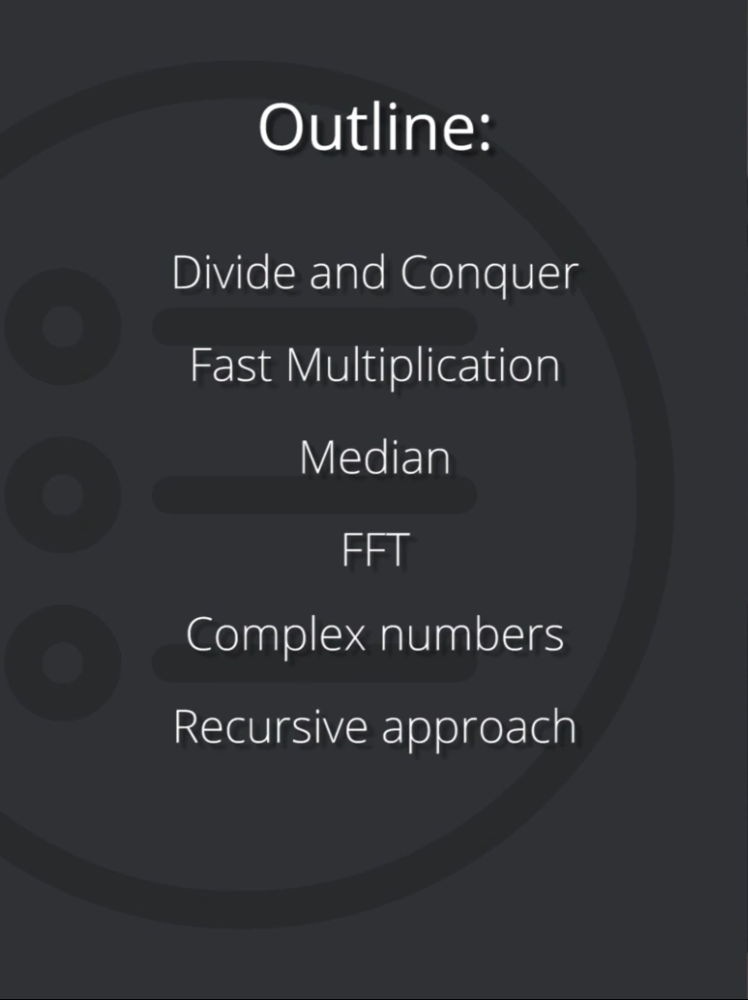{ width=650px }

**Divide and conquer algorithms** (or **recursive algorithms**) are one of the first algorithmic tools that have been likely encountered (e.g., via binary search, mergesort, and similar).

To see the power of divide and conquer, we will first examine a fundamental problem: **multiplying** two $n$-bit numbers, where the operands are assumed to be very large (i.e., $n$ on the order of $10^3$ ), as utilized in algorithms such as RSA (cf. Topic 2, Randomized Algorithms).
  * Since these $n$-bit numbers are so large, we can no longer rely on the corresponding hardware implementation (i.e., for trivial $O(1)$ multiplication operations).

Next, we will examine a clever divide and conquer algorithm which is ***faster*** than the standard approach to multiplication.

Another fundamental problem we will examine is given $n$ numbers, determine the **median** element.
  * The given numbers are *unsorted* (i.e., in arbitrary order). This corresponding divide and conquer technique cleverly determines this *without* otherwise requiring to first sort the list (and incurring the corresponding running time penalty accordingly).

Finally, we will examine the **fast Fourier transform** (**FFT**) algorithm, which occurs ubiquitously in many fields (e.g., signal processing) and constitutes a "masterpiece" demonstration of the divide and conquer technique.
  * The FFT algorithm was deemed "the most important numerical algorithm of our lifetime" as of 1994.
  * An understanding of the FFT algorithm will require some additional background in **complex numbers**, which in turn will inform the **recursive approach** of the FFT algorithm itself.

## Overview

> [!NOTE]
> ***Instructor's Note***: We closely follow the presentation in [DPV] Chapter 2.1 (Multiplication). For Eric's notes, see[here](https://cs6505.wordpress.com/fast-multiplication/).
> 
> Review topics: for a discussion on the MergeSort algorithm see [DPV] Chapter 2.3 (Mergesort). For a primer on solving recurrences, see Lecture DC3: Solving Recurrences and also [DPV] Chapter 2.2 (Recurrence relations).

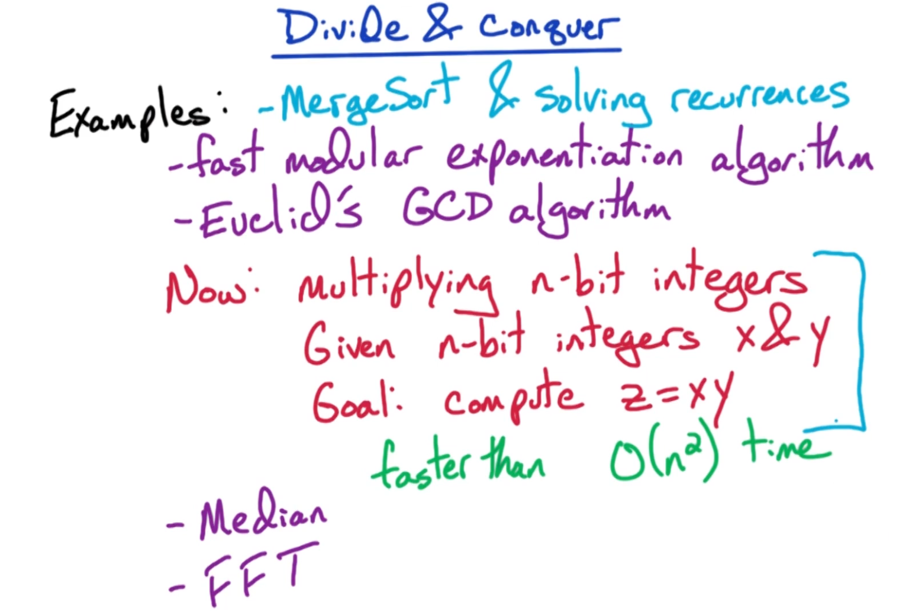{ width=650px }

We have previously seen simple applications of the divide and conquer technique, as follows:
  * fast modular exponentiation algorithm, utilizing the notion of "repeated squaring" (cf. Topic 2, Randomized Algorithms)
  * Euclid's greatest common divisor algorithm (cf. Topic 2, Randomized Algorithms)

In the opening of this topic, we will examine more sophisticated divide and conquer algorithms, starting with multiplication of $n$-bit integers.
  * This multiplication technique is particularly useful in the RSA algorithm (cf. Topic 2, Randomized Algorithms), where $n$ is typically $1024$ or $2048$ bits (i.e., beyond the straightforward capabilities of typical modern hardware).

In the multiplication of $n$-bit integers, we are ***given*** two $n$-bit integers $x$ and $y$ as inputs, with the ***goal*** of computing their product $z = xy$ . Furthermore, we analyze the corresponding running time of the algorithm as a function of the $n$-bit inputs.

Recall (cf. Topic 2, Randomized Algorithms) that the naive algorithm for computing this product $z = xy$ has a running time of $O(n^2)$ . Now, the objective is to ***improve*** this running time performance (i.e., a running time which is ***faster*** than $O(n^2)$ ), using a more sophisticated divide and conquer scheme.

Next, we will examine how to compute the median of (unsorted) $n$ input integers in *linear* time (i.e., $O(n)$ for $n$ such inputs).

Finally, we will examine the fast Fourier transform (FFT).

***N.B.*** It is assumed that divide and conquer is already familiar from previously (i.e., course prerequisites), via representative examples including mergesort (which sorts $n$ integers with running time $O(n \log n)$ ). Furthermore, it is assumed that solving recurrences is a familiar technique as well. For additional reference, the course textbook *Algorithms* by Dasgupta et al. discusses these topics as well.

# Divide and Conquer 1: Fast Integer Multiplication

## 3-4. Multiplying Complex Numbers

### 3. Introduction

> [!NOTE]
> ***Instructor's Note***: See also [DPV] Chapter 2.1 (Multiplication).

Before considering the example of multiplying two $n$-bit integers, we begin with a brief digression into a clever idea from Gauss. At the outset, its utility may not be immediately apparently, however, we will later see how it *is* indeed useful in the context of such $n$-bit integer multiplication.

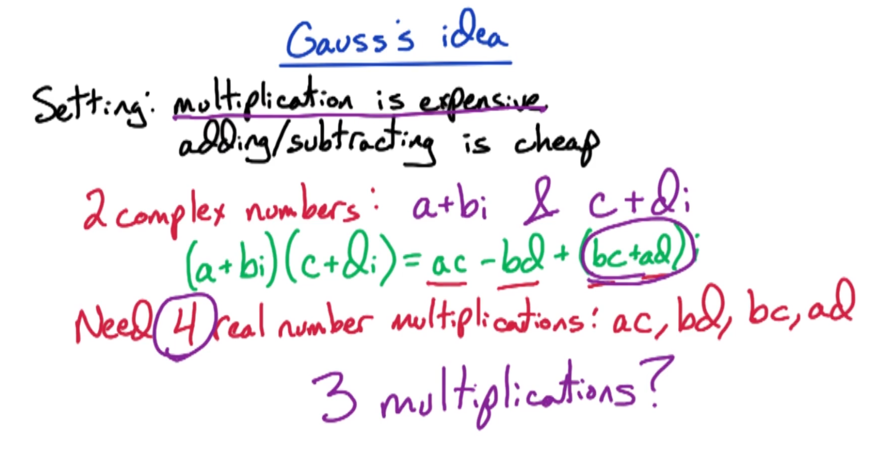{ width=650px }

Consider the general setting/context here with respect to the constituent operations:
  * Multiplication is relatively ***expensive*** (i.e., goal is to minimize these operations), i.e., $O(n^2)$ for $n$-bit input integers
  * Addition/subtraction relatively ***cheap***, i.e., $O(1)$ for $n$-bit input integers

Therefore, it stands to reason that increasing addition/subtraction operations are a worthwhile "concession" in order to correspondingly reduce multiplication operations.
  * ***N.B.*** This characterization is generally true, including in the case of multiplying two $n$-bit integers.

Now, consider **complex numbers**, which have two components, real and imaginary. Two such complex numbers are:

$$
a + bi
$$

$$
c + di
$$

where the real components are $a$ and $c$ (respectively) and the imaginary components are $b$ and $d$ (respectively).

The goal is therefore to compute the corresponding product, i.e.,:

$$
(a + bi)(c + di)
$$

To accomplish this, we can distribute the factors (i.e., via FOIL method or equivalent) to yield the following general expression:

$$
ac - bd + (bc + ad)i
$$

Therefore, in order to compute this product, this requires computing the following ***four*** factors (along with corresponding three addition/subtraction operations):
  * $ac$
  * $bd$
  * $bc$
  * $ad$

where each factor corresponds to a real number multiplication.

However, given that multiplication operations are relatively expensive, we would like to minimize these operations accordingly, even if this comes at the "expense" of performing additional (comparatively cheaper) addition/subtraction operations.

So, then, is is possible to reduce the amount of these multiplication operations? Indeed, this *is* possible: We can reduce this down to ***three*** multiplication operations by computing the expression $bc + ad$ directly (i.e., rather than the individual factors $bc$ and $ad$ ). We discuss this improvement next.

### 4. Improved Approach

> [!NOTE]
> ***Instructor's Note***: See also [DPV] Chapter 2.1 (Multiplication).

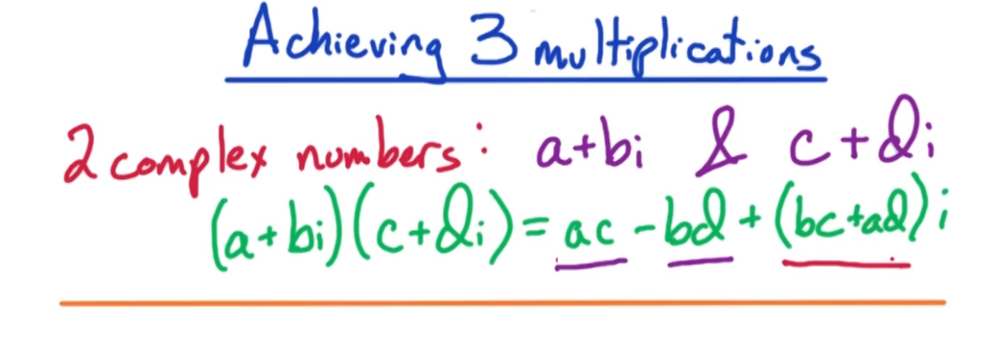{ width=450px }

To recap (cf. Section 3), we are given two complex numbers $a + bi$ and $c + di$ , with the goal of computing their product using the minimum-possible multiplication operations. Furthermore, the naive approach requires *four* such multiplications, for constituent real-numbers products $ac$ , $bd$ , $bc$ , and $ad$ .

However, in order to reduce this to only *three* multiplication operations, we will compute the expression $bc + ad$ directly (i.e., *without* otherwise computing constituent products $bc$ and $ad$ individually).

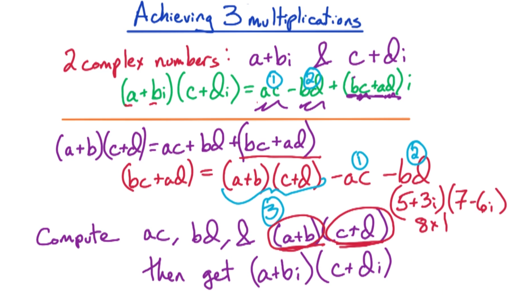{ width=650px }

In order to accomplish this reduced multiplication, observe that expression $bc + ad$ has a cross-product-like nature via constituents $a$ , $b$ , $c$ , and $d$ , i.e.,:

$$
(a + b)(c + d) = ac + bd + (bc + ad)
$$

Observe that the term $(bc + ad)$ is the target expression in question. Furthermore, $ac$ and $bd$ are also familiar from previously (however, here, $bd$ is added rather than subtracted).

Algebraically rearranging the previous expression yields the following:

$$
(bc + ad) = (a + b)(c + d) - ac - bd
$$

With this rearrangement, observe that there are now *three* distinct multiplication operations:
  * $ac$
  * $bd$
  * $(a + b)(c + d)$

From this, we can therefore reconstitute the equivalent overall product as follows:

$$
(a + bi)(c + di) = ac - bd + (bc + ad)i = ac - bd + [(a + b)(c + d) - ac - bd]i
$$

where the three distinct products are used, along with correspondingly "increased" addition/subtraction operations as necessary (which, again, is a "useful" tradeoff/concession here accordingly, since multiplication operations are comparatively much more expensive).

As a representative example, given complex numbers $5 + 3i$ and $7 - 6i$ , the corresponding "third product" term is:

$$
(5 + 3)(7 - 1) = 8 \times 1 = 8
$$

***N.B.*** Observe that this is indeed a clever reduction, and perhaps not immediately obvious/intuitive (and hence one of many demonstrations of Gauss' brilliance accordingly)!

Next, we will utilize this idea in order to compute the product of two $n-bit$ integers with a running time which is *faster* than $O(n^2)$ (i.e., via equivalent naive approach).

## 5-8. Divide and Conquer: Naive Approach

### 5. Introduction

> [!NOTE]
> ***Instructor's Note***: See also [DPV] Chapter 2.1 (Multiplication).

Returning to the original problem of multiplying two $n$-bit numbers (cf. Section 3), let us first consider the straightforward divide and conquer approach for this problem.

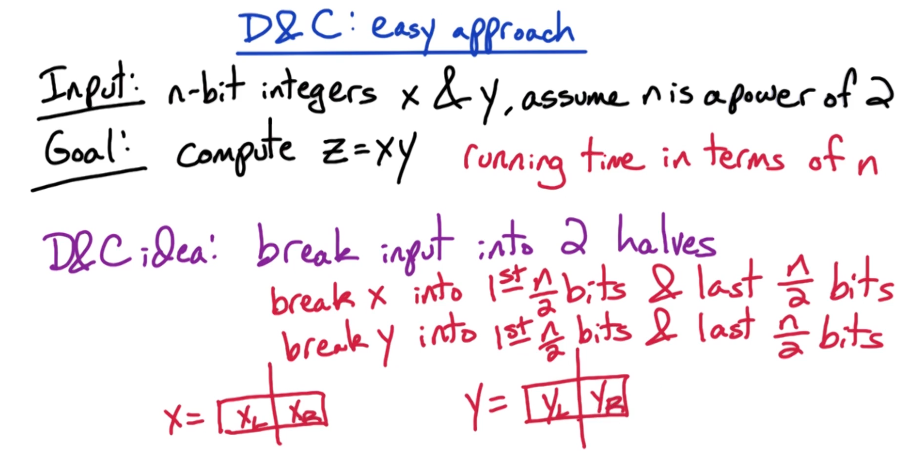{ width=650px }

The ***input*** to the problem is two $n$-bit integers $x$ and $y$ , which we assume for simplicity that $n$ is a power of $2$ for both integer inputs.
  * ***N.B.*** This is a ***common assumption*** for divide and conquer algorithms, which allows to eliminate floors and ceilings in descriptions of the resulting algorithms and their corresponding running time analysis.

The ***goal*** is to compute the product $z = xy$ , with the corresponding running time expressed in terms of $n$ (i.e., bits, the corresponding memory/space required to hold these respective integers).

Here, a standard "divide and conquer idea" (cf. mergesort) is to split the input into two halves. From there, we recursively solve the problem on the two halves until eventually converging on the base case, and then correspondingly combining/merging the results to yield the overall solution.

In this particular problem, we can split both $x$ and $y$ individually into two halves (i.e., with respect to their constituent $n$ bits), which we denote as follows:
  * $x$ is split into halves $x_L$ and $x_R$ , where each half is of size $\frac{n}{2}$ bits
  * similarly, $y$ is split into halves $y_L$ and $y_R$ , where each half is of size $\frac{n}{2}$ bits

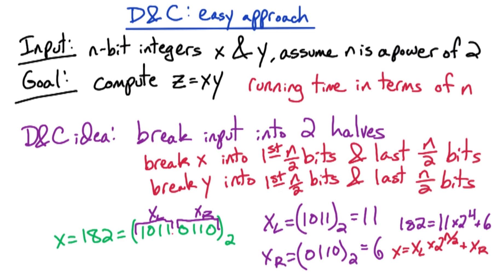{ width=650px }

Let us consider a specific example to examine such partitions. The decimal number (subscript $_{10}$ ) $182_{10}$ can be represented in binary (subscript $_2$ ) as follows:

$$
x = 182_{10} = 10110110_2
$$

Therefore, we can designate the respective halves as follows:

$$
x_L = 1011_2 = 11_{10}
$$

$$
x_R = 0110_2 = 6_{10}
$$

Furthermore, note the relationship among these as follows:

$$
182_{10} = 11_{10} \times {2_{10}}^4 + 6_{10}
$$

More generally, this relationship can be described by the following:

$$
x = x_L \times 2^{n/2} + x_R
$$

where $2^{n/2}$ is effectively a bit-shift operation (i.e., shifting the bit positions over by $\frac{n}{2}$ bits, which is typically an $O(1)$ operation on modern hardware).

### 6. Recursive Idea

> [!NOTE]
> ***Instructor's Note***: See also [DPV] Chapter 2.1 (Multiplication).

Now, let us outline the recursive idea for the algorithm.

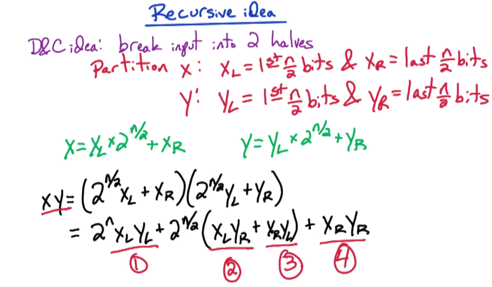{ width=650px }

Recall (cf. Section 5) that the idea is to split the input integers $x$ and $y$ of size $n$ bits into two halves (i.e., paired halves $x_L$ and $x_R$ , and $y_L$ and $y_R$ , respectively), each of corresponding size $\frac{n}{2}$ bits.

Furthermore, recall (cf. Section 5) the corresponding relationships between these paired halves as follows:

$$
x = x_L \times 2^{n/2} + x_R
$$

$$
y = y_L \times 2^{n/2} + y_R
$$

where factor $2^{n/2}$ corresponds to an equivalent bit-shifting operation (i.e., by $\frac{n}{2}$ bit positions).

Therefore, with the goal of computing product $xy$ , this yields the following:

$$
xy = (x_L \times 2^{n/2} + x_R)(y_L \times 2^{n/2} + y_R) = 2^nx_Ly_L + 2^{n/2}(x_Ly_R + x_Ry_L) + x_Ry_R
$$

This gives rise to a naturally recursive algorithm, i.e., computation of the corresponding $\frac{n}{2}$-bit products in the right-hand expression:
  * $x_Ly_L$
  * $x_Ly_R$
  * $x_Ry_L$
  * $x_Ry_R$

Next, we will detail this algorithm more formally.

### 7-8. Algorithm

#### 7. Pseudocode

> [!NOTE]
> ***Instructor's Note***: See also [DPV] Chapter 2.1 (Multiplication).

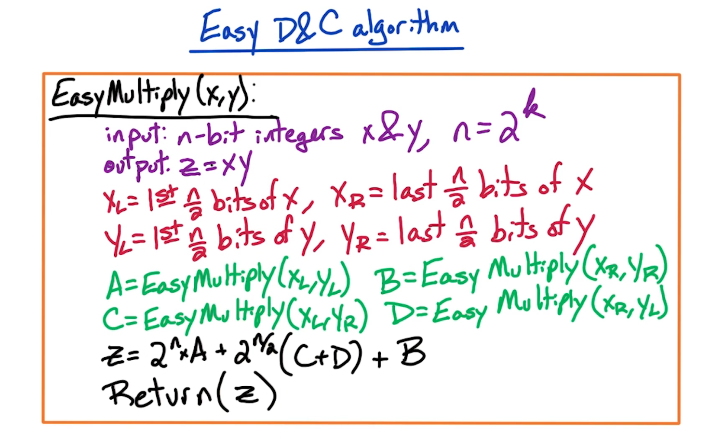{ width=650px }

The pseudocode for the algorithm is given as follows:

$$
\boxed{
\begin{array}{l}
{{\text{EasyMultiply}}(x,y):}\\
\ \ \ \ {{\text{input:\ }} n{\text{-bit\ integers\ }} x {\text{\ and\ }} y {\text{,\ where\ }} n = 2^k}\\
\ \ \ \ {{\text{output:\ }} z = xy}\\
\\
\ \ \ \ {x_L = {\text{first\ }} \frac{n}{2} {\text{bits\ of\ }} x {\text{,\ }} x_R = {\text{last\ }} \frac{n}{2} {\text{bits\ of\ }} x}\\
\ \ \ \ {y_L = {\text{first\ }} \frac{n}{2} {\text{bits\ of\ }} y {\text{,\ }} y_R = {\text{last\ }} \frac{n}{2} {\text{bits\ of\ }} y}\\
\ \ \ \ {A = {\text{EasyMultiply}}(x_L, y_L)}\\
\ \ \ \ {B = {\text{EasyMultiply}}(x_R, y_R)}\\
\ \ \ \ {C = {\text{EasyMultiply}}(x_L, y_R)}\\
\ \ \ \ {D = {\text{EasyMultiply}}(x_R, y_L)}\\
\ \ \ \ {z = 2^n \times A + 2^{n/2}(C + D) + B}\\
\ \ \ \ {{\text{return\ }} (z)}
\end{array}
}
$$

The ***input*** to the algorithm is the two $n$-bit integers $x$ and $y$ , where $n = 2^k$ is assumed (i.e., $n$ is a power of $2$ ) for some non-negative integer $k$ .

The ***output*** is the product of these integers, $z = xy$ .

First, the algorithm splits the input integers $x$ and $y$ into constituent halves/pairs $x_L$ and $x_R$ and $y_L$ and $y_R$ (respectively), where each half is of size $\frac{n}{2}$ . Furthermore, since $n$ is a power of $2$ , these pairs generally divide evenly (thereby obviating the need to include floors and/or ceilings in the representation of the terms accordingly).

Next, we compute the products of these $\frac{n}{2}$-bit pairs recursively, with these corresponding products represented respectively as $A$ , $B$ , $C$ , and $D$ .

Now, given these product quantities, we can compute the overall product $z$ as follows:

$$
z = 2^n \times A + 2^{n/2}(C + D) + B
$$

***N.B.*** cf. Section 7 for the derivation of the right-hand expression.

Furthermore, this product is the correspondingly ***returned*** value/output from the algorithm.

Next, we consider the running time for this algorithm.

#### 8. Running Time Quiz and Answers

> [!NOTE]
> ***Instructor's Note***: See also [DPV] Chapter 2.1 (Multiplication).
>
> See a primer on solving recurrences, see Lecture DC3: Solving Recurrences and also [DPV] Chapter 2.2 (Recurrence relations).

Which of the following is the running time for the algorithm $\text{EasyMultiply}$ (cf. Section 7)?
  * $O(n)$
  * $O(n \log n)$
  * $O(n^{3/2})$
  * $O(n^2)$
  * $O(n^3)$

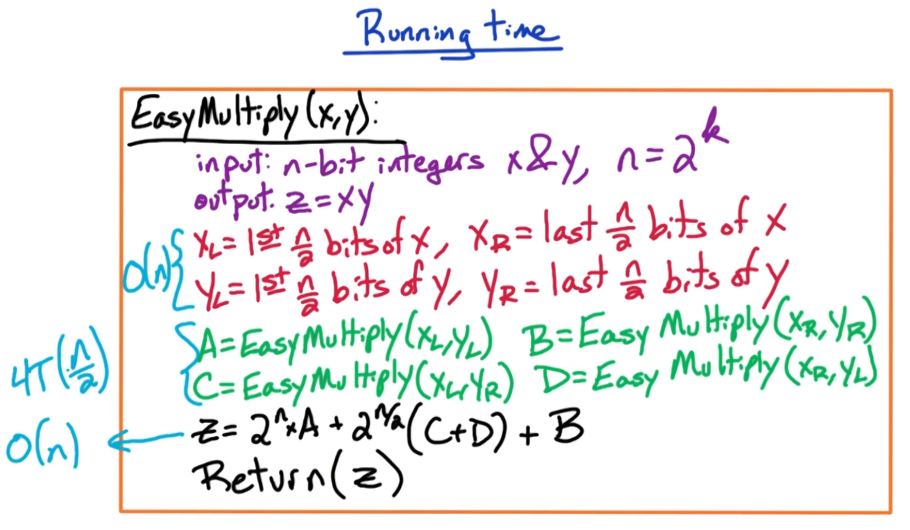{ width=650px }

The initial partitioning steps to generate halves $x_L$ , $x_R$ , $y_L$ , and $y_R$ require a running time of $O(n)$ (for each of $x$ and $y$ in turn).

In the subsequent recursive calls to $\text{EasyMultiply}$ , if we let $T(n)$ denote the worst-case running time in the worst case scenario of an input of size $n$ bits , then *each* recursive call requires a running time of $T(\frac{n}{2})$ , or equivalently as follows:

$$
4T\bigg(\frac{n}{2}\bigg)
$$

Finally, to compute the final product given as follows :

$$
z = 2^n \times A + 2^{n/2}(C + D) + B
$$

this correspondingly requires $O(n)$ running time, since each single-bit-shift operation can be performed in $O(1)$ running time, i.e., this is equivalent to straightforward $n$-bit multiplication by a power of $2$ (via corresponding factors $2^n$ and $2^{n/2}$ , in order to shift $A$ by $n$ bit positions and $(C + D)$ by $\frac{n}{2}$ bit positions, respectively, with the former dominating the running time in this operation).

Therefore, the overall running time for this algorithm is:

$$
O(n) + 4T\bigg(\frac{n}{2}\bigg) + O(n)
$$

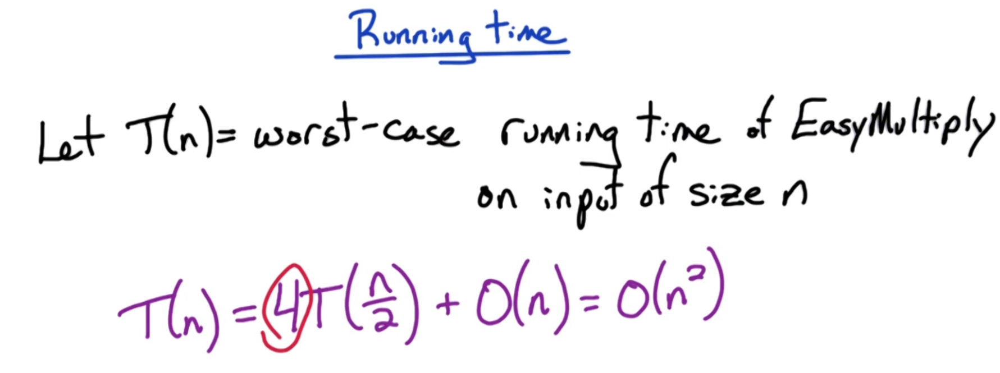{ width=650px }

Furthermore, let $T(n)$ denote the worst-case running time of $\text{EasyMultiply}$ on an input of size $n$ bits. This gives:

$$
T(n) = 4T\bigg(\frac{n}{2}\bigg) + O(n)
$$

We can solve this recurrence to give the following:

$$
T(n) = O(n^2)
$$

***N.B.*** Solving recurrences should be familiar from previously; this result follows from direct application of the Master Theorem. Furthermore, it is also covered/reviewed later in this lecture (cf. Divide and Conquer 3).

Therefore, the running time of this algorithm is the *same* as the naive/straightforward multiplication algorithm (cf. Section 3).

Can we improve this approach (e.g., reducing from $4$ recursive operations down to $3$ )? We explore this next, revisiting Gauss's idea/improvement (cf. Section 4) in the process.

## 9-12. Divide and Conquer: Improved Approach

### 9. Introduction

> [!NOTE]
> ***Instructor's Note***: See also [DPV] Chapter 2.1 (Multiplication).

Now, consider an improvement to the multiplication (i.e., relative to a running time of $O(n^2)$ with respect to $n-bit integer inputs).

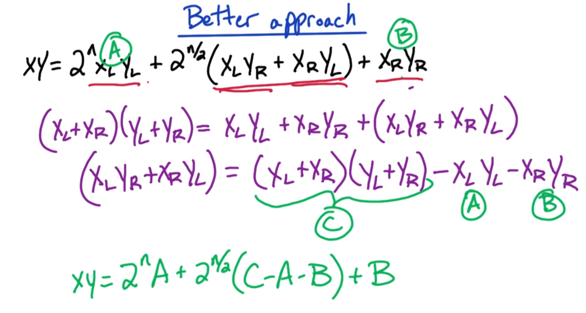{ width=650px }

Recall (cf. Section 6) the following key expression:

$$
xy = 2^nx_Ly_L + 2^{n/2}(x_Ly_R + x_Ry_L) + x_Ry_R
$$

Furthermore, recall (cf. Section 7) that the straightforward divide and conquer approach computes the following four products in this expression:
  * $x_Ly_L$
  * $x_Ly_R$
  * $x_Ry_L$
  * $x_Ry_R$

This in turn gives rise to an overall running time of $O(n^2)$ (cf. Section 8).

Now, the objective is to reduce the number of subproblems from $4$ to $3$ . Recalling (cf. Section 4) Gauss's idea, we can correspondingly compute the expression $x_Ly_R + x_Ry_L$ without computing the individual products as follows (i.e., via analogous cross-multiplication-form as before):

$$
x_Ly_R + x_Ry_L = (x_L + x_R)(y_L + y_R) - x_Ly_L - x_Ry_R
$$

Analogously to before (cf. Section 4), with this rearrangement, observe that there are now *three* distinct multiplication operations:
  * $x_Ly_L$
  * $x_Ry_R$
  * $(x_L + x_R)(y_L + y_R)$

Furthermore, recall (cf. Section 7) that the first two of these products were represented as quantities $A$ and $B$ (respectively). Similarly, we can designate the third product as $C$ (which in turn supplants the previous *distinct* products $C$ and $D$ ).

Therefore, the corresponding equivalent product now becomes:

$$
xy = 2^nA + 2^{n/2}(C - A - B) + B
$$

where we have now (as before) net decreased by one multiplication operation, while incurring some net-increased addition/subtraction operations (a useful tradeoff here nonetheless). Correspondingly, we have now reduced the subproblems from $4$ to $3$ accordingly.

Next, we detail this algorithm more formally.

### 10. Pseudocode

> [!NOTE]
> ***Instructor's Note***: See also [DPV] Chapter 2.1 (Multiplication).

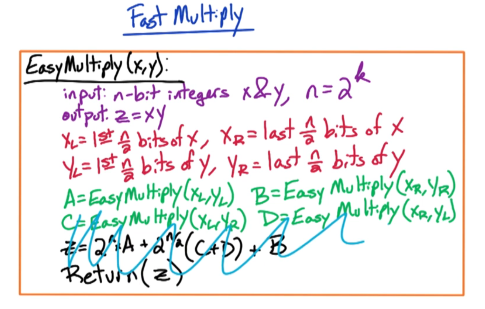{ width=650px }

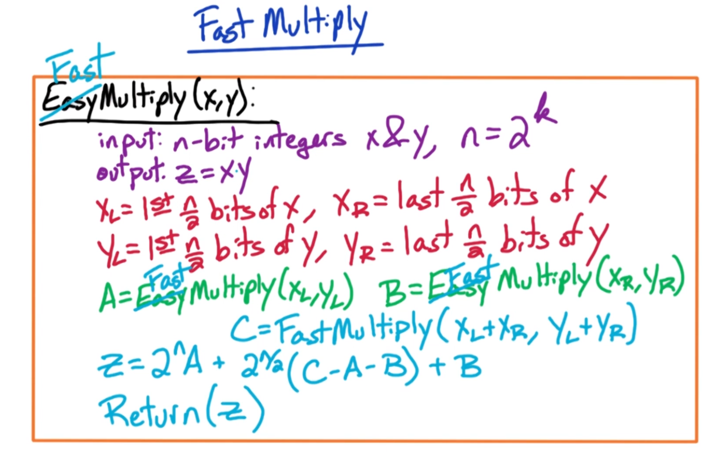{ width=650px }

The pseudocode for the improved algorithm is given as follows:

$$
\boxed{
\begin{array}{l}
{{\text{FastMultiply}}(x,y):}\\
\ \ \ \ {{\text{input:\ }} n{\text{-bit\ integers\ }} x {\text{\ and\ }} y {\text{,\ where\ }} n = 2^k}\\
\ \ \ \ {{\text{output:\ }} z = xy}\\
\\
\ \ \ \ {x_L = {\text{first\ }} \frac{n}{2} {\text{bits\ of\ }} x {\text{,\ }} x_R = {\text{last\ }} \frac{n}{2} {\text{bits\ of\ }} x}\\
\ \ \ \ {y_L = {\text{first\ }} \frac{n}{2} {\text{bits\ of\ }} y {\text{,\ }} y_R = {\text{last\ }} \frac{n}{2} {\text{bits\ of\ }} y}\\
\ \ \ \ {A = {\text{FastMultiply}}(x_L, y_L)}\\
\ \ \ \ {B = {\text{FastMultiply}}(x_R, y_R)}\\
\ \ \ \ {C = {\text{FastMultiply}}(x_L + x_R, y_L + y_R)}\\
\ \ \ \ {z = 2^n \times A + 2^{n/2}(C - A - B) + B}\\
\ \ \ \ {{\text{return\ }} (z)}
\end{array}
}
$$

This algorithm is similar to the straightforward divide and conquer algorithm $\text{EasyMultiply}$ (cf. Section 7), however, after partitioning $x$ and $y$ , here, we have now reduced to $3$ recursive subproblems (cf. $4$ previously).

Furthermore, with these updated subproblems, the corresponding overall product is now computed as follows:

$$
z = 2^n \times A + 2^{n/2}(C - A - B) + B
$$

### 11. Running Time Quiz and Answers

> [!NOTE]
> ***Instructor's Note***: See also [DPV] Chapter 2.1 (Multiplication).
>
> For a primer on solving recurrences, see Lecture DC3: Solving Recurrences and also [DPV] Chapter 2.2 (Recurrence relations).

Which of the following is the running time for the algorithm $\text{FastMultiply}$ (cf. Section 10)?
  * $O(n)$
  * $O(n \log n)$
  * $O(n^{3/2})$
  * $O(n^{\log _3 2})$
  * $O(n^{\log _2 3})$
  * $O(n^2)$

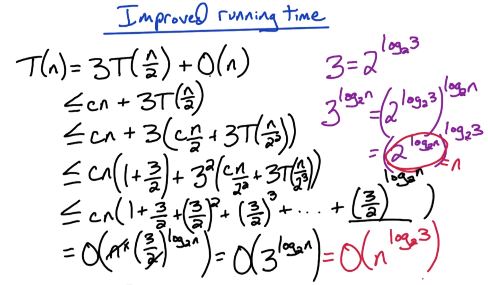{ width=650px }

In the improved algorithm (cf. Section 10), we now have only $3$ recursive subproblems giving rise to analogous (cf. 8) recurrence relation as follows:

$$
T(n) = 3T\bigg(\frac{n}{2}\bigg) + O(n)
$$

where (as before) $T(n)$ denotes the worst-case running time of $\text{FastMultiply}$ on an input of size $n$ bits.

To solve this recurrence, we first upper-bound via $cn$ as follows:

$$
3T\bigg(\frac{n}{2}\bigg) + O(n) \le cn + 3T\bigg(\frac{n}{2}\bigg)
$$

Furthermore, we can substitute for $T(\frac{n}{2})$ on the right-hand side as follows:

$$
3T\bigg(\frac{n}{2}\bigg) + O(n) \le cn + 3T\bigg( c \frac{n}{2} + 3T\bigg( \frac{n}{2^2} \bigg) \bigg)
$$

Simplifying algebraically on the right-hand side and simultaneously similarly substituting further yields:

$$
3T\bigg(\frac{n}{2}\bigg) + O(n) \le cn \bigg( 1 + \frac{3}{2} \bigg) + 3^2 T\bigg( \frac{cn}{2^2} + 3T\bigg( \frac{n}{2^3} \bigg) \bigg)
$$

Expanding the right-hand side in this manner yields the following:

$$
3T\bigg(\frac{n}{2}\bigg) + O(n) \le cn \bigg[ 1 + \frac{3}{2} + \bigg({\frac{3}{2}}\bigg)^2 + \bigg({\frac{3}{2}}\bigg)^3 + \cdots + \bigg({\frac{3}{2}}\bigg)^{\log _2 n} \bigg]
$$

where the expansion proceeds accordingly until the final term (i.e., of general form $T(\frac{n}{2^k})$ ) is eventually a constant.

In the resulting geometric series, we consider the following cases:
  * the terms are equal $\rightarrow$ no
  * the series is decreasing (i.e., first term dominates) $\rightarrow$ no
  * the series is increasing (i.e., last term dominates, via $\frac{3}{2} > 1$ ) $\rightarrow$ yes

Therefore, since the last term dominates (and with $n$ such terms in the worst case), the overall running time is characterized as:

$$
T(n) \le O \bigg( n \times \bigg(\frac{3}{2}\bigg)^{\log _2 n} \bigg)
$$

Furthermore, simplifying algebraically yields the following:

$$
O \bigg( n \times \bigg(\frac{3}{2}\bigg)^{\log _2 n} \bigg) = O(3^{\log _2 n}) = O(n^{\log _2 3})
$$

***N.B.*** In the first simplification/arrangement, $2^{\log _2 n} = n$ . Furthermore, the second simplification/rearrangement follows directly from rules of logarithms (i.e., $3 = 2^{\log_2 3} \implies 3^{\log _2 n} = (2^{log _2 3})^{\log_2 n} = (2^{log _2 n})^{\log_2 3} = n^{\log_2 3}$ ).

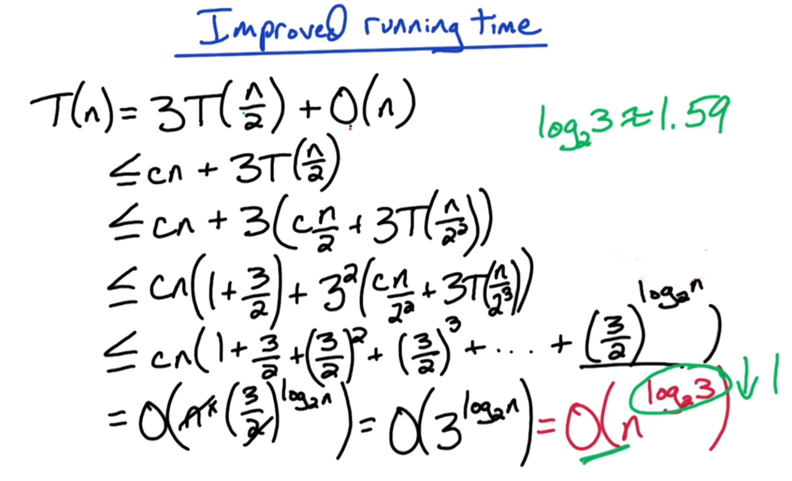{ width=650px }

Note that the constant value $\log _2 3 \approx 1.59$ , which is indeed an improvement over factor $2$ (i.e., $\log _2 3 \approx 1.59 < 2$ ).

Furthermore, we can improve this factor to approach arbitrarily close to $1$ , however, there is a corresponding cost for this: The *constant factor* which is omitted in the big-O notation grows as the exponent (i.e., $\log _2 3$ ) decreases (i.e., rather than splitting into only two halves, there is increasingly such splitting, which correspondingly requires additional work to later recombine into the resulting overall product).

### 12. Summary

This concludes the description of the multiplication algorithm.

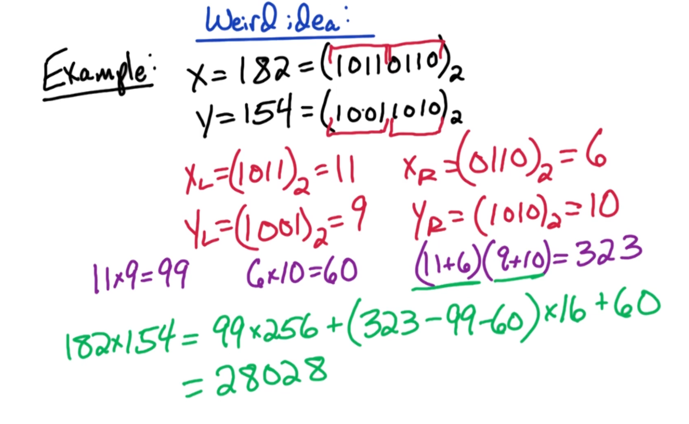{ width=650px }

Before proceeding, let us highlight the cleverness of the described approach. Consider the following input integers:

$$
x = 182_{10} = 10110110_2
$$

$$
y = 154_{10} = 10011010_2
$$

Our approach begins by splitting these inputs into their constituent $\frac{n}{2}$ halves, i.e.,:
  * $x_L = 1011_2 = 11_{10}$
  * $x_R = 0110_2 = 6_{10}$
  * $y_L = 1001_2 = 9_{10}$
  * $y_R = 1010_2 = 10_{10}$

Correspondingly, the algorithm (cf. Section 10) first computes the following three products:
  * $11_{10} \times 9_{10} = 99_{10}$
  * $6_{10} \times 10_{10} = 60_{10}$
  * $(11_{10} + 6_{10}) \times (9_{10} + 10_{10}) = 323_{10}$

We then compute the overall product as follows:

$$
182_{10} \times 154_{10} = 99_{10} \times 256_{10} + (323_{10} - 99_{10} -60_{10}) \times 16_{10} + 60_{10} = 28,028_{10}
$$

***N.B.*** The final result here is calculated directly (i.e., via calculator or equivalent).

It is indeed quite fascinating (and perhaps non-intuitive) that eventually proceeding in this manner converges on the correct result!

***N.B.*** A similar idea exists for matrix multiplication, via an analogous technique called **Strassen's algorithm**. Consult the course textbook *Algorithms* by Dasgupta et al. (or equivalent sources) for additional information.

Next, we examine the linear-time median, another clever divide and conquer approach.

# Divide and Conquer 2: Linear-Time Median

## 1. Median Problem

> [!NOTE]
> ***Instructor's Note***: For the randomized approach see [DPV] Chapter 2.4 (Medians). The deterministic approach is not covered in [DPV], you can instead look at Eric's [notes](https://cs6505.wordpress.com/schedule/median/).

Consider another example of a divide and conquer algorithm, which entails finding the median of $n$ numbers.

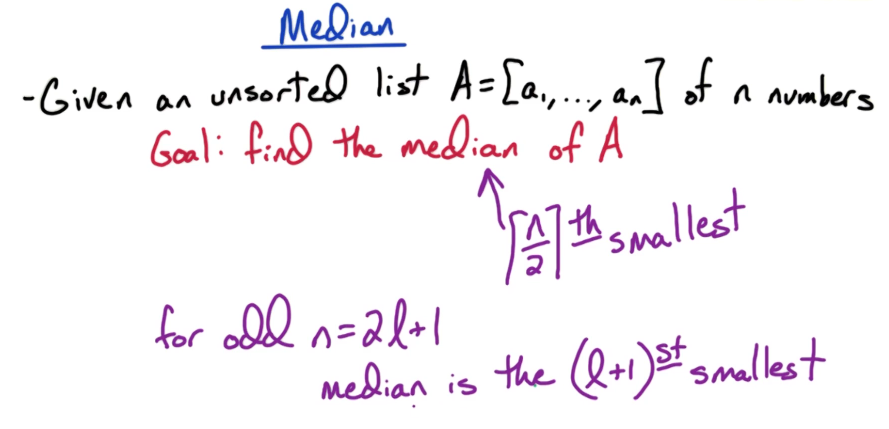{ width=650px }

In this algorithm, the ***input*** is an *unsorted* list/array $A = [a_1, \dots, a_n]$ of $n$ numbers.

The ***goal*** is to determine the *median* of $A$ (i.e., the middle element in equivalent-sorted order).

More formally, we can define the median as the $\lfloor \frac{n}{2} \rfloor$th smallest element in $A$ . For odd $n$ , $n = 2 \ell + 1$ (with respect to length/size $\ell$ of $A$ ), and therefore the median is the $(\ell + 1)$st element in $A$ .

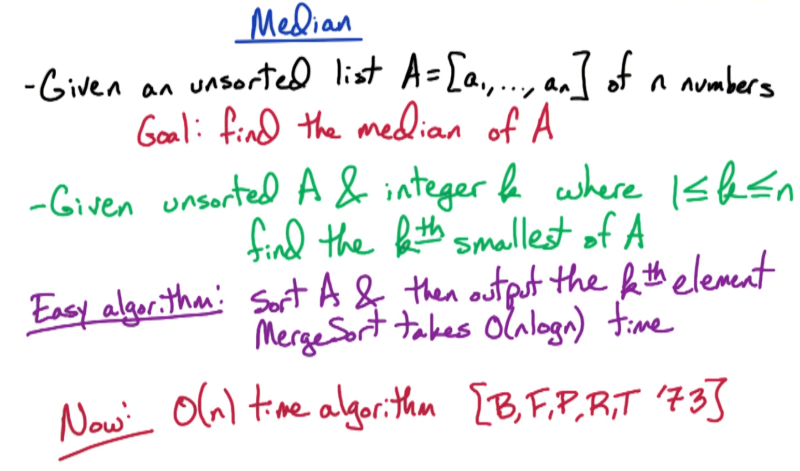{ width=650px }

It is also useful to solve a more general problem: Find the $k$th element of an input list $A$ .

More specifically, we can define this more general problem as follows:

> Given unsorted $A$ and integer $k$ where $1 \le k \le n$ , find the $k$th smallest element of $A$

where $k = \frac{n}{2}$ is the special case of the median.

If we ***sort*** the list, then this gives rise to a relatively trivial algorithm: Given unsorted $A$ , we sort $A$ and then simply output the $k$th element directly.
  * Using mergesort, this sorting has an overall running time of $O(n \log n)$ . Furthermore, this also generally the fastest possible sort if using similar comparison sorts.

However, is it possible to achieve a better running time, by obviating the need to first sort $A$ ? Indeed, this is possible, and we will examine the corresponding algorithm having overall running time $O(n)$ (i.e., linear) next. This is a clever divide and conquer algorithm, devised in 1973 by Blum, Floyd, Pratt, Rivest, and Tarjan.

## 2. Basic Approach

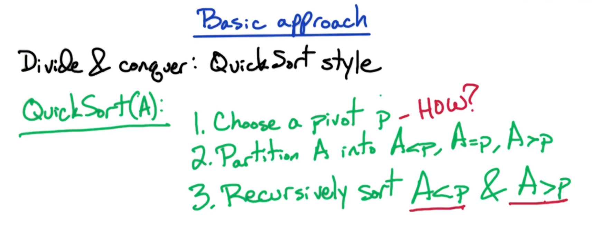{ width=650px }

The basic approach for finding the $k$th smallest element in unsorted array $A$ is a divide and conquer technique which is reminiscent of the quicksort algorithm.

Let us first review the quicksort algorithm, and make appropriate modifications to highlight the corresponding approach.

When running quicksort on a list of numbers $A$ , the following steps are performed:
  * 1 - Choose a pivot $p$
  * 2 - Partition $A$ into $A < p$ , $A = p$ , and $A < p$
  * 3 - Recursively sort via quicksort on partitions $A < p$ and $A > p$

Proceeding in this manner, the final output is the sorted list comprised of the "smallest" elements, followed by the "equal" elements, and then finally followed by the "largest" elements (respectively).

The ***key challenge*** in quicksort is judicious selection of an effective pivot $p$ . For example, selection of the largest element as the pivot makes a trivial reduction in the subproblem by only one element, thereby degenerating the overall running time for sorting to $O(n^2)$ .

So, then, what constitutes such an "effective" pivot? This is accomplished via the ***median*** element (or within this vicinity). This pivot selection in turn is relevant to the current problem at hand (i.e., linear-time median computation). Furthermore, while quicksort has a running time of $O(n \log n)$ , while our target algorithm has a running time of $O(n)$ . However, the key distinction in the latter is the fact that we do *not* have to consider both cases $A < p$ *and* $A > p$ , but rather it is only strictly necessarily to reduce to a search subproblem comprised of only *one* of these sub-lists.

Next, we will demonstrate an example of this search process.

## 3. Search Example

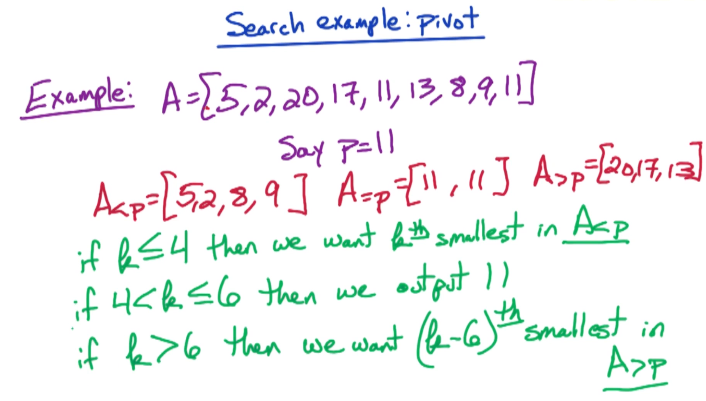{ width=650px }

Consider the following array $A$ :

$$
A = [5, 2, 20, 17, 11, 13, 8, 9, 11]
$$

Furthermore, let pivot $p = 11$ .

Now, we can define partitions with respect to pivot $p$ as follows:

$$
A_{<p} = [5, 2, 8, 9]
$$

$$
A_{=p} = [11, 11]
$$

$$
A_{>p} = [20, 17, 13]
$$

Note that the $k$th smallest element exists in one of these partitions. Furthermore, the corresponding search is dictated by $k$ as follows:
  * if $k \le 4$ , then the $k$th smallest element is present in partition $A_{<p}$
  * if $4 < k \le 6$ , then the $k$th smallest element is readily obtained as $11$ (i.e., via partition $A_{=p}$ )
  * if $k > 6$ , then the $(k-6)$th smallest element is present in partition $A_{>p}$

Therefore, in general, recursive search (if necessary) is *only* performed in *one* of the two  partitions $A_{<p}$ *or* $A_{>p}$ (but *not* both).
  * ***N.B.*** cf. In quicksort, it is generally necessary to perform *both* recursions in order to arrive at the overall result (i.e., a sorted list).

Next, we will detail the algorithm for this general-case solution (i.e., finding the $k$th smallest element in list $A$ ).

## 4. QuickSelect

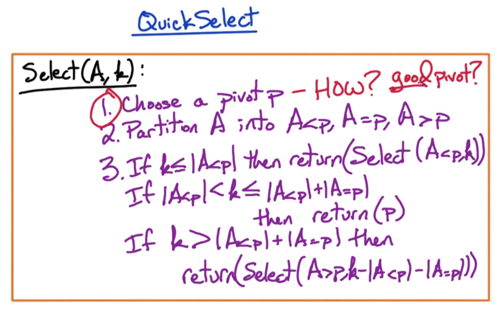{ width=650px }

The pseudocode for the algorithm to find the $k$th smallest element in list $A$ is given as follows:

$$
\boxed{
\begin{array}{l}
{{\text{Select}}(A,k):}\\
\ \ \ \ {{\text{1.\ }} {\text{Choose\ a\ pivot\ }} p}\\
\ \ \ \ {{\text{2.\ }} {\text{Partition\ }} A {\text{\ into\ }} A_{<p}, A_{=p}, A_{>p}}\\
\ \ \ \ {{\text{3A.\ }} {\text{If\ }} k \le |A_{<p}| {\text{,\ then\ }} {\text{return\ }} ({\text{Select}}(A_{<p}, k))}\\
\ \ \ \ {{\text{3B.\ }} {\text{If\ }} |A_{<p}| < k \le |A_{<p}| + |A_{=p}| {\text{,\ then\ }} {\text{return\ }} (p)}\\
\ \ \ \ {{\text{3C.\ }} {\text{If\ }} k > |A_{<p}| + |A_{=p}| {\text{,\ then\ }} {\text{return\ }} ({\text{Select}}(A_{>p}, k - |A_{<p}| - |A_{=p}|))}
\end{array}
}
$$

First, we determine the pivot $p$ .
  * ***N.B.*** The exact procedure for this will be described later.

Next, after selecting pivot $p$ , we partition $A$ into sub-arrays $A_{<p}, A_{=p}, A_{>p}$ .

Finally, we recursively search in these partitions/sub-arrays based on their respective sizes and input $k$ .
  * If $k \le |A_{<p}|$ , then the target element is recursively searched in partition $A_{<p}$ .
  * If $|A_{<p}| < k \le |A_{<p}| + |A_{=p}|$ , then the target element is found directly in partition $A_{=p}$ (i.e., the target element is the pivot itself, $p$ ).
  * If $k > |A_{<p}| + |A_{=p}|$ , then the target element is recursively searched in partition $A_{>p}$ . Furthermore, we reduce the size of the effective parameter via $k - |A_{<p}| - |A_{=p}|$ (i.e., discard elements which are too small relative to the elements in $A_{>p}$ itself).

However, the question still remains: How do we determine the pivot? And, furthermore, what constitutes a "good/effective" pivot? Next, we will first address the latter question, before finally demonstrating how to determine this pivot.

## 5. Simple Recurrence Quiz and Answers

Which of the following does the recurrence $T(n) = T(\frac{n}{2}) + O(n)$ solve to?
  * $T(n) = O(\log n)$
  * $T(n) = O(n)$
  * $T(n) = O(n \log n)$

***Answer***: This recurrence solves to $O(n)$ .

***N.B.*** This is the recurrence (and corresponding running time) for the algorithm $\text{Select}$ (cf. Section 4), where running time $O(n)$ is required to create the partitions on $A$ (i.e., Step 2 per the pseudocode in Section 4), and recursive term $T(\frac{n}{2})$ represents the corresponding recursive steps (i.e., Step 3 per the pseudocode in Section 4). This will be demonstrated more formally in subsequent sections/discussions.

## 6-11. Divide and Conquer High-Level Idea

### 6. Introduction

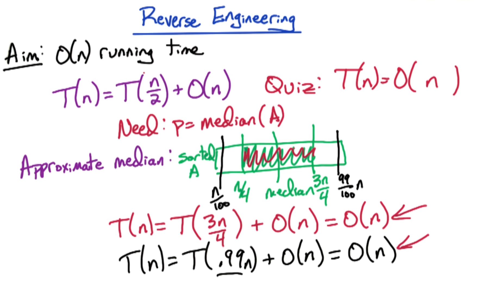{ width=650px }

We are aiming for a running time of $O(n)$ for finding the $k$th$ smallest element in array $A$ , using the divide and conquer technique. Let us now consider the recurrences which yield such a solution having a running time of $O(n)$ , which in turn will inform the basic approach for the algorithm itself.

Recall (cf. Section 5) that the recurrence $T(n) = T(\frac{n}{2}) + O(n)$ solves to running time $O(n)$ . To accomplish this, we require $1$ subproblem of size at most $\frac{n}{2}$ . Recall (cf. Section 4) that the subproblem-size constraint can be achieved by recursing on *either* partition $A_{<p}$ *or* $A_{>p}$ (but not *both* simultaneously) for pivot $p$ . Furthermore, to ensure that this subproblem size is strictly of size $\le \frac{n}{2}$ , it is strictly necessary that the pivot $p$ is the ***median*** of (unsorted) input list $A$ , which in turn ensures that $A_{<p}$ and $A_{>p}$ are both of size $\le \frac{n}{2}$ .

However, if we cannot determine this median value a priori, what is a possible scheme for ***approximating*** the median (i.e., within the vicinity of the median, but not necessarily exactly the median value itself)?

To reason about this approximation, first consider a *sorted* input list $A$ . Furthermore, consider the $\frac{n}{4}$ smallest through the $\frac{3n}{4}$ smallest elements (a range which in turn encompasses the median itself, i.e., the element at position $\frac{2n}{4} = \frac{n}{2}$ ). Rather than the median itself, consider if we are given this range of elements instead.

Now, suppose that we can find a pivot which satisfies this "intermediate-range" band. What does this imply about the running time of the algorithm? The worst-case size of the subproblems implies the following recurrence relation:

$$
T(n) = T\bigg( \frac{3}{4}n \bigg) + O(n)
$$

This recurrence relation solves to $O(n)$ for the overall running time.

Furthermore, we can relax this assumption, and expand the "intermediate-range" band to include elements $[\frac{n}{100}, \frac{99n}{100}]$ (i.e., the "middle 98%" values, rather than the "middle 50%" values from before), which similarly yields the following recurrence relation:

$$
T(n) = T\bigg( \frac{99}{100}n \bigg) + O(n)
$$

This recurrence relation similarly solves to $O(n)$ for the overall running time.

The ***key*** here is that the constant term of the recurrence (i.e., $\frac{3}{4}$ , $\frac{99}{100}$ , etc.) must be strictly less than $1$ (i.e., a *constant* fraction of the outer-band range is truncated, or equivalently a reduction of the "tail-ends" elements by 50%, 2%, etc.).

Therefore, we define a "good" pivot as one which exists in this "intermediate-range" band. Furthermore, we will attempt to satisfy the band $[\frac{n}{4}, \frac{3n}{4}]$ , with some extra "slack" contributed by the latter band, $[\frac{n}{100}, \frac{99n}{100}]$ (which ultimately satisfies the recurrence relation in running time $O(n)$ , as desired). 

### 7. Goal: Good Pivot

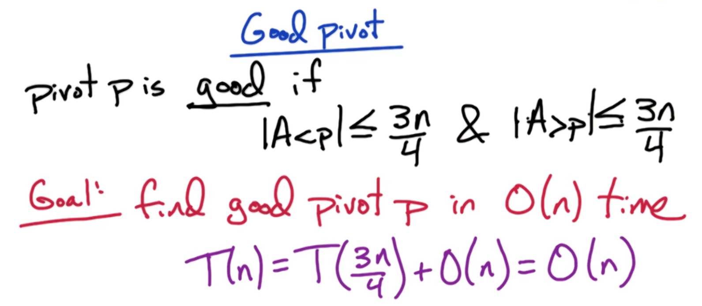{ width=650px }

More formally, we define a "good" pivot $p$ if it satisfies the following constraints:

> $|A_{<p}| \le \frac{3n}{4}$ and $|A_{>p}| \le \frac{3n}{4}$

Given this definition, the corresponding ***goal*** is stated as follows:

> Find this "good" pivot in a running time of $O(n)$

Recall (cf. Section 6) that this goal implies a recurrence relation as follows:

$$
T(n) = T\bigg( \frac{3}{4}n \bigg) + O(n)
$$

Furthermore, recall (cf. Section 6) that indeed this recurrence relation solves to overall running time $O(n)$ , as desired.

Now, the question remains: How to determine such a "good" pivot? Next, we examine some schemes intended for this exact purpose.

### 8. Random Pivot

First, consider what constitutes an "easy" scheme for determining a "good" pivot.

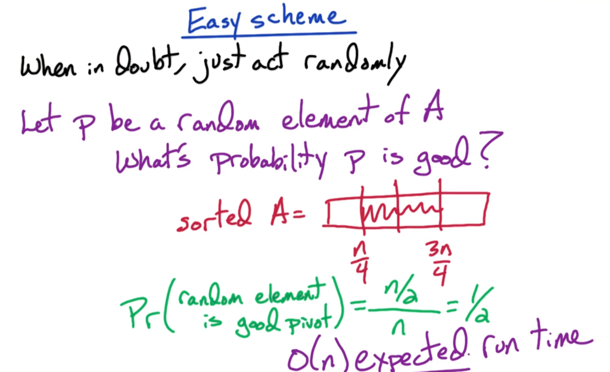{ width=650px }

In the absence of a better idea, random selection is one such potential scheme/strategy. Here, the idea is to let $p$ be a random element of array $A$ .

However, upon making such a random selection, what is the probability that $p$ is actually "good"?

Consider again (cf. Section 6) a *sorted* version of array $A$ . As before (cf. Section 7), a "good" pivot exists within the "intermediate-range" band $[\frac{n}{4}, \frac{3n}{4}]$ . So, then, what is the probability that a random element is a "good" pivot?

The ordering within "intermediate-range" band are irrelevant with respect to the probability of the "good" pivot existing here in itself. Therefore, the probability is the proportion of these potential "good" pivot candidates ($\frac{n}{2}$ ) relative to the total potential candidates ($n$ ), i.e.,:

$$
{\text{Pr}}({\text{random\ element\ is\ a\ "good"\ pivot}}) = \frac{n/2}{n} = \frac{1}{2}
$$

Now, given a proposed candidate for a "good" pivot, how to check/verify this? This can be accomplished straightforwardly by partitioning $A$ into $A_{<p}$ , $A_{=p}$ , and $A_{>p}$ (with corresponding running time of $O(n)$ to perform this partitioning). Furthermore, by tracking the sizes of the partitions, then by proceeding in this manner, it can be readily determined whether pivot $p$ is "good" (with a corresponding running time of $O(n)$ to perform this check via the various partitions).

If the check determines that the randomly selected pivot $p$ is *not* "good," then this sequence can be simply repeated with a new randomly selected candidate pivot $p$ . This process is repeated in this manner until a "good" pivot is finally identified. Probabilistically speaking, the ***expected*** value for the total repeats/counts of running this sequence is the aforementioned $\frac{1}{2}$ (somewhat analogously to a coin flip, in this case, the probability of identifying a "good" pivot in any given run of the sequence is 50%, as per the specified "intermediate-range" band).

Therefore, the overall ***expected*** running time for this pivot-selection algorithm is $O(n)$ (i.e., $O(C \times n) = O(n)$ , where $C$ is the probability factor for re-running the search sequence).

While this is a reasonable algorithm, we will next examine an algorithm whose ***worst*** case overall running time is $O(n)$ (i.e., rather than only on an "expected/probabilistic" basis).

### 9-11. Recursive Pivot

#### 9. Introduction

As before (cf. Section 7), the aim is to find a "good" pivot in an overall *worst* case running time of $O(n)$ .

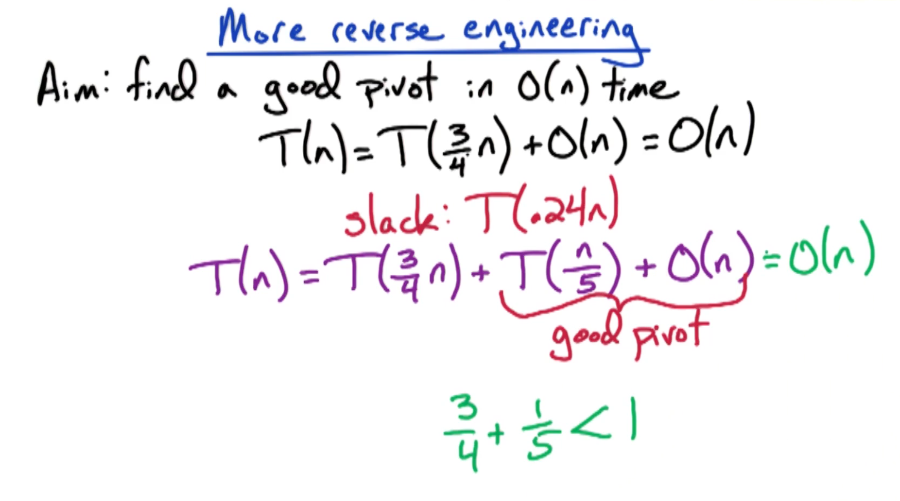{ width=650px }

Recall (cf. Section 7) that if such a "good" pivot is identified, then the overall running time will satisfy the following recurrence relation:

$$
T(n) = T\bigg( \frac{3}{4}n \bigg) + O(n)
$$

where $T(\frac{3}{4}n)$ represents the reduced size of the resulting subproblems (once a "good" pivot has been identified), and $O(n)$ represents the running time required to find the "good" pivot as well as to perform the corresponding partitioning of $A$ (i.e., this term $O(n)$ therefore represents $O(2 \times n) = O(n)$ accordingly).

Furthermore, recall (cf. Section 6) that this recurrence relation solves to an overall running time of $O(n)$ .

Recall (cf. Section 6) that there is also inherent "slack" in the constant factor (i.e., $\frac{3}{4}$ ), which (strictly speaking) must only be $<1$ in order to be effective. Correspondingly, we will exploit this "slack" to provide "extra/additional" time for finding the pivot.

For example, consider a representative factor of $0.24$ instead. This gives rise to the following recurrence relation for the running time:

$$
T(n) = T\bigg( \frac{3}{4}n \bigg) + T\bigg( \frac{1}{5}n \bigg) + O(n)
$$

where (as before) $T(\frac{3}{4}n)$ represents the reduced size of the resulting subproblems (once a "good" pivot has been identified), and $T(\frac{1}{5}n) + O(n)$ represents the collective time required to identify such a "good" pivot.

A key fact for why this is an actual improvement is due to the following:

$$
\frac{3}{4} + \frac{1}{5} < 1
$$

Therefore, the resulting recurrence relation still yields an overall worst case running time of $O(n)$ for identifying a "good" pivot.

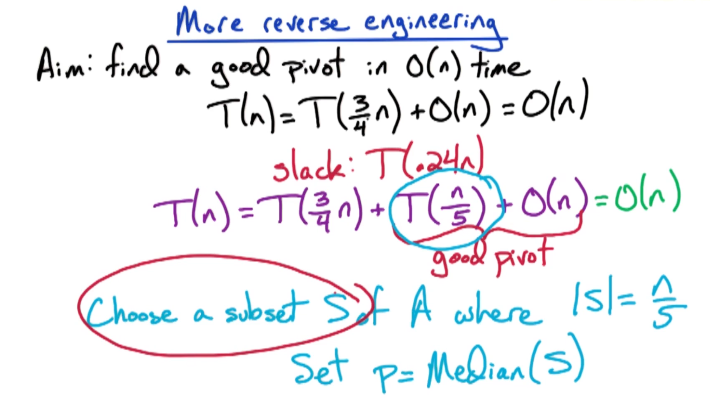{ width=650px }

Let us further consider exactly *how* we utilize this "slack" factor $T(\frac{1}{5}n)$ in order to find a "good" pivot.

To accomplish this, we choose a subset $S$ of $A$ such that:

$$
|S| = \frac{n}{5}
$$

From there, we run the recursive median algorithm on this subset $S$ , where we set the pivot as $p = {\text{Median}}(S)$ accordingly. Furthermore, the running time to identify the median via ${\text{Median}}(S)$ is $T(\frac{1}{5}n)$ , since $|S| = \frac{n}{5}$ .

However, a question still remains: How to ***choose*** such a subset $S$ of $A$ , such that $S$ is a "good" representative sample of $A$ ? To examine this question, we will first consider a naive choice of $S$ ; by analyzing the consequent failure, this will provide insight into devising a better choice for subset $S$ .

#### 10. Representative Sample

First, we consider a simple/naive idea for selecting the subset $S$ of $A$ .

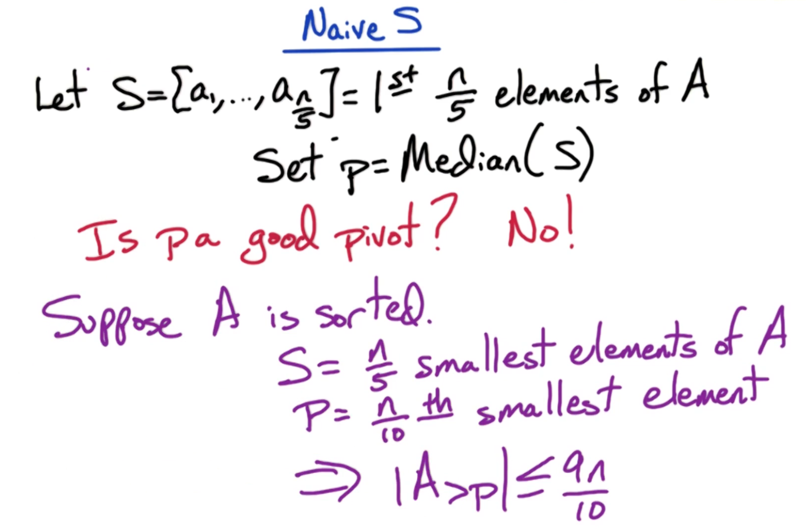{ width=650px }

One such simple/naive idea is the following:

> Let $S = [a_1, \dots, a_{\frac{n}{5}}]$ = the first $\frac{n}{5}$ elements of $A$

Furthermore, set the pivot to the following:

$$
p = {\text{Median}}(S)
$$

How, then, does this pivot $p$ perform? It turns out that this is ***not*** a "good" pivot. Let us consider why this is the case.

Suppose that $A$ is sorted. In this case, if $S$ is comprised of the $\frac{n}{5}$ smallest elements of $A$ , then ${\text{Median}}(S)$ gives rise to the following pivot:

$$
p = {\bigg( \frac{n}{10} \bigg)}^{{\text{th}}}{\text{\ smallest\ element\ of A}}
$$

This consequently implies the following largest-elements partition of $A$:

$$
|A_{>p}| \le \frac{9}{10}n
$$

Correspondingly, this increases the term of the recurrence relation (cf. Section 9) from $T(\frac{3}{4}n)$ to $T(\frac{9}{10}n)$ , which is a net degradation in the overall running time of the algorithm (i.e., this largest partition becomes "too large" in the worst case).

So, then, is there a "better" choice for $S$ ? Next, we consider how we can derive subset $S$ more effectively from $A$ by examining $A$ itself.

#### 11. Recursive Representative Sample

To goal now is to select subset $S$ such that it is "representative" of array $A$ .

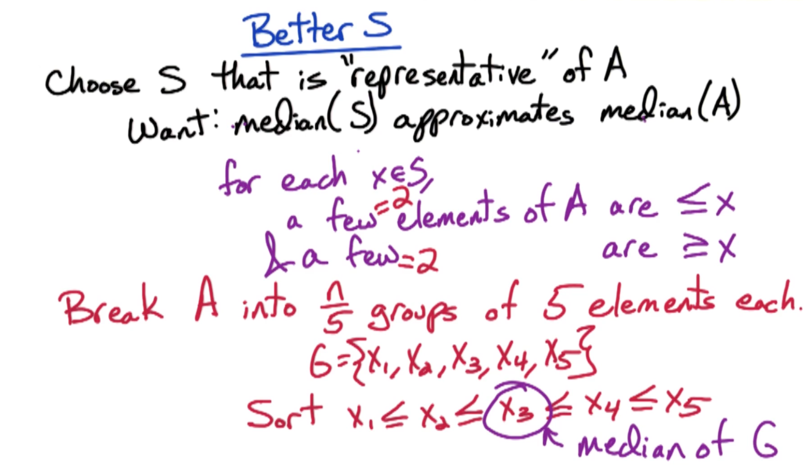{ width=650px }

By "representative," this means that ${\text{Median}}(S)$ is a reasonable approximation of ${\text{Median}}(A)$ itself (where ${\text{Median}}(A)$ subdivides $A$ into *exactly* smaller and larger halves, i.e., at relative proportions of $\frac{1}{2}$ apiece).

More formally, we can define this property as follows:

> For each element $x \in S$ , a few elements of $A$ are $\le x$ and a few elements are $\ge x$

With respect to "few" in this characterization, first consider the case of $2$ such elements, giving rise to a total of $5$ elements (including $x$ itself as the fifth). Therefore, we consider sets of $5$ elements, where $x$ itself is "representative" of each such set.

To accomplish this, we split $A$ into $\frac{n}{5}$ groups of $5$ elements apiece. For simplicity, we assume that $n$ is a power of $5$ in order to perform such splitting "cleanly."

In order to derive $S$ from each such group, we select one "representative" element $x$ from each group. This element $x$ "represents" the corresponding set in the sense that at least two elements of $A$ are at most $x$ (i.e., $\le x$ ) and at least two elements of $A$ are at least $x$ (i.e., $\ge x$ ), as per the correspondingly defined property.

As an example, consider the following group $G$ :

$$
G = \{ x_1, x_2, x_3, x_4, x_5 \}
$$

Furthermore, let us sort this group, such that the following relationship holds:

$$
x_1 \le x_2 \le x_3 \le x_4 \le x_5
$$

Therefore, with this sorting/ordering given, then the "representative" of this group is $x_3$ , the median element. Observe that this element provides the key property as desired (i.e., $x_1$ and $x_2$ are both at most $x_3$ , and similarly $x_4$ and $x_5$ are at least $x_3$ ). Furthermore, in this manner, the median element $x_3$ represents a distinct five-element group of subset $S$ (i.e., all five elements simultaneously this key property), with $S$ thereby collectively constituting a "representative" sample of $A$ accordingly.

Now, we have a better idea for finding a "good" pivot: Break $A$ into $k$ such groups (e.g., $k = 5$ in this example), individually sort the elements of the groups, and then select the median element of the group as the "representative" element of the group, thereby constituting the (reduced-size, i.e., $\frac{n}{k}$ ) subset $S$ of $A$ accordingly. Furthermore, note that since the size of the individual groups is ***constant*** (i.e., $k$ elements), then the corresponding sorting operation only requires a trivial running time of $O(1)$ (i.e., even if given a worst-case sorting algorithm having an abysmal exponential running time time $O(n^n)$ , sorting on a fixed-size group is still nevertheless effectively $O(1)$ on a fixed-size input).

Next, we will formalize this procedure, as well as prove that the "good" pivot $p$ selected in this manner (i.e., via ${\text{Median}}(S)$ , with subset $S$ appropriately defined as described here) is indeed a "good" pivot.

## 12-14. Median

### 12. Pseudocode

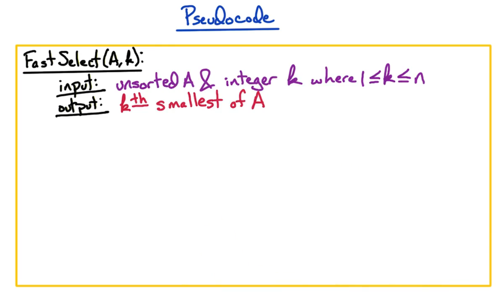{ width=650px }

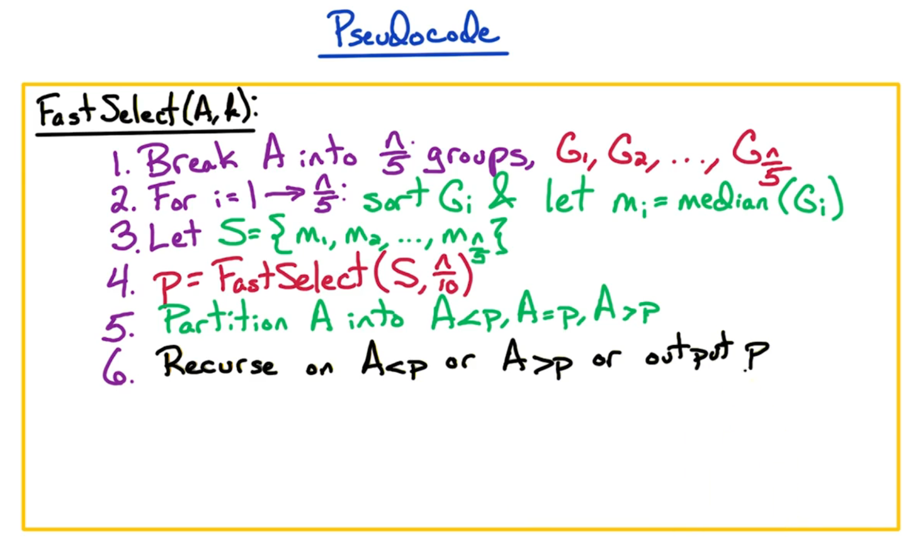{ width=650px }

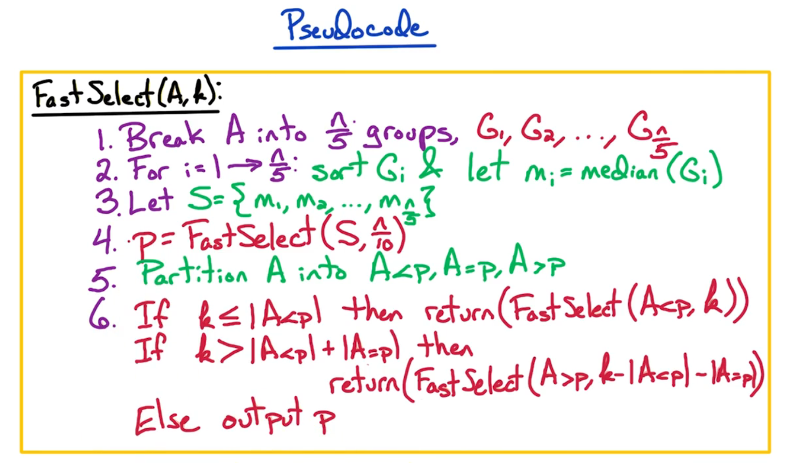{ width=650px }

The pseudocode for the algorithm to find the $k$th smallest element in list $A$ via subset $S$ is given as follows:

$$
\boxed{
\begin{array}{l}
{{\text{FastSelect}}(A,k):}\\
\ \ \ \ {{\text{input:\ }} {\text{unsorted\ array\ }} A {\text{\ of\ size\ }} n {\text{\ and\ integer\ }} k {\text{\ where\ }} 1 \le k \le n}\\
\ \ \ \ {{\text{output:\ }} k^{\text{th}}{\text{\ smallest\ element\ of\ }} A}\\
\\
\ \ \ \ {{\text{1.\ }} {\text{Split\ }} A {\text{\ into\ }} \frac{n}{5} {\text{\ groups,\ }} G_1, G_2, \dots, G_{\frac{n}{5}}}\\
\ \ \ \ {{\text{2.\ }} {\text{for\ }} i = 1 \to 5:}\\
\ \ \ \ \ \ \ \ {{\text{sort\ }} G_i {\text{\ and\ let\ }} m_i = {\text{Median}}(G_i)}\\
\ \ \ \ {{\text{3.\ }} {\text{Let\ }} S = \{ m_1, m_2, \dots, m_{\frac{n}{5}} \}}\\
\ \ \ \ {{\text{4.\ }} p = {\text{FastSelect}}\bigg(S, \frac{n}{10} \bigg) }\\
\ \ \ \ {{\text{5.\ }} {\text{Partition\ }} A {\text{\ into\ }} A_{<p}, A_{=p}, A_{>p}}\\
\ \ \ \ {{\text{6.\ }} {\text{Recurse\ on\ }} A_{<p} {\text{\ or\ }} A_{>p} {\text{,\ or\ output}} A_{=p} {\text{\ as\ follows:}}}\\
\ \ \ \ \ \ \ \ {{\text{6A.\ }} {\text{if\ }} k \le |A_{<p}| {\text{,\ then\ }} {\text{return}}({\text{FastSelect}}(A_{<p}, k))}\\
\ \ \ \ \ \ \ \ {{\text{6B.\ }} {\text{if\ }} k > |A_{<p}| + |A_{=p}| {\text{,\ then\ }} {\text{return}}({\text{FastSelect}}(A_{>p}, k - |A_{<p}| - |A_{=p}|))}\\
\ \ \ \ \ \ \ \ {{\text{6C.\ }} {\text{else\ output\ }} p}
\end{array}
}
$$

First, we identify a "good" pivot as follows:
  * In step $1$ , we split $A$ into $\frac{n}{5}$ groups $G_1, G_2, \dots, G_{\frac{n}{5}}$ , with each group having a size of $5$ elements.
    * ***N.B.*** More precisely, this should be defined as $\lceil \frac{n}{5} \rceil$ , since in general $n$ may not be an integer multiple of $5$ . However, there is an implicit simplifying assumption here as specified here in the pseudocode that $n$ is indeed an integer multiple of $5$ .
    * This splitting can be done in any arbitrary manner. The most straightforward manner is to simply assign these groups sequentially within $A$ (i.e., first five elements in $G_1$ , the next five elements in $G_2$ , and so on).
  * In step $2$ , we identify a "representative" element of each group, by iterating over all $\frac{n}{5}$ groups. For any given group $G_i$ (i.e., of size $5$ elements), we sort this group and then we readily determine the median of this (sorted) group as ${\text{Median}}(G_i)$ (i.e., the "middle" element of this sorted group), which is correspondingly set to $m_i$ for the group $G_i$ .
  * In step $3$ , we define the subset $S$ as the collection of these "representative" median elements, i.e., $S = \{ m_1, m_2, \dots, m_{\frac{n}{5}} \}$ .
  * In step $4$ , we finally determine the "good" pivot $p$ by recursively calling ${\text{FastSelect}}(S, \frac{n}{10})$ , where here $k' = \frac{n}{10}$ (second argument) now comprises the median of the subset $S$ (i.e., a "median of medians").

With the "good" pivot now identified, in step $5$ we partition $A$ into $A_{<p}, A_{=p}, A_{>p}$ as before (cf. Section 4). This can be readily accomplished with one full pass of array $A$ .

Finally, in step $6$ , analogously to before in ${\text{QuickSelect}}$ (cf. Section 4), based on the respective sizes of the resulting partitions, we either recurse into the smallest or largest partitions (i.e., $A_{<p} or A_{>p}$ , respectively), or otherwise output $p$ directly (i.e., via partition $A_{=p}$ ).

This completes the pseudocode for the algorithm. Next, we examine its overall running time, assuming that $p$ is indeed a "good" pivot.

### 13. Running Time

Now, consider the overall running time for algorithm $\text{FastSelect}$ (cf. Section 12).

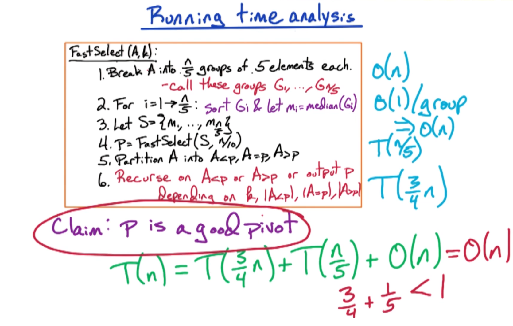{ width=650px }

For now, we assume that $p$ is indeed a good pivot. (In the next section, we further prove/substantiate this claim more formally.)

Step $1$ requires a running time of $O(n)$ , in order to split $A$ into corresponding groups via appropriate full traversal.

In Step $2$ , since each sorting operation requires a running time of $O(1)$ , and there are $\frac{n}{5}$ such groups, then the overall running time for this step is $O(n)$ .
  * ***N.B.*** If we were to use a very slow/suboptimal sorting algorithm, given $5!$ possible permutations for the ordering of the five elements in each group, then even naively checking each of these $5!$ permutations individually in order to identify the correctly sorted permutation will nevertheless still only require a running time of $O(5!)=O(1)$ (i.e., constant), by virtue of the fact that this group size is ***constant*** (i.e., as $A$ increases in size, the number of groups $G_i$ correspondingly increases, however, the size of the individual groups nevertheless remains constant).

Step $3$ is a simple definition, requiring a running time of $O(1)$ .

In Step $4$ , the recursive call ${\text{FastSelect}}(S, \frac{n}{10})$ (where $|S| = \frac{n}{5}$ ) has a corresponding running time of $T(\frac{n}{5})$ .

Step $5$ (similarly to Step $1$ ) requires a running time of $O(n)$ in order to traverse the array and create the corresponding partitions $A_{<p}, A_{=p}, A_{>p}$ .

Finally, in Step $6$ , since $p$ is guaranteed/assumed to be a "good" pivot, then as before (cf. Section 6), the running time for this step is $T(\frac{3}{4}n)$ , i.e., the recursive subproblems are of size at most $\frac{3}{4}n$ .

Therefore, combining these steps, the overall running time satisfies the following recurrence:

$$
T(n) = T \bigg( \frac{3}{4}n \bigg) + T \bigg( \frac{1}{5}n \bigg) + O(n)
$$

where the last term $O(n)$ encompasses multiple steps as described.

As before (cf. Section 9), the key fact for why this is an actual improvement is due to the following:

$$
\frac{3}{4} + \frac{1}{5} < 1
$$

By virtue of this *strict* improvement (i.e., relative to constant factor $1$ ), this recurrence relation solves to an overall running time of $O(n)$ .

However, it still remains to prove the claim that $p$ is indeed a "good" pivot (i.e., and thereby proving correctness of the algorithm accordingly); this matter is addressed in the next section.

### 14. Linear-Time Correctness

Finally, let us now demonstrate that $p$ as selected (cf. Section 12) is indeed a "good" pivot (i.e., as formally defined in Section 7).

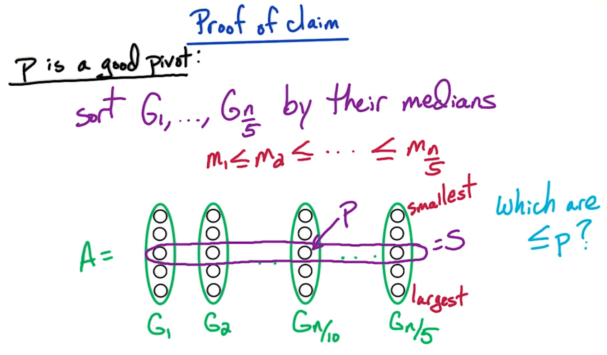{ width=650px }

In order to find the "good" pivot $p$ , we create groups $G_1, \dots, G_{\frac{n}{5}}$ (with each group $G_i$ having a size of $5$ elements), and then create a subset $S$ comprised of the medians of the medians for these groups, resulting in such a smaller subset $S$ of size $\frac{n}{5}$ elements (relative to size $n$ in original array $A$ ).

In order to determine the group-wise medians, it is also necessary to ***sort*** these groups $G_1, \dots, G_{\frac{n}{5}}$ by their respective medians (i.e, $G_1$ has the smallest median, $G_2$ has the next-smallest median, and so on), correspondingly defined and ordered as follows:

$$
m_1 \le m_2 \le \cdots \le m_{\frac{n}{5}}
$$

Consider the full set $A$ pictorially (as in the figure shown above), divided into these corresponding groups $G_i$ . Furthermore, consider the middle group of these groups ($G_{\frac{n}{10}}$ ), i.e.,:

$$
G_1, G_2, \dots, G_{\frac{n}{10}}, \dots, G_{\frac{n}{5}}
$$

Furthermore, consider these groups with their constituent five elements in sorted order (in the figure above, this is depicted with the smallest element at the top down to the largest element at the bottom of each group), where the middle element is the corresponding median of a given group.

Correspondingly, the subset $S$ is comprised of these median elements from each group (denoted by purple in the figure shown above). Furthermore, here, the pivot $p$ is the median element of the "middle" group $G_{\frac{n}{10}}$ (i.e., the median of medians).

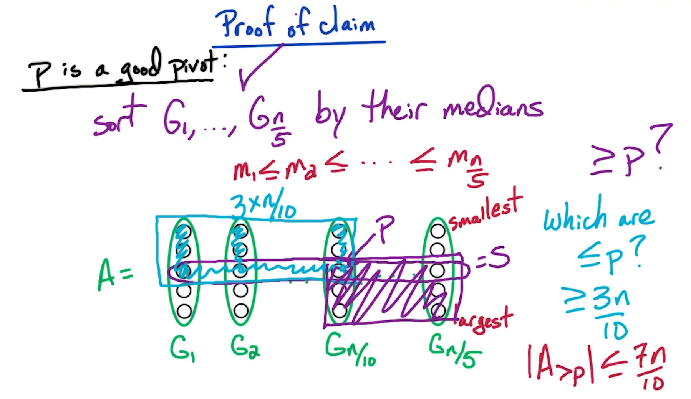{ width=650px }

Now, it remains to prove that $p$ is in fact a "good" pivot.

To accomplish this, we must first examine which elements in $S$ are strictly $\le p$ . Among the elements in $S$ , the medians from the lower-valued groups (i.e., based on sorted ordering of the groups) constitute such elements (as depicted in teal shading in the figure shown above). Furthermore, within any given group among these (including $G_{\frac{n}{10}}$ itself), there are at least two additional elements (i.e., those which are strictly less than or equal to their respective group medians) which also fall into this characterization. Cumulatively, the total count for these elements which are strictly $\le p$ is therefore:

$$
3 \times \frac{n}{10} = \frac{3n}{10}
$$

where there are $\frac{n}{10}$ total subgroups with each of size at least $3$ elements (including the respective groups' medians).

Therefore, this guarantees that there are at least $\ge \frac{3n}{10}$ elements which are at most $\le p$ .

Now, we consider the partitions of $A$ into $A_{<p}, A_{=p}, A_{>p}$ , with particular focus on partition $A_{>p}$ (i.e., elements which are strictly larger than pivot $p$ , which in turn *excludes* the complementary elements that are $\le p$ ). Given that we have excluded at least $\ge \frac{3n}{10}$ such complementary elements, then the corresponding constraint on the size of $A_{>p}$ is therefore:

$$
|A_{>p}| \le \frac{7n}{10}
$$

Recall (cf. Section 7) that a "good" pivot is defined as one which is at most $\frac{3}{4}n$ ; indeed, $|A_{>p}| \le \frac{7n}{10}$ does in fact satisfy this requirement (i.e., $\frac{7}{10} < \frac{3}{4} \implies 0.7 < 0.75$ is strictly true).

Furthermore, similarly, examining the total count of elements of size at least $p$ (i.e., $\ge p$ ), by symmetry, this yields:

$$
|A_{<p}| \le \frac{7n}{10}
$$

where the corresponding (as denoted in purple shading in the figure shown above) complementary set of elements $\ge p$ (where $p$ is the median of medians) is similarly of size at most $\frac{3n}{10}$.

Therefore, this concludes the proof for the claim that $p$ is indeed a "good" pivot.

## 15. Addendum: Homework Question

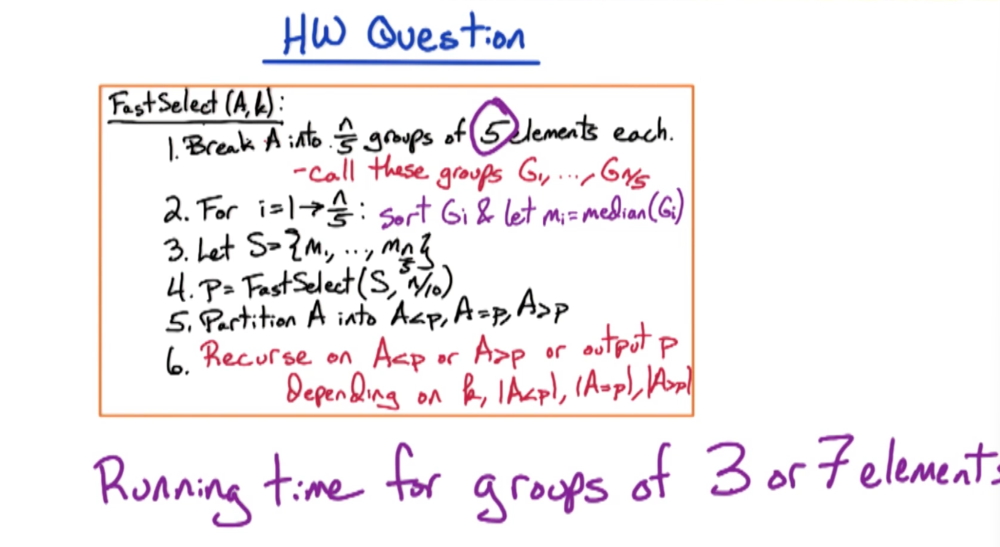{ width=650px }

In the preceding discussion of the algorithm ${\text{FastSelect}}$ (cf. Section 12), a natural question arises: Why split input array $A$ into groups of $5$ elements, rather than groups of size, say, $3$ or $7$ instead?

As an additional "exercise/assignment," consider such groups of size $3$ and $7$ , and performing the corresponding algorithm analysis on these two modified versions of the algorithm. Write out the resulting recurrence relations, and determine whether or not these recurrence relations solve to $O(n)$ as desired. This will consequently inform the decision for selecting a group size of $5$ elements accordingly.

# Divide and Conquer 3: Solving Recurrences

## 1. Solving Recurrences

> [!NOTE]
> ***Instructor's Note***: See also [DPV] Chapter 2.2 (Recurrence relations).

Divide and Conquer 3 is a brief "refresher" on solving **recurrences**, with a focus on the types of recurrences which typically arise in divide and conquer algorithms.

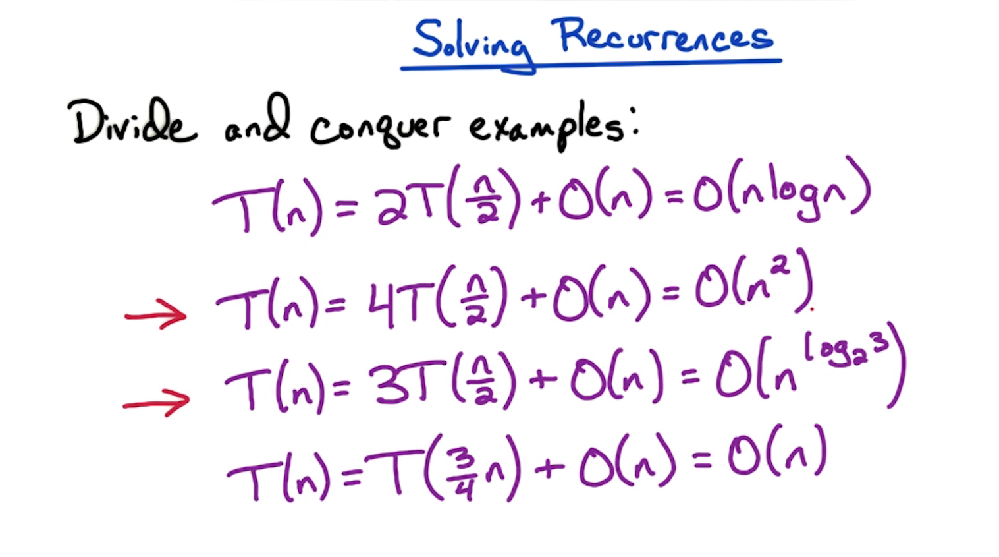{ width=650px }

A classical recurrence algorithm is that for mergesort, which is characterized by the following recurrence relation:

$$
T(n) = 2T \bigg( \frac{n}{2} \bigg) + O(n)
$$

where the input list is partitioned into halves (i.e., $T(\frac{n}{2})$ , comprising the first $\frac{n}{2}$ elements and the last $\frac{n}{2}$ elements), with exactly $2$ such halves, and a corresponding running time of $O(n)$ is required to merge/combine the fully sorted list.

As may already be familiar (cf. prerequisites or equivalent), this recurrence relation correspondingly solves to the following overall running time:

$$
T(n) = O(n \log n)
$$

Additionally, we have seen other examples of divide and conquer, summarized as follows:

| Algorithm | Reference | Description | Recurrence Relation | Solved Running Time |
|:--:|:--:|:--:|:--:|:--:|
| ${\text{EasyMultiply}}$ | Divide and Conquer 1, Section 7 | naive algorithm for integer multiplication | $T(n) = 4T(\frac{n}{2}) + O(n)$ | $O(n^2)$ |
| ${\text{FastMultiply}}$ | Divide and Conquer 1, Section 10 | improved algorithm for integer multiplication | $T(n) = 3T(\frac{n}{2}) + O(n)$ | $O(n^{\log _2 3}) \approx O(n^{1.59})$ |
| ${\text{FastSelect}}$ | Divide and Conquer 2, Section 12 | finding the median in an unsorted array | $T(n) = T(\frac{3}{4}n) + O(n)$ | $O(n)$ |

We will now formally solve these recurrences in turn, starting with algorithm ${\text{EasyMultiply}}$ , followed by ${\text{FastMultiply}}$ . Subsequently thereafter, we will examine a more general solution for recurrence relations of this general form.

## 2-3. Example 1

### 2. Introduction

We first consider the recurrence relation for algorithm ${\text{EasyMultiply}}$ (cf. Divide and Conquer 1, Section 7).

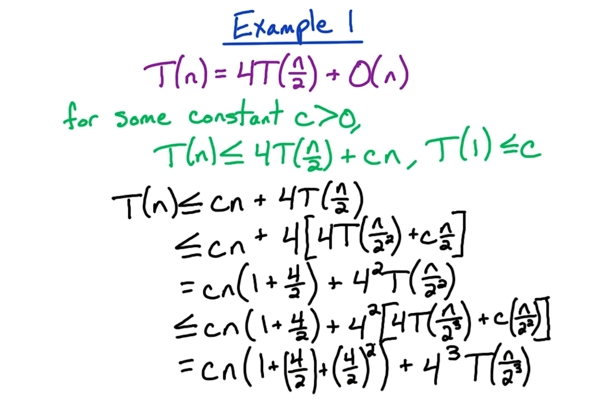{ width=650px }

The corresponding recurrence relation is given as follows:

$$
T(n) = 4T \bigg( \frac{n}{2} \bigg) + O(n)
$$

We can replace $O(n)$ in this expression and restate it as follows:

$$
T(n) \le 4T \bigg( \frac{n}{2} \bigg) + cn
$$

where $c$ is some constant such that $c > 0$ .

Furthermore, the base case is given simply as follows:

$$
T(1) \le c
$$

Note that the same constant $c$ can be used for both the base case and the recursive case (i.e., the maximum of these two otherwise-distinct constants for the worst-case performance).

Therefore, to solve for a closed-form solution to $T(n)$ (i.e., $T(n) \le f(n)$ ), we can express this recurrence relation as follows:

$$
T(n) \le cn + 4T \bigg( \frac{n}{2} \bigg)
$$

Next, we expand by substituting the expression $T(\frac{n}{2})$ as follows:

$$
T(n) \le cn + 4 \bigg[ 4T \bigg( \frac{n}{2^2} \bigg) + c \frac{n}{2} \bigg]
$$

Collecting common terms, we rewrite the right-hand expression as follows:

$$
T(n) \le cn \bigg( 1 + \frac{4}{2} \bigg) + 4^2 T \bigg( \frac{n}{2^2} \bigg)
$$

We repeat this process once again as follows:

$$
T(n) \le cn \bigg( 1 + \frac{4}{2} \bigg) + 4^2 \bigg[ 4T \bigg( \frac{n}{2^3} \bigg) + c \frac{n}{2^2} \bigg]
$$

$$
T(n) \le cn \bigg[ 1 + \bigg( \frac{4}{2} \bigg) + \bigg( \frac{4}{2} \bigg)^{2} \bigg] + 4^3 T \bigg( \frac{n}{2^3} \bigg)
$$

Observe that these successive expansions are forming a **geometric series**. Next, we will expand this out more comprehensively.

### 3. Expanding Out

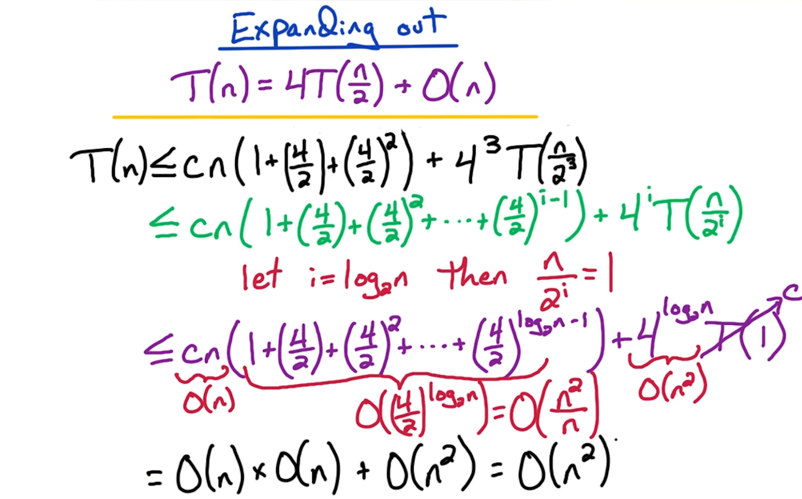{ width=650px }

Recall (cf. Section 2) that for the following recurrence relation:

$$
T(n) = 4T \bigg( \frac{n}{2} \bigg) + O(n)
$$

this correspondingly gives rise to the following partially expanded recurrence relation:

$$
T(n) \le cn \bigg[ 1 + \bigg( \frac{4}{2} \bigg) + \bigg( \frac{4}{2} \bigg)^{2} \bigg] + 4^3 T \bigg( \frac{n}{2^3} \bigg)
$$

***N.B.*** As written here, we deliberately use the form $(\frac{4}{2})$ (i.e., rather than $(2)$ ) in order to highlight the geometric series which will eventually result from this successive expansion of right-hand-side recursive expressions. Here, the $4$ and $2$ derive directly from the original recurrence relation (cf. term $4T(\frac{n}{2})$ ).

Now, rather than substituting an additional time, consider an analogous expansion up to the $i$th expansion, as follows:

$$
T(n) \le cn \bigg[ 1 + \bigg( \frac{4}{2} \bigg) + \bigg( \frac{4}{2} \bigg)^{2} + \cdots + \bigg( \frac{4}{2} \bigg)^{i-1} \bigg] + 4^i T \bigg( \frac{n}{2^i} \bigg)
$$

Proceeding in this manner, when exactly does the expansion terminate? This occurs when the base case is reached, which in turn occurs when the following holds:

$$
\frac{n}{2^i} = 1 \implies T \bigg( \frac{n}{2^i} \bigg) = T(1)
$$

Therefore, letting $i = \log _2 n$ , appropriate substitution yields the following:

$$
T(n) \le cn \bigg[ 1 + \bigg( \frac{4}{2} \bigg) + \bigg( \frac{4}{2} \bigg)^{2} + \cdots + \bigg( \frac{4}{2} \bigg)^{\log _2 n -1} \bigg] + 4^{\log _2 n} T(1)
$$

Given that $T(1)$ is upper-bounded by $c$ , we can therefore express the closed-form solution as follows:

$$
T(n) \le O(n) \times \bigg[ \bigg( \frac{4}{2} \bigg)^{\log _2 n} \bigg] + c \times O(n^2)
$$

Here, in the geometric series represented by the expression $[\cdots]$ , since the series is ***increasing*** (i.e., $\frac{4}{2} > 1$ ), the last term dominates, thereby giving rise to a running time of $O((\frac{4}{2})^{\log _2 n})$ . Furthermore, this expression simplifies to $O((\frac{4}{2})^{\log _2 n}) = O(\frac{n^2}{n}) = O(n)$ .

Lastly, we can further simplify the right-hand expression as follows:

$$
O(n) \times O(n) + O(n^2) = O(n^2)
$$

Therefore, the recurrence relation solves to the following:

$$
T(n) \le O(n^2)
$$

Observe that the key element of the recurrence relation is the geometric series which arises. Next, we will examine these mathematical techniques for handling such geometric series when they do arise.

## 4-5. Mathematical Techniques

### 4. Geometric Series

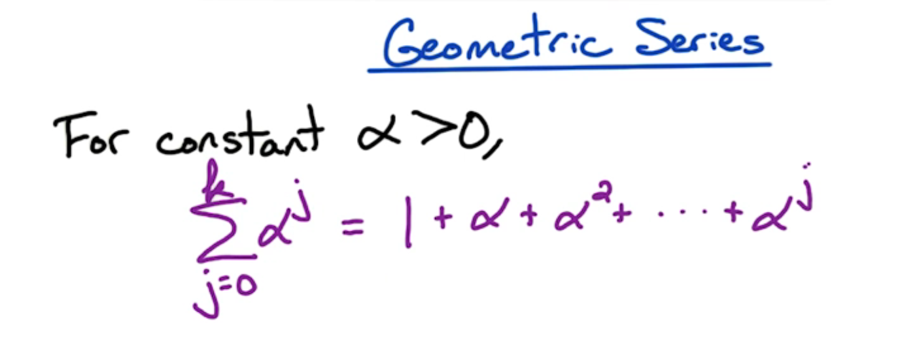{ width=500px }

Given constant $\alpha > 0$ (e.g., $\alpha = \frac{4}{2}$ in the previous example, cf. Section 3), consider the corresponding **geometric series** defined as follows:

$$
\sum\limits_{j = 0}^k {{\alpha ^j}}  = 1 + \alpha + \alpha^{2} + \cdots + \alpha^{j}
$$

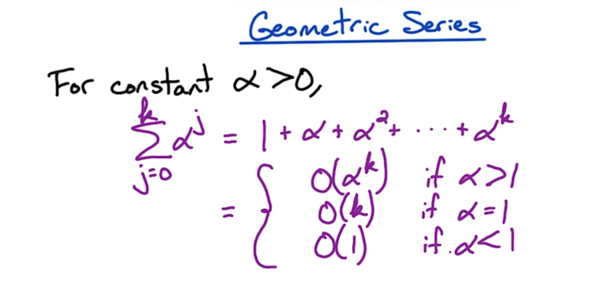{ width=500px }

Furthermore, since we are solving the recurrence relation using big-O notation, we do not need to solve this geometric series exactly (i.e., for infinite terms), but rather we can solve it for finite terms within a constant factor $k$ , i.e.,:

$$
\sum\limits_{j = 0}^k {{\alpha ^j}}  = 1 + \alpha + \alpha^{2} + \cdots + \alpha^{k}
$$

The ***key*** for solving such a geometric series is to determine which term dominates (as dictated by $\alpha$ ), yielding the following three possibilities:
  * the terms are decreasing, and therefore the first term dominates ($\alpha < 1$ )
  * the terms are increasing, and therefore the last term dominates ($\alpha > 1$ )
  * all terms are equal ($\alpha = 1$ )

Formally, we can express this as follows:

$$
\sum\limits_{j = 0}^k {{\alpha ^j}}  = 1 + \alpha + \alpha^{2} + \cdots + \alpha^{k} =
\begin{cases}
  {O(\alpha^{k})}&{{\text{if\ }} \alpha > 1}\\ 
  {O(k)}&{{\text{if\ }} \alpha = 1}\\
  {O(1)}&{{\text{if\ }} \alpha < 1}
\end{cases}
$$

***N.B.*** In the case $\alpha = 1$ , the resulting sum is simply $1 + 1 + \cdots + 1 = k \times 1 = k$ .

Therefore, in the previous example (cf. Section 3), with $\alpha = \frac{4}{2} > 1$ , and therefore the last term dominates in the corresponding geometric series. Conversely, in mergesort (cf. Section 1), $\alpha = \frac{2}{2} = 1$ . The algorithm for finding a median (cf. Section 1) is an example of the case $\alpha = \frac{3}{4} < 1$ .

### 5. Manipulating Polynomials

The final mathematical technique required for analyzing algorithms with respect to their recurrence relations is the manipulation of polynomials.

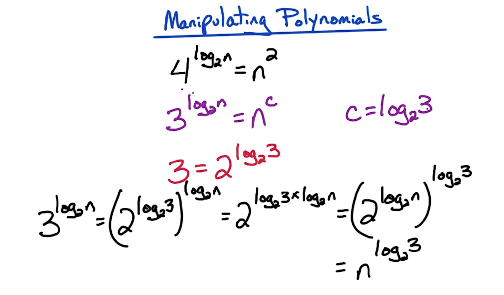{ width=650px }

Recall (cf. Section 3) the following expression from the previous example:

$$
4^{\log _2 n}
$$

This expression further simplifies as follows:

$$
4^{\log _2 n} = (2^2)^{\log _2 n} = (2^{\log _2 n})^{2} = n^2
$$

Furthermore, similar expressions may arise such as the following:

$$
3^{\log _2 n} = n^c
$$

for some constant $c$ .

To solve for $c$ , we can change the base of the left-side expression as follows:

$$
3 = 2^{\log _2 3}
$$

which in turn provides the following simplification:

$$
3^{\log _2 n} = (2^{\log _2 3})^{\log _2 n} = 2^{\log _2 3 \times \log _2 n} = (2^{\log _2 n})^{\log _2 3} = n^{\log _2 3}
$$

where now we have the final target/result in the form $n^c$ , with $c = \log _2 3$ .

More generally, these types of algebraic manipulations (e.g., applications of rules of logarithms) are essential for performing analysis in this manner.

## 6. Example 2

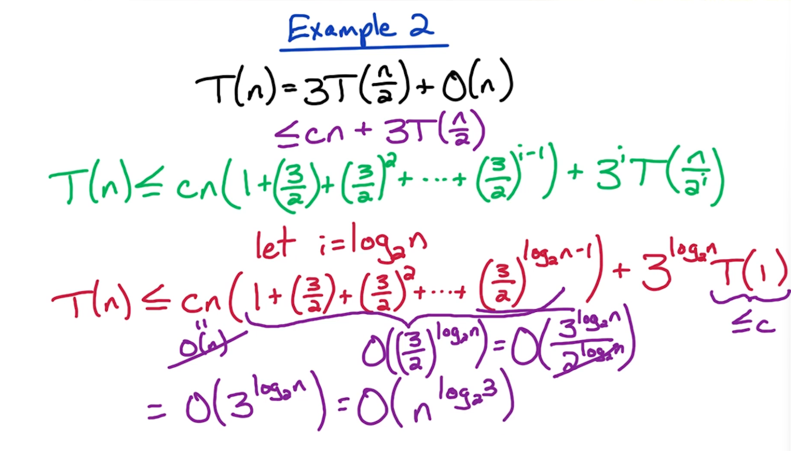{ width=650px }

Now, consider the following recurrence relation:

$$
T(n) = 3T \bigg( \frac{n}{2} \bigg) + O(n) \le cn + 3T \bigg( \frac{n}{2} \bigg)
$$

where, as before (cf. Section 2), the right-side expression is rewritten to eliminate big-O notation via equivalent term $cn$ corresponding to $O(n)$ .

***N.B.*** Recall (cf. Section 1) that this arose in the algorithm ${\text{FastMultiply}}$ .

As before (cf. Section 3), repeated substitutions for the recursive term in the right-side expression yields the following expression for the $i$th such iteration:

$$
T(n) \le cn \bigg[ 1 + \bigg( \frac{3}{2} \bigg) + \bigg( \frac{3}{2} \bigg)^2 + \cdots + \bigg( \frac{3}{2} \bigg)^{i-1} \bigg] + 3^i T \bigg( \frac{n}{2^i} \bigg)
$$

Observe that here, the geometric series is characterized by $\alpha = \frac{3}{2}$ , which derives directly from the original recurrence relation (cf. term $3T(\frac{n}{2})$ ).

Furthermore, as before (cf. Section 3), expansion terminates upon reaching the base case, which occurs at the following condition:

$$
\frac{n}{2^i} = 1 \implies T \bigg( \frac{n}{2^i} \bigg) = T(1)
$$

Therefore, letting $i = \log _2 n$ , this yields:

$$
T(n) \le cn \bigg[ 1 + \bigg( \frac{3}{2} \bigg) + \bigg( \frac{3}{2} \bigg)^2 + \cdots + \bigg( \frac{3}{2} \bigg)^{\log _2 n - 1} \bigg] + 3^{\log _2 n} T(1)
$$

***N.B.*** Here, we set $i = \log _2 n$ correspondingly to the expression $\frac{n}{2^i}$ . Similarly, if instead the expression were $\frac{n}{3^i}$ , then we would correspondingly set $i = \log _3 n$ accordingly; and so on.

Furthermore, we can now solve the right-side expression to the following:

$$
T(n) \le O(n) \times \bigg[ \bigg( \frac{3}{2} \bigg)^{\log _2 n} \bigg] + c \times O(3^{\log _2 n})
$$

Here, in the geometric series represented by the expression $[\cdots]$ , since the series is ***increasing*** (i.e., $\alpha = \frac{3}{2} > 1$ ), the last term dominates, thereby giving rise to a running time of $O((\frac{3}{2})^{\log _2 n})$ . Furthermore, this expression simplifies to $O((\frac{3}{2})^{\log _2 n}) = O(\frac{3^{\log _2 n}}{n})$ .

Lastly, we can further simplify the right-hand expression as follows:

$$
O(n) \times O \bigg( \frac{3^{\log _2 n}}{n} \bigg) + O(3^{\log _2 n}) = O(3^{\log _2 n}) = O(n^{\log _2 3})
$$

Therefore, the recurrence relation solves to the following:

$$
T(n) \le O(n^{\log _2 3}) \approx O(n^{1.59})
$$

where the final result is in polynomial form (i.e., of general form $n^c$ , where $c > 0$ is a constant).

## 7. General Recurrence

> [!NOTE]
> ***Instructor's Note***: See [DPV] Chapter 2.2 (Recurrence relations) for the more general form of the Master Theorem.

# Divide and Conquer 4: Fast Fourier Transform (FFT) - Part 1

## 1-3. Polynomial Multiplication

### 1. Introduction

> [!NOTE]
> ***Instructor's Note***: We closely follow the presentation in [DPV] Chapter 2.6 (The fast Fourier transform).

### 2. Example Quiz and Answers

### 3. General Problem

## 4. Convolution Applications

## 5. Polynomial Basics

## 6. Multiplying Polynomials: Values

## 7-12. Fast Fourier Transform (FFT)

### 7. Opposites

### 8. Splitting $A(x)$

### 9. Even and Odd

### 10. Recursion

### 11. Summary

### 12. Recursive Problem

## 13-19. Review: Complex Numbers

### 13. Introduction

### 14. Multiplying in Polar

### 15-19. Complex Roots

#### 15. Introduction

#### 16. Graphical View

#### 17. Notation

#### 18. Examples

#### 19. Practice Quiz and Answers

##### Question 1

##### Question 2

##### Question 3

##### Question 4

##### Question 5

### 20-21. Key Properties

#### 20. Opposites

#### 21. Squares

# Divide and Conquer 5: Fast Fourier Transform (FFT) - Part 2

## 1-5. Fast Fourier Transform (FFT)

### 1. High-Level Introduction

### 2-4. Pseudocode

#### 2. Introduction

#### 3. Core

#### 4. Concise

### 5. Running Time

## 6. Polynomial Multiplication Using Fast Fourier Transform (FFT)

## 7-9. Linear Algebra View

### 7. Introduction

### 8. Linear Algebra View of Fast Fourier Transform (FFT)

### 9. Linear Algebra for Inverse Fast Fourier Transform (FFT)

## 10-11. Inverse Fast Fourier Transform (FFT)

### 10. Introduction

### 11. Inverse Fast Fourier Transform (FFT) via FFT

## 12. Inverses Quiz and Answers

## 13-14. Sum of Roots

### 13. Introduction Quiz and Answers

### 14. Proof of Claim

## 15-17. Proof of Lemma

### 15. Introduction

### 16. Diagonal Entries

### 17. Off-Diagonal Entries

## 18. Back to Polynomial Multiplication
