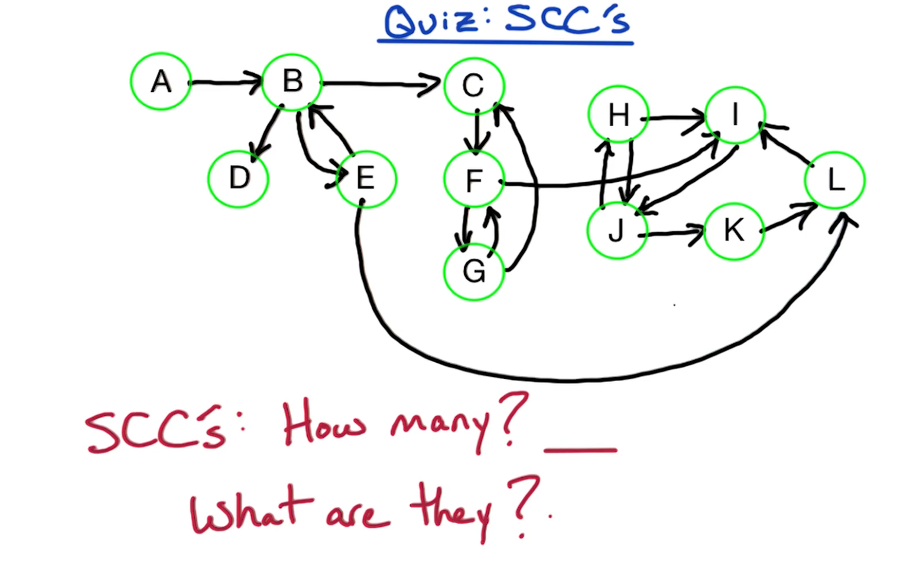
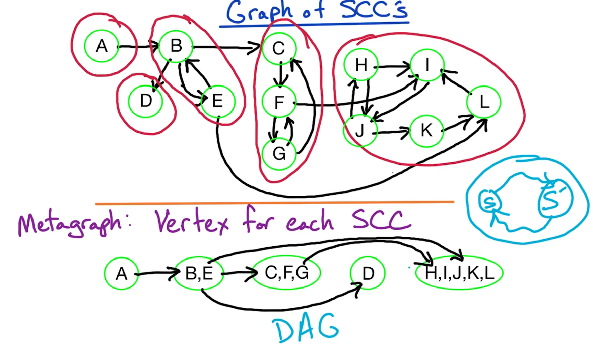

# Graph Algorithms: Topic Introduction

## Introduction

{ width=350px }

This topic discusses **graph algorithms**. The following may be familiar from previously (cf. course prerequisites):
  * **depth-first search** (**DFS**)
  * **breadth-first search** (**BFS**)
  * **Dijkstra's single-source shortest path** algorithm

First, we will begin with a brief review of how DFS is used to find the **connected components** of an *undirected* graph. From there, we will examine **connectivity** in *directed* graphs. We will use DFS to find the **strongly connected components** (**SCCs**) of directed graphs, which are analogous to connected components in undirected graphs.

Next, we will see an application of the strongly connected component (SCC) algorithm in solving the **2-SAT problem**.

Next, we will examine the **minimum spanning tree** (**MST**) problem.
  * ***N.B.*** Previously (cf. course prerequisites), you may have already seen Kruskal's and Prim's algorithms for determining the minimum spanning tree (MST) of a graph. Here, we will additionally examine the ***correctness*** of these algorithms.

Finally, we will examine the **PageRank** algorithm, which examines a web graph and assigns weights to its vertices (i.e., webpages), indicating a measure of their importance. This algorithm was devised by Brin and Page, and underlies the Google search engine. Prior to this, there will also be a brief primer on **Markov chains**, which have a corresponding relationship to strongly connected components.

## Overview

> [!NOTE]
> ***Instructor's Note***: See [DPV] Chapter 3 (Decompositions of graphs) and Eric's [notes](https://cs6505.wordpress.com/schedule/scc/).

{ width=650px }

In this topic, we will examine ***connectivity*** algorithms using algorithms based on **depth-first search** (**DFS**).

We will begin by reviewing depth-first search (DFS) for **undirected graphs**, and examine the algorithm for determining **connected components** in such undirected graphs.
  * ***N.B.*** This algorithm is likely familiar already (cf. course prerequisites).

Next, we will examine depth-first search (DFS) for **directed graphs**. The goal here is to determine the analog of connected components for such directed graphs.
  * We will begin by examining **directed acyclic graphs** (**DAGs**), which are characterized by ***no*** cycles (i.e., "acyclic")
    * We will also examine how to **topologically sort** such directed acyclic graphs (DAGs), i.e., with vertices being ordered, the edges will follow the corresponding order as well (i.e., left-to-right, or equivalent).
      * ***N.B.*** This algorithm may be familiar already (cf. course prerequisites), however, it will be useful for deriving some additional intuition for more sophisticated algorithms on directed graphs more generally.
  * Next, for general directed graphs, we will examine how to find the **strongly connected components** (**SCCs**), the analog to connected components in undirected graphs.
    * As it turns out, the algorithm for identifying these strongly connected components (SCCs) is simply comprised of two depth-first searches (DFSs), which will become more apparent/straightforward with the intuition gained by this point.

# Graph Algorithms 1: Strongly Connected Components

## 3-4. Undirected Graphs

### 3. Introduction

For a given **undirected graph** $G$ , how do we find its constituent **connected components**?

{ width=650px }

To find the connected components, we simply run the **depth-first search** (**DFS**) algorithm on undirected graph $G$ and keep track of the resulting number of components (with each vertex being designated by number in this manner accordingly).

Recall (cf. course prerequisites) the pseudocode for algorithm $\text{DFS}$ as follows:

$$
\boxed{
\begin{array}{l}
{{\text{DFS}}(G):}\\
\ \ \ \ {{\text{input:\ }} G(V,E) {\text{\ in\ adjacency\ list\ representation}}}\\
\ \ \ \ {{\text{output:\ }} {\text{vertices\ labeled\ by\ connected\ components}}}\\
\\
\ \ \ \ {{\text{cc}} = 0}\\
\ \ \ \ {{\text{for\ all\ }} v \in V {\text{:}}}\\
\ \ \ \ \ \ \ \ {{\text{visited}}(v) = {\text{FALSE}}}\\
\ \ \ \ {{\text{for\ all\ }} v \in V {\text{:}}}\\
\ \ \ \ \ \ \ \ {{\text{if\ not\ }} {\text{visited}(v) {\text{,\ then:}}}}\\
\ \ \ \ \ \ \ \ \ \ \ \ {{\text{cc++}}}\\
\ \ \ \ \ \ \ \ \ \ \ \ {{\text{Explore}}(v)}
\end{array}
}
$$

***N.B.*** We will make further modifications to this algorithm over the course of this lecture.

For now, we take ***input*** graph $G$ as an *undirected* graph, given in adjacency list representation. (Later, we will run the same algorithm on a *directed* graph.)

The ***output*** is the vertices of undirected graph $G$ , now labeled by a connected component number.

The counter ${\text{cc}}$ tracks the current connected component number. Furthermore, the array ${\text{visited}}$ tracks whether or not a given vertex $v$ has been visited yet.

The array ${\text{visited}}$ is initialized to all vertices' entries being set to ${\text{FALSE}}$.

Next, the vertices are iteratively traversed in arbitrary order. If a not-yet-visited vertex is encountered, then we have identified a *new* connected component. Correspondingly, ${\text{cc}}$ is incremented and we further explore from this vertex, as discussed in the next section.

### 4. Exploring Undirected Graphs

#### Pseudocode

{ width=650px }

The pseudocode for the previously encountered (cf. Section 3) subroutine ${\text{Explore}}$ is given as follows:

$$
\boxed{
\begin{array}{l}
{{\text{Explore}}(z):}\\
\ \ \ \ {{\text{ccnum}}(z) = {\text{cc}}}\\
\ \ \ \ {{\text{visited}}(z) = {\text{TRUE}}}\\
\ \ \ \ {{\text{for\ all\ }} (z, w) \in E {\text{:}}}\\
\ \ \ \ \ \ \ \ {{\text{if\ not\ }} {\text{visited}(w) {\text{,\ then:}}}}\\
\ \ \ \ \ \ \ \ \ \ \ \ {{\text{Explore}}(w)}
\end{array}
}
$$

Given ***input*** vertex $z$ , on initial encounter, its connected component number ${\text{cc}}$ is stored as ${\text{ccnum}}$ , the current count for the connected components.

Next, we set ${{\text{visited}}(z) = {\text{TRUE}}}$ (i.e., vertex $z$ has now been visited.)

Finally, we explore all edges $E$ from vertex $z$ , where the vertex information is readily available via the (linked-list) adjacency list representation of input graph $G$ to upstream caller ${\text{DFS}}$ (cf. Section 3). For a particular neighbor $w$ , if the neighbor has not yet been visited up to this point, then we recursively explore from $w$ accordingly (i.e., ${\text{Explore}}(w)$ ).

We repeat this process until all vertices in the graph have been visited/explored in this manner.

#### Running Time

What, then, is the overall running time for algorithm ${\text{DFS}}$ ?

You might recall (cf. course prerequisites) that algorithm ${\text{DFS}}$ has an overall linear running time when run on an undirected graph. More specifically, the overall running time is characterized as follows:

$$
O(n + m)
$$

where $n = |V|$ and $m = |E|$ .

This algorithm provides the ability to identify the connected components of the input undirected graph $G$ . Next, we will examine *directed* graphs, which will require obtaining additional information via depth-first search in order to obtain the appropriate connectivity information accordingly.

## 5-7. Depth First Search (DFS)

### 5. Paths

Recall (cf. Section 4) that the depth-first search (DFS) algorithm can be used to identify connected components in an *undirected* graph. Before proceeding onto a similar analysis of *directed* graphs, let us first glean some additional information from the depth-first search (DFS) algorithm.

{ width=650px }

In particular, suppose we are given a pair of vertices $(v, w)$ which reside in the *same* connected component. How to find a **path** between these **connected vertices**? To accomplish this, we must track the **predecessor vertex** when initially visiting a given vertex.

Recall (cf. Section 4) the depth-first search (DFS) algorithm for finding connected components on an undirected graph. Similarly to Dijkstra's algorithm (discussed later), we now additionally use the array ${\text{prev}}$ to track the predecessor vertex. The corresponding modification to the pseudocode is as follows:

$$
\boxed{
\begin{array}{l}
{{\text{DFS}}(G):}\\
\ \ \ \ {{\text{input:\ }} G(V,E) {\text{\ in\ adjacency\ list\ representation}}}\\
\ \ \ \ {{\text{output:\ }} {\text{vertices\ labeled\ by\ connected\ components}}}\\
\\
\ \ \ \ {{\text{cc}} = 0}\\
\ \ \ \ {{\text{for\ all\ }} v \in V {\text{:}}}\\
\ \ \ \ \ \ \ \ {{\text{visited}}(v) = {\text{FALSE}}}\\
\ \ \ \ \ \ \ \ {{\text{prev}}(v) = {\text{NULL}}}\\
\ \ \ \ {{\text{for\ all\ }} v \in V {\text{:}}}\\
\ \ \ \ \ \ \ \ {{\text{if\ not\ }} {\text{visited}(v) {\text{,\ then:}}}}\\
\ \ \ \ \ \ \ \ \ \ \ \ {{\text{cc++}}}\\
\ \ \ \ \ \ \ \ \ \ \ \ {{\text{Explore}}(v)}
\end{array}
}
$$

$$
\boxed{
\begin{array}{l}
{{\text{Explore}}(z):}\\
\ \ \ \ {{\text{ccnum}}(z) = {\text{cc}}}\\
\ \ \ \ {{\text{visited}}(z) = {\text{TRUE}}}\\
\ \ \ \ {{\text{for\ all\ }} (z, w) \in E {\text{:}}}\\
\ \ \ \ \ \ \ \ {{\text{if\ not\ }} {\text{visited}(w) {\text{,\ then:}}}}\\
\ \ \ \ \ \ \ \ \ \ \ \ {{\text{Explore}}(w)}\\
\ \ \ \ \ \ \ \ \ \ \ \ {{\text{prev}}(w) = z}
\end{array}
}
$$

With this modification, in algorithm ${\text{DFS}}$ , the predecessors array is initialized as ${\text{prev}}(v) = {\text{NULL}}$ with respect to each vertex, i.e., an empty array.

Furthermore, on recursive call of subroutine ${\text{Explore}}$ , we additionally set ${\text{prev}}(w) = z$ , indicating that a predecessor vertex now exists with respect to candidate vertex $w$ .

Upon running this algorithm, we can now use the predecessors array ${\text{prev}}(v)$ to **backtrack**, in order to identify a corresponding **path** between a pair of connected vertices.

This concludes the discussion of the depth-first search (DFS) algorithm on *undirected* graphs. Next, we discuss depth-first search (DFS) on *directed* graphs.

### 6-7. Depth-First Search (DFS) on Directed Graphs

#### 6. Introduction

Having seen (cf. Section 4) how to determine connected components in an *undirected* graph, now consider how to determine connected components in a ***directed*** graph.

{ width=650px }

{ width=650px }

To accomplish this, in a directed graph $G$ , we similarly use depth-first search (DFS), however, we now consider some additional information: The **preorder** or **postorder** numbers for the **tree** (or **forest**) of the explored edges. The corresponding modification of the previous (cf. Section 4) pseudocode is as follows:

$$
\boxed{
\begin{array}{l}
{{\text{DFS}}(G):}\\
\ \ \ \ {{\text{input:\ }} G(V,E) {\text{\ in\ adjacency\ list\ representation}}}\\
\ \ \ \ {{\text{output:\ }} {\text{vertices\ labeled\ by\ connected\ components}}}\\
\\
\ \ \ \ {{\text{clock}} = 1}\\
\ \ \ \ {{\text{for\ all\ }} v \in V {\text{:}}}\\
\ \ \ \ \ \ \ \ {{\text{visited}}(v) = {\text{FALSE}}}\\
\ \ \ \ {{\text{for\ all\ }} v \in V {\text{:}}}\\
\ \ \ \ \ \ \ \ {{\text{if\ not\ }} {\text{visited}(v) {\text{,\ then:}}}}\\
\ \ \ \ \ \ \ \ \ \ \ \ {{\text{Explore}}(v)}
\end{array}
}
$$

$$
\boxed{
\begin{array}{l}
{{\text{Explore}}(z):}\\
\ \ \ \ {{\text{pre}}(z) = {\text{clock}}}\\
\ \ \ \ {{\text{clock++}}}\\
\ \ \ \ {{\text{visited}}(z) = {\text{TRUE}}}\\
\ \ \ \ {{\text{for\ all\ }} (z, w) \in E {\text{:}}}\\
\ \ \ \ \ \ \ \ {{\text{if\ not\ }} {\text{visited}(w) {\text{,\ then:}}}}\\
\ \ \ \ \ \ \ \ \ \ \ \ {{\text{Explore}}(w)}\\
\ \ \ \ {{\text{post}}(z) = {\text{clock}}}\\
\ \ \ \ {{\text{clock++}}}
\end{array}
}
$$

Here, we no longer require tracking of the connected component number (via corresponding variables ${\text{cc}}$ and ${\text{ccnum}}$ ). Instead, we now track the preorder and postorder numbers, via arrays ${\text{pre}}$ and ${\text{post}}$ (respectively).

Furthermore, to accomplish the corresponding tracking, we add variable ${\text{clock}}$ , which in subroutine ${\text{Explore}}$ is initialized to the value immediately prior to the first visit/traversal of vertex $z$ , and then subsequently incremented immediately following exploration of vertex $z$ (i.e., via the corresponding edges $(z, w) \in E$ ). Correspondingly, these values are stored in arrays ${\text{pre}}$ and ${\text{post}}$ (respectively), along with accompanying increments of variable ${\text{clock}}$ upon this storage to record it accordingly (i.e., ${\text{clock++}}$ ).

For determining the connectivity of the vertices, we can then examine the array ${\text{post}}$ .
  * ***N.B.*** The preorder array ${\text{pre}}$ is tracked in this canonical formulation of the algorithm, however, as a practical matter, it does not provide any useful information with respect to determining the connected vertices themselves.

#### 7. Example

{ width=650px }

Consider a specific directed graph comprised of eight vertices, as in the figure shown above. Now, let us run the depth-first search (DFS) algorithm (cf. Section 6) on this graph, starting at vertex $B$ . Furthermore, for concreteness, we assume that the linked-list representation of vertices is stored in alphabetical order with respect to a given vertex's neighboring vertices (e.g., the neighbors of vertex $B$ are represented as list $[A, C, E]$ ).

Starting with vertex $B$ , we initially traverse/explore the directed graph $G$ as follows:

| ${\text{clock}}$ | Vertex $v$ | ${\text{pre}}(v)$ | ${\text{post}}(v)$ |
|:--:|:--:|:--:|:--:|
| $1$ | $B$ | $1$ | ${\text{NULL}}$ |
| $2$ | $A$ | $2$ | ${\text{NULL}}$ |
| $3$ | $D$ | $3$ | ${\text{NULL}}$ |
| $4$ | $E$ | $4$ | ${\text{NULL}}$ |
| $5$ | $G$ | $5$ | ${\text{NULL}}$ |

Now, since $G$ does not have any remaining vertices to explore, we finish exploring $G$ , assign ${\text{post}}(G) = 6$ , and return to vertex $E$ . Furthermore, observe that exploration from $E$ proceeds back to $A$ , which has already been explored/visited by this point.
  * ***N.B.*** We do not subsequently "re-explore" from vertex $A$ as a result of this (i.e., this does not yield a corresponding "newly included edge" in the resulting depth-first search tree), however, visually we have still denoted this "check" with teal arrow in the figure shown above for additional reference (i.e., as distinguished from the "included edges" denoted in black in the built-out search tree).

The resulting updates are therefore as follows:

| ${\text{clock}}$ | Vertex $v$ | ${\text{pre}}(v)$ | ${\text{post}}(v)$ |
|:--:|:--:|:--:|:--:|
| $1$ | $B$ | $1$ | ${\text{NULL}}$ |
| $2$ | $A$ | $2$ | ${\text{NULL}}$ |
| $3$ | $D$ | $3$ | ${\text{NULL}}$ |
| $4$ | $E$ | $4$ | ${\text{NULL}}$ |
| $5$ | $G$ | $5$ | ${\text{NULL}}$ |
| $6$ | $G$ | $5$ | $6$ |
| $7$ | $E$ | $5$ | $7$ |

Proceeding similarly, we now examine vertex $D$ , yielding the following:

| ${\text{clock}}$ | Vertex $v$ | ${\text{pre}}(v)$ | ${\text{post}}(v)$ |
|:--:|:--:|:--:|:--:|
| $1$ | $B$ | $1$ | ${\text{NULL}}$ |
| $2$ | $A$ | $2$ | ${\text{NULL}}$ |
| $3$ | $D$ | $3$ | ${\text{NULL}}$ |
| $4$ | $E$ | $4$ | ${\text{NULL}}$ |
| $5$ | $G$ | $5$ | ${\text{NULL}}$ |
| $6$ | $G$ | $5$ | $6$ |
| $7$ | $E$ | $4$ | $7$ |
| $8$ | $H$ | $8$ | ${\text{NULL}}$ |
| $9$ | $H$ | $8$ | $9$ |
| $10$ | $D$ | $3$ | $10$ |

Here, exploring from vertex $D$ , we ultimately encounter already explored vertex $E$ (noted accordingly via ${\text{post}}(E) = 7$ ), as well as similarly terminating exploration of vertices (immediately unexplored) $H$ and (currently explored) $D$ itself.

We then proceed similarly "back up" through to vertices $A$ and $B$ , yielding the following:

| ${\text{clock}}$ | Vertex $v$ | ${\text{pre}}(v)$ | ${\text{post}}(v)$ |
|:--:|:--:|:--:|:--:|
| $1$ | $B$ | $1$ | ${\text{NULL}}$ |
| $2$ | $A$ | $2$ | ${\text{NULL}}$ |
| $3$ | $D$ | $3$ | ${\text{NULL}}$ |
| $4$ | $E$ | $4$ | ${\text{NULL}}$ |
| $5$ | $G$ | $5$ | ${\text{NULL}}$ |
| $6$ | $G$ | $5$ | $6$ |
| $7$ | $E$ | $4$ | $7$ |
| $8$ | $H$ | $8$ | ${\text{NULL}}$ |
| $9$ | $H$ | $8$ | $9$ |
| $10$ | $D$ | $3$ | $10$ |
| $11$ | $A$ | $2$ | $11$ |

From vertex $B$ , we now explore vertex $C$ , i.e.,:

| ${\text{clock}}$ | Vertex $v$ | ${\text{pre}}(v)$ | ${\text{post}}(v)$ |
|:--:|:--:|:--:|:--:|
| $1$ | $B$ | $1$ | ${\text{NULL}}$ |
| $2$ | $A$ | $2$ | ${\text{NULL}}$ |
| $3$ | $D$ | $3$ | ${\text{NULL}}$ |
| $4$ | $E$ | $4$ | ${\text{NULL}}$ |
| $5$ | $G$ | $5$ | ${\text{NULL}}$ |
| $6$ | $G$ | $5$ | $6$ |
| $7$ | $E$ | $4$ | $7$ |
| $8$ | $H$ | $8$ | ${\text{NULL}}$ |
| $9$ | $H$ | $8$ | $9$ |
| $10$ | $D$ | $3$ | $10$ |
| $11$ | $A$ | $2$ | $11$ |
| $12$ | $C$ | $12$ | ${\text{NULL}}$ |

This in turn results in exploration of vertex $F$ , i.e.,:

| ${\text{clock}}$ | Vertex $v$ | ${\text{pre}}(v)$ | ${\text{post}}(v)$ |
|:--:|:--:|:--:|:--:|
| $1$ | $B$ | $1$ | ${\text{NULL}}$ |
| $2$ | $A$ | $2$ | ${\text{NULL}}$ |
| $3$ | $D$ | $3$ | ${\text{NULL}}$ |
| $4$ | $E$ | $4$ | ${\text{NULL}}$ |
| $5$ | $G$ | $5$ | ${\text{NULL}}$ |
| $6$ | $G$ | $5$ | $6$ |
| $7$ | $E$ | $4$ | $7$ |
| $8$ | $H$ | $8$ | ${\text{NULL}}$ |
| $9$ | $H$ | $8$ | $9$ |
| $10$ | $D$ | $3$ | $10$ |
| $11$ | $A$ | $2$ | $11$ |
| $12$ | $C$ | $12$ | ${\text{NULL}}$ |
| $13$ | $F$ | $13$ | ${\text{NULL}}$ |

Since vertex $F$ is neighboring with (at this point) already explored neighbors $B$ and $H$ , we similarly "back up" as before, yielding the following final overall result (with overall exploration correspondingly terminated at originating vertex $B$ ):

| ${\text{clock}}$ | Vertex $v$ | ${\text{pre}}(v)$ | ${\text{post}}(v)$ |
|:--:|:--:|:--:|:--:|
| $1$ | $B$ | $1$ | ${\text{NULL}}$ |
| $2$ | $A$ | $2$ | ${\text{NULL}}$ |
| $3$ | $D$ | $3$ | ${\text{NULL}}$ |
| $4$ | $E$ | $4$ | ${\text{NULL}}$ |
| $5$ | $G$ | $5$ | ${\text{NULL}}$ |
| $6$ | $G$ | $5$ | $6$ |
| $7$ | $E$ | $4$ | $7$ |
| $8$ | $H$ | $8$ | ${\text{NULL}}$ |
| $9$ | $H$ | $8$ | $9$ |
| $10$ | $D$ | $3$ | $10$ |
| $11$ | $A$ | $2$ | $11$ |
| $12$ | $C$ | $12$ | ${\text{NULL}}$ |
| $13$ | $F$ | $13$ | ${\text{NULL}}$ |
| $14$ | $F$ | $13$ | $14$ |
| $15$ | $C$ | $12$ | $15$ |
| $16$ | $B$ | $1$ | $16$ |

with corresponding final state of the resulting search tree as follows:

| Vertex $v$ | ${\text{pre}}(v)$ | ${\text{post}}(v)$ |
|:--:|:--:|:--:|
| $B$ | $1$ | $16$ |
| $A$ | $2$ | $11$ |
| $D$ | $3$ | $10$ |
| $E$ | $4$ | $7$ |
| $G$ | $5$ | $6$ |
| $H$ | $8$ | $9$ |
| $C$ | $12$ | $15$ |
| $F$ | $13$ | $14$ |

## 8-9. Types of Edges

### 8. Introduction

{ width=650px }

Consider a specific **edge** from the directed graph in the previous example (cf. Section 7), e.g., $z \to w$ . Furthermore, let us consider whether this is an explored edge in the resulting depth-first search (DFS) tree (where in the figure shown above, black edges denote such explored edges, whereas teal edges denoted other "re-explored neighbors" edges during the course of running the algorithm, as discussed previously in Section 7).

The **tree edges** are those which are included in the corresponding depth-first search (DFS) tree upon completion of the algorithm. Examples of such edges in this graph include $B \to A$ and $A \to D$ .
  * ***N.B.*** In this particular example, the resulting tree edges formed a connected **tree**, whereby each vertex is reachable from the start vertex (i.e., vertex $B$ ). More generally, a non-connected **forest** can also result from running this algorithm, whereby multiple groups of such connected trees result from the algorithm. However, for simplicity, here, we will simply use the semantics of a "tree edge," as opposed to a more general "forest edge."

Consider the properties of the post-order numbering in these tree edges. In general, the following property holds:

$$
{\text{post}}(z) > {\text{post}}(w)
$$

i.e., the post-order numbering of the "head" edge is generally "later" than that of the "tail" edge, when exploring in this depth-first search manner.

Now, let us consider the other "non-tree" edges (as denoted by teal in the figure shown above). Among these, there are three distinct ***types***, characterized as follows:

| Edge Type | Description | Relationship of post-order numbering | Examples |
|:--:|:--:|:--:|:--:|
| **Back** | From descendent vertex $w$ to ancestor vertex $z$ | ${\text{post}}(z) < {\text{post}}(w)$ | $E \to A$ , $F \to B$ |
| **Forward** | From ancestor vertex $z$ to descendent vertex $w$ | ${\text{post}}(z) > {\text{post}}(w)$ | $D \to G$ , $B \to E$ |
| **Cross** | No ancestor/descendent relationship among vertices $z$ and $w$ | ${\text{post}}(z) > {\text{post}}(w)$ | $F \to H$ , $H \to G$ |

In particular, observe that back edges have a ***smaller*** post-numbering of the descendent vertex $w$ relative to its ancestor vertex $z$ (i.e., the "head" vertex is "ahead of" the "tail" vertex). This constitutes a ***key property*** for post-order numbering accordingly (i.e., back edges behave differently from the other types of edges).

Otherwise, forward and cross edges have the same/analogous property as the tree edges themselves.
  * In the case of forward edges, they are similarly "moving down" the tree as tree edges, but simply doing so by more than one vertex (i.e., past the neighboring vertex).
  * In the case of cross edges, generally the edge of the relatively first-explored vertex $w$ will receive the lower/"earlier" post-order numbering (otherwise, there would have been an ancestor/descendent "sub-tree" relationship between the vertices).

### 9. Cycles

Now, let us examine properties of the directed graph $G$ , and how these properties manifest themselves in the resulting depth-first search (DFS) tree.

{ width=650px }

Consider the property of a **cycle**. How does a cycle manifest itself in the resulting depth-first search (DFS) tree of a directed graph? This key property emerges as follows:

> Directed graph $G$ has a **cycle** if and only if its depth-first search (DFS) tree contains a ***back edge***

***N.B.*** This property holds for the graph irrespectively of which starting vertex is used to produce the depth-first search (DFS) tree. Furthermore, the ordering of the vertices in the adjacency-list representation of the graph similarly does not impact the resulting presence (or absence) of a back edge, thereby indicating the presence (or absence, respectively) cycle in the graph.

#### Proof

Let us consider the proof for why this property holds. Since this is an equivalence relation (i.e., $\iff$ ), we examine the two implications in turn.

##### Forward Implication

Consider the forward implication ($\Rightarrow$ ), given as follows:

> The depth-first search (DFS) tree contains a back edge if directed graph $G$ has a cycle

Here, we suppose that directed graph $G$ has a cycle. We now examine how such a back edge will appear. Let us denote this cycle as $a \to b \to c \to \cdots \to j \to a$ , where vertex $j$ "cycles" back to vertex $a$ .

Necessarily, at least one of these vertices is always explored *first*. Let us denote this first-explored vertex as vertex $i$ . What does this indicate about the resulting sub-tree originating from vertex $i$ ? Since all of the vertices are reachable from $i$ in this sub-tree, then these vertices are correspondingly contained in the subtree as constituent vertices $a, \dots, i-1$ and $i + 1, \dots, j$ .

Among these constituent vertices, at least one has a common edge with $i$ . More specifically, in this case, we know that vertex $i-1$ has a common edge with $i$ ; furthermore, this edge is indeed a back edge.

##### Reverse Implication

Now, consider the reverse implication ($\Leftarrow$ ), given as follows:

> Directed graph $G$ has a cycle if its depth-first search (DFS) tree contains a back edge

Here, we suppose that the resulting depth-first search (DFS) tree contains a back edge. Let us denote this back edge as $a \leftarrow b$ .

We know that vertex $a$ is a descendent of corresponding ancestor vertex $b$ . However, we also know that there are corresponding "intermediate neighbors" edges between vertices $a$ and $b$ . Collectively, this indeed constitutes a cycle, i.e., $b \to \cdots a \to b$ , where the latter edge $a \to b$ is the corresponding back edge in question.

Therefore, this proves that the property holds in general via the forward and reverse implications.

## 10-12. Topological Sorting

### 10. Introduction

Now, consider a **directed acyclic graph** (**DAG**), which are characterized by ***no*** cycles (i.e., "acyclic").

{ width=650px }

Recall (cf. Section 9) that the implication of such a directed acyclic graph (DAG) is that there are correspondingly ***no*** back edges present in the resulting depth-first search (DFS) tree.

Furthermore, consider how to **topologically sort** such a directed acyclic graph, such that the vertices in the resulting depth-first search (DFS) tree are strictly ordered from lower to higher (with respect to their post-order numbering).

To accomplish this, we first run the depth-first search algorithm (cf. Section 6) on the directed acyclic graph (DAG) $G$ in order to produce the corresponding tree. Recall (cf. Section 8) that in such a graph without cycles, without back edges being present, the post-order numbering is strictly increasing (cf. back edges are characterized by a corresponding strictly decreasing ordering in the post-order numbering), i.e.,:

> For all $z \to w$ , ${\text{post}(z)}$ > ${\text{post}(w)}$

Therefore, in order to topologically sort the vertices, we simply start from the highest-post-order-number vertex and then proceed towards the lowest-post-numbered vertex, i.e., in decreasing post-order numbering direction.

In order to actually "sort" the vertices in this manner, note that this is not a simple running time of $O(n \log n)$ , but rather this requires a running time of:

$$
O(n + m)
$$

where $n = |V|$ and $m = |E|$ .

To understand this running time, consider the range of potential post-order numberings. In the algorithm ${\text{DFS}}$ (cf. Section 6), ${\text{clock}}$ is initialized to $1$ , the lowest possible value for the post-order numbering. Furthermore, th largest possible value for the post-order numbering is $2n$ (i.e., a fully connected graph).

Utilizing a corresponding array of length $2n$ to track these post-order numberings, we can assign vertex-wise post-order numberings among these array elements upon iterative exploration of the vertices, and then finally traverse this array from the largest to the lowest element/index, outputting the corresponding vertices as they are encountered in this traversal (i.e., decreasing order of post-order numbering).

Therefore, the overall running time is comprised of $O(m + n)$ to run the depth-first search (DFS) algorithm (cf. Section 6), followed by $O(2n) = O(n)$ to perform this subsequent sorting (i.e., depth-first search is the dominating step in this overall sequence).

### 11. Topological Ordering Quiz and Answers

{ width=450px }

Consider the graph in the figure shown above. Provide a topological ordering of its five constituent vertices. Furthermore, how many distinct/valid such topical orderings are present in this graph?

{ width=450px }

One such valid topological ordering is given by inspection as follows:

$$
X \to Y \to Z \to U \to W
$$

where the corresponding edges are in strictly increasing order with respect to post-order numbering (i.e., depicted/oriented as "left-to-right" in the figure shown above).

With respect to the number of distinct such topological orderings, the position of vertex $U$ can assume any of the last three positions. After this is specified, there is consequently only one possible (strict) ordering of edge $Z \to W$ . Therefore, in total there are $3$ distinct topological orderings in total.

### 12. Directed Acyclic Graph (DAG) Structure

Let us now consider some additional properties of a directed acyclic graph (DAG) which derive from topological ordering (cf. Section 10).

{ width=650px }

In general, there are two distinct ***types*** of vertices of note:
  * **source vertex**, which has *no* ***incoming*** edges (i.e., neighboring edges are strictly directed "away" from the vertex)
  * **sink vertex**, which has *no* ***outgoing*** edges (i.e., neighboring edges are strictly directed "into" the vertex)

A directed acyclic graph (DAG) *always* contains at least one source vertex and one sink vertex (furthermore, in general, it can also contain multiple source vertices and/or multiple sink vertices).

How do we know there is always a source vertex in a given directed acyclic graph (DAG)? Taking the topological ordering, the first vertex is always a source vertex (e.g., vertex $X$ in the figure shown above). Furthermore, this is the vertex with the highest post-order numbering via depth-first search (DFS).
  * ***N.B.*** If there are multiple source vertices in the directed acyclic graph (DAG), then the corresponding multiple distinct topological orderings will correspondingly place these respective source vertices at this first position. However, in either case, this first-position index will be comprised of such a source vertex.

Complementarily to this, taking the topological ordering, the last vertex is similarly always a sink vertex (e.g., vertices $U$ and $W$ in the figure shown above). Furthermore, this is the vertex with the lowest post-order numbering via depth-first search.
  * ***N.B.*** Furthermore, there may be multiple such last vertex sinks, if the directed acyclic graph (DAG) yields multiple distinct topological orderings (i.e., which place these distinct sink vertices in the last position accordingly).

{ width=650px }

Now, consider an ***alternative*** topological sorting algorithm, defined as follows:
  * (1) - Find a sink vertex, output it, and delete it
  * (2) - Repeat (1) until the graph is empty

***N.B.*** This alternative algorithm is not particularly useful for directed acyclic graphs (DAGs), however, it will become much more useful when we later examine more general (i.e., possibly cyclic) directed graphs.

Since we know that in a topological ordering the last vertex is necessarily a sink vertex, we can readily begin at this point, and proceed back towards the starting vertex accordingly. When the starting vertex is reached in this manner, immediately prior to terminating the algorithm, the resulting graph is effectively now a sink vertex in this intermediate graph of current size $1$ ; therefore, now it only remains to eliminate this element to yield an empty graph, thereby terminating the algorithm.

The net result is an output of the vertices in the order from "last" to "first," thereby yielding a valid topological sorting.

However, this begs the question: How to find such a sink vertex a priori in the first place? We will consider this matter more comprehensively in the next section, in the context of the more general notion of "connectivity in directed graphs."

## 13. Outline Review

{ width=650px }

We have now seen how to find connected components in undirected graphs (cf. Section 4), as well as how to topologically sort a directed acyclic graph (DAG) (cf. Section 10). Both of the underlying algorithms involved a *single* run of (correspondingly modified versions of) the depth-first search (DFS) algorithm.

In a more general directed graph (potentially containing cycles), the corresponding analog of connected component is **strongly connected components** (**SCCs**). Next, we will examine strongly connected components (SCCs) of such a general directed graph more thoroughly, which will culminate in a corresponding algorithm to find such strongly connected components (SCCs) using *two* runs of the (appropriately modified) depth-first search (DFS) algorithm.

## 14. Connectivity in Directed Graphs

In the remainder of this topic (i.e., Graph Algorithms 1), we will focus on ***directed*** graphs. However, let us first consider the notion of **connectivity** in directed graphs.

{ width=650px }

Given a pair of vertices $v$ and $w$ in a directed graph, we formally define **strong connectivity** as follows:

> Vertices $v$ and $w$ are **strongly connected** if there is a pair of complementary **paths** $v \rightsquigarrow w$ and $w \rightsquigarrow v$

where in general the paths $\rightsquigarrow$ may be comprised of multiple intermediate vertices, and furthermore these two paths may intersect at some intermediate point(s).

{ width=650px }

In the context of *directed* graphs, we can characterize **strongly connected components** (**SCCs**) comprised of such vertices (cf. *undirected* graphs are comprised of analogous connected components, as discussed previously in Section 5).

Furthermore, in directed graphs, strongly connected components (SCCs) comprise the ***maximal*** set of strongly connected vertices (cf. the connected components *undirected* graphs are comprised of the maximal set of connected vertices), i.e., the vertices are progressively added to the set until the graph has been fully iterated upon.

Next, we will further discuss the notion of strongly connected components (SCCs), with an opening example to motivate this definition and subsequent discussion.

## 15-23. Strongly Connected Components (SCC)

### 15. Examples Quiz and Answers

{ width=650px }

Consider the directed graph comprised of 12 vertices, as in the figure shown above. How many total strongly connected components (SCCs) are present in this graph? Furthermore, identify these strongly connected components (SCCs) accordingly.

{ width=650px }

This graph is comprised of $5$ total strongly connected components (SCCs), as denoted in purple in the figure shown above. Furthermore, the corresponding sets are the following:

$$
\{ A \}
$$

$$
\{ B, E \}
$$

$$
\{ C, F, G \}
$$

$$
\{ D \}
$$

$$
\{ H, I, J, K, L \}
$$

Within a given strongly connected component (SCC), each constituent vertex is mutually path-reachable from every other vertex, however, this "mutual reachability" does *not* generally hold *across* strongly connected components.

Given these $5$ strongly connected components (SCCs), we can further consider a graph comprised of five "meta-vertices," which each such "meta-vertex" representing its corresponding strongly connected component (SCC). When examining in this manner, there are edges which "cross" the corresponding "meta-vertex boundaries" (e.g., "meta-vertex" $A$ has an outbound edge to "meta-vertex" $B$ ).

Next, we will examine this notion of a graph on "meta-vertices" in this manner, which in turn will reveal some interesting properties.

### 16. Graph of Strongly Connected Components (SCC)

Now, consider the **meta-graph** on the strongly connected components (SCCs) from the previous example (cf. Section 15).

{ width=650px }

In such a **meta-graph**, each strongly connected component (SCC) is represented by a corresponding "composite" vertex (i.e., a "meta-vertex"), as denoted by red in the figure shown above, and summarized as follows:

$$
\{ A \}
$$

$$
\{ B, E \}
$$

$$
\{ C, F, G \}
$$

$$
\{ D \}
$$

$$
\{ H, I, J, K, L \}
$$

Furthermore, the edges between these vertices can also be represented, as in the figure shown above (bottom section).

Observe that in this **meta-graph** representation of the strongly connected components (SCCs) (via their corresponding vertices), in general, the resulting meta-graph can be a **multi-graph** (e.g., adding an edge from vertex $G$ to vertex $J$ adds a corresponding edge to the meta-graph, as denoted by teal edge in the figure shown above). However, in general, this multiplicity (i.e., of edges) is not significant with respect to the representation of this meta-graph; indeed, for purposes of the current discussion, we will generally *avoid* such multiple (redundant) edges.

{ width=650px }

So, then, what is a ***key property*** on such a meta-graph of strongly connected components (SCCs)? Observe that there are ***no*** cycles present, i.e., the meta-graph itself is a **directed acyclic graph** (**DAG**). In fact, this is generally *always* the case.

Why are there no cycles in the meta-graph? Suppose there are two strongly connected components $S$ and $S'$ which constitute a cycle (as in the figure shown above). That means that there is a pair of complementary paths $S \rightsquigarrow S'$ and $S' \rightsquigarrow S$ . We know that every vertex within $S$ is connected to each other (i.e., by definition of a strongly connected component), and similarly within $S'$ as well. Therefore, every vertex in $S$ can reach $S'$ via path $S \rightsquigarrow S'$ , and similarly every vertex in $S'$ can reach $S$ via path $S' \rightsquigarrow S$ , and correspondingly $S \cup S'$ is itself a strongly connected component (SCC). Furthermore, note that these strongly connected components (SCCs) are defined to be ***maximal*** sets of strongly connected vertices, resulting in a contradiction: $S \cup S'$ must hold, rather than (separate/disjoint) sets $S$ and $S'$ , i.e., if such a cycle were otherwise present in the meta-graph, then we could simply merge the strongly connected components (SCCs) to form a larger/"composite" strongly connected component (SCC).

Therefore, there cannot be any cycles present in the meta-graph, and thus the meta-graph itself is a directed acyclic graph (DAG).

{ width=650px }

As a consequence of this key property, since a meta-graph is a directed acyclic graph (DAG) of its constituent strongly connected components (SCCs), we can correspondingly break up such a directed graph into its constituent components, and then order them into a topological ordering (by simple virtue of the meta-graph itself being a directed acyclic graph). Thus, even such an arbitrarily complex directed acyclic graph (DAG) can nonetheless be decomposed into such a relatively simple structure which is intrinsic to it.

Next, we will describe an algorithm which finds these strongly connected components (SCCs), with this search itself resulting in a specific order (i.e., topological ordering). Furthermore, as it turns out, this can be accomplish relatively straightforwardly by two simple applications of depth-first search (DFS).

### 17-22. Strongly Connected Component (SCC) Algorithm

#### 17. Algorithm Idea

Now, consider the main idea for the algorithm to identify the strongly connected components (SCC) in a meta-graph. Furthermore, these strongly connected components (SCCs) will be found in topological ordering as the algorithm proceeds.

{ width=650px }

Consider the topological ordering of a directed acyclic graph (DAG), where vertex $v$ is the "first"/"left-most" and vertex $w$ is the "last"/"right-most," as in the figure shown above.

We know that vertex $w$ must be a **sink vertex**, i.e., only edges which go "in" but no edges that go "out." This is due to the nature of the ordering itself (i.e., edges can't go "back" in "reverse order").

Analogously, vertex $v$ must be a **source vertex**, i.e., only edges which go "out" but no edges that go "in."

Furthermore, this gives rise to a natural search algorithm, given these properties: We begin with finding the sink vertex, and then progress in this manner "backwards" towards the source vertex, outputting the intermediate sink vertices encountered in this manner along the way.

Analogously, we can also find the source vertex, and proceed in the "forward" direction towards the sink vertex (via intermediate source vertices) as well.

{ width=650px }

We will therefore use an analogous method, however, rather than finding a sink vertex, instead, we will find a ***sink*** strongly connected component (SCC), i.e., an analogous sink vertex in the meta-graph on the constituent strongly connected components (SCCs).

Once this sink meta-vertex is found (which is present at the "end" of the topological ordering), we output it, and then remove it from the meta-graph and then repeat in this manner, until the meta-graph is eventually empty.

{ width=650px }

This begs the question: Why the *sink* strongly connected component (SCC) (i.e., as opposed to the *source*)?

With respect to the topological ordering of the directed acyclic graph (DAG) itself, the choice itself is arbitrary. However, with respect to strongly connected components (SCCs), the decision is in fact consequential: Sinks are more straightforward to work with.

Why is it the case that sinks strongly connected components (SCCs) are "easier" to work with? Take any vertex $v \in S$ , where $S$ is a sink strongly connected component (SCC) in the meta-graph, and then run the procedure ${\text{Explore}(v)}$ (cf. Section 6) on it. When exploring from $v$ in this manner, which vertices are actually explored?

Consider the strongly connected component (SCC) from previously (cf. Section 16) comprised of the following vertices:

$$
\{ H, I, J, K, L \}
$$

Here, we will explore *all* of these vertices in this sink strongly connected component (SCC), however, we will *not* consequently explore any other vertices in the process, since the latter are not reachable.

Therefore, exploring $S$ results in visiting ***all*** of the vertices of $S$ , and ***nothing*** else!

Therefore, if we find such a vertex $v$ which is guaranteed to be in such a sink strongly connected component (SCC), then we can run procedure ${\text{Explore}(v)}$ , which will correspondingly explore within the scope of this sink strongly connected component (SCC). Correspondingly, this is a ***key property*** of such sink strongly connected components (SCCs). Once we have marked all of this sink strongly connected component's vertices as visited, we can remove them accordingly and proceed onto the next sink strongly connected component (SCC) in this manner.

Now, consider if we find vertex $A$ in a source strongly connected component (SCC). When we run procedure ${\text{Explore}(A)}$ , all we know is that we can reach many vertices, given that $A$ is a source vertex (in fact, we can reach the *entire* graph from vertex $A$ ). Therefore, given that the *entire* graph can be potentially explored in this manner, there is no straightforward way to mark intermediate vertices which reside within the source strongly connected component (SCC) vs. in other intermediate strongly connected components (SCCs). Conversely, this issue does *not* generally result when exploring in this manner starting at a *sink* strongly connected component (SCC), which otherwise guarantees exploration of only the constituent vertices within this sink strongly connected component (SCC) in any given iteration of the exploration, and nothing else.

{ width=650px }

So, then, how do we identify such a vertex $v$ which is *guaranteed* to reside within a sink strongly connected component (SCC)? This is the ***key task*** which will be explored in the subsequent sections.

#### 18. Vertex in Sink Strongly Connected Component (SCC)

{ width=650px }

Recall (cf. Section 12) that in a directed acyclic graph (DAG), the vertex with the ***lowest*** postorder number is a ***sink***.

Now, consider a more general directed graph $G$ (which may contain cycles). If we run depth first search (DFS) on such a general directed graph, is there some corresponding property with respect to postorder numbers which can analogously guarantee the presence of a vertex residing within a sink strongly connected component (SCC)?

In such a general directed graph, we might postulate that perhaps vertex $v$ with the lowest postorder numbering *always* lies within a sink strongly connected component (SCC). If this were indeed the case, then, as before (cf. Section 17), we would simply run the algorithm straightforwardly from this sink strongly connected component (SCC). However, unfortunately, this property does ***not*** generally hold for such a general directed graph.

As a counter-example, consider the graph comprised of vertices $B$ , $A$ , and $C$ , as in the figure shown above (as depicted in green), with vertices $B$ and $A$ forming a strongly connected component (SCC), and vertex $C$ constituting a separate strongly connected component (SCC). If we run depth first search (DFS) starting from vertex $A$ (as depicted in purple in the figure shown above), the resulting postorder numbering is as follows:

| Vertex | Postorder numbering |
|:--:|:--:|
| $A$ | $1, 6$ |
| $B$ | $2, 3$ |
| $C$ | $4, 5$ |

Here, the vertex with the *lowest* postorder numbering is vertex $B$ . However, vertex $B$ resides in the strongly connected component (SCC) which is ***not*** a *sink* strongly connected component (SCC), but rather a *source* strongly connected component (SCC).

Now, consider reformulating as follows:

> In a directed acyclic graph (DAG), the vertex with ***highest*** postorder number is a ***source***

And correspondingly, with respect to a more general directed graph:

> In a general directed graph $G$ , the vertex $v$ with ***highest*** postorder number ***always*** lies in a ***source*** strongly connected component (SCC)

We will later prove more thoroughly that this latter formulation does indeed hold in general. Next, we will first utilize this key property to devise the corresponding algorithm for eventually finding a *sink* strongly connected component (SCC) in a general directed graph, as desired (i.e., for corresponding topological ordering).

#### 19. Finding Sink Strongly Connected Component (SCC)

{ width=650px }

Recall (cf. Section 18) the following property, which is generally true for a general directed graph (i.e., which may otherwise contain cycles):

> In a general directed graph $G$ , the vertex $v$ with ***highest*** postorder number ***always*** lies in a ***source*** strongly connected component (SCC)

Given this property, how do we then find a vertex $w$ residing in a corresponding ***sink*** strongly connected component (SCC)?

We can accomplish this straightforwardly by simply "reversing" the constituent edges of the graph. Consequently, the former "sink" strongly connected component (SCC) becomes a "source" strongly connected component (SCC), and vice versa. More formally:

> For directed graph $G = (V, E)$ , examine the reverse graph $G^{R} = (V, E^{R})$

where the reverse edges set $E^{R}$ in the latter is defined as:

$$
E^{R} = \{ \vec{wv}: \vec{vw} \in E  \}
$$

i.e., every edge in graph $G^{R}$ is the reverse of every edge in graph $G$ .

Therefore, when we examine graph $G^{R}$ , the corresponding source and sink strongly connected components (SCCs) are similarly "reversed" relative to the original graph $G$ . Nevertheless, the strongly connected components (SCCs) still remain as such in ***both*** graphs (i.e., with respect to the constituent vertex-pairs in the respective graphs).

Furthermore, with respect to the resulting directed acyclic meta-graph of these strongly connected components (SCCs), the corresponding topological ordering in the meta-graph of the reverse graph is effectively "reversed," i.e., from "last"/"right-most" to "first"/"left-most." Correspondingly, a ***source*** strongly connected component (SCC) in graph $G$ is now a ***sink*** strongly connected component (SCC) in graph $G^{R}$ ; and similarly a ***sink*** strongly connected component (SCC) in graph $G$ is now a ***source*** strongly connected component (SCC) in graph $G^{R}$ .

Now, returning to the original problem at hand, how do we find vertex $w$ residing in a *sink* strongly connected component (SCC) with respect to directed graph $G$ ? If we take the directed graph $G$ as the input, we can construct reverse directed graph $G^{R}$ from it, and then take the vertex with the *highest* postorder number in the latter, which is guaranteed to be a *source* strongly connected component (SCC) in directed graph $G^{R}$ , but then also correspondingly/complementarily a *sink* strongly component in the original directed graph $G$ itself. Therefore, this constitutes the desired algorithm in question accordingly: We have now successfully identified the sink strongly connected component (SCC) in directed graph $G$ (i.e., in intended topological ordering)!

#### 20. Example

> [!NOTE]
> ***Instructor's Note***: Typo: The preorder number of $D$ and the postorder number of $C$ are both $12$ . The preorder number of $D$ should be $13$ and all preorder/postorder numbers from $13$ onwards should be incremented by $1$ . The resulting order on the postorder numbers does not change.

#### 21. Algorithm

##### Pseudocode

##### Running Time Quiz and Answers

### 22-23. Proof of Key Strongly Connected Component (SCC) Fact

#### 22. Introduction

#### 23. Simpler Claim

## 24. Comparison: Depth-First Search (DFS), Breadth-First Search (BFS), and Dijkstra's Algorithm

# Graph Algorithms 2: 2-Satisfiability

## 1-4. Satisfiability (SAT)

### 1. Notation

> [!NOTE]
> ***Instructor's Note***: For Eric's notes see [here](https://cs6505.wordpress.com/schedule/2-sat/).

### 2-3. Satisfiability (SAT) Problem

#### 2. Introduction

#### 3. Quiz and Answers

#### Question 1

#### Question 2

#### Question 3

### 4. $k$-SAT

## 5. Simplifying Input

## 6. Graph of Implications

## 7. Graph Properties

## 8. Strongly Connected Components (SCC)

## 9-10. Algorithm Idea

### 9. Approach 1

### 10. Approach 2

## 11. 2SAT Algorithm

## 12-13. Proof of Key Fact

### 12. Introduction

### 13. Rest of Proof

## 14. Proof of Claim

# Graph Algorithms 3: Minimum Spanning Tree

## 1. Greedy Approach

## 2. Minimum Spanning Tree (MST) Problem

> [!NOTE]
> ***Instructor's Note***: See [DPV] Chapter 5.1 (Minimum Spanning Trees) and Eric's [notes](https://cs6505.wordpress.com/schedule/mst/).

## 3. Tree Properties

## 4. Greedy Approach for Minimum Spanning Tree (MST)

## 5-6. Kruskal's Algorithm

### 5. Pseudocode

### 6. Analysis

### 7. Correctness

## 8. Cuts

## 9-10. Cut Property

### 9. Introduction

### 10. Kruskal's Algorithm

## 11-14. Proof

### 11. Outline

### 12. Constructing $T$

### 13. $T$ Is a Tree

### 14. $T$ Is a Minimum Spanning Tree (MST)

## 15. Prim's Algorithm

# Graph Algorithms 4: Markov Chains and PageRank

## 1. Outline

## 2-13. Markov Chains

### 2. Example

### 3. General

### 4. 2-Step Transitions

### 5. $k$-Step Transitions

### 6. Big $k$ for 6210 Example

### 7. Infinite Time

### 8. Linear Algebra View

### 9. Stationary Distribution

### 10. Bipartite Markov Chain

### 11. Multiple Strongly Connected Components (SCC)

### 12. Ergodic Markov Chain

### 13. What is $\pi$?

## 14-28. PageRank

### 14. Introduction

### 15. Webgraph

### 16-17. First Idea

#### 16. Introduction

#### 17. Problem 1

### 18-19. Second Idea

#### 18. Introduction

#### 19. Problem 2

### 20. Rank Definition

### 21. Random Walk

### 22-23. Stationary Distribution

#### 22. Introduction

#### 23. Problems

### 24-27. Random Surfer

#### 24. Introduction

#### 25. Transition Matrix

#### 26. Sink Nodes

#### 27. Ergodic

### 28. Finding $\pi$
