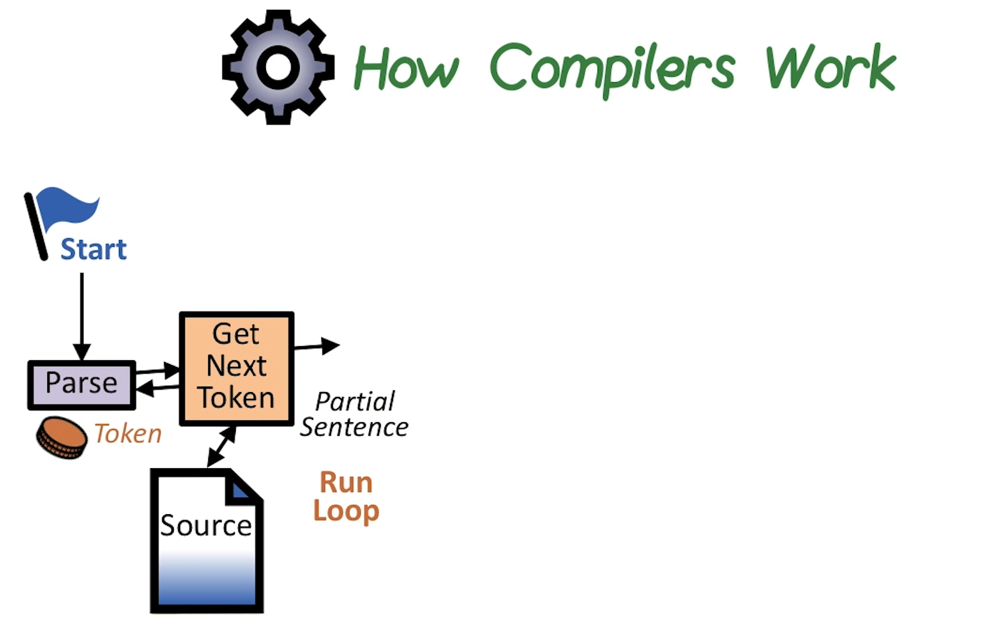
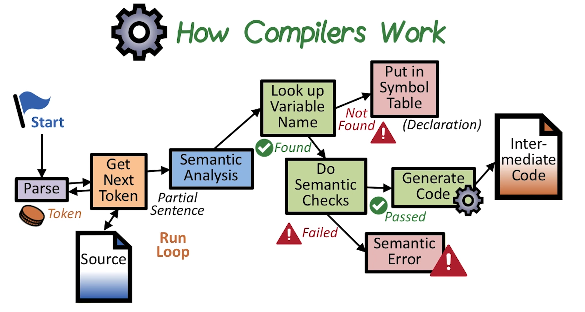
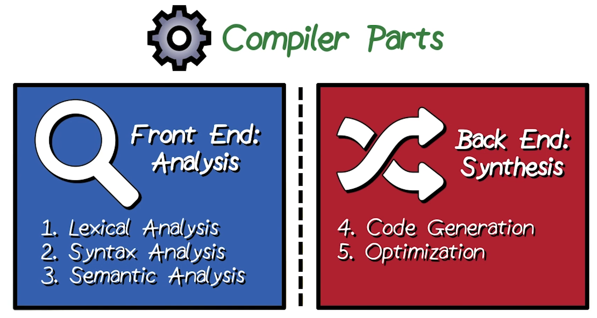
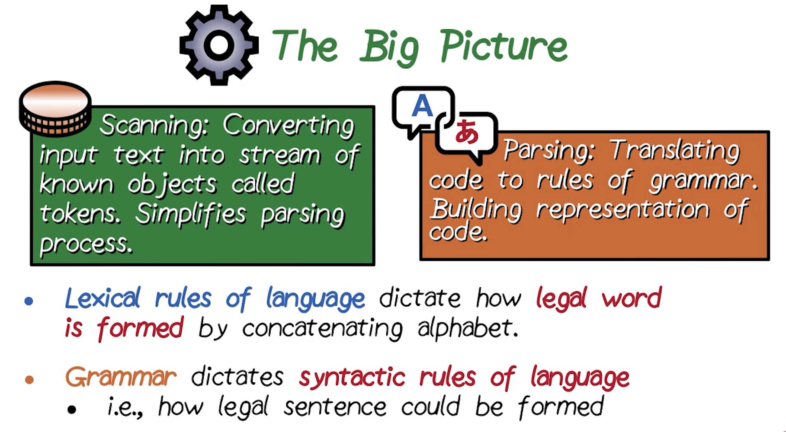
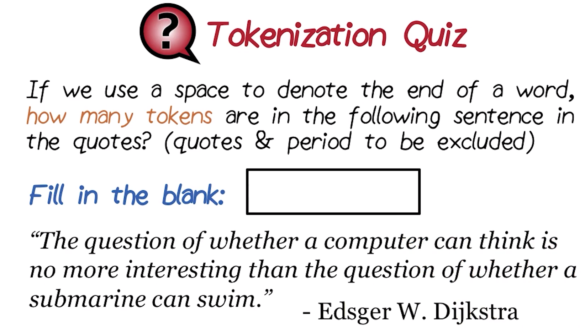
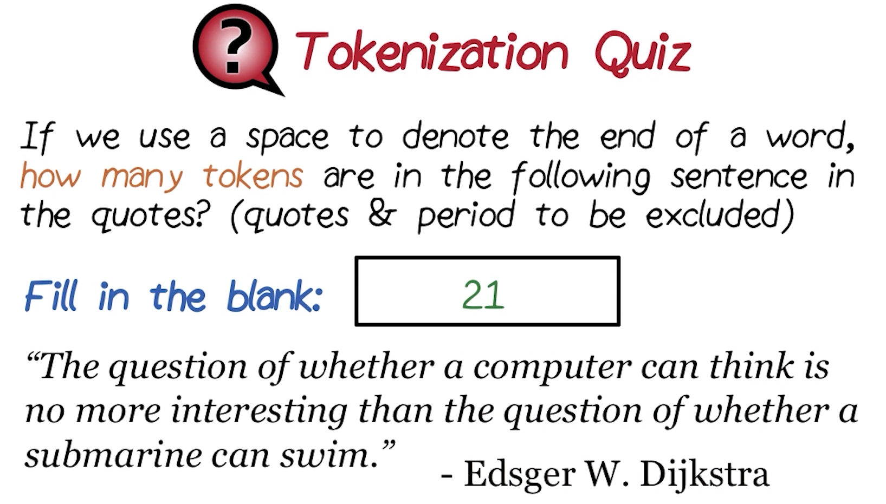
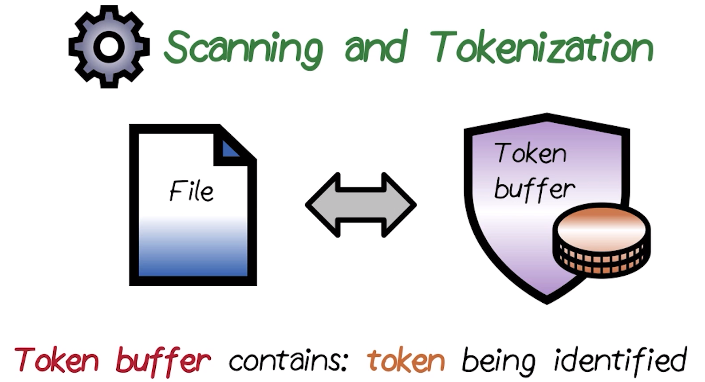
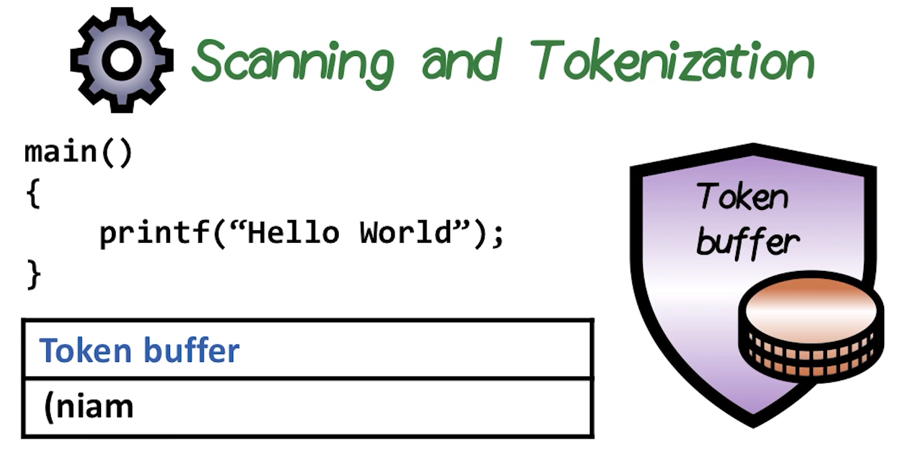
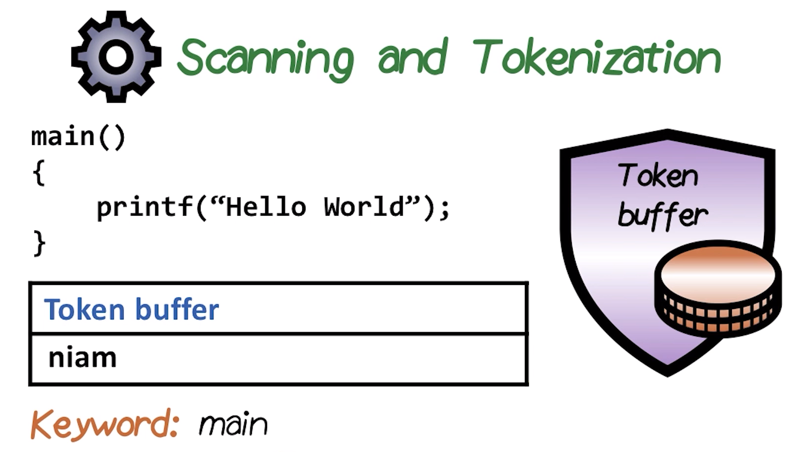
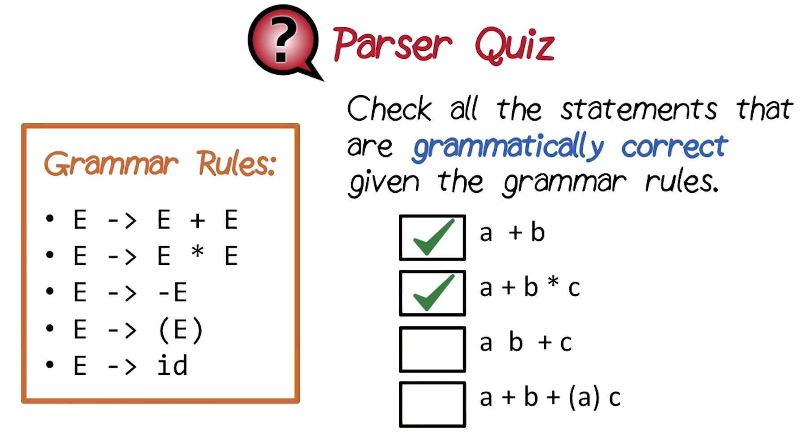

# P1L1: Introduction to Compilers

## 1. Introduction to Course

This course will study **compilers**, which translate from a program written in a high-level source language into a lower-level assembly language.
  * ***N.B.*** This course will ***not*** study a particular high-level-language-to-machine-code translation, but rather the course will focus on the theories and algorithms which can be applied to any language and/or machine.

The course is divided into three sections (corresponding to the constituent ***phases*** of the compilation process), as follows:
  * **front-end** → syntactic and semantic analysis of the source language
  * **middle-end** → the intermediate representation, and the corresponding analysis and optimizations associated with the source-code translation
  * **back-end** (or **code generator**) → generator of the resulting machine code

## 2. Introduction to Compilers

This lesson will examine the overall working of the compiler in terms of its various aforementioned phases (cf. Section 1), and their corresponding interactions. In particular, this section will highlight the following ***concepts***:
  * **tokenization**
  * **parsing**
  * **symbol tables**
  * **semantic analysis**

These concepts will be demonstrated in the context of a simple language and its corresponding processing, based on the language's grammar and its lexical specification.

## 3. What Is a Compiler?

This section explores the central question of the course: What is a compiler?

<center>

</center>

A compiler should be intuitively familiar from previous exposure (e.g., software development, coursework, etc.). However, most likely, this was previously encountered in the context of *developing* software as a *user* of the compiler, but not necessarily with respect to the *internals* of the compiler itself.

As a more formal definition, a **compiler** is a program that ***translates*** a program from a **source language** (written in a high-level language) to a **target language**.
  * Typically, the source language is a higher-level language (e.g., C, C++, Java, Fortran, etc.), whereas the lower-level language is the machine code, which is executed in its binary form directly on the processor itself.

<center>

</center>

A **compiler** takes a **source-file-based program** (which is oftentimes itself spread across *multiple* such source files) and compiles it into an **executable** (as in the figure shown above). The executable is typically a **binary file**, which executes directly on the **processor** (at very fast speed).

<center>

</center>

Additionally, there is another piece of software which is often confused with a compiler: An **interpreter** (as in the figure shown above). An interpreter works in a similar manner, starting with input of a high-level-language **source file(s)**. However, rather than directly translating the instructions into an executable, instead, the interpreter ***interprets*** the source program line-by-line, and then generating the corresponding output (e.g., to the terminal, or equivalent).
  * Observe that in this scheme, there is ***no*** corresponding executable generated, but rather the source file is "directly" interpreted in this manner.
  * There are many such interpreted languages (e.g., Python).

With respect to compilers vs. interpreters, the respective use cases are distinct. In particular, the execution of a compiled program is substantially faster than that of an interpreted program, precisely due to the ***direct*** execution of the executable on the hardware in the case of the former.

In this particular course, the focus will be on compilers.
  * ***N.B.*** Compilers and interpreters share many phases and features, however, this is beyond the scope of this course.

## 4. Why Compilers?

Before commencing with the formal study of compilers, consider some historic artifacts to understand ***why*** compilers came into being in the first place.

<center>

</center>

In the 1950s, the modern notion of "programming of computers" began, which entailed a rather tedious process for writing such source code at a low level, dealing directly at the "bit" level (and still later on arrival of assembly languages, which did not solve this particular problem). This gave rise to a rather tedious and error-prone software development cycle accordingly (i.e., features addition, fixing of bugs, etc.)

<center>

</center>

In 1954, IBM released the first compiler for Fortran (as in the figure shown above), which translated the Fortran source code into lower-level assembly language. This enabled to perform corresponding updates, bug fixes, etc. in the higher-level Fortran language (which provides additionally useful abstractions such as arrays, along with the more human-readable syntax), rather than dealing directly with the lower-level assembly language.

<center>

</center>

The final downstream step from this high-level language to low-level language translation is the conversion of assembly language into the binary machine language (as in the figure shown above), i.e., the constituent bits of the program running directly on the processor. Therefore, the role of the compiler is more specifically situated in the high-level-language-to-assembly-language translation, after which the **assembler** assumes responsibility for the final translation to directly executing binary instructions running on the processor itself.
  * ***N.B.*** By comparison, the role of the assembler is relatively straightforward, as it more or less "directly" translates the bit-format representation of the assembly instructions into the corresponding constituent bits; conversely, the compiler involves the comparatively much more complex task of converting the high-level language to the low-level assembly code, which does not have such a direct/one-to-one correspondence. The latter process is the particular focus of this course.

## 5-6. How Compilers Work
Having discussed the motivation behind the development of compilers previously in this lesson (i.e., enhancement of developer productivity), consider now the compiler **internals**, and how they work at a high level. Subsequently, each **phase** of the compiler will be examined in further detail.

### 5. Overview

<center>

</center>

One of the key phases of a compiler, which initializes when the compiler is invoked, is called the **parser** (as in the figure shown above). The parser requests a **token** to another phase of the compiler, called the **scanner**. The scanner in turn returns this requested token to the parser.
  * In this sequence, the compiler mimics the human process of reading a book (for example), involving the scanning of the book from start to finish. During this process, the mind "groups" the read characters as words. Analogously, in the terminology of the compiler, such "words" are called **tokens**. In this manner, the scanner traverses the source file and groups characters into tokens, which are subsequently fed back to the parser.
  * For example, the token `157.669` is parsed based on its flanking whitespace and corresponding structure, and consequently determines that it is a floating point constant (abbreviated as `FLOATCONST`) having value `157.669`. Both of these pieces of information (the data type and the value) are used internally in distinct ways: Ensuring that the token is a legal word, and that the value can be used later during execution of the program.

<center>

</center>

Next, the process of scanning (which is triggered by the parser) continues for a while, with the parser continuously ensuring that the token is ***syntactically valid*** (i.e., in compliance with valid statements in the language specification, e.g., assignment, control flow, function call, etc.).

Once the parser has analyzed a sufficient amount of tokens input, it must determine whether the resulting statement is syntactically valid. Additionally, the parser must also determine whether the statement is ***semantically valid*** (i.e., meaningful); this latter determination is called the **semantic action** phase. The purpose of the semantic action phase is to ensure that the statement in question is semantically correct.
  * If this determination fails the semantic action, a **semantic error** results (e.g., attempting to use a binary operator with two incompatible types).

Once the statement is determined to be syntactically and semantically correct, the compiler performs the next action, which involves translation of the statement into an **intermediate representation**, which is an internal representation of the statement within the compiler itself (this will be discussed in more detail later in the course). Essentially, at this point, the high-level construct (i.e., statement) is transformed into a form which is closer resembling to that of the target assembly language.

In summary, the compiler performs two key activities:
  * 1 - Perform checking of syntax and semantics via the parser and scanner
  * 2 - Translate the high-level language construct into the intermediate representation

The corresponding three phases of the compiler (scanner, parser, and semantic action) collectively comprise the **front end** of the compiler, which involves analysis of the program's syntax and semantics.
  * ***N.B.*** Many such compiler front ends additionally incur activities/phases which are particular to a given language, and therefore the front end is particularly amenable to customization with respect to the language specification in question.

### 6. Details

Let us further consider the details of the front end, particularly the semantic analysis phase.

<center>

</center>

When the compiler is invoked, this is tantamount to invoking the **parser** (as in the figure shown above). The parser essentially tracks the "location" during the compilation process (i.e., how much of the source code has been traversed up to a given point, what is the next step to perform, what checks should be performed on the program, etc.).

The parser invokes the **scanner** which in turn provides the next **token** (e.g., constants, variables, keywords, etc.) derived from the input **source file**.
  * ***N.B.*** A **keyword** is a reserved word which is used for a specific purpose in the language (and generally invalid as a variable name, etc.).

The interaction of the parser and the scanner occurs ***iteratively***, determining whether the resulting expression is syntactically valid. Eventually, the parser will have processed a ***partial sentence***, which at this point is determined to be syntactically correct.

<center>

</center>

Subsequently to identifying a syntactically-correct expression, the corresponding **semantic analysis** can be performed on it accordingly (as in the figure shown above). Several types of semantic analyses can be performed on such a candidate expression.

One of the key features of the semantic analysis is identification of all **variables** which are present in the program. Along these lines, the compiler determines whether a variable has been ***declared*** prior to its use in the program (along with appropriate type, scope level in the program, etc.). All of this information regarding declared variables is maintained in the compiler's **symbol table**. The compiler in turn looks up the corresponding variable-name information in the symbol table.
  * If the variable is ***found*** in the symbol table (i.e., the declaration was previously present there already), then it performs subsequent semantic checks (e.g., attributes such as type, scope, etc. for the variable in question, as defined in the symbol-table entry).
  * Conversely, if the variables is ***not*** found in the symbol table, then this implies that the variable in question has not yet been declared. In general, there are two types of statements in a high-level programming languages: Declarations and uses. Generally, declarations must occur ***before*** uses. Therefore, when such a statement is encountered during semantic analysis, the corresponding declaration is placed into the symbol table, for subsequent use-oriented statements with respect to the particular input in question.

Finally, once semantic checks have passed (e.g., declarations, type compatibility of operands in operator expressions, etc.), **code generation** can occur, yielding the resulting **intermediate code** (which more closely resembles the target assembly language), for subsequent generation of the assembly code in the next pass of the compiler.
  * At this point, it is still possible for semantic checks to ***fail*** (e.g., type incompatibility, use of a variable without its preceding declaration, an unavailable variable in the given scope, etc.), which results in corresponding **semantic errors**, which are consequently flagged and reported. In such cases of either syntactic or semantic errors, the code generation is simply abandoned, as it is not sensible to proceed with code generation of an otherwise invalid program. In order to resolve these errors, the source program must first be ***corrected*** accordingly before re-processing in this manner via the front end.

## 7. Compiler Parts

The previous sections of this lesson discussed the compiler phases and their interactions (i.e., intermediate checks), resulting in a net conversion from the high-level source code into a lower-level intermediate representation.

<center>

</center>

The compiler is comprised of two key parts: The **front end** and the **back end**.

The **front end** performs the following ***phases***:
  * 1 - **lexical analysis** → scanning activity to identify the valid groupings of tokens in the source code
  * 2 - **syntax analysis** → parsing of statements to verify their correctness
  * 3 - **semantic analysis** → downstream of the lexical and syntax analyses, this is the determination of whether or not the resulting statement is semantically meaningful

The **back end** involves translation/conversion of the intermediate representation (i.e., output of the front end) into the machine-level assembly code. The back end therefore performs the following ***phases***:
  * 4 - **code generation** → converting the intermediate representation into assembly code
  * 5 - **optimization** → as software becomes extremely large and complex, with correspondingly demanding performance, this ensures that the resulting assembly code is very efficient (e.g., fast execution, efficient packing of data segments, etc.)
    * ***N.B.*** The optimization phase is characteristic of most modern compilers. This course will briefly touch on this topic (e.g., handling of registers, and instruction selection), however, it will not be discussed comprehensively.

## 8. The Big Picture

Having seen the parts of the compiler previously in this lesson, consider now the corresponding details.

<center>

</center>

First, there is the **scanning** phase. The principal objective of the **scanner** is to convert the input text into a stream of known objects called **tokens** (or **words**), for subsequent feeding into the **parser**.

Next, in the **parsing** phase (as conducted by the aforementioned parsers), the principal objective is to match the input tokens (from the scanner) according to the defined **rules** in the **grammar** of the language in question (i.e., ensuring ***syntactic correctness*** of the tokens accordingly).
  * The **lexical rules** (or **word lexicon**) of the language (as used by the scanner) dictate how a **legal word** is ***formed*** by concatenating the corresponding constituent **alphabet**.
  * The high-level programming language also defines a **grammar**, which dictates the **syntactic rules** of the language (i.e., how a **legal sentence** is formed in the language).
    * Analogously, the English languages specifies a syntactic rule/convention of subject-verb-object, for example. Similarly, in a typical programming language, an assignment statement has a left-hand operand and a right-hand operand (and perhaps a terminating semicolon).

## 9. Tokenization Quiz and Answers

<center>

</center>

To check understanding of tokenization (or word formation), consider the following. If we use a whitespace character to delimit the end of a word (i.e., the prescribed lexical rule), then how many tokens/words are present in the following quoted sentence (ignoring quotation and period characters)?

> *"The question of whether a computer can think is no more interesting than the question of whether a submarine can swim."*
  *   ***N.B.*** Quote of famed computer scientist Edsger W. Dijkstra.

### ***Answer and Explanation***:

<center>

</center>

There are `21` total tokens in the quoted sentence.
  * ***N.B.*** Here, each (English) word is a "token." The concept is analogous in programming languages, however, of course they do not strictly adhere to the same lexicon as the English language in this regard.

## 10. Scanning and Tokenization

Having seen the high-level view of a compiler previously in this lesson, consider now the process of **scanning** (i.e., **token generation**) in more detail.

<center>

</center>

Starting with one (or more) **source file**(s), the scanner proceeds with reading the input file character-by-character. The read characters are in turn placed sequentially into the **token buffer**, which contains the candidate **token** pending identification.

<center>

</center>

Consider the famous/familiar "hello world" program as follows (as implemented in the C programming language):

```c
main()
{
  printf("Hello World");
}
```

On input of the source file, the token buffer processes the character sequence as follows:

| Sequence | Token buffer contents |
|:--:|:--:|
| `S1` | `m` |
| `S2` | `am` |
| `S3` | `iam` |
| `S4` | `niam` |
| `S5` | `(niam` |

As the sequence proceeds, the scanner commences with identification of a legal token (i.e., via inputs `m`, `a`, `i`, `n`) per the corresponding lexical rules for the programming language C.

<center>

</center>

On encountering the character `(`, the parser determines that there is no valid token of form `m...(` as per the lexical specification for C, suggesting that the parser has now traversed past a legal token.

At this point, the scanner sends the character `(` back from the buffer (i.e., for subsequent identification of the next legal token), and correspondingly identifies the valid/legal token `main`, which is a keyword in the C programming language. In the meantime, this token `main` is completed and send over to the parser for subsequent processing.

In general, observe that during the character-by-character processing into the token buffer, at any given point, the scanner determines whether the in-progress scan is either ***starting*** a new legal token or otherwise ***extending*** a legal token's formation. Eventually, the scanner reaches a point where the subsequently read character cannot further extend a legal token, indicating that the next valid token has been encountered (thereby sending this character back for re-processing of the next valid token). Correspondingly, this process is called the **longest-match algorithm** (i.e., forming the maximum/longest token that is legally formed via concatenation in this manner), and is the most commonly used algorithm for scanners.

## 11. Parser Quiz and Answers

<center>

</center>

Having understood the working of the scanner (cf. Section 10), consider now the following grammar rules for defining a valid expression `E` (where `id` represents a variable name):
  * `E -> E + E` (addition/concatenation)
  * `E -> E * E` (multiplication/joining)
  * `E -> -E` (negation)
  * `E -> (E)` (parenthesization)
  * `E -> id` (defining an identifier)

Here, the rules start from the most-base case of `E -> id` and increase in complexity moving upwards.

Apply these grammar rules to the following candidate expressions, and determine which are valid:
  * `a + b`
    * `CORRECT`
  * `a + b * c`
    * `CORRECT`
  * `a b + c`
    * `INCORRECT`
  * `a + b + (a) c`
    * `INCORRECT`

***N.B.*** This act of applying grammar rules to evaluate the validity of a candidate expression is called **parsing**.

### ***Answer and Explanation***:

<center>

</center>

In `a + b`:
  * `a` and `b` are valid operands for the operator `+` (second rule),
  * `a` and `b` are identifiers (fifth rule),
  * and therefore forms a ***valid*** expression.

In `a + b * c`:
  * `a` and `b * c` are valid operands for the operator `+` (first rule),
  * `b` and `c` are valid operands for the operator `*` (second rule),
  * `a`, `b`, and `c` are identifiers (fifth rule),
  * and therefore forms a ***valid*** expression.

In `a b + c`:
  * `a b` and `c` are valid operands for the operator `+` (first rule),
  * however, `a b` is not a valid expression,
    * ***N.B.*** This is generally true if attempting to match ***any*** of the given grammar rules, as this candidate sub-expression conforms to none of them as specified.
  * and therefore forms an ***invalid*** expression.

In `a + b + (a) c`:
  * By inspection, the sub-expression `(a) c` is not a valid expression, and therefore forms an ***invalid*** expression.
    * ***N.B.*** This analysis was done in an abbreviated manner, however, systematic analysis as for the previous candidate statements will yield a similar conclusion.

***N.B.*** In the case of malformed expression, the corresponding result of parsing is a **syntax error**.

## 12. Parser
