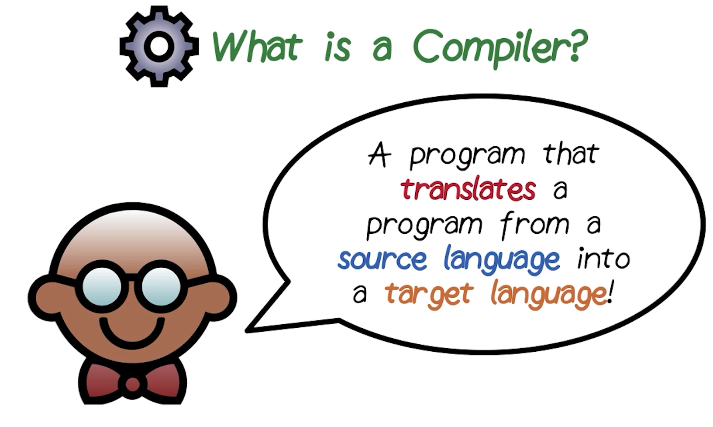
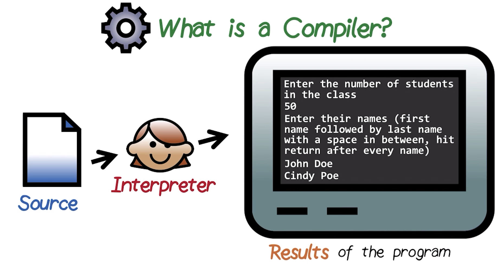
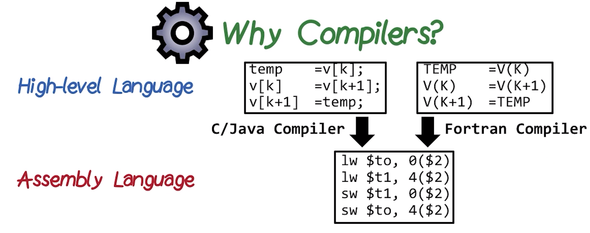
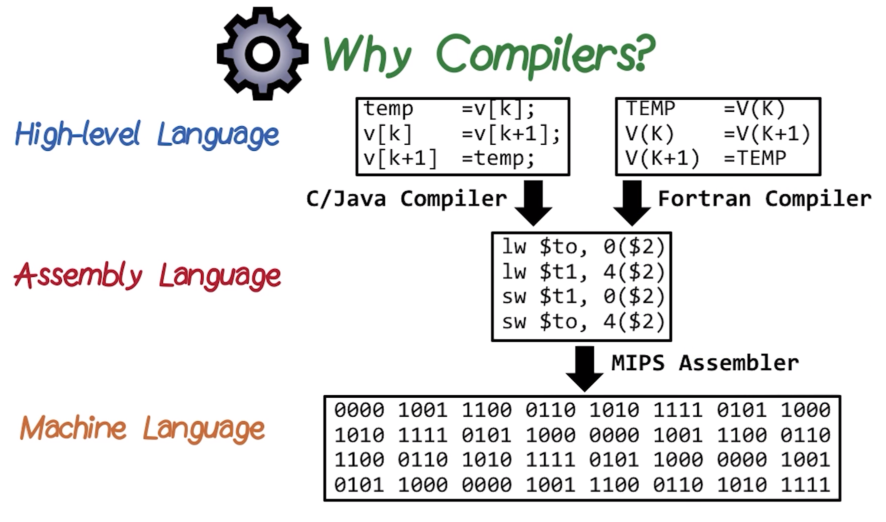
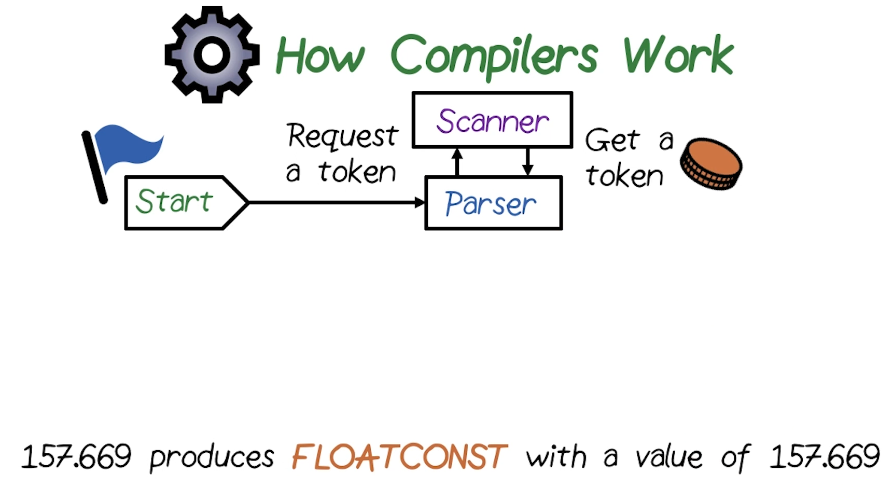
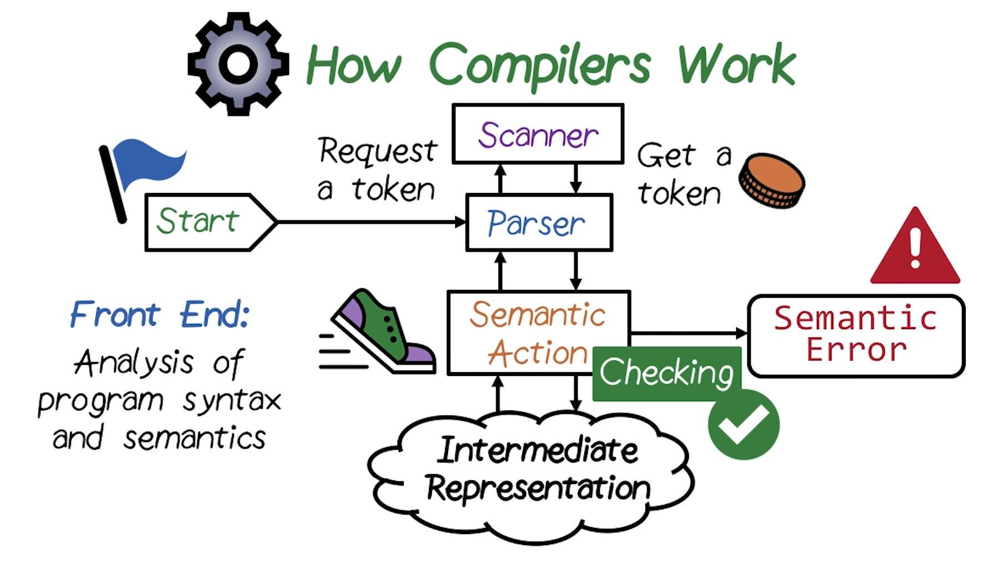

# P1L1: Introduction to Compilers

## 1. Introduction to Course

This course will study **compilers**, which translate from a program written in a high-level source language into a lower-level assembly language.
  * ***N.B.*** This course will ***not*** study a particular high-level-language-to-machine-code translation, but rather the course will focus on the theories and algorithms which can be applied to any language and/or machine.

The course is divided into three sections (corresponding to the constituent ***phases*** of the compilation process), as follows:
  * **front-end** → syntactic and semantic analysis of the source language
  * **middle-end** → the intermediate representation, and the corresponding analysis and optimizations associated with the source-code translation
  * **back-end** (or **code generator**) → generator of the resulting machine code

## 2. Introduction to Compilers

This lesson will examine the overall working of the compiler in terms of its various aforementioned phases (cf. Section 1), and their corresponding interactions. In particular, this section will highlight the following ***concepts***:
  * **tokenization**
  * **parsing**
  * **symbol tables**
  * **semantic analysis**

These concepts will be demonstrated in the context of a simple language and its corresponding processing, based on the language's grammar and its lexical specification.

## 3. What Is a Compiler?

This section explores the central question of the course: What is a compiler?

A compiler should be intuitively familiar from previous exposure (e.g., software development, coursework, etc.). However, most likely, this was previously encountered in the context of *developing* software as a *user* of the compiler, but not necessarily with respect to the *internals* of the compiler itself.

As a more formal definition, a **compiler** is a program that ***translates*** a program from a **source language** (written in a high-level language) to a **target language**.
  * Typically, the source language is a higher-level language (e.g., C, C++, Java, Fortran, etc.), whereas the lower-level language is the machine code, which is executed in its binary form directly on the processor itself.

A **compiler** takes a **source-file-based program** (which is oftentimes itself spread across *multiple* such source files) and compiles it into an **executable** (as in the figure shown above). The executable is typically a **binary file**, which executes directly on the **processor** (at very fast speed).

Additionally, there is another piece of software which is often confused with a compiler: An **interpreter** (as in the figure shown above). An interpreter works in a similar manner, starting with input of a high-level-language **source file(s)**. However, rather than directly translating the instructions into an executable, instead, the interpreter ***interprets*** the source program line-by-line, and then generating the corresponding output (e.g., to the terminal, or equivalent).
  * Observe that in this scheme, there is ***no*** corresponding executable generated, but rather the source file is "directly" interpreted in this manner.
  * There are many such interpreted languages (e.g., Python).

With respect to compilers vs. interpreters, the respective use cases are distinct. In particular, the execution of a compiled program is substantially faster than that of an interpreted program, precisely due to the ***direct*** execution of the executable on the hardware in the case of the former.

In this particular course, the focus will be on compilers.
  * ***N.B.*** Compilers and interpreters share many phases and features, however, this is beyond the scope of this course.

# 4. Why Compilers?

Before commencing with the formal study of compilers, consider some historic artifacts to understand ***why*** compilers came into being in the first place.

In the 1950s, the modern notion of "programming of computers" began, which entailed a rather tedious process for writing such source code at a low level, dealing directly at the "bit" level (and still later on arrival of assembly languages, which did not solve this particular problem). This gave rise to a rather tedious and error-prone software development cycle accordingly (i.e., features addition, fixing of bugs, etc.)

In 1954, IBM released the first compiler for Fortran (as in the figure shown above), which translated the Fortran source code into lower-level assembly language. This enabled to perform corresponding updates, bug fixes, etc. in the higher-level Fortran language (which provides additionally useful abstractions such as arrays, along with the more human-readable syntax), rather than dealing directly with the lower-level assembly language.

The final downstream step from this high-level language to low-level language translation is the conversion of assembly language into the binary machine language (as in the figure shown above), i.e., the constituent bits of the program running directly on the processor. Therefore, the role of the compiler is more specifically situated in the high-level-language-to-assembly-language translation, after which the **assembler** assumes responsibility for the final translation to directly executing binary instructions running on the processor itself.
  * ***N.B.*** By comparison, the role of the assembler is relatively straightforward, as it more or less "directly" translates the bit-format representation of the assembly instructions into the corresponding constituent bits; conversely, the compiler involves the comparatively much more complex task of converting the high-level language to the low-level assembly code, which does not have such a direct/one-to-one correspondence. The latter process is the particular focus of this course.

# 5-6. How Compilers Work
Having discussed the motivation behind the development of compilers previously in this lesson (i.e., enhancement of developer productivity), consider now the compiler **internals**, and how they work at a high level. Subsequently, each **phase** of the compiler will be examined in further detail.

## 5. Overview

One of the key phases of a compiler, which initializes when the compiler is invoked, is called the **parser** (as in the figure shown above). The parser requests a **token** to another phase of the compiler, called the **scanner**. The scanner in turn returns this requested token to the parser.
  * In this sequence, the compiler mimics the human process of reading a book (for example), involving the scanning of the book from start to finish. During this process, the mind "groups" the read characters as words. Analogously, in the terminology of the compiler, such "words" are called **tokens**. In this manner, the scanner traverses the source file and groups characters into tokens, which are subsequently fed back to the parser.
  * For example, the token `157.669` is parsed based on its flanking whitespace and corresponding structure, and consequently determines that it is a floating point constant (abbreviated as `FLOATCONST`) having value `157.669`. Both of these pieces of information (the data type and the value) are used internally in distinct ways: Ensuring that the token is a legal word, and that the value can be used later during execution of the program.

Next, the process of scanning (which is triggered by the parser) continues for a while, with the parser continuously ensuring that the token is ***syntactically valid*** (i.e., in compliance with valid statements in the language specification, e.g., assignment, control flow, function call, etc.).

Once the parser has analyzed a sufficient amount of tokens input, it must determine whether the resulting statement is syntactically valid. Additionally, the parser must also determine whether the statement is ***semantically valid*** (i.e., meaningful); this latter determination is called the **semantic action** phase. The purpose of the semantic action phase is to ensure that the statement in question is semantically correct.
  * If this determination fails the semantic action, a **semantic error** results (e.g., attempting to use a binary operator with two incompatible types).

Once the statement is determined to be syntactically and semantically correct, the compiler performs the next action, which involves translation of the statement into an **intermediate representation**, which is an internal representation of the statement within the compiler itself (this will be discussed in more detail later in the course). Essentially, at this point, the high-level construct (i.e., statement) is transformed into a form which is closer resembling to that of the target assembly language.

In summary, the compiler performs two key activities:
  * 1 - Perform checking of syntax and semantics via the parser and scanner
  * 2 - Translate the high-level language construct into the intermediate representation

The corresponding three phases of the compiler (scanner, parser, and semantic action) collectively comprise the **front end** of the compiler, which involves analysis of the program's syntax and semantics.
  * ***N.B.*** Many such compiler front ends additionally incur activities/phases which are particular to a given language, and therefore the front end is particularly amenable to customization with respect to the language specification in question.

## 6. Details
