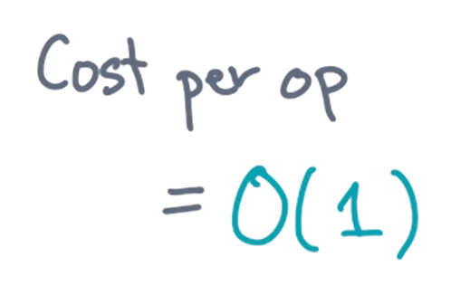
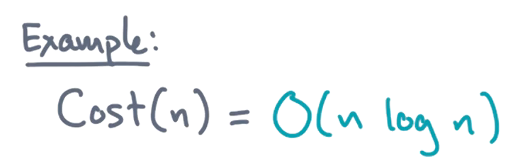
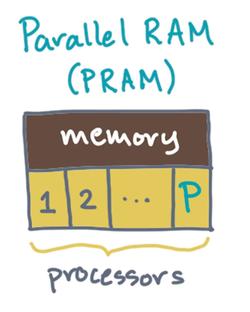
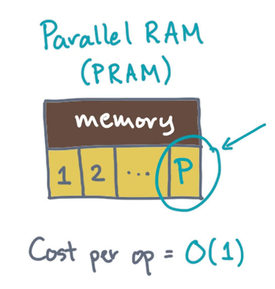
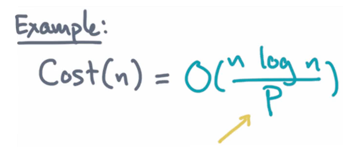
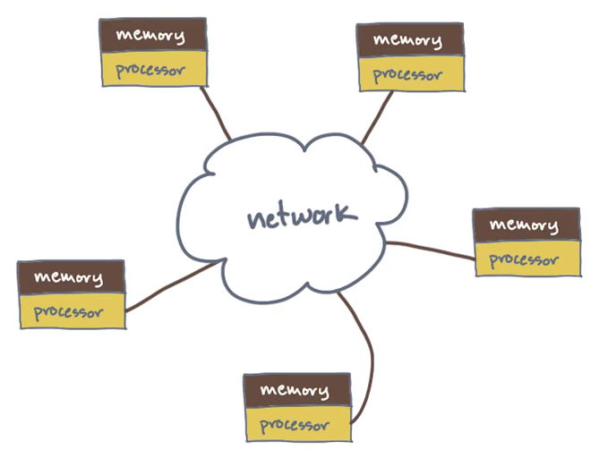
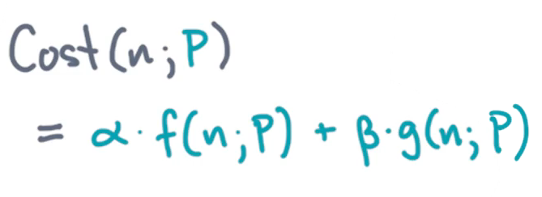
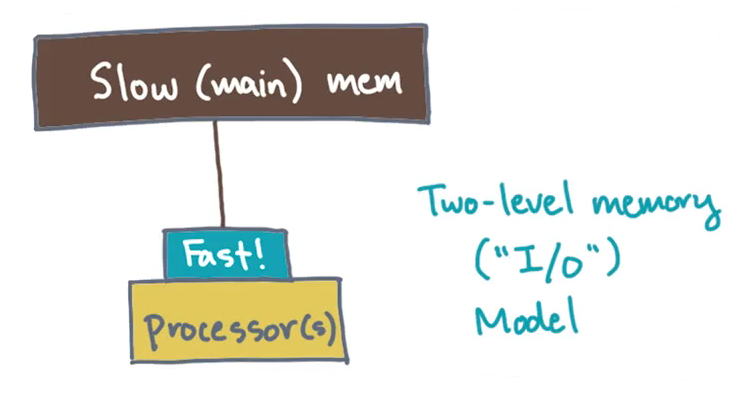
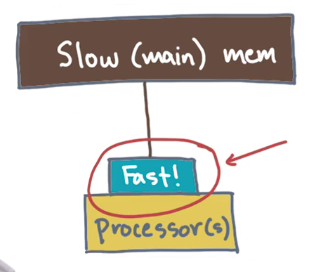

# Introduction

## 1. Philosophy and Logistics

To succeed in this course, reference the following ***resources***:
  * The course readiness survey
    * This is the minimum requirement of mathematics and computer science background necessary for the course
  * The course videos
    * These are intended to facilitate building intuition around the subject matter
    * Furthermore, similarly to other courses, there are quiz videos interspersed within the lessons to reinforce the concepts
  * The course readings
    * While the videos focus on building intuition, the readings provide more elaborate details on the pertinent topics; these details in turn are necessary to succeed in completing the projects and to perform well on the exams
  * The mini-projects
    * Implementing the algorithms (and corresponding engineering trade-offs) will promote better understanding of the course material

## 2. Welcome

This course (CSE 6220, *Introduction to High Performance Computing*) will explore some of the major ***ideas*** regarding extracting parallelism and data locality from algorithms and data structures.

## 3. What Is High Performance Computing (HPC)?

"High performance computing" is not particularly descriptive. A more apt description would be ***supercomputing***, as discussed in the next section.

## 4. Supercomputing in a Nutshell

The "super" in supercomputing entails solving large, complex computational problems as ***efficiently*** as possible.  Such problems include simulating the dynamics of the Earth, studying biomolecular systems, analyzing social networks, understanding the cosmos, among others. These are incredibly complex phenomena, and many scientists believe that no further insight will be gained into these problems without some combination of new mathematical models, leaner algorithms and data structures, more (and more accurate) data, as well as sufficient processing power.

This particular course is focused on ***computer science*** in this context of "supercomputing." Accordingly, the ***main question*** of interest is: Given a computational problem and a corresponding machine to compute it, how can this computation be performed at the absolute ***limits*** of scale and speed?
  * Many such limits will be encountered throughout the course. Some of the more interesting ones originates from physics (e.g., limits based on the speed of light; the amount of energy, power, or heat dissipated by the system; etc.). ***Quantum systems*** represent one of the ultimate limits of such physically constrained computation.

***N.B.*** This course will not discuss quantum computing, however, this is an intriguing starting point in order to foment interest in the topic, particularly beyond the scope of the limits of not only conventional computing systems, but also what lies beyond.

## 5. Topics

### Introduction

The course is organized into three major ***parts***, or ***units***, which reflect three different ***ideas*** about what a computer "looks like." To better understand these parts/units, first recall the relevant material from more introductory computer science coursework.

Recall the machine model called the **sequential (or serial) RAM (random access memory) model**. In this model, there is a single, serially executing processor which is connected to memory.
  * The processor issues **instructions** that operate on **data**.
  * The **operands** of these instructions always live in **memory**.

When analyzing the cost of a serial RAM algorithm, it is ***assumed*** that all instructions have a cost that is bounded by some constant.

From this starting point, a **big O analysis** is performed with respect to the input size $n$ .

So, then, what are the ***alternatives*** to the serial RAM model?

### The Parallel RAM (PRAM) Model

The first such alternative is called the **parallel RAM (PRAM) model** (as in the figure shown above). In this model, rather than *one* processor, there may be *many* (i.e., quantity $P$ of such processors).

All of these processors observe the ***same*** memory, and a bounded constant cost per operation is ***assumed*** (as in the figure shown above). However, here, it is permissible to work with more than one processor at any given time.

Furthermore, since all of the processors see the ***same*** memory, they can coordinate and communicate by modifying **shared variables** accordingly.

In the PRAM models, the ***algorithmic analysis*** involves big O as before, however, there is additionally an attempt to reduce the total cost by up to a factor of $P$ , the number of processors.

A PRAM model is arguably the simplest one available for a shared-user multi-core machine with **uniform memory access (UMA)** (which will be discussed later in this course).

### The Distributed Memory Network Model

Another alternative is the **distributed memory network model** (as in the figure shown above). In this model, there is an interconnected network of RAMs.
  * Each such "network node" is comprised of a single-RAM computer (having a dedicated processor and associated private memory), and no single constituent computer can read or write the memory of any other.
  * Instead, these computers "join" together by connecting to one another over a ***network***. Furthermore, these computers coordinate amongst each other by sending and receiving ***messages*** over this network.

In this model, the analysis will count the number of messages and the total volume of corresponding network communication via these messages.

### Two-Level Input/Output (I/O) Model

The third (and final) alternative considered in this course is the **two-level input/output (I/O) model** (as in the figure shown above). In this model, there are one or more processors connected to a **main memory**.

This model is analogous to the aforementioned serial RAM and parallel RAM (PRAM) models, except here it is assumed that there's at least ***one*** level of **fast memory** sitting between the processors and the comparably slower main memory (as in the figure shown above).

This model forces to consider the following ***question***: How much data needs to move from main memory to the processor via this small, fast intermediate memory as a "scratch space"?
  * ***N.B.*** This basic model relies on concepts such as **caches** and **virtual memory**, which may be familiar from previously. However, even if so, this course will further consider how to design algorithms to exploit this property accordingly.

### Summary

To recap, this course will explore the big ideas in using the aforementioned three machine models, i.e.,:
  * Parallel RAM (PRAM)
  * Distributed Memory Network
  * Two-Level Input/Output (I/O)
