# Basic Model of Locality

## 1. Introduction

Real machines have **memory hierarchies** (as in the figure shown above). This means that in between the **processor** and the primary storage device (e.g., a **disk**), there are ***layers*** of memory in between. As the layer approaches the processor, the layer becomes correspondingly faster but smaller.
  * ***N.B.*** The difference in all of the size, latency, and bandwidth between each successive layer may be an order of magnitude.

Unfortunately, our usual model of an algorithm does ***not*** distinguish between the size and the speed of these different memory layers. Nevertheless, in order to achieve ***high performance***, then it is necessary to correspondingly ***design*** algorithms in such a manner which ***exploits*** this memory hierarchy accordingly.

Sometimes the **hardware** or **operating system** can ***manage*** these memory layers ***automatically***. However, using these memory layers ***optimally*** is nevertheless ***difficult*** to achieve in practice (particularly when using such automated approaches). Therefore, it is necessary to design algorithms appropriately for this purpose; this topic is the starting point of the lesson accordingly.

## 2. A First, Basic Model

### Two-Level Memory Hierarchies

In order to design a **locality-aware algorithm**, a **machine model** is required. Consider a variation on the **von Neumann architecture** (as in the figure shown above).

The von Neumann architecture has a **processor** (as in the figure shown above). The processor performs basic ***compute operations*** (e.g., addition, subtraction, branching, etc.).
  * ***N.B.*** For present purposes, assume that this processor is ***sequential***.

Furthermore, the processor connects to a **main memory** (as in the figure shown above), which is nearly ***infinite*** in its capacity, however, it is very ***slow*** (relative to the processor).

Lastly, between the slow main memory and the processor, there is also a **fast memory** (as in the figure shown above), which is much faster than the main memory, however, it is also much smaller in capacity by comparison.

Let the size of this fast memory be denoted by $Z$ , having measurement units of `words`.

Such **two-level memory hierarchies** may already be familiar from previous exposure. For example, consider the Intel Ivy Bridge multi-core processor (as in the figure shown above). The fast memory is comprised of the **last-level cache (LLC)** (i.e., shared L3 cache), sitting between the slower main memory (not shown in the figure) and the processor itself.

Another example is the Adapteva Parallella board (as in the figure shown above), used for hobby programming. The Parallella has a ***slow***, non-volatile SD card which behaves similarly to a disk, as well as a small amount of ***faster*** main memory (relative to the comparably much slower SD card)

### Rules for the First, Basic Model

There are two ***rules*** about how computations run in this first, basic model.

The **first rule** (the **local data rule**) states that the processor ***cannot*** perform any operations unless the operands are present in the ***fast*** memory.

The **second rule** (the **block transfer rule**) states that when data moves back and forth across the **channel** (denoted by brown double-arrow in the figure shown above) between slow and fast memory, it does so in **chunks** of size $L$ words.

To further understand the second rule, consider the scenario whereby a word is loaded at address $x$ from main memory (as in the figure shown above). Per the block transfer rule, a ***cost*** is incurred in order to move an additional $L - 1$ nearby words.

Furthermore, ***which*** particular words are transferred along with the target word $x$ depends on how the data is correspondingly ***aligned*** in the slow memory.

Therefore, when designing an algorithm for this model, **data alignment** is a key ***issue*** which must be considered. Nevertheless, most real-life memory systems do indeed perform such block transfers, and therefore both multi-level memories ***and*** block transfers are indeed relevant considerations when designing **high-performance algorithms**.

### Costs for the First, Basic Model

Therefore, this first, basic model implies two major **costs** when designing algorithms.

The first cost entails how many **operations** are required by the algorithm, i.e., what is the **computational work** (denoted $W(n)$ ) performed by the processor.
  * ***N.B.*** Just like there is the concept of "work" in the **work-span model** (discussed later in this course) for a parallel machine, the corresponding concept of "work" in this input/output (I/O) model will generally depend on the input size, $n$ .

The second cost entails how many **block transfers** are required by the algorithm (denoted by $Q(n;Z,L)$ , and referred to as the algorithm's **input/output (I/O) complexity**).
  * The number of transfers depends on ***both*** the size of the fast memory ($Z$ ) ***and*** the block transfer size ($L$ ).

### Example: Reduction

Consider a simple example (as in the figure shown above), whereby the elements of an array of size $n$ are summed.

In order to accomplish this, the processor must perform at least $n-1$ addition ***operations***, or asymptotically:

$$
W\left( n \right) \ge \underbrace {\Omega \left( n \right)}_{\scriptstyle n - 1 \atop 
  \scriptstyle {\rm{additions}}}
$$

Furthermore, with respect to ***memory transfers***, intuitively, the data must be traversed at least once. Correspondingly, this suggests the following natural lower bound on the transfers accordingly:

$$
Q\left( {n;Z,L} \right) \ge \underbrace {\left\lceil {{n \over L}} \right\rceil }_{{\rm{transfers}}} = \Omega \left( {{n \over L}} \right)
$$

***N.B.*** The ceiling (i.e., $\left\lceil {{\textstyle{n \over L}}} \right\rceil$ ) accounts for the fact that if $n$ is not a multiple of $L$ , then a partial-transfer cost must be incurred nevertheless.

Observe that there is ***no*** dependence by $Q$ on $Z$ (the size of the fast memory). Since it is only necessary to access each element *once*, the size of the fast memory is irrelevant (i.e., the data is ***not*** reused either way).
  * ***N.B.*** In general, not reusing data is ***undesirable***.

## 3. Two-Level Memories Quiz and Answers

Two-level memories are very ubiquitous. Identify which of the following combinations are valid slow-fast memory pairings. (Select all that apply.)

| Slow Memory | Fast Memory |
|:--:|:--:|
| hard disk | main memory |
| L1 cache | CPU registers |
| tape storage | hard disk |
| remote server RAM | local server RAM |
| the Internet | your brain |
| (other) | (other) |

### ***Answer and Explanation***:

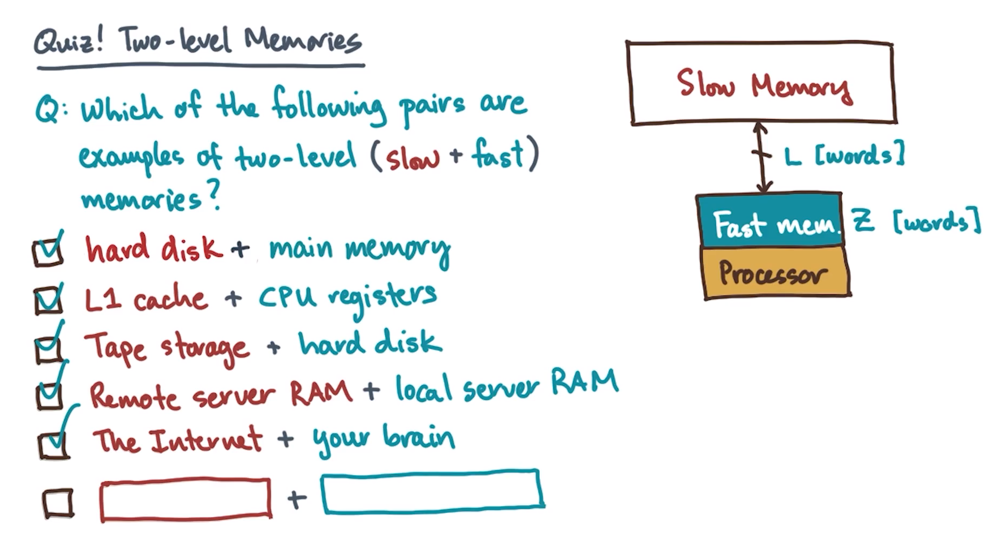

Indeed, all of these are valid slow-fast memory pairings.

## 4. Alignment Quiz and Answers

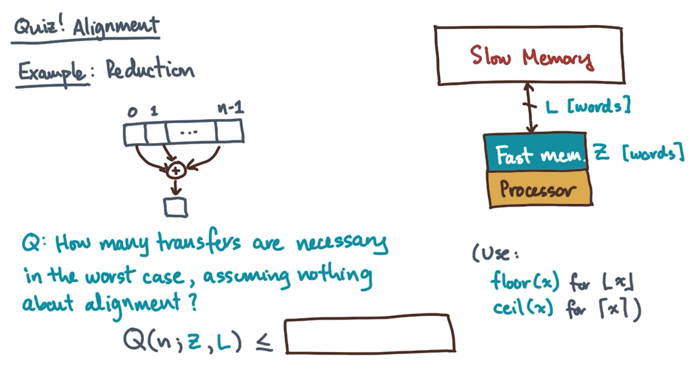

Suppose the elements of an array are summed (as in the figure shown above), without any additional information regarding the array-data alignment with respect to transfer size $L$ . In the ***worst case***, how many transfers are required in order to read the entire array?
  * ***N.B.*** Provide the answer ***exactly***, not asymptotically. Furthermore, if necessary, use floors and/or ceilings.

### ***Answer and Explanation***:

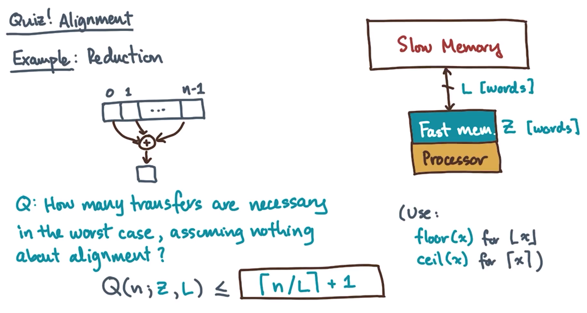

In the worst case, the total number of transfers is given as follows:

$$
Q\left( {n;Z,L} \right) \le \left\lceil {{n \over L}} \right\rceil  + 1
$$

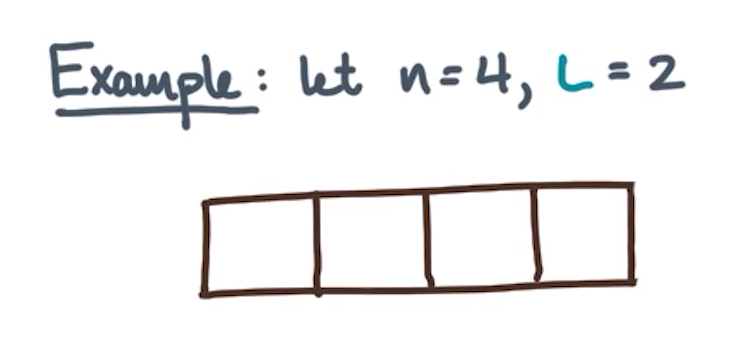

To understand this more concretely, consider the example of $n = 4$ and $L = 2$ (as in the figure shown above). There are two pertinent cases for this example.

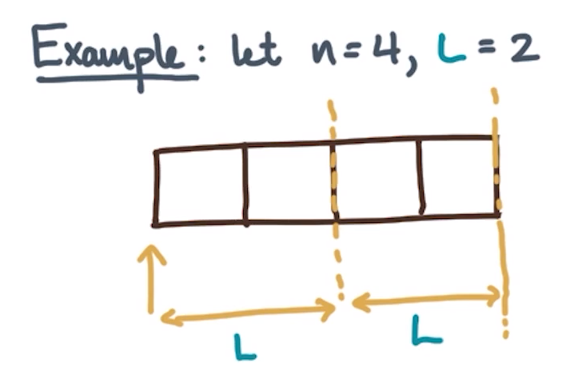

In the first case (as in the figure shown above), the array is ***aligned*** on an $L$-word boundary, thereby requiring ***exactly*** $\left\lceil {{\textstyle{n \over L}}} \right\rceil$ transferred.

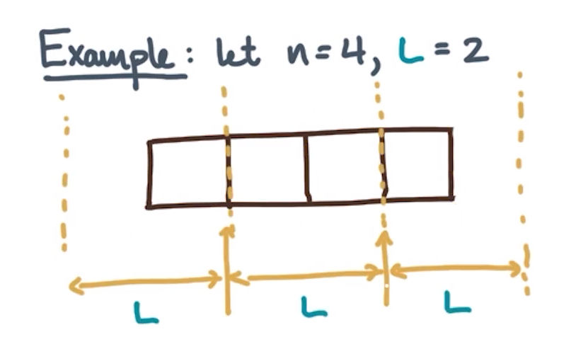

Conversely, in the second case (as in the figure shown above), the array is ***not aligned***, and therefore an ***additional*** transfer is required (i.e., $\left\lceil {{\textstyle{n \over L}}} \right\rceil + 1$ ).

***N.B.*** The purpose of this exercise is simply for awareness of this word-alignment issue; in practice, for purposes of this course, this will be generally regarded as a "minor" detail (which is particularly negligible in the case of $n \gg L$ ).

## 5. Minimum Transfers to Sort Quiz and Answers

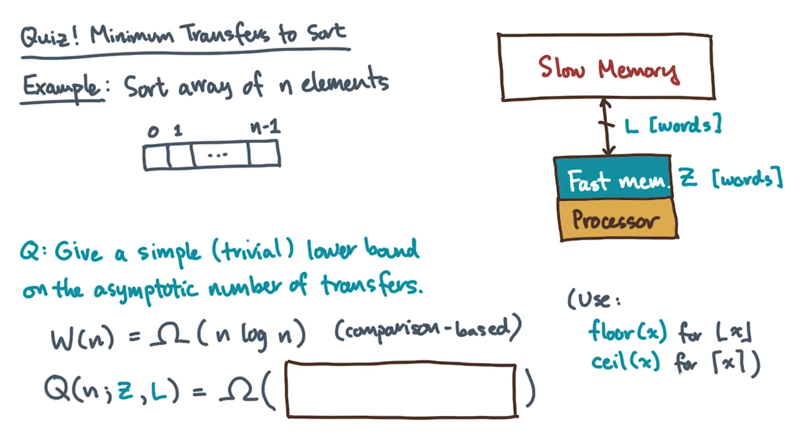

Consider the sorting of an array of $n$ words (as in the figure shown above), using a comparison-based algorithm running on a sequential machine with a two-level memory hierarchy.
  * ***N.B.*** Recall from an introductory algorithms course that such a comparison-based sort requires at least $n\log n$ such comparisons (i.e., $W\left( n \right) = \Omega \left( {n\log n} \right)$ )

What is an asymptotic ***lower bound*** on the number of slow-fast memory transfers (i.e., on $Q(n;Z,L)$ )?
  * ***N.B.*** It is ***not*** necessary for this lower bound to be tight; a trivial bound is sufficient, provided it is reasonably precise. Furthermore, use floor and/or ceiling as/if necessary.

### ***Answer and Explanation***:

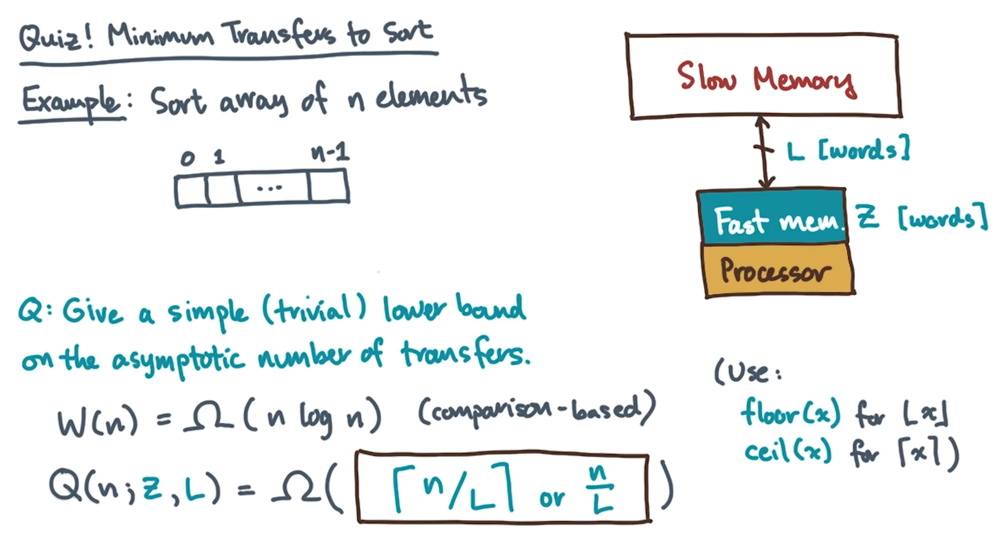

In this case, the trivial lower-bound solution is simply reading the array, i.e.,:

$$
Q\left( {n;Z,L} \right) = \Omega \left( {\left\lceil {{n \over L}} \right\rceil } \right)
$$

or

$$
Q\left( {n;Z,L} \right) = \Omega \left( {{n \over L}} \right)
$$

Here, $n$ indicates that it is necessary to access each word at least *once*. Furthermore, a division by $L$ implies the best-case scenario of reading each element sequentially one block at a time. Lastly, the ceiling accounts for the possibility that $L$ does not divide $n$ (however, its omissions here is sufficiently "loose"/"imprecise").

Additionally, note the following alternative lower bound:

$$
Q\left( {n;Z,L} \right) = \Omega \left( {{{{\textstyle{n \over L}}\log {\textstyle{n \over L}}} \over {\log {\textstyle{Z \over L}}}}} \right)
$$

This will be discussed later in the course.

## 6. Minimum Transfers to Multiply Matrices Quiz and Answers

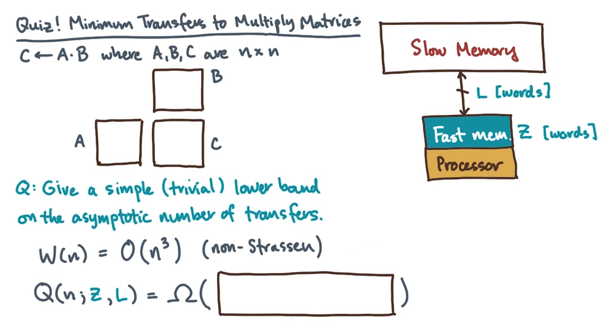

Consider a matrix-matrix multiplication performed on a machine with a two-level memory hierarchy (as in the figure shown above). Furthermore, assume that the constituent matrices $A$ and $B$ are $n \times n$ square matrices.

Ignoring the possibility of a Strassen (or faster) algorithm, then the work of the matrix multiplication is as follows:

$$
W\left( n \right) = O\left( {{n^3}} \right)
$$

In this case, what is the minimum number of transfers (i.e., $Q\left( {n;Z,L} \right)$ )? (Provide an asymptotic lower bound, which is sufficiently/reasonably "tight.")

### ***Answer and Explanation***:

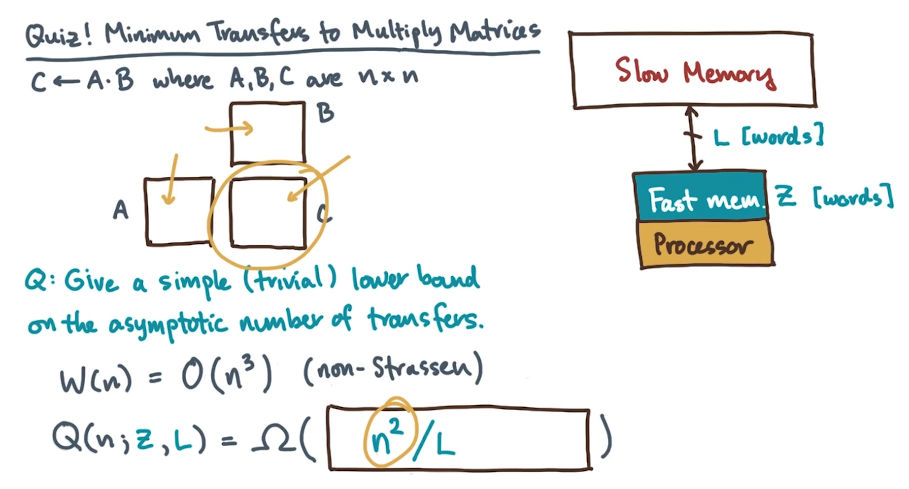

In this case, the trivial lower-bound solution is:

$$
Q\left( {n;Z,L} \right) = \Omega \left( {{{{n^2}} \over L}} \right)
$$

Here, $n^2$ counts the number of matrix elements, and dividing by $L$ converts $n^2$ into some number of transfers.

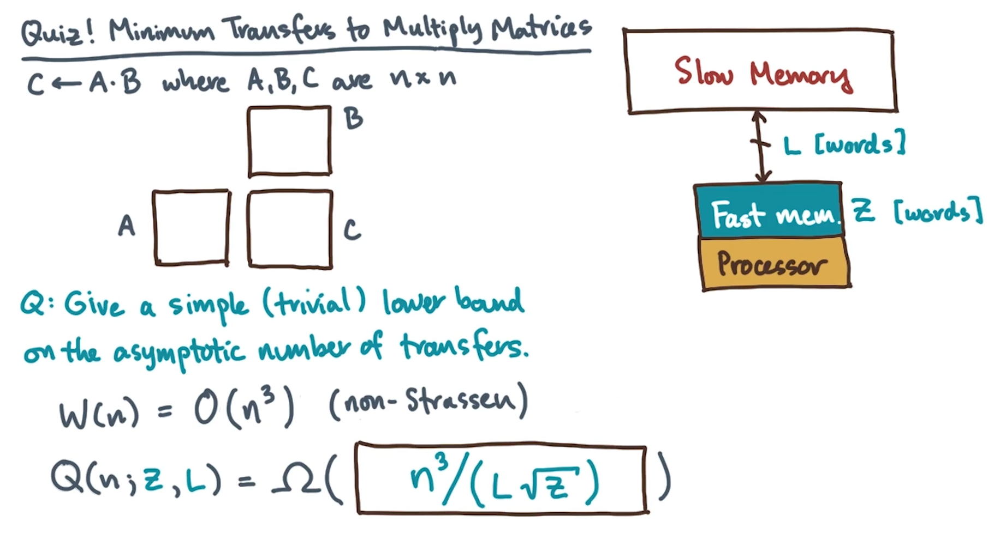

Additionally, a *tighter* lower bound can be specified as follows:

$$
Q\left( {n;Z,L} \right) = \Omega \left( {{{{n^3}} \over {L\sqrt Z }}} \right)
$$

This will be discussed later in the course.

## 7. I/O Example: Reduction

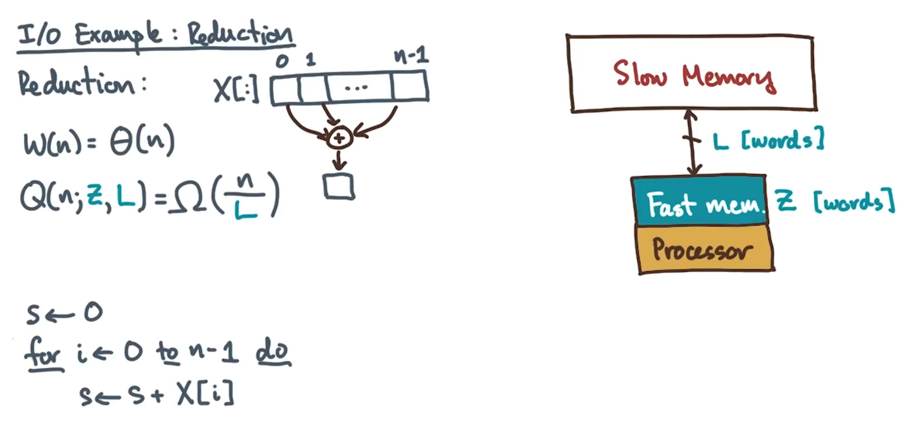

Recall (cf. Section 2) that in the reduction example, the work is linear, i.e.,:

$$
W\left( n \right) = O\left( n \right)
$$

Furthermore, the lower bound on the number of transfers is:

$$
Q\left( {n;Z,L} \right) = \Omega \left( {{n \over L}} \right)
$$

### Sequential Algorithm

Now, consider analysis of a concrete ***algorithm*** in order to determine whether or not such a lower bound can be achieved. The algorithm in question is as follows:

$$
\boxed{
\begin{array}{l}
s \leftarrow 0\\
{\rm{for\ }}i \leftarrow 0{\rm{\ to \ }}n - 1{\rm{\ do}}\\
\ \ \ \ s \leftarrow s + X[i]
\end{array}
}
$$

This algorithm is consistent with the conventional sequential RAM model (i.e., one ***without*** the fast memory). The accumulator $s$ maintains the value, and each array element is iterated over and summed accordingly.

### Algorithm for the Two-Level Memory Model

A ***modification*** of this procedure is necessary in order to consider the ***movement*** of data between the slow and fast memories.

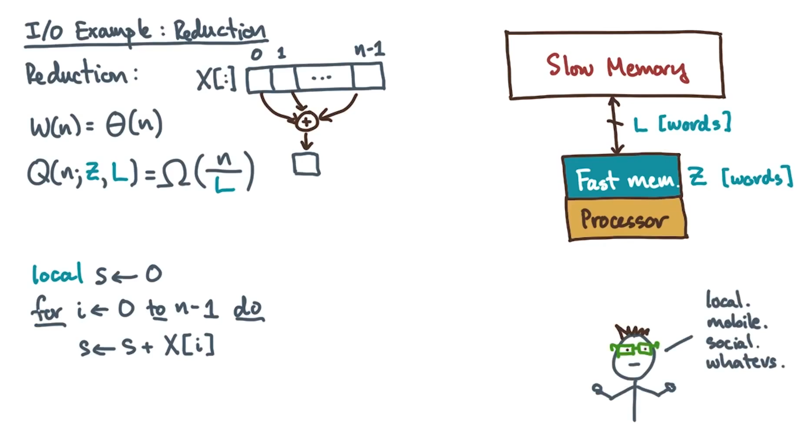

With respect to $s$ , it can be assumed that it is initialized locally (as in the figure shown above), in the fast memory, as denoted by keyword $\rm{local}$ . This is fundamentally the same as any other temporary scalar or local variable in a typical imperative programming language.
  * ***N.B.*** This distinction is made in the pseudocode here for clarify, however, typically this is not a detail "of particular interest."

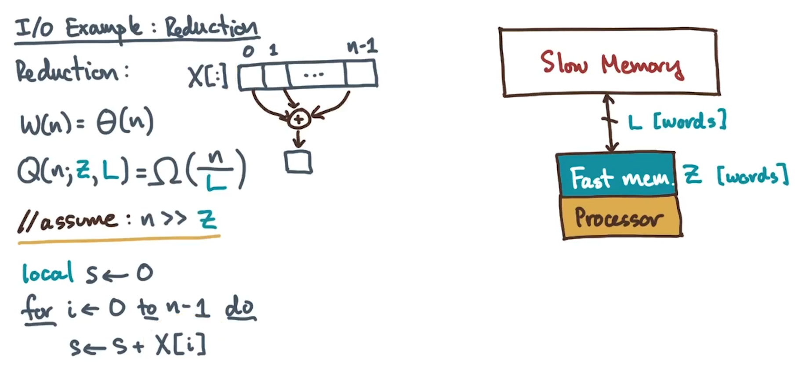

With respect to the array $X$ , ***assume*** that $n \gg Z$ .

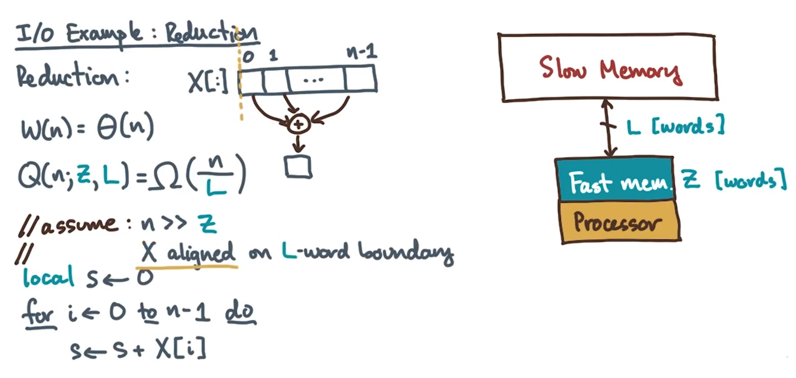

Furthermore, also with respect to the array $X$ , ***assume*** that it is aligned on an $L$-word boundary.

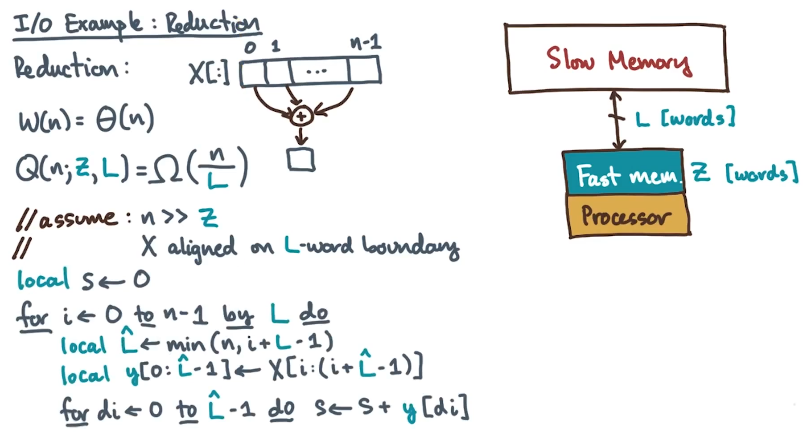

Given these assumptions, the explicit slow-fast transfer operations yield the following modified pseudocode:

$$
\boxed{
\begin{array}{l}
{\rm{local\ }}s \leftarrow 0\\
{\rm{for\ }}i \leftarrow 0{\rm{\ to \ }}n - 1{\rm{\ by \ }}L{\rm{\ do}}\\
\ \ \ \ {\rm{local\ }}\hat L \leftarrow \min \left( {n,i + L - 1} \right)\\
\ \ \ \ {\rm{local\ }}y\left[ {0:\hat L - 1} \right] \leftarrow X\left[ {i:\left( {i + \hat L - 1} \right)} \right]\\
\ \ \ \ {\rm{for\ }}di \leftarrow 0{\rm{\ to\ }}\hat L - 1{\rm{\ do}}\\
\ \ \ \ \ \ \ \ s \leftarrow s + y[di]
\end{array}
}
$$

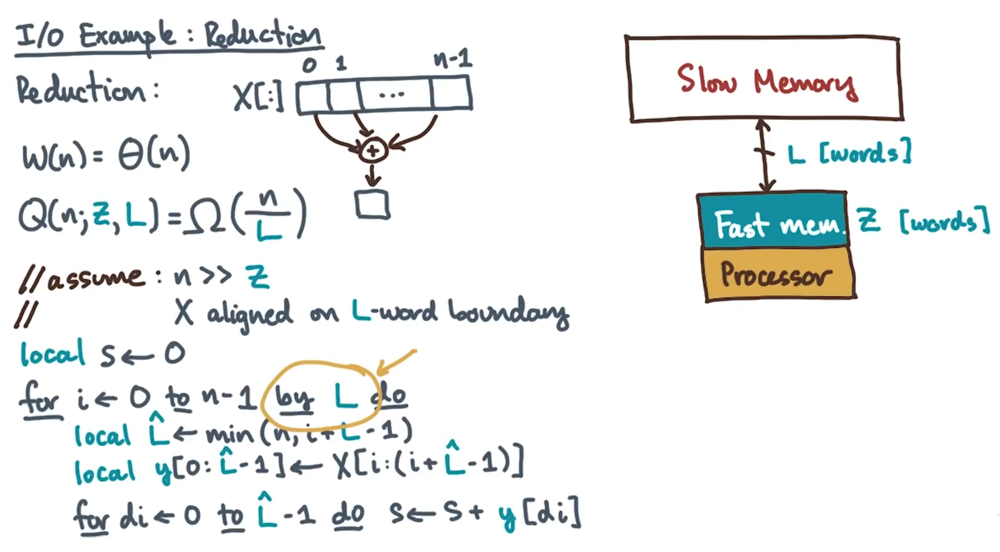

In the outer loop, as in the original algorithm, there is iteration over the array's elements, however, it does so by steps of $L$-sized blocks per iteration.

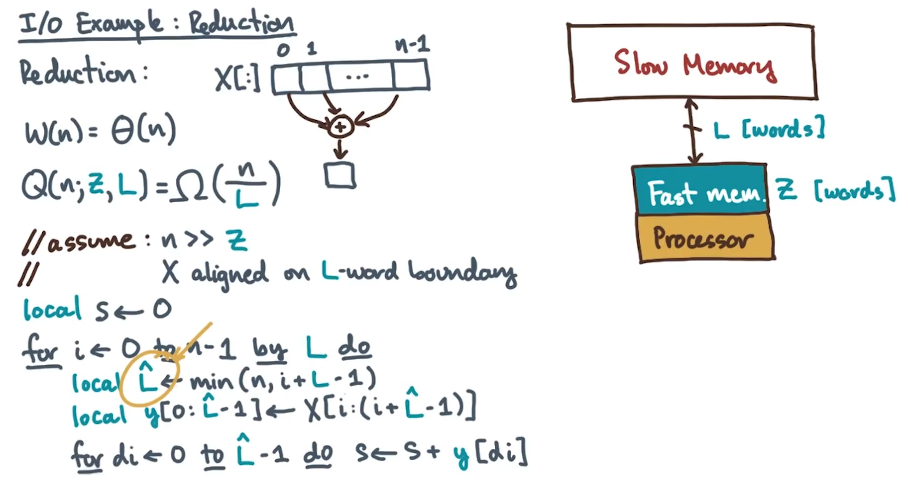

The computation $\hat L$ determines whether the block that starts at position $i$ is of length $L$ , or otherwise smaller than this.
  * ***N.B.*** This is a relatively "fine" detail, which will otherwise be generally ignored subsequently in the course.

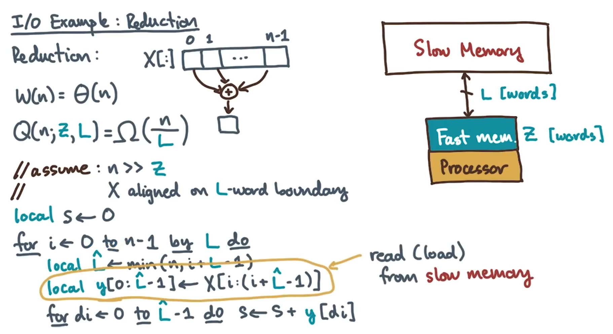

The assignment to $y$ is an ***explicit*** load or read operation, from slow memory to fast memory. Such a request occurs with respect to at most $L$ words, corresponding to ***one*** block transfer.

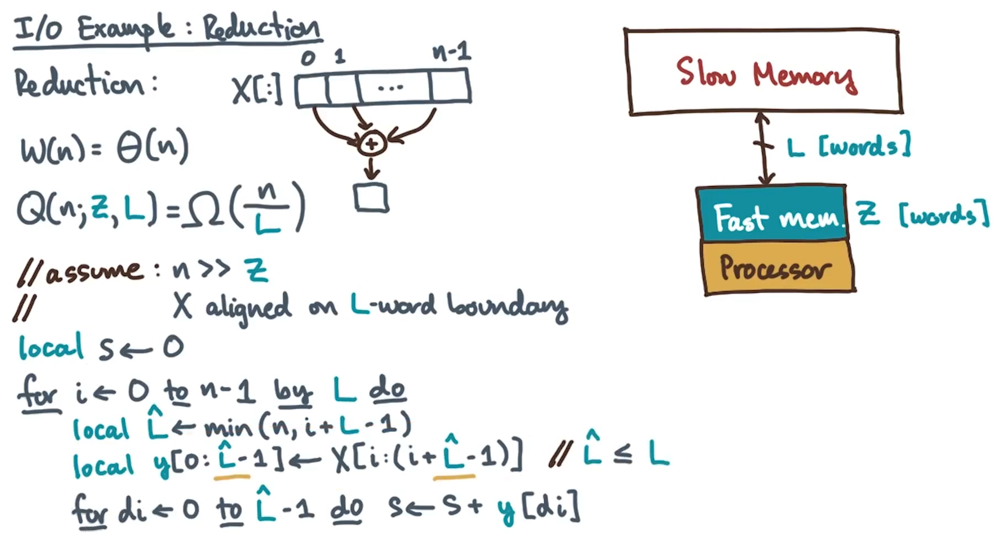

Since $y$ and $s$ are both ***local*** to the fast memory, the ***processor*** itself can execute the innermost loop.

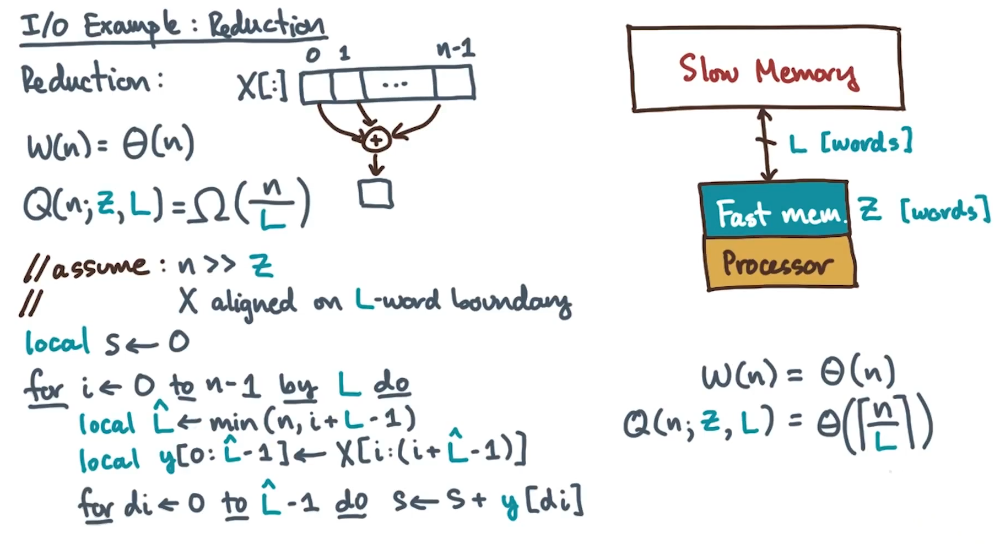

So, then, what is the work and number of transfer steps for this modified algorithm?

The work is the same as in the conventional algorithm using the RAM model, i.e.,:

$$
W\left( n \right) = \Theta \left( n \right)
$$

And the number of transfer steps is:

$$
Q\left( {n;Z,L} \right) = \Theta \left( {\left\lceil {{n \over L}} \right\rceil } \right)
$$

This follows naturally from the structure of the modified algorithm/pseudocode itself.

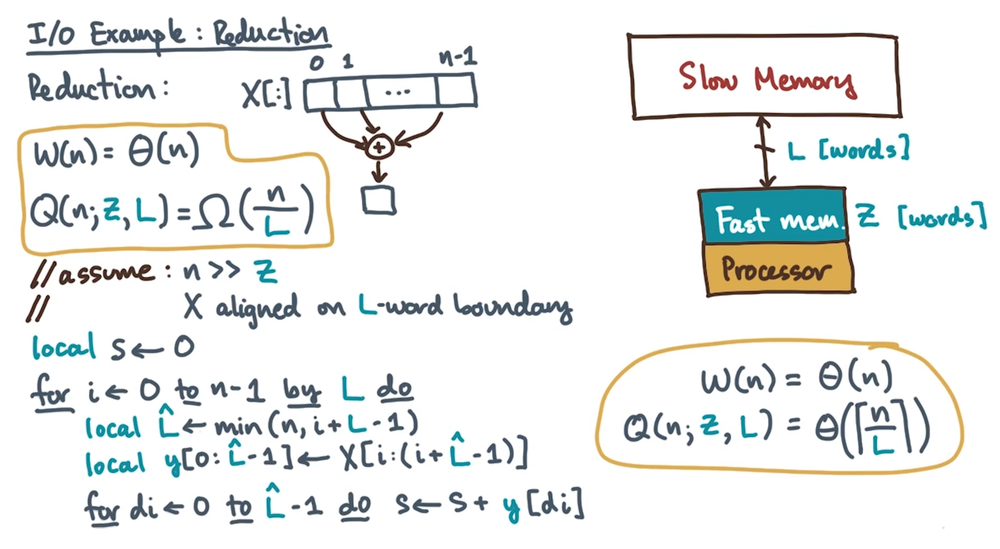

Indeed, these results agree with the lower bounds of the sequential RAM model.

### Additional Remarks

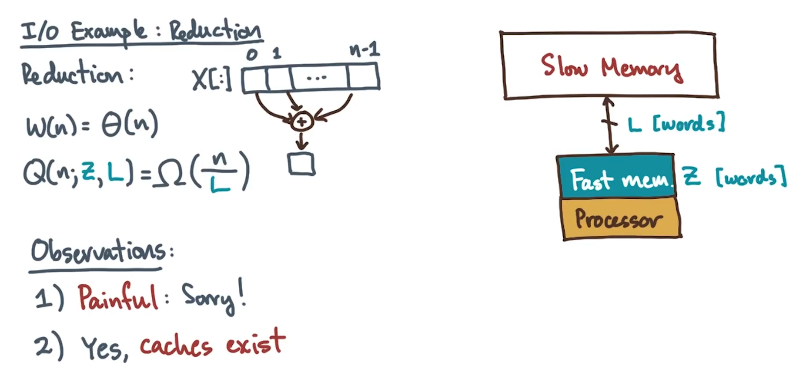

Note the following ***remarks*** with respect to the aforementioned analysis:
  * Much of the detail was provided ***meticulously***; in general, subsequent analysis will use appropriate ***simplifications*** as necessary and as warranted
  * ***Caches*** do indeed exist (and are otherwise generally managed "automatically" by the hardware), however, despite their utility in these scenarios, eventually, we will see that caches are ***not*** sufficient to guarantee ***high performance in general***
    * For this reason, locality is ***explicitly*** described in this lesson accordingly.

***N.B.*** Course CS 6290 (High Performance Computer Architecture) further describes caches in detail.

## 8. Matrix-Vector Multiply Quiz and Answers

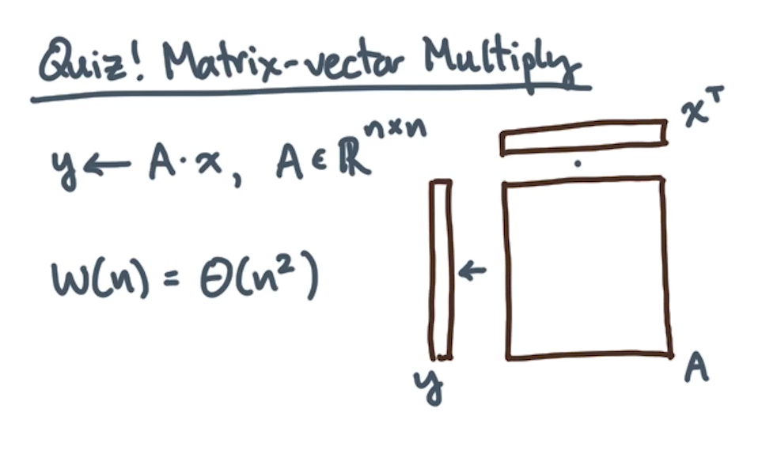

Consider the multiplication of a ***dense*** $n \times n$ matrix by a vector $x$ . Recall (cf. Section 6) that the work (ignoring any structure in matrix $A$ ) is proportional to $n^2$ , i.e.,:

$$
W\left( n \right) = O\left( {{n^2}} \right)
$$

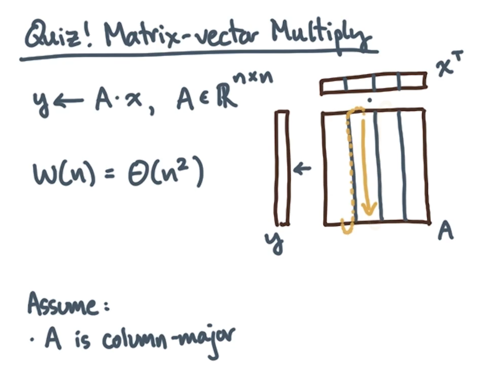

Now, suppose that the matrix is stored in **column-major order** (as in the figure shown above), whereby the elements are laid out in memory column-wise, i.e., elements have consecutive addresses within a given column, and then "wraparound" to the adjacent column, and so on.

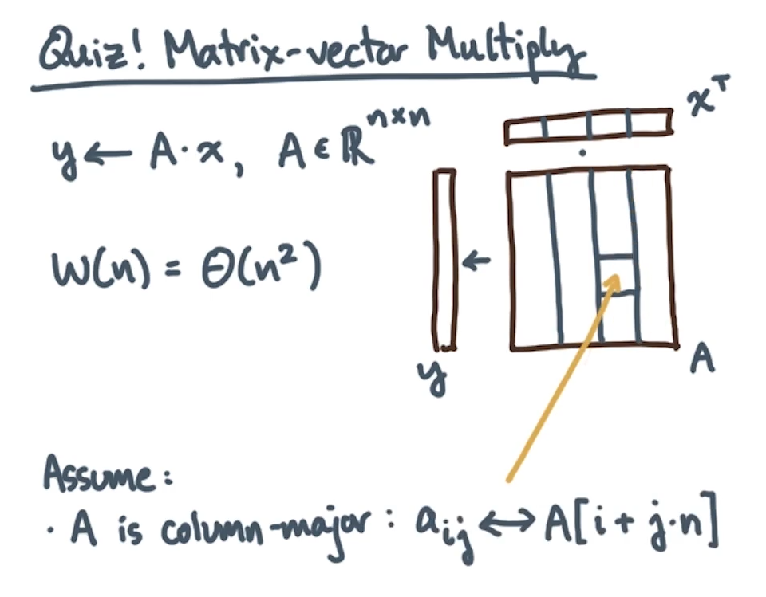

In other words, viewing matrix $A$ as a one-dimensional array, element $a_{ij}$ is ***indexed*** as:

$$
{a_{ij}} \leftrightarrow A\left[ {i + j \cdot n} \right]
$$

Now, consider two algorithms to compute the matrix-vector product.

**Algorithm 1** indexes rows by $i$ and columns by $j$ , as follows:

$$
\boxed{
\begin{array}{l}
{\rm{for\ }}i \leftarrow 0{\rm{\ to\ }}n - 1{\rm{\ do}}\\
\ \ \ \ {\rm{for\ }}j \leftarrow 0{\rm{\ to\ }}n - 1{\rm{\ do}}\\
\ \ \ \ \ \ \ \ y\left[ i \right] += A[i,j] \cdot x[j]
\end{array}
}
$$

Here, the outer loop iterates over rows, and the inner loop iterates over columns.

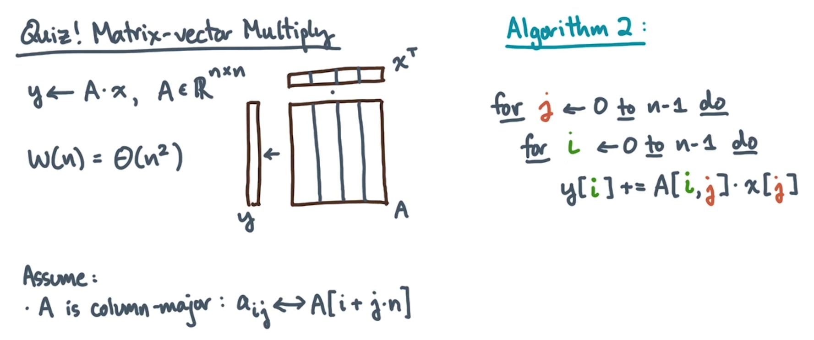

**Algorithm 2** indexes rows by $i$ and columns by $j$ (i.e., the opposite of Algorithm 1), as follows:

$$
\boxed{
\begin{array}{l}
{\rm{for\ }}j \leftarrow 0{\rm{\ to\ }}n - 1{\rm{\ do}}\\
\ \ \ \ {\rm{for\ }}i \leftarrow 0{\rm{\ to\ }}n - 1{\rm{\ do}}\\
\ \ \ \ \ \ \ \ y\left[ i \right] += A[i,j] \cdot x[j]
\end{array}
}
$$

Here, the outer loop iterates over columns, and the inner loop iterates over rows.

In the basic RAM model, both algorithms are identical. Conversely, in the I/O model, which of these performs ***fewer*** transfers?

To assist with answering this question, consider the following additional simplifying ***assumptions***:
  * The fast memory is sufficiently large to hold two vectors and any additional/extra $L$-sized blocks, i.e., $Z = 2n + O\left( L \right)$
  * $L$ divides $n$ (i.e., $L|n$ )
  * All arrays and the matrix (i.e., $x$ , $y$ , and $A$ ) are aligned on $L$-word boundaries

***N.B.*** The last two assumptions avoid the data-alignment issues encountered previously in this lesson, thereby allowing to ignore floors and ceilings accordingly.

As an additional ***hint***, from these simplifying assumptions, it is also valid to assume that the algorithm ***preloads*** $x$ and $y$ to fast memory at the very beginning, and then stores $y$ back to slow memory at the very end. This in turn implies that the number of transfers will be at least ${3n} \over L$ , i.e.,:

$$
Q\left( {n;Z,L} \right) = {{3n} \over L} + ???
$$

This begs the question: How many ***total*** transfers will occur?

### ***Answer and Explanation***:

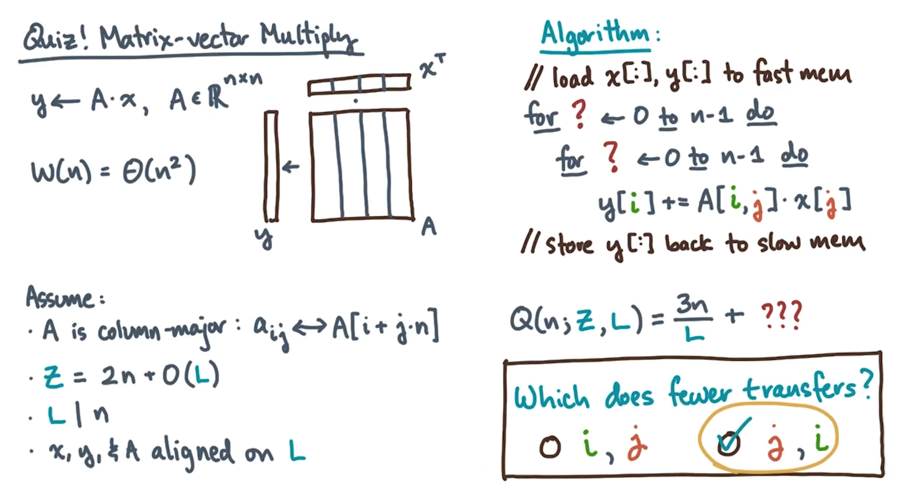

**Algorithm 2** requires ***fewer*** transfers.

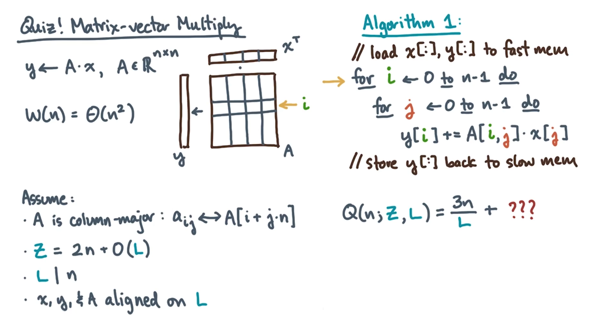

In Algorithm 1, the outer loop iterates over rows (as in the figure shown above).

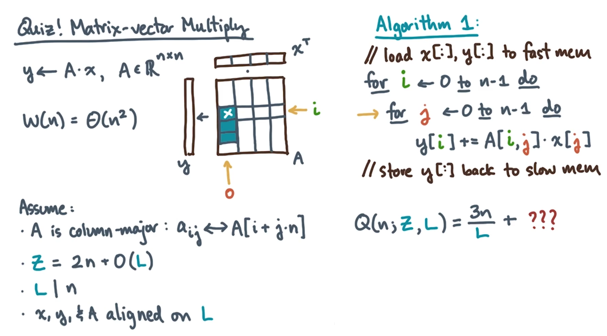

Within row $i$ , it loops over columns $j$ , starting at $0$ (as in the figure shown above). Accessing an element $x$ of row $0$ causes a block of $L - 1$ additional elements from the column to be loaded into fast memory, a direct consequence of the column-major layout.
  * ***N.B.*** In the figure shown above, this shows a representative fast-memory access pattern (as shaded in teal), however, it may not be this specific block in general.

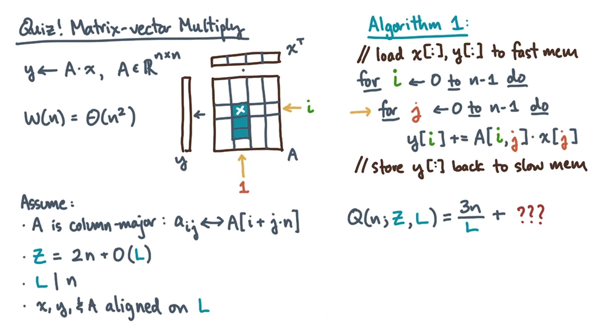

In the subsequent iteration, a completely ***different*** block of elements must be loaded (as in the figure shown above).
  * ***N.B.*** Recall that the fast memory is assumed to only have sufficient space for two vectors plus an additional "extra," however, eventually the previous block (i.e., from iteration $0$ ) must be displaced.

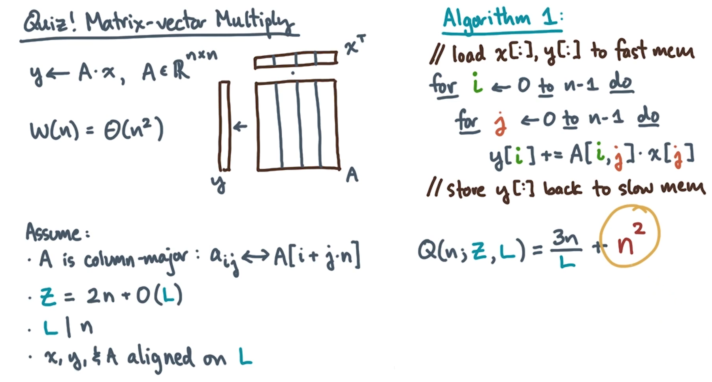

Therefore, traversing this column-major matrix row-wise in this manner incurs block transfers for ***each*** row. Consequently, this yields the following total number of transfers (via $n^2$ required to read $A$ ):

$$
Q\left( {n;Z,L} \right) = {{3n} \over L} + {n^2}
$$

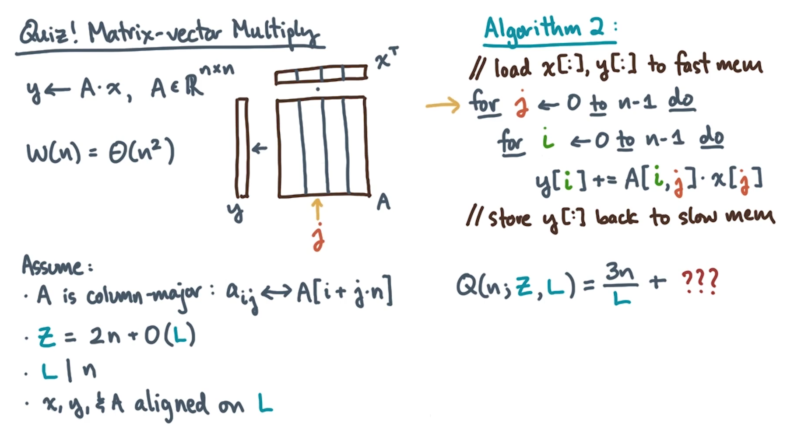

Conversely, in Algorithm 2, the outer loop iterates over columns (as in the figure shown above).

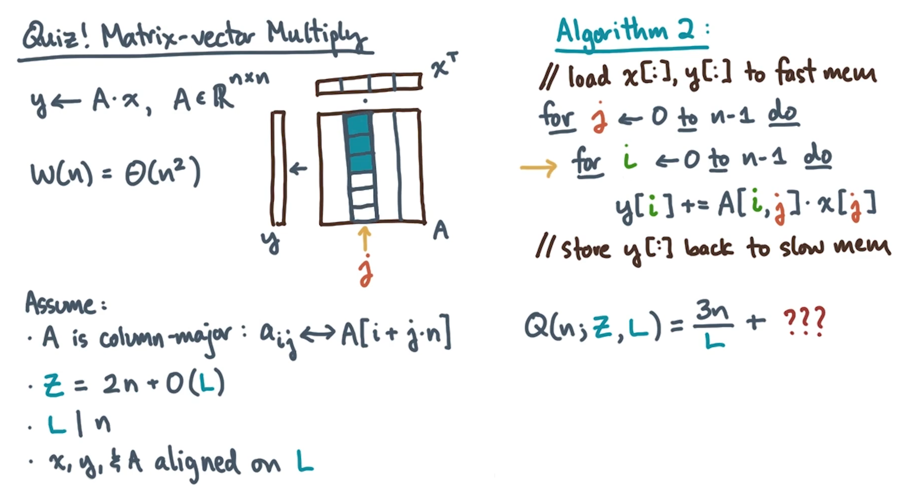

The inner loop traverses within a given column (as in the figure shown above).

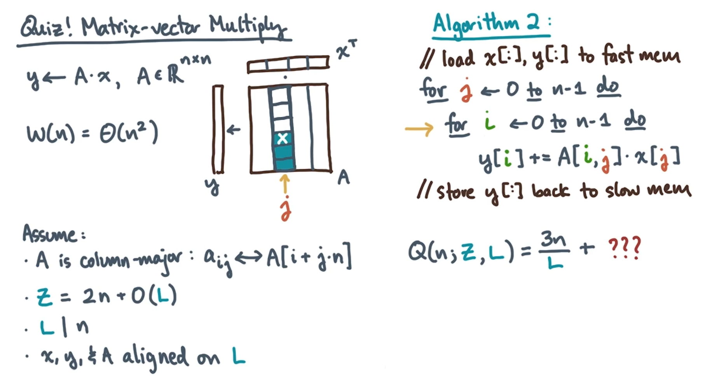

In this case (i.e., Algorithm 2), the traversal order ***matches*** the storage format, i.e., this access pattern more optimally ***amortizes*** the cost of loading the blocks.

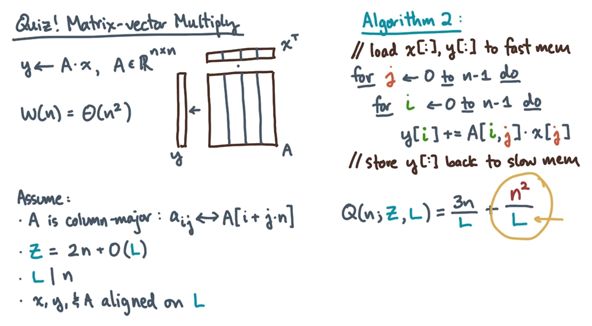

Consequently, this yields the following total number of transfers:

$$
Q\left( {n;Z,L} \right) = {{3n} \over L} + {{{n^2}} \over L}
$$

Therefore, for large values of $n$ , it is expected that Algorithm 1 will perform $L$ more transfers in general, thereby implying a faster operation by Algorithm 2 accordingly (i.e., $L$ times faster than Algorithm 1).

The ***important*** point here is that in the sequential RAM model, these algorithms appear "identically" to each other, whereas in the simple two-level model with block transfers, they are distinctly ***different***.

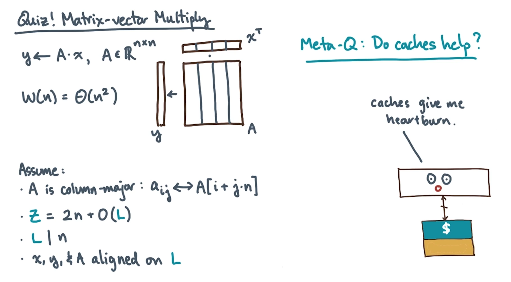

As a final remark, suppose that the fast memory is a ***fully associative cache*** with capacity $Z$ words and a line size $L$ (also in words). In this case, would caches *alone* assist Algorithm 1 to match the performance of Algorithm 2 (i.e., with respect to reducing the number of transfers)?
  * ***N.B.*** This is left as an additional exercise for the student/reader.

## 9. Algorithm Design Goals

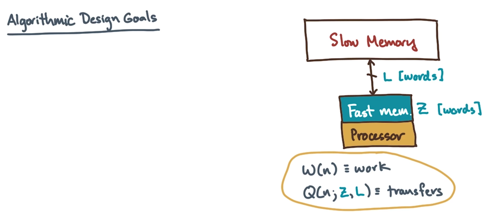

An ***important question*** regarding the two-level memory model is: What are the ***design goals***? That is, with respect to the complexity measures for work ($W\left( n \right)$ ) and transfers ($Q \left( {n;Z,L} \right)$ ), what makes an algorithm "good"?

The goals to achieve this is actually rather ***simple***.

### First Goal

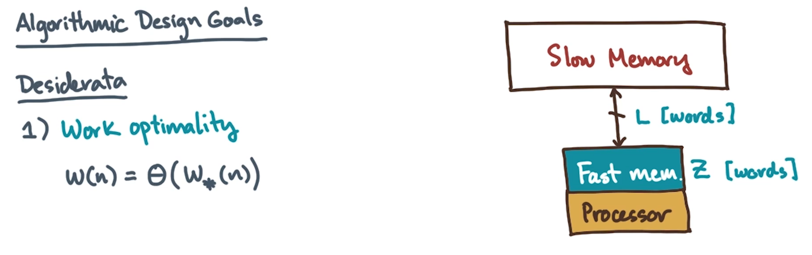

The ***first goal*** is **work optimality**, i.e., the two-level algorithm should perform the ***same*** asymptotic work as the equivalent sequential RAM algorithm, or equivalently:

$$
W\left( n \right) = \theta \left( {{W_* }\left( n \right)} \right)
$$

where ${W_* }\left( n \right)$ denotes the work of the best/optimal sequential RAM algorithm (i.e., without the corresponding memory hierarchy).

***N.B.*** This statement is equivalent to what would be described with respect to parallel algorithms, i.e., do not "explode" the asymptotic work.

### Second Goal

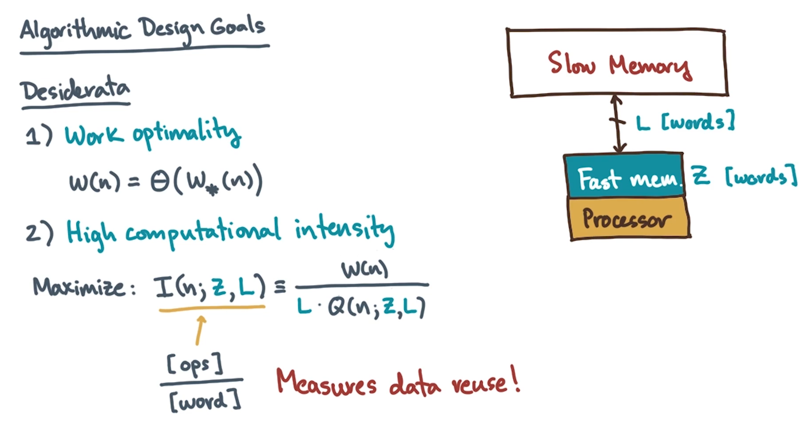

The ***second goal*** is to achieve **high computational intensity**. More formally, this entails maximizing the following quantity, $I$:

$$
I\left( {n;Z,L} \right) \equiv {{W\left( n \right)} \over {L \cdot Q\left( {n;Z,L} \right)}}
$$

Here, the **computational intensity** (or simply **intensity**) $I$ is simply the ratio of the work to the words transferred.

Intensity $I$ has units of `operations/word`. In other words, "operations per word" measures the level of ***data reuse*** in the algorithm.

If this ratio is ***large***, then ***more*** operations are being performed per word transferred to fast memory.
  * This is generally ***desirable***, however, it is ***not*** desirable to maximize this at the ***expense*** of performing sub-optimal work (i.e., per the previous/first goal).

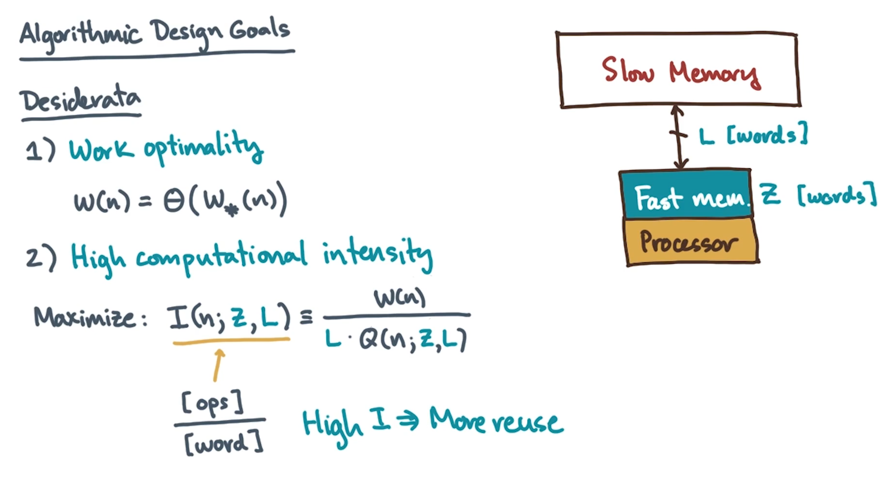

Therefore, both goals are cooperative, and are reminiscent of work and span (as discussed later in this course).

## 10. Which Is Better? Quiz and Answers

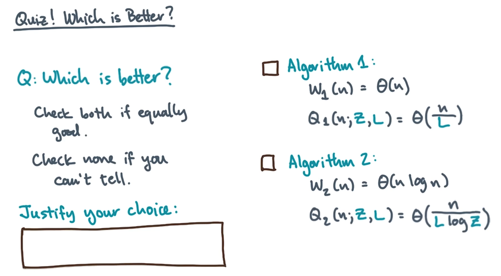

Consider two algorithms characterized as follows:

| Algorithm | Work | Number of transfers |
|:--:|:--:|:--:|
| 1 | ${W_1}\left( n \right) = \theta \left( n \right)$ | ${Q_1}\left( {n;Z,L} \right) = \theta \left( {{n \over L}} \right)$ |
| 2 | ${W_2}\left( n \right) = \theta \left( {n\log n} \right)$ | ${Q_2}\left( {n;Z,L} \right) = \theta \left( {{n \over {L\log Z}}} \right)$ |

Which of these two algorithms is better? (Select the correct option, and justify your choice.)
  * Algorithm 1
  * Algorithm 2
  * Both
  * Indeterminate

### ***Answer and Explanation***:

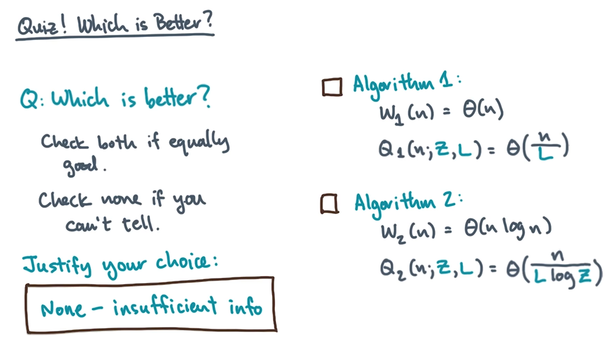

There is ***insufficient information*** to make this determination definitively.

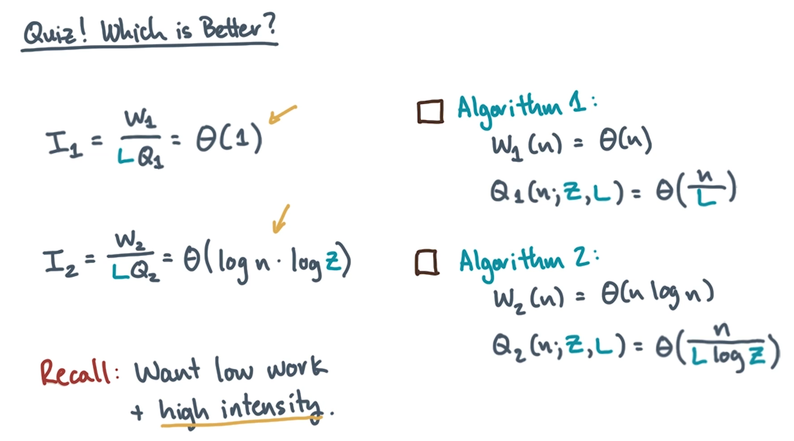

Recall (cf. Section 9) that the ***goals*** of a given algorithm are low work and high intensity. The corresponding intensities for these algorithms are as follows:

| Algorithm | Work | Number of transfers | Intensity |
|:--:|:--:|:--:|:--:|
| 1 | ${W_1}\left( n \right) = \theta \left( n \right)$ | ${Q_1}\left( {n;Z,L} \right) = \theta \left( {{n \over L}} \right)$ | ${I_1} = {{{W_1}} \over {L{Q_1}}} = \theta \left( 1 \right)$ |
| 2 | ${W_2}\left( n \right) = \theta \left( {n\log n} \right)$ | ${Q_2}\left( {n;Z,L} \right) = \theta \left( {{n \over {L\log Z}}} \right)$ | ${I_2} = {{{W_2}} \over {L{Q_2}}} = \theta \left( {\log n \cdot \log Z} \right)$ |

In this case, Algorithm 1 performs less asymptotic work $W$ , however, the intensity $I$ of Algorithm 2 grows asymptotically with $n$ and with $Z$ (whereas that of Algorithm 1 is constant). Therefore, there is ambiguity with respect to which of the two algorithm "better" optimizes across ***both*** goals.

## 11. Intensity, Balance, and Time

Now, consider the ***relationship*** between work, transfers, and execution time.

### Minimum Time to Execute the Program

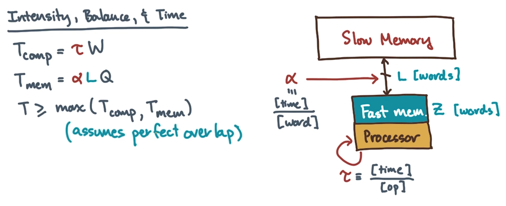

Suppose that the processor requires $\tau$ time units to perform an operation (i.e., units of `time/operation`). The corresponding time to perform **compute operations** ($T_{{\rm{comp}}}$ ) is therefore:

$$
{T_{{\rm{comp}}}} = \tau W
$$

Next, let $\alpha$ be the **amortized time** to move one word of data between the slow and fast memories, where $\alpha$ has units of `time/word`. The corresponding time to execute $Q$ **transfers** ($T_{{\rm{mem}}}$ ) is therefore:

$$
{T_{{\rm{mem}}}} = \alpha LQ
$$

Now, assume that there is ***perfect overlap*** between the data transfers and the computation. In this case, the **minimum time** to execute the program ($T$ ) is therefore:

$$
T \ge \max \left( {{T_{{\rm{comp}}}},{T_{{\rm{mem}}}}} \right)
$$

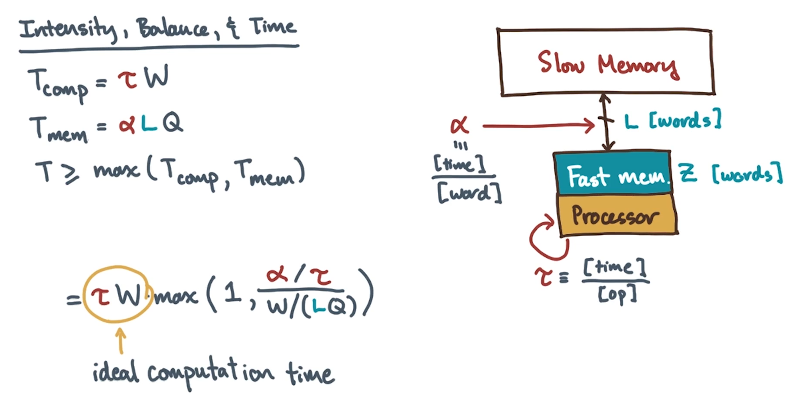

Refactoring of this expression gives the following:

$$
T \geq \tau W \cdot \max\left(1, \frac{\alpha / \tau}{W / (LQ)}\right)
$$

This refactoring shows the execution relative to the **ideal computation time**, $\tau W$ . This is "ideal" in the sense that it assumes a zero-cost data movement.

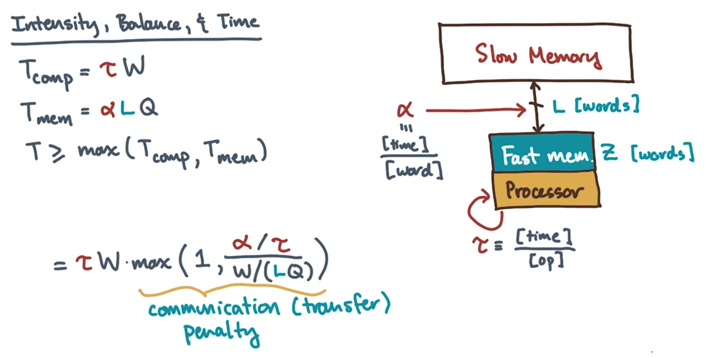

However, relative to this ideal computation time, there is a necessary ***penalty*** incurred. The factor $\max \left(  \cdots  \right)$ is the **communication penalty** (or **transfer penalty**), which is the cost incurred when moving the data.

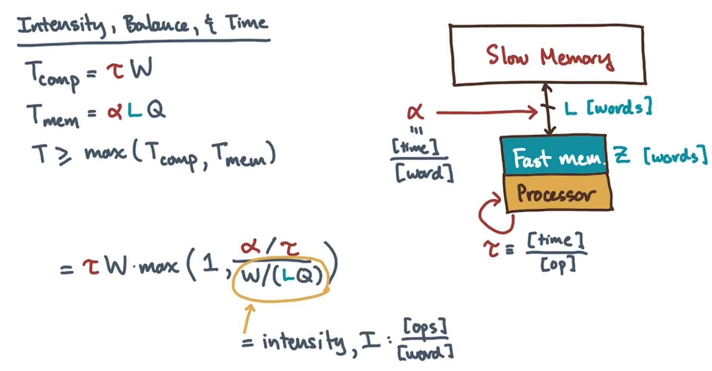

The communication penalty does indeed have some structure.

In the second argument of $\max \left(  \cdots  \right)$ , the denominator factor $W / (LQ)$ is the algorithm's **computational intensity** (cf. Section 9), having units of `operations/word`.

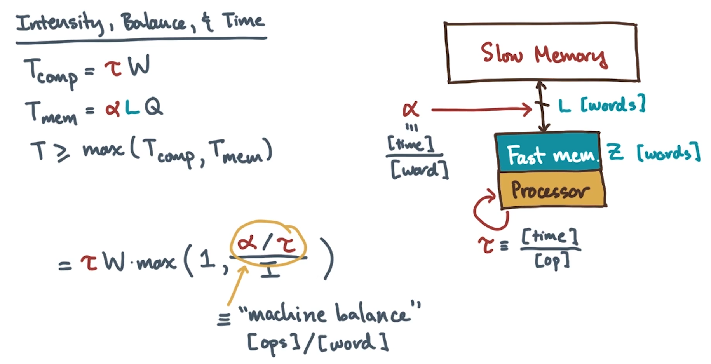

Furthermore, in the second argument of $\max \left(  \cdots  \right)$ , the numerator factor $\alpha / \tau$ is the time per word divided by the time per operation, having units of `operations/word` (similarly to the computational intensity). This is a ratio of parameters which depends *only* on the machine. In the literature, this is sometimes referred to as the **machine balance** (or **machine balance point**).
  * This ratio essentially quantifies how many operations can be executing in the time required to move a word of data.

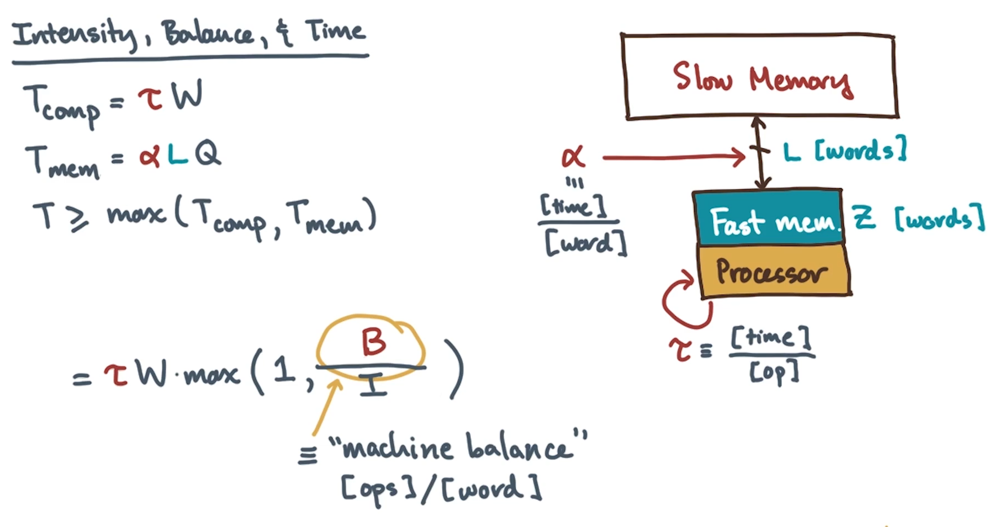

Since machine balance is a "named" parameter, it can be defined accordingly as $B$ .

With this definition of terms, the minimum possible execution time with respect to the machine balance and the algorithm's computational intensity can be therefore expressed as:

$$
T \ge \tau W \cdot \max \left( {1,{B \over I}} \right)
$$

### Maximum Time to Execute the Program

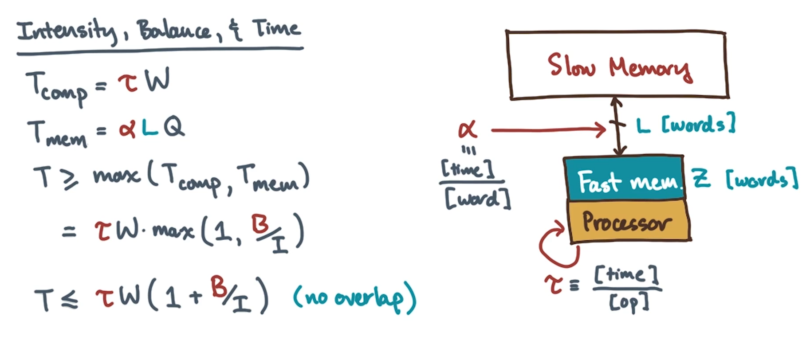

Furthermore, for the sake of completeness, the **maximum time** to execute the program ($T$ )  can be similarly estimated as:

$$
T \le \tau W\left( {1 + {B \over I}} \right)
$$

This gives rise to a sum (rather than a maximum) because if there is ***no*** overlap with data movements, then it is necessary to incur the cost for ***both*** computation ***and*** data movement, occurring successively as temporally distinct operations.

### Measures of Performance

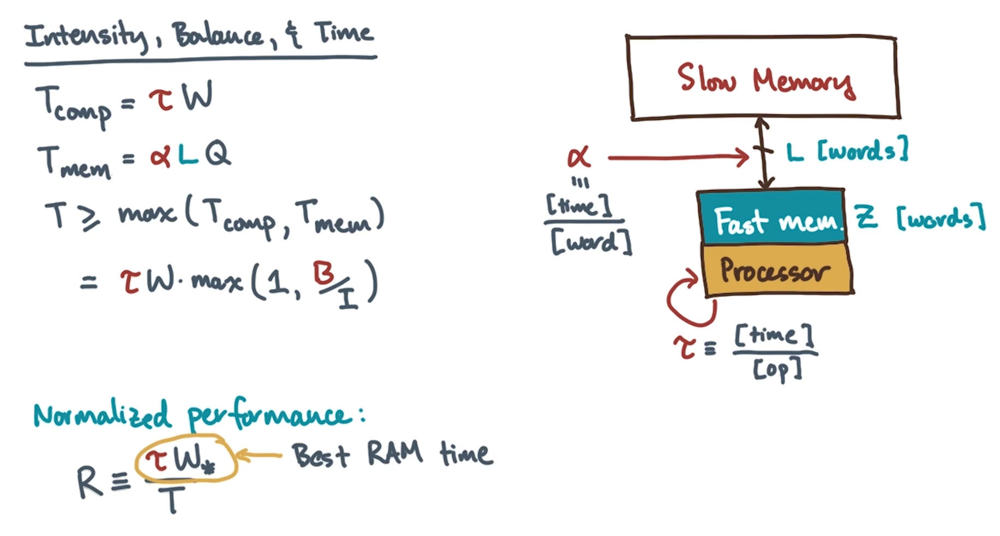

In addition to analyzing the execution time, it is also common to analyze ***measures of performance***. Let such a measure of **normalized performance** ($R$ ) be defined as follows:

$$
R \equiv {{\tau {W_ * }} \over T}
$$

The numerator $\tau {W_ * }$ is the best time in the pure sequential RAM model.

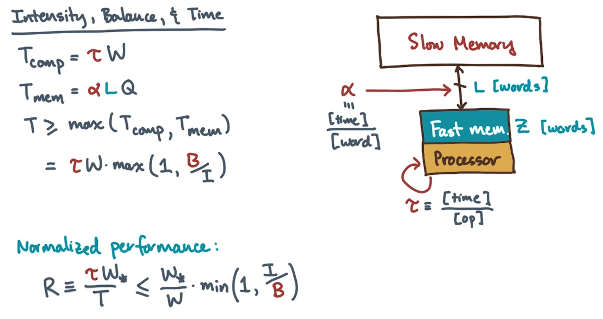

Furthermore, dividing by $T$ yields the following:

$$
\underbrace {{{\tau {W_ * }} \over T}}_ { \equiv R} \le {{{W_ * }} \over W} \cdot \min \left( {1,{I \over B}} \right)
$$

This indicates that the best possible value of the normalized performance is inversely proportional to time ($T$ ), where in general higher values are ***better***.

## 12. Roofline Plots Quiz and Answers

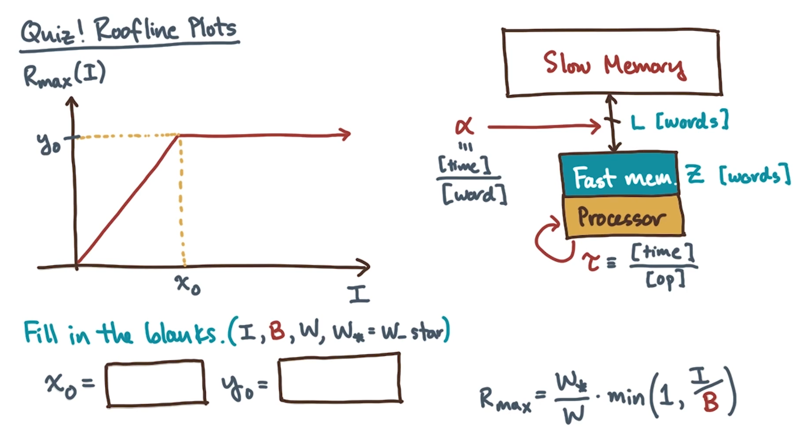

Recall some basic facts about the von Neumann architecture. Assuming ***perfect overlap*** of computation and data movement, you can estimate the ***maximum*** normalized performance as follows (cf. Section 11):

$$
{R_{\max}} = {{{W_* }} \over W} \cdot \min \left( {1,{I \over B}} \right)
$$

In performance analysis, one way to visualize the relationship among these parameters is via a so called **roofline plot** (as in the figure shown above), whose general form resembles a "roof" of a house.
  * The plot of of $R_{\max}$ vs. $I$ .
  * Furthermore, here it is assumed that $W$ (work in the actual program) and $W_*$ (equivalent work in the ideal serial RAM model) are both constant (e.g., as in the case of many algorithms or many implementations all performing the same amount of work, but varying in their communication), however, in general this is not always/necessarily true.

***N.B.*** A roofline plot is typically plotted on log-log axes, however, for simplicity, this example uses a simple linear plot.

Plotting $R_{\max }$ in this manner yields the general form as in the figure shown above. The ***interesting features*** of the plot are the value of the **plateau** and the location of the **inflection point** (i.e., $\left( {{x_0},{y_0}} \right)$ ).

What are the values of $x_0$ and $y_0$? (Express these in terms of the parameters $I$ , $B$ , $W$ , and $W_*$ .)

### Answer and Explanation:

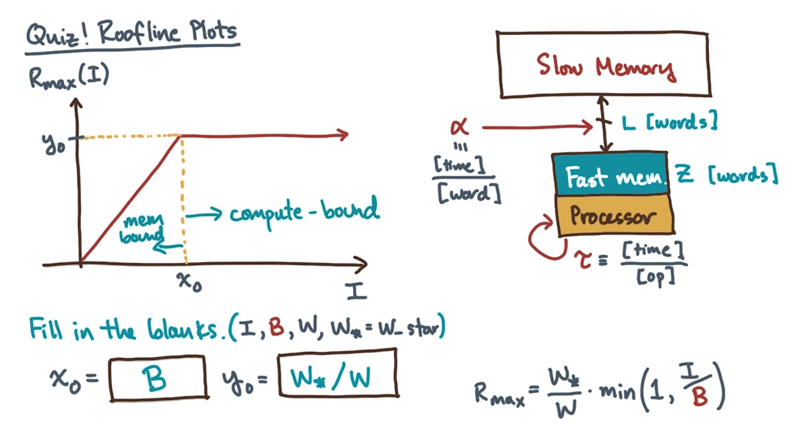

The values of the inflection point "coordinates" are as follows:

$$
{x_0} = B
$$

$$
{y_0} = {{{W_* }} \over W}
$$

$y_0$ is the maximum possible value of $R_{\max}$ .
  * ***N.B.*** Take $\mathop {\lim }\limits_{I \to \infty } \underbrace {\left\{ {{{{W_*}} \over W} \cdot \min \left( {1,{I \over B}} \right)} \right\} }_{{R_{\max }}}$ to see this more convincingly.

Furthermore, note that the ratio ${{W _ *}} \over W$ also suggests that if an algorithm is designed in a sub-optimal manner (i.e., the work is not optimal with respect to $W _ *$ ), then a corresponding ***penalty*** is incurred (i.e., reduced maximum performance relative to $W _ *$ ).

As the critical point $I = \underbrace B_{{x_0}}$ suggests, a good algorithm design target is to achieve an intensity of $B$ or greater.

Additionally, consider the following relevant ***terminology*** (as denoted in the plot in the figure shown above):
  * An algorithm which performs at $I > \underbrace B_{{x_0}}$ is called **compute-bound**
  * An algorithm which performs at $I < \underbrace B_{{x_0}}$ is called **memory-bound**

## 13. Intensity of Conventional Matrix Multiply Quiz and Answers

Estimating the intensity of an algorithm can indicate whether additional effort is required/warranted to find a more suitable alternative.

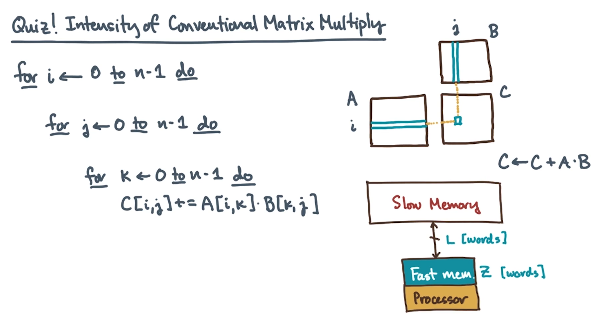

Consider again (cf. Section 6) non-Strassen matrix multiplication (as in the figure shown above). Furthermore, assume a conventional "nested" multiplication algorithm is performed, i.e.,:

$$
\boxed{
\begin{array}{l}
\rm{for\ }i \leftarrow 0{\rm{\ to\ }}n - 1{\rm{\ do}}\\
\ \ \ \ \rm{for\ }j \leftarrow 0{\rm{\ to\ }}n - 1{\rm{\ do}}\\
\ \ \ \ \ \ \ \ \rm{for\ }k \leftarrow 0{\rm{\ to\ }}n - 1{\rm{\ do}}\\
\ \ \ \ \ \ \ \ \ \ \ \ C\left[ {i,j} \right] +  = A\left[ {i,k} \right] \cdot B\left[ {k,j} \right]
\end{array}
}
$$

Now, suppose that this algorithm is run on a machine with a two-level memory hierarchy of size $Z$ (as in the figure shown above).

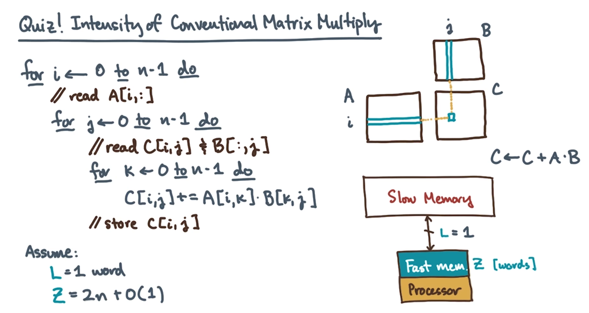

Furthermore, consider the following simplifying ***assumptions***:
  * The transfer size is exactly one word (i.e., $L = 1$ )
    * This obviates alignment-related concerns
  * $Z = 2n + O\left( 1 \right)$ , i.e., $Z$ is large enough to hold two vectors (each of size $n$ ) along with some additional constant storage space

Now, consider a ***transformation*** of this nested-loops algorithm into a more ***I/O-aware*** version, as follows:

$$
\boxed{
\begin{array}{l}
\rm{for\ }i \leftarrow 0{\rm{\ to\ }}n - 1{\rm{\ do}}\\
\ \ \ \ {\rm{// read\ }}A\left[ {i,:} \right]\\
\ \ \ \ \rm{for\ }j \leftarrow 0{\rm{\ to\ }}n - 1{\rm{\ do}}\\
\ \ \ \ \ \ \ \ {\rm{// read\ }}C\left[ {i,j} \right]{\rm{\ and\ }}B\left[ {:,j} \right]\\
\ \ \ \ \ \ \ \ \rm{for\ }k \leftarrow 0{\rm{\ to\ }}n - 1{\rm{\ do}}\\
\ \ \ \ \ \ \ \ \ \ \ \ C\left[ {i,j} \right] +  = A\left[ {i,k} \right] \cdot B\left[ {k,j} \right]\\
\ \ \ \ \ \ \ \ {\rm{// store\ }}C\left[ {i,j} \right]
\end{array}
}
$$

The additional "comments" (delimited by ${\rm{// }} \ldots$ ) indicate suggestions for where to load and store portions of matrices $A$ , $B$ , and $C$ .
  * ***N.B.*** Observe that these load and store operations respect the assumption that $Z$ is sufficiently large to hold two vectors (each of size $n$ ) and some additional constant storage space.

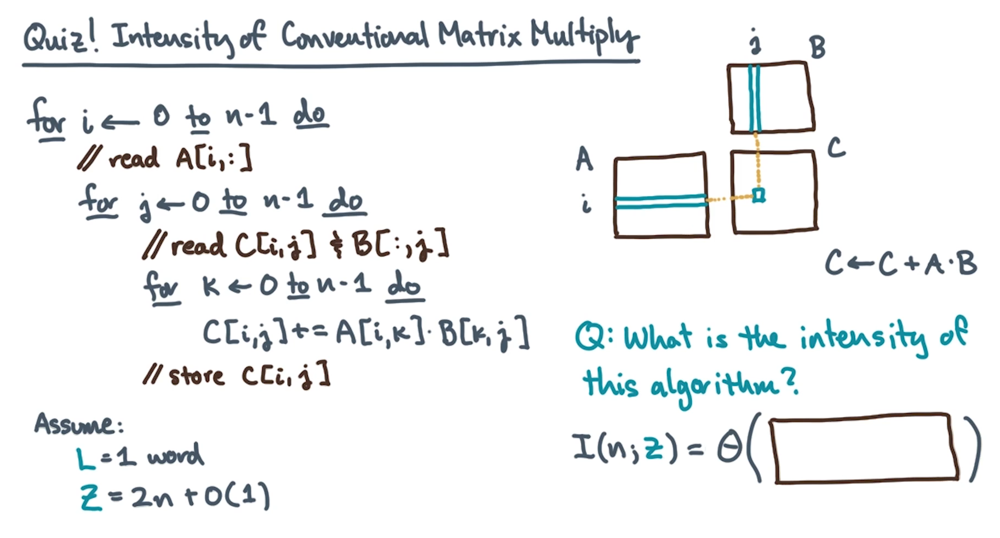

Given this algorithm, what is its asymptotic intensity? (Express this as $I\left( {n;Z} \right) = \theta \left( {???} \right)$ .)

### ***Answer and Explanation***:

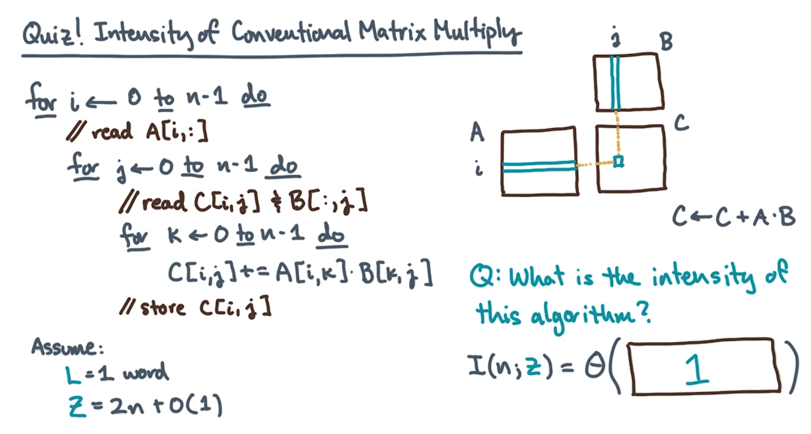

The asymptotic intensity for this algorithm is simply the following:

$$
I\left( {n;Z} \right) = \theta \left( 1 \right)
$$

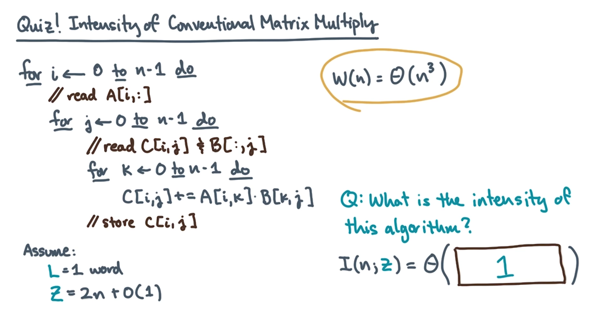

First, note that the algorithm performs the following ***work***:

$$
W\left( n \right) = \theta \left( {{n^3}} \right)
$$

Next, consider the ***transfers***.

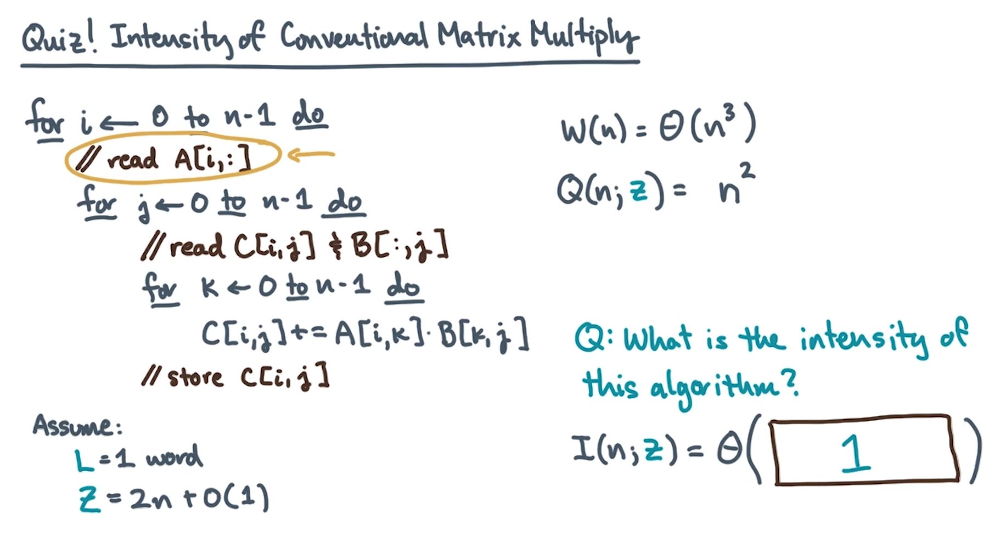

Considering the reads of matrix $A$ , this yields the following transfers:

$$Q
\left( {n;Z} \right) = {n^2}
$$

This corresponds to a read of vector $A\left[ {i,:} \right]$ (of length $n$ elements) for $n$ repetitions/iterations.

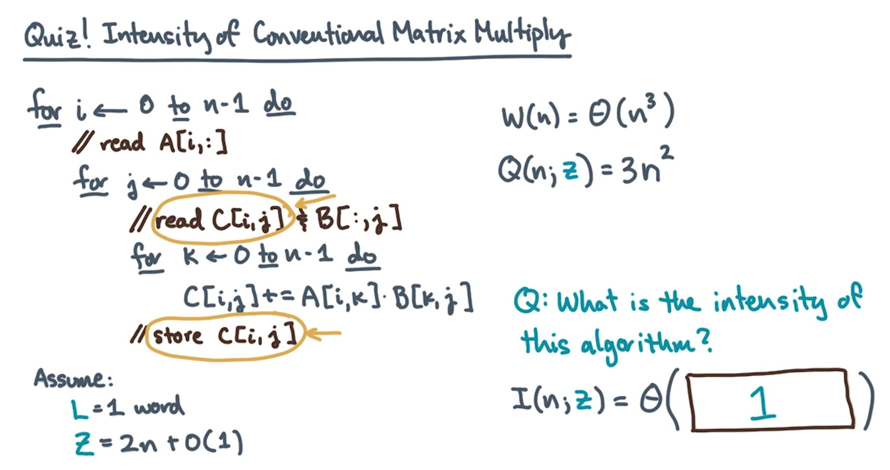

Next, considering the additional reads of matrix $C$ , this yields the following transfers:

$$
Q\left( {n;Z} \right) = n^2 + 2n^2 = 3n^2
$$

With respect to matrix $C$ , there is a read and a write operation of one element each, repeated a total of $n^2$ times.

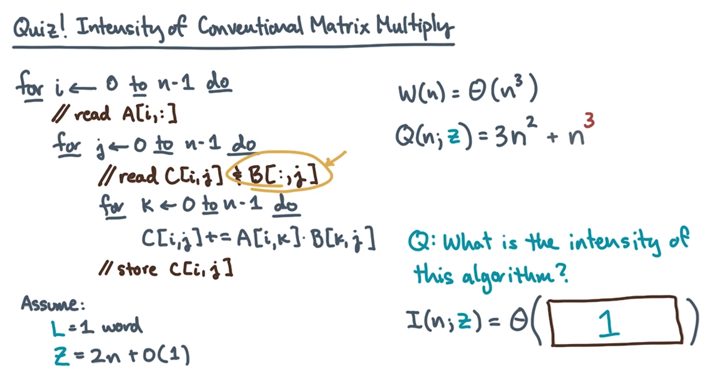

Lastly, considering the additional reads of matrix $B$ , this yields the following transfers:

$$
Q\left( {n;Z} \right) = 3n^2 + n^3
$$

The algorithm reads $n$ elements of $B$ for $n^2$ total iterations. Correspondingly, this read of $B$ ***dominates*** the overall transfer cost ($Q\left( {n;Z} \right)$ ).

Therefore, since the intensity is the ratio or operations ($W$ ) to transfers ($Q$ ), the intensity in this case is simply constant overall (i.e., $\theta \left( 1 \right)$ ).

An ***interesting question*** as a follow up to this is: Is ***better*** performance than this achievable?
  * Intuition would indeed suggest so, particularly considering that there are $n^3$ total operations, but only $n^2$ total data. This suggests that there is a potential factor $n$ of available "reuse" among this disparity. (This is discussed further in the next quiz section.)

## 14. Intensity of Conventional Matrix Multiply (Revisited) Quiz and Answers

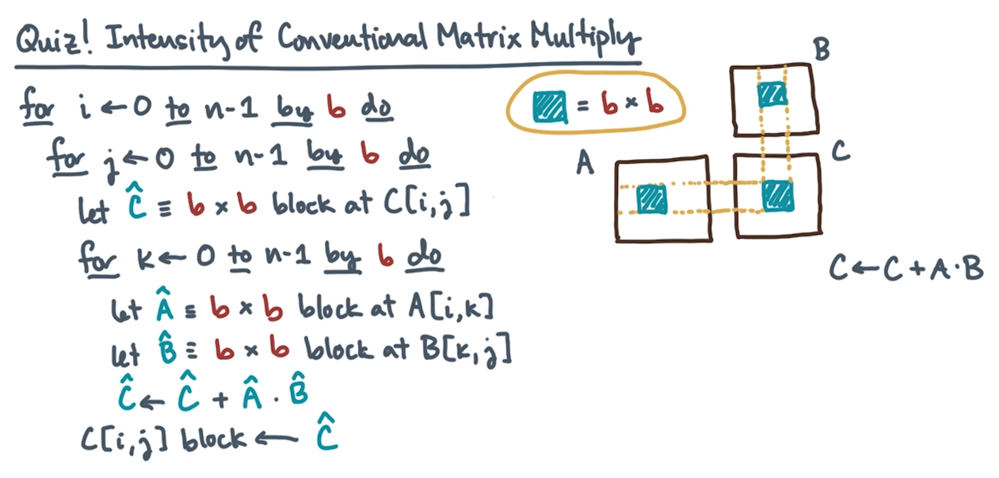

Consider again (cf. Section 13) the conventional matrix multiplication algorithm. Suppose now that the computation is performed in a block-by-block manner (as in the figure shown above), whereby the constituent matrices $A$ , $B$ , and $C$ are conceptually "divided" into smaller "blocks" of size $b \times b$ . The corresponding ***algorithm*** to accomplish this can be defined as follows:

$$
\boxed{
\begin{array}{l}
\rm{for\ }i \leftarrow 0{\rm{\ to\ }}n - 1{\rm{\ do}}\\
\ \ \ \ \rm{for\ }j \leftarrow 0{\rm{\ to\ }}n - 1{\rm{\ do}}\\
\ \ \ \ \ \ \ \ {\rm{let\ }}\hat C \equiv b \times b{\rm{\ block\ at\ }}C\left[ {i,j} \right]\\
\ \ \ \ \ \ \ \ \rm{for\ }k \leftarrow 0{\rm{\ to\ }}n - 1{\rm{\ do}}\\
\ \ \ \ \ \ \ \ \ \ \ \ \ \ \ \ {\rm{let\ }}\hat A \equiv b \times b{\rm{\ block\ at\ }}A\left[ {i,k} \right]\\
\ \ \ \ \ \ \ \ \ \ \ \ \ \ \ \ {\rm{let\ }}\hat B \equiv b \times b{\rm{\ block\ at\ }}B\left[ {k,j} \right]\\
\ \ \ \ \ \ \ \ \ \ \ \ \ \ \ \ \hat C \leftarrow \hat C + \hat A \cdot \hat B\\
\ \ \ \ \ \ \ \ C\left[ {i,j} \right]{\rm{\ block}} \leftarrow \hat C
\end{array}
}
$$

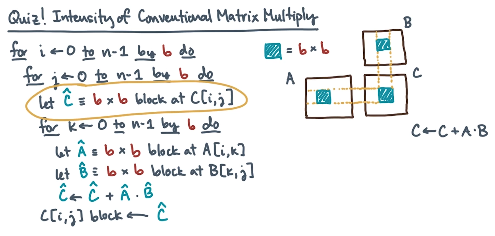

The algorithm iterates over blocks of $C$ (as in the figure shown above).

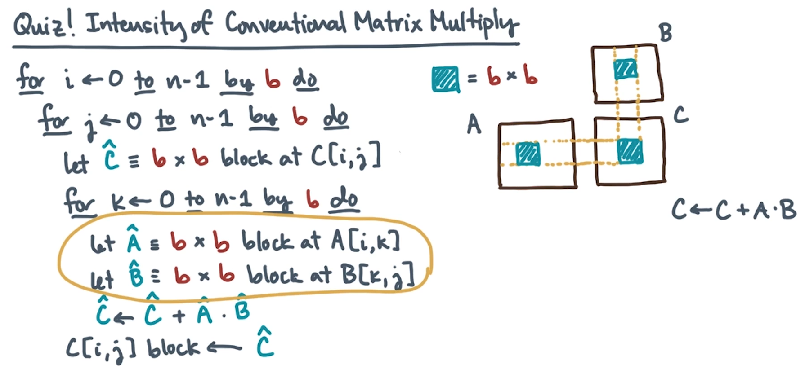

The algorithm then reads blocks of $A$ and $B$ (as in the figure shown above).

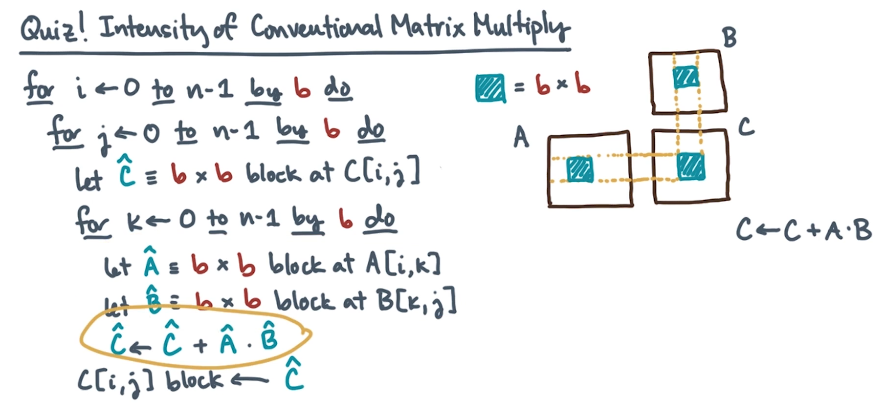

Given the blocks of $A$ and $B$ (i.e., $\hat A$ and $\hat B$ , respectively), the algorithm then multiplies them (as in the figure shown above).

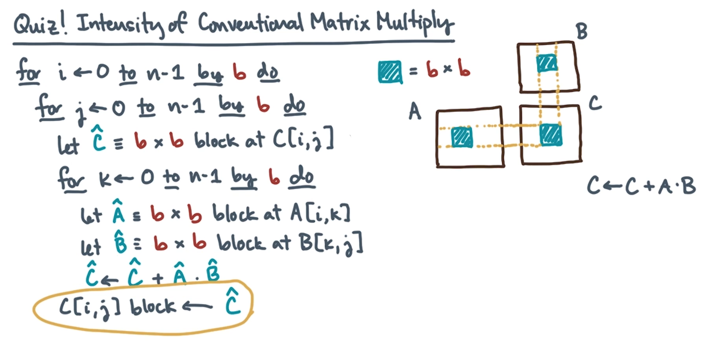

Finally, the algorithm stores the corresponding product block (i.e., $\hat C$ ) (as in the figure shown above).

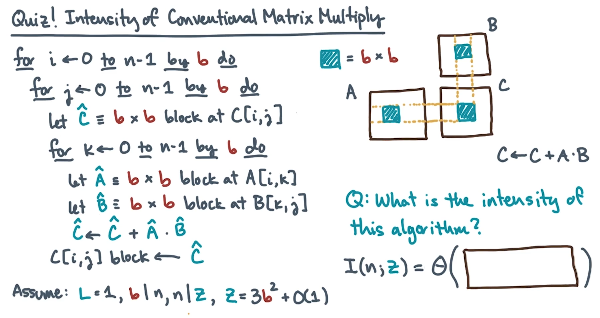

All of these read and write operations with respect to the blocks are essentially slow-fast memory ***transfers***. Therefore, count these transfers (i.e., $Q$ ) accordingly, and then express the corresponding asymptotic intensity for this "blocked"-matrix multiplication algorithm (i.e., $I\left( {n;Z} \right) = \theta \left( {???} \right)$ ). (Express this in terms of $n$ , $b$ , and/or $Z$ accordingly.)

Furthermore, note the following simplifying ***assumptions*** for this analysis:
  * $L = 1$
  * $b | n$
  * $n | Z$
  * $Z = 3{b^2} + O\left( 1 \right)$
    * Since it is necessary for blocks of $A$ , $B$ , and $C$ to fit into fast memory in order to multiply and store them, the fast memory size ($Z$ ) correspondingly assumes sufficient storage space for this, as well as additional constant storage space.

### ***Answer and Explanation***:

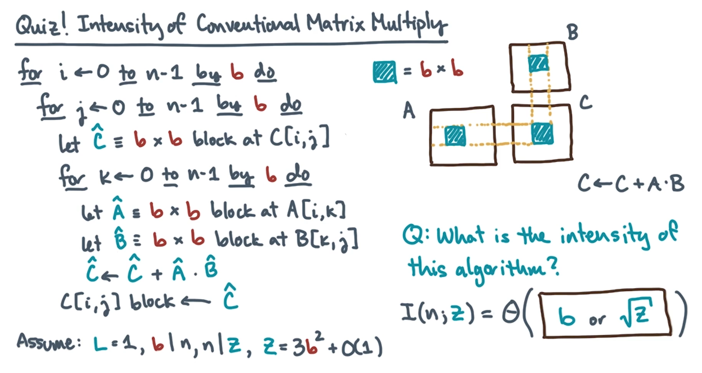

There are two possible ways to express the asymptotic intensity for this algorithm, as follows:

$$
I\left( {n;Z} \right) = \theta \left( b \right)
$$

$$
I\left( {n;Z} \right) = \theta \left( {\sqrt z } \right)
$$

***N.B.*** Both of these are equivalent per assumption $Z = 3{b^2} + O\left( 1 \right)$ .

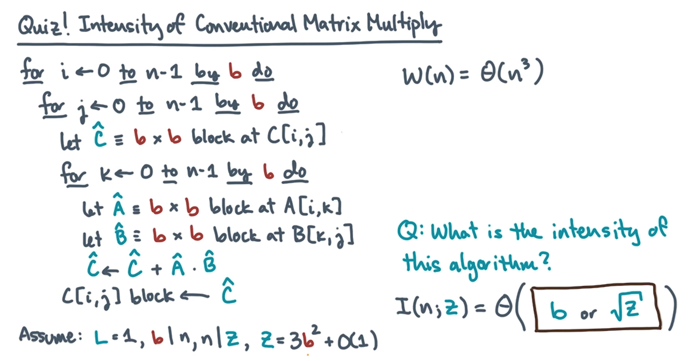

As before (cf. Section 13), the work for this algorithm is as follows:

$$
W\left( n \right) = \theta \left( {{n^3}} \right)
$$

Additionally, consider the transfer operations.
  * Each read or write operation with respect to a given block involves the transfer of a block of size $b \times b$ (or equivalently $b^2$ ).
  * Furthermore, each nested loop performs $n/b$ iterations.

From these two observations, the total number of ***read operations*** can be determined as follows.

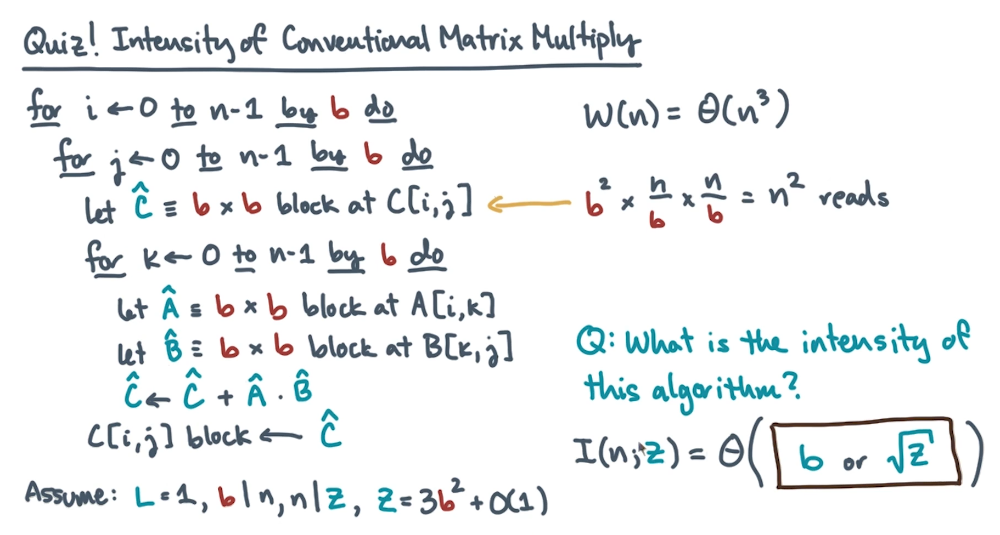

With respect to the $C$ blocks (i.e., $\hat C$ ), this yields the following number of read operations:

$$
{b^2} \times {n \over b} \times {n \over b} = {n^2}
$$

Here, each block read involves $b^2$ words, repeated ${\left( {n/b} \right)^2}$ times.

The same applies to the corresponding ***write operations*** with respect to the $C$ blocks (i.e., $\hat C$ ).

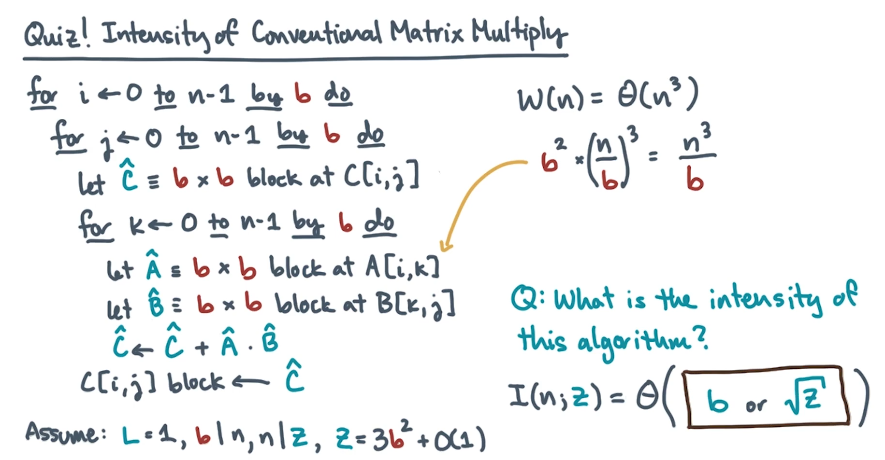

With respect to both the $A$ and $B$ blocks (i.e., $\hat A$ and $\hat B$ , respectively), this yields the following number of read operations apiece for $A$ and $B$:

$$
{b^2} \times {\left( {{n \over b}} \right)^3} = {{{n^3}} \over b}
$$

Here, $b^2$ reads are nested in $(n/b)^3$ iterations.

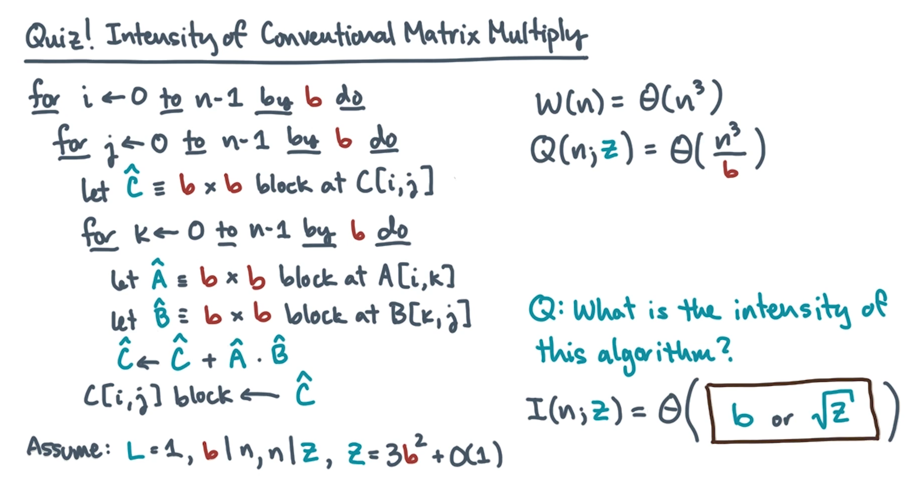

Therefore, the total number of transfers is dominated by the term $n^3/b$ , i.e.,:

$$
Q\left( {n;Z} \right) = \theta \left( {{{{n^3}} \over b}} \right)
$$

Furthermore, the corresponding computational intensity for the algorithm is therefore the ratio of $W$ to $Q$ , i.e., $\theta \left( b \right)$ (or equivalently $\theta \left( \sqrt{Z} \right)$ , by assumption of the size of $b$ in relation to the fast-memory size, $Z$ ).

Recall (cf. Section 13) that the conventional algorithm for matrix multiplication has a computational intensity of $\theta \left( 1 \right)$ (constant), therefore, "blocking" in this manner yields comparatively much better performance accordingly.

## 15. Informing the Architecture Quiz and Answers

One particular application of the analysis demonstrated thus far in this lesson is to inform the ***design*** of computer architectures.

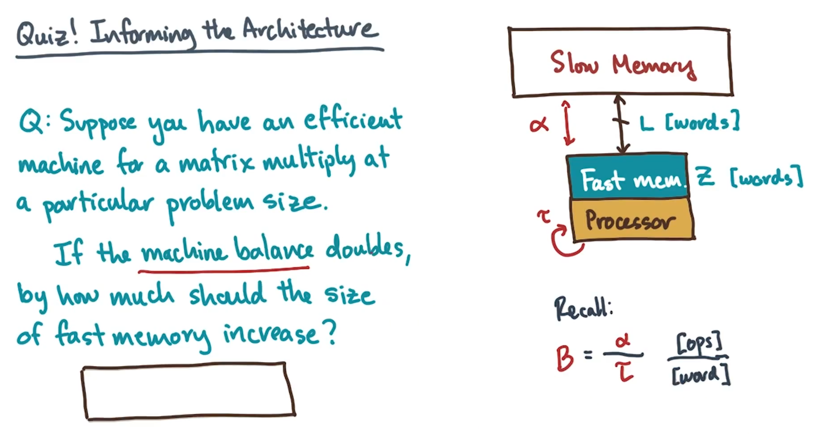

Consider a simple example, whereby a new machine is being devised for improving ***deep learning*** computations.
  * ***N.B.*** Deep learning entails neural networks, a subset of machine learning.

Suppose that an existing machine is very efficient at performing matrix multiplications on matrices of a particular problem size.

Now, suppose that in the next-generation machine, the machine balance ***doubles***.
  * ***N.B.*** Recall (cf. Section 11) that the machine balance is defined as $\alpha / \tau$ , where $\alpha$ is the time to transfer from slow memory to fast memory, and $\tau$ is the time to perform an operation by the processor once the data is localized to the fast memory.

With a doubled machine balance, it is now necessary to perform ***twice*** as many operations locally on the processor in the same/equivalent time that it takes to move the data from slow memory to fast memory, in order to yield equivalent performance to the original machine.

Therefore, with a doubled machine balance, what is the corresponding ***factor*** of increase in the fast-memory size ($Z$ ) in order to compensate for this?

### ***Answer and Explanation***:

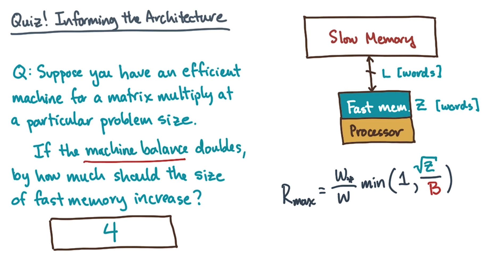

This requires a corresponding increase in the fast-memory size by a factor of $4$ .

Recall (cf. Section 12) the following definition:

$$
{R_{\max}} = {{{W_* }} \over W} \cdot \min \left( {1,{I \over B}} \right)
$$

Here, the machine balance $B$ is accounted for via the communication penalty.

Furthermore, recall (cf. Section 14) that the intensity $I$ for "blocked" matrix multiplication with respect to fast-memory size ($Z$ ) is $\theta \left( \sqrt{Z} \right)$ , i.e.,:

$$
{R_{\max}} = {{{W_* }} \over W} \cdot \min \left( {1,{\sqrt{Z} \over B}} \right)
$$

Therefore, all else equal, if machine balance $B$ doubles (i.e., $2B$ ), then $\sqrt{Z}$ must double to compensate accordingly for the communication penalty, i.e.,:

$$
\sqrt {Z'}  = 2\sqrt Z  \Rightarrow \underbrace {Z'}_{{{\left( {\sqrt {Z'} } \right)}^2}} = \underbrace {4Z}_{{{\left( {2\sqrt Z } \right)}^2}}
$$

where $Z'$ is the new fast-memory size.

***N.B.*** An increase in machine balance $B$ over time is indeed a realistic observation. (Consult external sources, class forum discussion, etc. for why this is so.)

## 16. Conclusion

The two-level model may seem relatively "contrived" compared to real memory hierarchies (i.e., as discussed in other courses, encountered in "real world" experience, etc.). So, then, why bother with it?
  * The two-level model does in fact capture the most important ***performance effects** of real memories, namely **capacity** and **transfer size**.
  * More recently, there has been a lot of research on **locality-sensitive algorithms** based on this two-level model, therefore, it is necessary to understand the two-level model in order to devise sensible ways to extend it accordingly.

In order to exploit a memory hierarchy algorithmically, the main ***technique*** described in this lesson for this purpose is to organize the data access in such a manner which ***increases*** data reuse accordingly.

The other important pair of ***concepts*** discussed in this lesson were those of **computational intensity** and **machine balance**. A general ***rule of thumb*** based on these two concepts is the following:

> In order for an algorithm to scale well to future memory hierarchies, the intensity of the algorithm $I$ must at least match (and more preferably exceed) the machine balance point $B$ .

***N.B.*** This idea will be explored further in subsequent lessons of this course.
