# Basic Model of Locality

## 1. Introduction

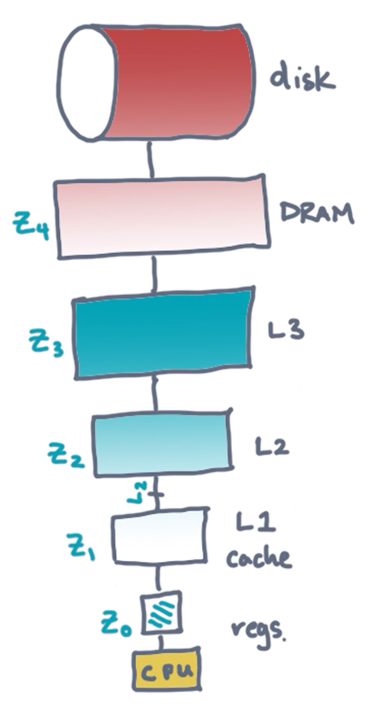

Real machines have **memory hierarchies** (as in the figure shown above). This means that in between the **processor** and the primary storage device (e.g., a **disk**), there are ***layers*** of memory in between. As the layer approaches the processor, the layer becomes correspondingly faster but smaller.
  * ***N.B.*** The difference in all of the size, latency, and bandwidth between each successive layer may be an order of magnitude.

Unfortunately, our usual model of an algorithm does ***not*** distinguish between the size and the speed of these different memory layers. Nevertheless, in order to achieve ***high performance***, then it is necessary to correspondingly ***design*** algorithms in such a manner which ***exploits*** this memory hierarchy accordingly.

Sometimes the **hardware** or **operating system** can ***manage*** these memory layers ***automatically***. However, using these memory layers ***optimally*** is nevertheless ***difficult*** to achieve in practice (particularly when using such automated approaches). Therefore, it is necessary to design algorithms appropriately for this purpose; this topic is the starting point of the lesson accordingly.

## 2. A First, Basic Model

### Two-Level Memory Hierarchies

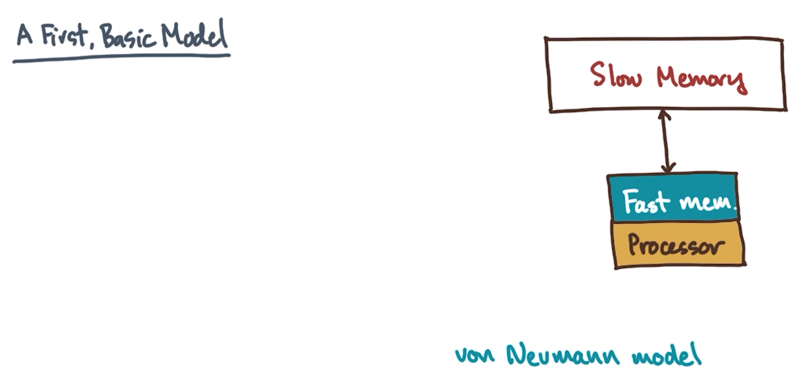

In order to design a **locality-aware algorithm**, a **machine model** is required. Consider a variation on the **von Neumann architecture** (as in the figure shown above).

The von Neumann architecture has a **processor** (as in the figure shown above). The processor performs basic ***compute operations*** (e.g., addition, subtraction, branching, etc.).
  * ***N.B.*** For present purposes, assume that this processor is ***sequential***.

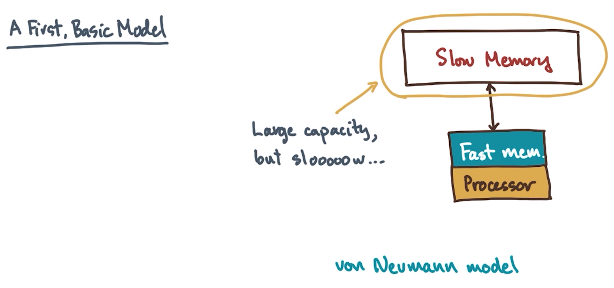

Furthermore, the processor connects to a **main memory** (as in the figure shown above), which is nearly ***infinite*** in its capacity, however, it is very ***slow*** (relative to the processor).

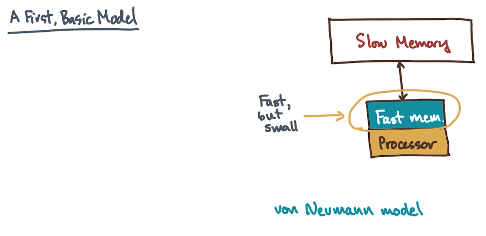

Lastly, between the slow main memory and the processor, there is also a **fast memory** (as in the figure shown above), which is much faster than the main memory, however, it is also much smaller in capacity by comparison.

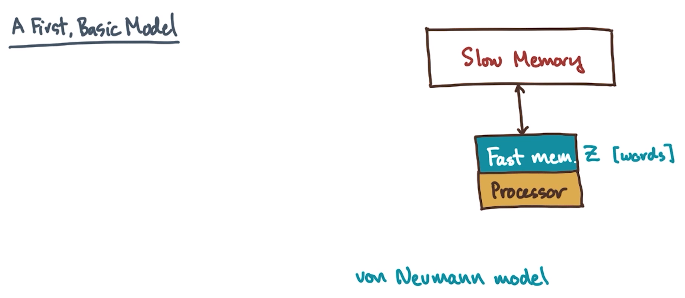

Let the size of this fast memory be denoted by $Z$, having measurement units of `words`.

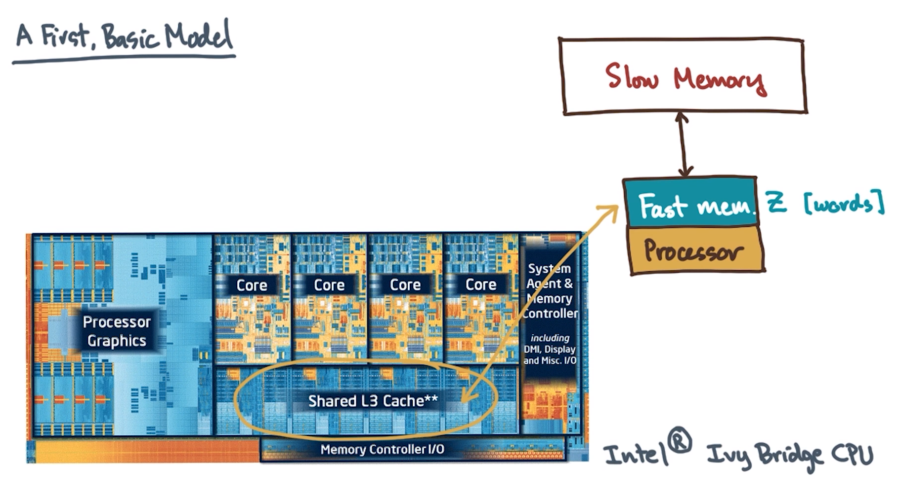

Such **two-level memory hierarchies** may already be familiar from previous exposure. For example, consider the Intel Ivy Bridge multi-core processor (as in the figure shown above). The fast memory is comprised of the **last-level cache (LLC)** (i.e., shared L3 cache), sitting between the slower main memory (not shown in the figure) and the processor itself.

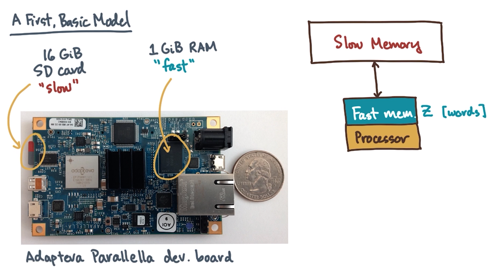

Another example is the Adapteva Parallella board (as in the figure shown above), used for hobby programming. The Parallella has a ***slow***, non-volatile SD card which behaves similarly to a disk, as well as a small amount of ***faster*** main memory (relative to the comparably much slower SD card)

### Rules for the First, Basic Model

There are two ***rules*** about how computations run in this first, basic model.

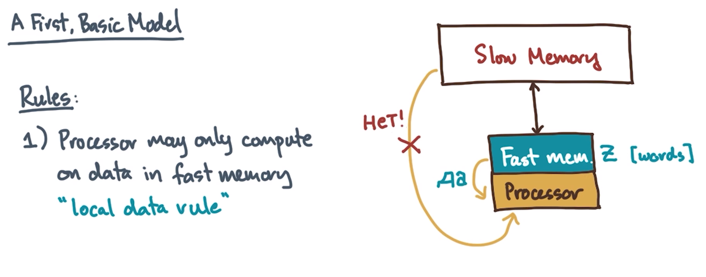

The **first rule** (the **local data rule**) states that the processor ***cannot*** perform any operations unless the operands are present in the ***fast*** memory.

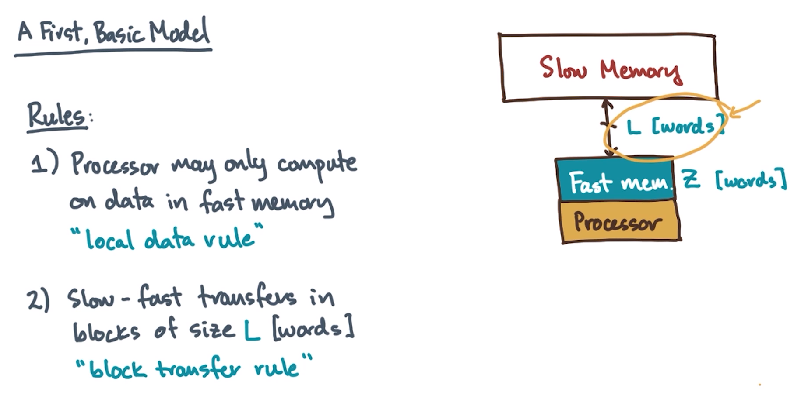

The **second rule** (the **block transfer rule**) states that when data moves back and forth across the **channel** (denoted by brown double-arrow in the figure shown above) between slow and fast memory, it does so in **chunks** of size $L$ words.

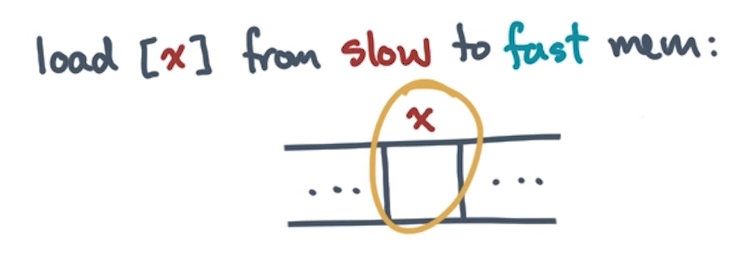

To further understand the second rule, consider the scenario whereby a word is loaded at address $x$ from main memory (as in the figure shown above). Per the block transfer rule, a ***cost*** is incurred in order to move an additional $L - 1$ nearby words.

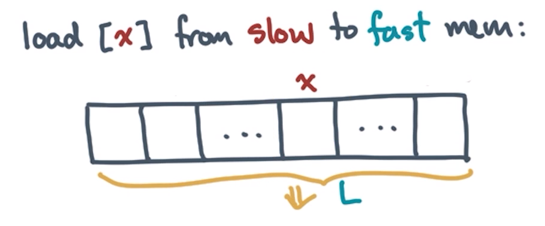

Furthermore, ***which*** particular words are transferred along with the target word $x$ depends on how the data is correspondingly ***aligned*** in the slow memory.

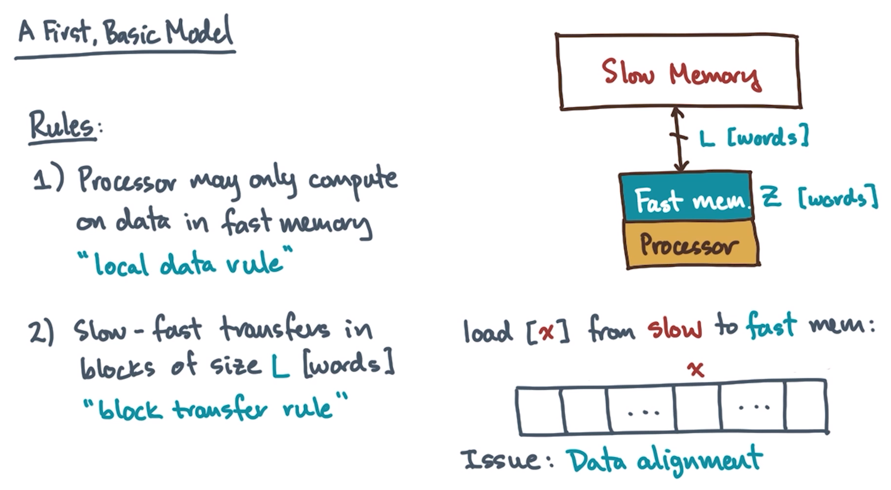

Therefore, when designing an algorithm for this model, **data alignment** is a key ***issue*** which must be considered. Nevertheless, most real-life memory systems do indeed perform such block transfers, and therefore both multi-level memories ***and*** block transfers are indeed relevant considerations when designing **high-performance algorithms**.

### Costs for the First, Basic Model

Therefore, this first, basic model implies two major **costs** when designing algorithms.

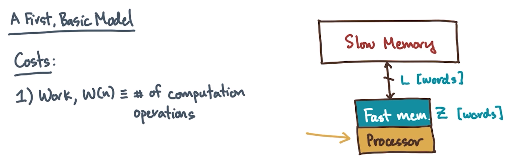

The first cost entails how many **operations** are required by the algorithm, i.e., what is the **computational work** (denoted $W(n)$) performed by the processor.
  * ***N.B.*** Just like there is the concept of "work" in the **work-span model** (discussed later in this course) for a parallel machine, the corresponding concept of "work" in this input/output (I/O) model will generally depend on the input size, $n$.

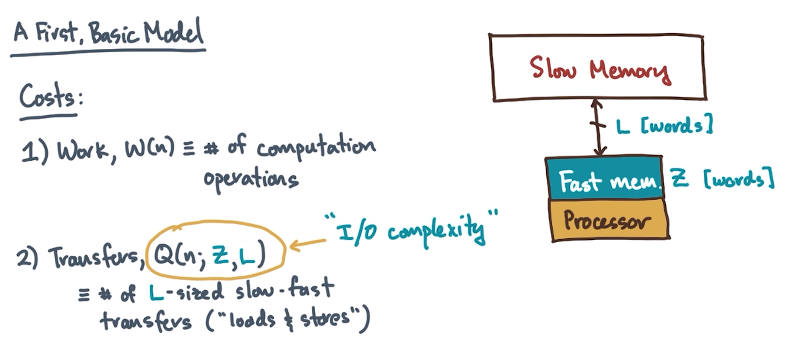

The second cost entails how many **block transfers** are required by the algorithm (denoted by $Q(n;Z,L)$, and referred to as the algorithm's **input/output (I/O) complexity**).
  * The number of transfers depends on ***both*** the size of the fast memory ($Z$) ***and*** the block transfer size ($L$).

### Example: Reduction

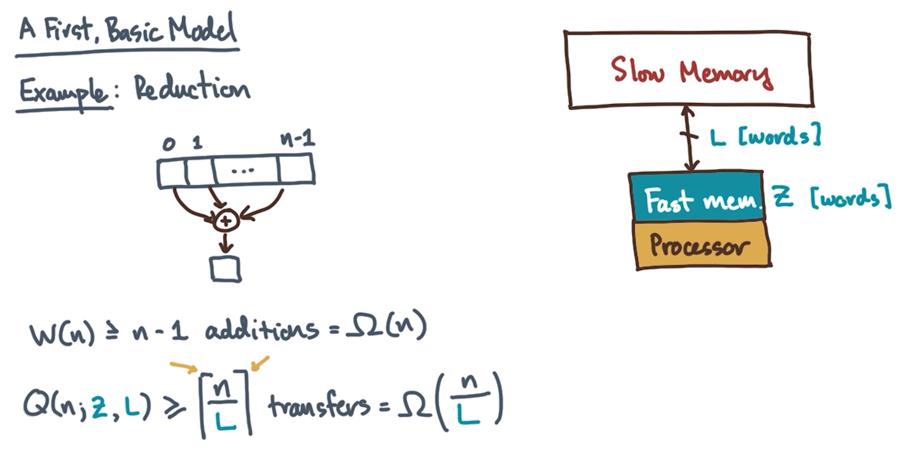

Consider a simple example (as in the figure shown above), whereby the elements of an array of size $n$ are summed.

In order to accomplish this, the processor must perform at least $n-1$ addition ***operations***, or asymptotically:

$$
W\left( n \right) \ge \underbrace {\Omega \left( n \right)}_{\scriptstyle n - 1 \atop 
  \scriptstyle {\rm{additions}}}
$$

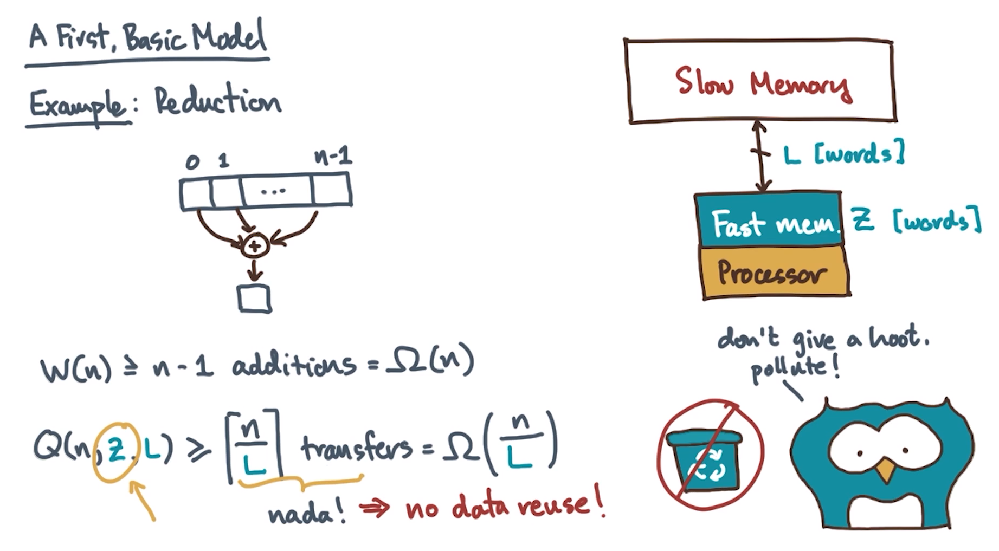

Furthermore, with respect to ***memory transfers***, intuitively, the data must be traversed at least once. Correspondingly, this suggests the following natural lower bound on the transfers accordingly:

$$
Q\left( {n;Z,L} \right) \ge \underbrace {\left\lceil {{n \over L}} \right\rceil }_{{\rm{transfers}}} = \Omega \left( {{n \over L}} \right)
$$

***N.B.*** The ceiling (i.e., $\left\lceil {{\textstyle{n \over L}}} \right\rceil $) accounts for the fact that if $n$ is not a multiple of $L$, then a partial-transfer cost must be incurred nevertheless.

Observe that there is ***no*** dependence by $Q$ on $Z$ (the size of the fast memory). Since it is only necessary to access each element *once*, the size of the fast memory is irrelevant (i.e., the data is ***not*** reused either way).
  * ***N.B.*** In general, not reusing data is ***undesirable***.

## 3. Two-Level Memories Quiz and Answers
