# Algorithmic Time: Energy and Power

***N.B.*** This lesson is "optional" per the course staff.

## 1. Introduction

At the Massachusetts Institute of Technology (MIT) in the early 1980s, Danny Hillis attempted to build a new supercomputer, called a **connection machine**, characterized by lights blinking according to where communication was occurring within the system.

Hillis' consequent PhD dissertation on this work subsequently won the doctoral dissertation award from the Association of Computing Machinery (ACM) in 1985, one of the highest honors in the field of computer science.

This award was conferred despite the dismal title of its concluding chapter:

> Chapter 7: New Computer Architectures and Their Relationship to Physics or, Why Computer Science is ***No Good***

Hillis was critiquing parallel algorithms research at the time. Hillis argued that, ultimately, an algorithm must run on a ***physical machine***, subject to the constraints of the laws of physics. In this vein, Hillis contended that algorithms researchers were "overly generously" abstracting away too many such (arguably non-trivial) details regarding the ***physical costs*** of computation.
  * In particular, Hillis was concerned with the speed of light, which fundamentally limits how fast information can travel.

Whether such physical costs ***can*** indeed be "reasonably ignored" is still an open question. However, there is nevertheless merit to Hillis' assertion that, at a minimum, such physical costs are at least "relevant considerations."

This lesson will begin from this line of thinking, and poses the following question accordingly:

> What would it mean to consider the ***physical costs*** in designing an algorithm?

## 2. Speed Trends Quiz and Answers

This lesson will proceed through a series of calculations, partly inspired by Danny Hillis' PhD thesis, in order to draw conclusions regarding the physical limits of computation.

Consider the quad-core Intel Ivy Bridge processor from 2015 (as in the figure shown above).

In the best case, this processor executes approximately 100 billion operations per second, or equivalently `100 Gops/s` (where `1 Gop/s` [gigaop] is $10^{11}$ operations per second).

Roughly speaking, this rate of throughput doubles approximately every 2 years.

Given this information, how fast will a comparable processor be in 10 years (i.e., 2025)? (Express the answer in units of `Gop/s`.)

### ***Answer and Explanation***:

In 2025, an equivalent processor will perform `3200 Gop/s` (or equivalently `3.2 Top/s`).

In 10 years, there will be `5` doublings, implying a performance speedup of $2^5 = 32$ . Therefore, relative to a 2015 processor, a 2025 processor will run at $100 \times 32 = 3200$ `Gop/s` (or equivalently `3.2 Top/s`).

***N.B.*** Even in 2015, there are specialized processors capable of achieving on the order of trillions of operations per second. Nevertheless, the purpose of this exercise is to give an intuitive feel for peak performance and the corresponding rate of growth that exponential trends bring.

## 3. Speed Limits Quiz and Answers

This quiz further explores the notion of a computational "speed limit."

Consider a two-dimensional mesh of physical processors (as in the figure shown above). Imagine that such a many-core processor fits on a physical die of size $\ell  \times \ell$ .

Within the mesh, every interior point is connected to its eight nearest neighbors. Correspondingly, this means that each processing unit can communicate along diagonal routes (as in the figure shown above).

Now, consider a ***single operation*** on this mesh, defined as follows.

The operation begins at the processing unit located at the center (as in the figure shown above).

The operation subsequently travels as a signal to a unit at one of the corners (as in the figure shown above).

The operation then reverses its path, making its way back to the center (as in the figure shown above).

Finally, the operation returns back to the center (as in the figure shown above).

Now, consider performing 3 trillion such operations per second (i.e., `3 Top/s`) in a ***sequential*** manner.
  * ***N.B.*** Recall (cf. Section 2) that `1 Top/s` is equivalent to $10^{12}$ operations per second.

If the signal travels at the speed of light, what is the maximum physical dimension of this mesh (i.e., $\ell$ )? (Provide the answer in units of microns [ $\mu m$ ], where 1 micron is $10^{-6}$ m. Round the answer to 1 significant figure.)

***N.B.*** The speed of light is approximately $3 \times 10^{8}$ `m/s`.

### ***Answer and Explanation***:

The maximum physical dimension of the mesh is $\ell \leq 70\ \mu \rm{m}$ .

The path length of a single round trip is $2 \times [(\ell \sqrt{2})/2] = \ell \sqrt{2}$ .

Performing 3 trillion of these round trips per second therefore implies the following:

$$
3 \times {10^{12}}{\rm{\ }}{\textstyle{{{\rm{op}}} \over {\rm{s}}}} = {\textstyle{{1{\rm{\ op}}} \over {1{\rm{\ round\ trip}}}}} \times {\textstyle{{1{\rm{\ round\ trip}}} \over {\ell \sqrt 2 }}} \times \underbrace {\left( {3 \times {{10}^8}{\rm{ }}{\textstyle{{\rm{m}} \over {\rm{s}}}}} \right)}_{{\rm{speed\ of\ light}}} \Rightarrow \ell  = 70{\rm{\ \mu m}}
$$

$70\ \rm{\mu m}$ is approximately equivalent to the width of a human hair. Therefore, the implication of this exercise is that in order to hit this computational speed target (i.e., the speed of light), assuming that the information propagates at this speed, then the corresponding processor must be ***incredibly*** small to achieve this.

## 4. Space Limits Quiz and Answers

Consider a memory chip whose area is equivalent to the cross-sectional area of a human hair, or approximately $4900 \rm{\ \mu m}^2$ .

Now, suppose it is desired to store `1 TB` of data on such a memory chip.
  * ***N.B.*** $1\ \rm{TB} = 10^{12} \rm{\ bytes}$ .

What is the ***physical area*** of a ***single bit*** (***not*** a byte) on such a chip? (Express the answer in units of $\rm{\ \mu m}^2/\rm{bit}$ .)

### ***Answer and Explanation***:

The corresponding size of a single bit given the target capacity of `1 TB` is $6.125 \times 10^{-10}\rm{\ \mu m}^2/\rm{bit}$ .

This result derives from the following:

$$
{\textstyle{{4900\ \mu {{\rm{m}}^{\rm{2}}}} \over {{{10}^{12}}\ {\rm{bytes}}}}} \times {\textstyle{{1\ {\rm{byte}}} \over {8\ {\rm{bits}}}}} = 6.125 \times {10^{ - 10}}\ \mu {{\rm{m}}^{\rm{2}}}{\rm{/bit}}
$$

Considering such a single bit (as in the figure shown above), and assuming it is a square per-bit area, this corresponds to a side length of $\sqrt {6.125 \times {{10}^{ - 10}}\ \mu {{\rm{m}}^{\rm{2}}}{\rm{/bit}}}  \approx 2.5 \times {10^{ - 11}}\ \mu {\rm{m/bit}}$ , or approximately $\textstyle{1 \over 4}\rm{Å}$ (angstrom) per side, which is on the order of an atomic radius.
  * ***N.B.*** A single ***classical bit*** (as opposed to a ***quantum bit***) is effectively physically constrained by this single-atom size.

Therefore, the implication of this exercise is that at a certain point of size reduction, there will be a limit to how much such "squeezing" (i.e., into a volume of physical space) can be achieved, beyond which only additional ***locality*** will provide incremental performance improvements with respect to speed.

## 5. Balance in Time Quiz and Answers

Another important trend in computing systems is the ***growing gap*** between the **compute speed** and the **communication speed**.

Recall (cf. Lesson 1) the basic von Neumann architecture (as in the figure shown above), comprised of a **processor** and a local **fast memory**, which in turn is connected to a large but **slow memory**.

The processor can perform $R$ operations per second; it turns out that this rate is related to the **transistor density** (i.e., the number of transistors that can fit in a given area of physical space).

The "classic plot" for the trend of transistor density over time is as in the figure shown above.
  * Over the preceding 40 years or so, the transistor density has approximately doubled every `1.9 years`, with a corresponding increase by a factor of approximately $10^{6}×$ over the last 40 years.

***N.B.*** Generally speaking, as transistors decrease in size, this increases their density (for the same area), and correspondingly the signaling time between the transistors also decreases accordingly (thereby allowing faster computation time). Therefore, the plot implies that as transistor density increases, $R$ (i.e., the number of operations performed per unit time) increases proportionally accordingly.

The other notable feature of the von Neumann computing system is the slow-fast memory transfer cost (cf. Lesson 1) (as in the figure shown above).

If the rate of data movement back and forth between the slow and fast memories is denoted by $\beta$ (having units of `words/time`), then similarly to $R$ , $\beta$ also has a natural historical growth rate (as in the figure shown above).

There is a standard benchmark called the **stream**, which measures this growth rate.
  * $\beta$ has doubled approximately every `2.9 years`.

Recall (cf. Lesson 1) that the **machine balance point** (denoted by $B$ , having units of `operations/word`) is defined as follows:

$$
B\equiv {R \over \beta }
$$

***N.B.*** In this context, $B$ essentially defines the peak compute throughput divided by the peak memory bandwidth.

What is the doubling time of $B$? (Express the answer in years, rounded to 2 significant figures.)

### ***Answer and Explanation***:

The doubling time of $B$ is approximately `5.5 years`.

Given time $t$ (having units of `years`), the relationships $R(t)$ and $\beta (t)$ are as follows:

$$
R(t) \propto {2^{t/1.9}}
$$

$$
\beta (t) \propto {2^{t/2.9}}
$$

From this, $B(t)$ follows directly via:

$$
B(t) \equiv {{R(t)} \over {\beta (t)}} \propto {2^{t\left( {{\textstyle{1 \over {1.19}}} - {\textstyle{1 \over {2.9}}}} \right)}} \approx {2^{t/5.5}}
$$

Consider a comparison of two mobile graphical processor units (GPUs), as in the figure shown above, launched between 2008 and 2015 (a span of approximately 6.75 years), suggesting a machine balance point factor change of ${2^{(6.75)/5.5}} \approx 2.34$ .

Furthermore, the $\beta$ (designated as "bandwidth" parameters in the figure shown above) and $R$ (designated as "processing power" parameters in the figure shown above) are given as:

| GPU | Launch Date | $\beta$ (`GB/s`) | $R$ (`GFlops`) |
|:--:|:--:|:--:|:--:|
| GeForce 8200M | June 2008 | 17.056 (DDR3) | 19.2 |
| GeForce 920M | March 2015 | 14.4 (DDR3) | 441 |

Consider: Are these data consistent with the predicted rate of change in the machine balance point (i.e., $B$ )?
  * ***N.B.*** This is left as an exercise to the reader/student.

## 6. Balance Principles

For a sequential processor with slow and fast memories, recall (cf. Lesson 1) the basic concept of a **machine balance point**, defined as:

$$
B \equiv {R \over \beta }
$$

where $R$ is the peak processing rate, and $\beta$ is the peak memory bandwidth.

Furthermore, recall (cf. Section 5) the historical growth trends for $R$ and $\beta$ (as in the figure shown above). Observe that the rate of improvement in computation (doubling every `1.9 years`) far outstrips the rate of improvement in communication (doubling every `2.9 years`), with this gap doubling approximately once every `5.5 years`.

So, then, what is the implications of this "growing gap" with respect to algorithms design? This suggests that it might be beneficial to ***trade off*** more computation for less communication.

### The Directed Acyclic Graph (DAG) Model of Computation

Consider a further exploration of this assertion of an inherent "trade-off" via the **directed acyclic graph (DAG) model** of computation.
  * ***N.B.*** This model is discussed in more detail later in the course.

In the DAG model of computation (as in the figure shown above), a computation is characterized by two ***components***, as follows:
  * The **work** $W = W(n)$ , the total number of operations
  * The **span** $D = D(n)$ (having units of `operations`), which is the **critical path length**

Consider an augmentation of the representation in the figure shown above, in order to reason about slow-fast memory communication. In particular, recall (cf. Lesson 1) that, at least in principle, the number of **slow-fast memory transfers** $Q$ can be counted, i.e.,:

$$
Q = Q\left( {n;Z,L} \right) \le W
$$

where, in general, $Q$ is a function of the problem size ($n$ ), the fast-memory size ($Z$ ), and the transaction size ($L$ ).

Furthermore, note that by convention it is assumed that $W$ includes the count of $Q$ .
  * For example, if $Q = 3$ and $W = 10$ , then that means that there are $10 - 3 = 7$ operations that are non-memory transactions.

Furthermore, consider a modification of the machine under consideration (as in the figure shown above).
  * As before, there is a large **slow memory**, as well as a small/finite-capacity **fast memory** of size $Z$ words
  * When the data moves between the slow and fast memories, it does so in transactions of size $L$ ***consecutive*** words
  * Additionally, let the processor have $P$ processing cores, with each core capable of executing $R_0$ operations per unit time (i.e., units of `operations/time`)

Let us model the operation of memory by analogy to the manner in which cores work.
  * Each transaction initiates a ***data transfer*** across the $L$ wires in parallel.
  * The time required for a word to travel across a wire in this manner is $\beta_0$ (having units of `words/time`), where $\beta_0$ is essentially the analog of $R_0$ in this cost model.

Note that $W$ , $D$ , and $Q$ count the number of operations in a manner which ***ignores*** these costs $R_0$ and $\beta_0$ . In other words, $W$ , $D$ , and $Q$ are typically computed in a manner which ***assumes*** "unit" cost operations.

However, in a high-performance context, let us now consider translating these unit costs into ***real costs***, in order to determine the implications of this with respect to the overall system.

### Determining Real Costs via the Directed Acyclic Graph (DAG) Model of Computation

Conceptually, non-unit costs can be accounted for by transforming a unit cost to a directed acyclic graph (DAG).

For example, consider some ***vertex*** in the unit-cost directed acyclic graph (DAG), as in the figure shown above.

Suppose that this vertex is one of the compute operations, in which case the cost to execute it is ${\textstyle{1 \over {{R_0}}}}$ time units.

Therefore, this single-unit-cost vertex with a ***sequence*** of ${\textstyle{1 \over {{R_0}}}}$ unit-cost vertices (as in the figure shown above).

Now, what if a vertex in the directed acyclic graph (DAG) instead represents a ***memory transaction*** (as in the figure shown above)? In this case, consider a modeling of the corresponding transactions as follows.

Firstly, there is a ***latency cost*** which is the same as the latency cost for the compute operations (as in the figure shown above). In this case, the memory transactions are equivalently constituted by ${\textstyle{1 \over {{R_0}}}}$ unit-cost vertices.
  * ***N.B.*** After all, a memory transaction is simply another type of instruction. Therefore, it should roughly share the ***same*** instruction processing cost as any other comparable instruction accordingly.

Next, it is also reasonable to suggest that the words of the memory transaction can be "in-flight" ***concurrently*** with compute operations (as in the figure shown above). With respect to the directed acyclic graph (DAG), this constitutes an additional set $L/\beta_0$ fully concurrent vertices.
  * ***N.B.*** Inserting these vertices as concurrent vertices means that they should ***not*** increase the critical path length. Nevertheless, by placing them in as explicit vertices, it is still necessary to incur their cost accordingly. Indeed, most real memory systems behave in this manner (i.e., usually there is a separate **memory controller** or **network processor** onto which communication can be ***offloaded***).

So, then, what is the ***best case*** execution time for this directed acyclic graph (DAG)?

To start, the usual work and span laws apply (as discussed later in this course), scaled by the processor speed accordingly (as in the figure shown above), i.e.,:

$$
{T_P} \ge \max \left( {{D \over {{R_0}}},{W \over {P{R_0}}},{{QL} \over {{\beta _0}}}} \right)
$$

Here, there is an additional cost ${\textstyle{{QL} \over {{\beta _0}}}}$ due to the communication (i.e., for each transaction, it is necessary to incur the additional cost of the concurrent vertices).

If the algorithm is sufficiently well-designed, then the critical path is ***short*** (as in the figure shown above), i.e., the following ***assumption*** holds:

$$
{W \over {P}} \gg D 
$$

In this case, when is $T_P$ minimized? This occurs under the following condition:

$$
{W \over {P{R_0}}} = {{QL} \over {{\beta _0}}}
$$

Recalling (cf. Section 5) the historical growth rate trends, from these trends, in order to benefit from transistor scaling, then necessarily the compute time $W/(PR_0)$ must dominate the communication time $(QL)/\beta_0$ .

This idea of the compute time dominating the communication time can be thought of as the notion of the ***"balance principle"***, defined as:

$$
{W \over {P{R_0}}} \geq {{QL} \over {{\beta _0}}}
$$

That is, the ***collective goal*** (whether designing algorithms or designing systems) is to make it as easy as possible to achieve ***balance***, which in turn provides the best possibility of scaling into the distant future.

Starting from the balance principle, consider a further examination (as in the figure shown above). Algebraic rearrangement yields the following:

$$
{W \over {Q}} \geq {{R_0} \over {{\beta _0}}} {PL}
$$

From the algorithmic perspective, the ***goal*** is to make $W/Q$ as large as possible, knowing that $(R_0/\beta_0)PL$ is subject to inevitable scaling trends that cause it to grow over time.

Conversely, from the system perspective, the goal is to minimize $(R_0/\beta_0)PL$ in order to facilitate development of efficient algorithms.

Now, consider some additional exercises to further analyze the implications of the balance principle (as derived here from the directed acyclic graph [DAG] model for computation), as discussed in the subsequent sections of this lesson.

## 7. Double, Double Toil and Trouble Quiz and Answers

To further examine the principle of balance, consider a multi-core von Neumann system (as in the figure shown above).

One version of the system has parameters which are perfectly tuned for sorting very large arrays.

A new version of the system is subsequently proposed, wherein the quantity of cores is *doubled*. Given this, can you adjust the other parameters of the system in order to maintain balance?
  * To accomplish this, note the following relevant important ***fact***: For comparison-based sorting, the best-case ratio of comparisons (i.e., $W$ , the relevant compute operations in this scenario) to memory transfers (i.e., $Q$ ) is ${W \over Q} \propto L\log {Z \over L}$ .

The available adjustments are as follows (select all that apply):
  * halve the bandwidth ($\beta_0$ ) and double the peak ($R_0$ )
  * square the fast memory size ($Z$ ) and square the transaction size ($L$ )
  * double the fast memory size ($Z$ )
  * double the bandwidth ($\beta_0$ )

### Answer and Explanation:

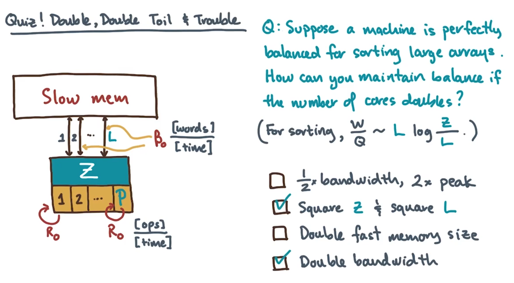

Of the four available options, the following two are most conducive to maintaining balance in a doubled-core version of the original system:
  * square the fast memory size ($Z$ ) and square the transaction size ($L$ )
  * double the bandwidth ($\beta_0$ )

Consider each proposed adjustment in turn, as follows.

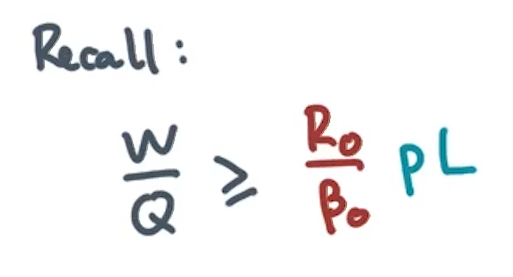

First, recall the balance principle (cf. Section 6):

$$
{W \over {Q}} \geq {{R_0} \over {{\beta _0}}} {PL}
$$

If the original system were *perfect*, then the ratio $W/Q$ could be examined directly in this manner, i.e.,:

$$
\bcancel{L} \log {Z \over L} \approx {{{R_0}} \over {{\beta _0}}}P \bcancel{L}  \Rightarrow \log {Z \over L} \approx {{{R_0}} \over {{\beta _0}}}P
$$

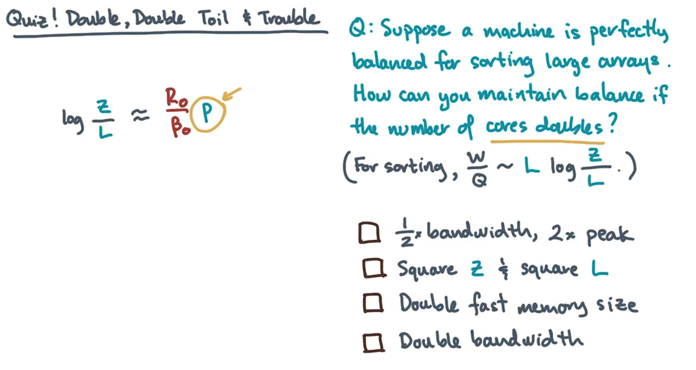

Now suppose that the cores are doubled (i.e., substituting $2P$ for $P$ ). Let us now consider the four proposed adjustments in turn.

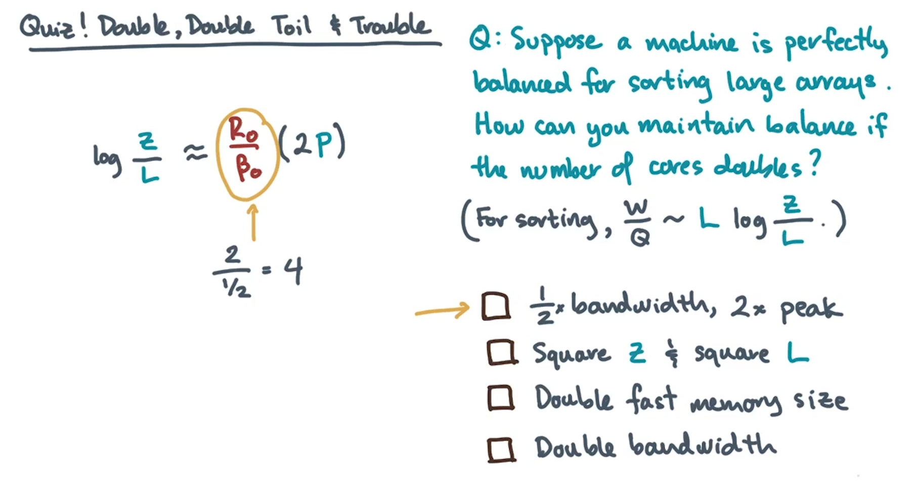

Given ${{R'}_0} = 2{R_0}$ and ${{\beta '}_0} = 2{\beta _0}$ (where in general $'$ denotes the doubled-cores version), this yields ${{{R'_0} \over {{\beta '}_0}}} = {2 \over {1 / 2}} = 4$ , which further imbalances the system.

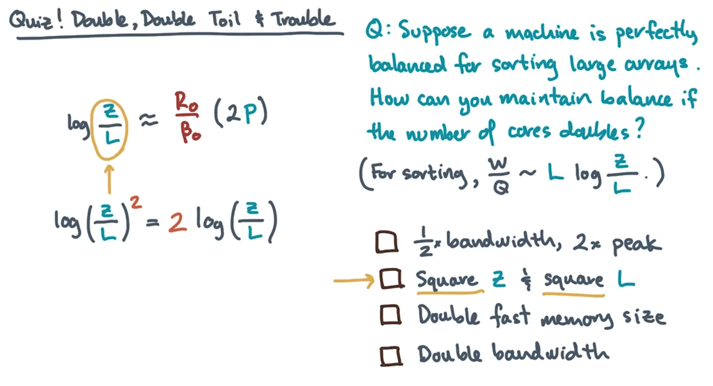

Given $Z' = Z^2$ and ${L'} = L^2$ , this yields $\log \left( {{{Z'} \over {L'}}} \right) = \log \left( {{{{Z^2}} \over {{L^2}}}} \right) = \log {\left( {{Z \over L}} \right)^2} = 2\log \left( {{Z \over L}} \right)$, which maintains balance in the system (i.e., factor $2$ cancels with that of $2P$ on the right-hand side).
  * ***N.B.*** This is a very ***expensive*** way to maintain balance. This suggests going from, for example, a `1 MB` cache in one generation to a `1 TB` cache in another.

Given $Z' = 2Z$ , this yields $\log \left( {{{Z'} \over L}} \right) = \log \left( {{{2Z} \over L}} \right) = \log \left( {{2 \over L}} \right) + \log \left( {{Z \over L}} \right)$ , this does not yield sufficient compensation to maintain balance (i.e., the additive term $\log \left( {{2 \over L}} \right)$ will not match $2P$ here).

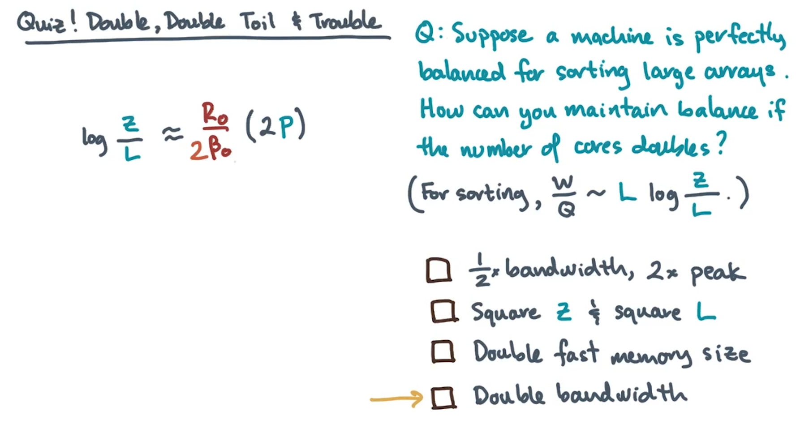

Given $\beta' = 2\beta$ , this yields ${{{R_0}} \over {{{\beta '}_0}}}\left( {2P} \right) = {{{R_0}} \over {\bcancel{2} {\beta _0}}}\left( {\bcancel{2}P} \right)$ , which maintains balance in the system.
  * ***N.B.*** Whether this is practical, recall the exponential trends (cf. Section 6). Increasing transistor density yields the ability to increase on-chip resources (e.g., number of cores, size of the fast memory, speed, etc.), however, historical trends suggest that bandwidth $\beta_0$ does ***not*** grow as fast as the product $R_0 P$ over time.

So, then, are there any additional available options? One additional possibility would be ${{R'}_0} = {1 \over 2}{R_0}$ .
  * ***N.B.*** The resulting effect of this is left as an exercise.

As this example demonstrates, for a computation such as comparison-based sorting, it appears that there are some fundamental ***limits*** which preclude building a balanced system. Indeed, this is a current "research frontier."

## 8. Power Limits

Today, one of the major ***physical constraints*** on computing platforms is **power**.
  * ***N.B.*** This may be familiar already from a previously taken computer architecture course, or equivalent. Nevertheless, this section will explore this concept in the present context of high-performance computing.

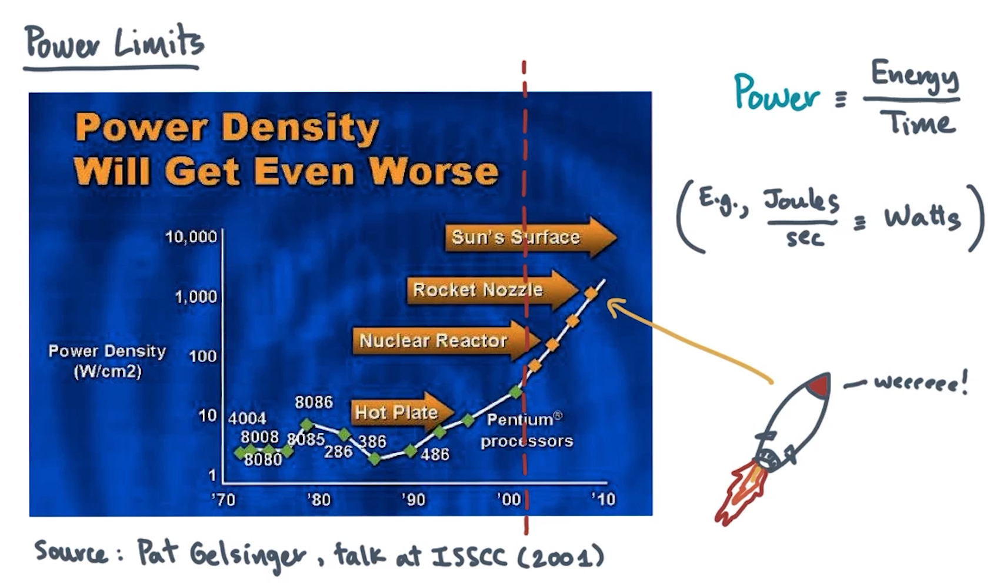

In the figure shown above, there is a well known plot created in 2001 by Pat Gelsinger, then at Intel. The plot tracks power per unit area (i.e., **power density**) across several generations of Intel's microprocessors, tracked up until the year 2001 (the year of the corresponding talk at the ISSCC conference), with further extrapolation into the "future" (2010).

Fundamentally, **power** is defined as follows:

$$
{\rm{Power}} \equiv {{{\rm{Energy\ consumed}}} \over {{\rm{Time}}}}
$$

having SI units of `Joules/sec`, equivalently defined as a `Watt` (`W`).

Previously, up until the early 2000s, sequential computers were manufactured to run progressively faster in such a manner by increasing the ***clock rate***. However, at that point, Gelsinger's prediction was that the required amount of power per unit area would increase exponentially in order to maintain this trend.

However, in reality, this potential issue was subsequently circumvented by ceasing to increase the clock rate, and instead proceeding onto ***multi-core*** chip design.

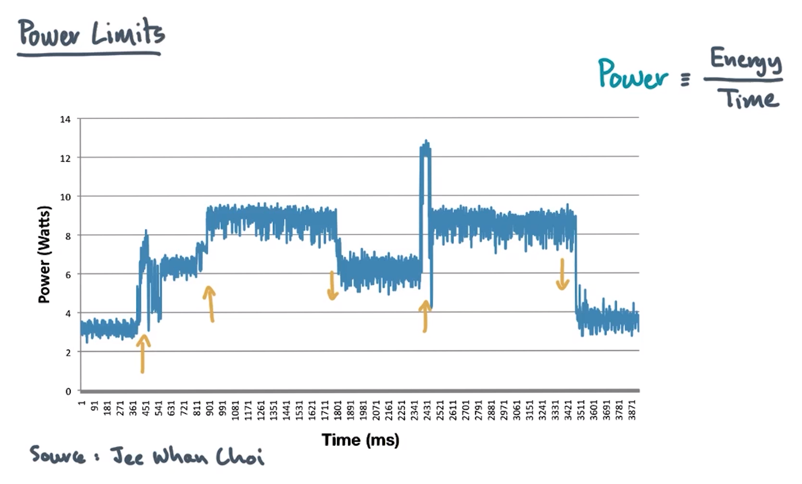

To understand the transition to multi-core processors, consider more closely the power consumed by a computer program (as in the figure shown above).
  * ***N.B.*** The data in the plot in the figure shown above is derived directly from that collected by one of Prof. Vuduc's previous graduate students.

The plot demonstrates power consumption at various sampled time intervals during program execution. Observe that there is fluctuation in these readings, corresponding presumably to the varied power behavior of the program throughout execution.

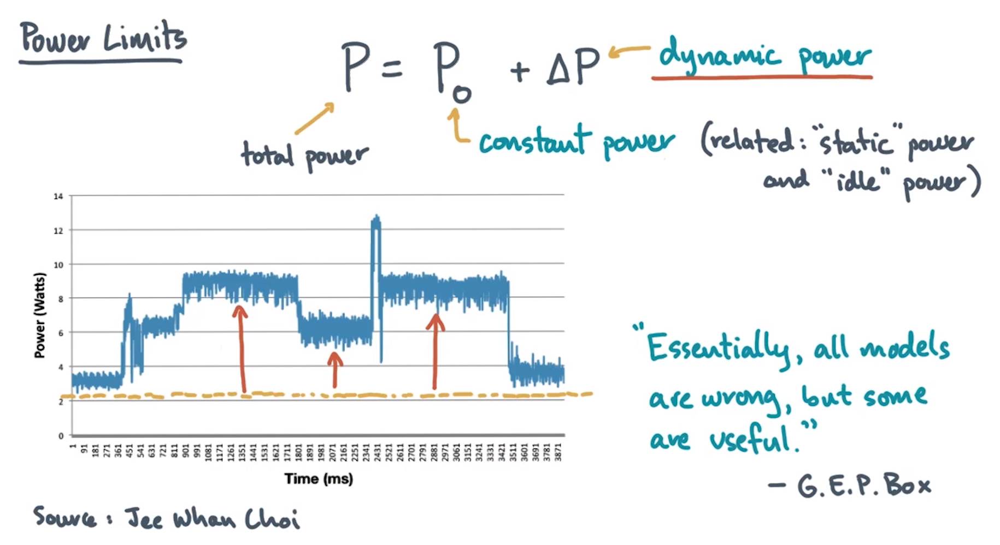

At any given point in time, a computing system's power consumption is comprised of two ***parts*** (as in the figure shown above): 
  * **constant power** ($P_0$ ) → this is the baseline amount of power consumed by the computing system, independently of the application(s) itself (as denoted by dotted yellow line in the figure shown above)
    * ***N.B.*** "constant power" in this context may also be called **static power** or **idle power** elsewhere. For purposes of this course, "constant power" will be a generally encompassing term for these related concepts.
  * **dynamic power** ($\Delta P$ ) → this is the variable/fluctuating power consumed by the application as it runs (as denoted by red arrows in the figure shown above)

Therefore, the **total power** ($P$ ) can be defined as:

$$
P = P_0 + \Delta P
$$

***N.B.*** Real circuits can be much more complex than this relatively simple model suggests, however, that is not a point of concern for purposes of present discussion. As G.E.P. Box states:

> "Essentially all models are wrong, but some are useful."

## 9. The Dynamic Power Equation

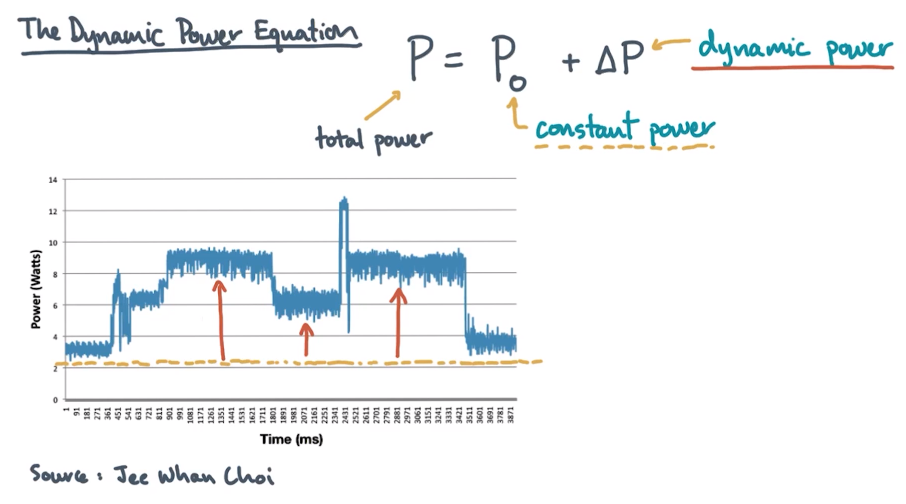

Recall (cf. Section 8) that in computing, **power** is comprised of two parts, constant power and dynamic power.

Now, consider some of the fundamentals of circuits which drive dynamic power.

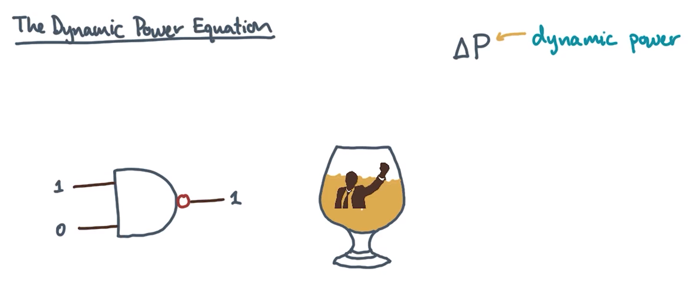

Given a **logic gate** (as in the figure shown above), it consumes a certain amount of physical energy (as depicted by the beverage glass in the figure shown above).

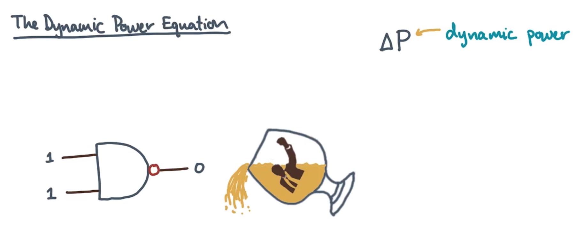

Now, suppose that an input to the gate is changed (as in the figure shown above). Consequently, the energy dissipates.

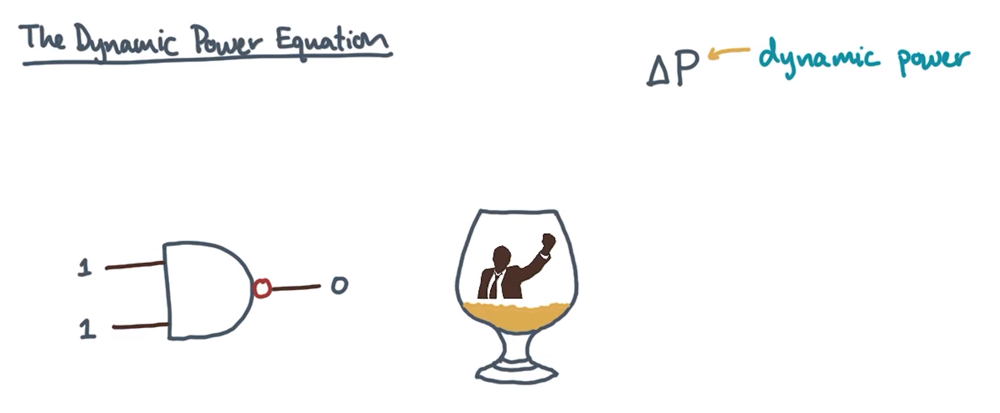

After the energy dissipates from the gate, it must subsequently restored/"refilled" (as in the figure shown above). However, when the circuit switches, there will be some energy ***lost*** during this process.

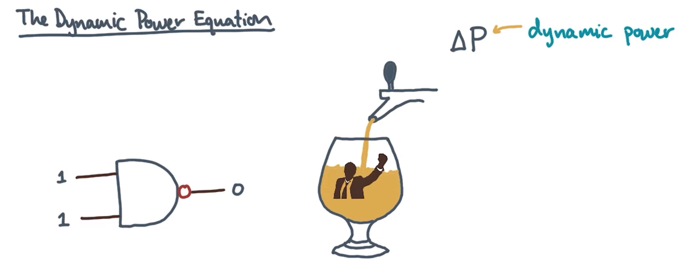

Consequently, this energy loss must be additionally "restored" (as in the figure shown above).

Let us know consider the following:
  * How much energy must be "restored" in this manner?
  * How frequently does this "switching" occur?

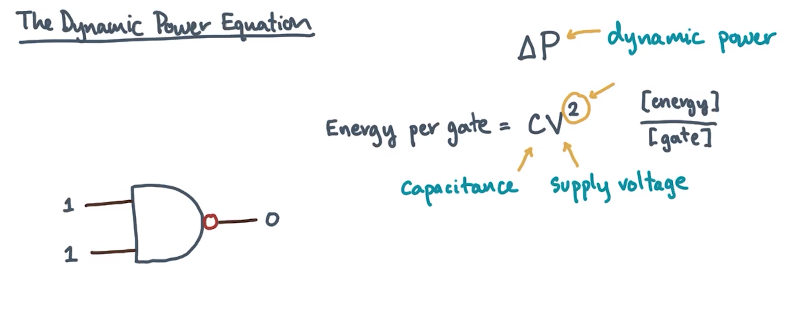

In order to compute the dynamic power, consider how much energy is consumed by the gate during a state change. This can be expressed as follows:

$$
\rm{Energy\ per\ gate} = CV^2
$$

where:
  * $C$ is the **capacitance** (a function of the material properties and the geometry of the logic gate)
  * $V$ is the **supply voltage** (a part of the circuit design)
    * ***N.B.*** The supply voltage $V$ can be tuned for some circuits over a defined range.

Furthermore, observe the *square* relationship to $V$ (i.e., $V^2$ ). For present purposes, it is not important to understand *why* this relationship exists, but rather it is important to note that this relationship $CV^2$ ***quantifies*** the energy itself.

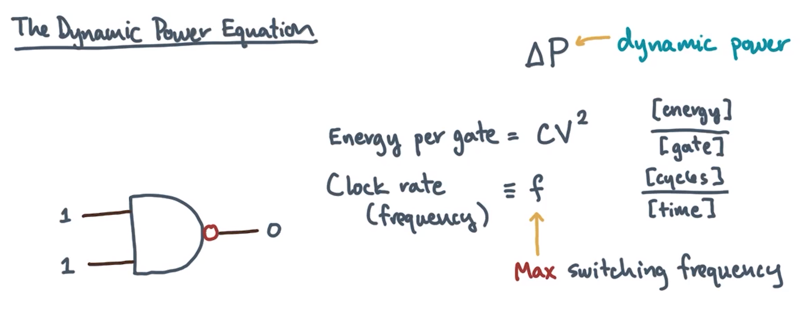

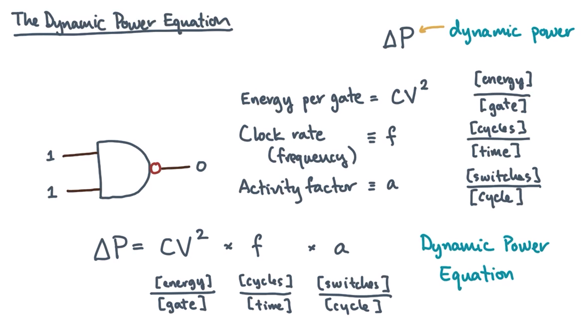

The frequency of switching is influenced by two ***factors***:
  * **clock rate**, or **frequency** ($f$ ) → determines the ***maximum*** number of times that the circuit can switch (i.e., change states) per unit time
    * ***N.B.*** The logic gate does not necessarily switch on *every* cycle, but rather the particular computation in question dictates the particular switching frequency (i.e., cycles per unit time).
  * **activity factor** ($a$ ) → the number of switching operations per cycle
    * ***N.B.*** Given the typical operation of a clock, the maximum value for $a$ is normalized to $1$ (i.e., full operation), and otherwise depends on the particular computation in question.

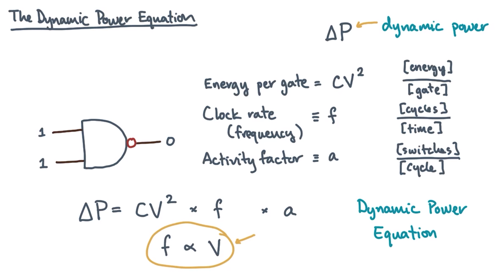

Taken together, the aforementioned parameters can be used to compute/express the dynamic power as follows (sometimes called the **dynamic power equation** accordingly):

$$
\Delta P = \underbrace {C{V^2}}_{\left[ {{\textstyle{{{\rm{energy}}} \over {{\rm{gate}}}}}} \right]} \times \underbrace f_{\left[ {{\textstyle{{{\rm{cycles}}} \over {{\rm{time}}}}}} \right]} \times \underbrace a_{\left[ {{\textstyle{{{\rm{switches}}} \over {{\rm{cycle}}}}}} \right]}
$$

Furthermore, note the relationship between $f$ (clock rate) and $V$ (supply voltage) as follows:

$$
f \propto V
$$

This proportionality must be ***maintained*** (i.e., decrease of one requires decrease of the other, and similarly increase of one requires increase of the other).
  * ***N.B.*** Briefly, the reason for this is that it is necessary in order to maintain the stability and reliability of the circuit itself (in particular, in the presence of environmental noise).

The implications of the dynamic power equation on performance are explored next in a quiz section.

## 10. Power Motivates Parallelism Quiz and Answers

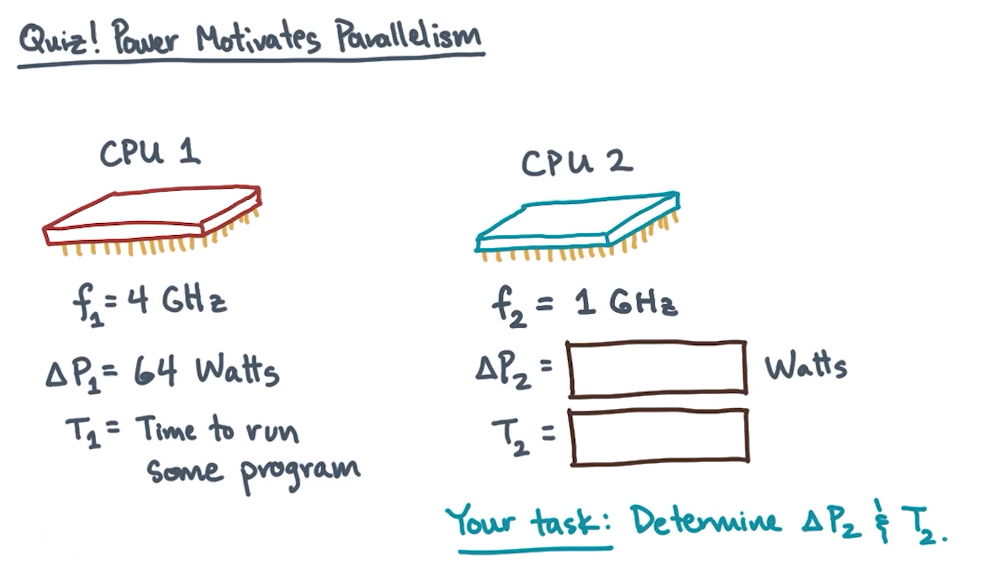

Consider two chip designs as follows:

| Design | Clock frequency (`GHz`) | Dynamic power (`W`) | Program execution time |
|:--:|:--:|:--:|:--:|
| 1 | $f_1 = 4$ | $\Delta P_1 = 64$ | $T_1$ |
| 2 | $f_2 = 1$ | $\Delta P_2 = ?$ | $T_2 = ?$ |

Here, $T_1$ is the time required for a given program to run on Design 1.

What is the corresponding dynamic power (expressed in `W`) and program execution time (expressed in terms of $T_1$ ) for Design 2?
  * ***N.B.*** As needed, assume that all other factors between the two designs are otherwise ***equal***.

### Answer and Explanation:

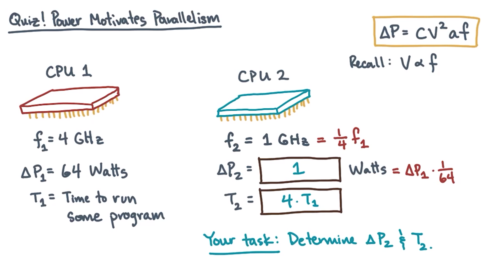

The corresponding performance characteristics for Design 2 are as follows:

| Design | Clock frequency (`GHz`) | Dynamic power (`W`) | Program execution time |
|:--:|:--:|:--:|:--:|
| 1 | $f_1 = 4$ | $\Delta P_1 = 64$ | $T_1$ |
| 2 | $f_2 = 1$ | $\Delta P_2 = 1$ | $T_2 = 4T_1$ |

With respect to the program execution time, by inspection, given a one-fourth slower clock frequency (i.e., ${f_2} = {1 \over 4}{f_1}$ ), then correspondingly the *same* program (all else equal) requires $4T_1$ total time for execution, $T_2$ .

Furthermore, With respect to the clock frequency (i.e., $f_2$ ), via the dynamic power equation (cf. Section 9):

$$
\Delta P = CV{}^2af \Rightarrow \underbrace {Ca}_{{\rm{constant}}} = {{\Delta {P_1}} \over {V_1^2{f_1}}} = {{\Delta {P_2}} \over {V_2^2{f_2}}} \Rightarrow \Delta {P_2} = {{V_2^2{f_2}} \over {V_1^2{f_1}}}\Delta {P_1}\underbrace  \Rightarrow _{{{\left( {V \propto f} \right)}^2}}\Delta {P_2} = {{f_2^3} \over {f_1^3}}\Delta {P_1} = {1 \over {64}}\Delta {P_2}
$$

These results suggest the "typical argument" made for transitioning to parallel (i.e., multi-core) processors, in favor of additionally increasing the clock frequency.
  * ***N.B.*** Suppose there *were* sufficient parallelism to utilize multiple cores, thereby allowing to create a multi-core processors comprised of four cores of Design 2. In this case, the program execution time would be equivalent to Design 1 (i.e., ${{T'}_2} = {T_1}$ ), however, the corresponding power consumption would be much lower (i.e., only $\Delta {{P'}_2} = 4\Delta {P_2}$ , or `4 W` total for the entire processor).

## 11. Power Knobs

***N.B.*** This quiz is more of a "pseudo-quiz," which is not *directly* testing course-related knowledge, but rather encourages making an "educated guess," in order to promote learning.

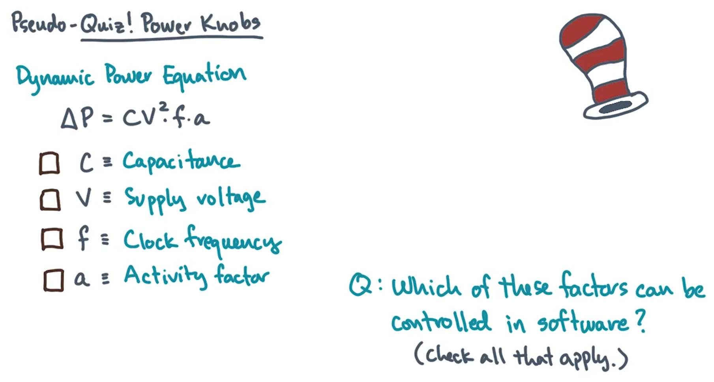

Recall (cf. Section 9) the dynamic power equation (as in the figure shown above). Consider the constituent factors as controllable "power knobs" for this purpose, i.e.,:
  * $C$ (capacitance)
  * $V$ (supply voltage)
  * $f$ (clock frequency)
  * $a$ (activity factor)
    * ***N.B.*** Recall (cf. Section 9) that $a$ is the frequency of state changes relative to elapsed cycles, normalized to a maximum value of $1$ (i.e., $100\%$ of cycles).

Which of these "knobs" might be within the control of algorithms and software?

### Answer and Explanation:

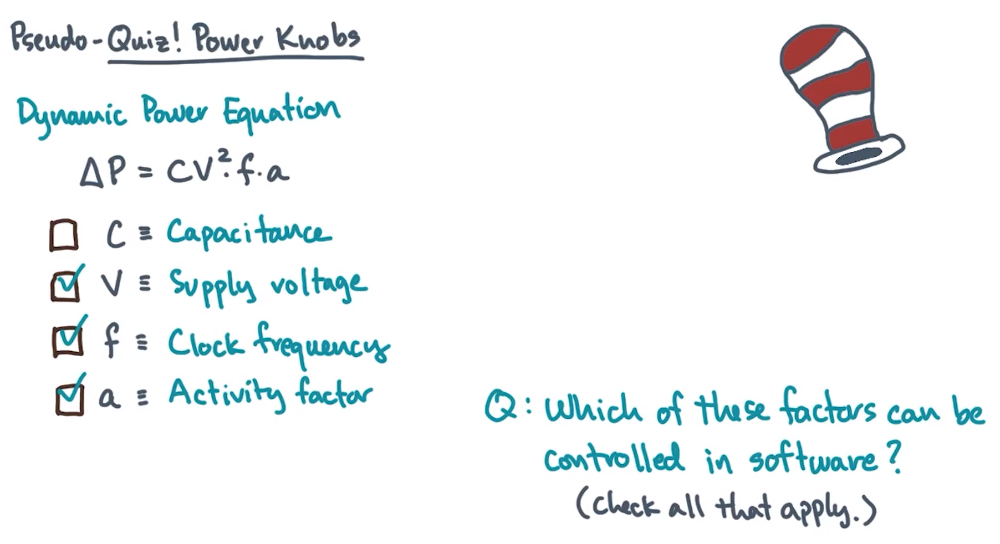

The capacitance $C$ does not apply here, because it is a geometric and electrical property of the materials used to manufacture the processor chip, which is not typically under the purview of software and/or algorithmic control.

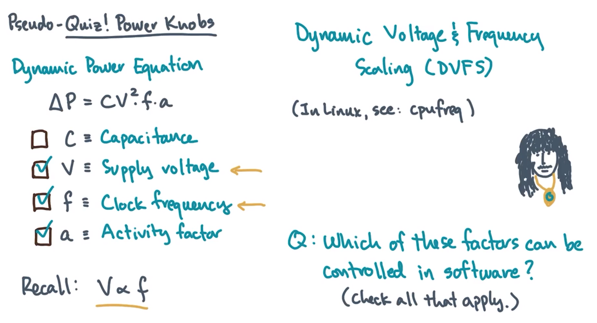

With respect to the supply voltage $V$ and clock frequency $f$ (which are related via $V \propto f$ , recall Section 9), many modern operating systems provide a corresponding feature called **dynamic voltage and frequency scaling** (**DVFS**), which allows to set either/both of these parameters.
  * ***N.B.*** DVFS is typically a feature of the hardware, however, but certain hardware processors and operating systems offer this as well via software-level control (e.g., `cpufreq` in Linux).

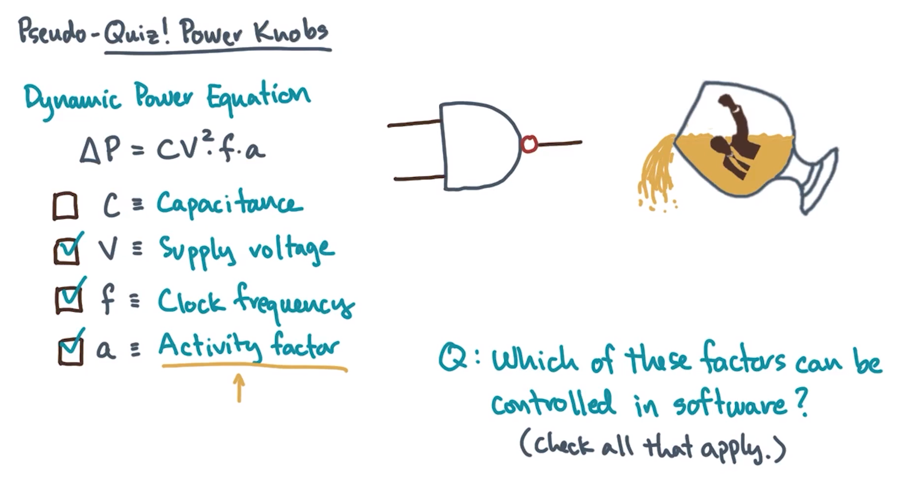

With respect to the activity factor $a$ , given that there are inherently large chunks of "processing" in the system which may not be immediately "needed" at a given point in time, then at a software level, it may be conceivable to simply "turn off" those chunks.

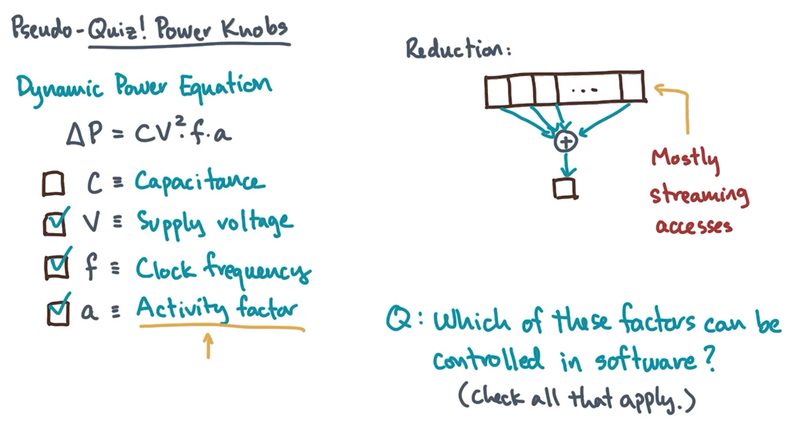

For example, suppose a ***reduction*** (cf. Lesson 1) is being performed (as in the figure shown above).
  * Algorithmically, most of this operation entails ***streaming*** input data. Correspondingly, there is no reason to cache this data; therefore, if the hardware provides the ability to disable caching, then that would be advisable to use in this scenario.

***N.B.*** Traditionally, the topic of the dynamic power equation is in the scope of hardware and low-level software. Nevertheless, it is discussed here briefly, as per Hillis' opening question for this lesson.

## 12. Power-less to Choose Quiz and Answers

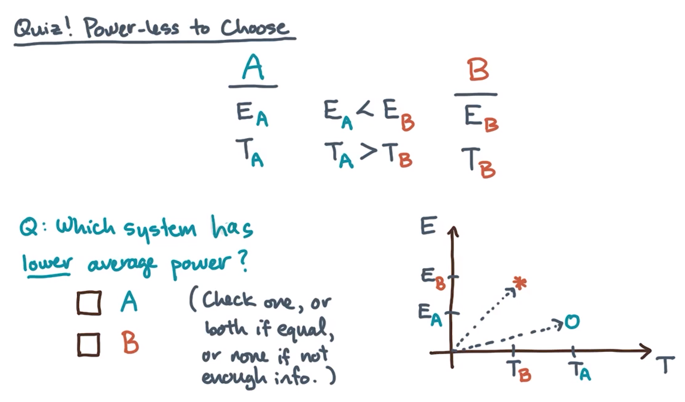

Consider the following two systems:

| Characteristic | System A | System B | Comparison |
|:--:|:--:|:--:|:--:|
| Energy use | $E_A$ | $E_B$ | $E_A < E_B$ |
| Execution time (same computation) | $T_A$ | $T_B$ | $T_A > T_B$ |

The relationship between $E$ and $T$ is plotted as a **phase diagram** in the figure shown above.

Which system has a *lower* average power usage? (Select either one or both, or neither if there is insufficient information provided to make this determination.)

### Answer and Explanation:

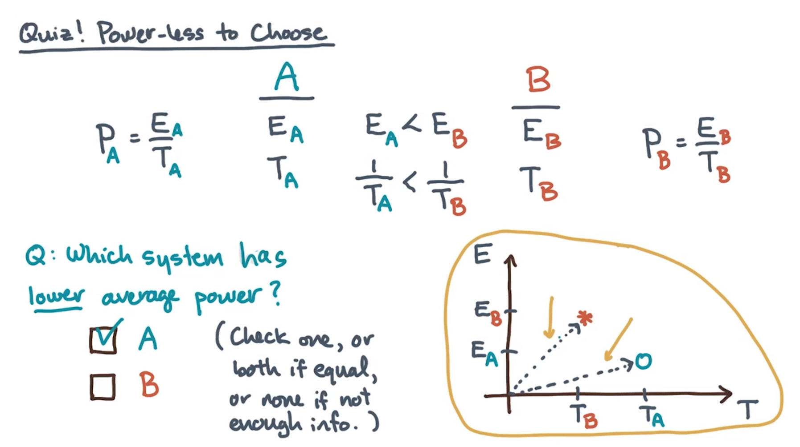

On average, System A uses less power.

Note that the average power usage is defined simply as follows:

$$
P = {E \over T} = E \cdot {1 \over T}
$$

Correspondingly, as given, the two systems compare as follows:

$$
{E_A} \cdot {1 \over {{T_A}}} < {E_B} \cdot {1 \over {{T_B}}} \Rightarrow {P_A} < {P_B}
$$

  * ***N.B.*** ${T_A} > {T_B} \Rightarrow {1 \over {{T_A}}} < {1 \over {{T_B}}}$ , assuming ${T_A} > 0$ and ${T_B} > 0$ .

This is also readily evident in the phase plot (as in the figure shown above), whereby the slope of System A is "narrower" than that of System B.

## 13. Exploiting Dynamic Voltage and Frequency Scaling (DVFS) Quiz and Answers

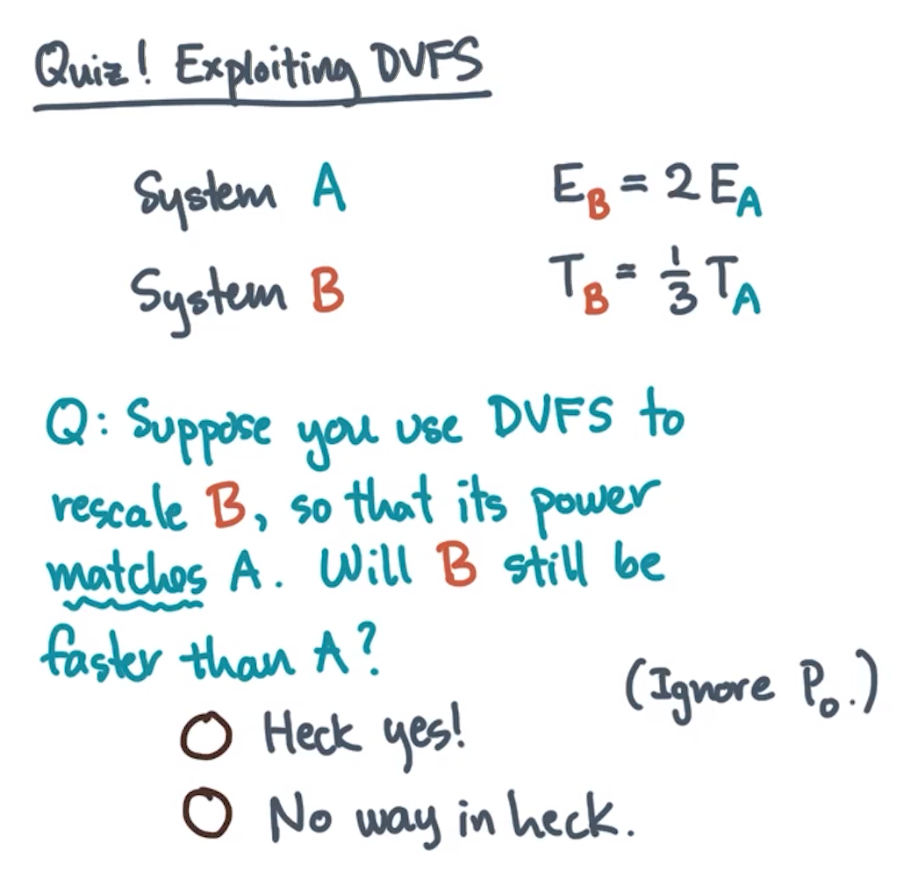

Consider the following two systems:

| Characteristic | System A | System B | Comparison |
|:--:|:--:|:--:|:--:|
| Energy use | $E_A$ | $E_B$ | $E_B = 2E_A$ |
| Execution time (same computation) | $T_A$ | $T_B$ | $T_B = {1 \over{3}} T_A$ |

Suppose that dynamic voltage and frequency scaling (DVFS) (cf. Section 11) is used to rescale System B, such that its average power usage is the ***same*** as that of System A. Consequently, will System B still be faster than System A?
  * ***N.B.*** For purposes of this quiz, ignore the effects of constant power ($P_0$ ), but rather only consider dynamic power ($\Delta P$ ).

### Answer and Explanation:

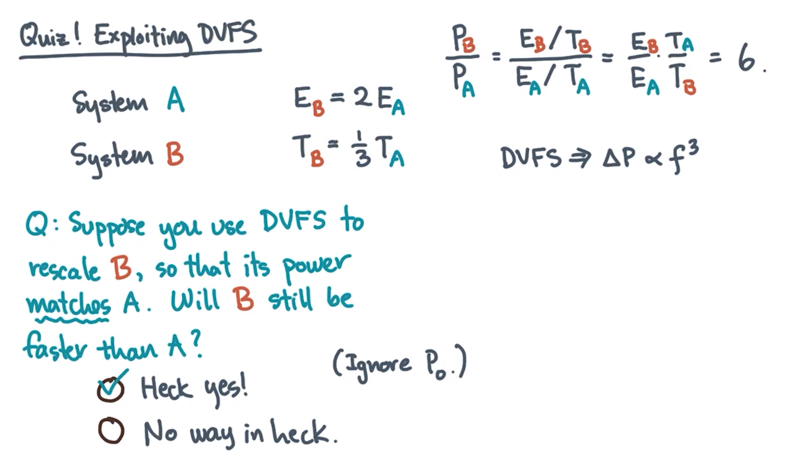

Indeed, System B is still faster than System A, subject to the constraint of equal average power usage. Intuitively, System B is three times faster than System A, but at only a cost of twice the energy usage.

Now, consider a further quantitative analysis of this conclusion.

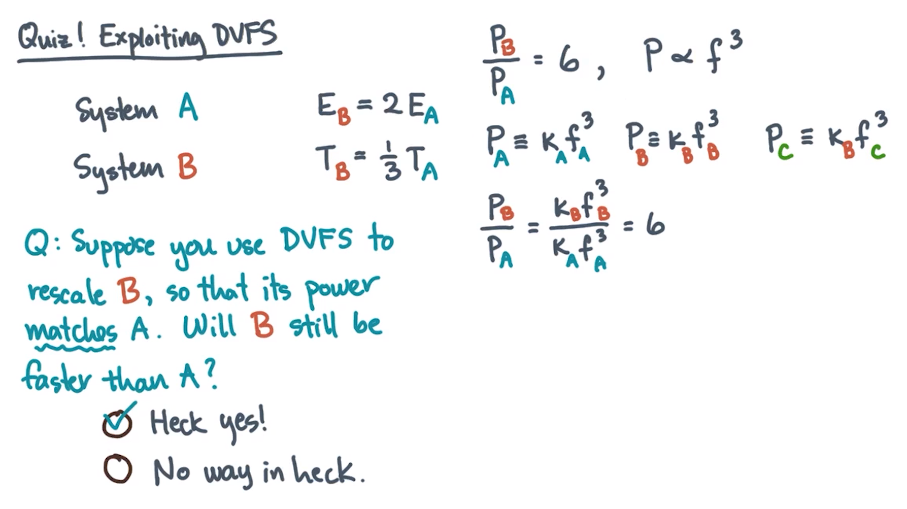

As given, System B uses six times as much power as System A, i.e.,:

$$
{{{P_B}} \over {{P_A}}} = {{{E_B}/{T_B}} \over {{E_A}/{T_A}}} = {{{E_B}} \over {{E_A}}} \cdot {{{T_B}} \over {{T_A}}} = 6
$$

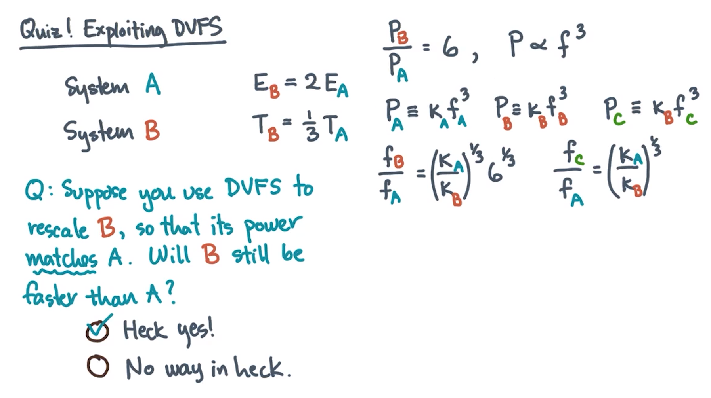

With respect to DVFS, the key relationship that it allows to control is that of $\Delta P \propto f^3$ . Correspondingly this gives rise to the following definitions (where $k$ is a system-dependent constant):

$$
{P_A} \equiv {k_A}f_A^3
$$

$$
{P_B} \equiv {k_B}f_B^3
$$

Furthermore, the rescaled version of System B (i.e., subscript $_C$ ) is similarly defined as follows:

$$
{P_C} \equiv {k_B}f_C^3
$$

  * ***N.B.*** $k_B$ is constant with respect to $f$ .

Given these definitions, the power relationships are therefore as follows:

$$
{{{P_B}} \over {{P_A}}} = {{{k_B}f_B^3} \over {{k_A}f_A^3}} = 6 \Rightarrow {{{f_B}} \over {{f_A}}} = {\left( {{{{k_A}} \over {{k_B}}}} \right)^{1/3}}{6^{1/3}}
$$

$$
{{{P_C}} \over {{P_A}}} = {{{k_B}f_C^3} \over {{k_A}f_A^3}} = 1 \Rightarrow {{{f_C}} \over {{f_A}}} = {\left( {{{{k_A}} \over {{k_B}}}} \right)^{1/3}}{1^{1/3}} = {\left( {{{{k_A}} \over {{k_B}}}} \right)^{1/3}}
$$

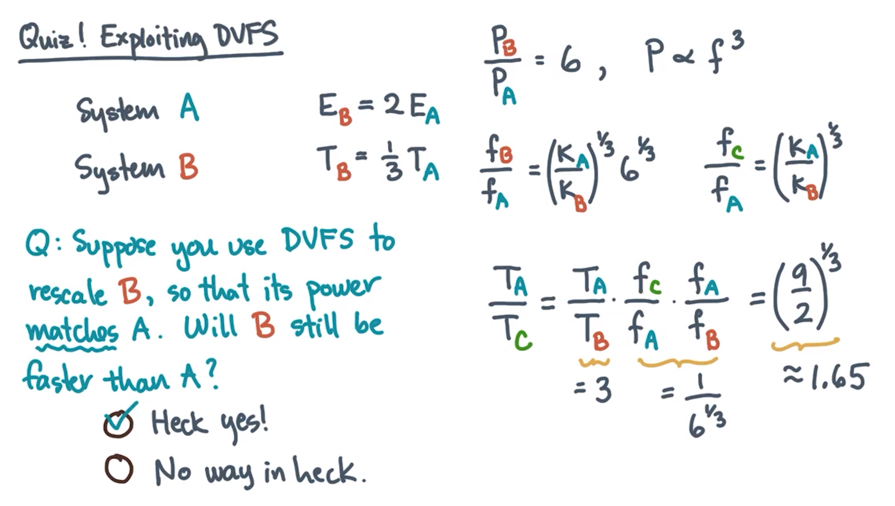

Therefore, the execution times are related as follows:

$$
{{{T_A}} \over {{T_C}}} = {{{T_A}} \over \bcancel{T_B}} \cdot {\bcancel{T_B} \over {{T_C}}}\underbrace  \Rightarrow _{{{{T_B}} \over {{T_C}}} \propto {{{f_C}} \over {{f_B}}}}{{{T_A}} \over {{T_C}}} = {{{T_A}} \over {{T_B}}} \cdot \underbrace {{{{f_C}} \over {{f_B}}}}_{{T_B}/{T_C}} = \underbrace {{{{T_A}} \over {{T_B}}}}_3\underbrace { \cdot {{{f_C}} \over \bcancel{f_A}} \cdot {\bcancel{f_A} \over {{f_B}}}}_{1 \cdot {1 \over {{6^{1/3}}}}} = {\left( {{9 \over 2}} \right)^{1/3}} \approx 1.65 > 1
$$

  * ***N.B.*** Here, ${{{T_B}} \over {{T_C}}} \propto {{{f_C}} \over {{f_B}}}$ is assumed, because System B and System C are the same except for their differing clock frequencies (i.e., execution time is inversely proportional to frequency, assuming that all other non-local compute costs can be neglected).

## 14. Algorithmic Energy Quiz and Answers

Now, consider a more direct relationship between time, energy, and power as a function of the algorithm itself.

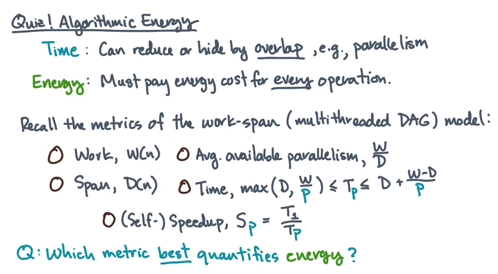

With respect to time and energy, the high level difference between these is as follows:
  * **Time** can be reduced or hidden via ***overlap*** (e.g., parallelism)
  * **Energy** incurs a cost for ***every*** operation

The simplest model for parallelism is the **work-span** (or **multi-threaded directed acyclic graph (DAG)** model), as discussed later in the course. In this model, there are several abstract algorithmic costs under consideration, as follows:
  * Work, $W(n)$
  * Span, $D(n)$
  * Average available parallelism. $W/D$
  * Execution time $T_P$ (given peak processors), as bounded by $\max \left( {D,{W \over P}} \right) \le {T_P} \le D + {{W - D} \over P}$
  * (Self-)speedup, $S_P = {T_1 \over{T_P}}$
    * ***N.B.*** This definition of speedup is "relaxed," in the sense that it is self-referential (where, rather than the equivalent best sequential-time, instead $T_1$ here represents the time of the parallel algorithm when running on a single processor). Otherwise, if the algorithm is work-optimal, then self-speedup and "conventional" speedup (i.e., relative to the best sequential case) approach parity/equivalence asymptotically.

So, then, of these five metrics, which is the ***best*** to use for quantifying energy? (Select only *one*.)

### Answer and Explanation:

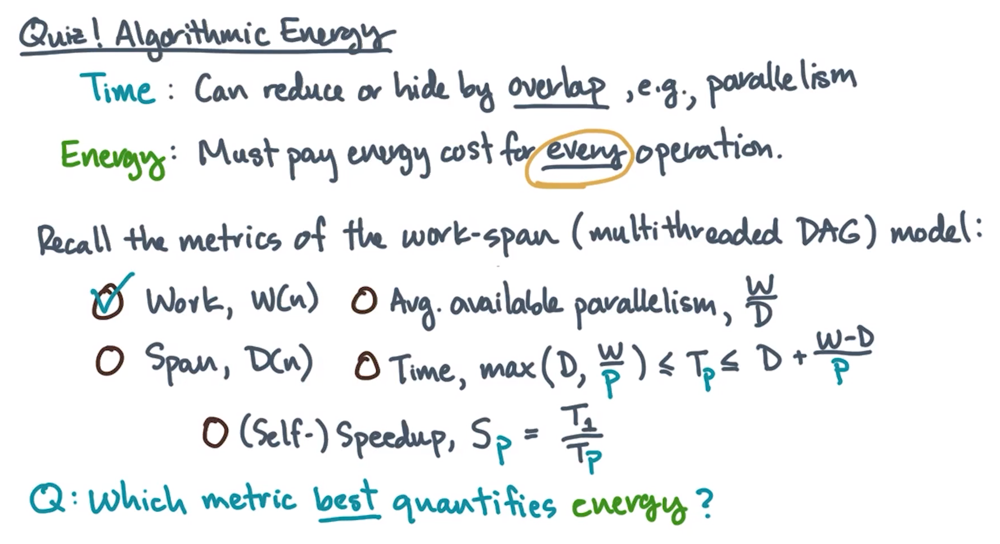

Given these options, work ($W(n)$ ) best quantifies the energy usage.

Since, by definition, energy entails an expenditure of energy for ***every*** operation, this is indeed congruent with what work represents (i.e., a count of ***every*** operation in the algorithms). Therefore, work is the appropriate analogy for measurement of asymptotic energy.
  * ***N.B.*** This gives rise to an insightful ***implication***: At an algorithmic level, if energy is of primary concern, and supposing that the energy per operation is bounded by some constant, then finding work-optimal algorithms is essential to achieve this objective.

## 15. Algorithmic Dynamic Power Quiz and Answers

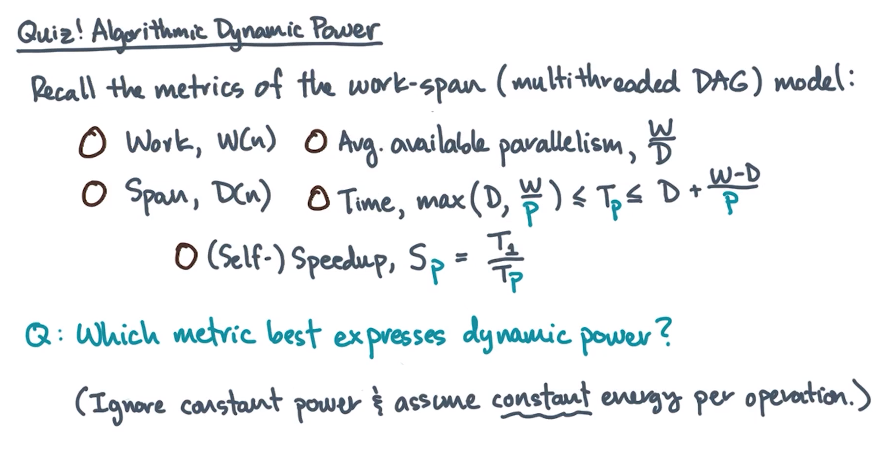

Recall (cf. Section 14) the algorithmic metrics of the work-span model (also called the multi-threaded directed acyclic graph [DAG] model) as follows:
  * Work, $W(n)$
  * Span, $D(n)$
  * Average available parallelism. $W/D$
  * Execution time $T_P$ (given peak processors), as bounded by $\max \left( {D,{W \over P}} \right) \le {T_P} \le D + {{W - D} \over P}$
  * (Self-)speedup, $S_P = {T_1 \over{T_P}}$

Of these five metrics, which is the ***best*** to use for quantifying dynamic power? (Select only *one*.)
  * ***N.B.*** Ignore constant power ($P_0$ ), and assume ***constant*** energy per operation.

### Answer and Explanation:

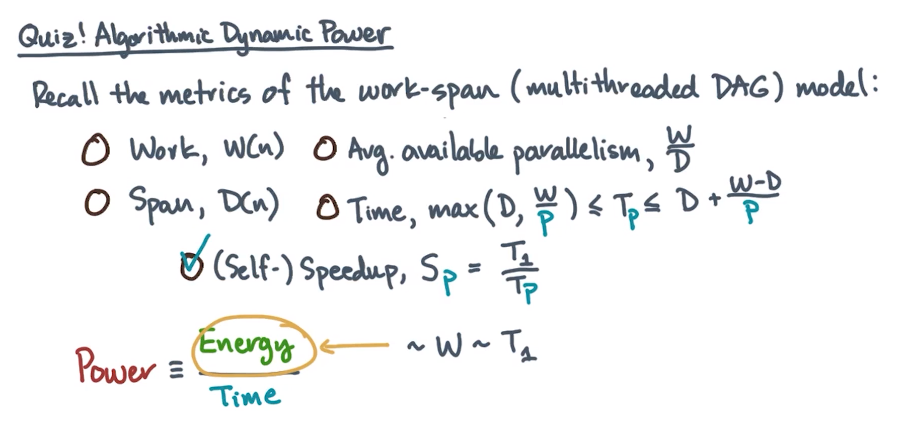

Given these options, (self-)speedup ($S_P$ ) best quantifies the dynamic power.

Recall (cf. Section 8) the definition of power as follows:

$$
{\rm{Power}} \equiv {{{\rm{Energy\ consumed}}} \over {{\rm{Time}}}}
$$

In this context, energy is roughly equivalent to algorithmic work, which in turn is proportional to the execution time, i.e.,:

$$
E \propto W \propto T_1
$$

Correspondingly, per definition of (self-)speedup:

$$
S_P = {T_1 \over{T_P}} \propto {W \over{T_P}} \propto {E \over{T_P}}
$$

More intuitively, if it is necessary to run on low power, then the primary options to achieve this objective are either/both of the following:
  * Utilize very little energy
  * Operate very slowly

Therefore, with respect to ***energy optimality***, there underlies this fundamental "tension" between speed and power.
  * By corollary, high speed requires less time, which implies more power usage.

## 16. Parallelism and Dynamic Voltage and Frequency Scaling (DVFS) Quiz and Answers

Consider the following: Can algorithmic parallelism be used to increase speed without otherwise increasing power?

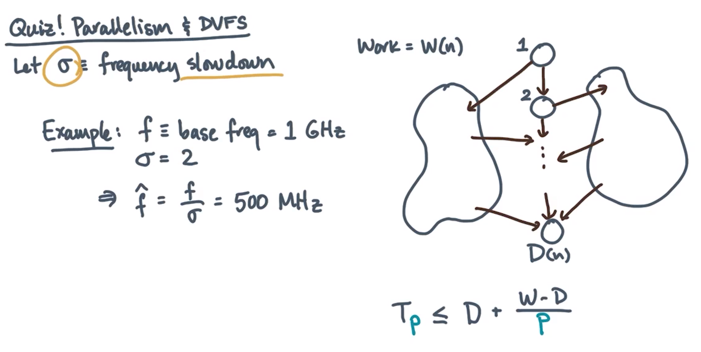

For the sake of argument, consider an algorithm in the work-span model (as in the figure shown above).
  * ***N.B.*** The work-span model is discussed in more detail later in the course.

Suppose that Brent's theorem holds, provided that the algorithm runs at some base clock frequency on a parallel random access memory (PRAM) machine with $P$ cores.

Furthermore, suppose that the clock is slowed down by a factor of $\sigma$ with respect to the base frequency $f$ , for example, given $f = 1\ \rm{GHz}$ and $\sigma = 2$ :

$$
\hat f = {f \over \sigma } = 500{\rm{\ MHz}}
$$

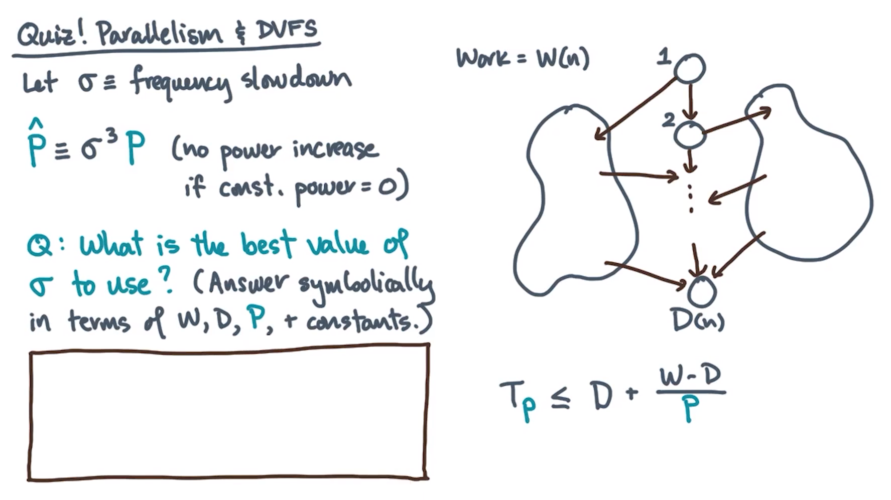

A frequency change also implies a decrease in the power per core (i.e., in order to maintain constant power for the overall system, i.e., $P_0 = 0$ ). Per the dynamic power equation (cf. Section 9), this implies the following definition:

$$
\hat P \equiv {\sigma ^3}P
$$

***N.B.*** Here, the factor $\sigma^3$ represents the increase in processing cores while maintaining constant overall system power (subject to the constraint of constant power $P_0 = 0$ ).

In this scenario, what is the best value of $\sigma$ to use? (Answer symbolically in terms of $W$, $D$, $P$, and other constants.)

### Answer and Explanation:

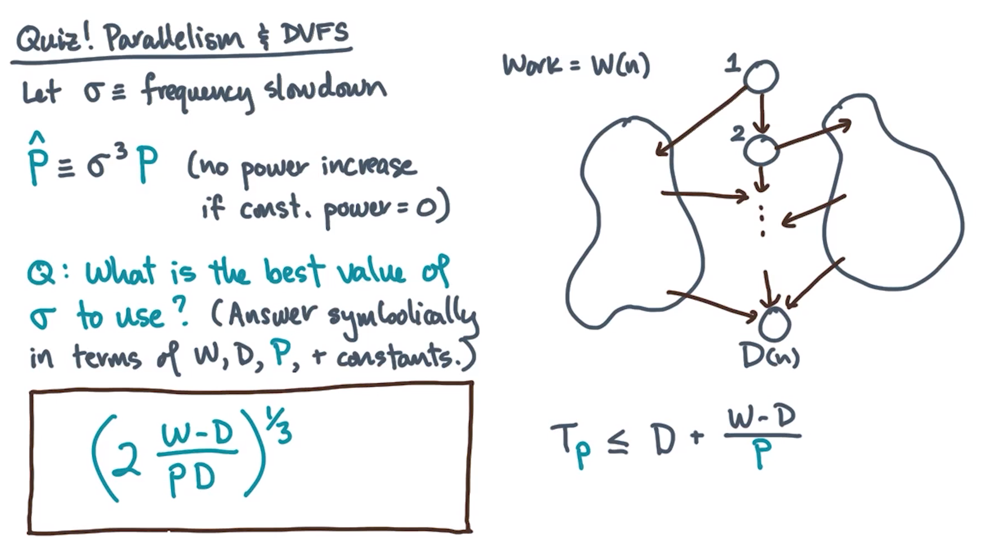

The optimal value of $\sigma$ is as follows:

$$
{\sigma _ * } = {\left( {2{{W - D} \over {PD}}} \right)^{1/3}}
$$

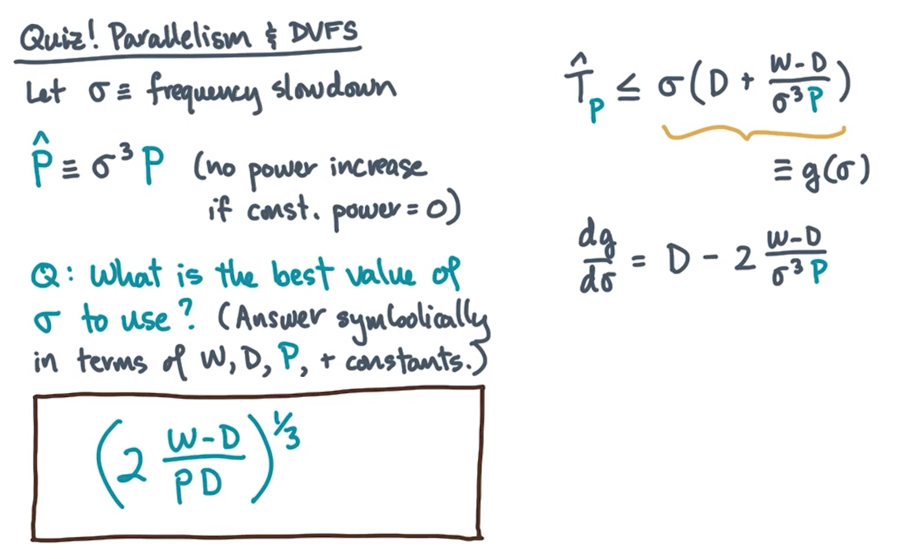

To derive this particular result, first consider Brent's theorem, which gives the following:

$$
{{\hat T}_P} \le \underbrace {\sigma \left( {D + {{W - D} \over {{\sigma ^3}P}}} \right)}_{ \equiv g\left( \sigma  \right)}
$$

This defines an upper bound on time (i.e., ${\hat T}_P$ ), given that there is a slowdown on a per-core basis (factor $\sigma$ ) but more cores are used to compensate for this (factor ${\sigma ^3}P$ ).

Furthermore, defining the right-hand side as $g(\sigma)$ , this can be minimized as follows:

$$
{{dg} \over {d\sigma }} = D - 2\left( {{{W - D} \over {{\sigma ^3}P}}} \right)\underbrace  \Rightarrow _{{\sigma _ * } \equiv {{dg} \over {d\sigma }} = 0}0 = D - 2\left( {{{W - D} \over {{\sigma _ * }^3P}}} \right) \Rightarrow {\sigma _ * } = {\left( {2{{W - D} \over {PD}}} \right)^{1/3}}
$$

***N.B.*** For a more comprehensive argument, verify that ${{{d^2}g} \over {d{\sigma ^2}}} > 0$ in order to ensure that $\sigma_*$ is indeed a minimizer.

A more interesting question is this: Can a ***speedup*** be achieved in this manner?
  * The answer to this depends on the value of $P$ itself, however, in certain cases this *can* indeed occur. (This is left as an exercise to the reader.)

## 17. Conclusion

It is now evident that even simple models of computers (including those that ignore the memory hierarchy, parallelism, and communication) have nevertheless been extremely productive, yielding a vast array of applications without "comprehensive regard" for the physical realities of the underlying machines.

However, if indeed the fast approach of the end of Moore's law is imminent, thereby yielding new performance bottlenecks (e.g., limits on power and energy), then this again begs the basic questions posed by Danny Hills originally in the 1980s, e.g.,:
  * How to make the most of the machines which are available?
  * Is there a role for physical reality in the design of algorithms and software?
  * How can all of this be considered while still maintaining productivity of developers?

These types of questions are indeed at the frontier of current high-performance computing research, which include some "whackier" ideas such as quantum computing and biological computing, representing some of the more recent "extremes" of physical computation.
  * ***N.B.*** These topics are beyond the scope of this course, but are mentioned here for further consideration.
