# Algorithmic Time: Energy and Power

## 1. Introduction

At the Massachusetts Institute of Technology (MIT) in the early 1980s, Danny Hillis attempted to build a new supercomputer, called a **connection machine**, characterized by lights blinking according to where communication was occurring within the system.

Hillis' consequent PhD dissertation on this work subsequently won the doctoral dissertation award from the Association of Computing Machinery (ACM) in 1985, one of the highest honors in the field of computer science.

This award was conferred despite the dismal title of its concluding chapter:

> Chapter 7: New Computer Architectures and Their Relationship to Physics or, Why Computer Science is ***No Good***

Hillis was critiquing parallel algorithms research at the time. Hillis argued that, ultimately, an algorithm must run on a ***physical machine***, subject to the constraints of the laws of physics. In this vein, Hillis contended that algorithms researchers were "overly generously" abstracting away too many such (arguably non-trivial) details regarding the ***physical costs*** of computation.
  * In particular, Hillis was concerned with the speed of light, which fundamentally limits how fast information can travel.

Whether such physical costs ***can*** indeed be "reasonably ignored" is still an open question. However, there is nevertheless merit to Hillis' assertion that, at a minimum, such physical costs are at least "relevant considerations."

This lesson will begin from this line of thinking, and poses the following question accordingly:

> What would it mean to consider the ***physical costs*** in designing an algorithm?

## 2. Speed Trends Quiz and Answers

This lesson will proceed through a series of calculations, partly inspired by Danny Hillis' PhD thesis, in order to draw conclusions regarding the physical limits of computation.

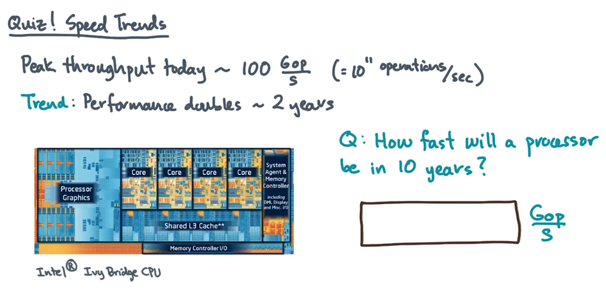

Consider the quad-core Intel Ivy Bridge processor from 2015 (as in the figure shown above).

In the best case, this processor executes approximately 100 billion operations per second, or equivalently `100 Gops/s` (where `1 Gop/s` [gigaop] is $10^{11}$ operations per second).

Roughly speaking, this rate of throughput doubles approximately every 2 years.

Given this information, how fast will a comparable processor be in 10 years (i.e., 2025)? (Express the answer in units of `Gop/s`.)

### ***Answer and Explanation***:

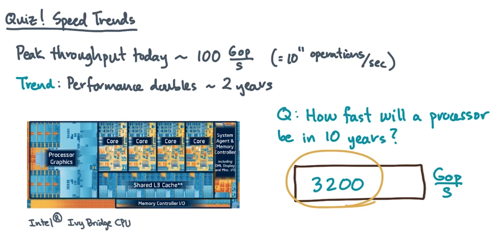

In 2025, an equivalent processor will perform `3200 Gop/s` (or equivalently `3.2 Top/s`).

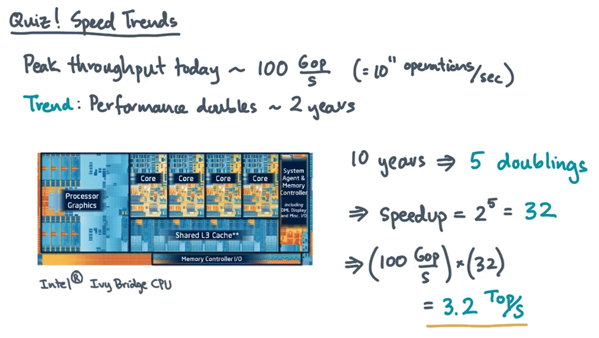

In 10 years, there will be `5` doublings, implying a performance speedup of $2^5 = 32$ . Therefore, relative to a 2015 processor, a 2025 processor will run at $100 \times 32 = 3200$ `Gop/s` (or equivalently `3.2 Top/s`).

***N.B.*** Even in 2015, there are specialized processors capable of achieving on the order of trillions of operations per second. Nevertheless, the purpose of this exercise is to give an intuitive feel for peak performance and the corresponding rate of growth that exponential trends bring.

## 3. Speed Limits Quiz and Answers

This quiz further explores the notion of a computational "speed limit."

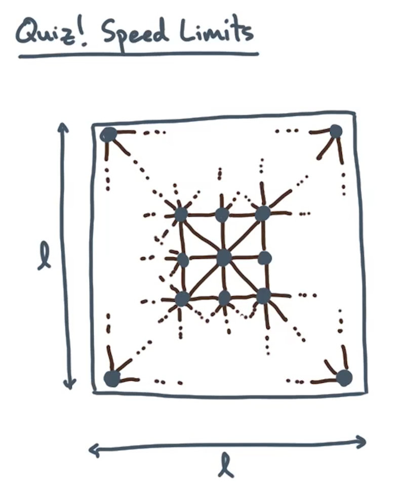

Consider a two-dimensional mesh of physical processors (as in the figure shown above). Imagine that such a many-core processor fits on a physical die of size $\ell  \times \ell$ .

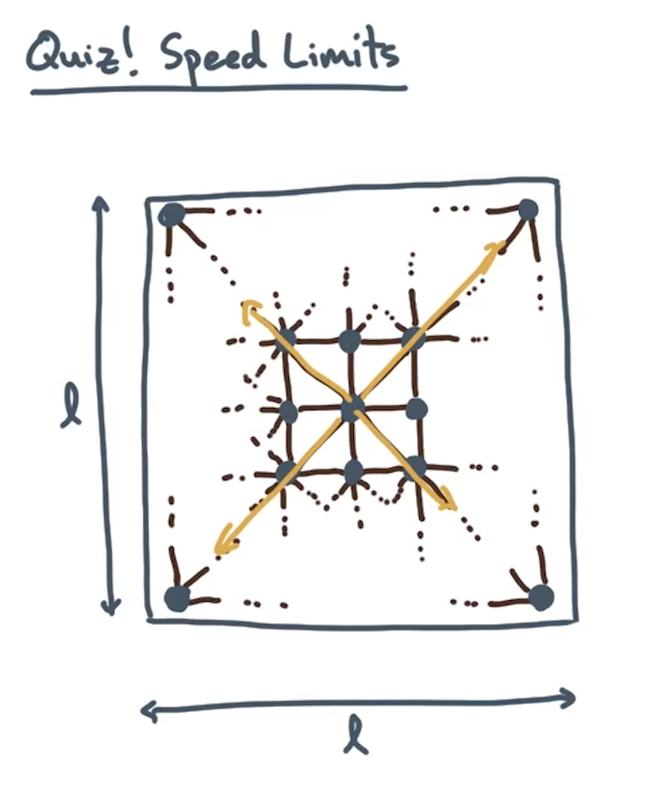

Within the mesh, every interior point is connected to its eight nearest neighbors. Correspondingly, this means that each processing unit can communicate along diagonal routes (as in the figure shown above).

Now, consider a ***single operation*** on this mesh, defined as follows.

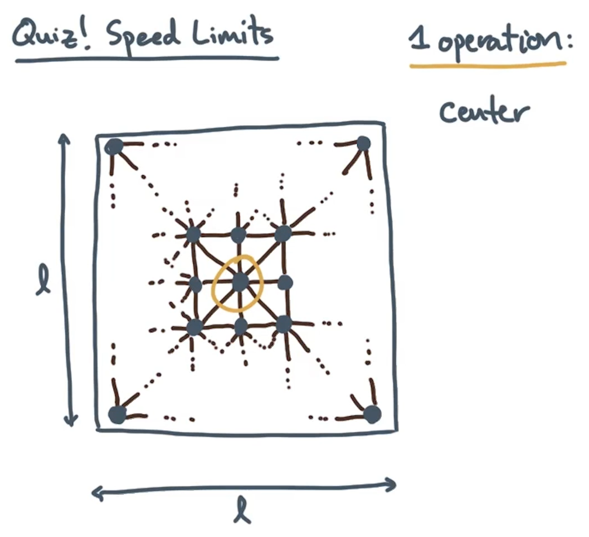

The operation begins at the processing unit located at the center (as in the figure shown above).

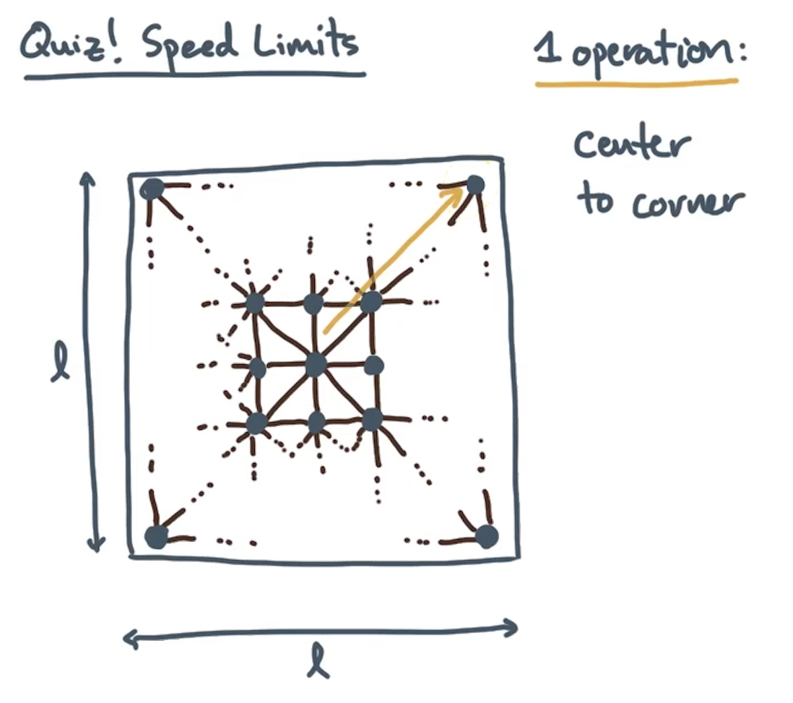

The operation subsequently travels as a signal to a unit at one of the corners (as in the figure shown above).

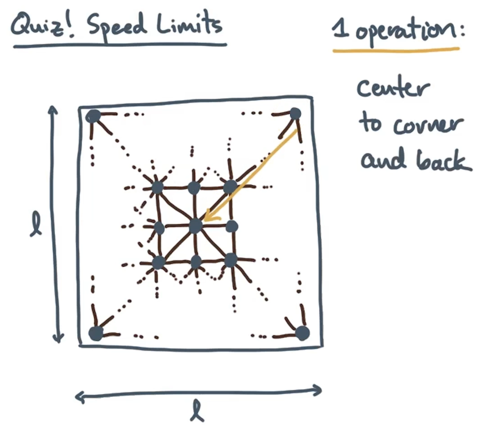

The operation then reverses its path, making its way back to the center (as in the figure shown above).

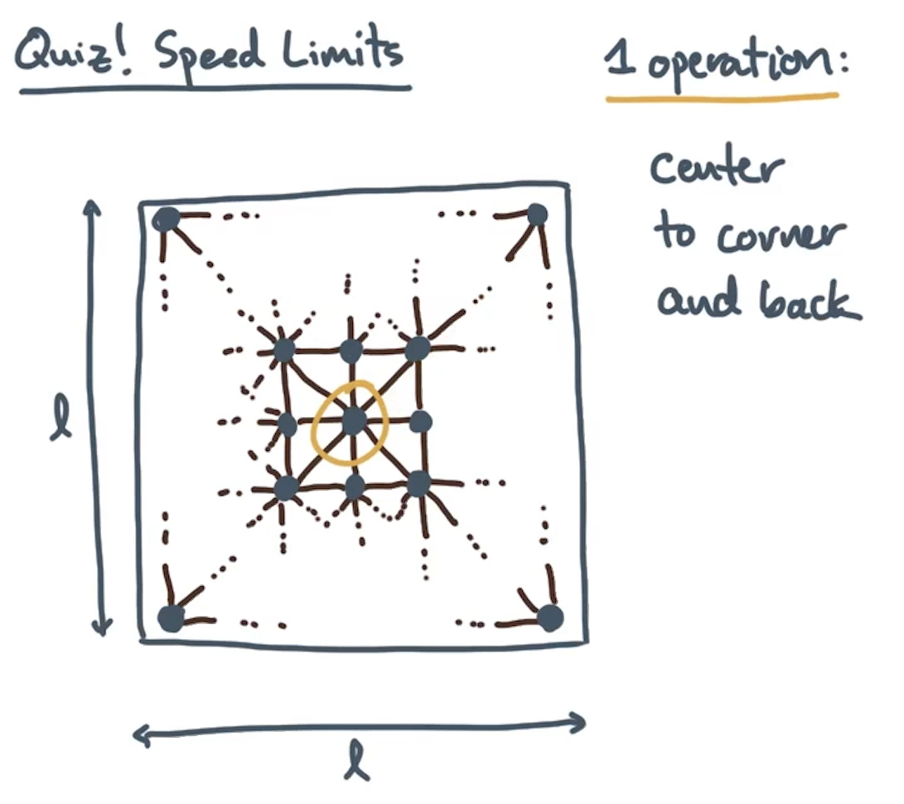

Finally, the operation returns back to the center (as in the figure shown above).

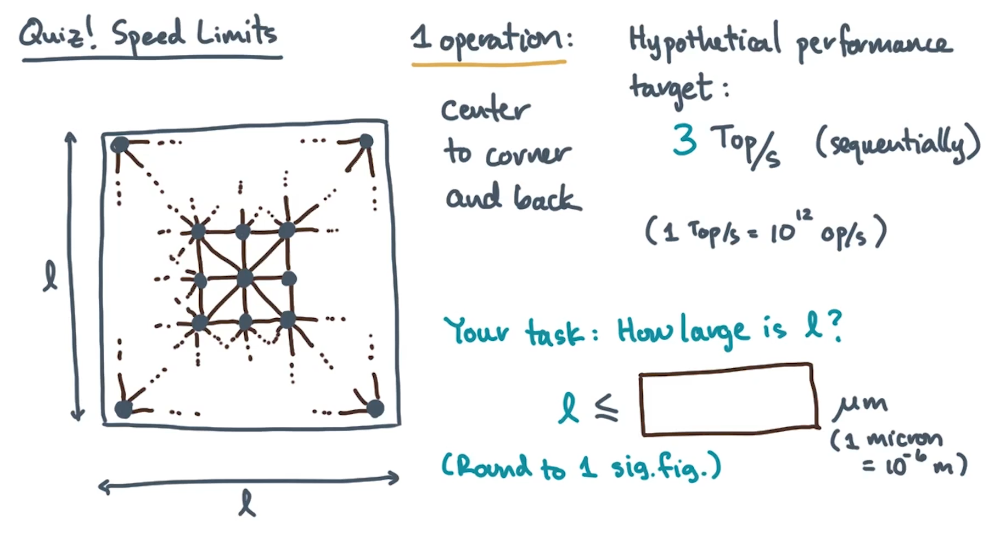

Now, consider performing 3 trillion such operations per second (i.e., `3 Top/s`) in a ***sequential*** manner.
  * ***N.B.*** Recall (cf. Section 2) that `1 Top/s` is equivalent to $10^{12}$ operations per second.

If the signal travels at the speed of light, what is the maximum physical dimension of this mesh (i.e., $\ell$ )? (Provide the answer in units of microns [$\mu m$ ], where 1 micron is $10^{-6}$ m. Round the answer to 1 significant figure.)

***N.B.*** The speed of light is approximately $3 \times 10^{8}$ `m/s`.

### ***Answer and Explanation***:

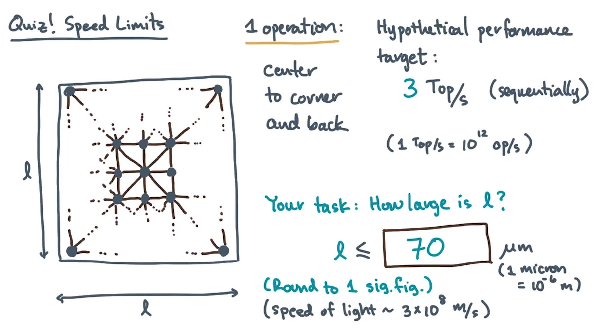

The maximum physical dimension of the mesh is $\ell \leq 70\ \mu \rm{m}$ .

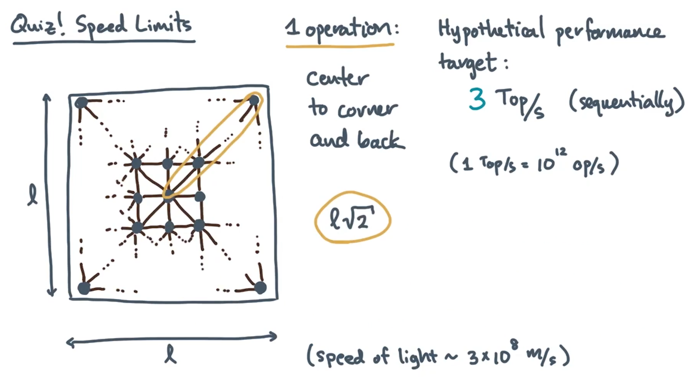

The path length of a single round trip is $2 \times [(\ell \sqrt{2})/2] = \ell \sqrt{2}$ .

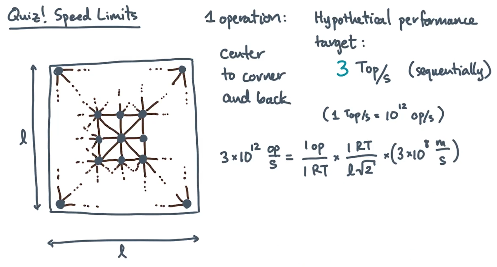

Performing 3 trillion of these round trips per second therefore implies the following:

$$
3 \times {10^{12}}{\rm{\ }}{\textstyle{{{\rm{op}}} \over {\rm{s}}}} = {\textstyle{{1{\rm{\ op}}} \over {1{\rm{\ round\ trip}}}}} \times {\textstyle{{1{\rm{\ round\ trip}}} \over {\ell \sqrt 2 }}} \times \underbrace {\left( {3 \times {{10}^8}{\rm{ }}{\textstyle{{\rm{m}} \over {\rm{s}}}}} \right)}_{{\rm{speed\ of\ light}}} \Rightarrow \ell  = 70{\rm{\ \mu m}}
$$

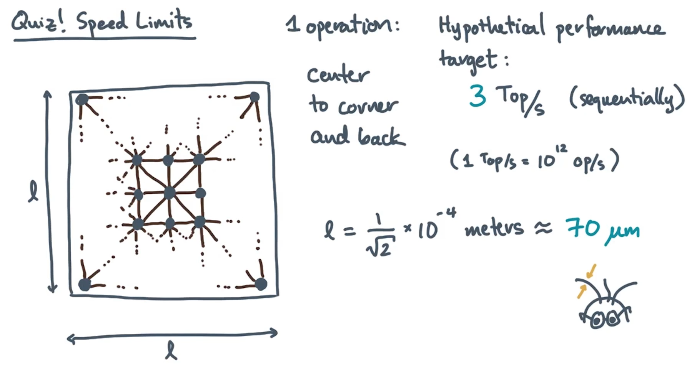

$70\ \rm{\mu m}$ is approximately equivalent to the width of a human hair. Therefore, the implication of this exercise is that in order to hit this computational speed target (i.e., the speed of light), assuming that the information propagates at this speed, then the corresponding processor must be ***incredibly*** small to achieve this.

## 4. Space Limits Quiz and Answers

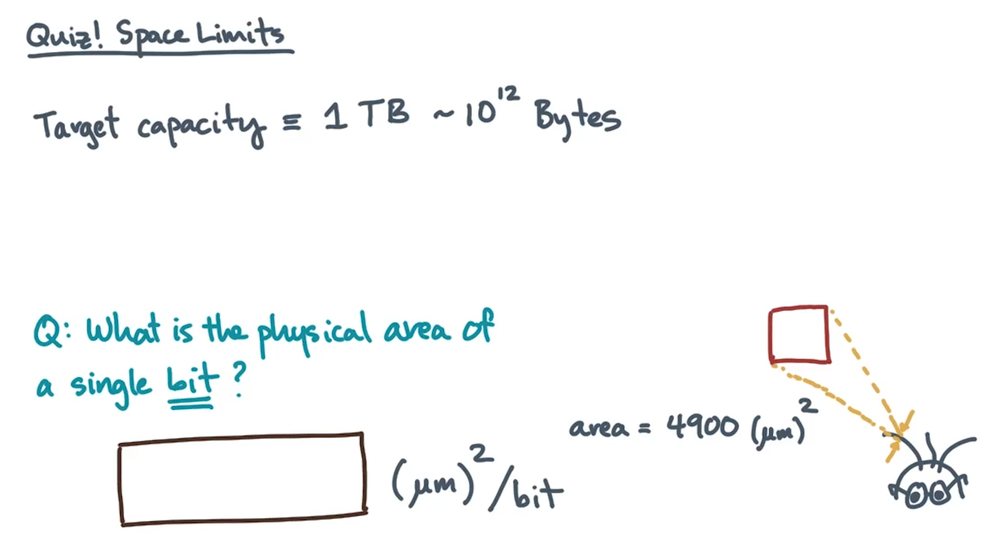

Consider a memory chip whose area is equivalent to the cross-sectional area of a human hair, or approximately $4900 \rm{\ \mu m}^2$ .

Now, suppose it is desired to store `1 TB` of data on such a memory chip.
  * ***N.B.*** $1\ \rm{TB} = 10^{12} \rm{\ bytes}$ .

What is the ***physical area*** of a ***single bit*** (***not*** a byte) on such a chip? (Express the answer in units of $\rm{\ \mu m}^2/\rm{bit}$ .)

### ***Answer and Explanation***:

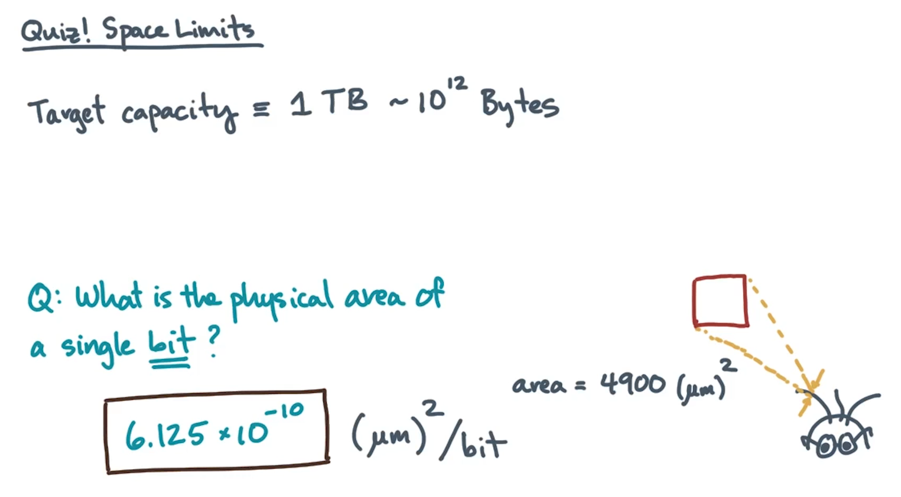

The corresponding size of a single bit given the target capacity of `1 TB` is $6.125 \times 10^{-10}\rm{\ \mu m}^2/\rm{bit}$ .

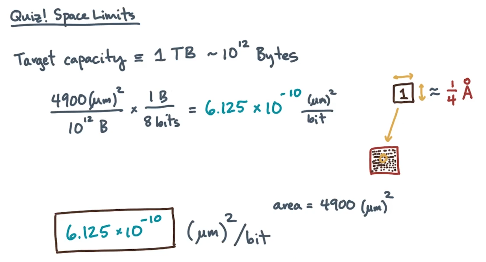

This result derives from the following:

$$
{\textstyle{{4900\ \mu {{\rm{m}}^{\rm{2}}}} \over {{{10}^{12}}\ {\rm{bytes}}}}} \times {\textstyle{{1\ {\rm{byte}}} \over {8\ {\rm{bits}}}}} = 6.125 \times {10^{ - 10}}\ \mu {{\rm{m}}^{\rm{2}}}{\rm{/bit}}
$$

Considering such a single bit (as in the figure shown above), and assuming it is a square per-bit area, this corresponds to a side length of $\sqrt {6.125 \times {{10}^{ - 10}}\ \mu {{\rm{m}}^{\rm{2}}}{\rm{/bit}}}  \approx 2.5 \times {10^{ - 11}}\ \mu {\rm{m/bit}}$ , or approximately $\textstyle{1 \over 4}\rm{Å}$ (angstrom) per side, which is on the order of an atomic radius.
  * ***N.B.*** A single ***classical bit*** (as opposed to a ***quantum bit***) is effectively physically constrained by this single-atom size.

Therefore, the implication of this exercise is that at a certain point of size reduction, there will be a limit to how much such "squeezing" (i.e., into a volume of physical space) can be achieved, beyond which only additional ***locality*** will provide incremental performance improvements with respect to speed.

## 5. Balance in Time Quiz and Answers

Another important trend in computing systems is the ***growing gap*** between the **compute speed** and the **communication speed**.

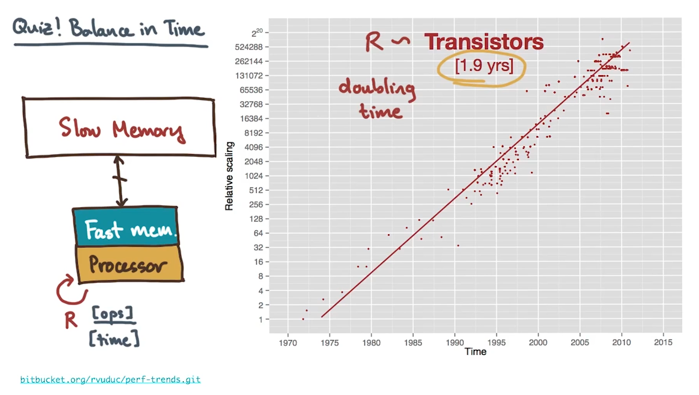

Recall (cf. Lesson 1) the basic von Neumann architecture (as in the figure shown above), comprised of a **processor** and a local **fast memory**, which in turn is connected to a large but **slow memory**.

The processor can perform $R$ operations per second; it turns out that this rate is related to the **transistor density** (i.e., the number of transistors that can fit in a given area of physical space).

The "classic plot" for the trend of transistor density over time is as in the figure shown above.
  * Over the preceding 40 years or so, the transistor density has approximately doubled every `1.9 years`, with a corresponding increase by a factor of approximately $10^{6}×$ over the last 40 years.

***N.B.*** Generally speaking, as transistors decrease in size, this increases their density (for the same area), and correspondingly the signaling time between the transistors also decreases accordingly (thereby allowing faster computation time). Therefore, the plot implies that as transistor density increases, $R$ (i.e., the number of operations performed per unit time) increases proportionally accordingly.

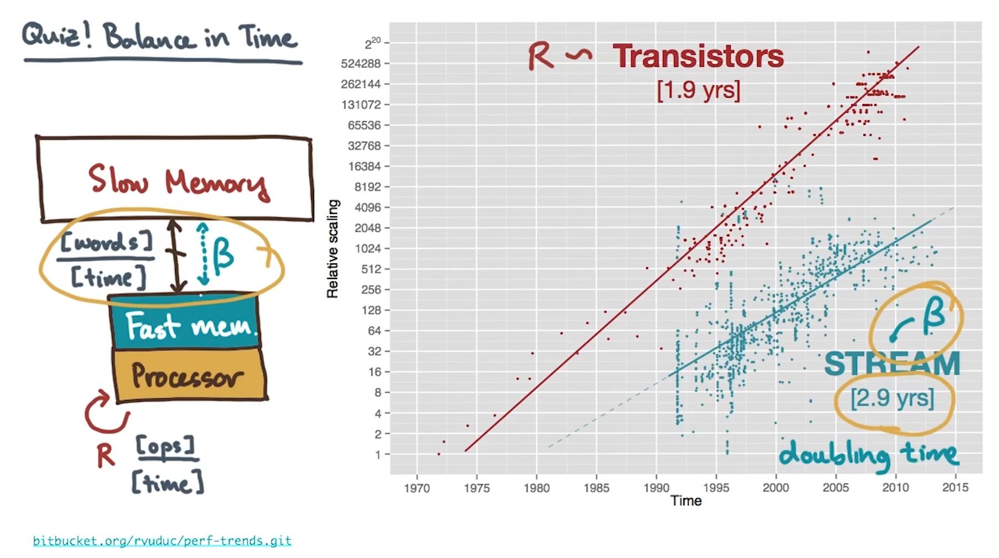

The other notable feature of the von Neumann computing system is the slow-fast memory transfer cost (cf. Lesson 1) (as in the figure shown above).

If the rate of data movement back and forth between the slow and fast memories is denoted by $\beta$ (having units of `words/time`), then similarly to $R$ , $\beta$ also has a natural historical growth rate (as in the figure shown above).

There is a standard benchmark called the **stream**, which measures this growth rate.
  * $\beta$ has doubled approximately every `2.9 years`.

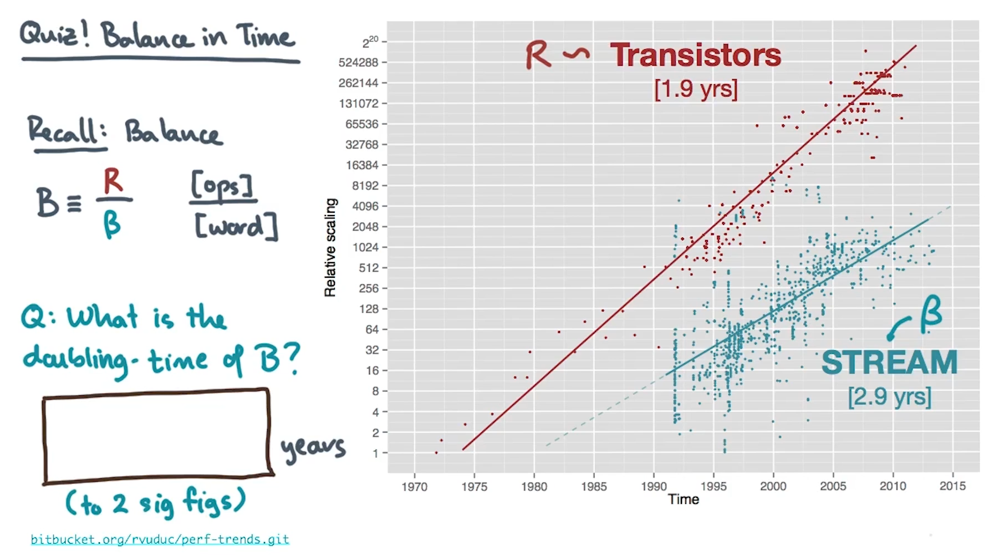

Recall (cf. Lesson 1) that the **machine balance point** (denoted by $B$ , having units of `operations/word`) is defined as follows:

$$
B\equiv {R \over \beta }
$$

***N.B.*** In this context, $B$ essentially defines the peak compute throughput divided by the peak memory bandwidth.

What is the doubling time of $B$? (Express the answer in years, rounded to 2 significant figures.)

### ***Answer and Explanation***:

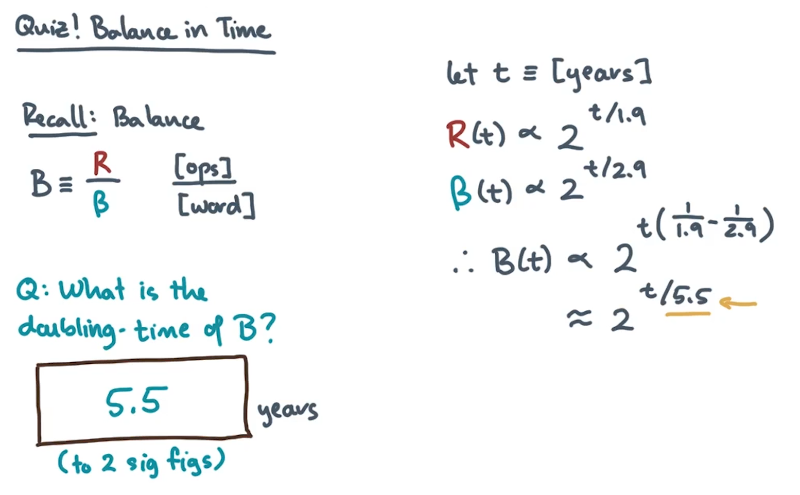

The doubling time of $B$ is approximately `5.5 years`.

Given time $t$ (having units of `years`), the relationships $R(t)$ and $\beta (t)$ are as follows:

$$
R(t) \propto {2^{t/1.9}}
$$

$$
\beta (t) \propto {2^{t/2.9}}
$$

From this, $B(t)$ follows directly via:

$$
B(t) \equiv {{R(t)} \over {\beta (t)}} \propto {2^{t\left( {{\textstyle{1 \over {1.19}}} - {\textstyle{1 \over {2.9}}}} \right)}} \approx {2^{t/5.5}}
$$

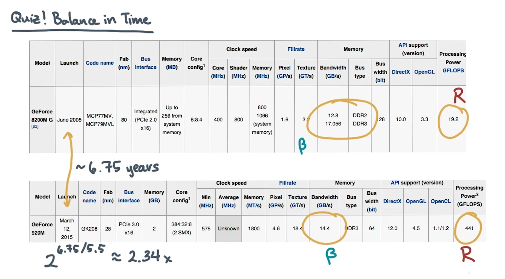

Consider a comparison of two mobile graphical processor units (GPUs), as in the figure shown above, launched between 2008 and 2015 (a span of approximately 6.75 years), suggesting a machine balance point factor change of ${2^{(6.75)/5.5}} \approx 2.34$ .

Furthermore, the $\beta$ (designated as "bandwidth" parameters in the figure shown above) and $R$ (designated as "processing power" parameters in the figure shown above) are given as:

| GPU | Launch Date | $\beta$ (`GB/s`) | $R$ (`GFlops`) |
|:--:|:--:|:--:|:--:|
| GeForce 8200M | June 2008 | 17.056 (DDR3) | 19.2 |
| GeForce 920M | March 2015 | 14.4 (DDR3) | 441 |

Consider: Are these data consistent with the predicted rate of change in the machine balance point (i.e., $B$ )?
  * ***N.B.*** This is left as an exercise to the reader/student.

## 6. Balance Principles

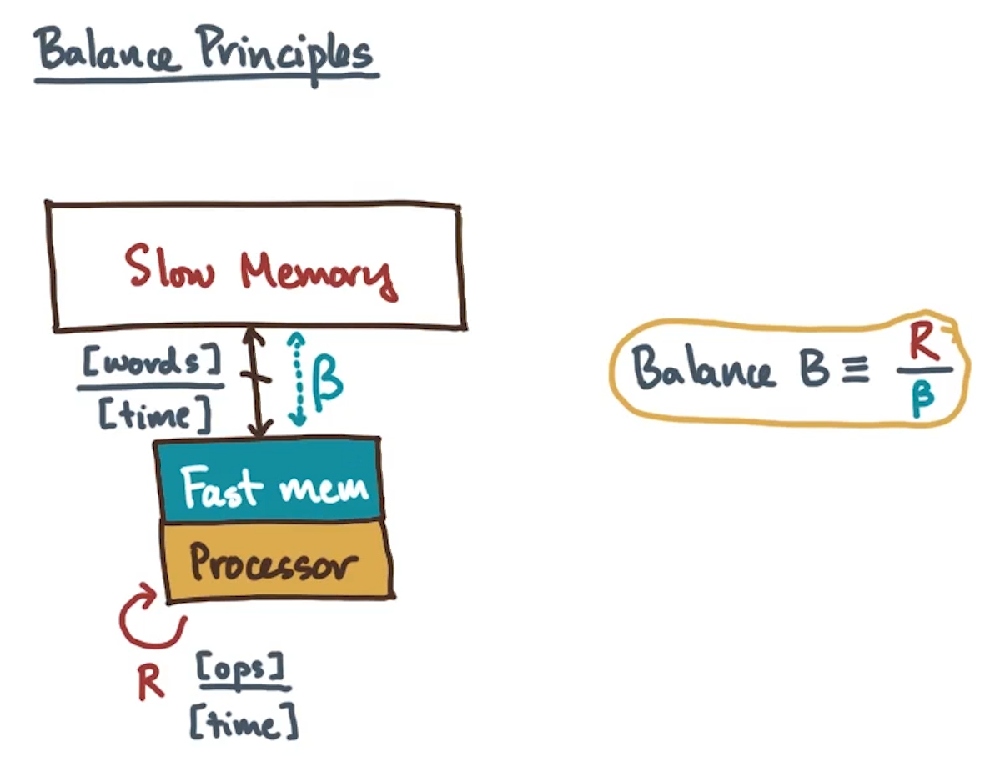

For a sequential processor with slow and fast memories, recall (cf. Lesson 1) the basic concept of a **machine balance point**, defined as:

$$
B \equiv {R \over \beta }
$$

where $R$ is the peak processing rate, and $\beta$ is the peak memory bandwidth.

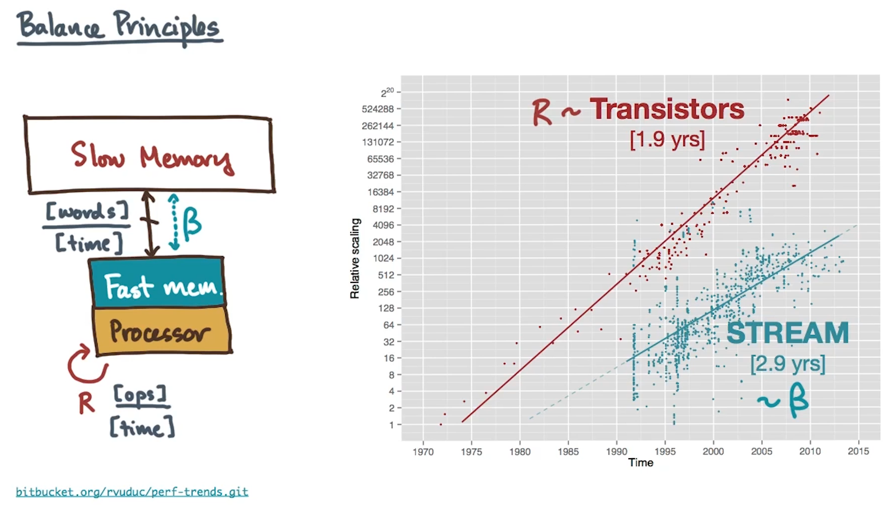

Furthermore, recall (cf. Section 5) the historical growth trends for $R$ and $\beta$ (as in the figure shown above). Observe that the rate of improvement in computation (doubling every `1.9 years`) far outstrips the rate of improvement in communication (doubling every `2.9 years`), with this gap doubling approximately once every `5.5 years`.

So, then, what is the implications of this "growing gap" with respect to algorithms design? This suggests that it might be beneficial to ***trade off*** more computation for less communication.

### The Directed Acyclic Graph (DAG) Model of Computation

Consider a further exploration of this assertion of an inherent "trade-off" via the **directed acyclic graph (DAG) model** of computation.
  * ***N.B.*** This model is discussed in more detail later in the course.

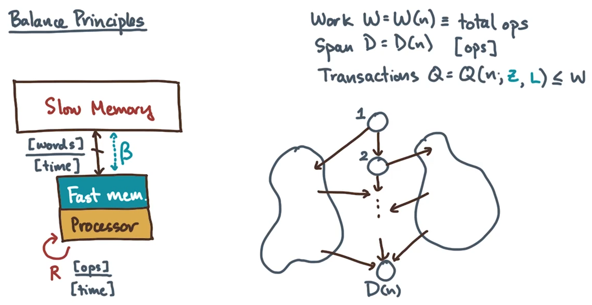

In the DAG model of computation (as in the figure shown above), a computation is characterized by two ***components***, as follows:
  * The **work** $W = W(n)$ , the total number of operations
  * The **span** $D = D(n)$ (having units of `operations`), which is the **critical path length**

Consider an augmentation of the representation in the figure shown above, in order to reason about slow-fast memory communication. In particular, recall (cf. Lesson 1) that, at least in principle, the number of **slow-fast memory transfers** $Q$ can be counted, i.e.,:

$$
Q = Q\left( {n;Z,L} \right) \le W
$$

where, in general, $Q$ is a function of the problem size ($n$ ), the fast-memory size ($Z$ ), and the transaction size ($L$ ).

Furthermore, note that by convention it is assumed that $W$ includes the count of $Q$ .
  * For example, if $Q = 3$ and $W = 10$ , then that means that there are $10 - 3 = 7$ operations that are non-memory transactions.

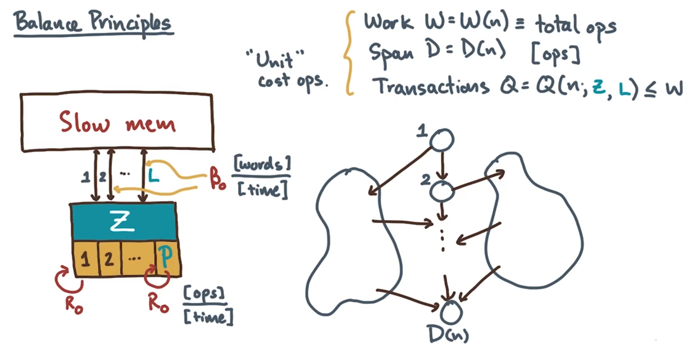

Furthermore, consider a modification of the machine under consideration (as in the figure shown above).
  * As before, there is a large **slow memory**, as well as a small/finite-capacity **fast memory** of size $Z$ words
  * When the data moves between the slow and fast memories, it does so in transactions of size $L$ ***consecutive*** words
  * Additionally, let the processor have $P$ processing cores, with each core capable of executing $R_0$ operations per unit time (i.e., units of `operations/time`)

Let us model the operation of memory by analogy to the manner in which cores work.
  * Each transaction initiates a ***data transfer*** across the $L$ wires in parallel.
  * The time required for a word to travel across a wire in this manner is $\beta_0$ (having units of `words/time`), where $\beta_0$ is essentially the analog of $R_0$ in this cost model.

Note that $W$ , $D$ , and $Q$ count the number of operations in a manner which ***ignores*** these costs $R_0$ and $\beta_0$ . In other words, $W$ , $D$ , and $Q$ are typically computed in a manner which ***assumes*** "unit" cost operations.

However, in a high-performance context, let us now consider translating these unit costs into ***real costs***, in order to determine the implications of this with respect to the overall system.

### Determining Real Costs via the Directed Acyclic Graph (DAG) Model of Computation

Conceptually, non-unit costs can be accounted for by transforming a unit cost to a directed acyclic graph (DAG).

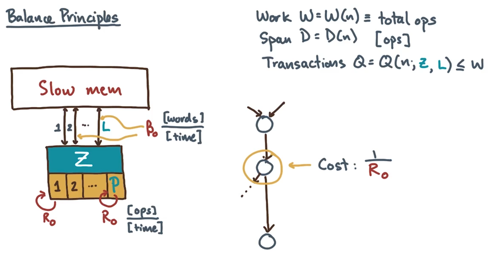

For example, consider some ***vertex*** in the unit-cost directed acyclic graph (DAG), as in the figure shown above.

Suppose that this vertex is one of the compute operations, in which case the cost to execute it is ${\textstyle{1 \over {{R_0}}}}$ time units.

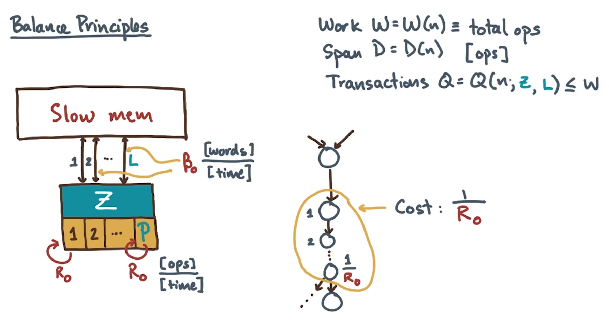

Therefore, this single-unit-cost vertex with a ***sequence*** of ${\textstyle{1 \over {{R_0}}}}$ unit-cost vertices (as in the figure shown above).

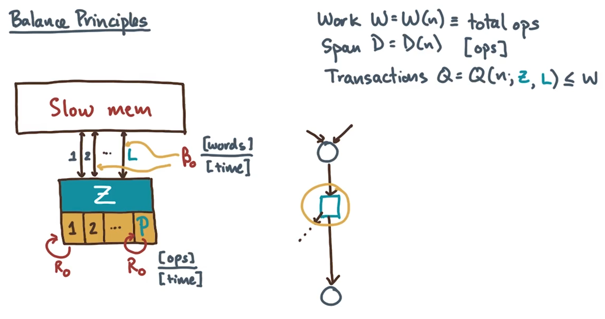

Now, what if a vertex in the directed acyclic graph (DAG) instead represents a ***memory transaction*** (as in the figure shown above)? In this case, consider a modeling of the corresponding transactions as follows.

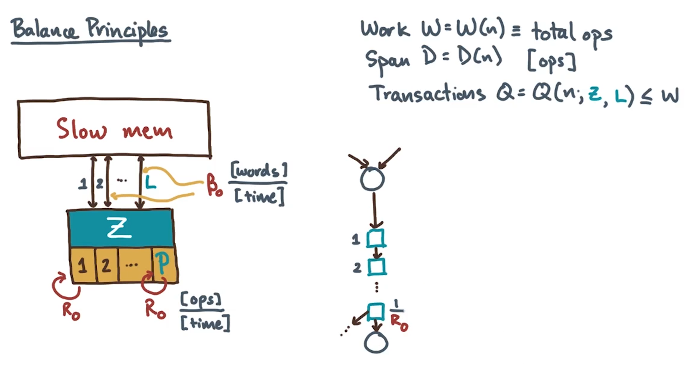

Firstly, there is a ***latency cost*** which is the same as the latency cost for the compute operations (as in the figure shown above). In this case, the memory transactions are equivalently constituted by ${\textstyle{1 \over {{R_0}}}}$ unit-cost vertices.
  * ***N.B.*** After all, a memory transaction is simply another type of instruction. Therefore, it should roughly share the ***same*** instruction processing cost as any other comparable instruction accordingly.

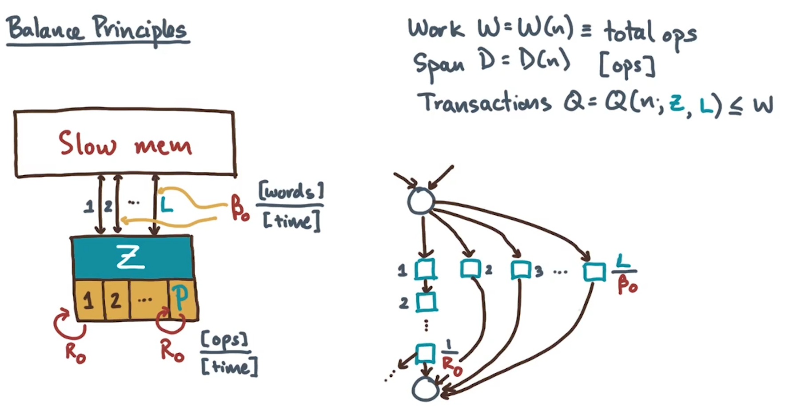

Next, it is also reasonable to suggest that the words of the memory transaction can be "in-flight" ***concurrently*** with compute operations (as in the figure shown above). With respect to the directed acyclic graph (DAG), this constitutes an additional set $L/\beta_0$ fully concurrent vertices.
  * ***N.B.*** Inserting these vertices as concurrent vertices means that they should ***not*** increase the critical path length. Nevertheless, by placing them in as explicit vertices, it is still necessary to incur their cost accordingly. Indeed, most real memory systems behave in this manner (i.e., usually there is a separate **memory controller** or **network processor** onto which communication can be ***offloaded***).

So, then, what is the ***best case*** execution time for this directed acyclic graph (DAG)?

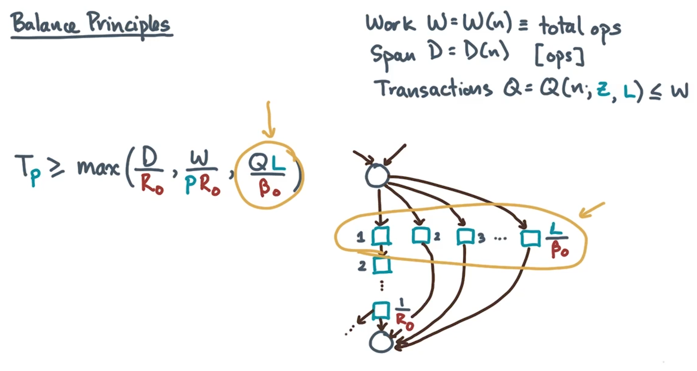

To start, the usual work and span laws apply (as discussed later in this course), scaled by the processor speed accordingly (as in the figure shown above), i.e.,:

$$
{T_P} \ge \max \left( {{D \over {{R_0}}},{W \over {P{R_0}}},{{QL} \over {{\beta _0}}}} \right)
$$

Here, there is an additional cost ${\textstyle{{QL} \over {{\beta _0}}}}$ due to the communication (i.e., for each transaction, it is necessary to incur the additional cost of the concurrent vertices).

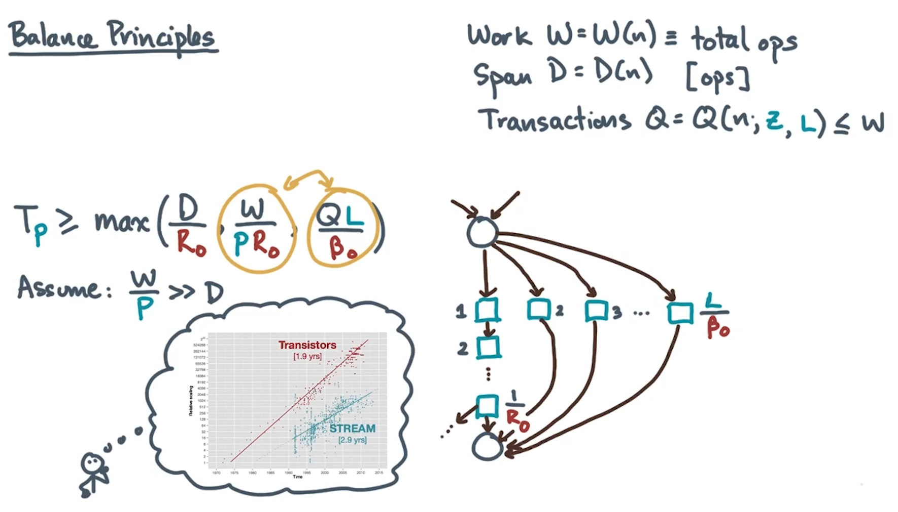

If the algorithm is sufficiently well-designed, then the critical path is ***short*** (as in the figure shown above), i.e., the following ***assumption*** holds:

$$
{W \over {P}} \gg D 
$$

In this case, when is $T_P$ minimized? This occurs under the following condition:

$$
{W \over {P{R_0}}} = {{QL} \over {{\beta _0}}}
$$

Recalling (cf. Section 5) the historical growth rate trends, from these trends, in order to benefit from transistor scaling, then necessarily the compute time $W/(PR_0)$ must dominate the communication time $(QL)/\beta_0$ .

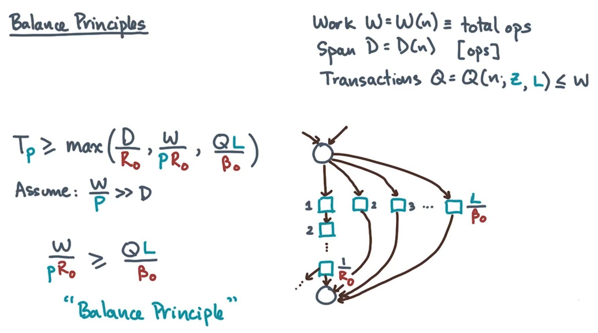

This idea of the compute time dominating the communication time can be thought of as the notion of the ***"balance principle"***, defined as:

$$
{W \over {P{R_0}}} \geq {{QL} \over {{\beta _0}}}
$$

That is, the ***collective goal*** (whether designing algorithms or designing systems) is to make it as easy as possible to achieve ***balance***, which in turn provides the best possibility of scaling into the distant future.

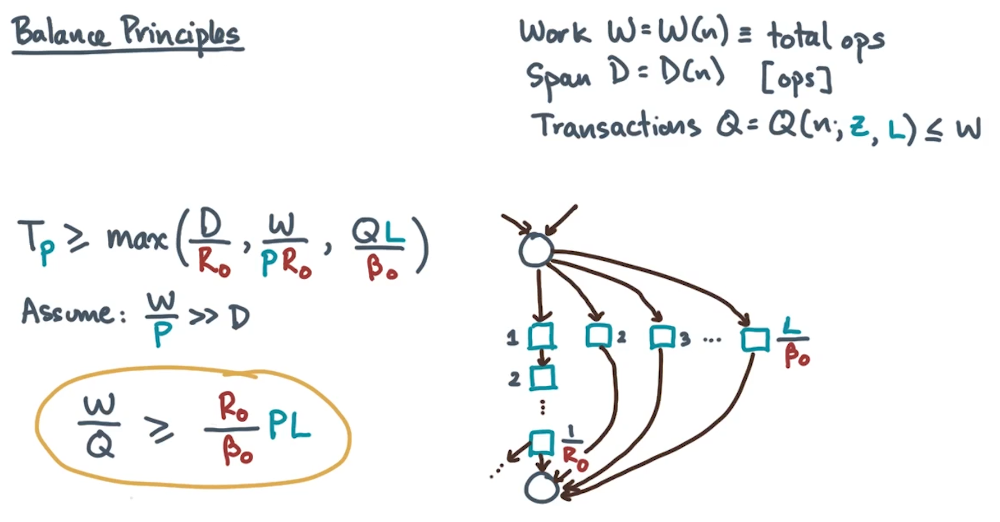

Starting from the balance principle, consider a further examination (as in the figure shown above). Algebraic rearrangement yields the following:

$$
{W \over {Q}} \geq {{R_0} \over {{\beta _0}}} {PL}
$$

From the algorithmic perspective, the ***goal*** is to make $W/Q$ as large as possible, knowing that $(R_0/\beta_0)PL$ is subject to inevitable scaling trends that cause it to grow over time.

Conversely, from the system perspective, the goal is to minimize $(R_0/\beta_0)PL$ in order to facilitate development of efficient algorithms.

Now, consider some additional exercises to further analyze the implications of the balance principle (as derived here from the directed acyclic graph [DAG] model for computation), as discussed in the subsequent sections of this lesson.

## 7. Double, Double Toil and Trouble Quiz and Answers

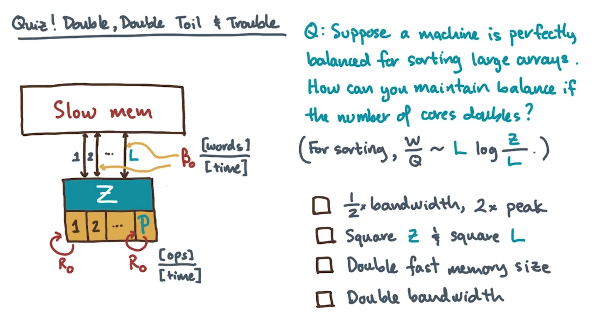

