# I/O-Avoiding Algorithms

## 1. Introduction

Given a machine with a two-level memory hierarchy, what does an ***efficient algorithm*** look like? That is the central topic of this lesson, i.e., **input/output (I/O)-avoiding algorithms**. In this context, input/output (I/O) refers to the transfers of data between slow and fast memories.
  * In this lesson, it will be assumed that this I/O's are the dominant cost, which in turn will be attempted to be minimized.
  * Furthermore, this lesson will demonstrate examples of how to argue lower bounds on the number of I/O's, in order to determine whether a given algorithm achieves this lower bound accordingly.

## 2. A Sense of Scale Quiz and Answers

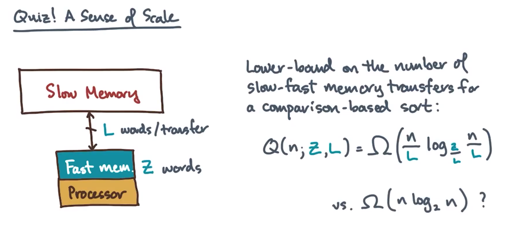

One of the main results of this lesson is going to be a lower bound on the amount of communication needed to sort on a machine with both slow and fast memories. This lower bound is in fact the following:

$$
Q\left( {n;Z,L} \right) = \Omega \left( {{n \over L}{{\log }_{{\textstyle{Z \over L}}}}\left( {{n \over L}} \right)} \right)
$$

where:
  * $n$ → input items
  * $Z$ → fast memory size (`words`)
  * $L$ → transfer size (`words/transfer`)

***N.B.*** Here, the base of the logarithm is $Z\over{L}$, rather than the usual/assumed $2$ .

How does this function compare to the more "plain" $\Omega (n \log_2 n)$ and other quantities? That is the leading intuition for this quiz.

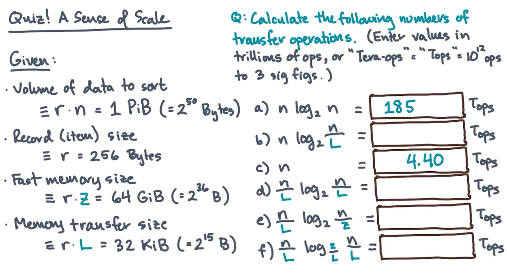

Suppose that the following are given:

| Characteristic | Definition | Size | Size (bytes equivalent) |
|:--:|:--:|:--:|:--:|
| Volume of data to sort | $r \cdot n$ | $1\ \rm{PiB}$ | $2^{50}$ |
| Record (item) size | $r$ | $256\ \rm{bytes}$ | $2^{8}$ | 
| Fast memory size | $r \cdot Z$ | $64\ \rm{GiB}$ | $2^{36}$ |
| Memory transfer size | $r \cdot L$ | $32\ \rm{KiB}$ | $2^{15}$ |

  * ***N.B.*** Assume that initially, the input records/items ***all*** reside in ***slow*** memory (e.g., disk) (cf. DRAM or equivalent for the fast memory). Furthermore, the memory transfer therefore occurs between the slow and fast memories ($32\ \rm{KiB}$ is a reasonable assumption for this transfer rate accordingly).

Now, given the following algorithms performing the corresponding number of transfer operations with respect to input $n$ , evaluate the corresponding expressions (Algorithms A and C are given), in units of `Tops` (teraops, or $10^{12}$ operations) to three significant figures:

| Algorithm | Algorithmic performance | Total transfer operations (`Tops`) |
|:--:|:--:|:--:|
| A | $n\ log_2\ n$ | 185 |
| B | $n\ log_2\ {n\over{L}}$ | ? |
| C | $n$ | 4.40 |
| D | ${n\over{L}}\ log_2\ {n\over{L}}$ | ? |
| E | ${n\over{L}}\ log_2\ {n\over{Z}}$ | ? |
| F | ${{n \over L}\ {{\log }_{{\textstyle{Z \over L}}}}\left( {{n \over L}} \right)}$ | ? | 

### ***Answer and Explanation***:

The calculated results are as follows:

| Algorithm | Algorithmic performance | Total transfer operations (`Tops`) |
|:--:|:--:|:--:|
| A | $n\ log_2\ n$ | ***185***.0000 |
| B | $n\ log_2\ {n\over{L}}$ | ***154***.0000 |
| C | $n$ | 00***4***.***40***00 |
| D | ${n\over{L}}\ log_2\ {n\over{L}}$ | 00***1***.***20***00 |
| E | ${n\over{L}}\ log_2\ {n\over{Z}}$ | 000.***275***0 |
| F | ${{n \over L}\ {{\log }_{{\textstyle{Z \over L}}}}\left( {{n \over L}} \right)}$ | 000.0***523*** | 

  * ***N.B.*** In the results shown in the last column in the table above, left-padding and leading decimals/zeros are included for "visual alignment," however, only three significant figures are expressed in each result (delimited by ***bold italics***), as per the quiz prompt.

Furthermore, note that the relevant factors are determined as follows:

$$
n = {{r \cdot n} \over r} = {{{2^{50}}} \over {{2^8}}} = {2^{42}}{\rm{\ records}}
$$

$$
Z = {{r \cdot Z} \over r} = {{{2^{36}}} \over {{2^8}}} = {2^{28}}{\rm{\ records}}
$$

$$
L = {{r \cdot L} \over r} = {{{2^{15}}} \over {{2^8}}} = {2^7}{\rm{\ records}}
$$

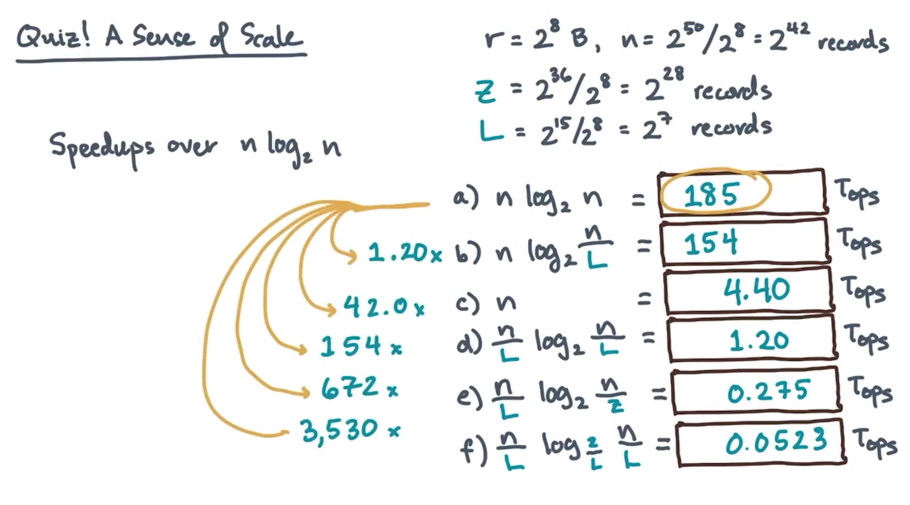

Perhaps more interesting than the numerical results themselves are the ***relative improvements*** with respect to the baseline of $n\ log_2\ n$ (as in the figure shown above).

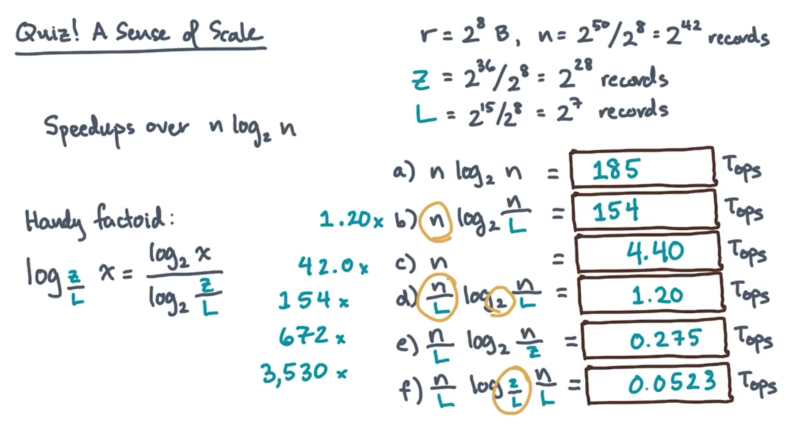

One major improvement arises from reducing $n$ to $n\over{L}$ . This latter factor entails ensuring that, when making a pass over the data, it is imperative to do so in transactions of size $L$ as much as possible.

Another major improvement arises from moving from a $\log$ base of $2$ to $Z\over{L}$ . This improvement involves the capacity of fast memory $Z$ ; this improvement there yields from ensuring that the algorithm utilizes the fast memory capacity $Z$ to the greatest extent possible.

***N.B.*** When dealing with a change of base, note the following rule of logarithms:

$$
{\log _{{\textstyle{Z \over L}}}}\left( x \right) = {{{{\log }_2}x} \over {{{\log }_2}{Z \over L}}}
$$

As a closing remark, note that these relative speedups are only "notional"; conversely, when performing algorithm analysis, it more typically done in an "asymptotic" sense (i.e., ignoring hidden constants). The purpose here is to build intuition about how performance changes as these "improving factors" are incorporated into the corresponding algorithm(s) in question.

### Instructor's Note

The answer for (E) should be $0.481$ and the answer for (F) should be $0.0573$ (i.e., indicated ***incorrectly*** in the slides/discussion above, per original version's corresponding errata).

## 3. External Memory Merge Sort

Consider the problem of sorting $n$ elements in a two-level memory hierarchy (as in the figure shown above).

Initially, assume that the processor is ***sequential***.

Now, consider a natural scheme based on the merge sort idea.

### Merge Sort Phase 1

Start by logically dividing the input into chunks of size proportional to (but no greater than) $Z$ (as in the figure shown above), such that a single such chunk fits into fast memory--i.e., $n\over{f \cdot Z}$ chunks, where $f \in [0,1)$ .

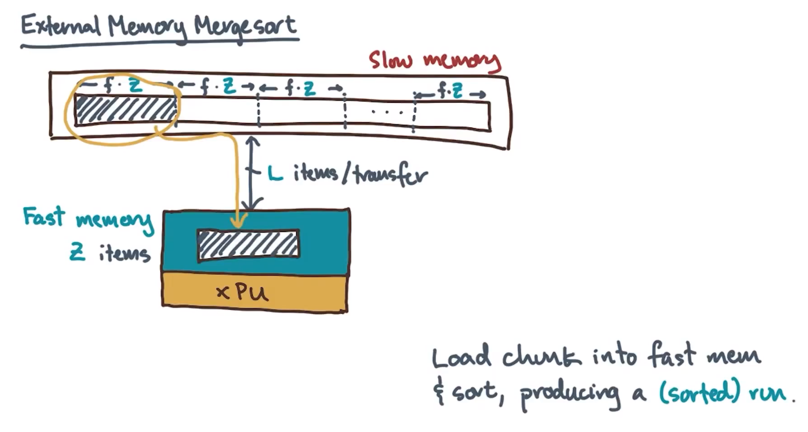

Next, read one such chunk of input from slow memory into fast memory (as in the figure shown above).

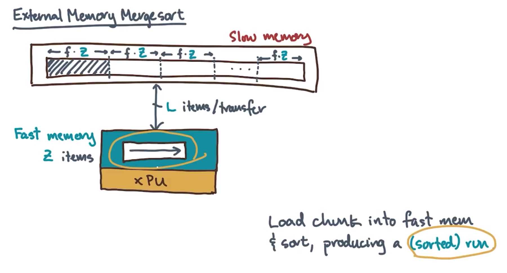

After reading the chunk into fast memory, ***sort*** this chunk (as in the figure shown above).
  * ***N.B.*** Such a "sorted output" sitting in fast memory will be referred to as a ***sorted run***, or simply ***run*** for short. Furthermore, the mnemonic of a left-to-right arrow (as in the figure shown above) indicates that the chunk in question is sorted in this manner.

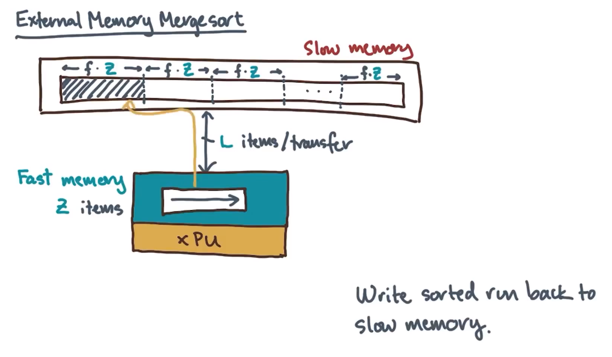

Since the run is now sorted, it is written back into slow memory (as in the figure shown above).

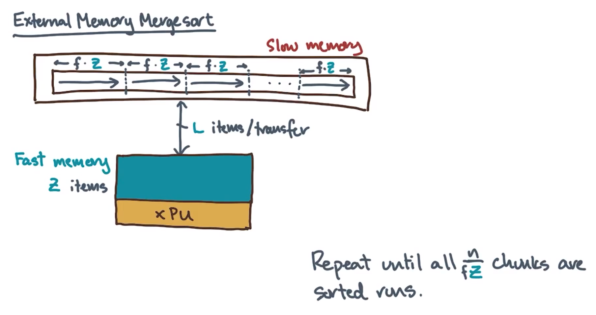

The aforementioned process is repeated on each input chunk of size $f \cdot Z$ (as in the figure shown above), until all $n\over{f \cdot Z}$ chunks are sorted runs.

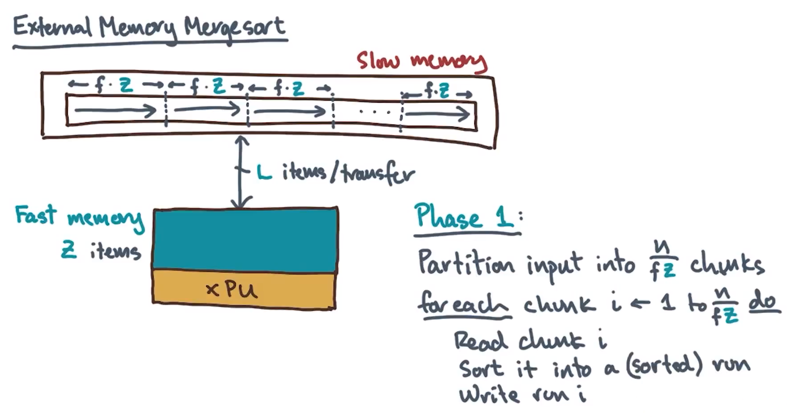

The aforementioned process is referred to as **Phase 1** of the procedure, summarized as follows:

$$
\boxed{
\begin{array}{l}
{\rm{partition\ input\ into\ }}{n \over {f \cdot Z}}{\rm{\ chunks}}\\
{\rm{foreach\ chunk\ }}i \leftarrow 1{\rm{\ to\ }}{n \over {f \cdot Z}}{\rm{\ do}}\\
\ \ \ \ {\rm{read\ chunk\ }}i\\
\ \ \ \ {{\rm{sort\ chunk\ }} i {\rm{\ into\ a\ (sorted)\ run}}}\\
\ \ \ \ {\rm{write\ run\ }}i
\end{array}
}
$$

### Merge Sort Phase 2

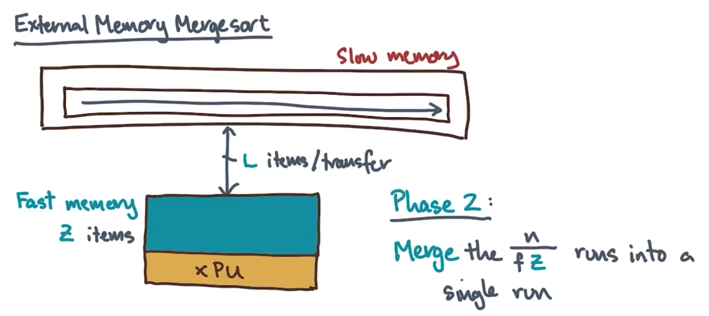

Following the merge sort idea, in **Phase 2**, all of the sorted runs are merged into a single, final sorted run, i.e.,:

$$
\boxed{
\begin{array}{l}
{{\rm{merge\ the\ }}{n \over {f \cdot Z}}{\rm{\ runs\ into\ a\ single\ run}}}
\end{array}
}
$$

Before discussing Phase 2 further, let us first consider Phase 1 (partitioned sorting) in more detail (as discussed next via quiz section).

## 4. Partitioned Sorting Step Analysis Quiz and Answers

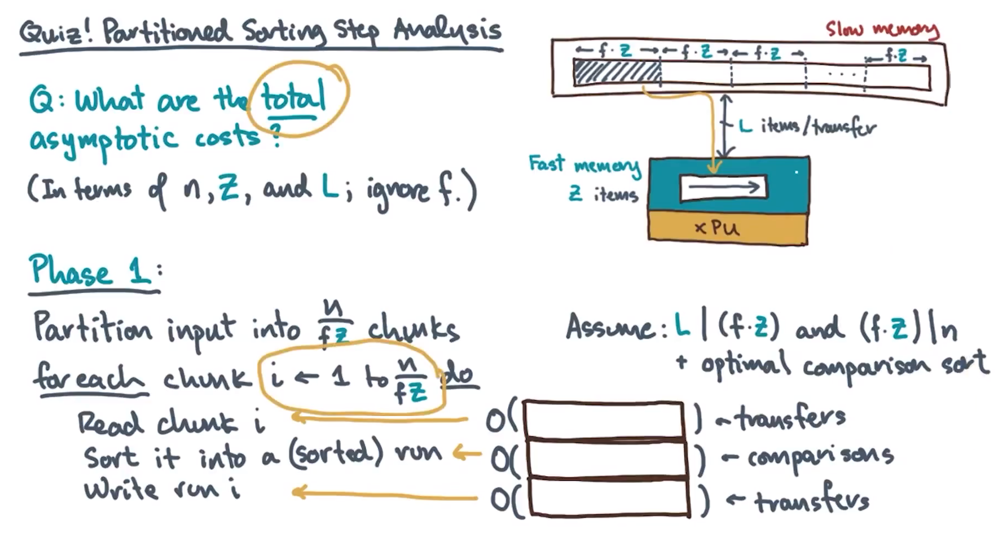

Recall Phase 1 of the external-memory merge sort scheme (cf. Section 3), as follows:

$$
\boxed{
\begin{array}{l}
{\rm{partition\ input\ into\ }}{n \over {f \cdot Z}}{\rm{\ chunks}}\\
{\rm{foreach\ chunk\ }}i \leftarrow 1{\rm{\ to\ }}{n \over {f \cdot Z}}{\rm{\ do}}\\
\ \ \ \ {\rm{read\ chunk\ }}i\\
\ \ \ \ {{\rm{sort\ chunk\ }} i {\rm{\ into\ a\ (sorted)\ run}}}\\
\ \ \ \ {\rm{write\ run\ }}i
\end{array}
}
$$

In this quiz, count the number of asymptotic slow-fast transfers and the number of comparisons incurred at each step (as designated with "boxes" $O(\cdots)$ in the figure shown above), as aggregated over all iterations. Express the results in terms of $n , $Z$ , $L$ , and other numeric constant (but ignoring $f$ , which is simply a "corrective" constant to ensure that the size of the input buffers fit properly into the fast memory, along with any necessary "working space").
  * Furthermore, express the answer with respect to ***totals*** taken overall $n\over{Z}$ iterations.
  * Also, assume that everything divides "everything else" (i.e., $L|(f \cdot Z)$ and $(f \cdot Z)|L$ ), and assume that any local sort is an ***optimal*** comparison-based sort

### ***Answer and Explanation***:

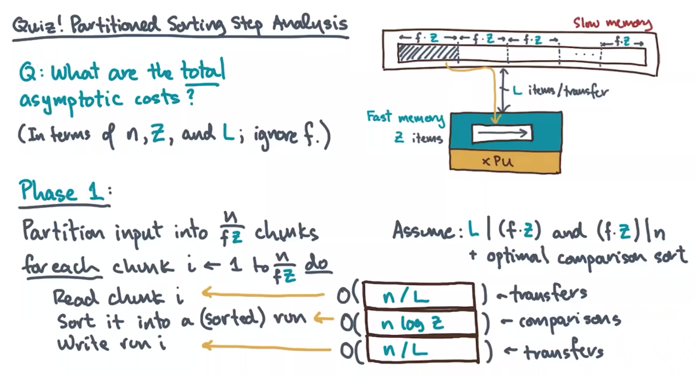

The iteration-wise counts are as follows:

| Instruction | Asymptotic count | Count type
|:--|:--:|:--:|
| ${\rm{read\ chunk\ }}i$ | $O(n/L)$ | transfers |
| ${{\rm{sort\ chunk\ }} i {\rm{\ into\ a\ (sorted)\ run}}}$ | $O(n \log Z)$ | comparisons |
| ${\rm{write\ run\ }}i$ | $O(n/L)$ | transfers |

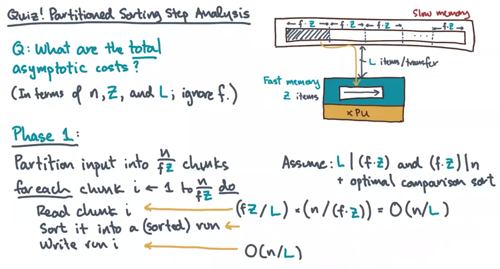

With respect to the transfers (as in the figure shown above), the read and write operations involve around $Z/L$ transfers each, repeated for all iterations, i.e.,:

$$
\underbrace {\left( {{\bcancel{f \cdot Z} \over L}} \right)}_{{\rm{transfers\ per\ operation}}} \times \underbrace {\left( {{n \over \bcancel{f \cdot Z}}} \right)}_{{\rm{total\ operations}}} = O\left( {{n \over L}} \right)
$$

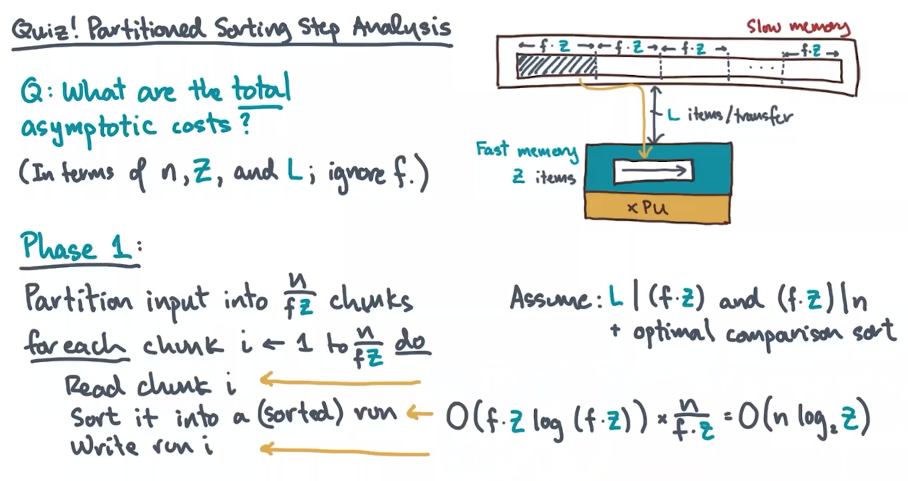

Furthermore, with respect to the comparisons (as in the figure shown above), an optimal comparison-based sort incurs around $Z \log Z$ comparisons, repeated for all iterations, i.e.,:

$$
\underbrace {\left( {\bcancel{f \cdot Z} \log \left( {f \cdot Z} \right)} \right)}_{{\rm{comparisons\ per\ operation}}} \times \underbrace {\left( {{n \over \bcancel{f \cdot Z}}} \right)}_{{\rm{total\ operations}}} = O\left( {n\log \left( {f \cdot Z} \right)} \right)
$$

Observe that, in general, this algorithmic scheme is yielding behavior which is proportional to $n/L$ transactions, i.e., there *is* indeed utilization on a per-transaction basis.

## 5. Two-Way External Memory Merging

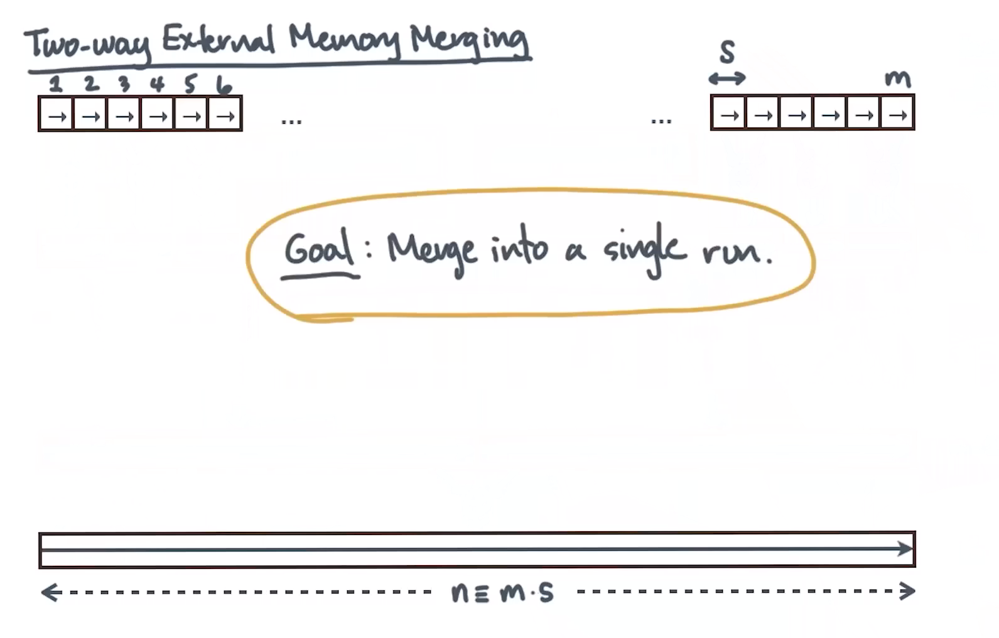

Suppose there are $m$ sorted runs present in slow memory, where each run is of size $s$ items (as in the figure shown above).
  * Here, the total number of items is defined as $n \equiv m \cdot s$ .

The corresponding goal, then, is to ***merge*** all of these sorted runs into a ***single*** sorted run, thereby completing the merge sort algorithm.

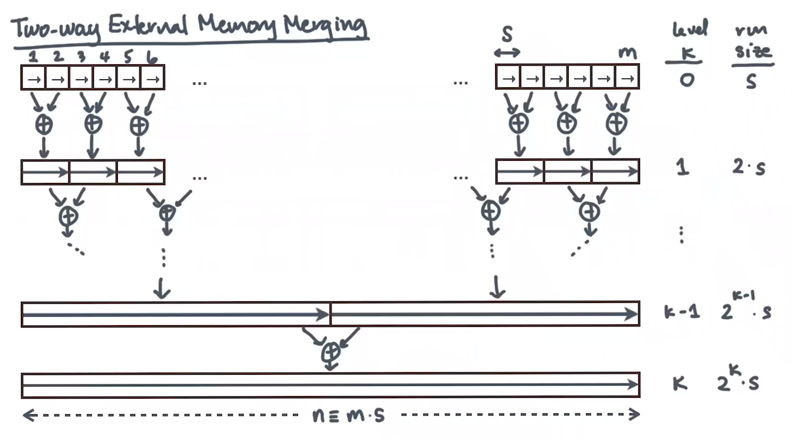

An easy scheme, based on the classical merge sort idea, is to merge pairs of runs successively, until a single, final run results (as in the figure shown above).

Observe the trend with respect to each successive level (for $k$ total levels):

| Level | Run size |
|:--:|:--:|
| $0$ | $s$ |
| $1$ | $2 \cdot s$ |
| $\vdots$ | $\vdots$ |
| $k-1$ | $2^{k-1} \cdot s$ |
| $k$ | $2^{k} \cdot s$ |

Let us now examine these steps in further detail.

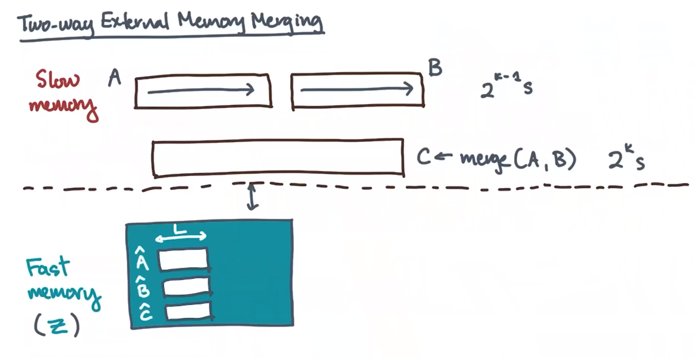

First, consider a pair of runs, each of size $2^{k-1} \cdot s$ items, denoted by A and B (as in the figure shown above). Initially, A and B both reside in slow memory.

The goal is to produce a merged run C (i.e., $C \leftarrow {\rm{merge}}(A,B)$ ), which will hold $2^{k} \cdot s$ items, as held in corresponding output buffer C.

In order to execute this merge, three buffers are maintained in fast memory, designated $\hat{A}$ , $\hat{B}$ , and $\hat{C}$ (respectively), each holding $L$ elements (corresponding to the transaction size).
  * Two of the buffers ($\hat{A}$ and $\hat{B}$ ) are used for storing elements from A and B (respectively).
  * The other buffer ($\hat{C}$ ) is used for storing the elements of the output.

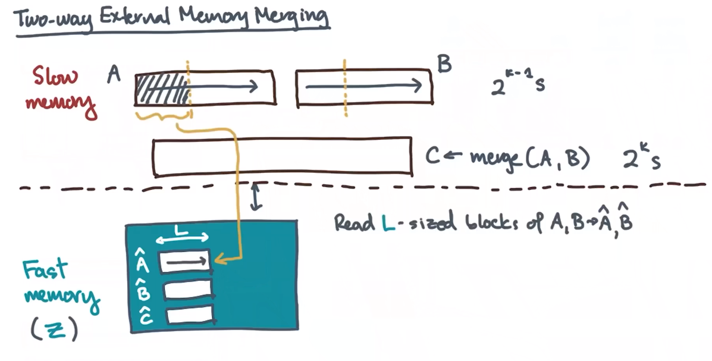

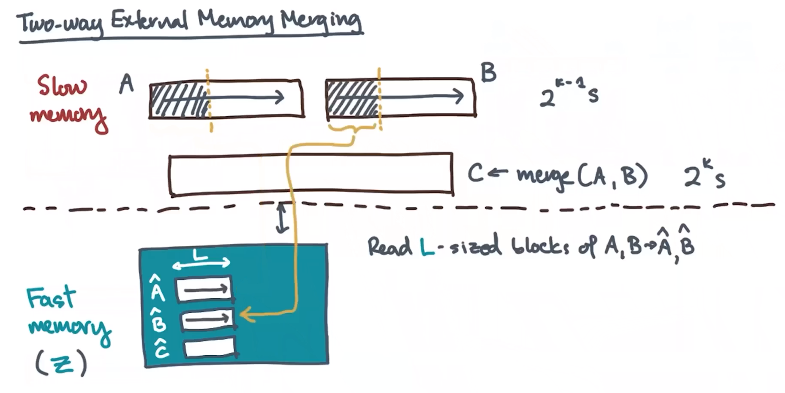

To perform the merge, start by reading one $L$-sized block from each of $A$ and $B$ into $\hat{A}$ and $\hat{B}$ (respectively) (as in the figures shown above), thereby moving them from slow memory to fast memory, i.e.,:

$$
\boxed{
\begin{array}{l}
{{\rm{read\ }}L{\rm{-sized\ blocks\ of\ }}A,B \to \hat A,\hat B}
\end{array}
}
$$

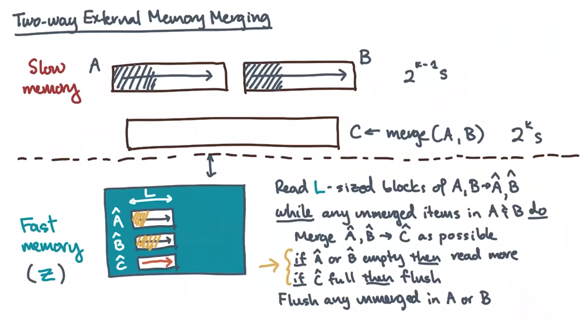

Subsequently, the following sequence is performed:

$$
\boxed{
\begin{array}{l}
{\rm{while\ any\ unmerged\ items\ in\ }}A{\rm{\ or\ }}B{\rm{\ do}}\\
\ \ \ \ {\rm{merge\ }}\hat A,\hat B \to \hat C{\rm{\ as\ possible}}\\
\ \ \ \ {\rm{if\ }}\hat A{\rm{\ or\ }}\hat B{\rm{\ empty\ then\ read\ more}}\\
\ \ \ \ {\rm{if\ }}\hat C{\rm{\ full\ then\ flush}}
\end{array}
}
$$

Here, iteration is performed until either all of $A$ or all of $B$ is read. Then, elements from $\hat{A}$ and $\hat{B}$ are merged into $\hat{C}$ , until elements from either $\hat{A}$ or $\hat{B}$ are exhausted (in which case additional elements are read from slow memory) or until the output buffer of $\hat{C}$ becomes full (in which case the memory is flushed).

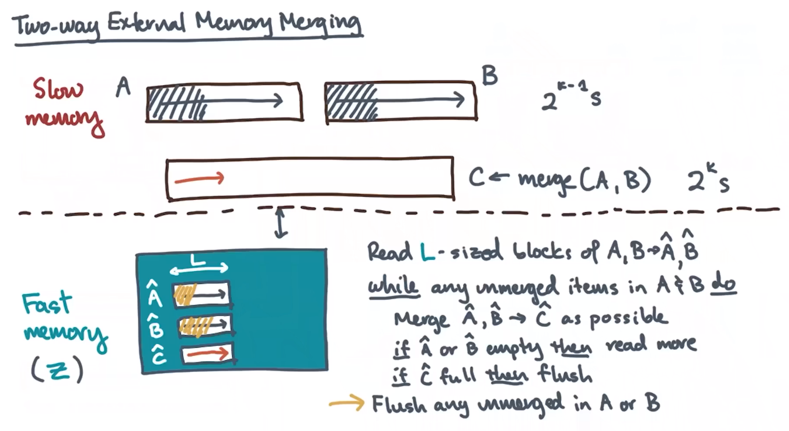

Finally, when either $A$ or $B$ is exhausted, the remaining elements are copied accordingly, i.e.,:

$$
\boxed{
\begin{array}{l}
{{\rm{flush\ any\ unmerged\ in\ }}A{\rm{\ or\ }}B}
\end{array}
}
$$

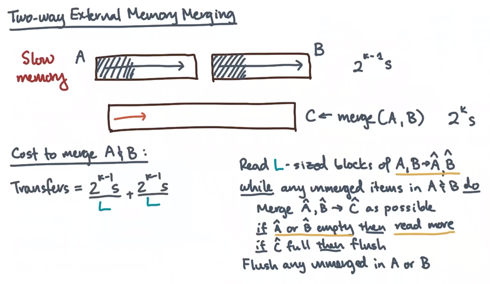

What is the corresponding cost to merge the pair of runs $A$ and $B$ ?

This scheme only ever ***loads*** elements from A or B from slow memory ***once***, and it only ***writes*** a given output block ***once***, i.e.,:

$$
\underbrace {{{{2^{k - 1}} \cdot s} \over L}}_{{\rm{loads}}} + \underbrace {{{{2^{k - 1}} \cdot s} \over L}}_{{\rm{writes}}}
$$

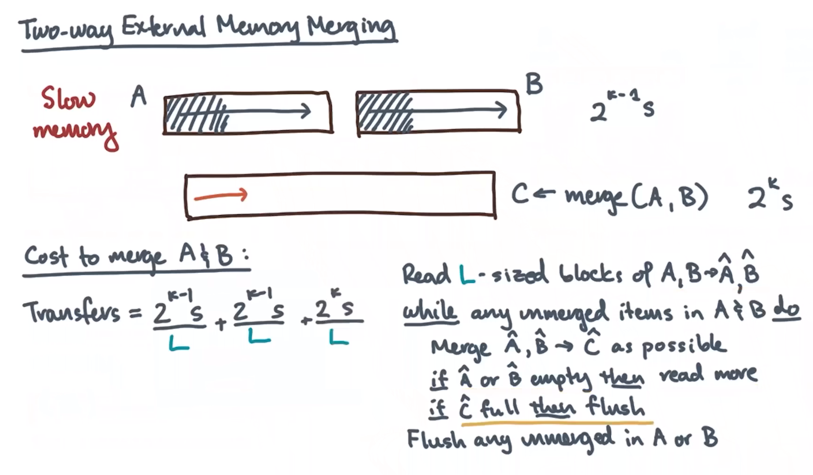

Furthermore, this scheme only ever ***writes*** a given output block $C$ ***once***, i.e.,:

$$
\underbrace {{{{2^{k}} \cdot s} \over L}}_{{\rm{writes}}}
$$

Therefore, this cumulatively yields a total number of transfers as follows:

$$
\underbrace {{{{2^{k - 1}} \cdot s} \over L}}_{{\rm{loads}}} + \underbrace {{{{2^{k - 1}} \cdot s} \over L}}_{{\rm{writes}}} + \underbrace {{{{2^{k}} \cdot s} \over L}}_{{\rm{writes}}} = {{{{2^{k+1}} \cdot s} \over L}}
$$

Furthermore, with respect to comparisons, this is also linear in $s$ , i.e.,:

$$
\Theta(2^{k} \cdot s)
$$

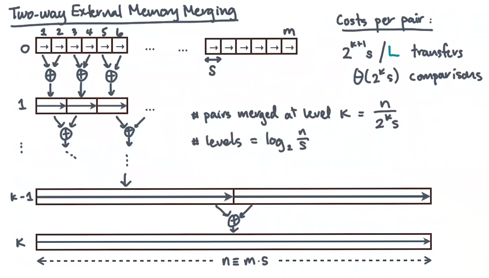

Note that the aforementioned is for merging only ***one*** pair $A$ and $B$ ; returning to the original tree (as in the figure shown above), at each level, the number of pairs can be counted accordingly, i.e., the pairs merged at level $k$ is $n \over{2^{k} \cdot s}$  . Furthermore, the total number of levels is $\log_2 {n \over{s}}$.

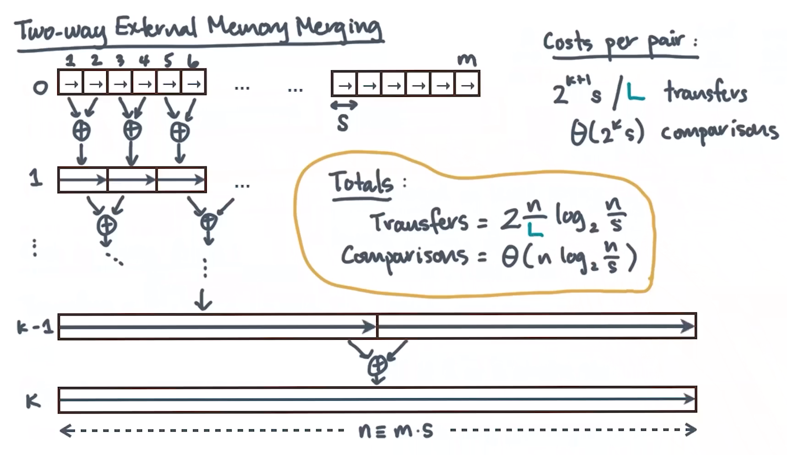

Therefore, combining across all levels yields the following:

| Measurement | Total size |
|:--:|:--:|
| Transfers | ${{{2^{\bcancel{k} + 1}} \cdot \bcancel{s}} \over L} \times \underbrace {{n \over {\bcancel{{2^k} \cdot s}}} \times {\log_2}{n \over s}}_{{\rm{total\ pairs}}} = 2{n \over L}{\log_2}{n \over s}$ |
| Comparisons | $\Theta (\bcancel{{2^k} \cdot s}) \times \underbrace {{n \over {\bcancel{{2^k} \cdot s}}} \times {\log_2}{n \over s}}_{{\rm{total\ pairs}}} = \Theta (n{\log_2}{n \over s})$ |

This begs the question: Is this performance *good* or *bad*?

## 6. External Memory Merge Sort with a Two-Way Merge Step Quiz and Answers

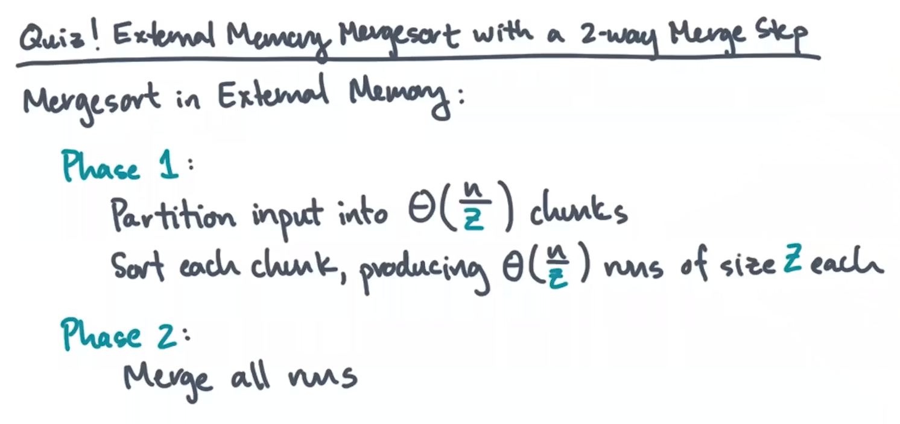

Recall (cf. Section 3) the overall template for a merge sort on a two-level-memory-hierarchy machine, abbreviated as follows:

$$
\boxed{
\begin{array}{l}
{\rm{Phase\ 1:}}\\
\ \ \ \ {\rm{partition\ input\ into\ }}\Theta \left( {{n \over Z}} \right){\rm{ chunks}}\\
\ \ \ \ {\rm{sort\ each\ chunk,\ producing\ }}\Theta \left( {{n \over Z}} \right){\rm{\ runs\ of\ size\ }}Z{\rm{\ each}}\\
{\rm{Phase\ 2:}}\\
\ \ \ \ {\rm{merge\ all\ runs}}
\end{array}
}
$$

Here, Phase 1 produces several sorted chunks (or runs). The goal of Phase 2 is then to merge all of these runs.

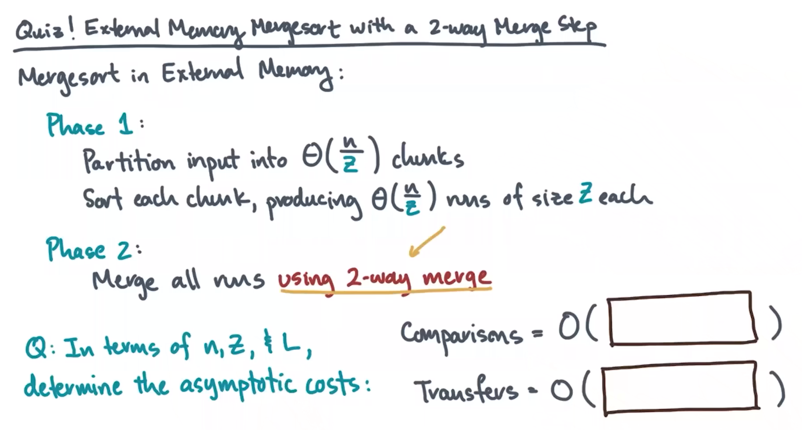

Now, suppose that Phase 2 is implemented using the two-way merge scheme, i.e.,:

$$
\boxed{
\begin{array}{l}
{\rm{Phase\ 1:}}\\
\ \ \ \ {\rm{partition\ input\ into\ }}\Theta \left( {{n \over Z}} \right){\rm{ chunks}}\\
\ \ \ \ {\rm{sort\ each\ chunk,\ producing\ }}\Theta \left( {{n \over Z}} \right){\rm{\ runs\ of\ size\ }}Z{\rm{\ each}}\\
{\rm{Phase\ 2:}}\\
\ \ \ \ {\rm{merge\ all\ runs\ using\ two-way\ merge}}
\end{array}
}
$$

With this modification, what is the corresponding overall asymptotic cost of the entire merge sort with respect to comparisons and transfers? (Express this symbolically in terms of $n$ , $Z$ , and $L$ .)
  * ***N.B.*** The usual assumptions also hold here as before (i.e., quantities divide evenly, use convenient powers of $2$ , etc.)

### ***Answer and Explanation***:

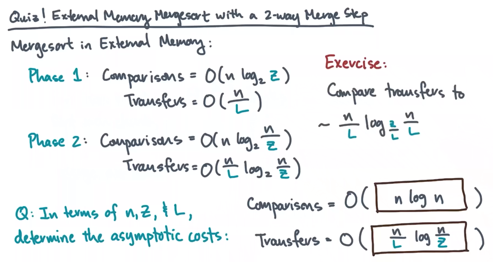

Phases 1 and 2 were analyzed previously (cf. Sections 4 and 5), summarized as follows:

| Phase | Comparisons | Transfers |
|:--:|:--:|:--:|
| $1$ | $O(n \log_2 Z)$ | $O({n\over{L}})$ |
| $2$ | $O(n \log_2 {n\over{Z}})$ | $O({n\over{L}}{\log_2 {n\over{Z}}})$ |

Combining these gives the following:

| Operation | Asymptotic cost |
|:--:|:--:|
| Comparisons | $\underbrace {O(n{\log_2}Z)}_{{\rm{Phase 1}}} + \underbrace {O\left( n{\log_2 {n \over Z}} \right)}_{{\rm{Phase 2}}} = O\left(\bcancel{n \log_2 Z} + n \log_2 n - \bcancel{n \log_2 Z} \right) = O(n\log_2n)$ |
| Transfers | $\underbrace {O\left( {{n \over L}} \right)}_{{\rm{Phase 1}}} + \underbrace {O\left( {{n \over L}{\log_2 n \over Z}} \right)}_{{\rm{Phase 2}}} = O\left( {{n \over L}\left( {1 + {\log_2 n \over Z}} \right)} \right)\underbrace  \approx _{1 \ll {\log_2 n \over Z}{\rm{\ as\ }}n \to \infty }O\left( {{n \over L}{\log_2 n \over Z}} \right)$ |

As these results suggest, merge sort is optimal with respect to comparisons (relative to any other comparison-based algorithm). Furthermore, with respect to memory transfers, Phase 2 dominates the total asymptotic cost.

As it turns out, the known lower bound for the transfer operations is as follows:

$$
{n\over{L}}log_{Z\over{L}}{n\over{L}}
$$

***N.B.*** Demonstration of this is left as an exercise to the reader.

## 7. What Is Wrong with Two-Way Merging? Quiz and Answers
