# Introduction to the Work-Span Model

## 1. Introduction

<center>
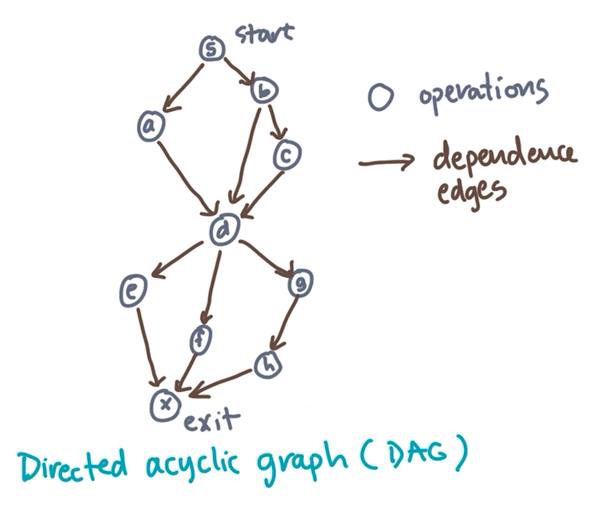
</center>

To design algorithms, we need an ***abstract model*** of a parallel computation, and a way to notate this algorithm. This lesson describes one such model, which is sometimes called the **dynamic multi-threading model**.

The dynamic multi-threading model is comprised of two ***parts***:
  * 1 - In the first part, the computation can be represented by a **directed acyclc graph (DAG)** (as in the figure shown above), wherein each **node** is some piece of computational work or task, and each **edge** is a dependency which indicates that a given task cannot proceed until all of its predecessors have completed (as in the figure shown above)
    * From the perspective of "exploiting parallelism," an adequate DAG is one characterized by relatively few dependencies as compared to the number of tasks.
  * 2 - After learning how to analyze abstract DAGs more precisely, discussion will proceed onto the second part of the model, which comprises a ***pseudocode notation*** (a programming model for notating the algorithm).
    * This notation will be defined such that when executing one of these algorithms, it consequently generates a computational DAG (at least conceptually).

Prior to proceeding, note the following ***caveat***: You may have done multi-threaded programming already previously (e.g., PThreads, Java threads, etc.), wherein the program explicitly creates "virtual threads" and then subsequently assigns units of work to them accordingly. For the purposes of this lesson, such a programming model must be deliberately ***ignored***.

The pseudocode notation discussed in this lesson separates how to produce work from how to schedule and execute it, rather than combining/abstracting these concepts. Correspondingly, the focus of present discussion is on creating an algorithm that has an appropriately well-defined DAG; separately from this, there will be a physical multi-core machine and run-time system that (given the DAG in question) determines how to map the DAG to the cores and correspondingly execute it.
  * ***N.B.*** There will be some ***limits*** to the kind of DAG that can be produced in this model as described, however, hopefully it will become apparent that it is still a really natural, elegant, and powerful way to express parallel algorithms for a broad class of interesting models.

## 2. The Multi-Threaded Directed Acyclic Graph (DAG) Model

<center>
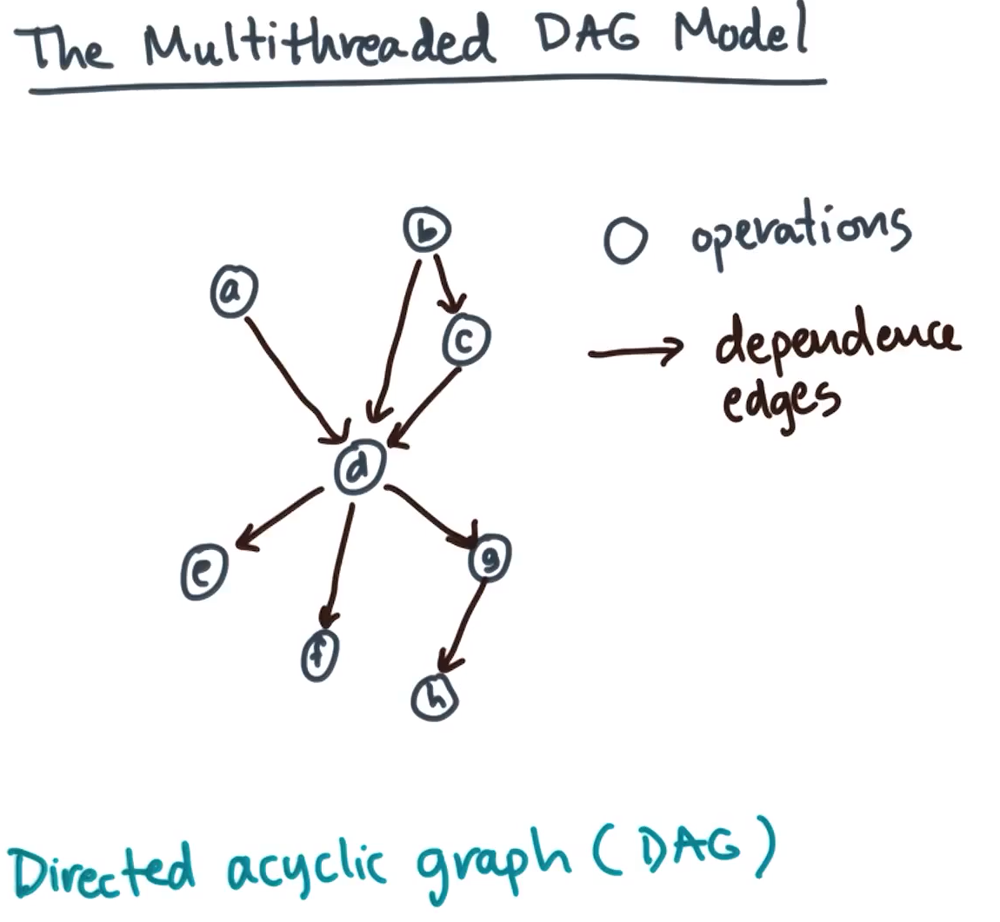
</center>

In the **multi-threaded directed acyclic graph (DAG) model**, a parallel computation is represented by a **directed acyclic graph (DAG)** (as in the figure shown above).
  * Each **vertex** (or **node**) represents an operation (e.g., an addition, a function call, a branch, etc.).
  * The **directed edges** indicate how operations depend on one another, whereby the downstream **sinks** depend on the corresponding upstream **sources** (e.g., vertex $c$ depends on the output/result of vertex $b$ in the figure shown above).

<center>
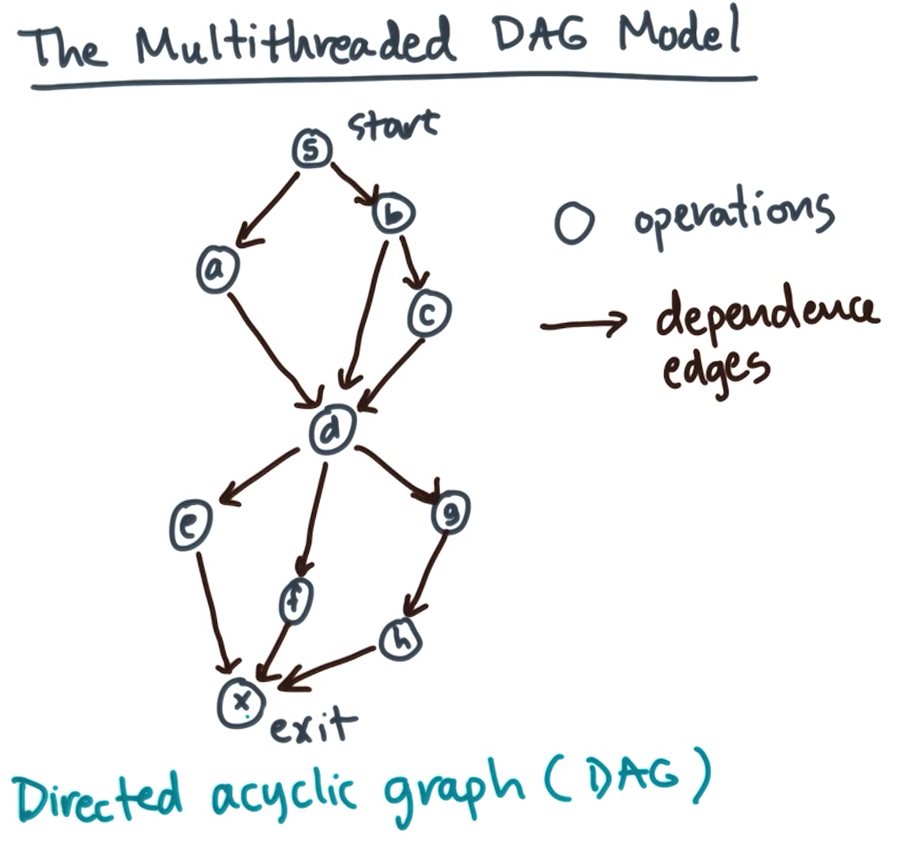
</center>

### The Scheduling Problem

For the sake of simplicity, it will always be ***assumed*** that there is exactly ***one*** **starting vertex** (e.g., vertex $s$ in the figure shown above) and ***one*** **exit vertex** (e.g., vertex $x$ in the figure shown above).

<center>
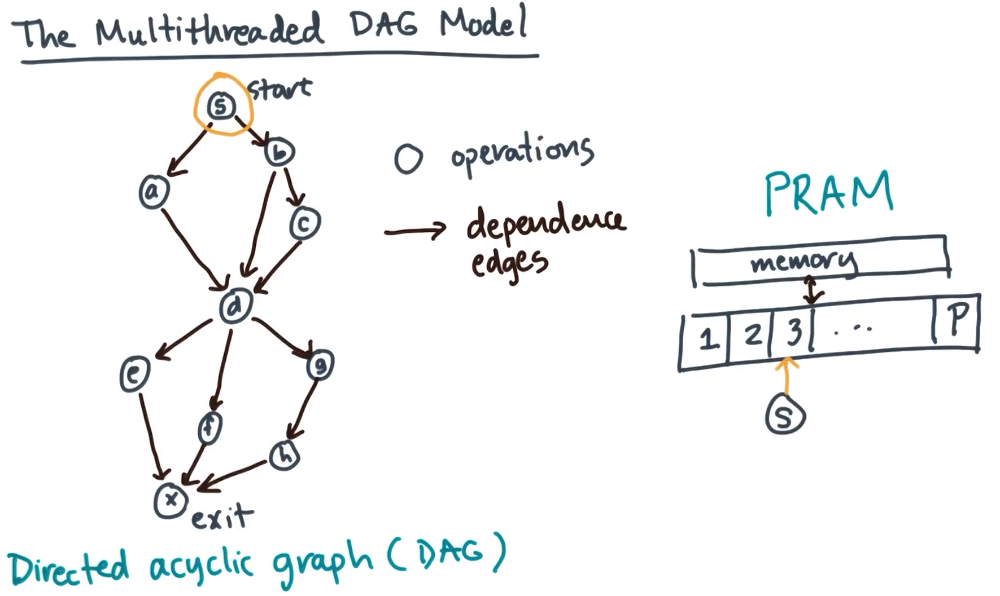
</center>

If given a DAG with no such start and exit vertices denoted, these can be determined relatively simply (as in the figure shown above).

Suppose that a **parallel random access memory (PRAM)** machine is available, intended for running the computation in question (i.e., as represented by the corresponding DAG). Proceed by searching for any operations that are ready for execution (i.e., all of their input dependencies are satisfied).

In this example (as in the figure shown above), consider the starting vertex $s$ . Since vertex $s$ can commence execution, it is assigned accordingly to any available processor (e.g., processor $3$ ), and proceeds to execute accordingly

<center>
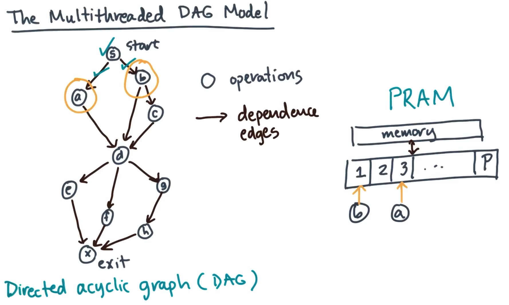
</center>

As soon as processor $3$ concludes execution (as in the figure shown above), it consequently enables any of its successors to execute. Here, since vertices $a$ and $b$ each only depend on $s$ , since vertex $s$ has concluded execution, both vertices can commence execution, and are therefore assigned to free processors accordingly (i.e., processors $1$ and $3$ , respectively)

<center>
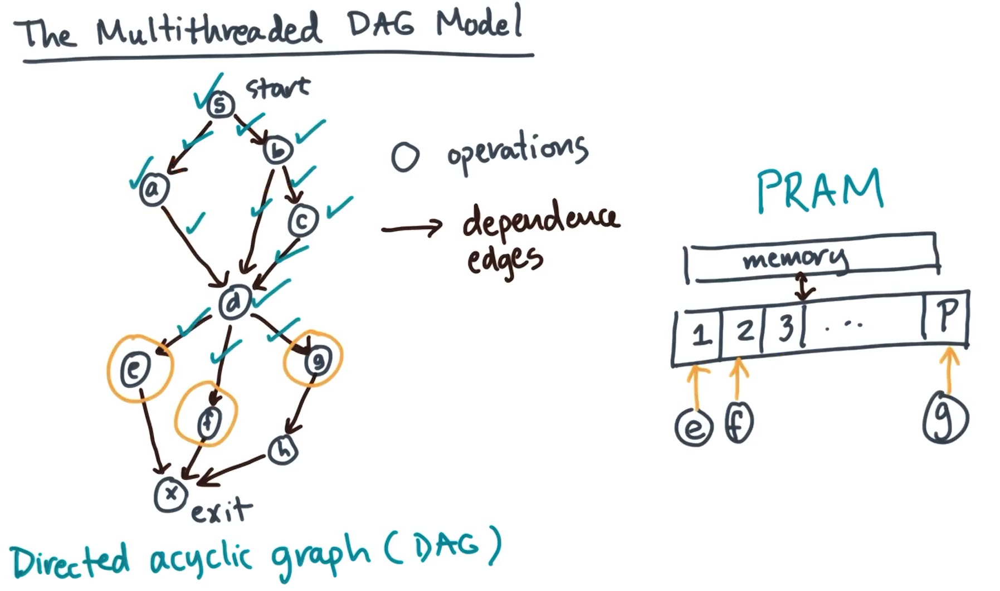
</center>

When processors $1$ and $3$ conclude their respective units of work, this in turn enables their respective successors to proceed accordingly. This sequence proceeds in this manner in turn (as in the figure shown above).

<center>
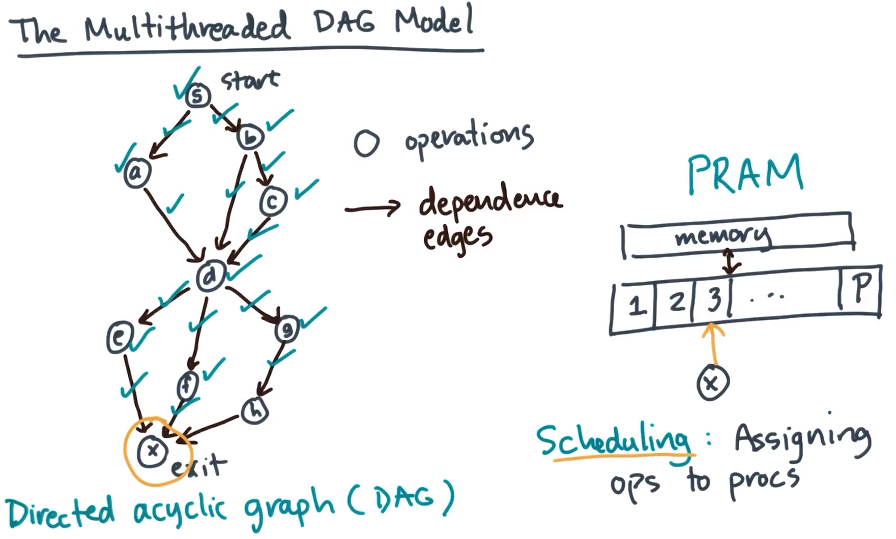
</center>

Eventually, the execution reaches the exit vertex (i.e., vertex $x$ ) (as in the figure shown above).

At every step of this computation, wherein the problem arises of how to take free units of work and to assign them to processors is called a **scheduling problem**.
  * ***N.B.*** Scheduling is a vast topic, which will be covered more thoroughly subsequently in the course.

### Cost Model for the Multi-Threaded Directed Acyclic Graph (DAG) Model

<center>
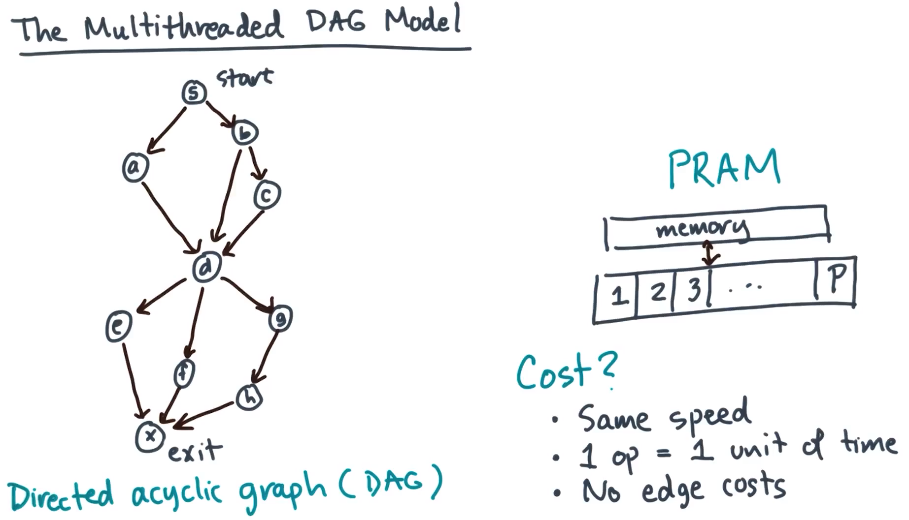
</center>

Given a directed acyclic graph (DAG) and a parallel random access memory (PRAM) machine, how long will it take to run the DAG on the PRAM machine? In order to answer this question, a corresponding **cost model** is required.

For present purposes, the **cost model** in question will be that which is subject to the following three ***assumptions***:
  * 1 - All processors of the PRAM run at the ***same*** speed
  * 2 - Each operation requires ***one*** unit of time
  * 3 - The constituent directed edges of the DAG do ***not*** have associated costs

Starting with these assumptions, discussion will now proceed onto applying this cost model to representative DAGs.

## 3. Example: Sequential Reduction

<center>
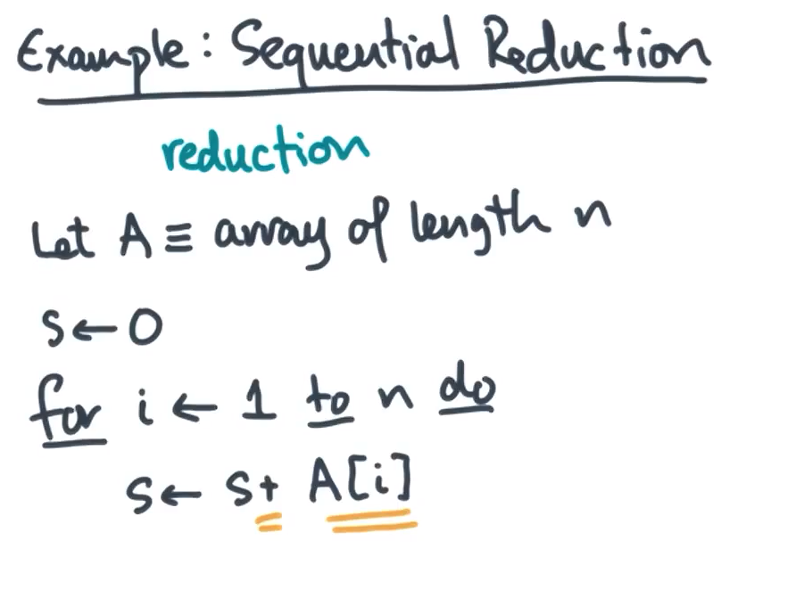
</center>

Consider the following example program, which given an array $A$ , it computes the sum of all of its elements, returned as value $s$ :

$$
\boxed{
\begin{array}{l}
{\rm{let\ }}A \equiv {\rm{array\ of\ length\ }}n\\
{s \leftarrow 0}\\
{\rm{for\ }}i \leftarrow 1{\rm{\ to\ }}n{\rm{\ do}}\\
\ \ \ \ {s \leftarrow s + A[i]}
\end{array}
}
$$

This operation is an example of a pattern called a **reduction**.

Now, suppose that only the costs for the addition operation $+$ and for the array-access operation $A[i]$ are of concern (i.e., ***assume*** that the cost of all other operations is negligible). Subsequent discussion will examine how the DAG for this computation unfolds, subject to this assumption.

### Constructing the Directed Acyclic Graph (DAG)

<center>
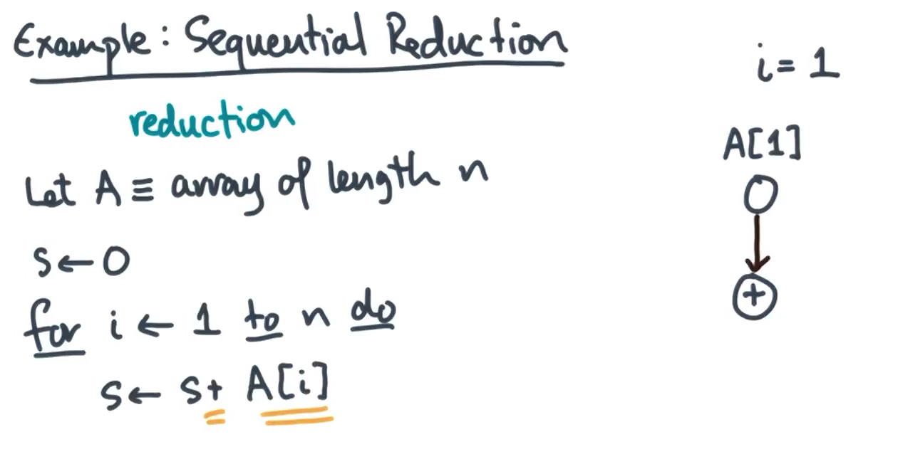
</center>

In the first iteration (as in the figure shown above), the addition node $+$ has a dependency (as denoted by corresponding dependence edge, denoted by solid brown arrow in the figure shown above) on the upstream load operation $A[1]$ , since the addition cannot proceed until the load operation is complete.

<center>
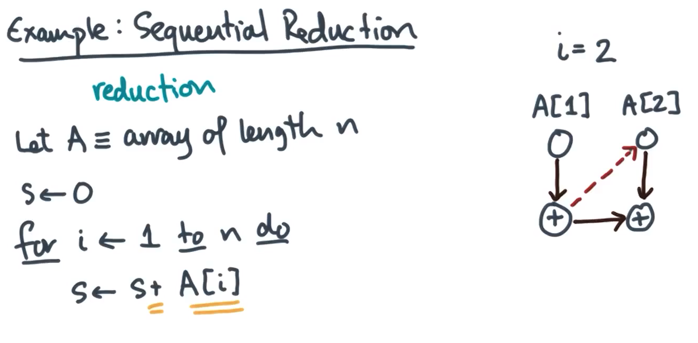
</center>

In the second iteration (as in the figure shown above), the aforementioned process is repeated with respect to load operation $A[2]$ and corresponding addition operation $+$ . Furthermore, observe that there are ***three*** dependence edges, as follows:
  * A dependence edge from the downstream operation $+$ of node $A[2]$ itself (denoted by solid brown arrow in the figure shown above)
  * A dependence edge from the downstream operation $+$ of node $A[1]$ to the downstream operation $+$ of node $A[2]$ (denoted by solid brown arrow in the figure shown above)
  * A dependence edge from the downstream operation $+$ of node $A[1]$ (denoted by red dashed arrow in the figure shown above)
    * ***N.B.*** The code is being executed ***sequentially***, thereby introducing a corresponding **control dependency** between executions of the body of the $\rm{for}$ loop (i.e., $A[2]$ cannot execute until $A[1]$ has completed). However, for present purposes, these control dependencies will be ***ignored***.

<center>
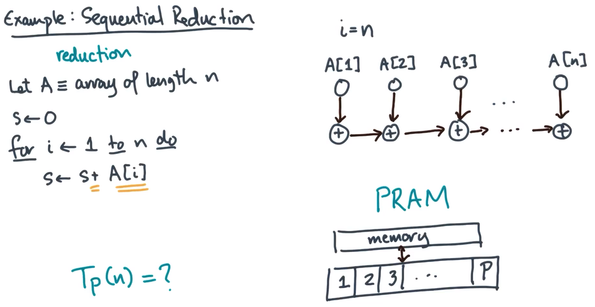
</center>

The iterations proceed in this manner through iteration $n$ (as in the figure shown above), ignoring control dependencies accordingly, yielding the corresponding final form of the DAG in question.

### Determining the Cost of the Directed Acyclic Graph (DAG)

Now, suppose that a parallel random access memory (PRAM) machine is given with corresponding $P$ processors. How long will it take the PRAM machine to execute this DAG (as denoted by $T_{P}(n)$ )?

<center>
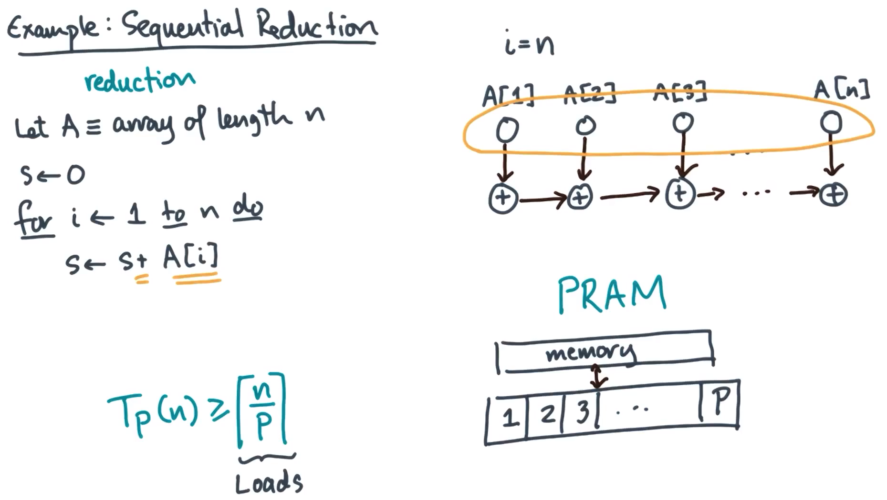
</center>

Observe that the ***load operations*** (i.e., $A[i]$ ) have no input dependencies (as in the figure shown above). Correspondingly, these can be executed as a group, assigned to corresponding processors among the available $P$ processors. Such batch execution suggests the following cost:

$$
{T_P} \ge \underbrace {\left\lceil {{n \over P}} \right\rceil }_{{\rm{loads}}}
$$

Here, $n$ load operations are divided among the $P$ processors, with each load operation requiring ***one*** unit of time; furthermore, since dealing with finite, discrete counts of processors performing discrete load operations, this implies a ceiling accordingly.

<center>
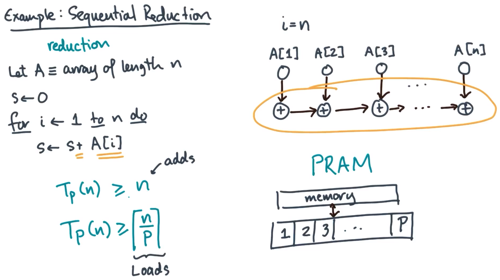
</center>

With respect to the ***addition operations*** (i.e., $+$ , as in the figure shown above), observe that there are dependencies among them. Correspondingly, a given addition operation $+$ in iteration $i$ cannot proceed until the previous addition operation (i.e., that of stage $i-1$ ) has concluded, irrespectively of the number of available processors; therefore, this implies the following cost:

$$
{T_P} \ge \underbrace n_{{\rm{additions}}}
$$

<center>
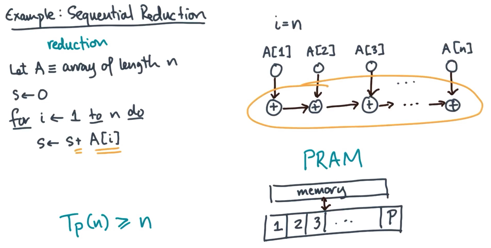
</center>

Further simplification for expressing the cost is possible. Since $P$ is at least $1$ (i.e., the machine is comprised of at least one processor), then this strictly implies that $\left\lceil {{n \over P}} \right\rceil  \le n$ , and therefore the overall cost becomes:

$$
{T_P} \ge n
$$

In conclusion, a single reduction requires $n$ total operations, even when executed on a PRAM.

## 4. A Reduction Tree Quiz and Answers

<center>
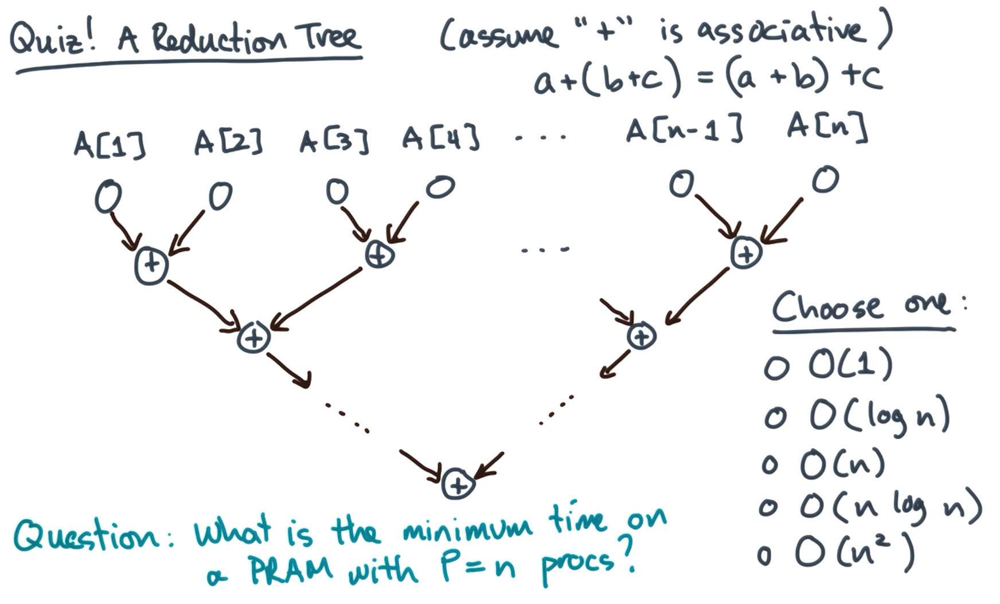
</center>

Suppose that the directed acyclic graph (DAG) for the reduction (cf. Section 3) were instead organized as a tree (as in the figure shown above).

Furthermore, let us make the technical ***assumption*** of **associativity**, whereby the following property holds with respect to the addition operations:

$$
a + (b + c) = (a + b) + c
$$

As this property implies, parenthesization is effectively "arbitrary" (with respect to affecting the resulting computation).

To build this tree representation for the DAG in question, first consider the (level $0$ , at the "top" level in the figure shown above) load operations $A[1]$ , $A[2]$ , ..., $A[n-1]$ , $A[n]$ as before (cf. Section 3). Next, add pairs of inputs (thereby forming the next level of the tree). Such intermediate results are subsequently paired in a similar manner, until the final intermediate-results pair is added to give the overall result (at the "height" level of the tree, at the "bottom" level in the figure shown above).

Given a parallel random access memory (PRAM) machine with $P = n$ processors, what is the minimum time required to execute this DAG on the PRAM machine? (Select the appropriate choice.)
  * $O(1)$
  * $O(\log n)$
  * $O(n)$
  * $O(n \log n)$
  * $O(n^2)$

### ***Answer and Explanation***:

<center>

</center>

The minimum required execution time is as follows:

$$
O(\log n)
$$

<center>
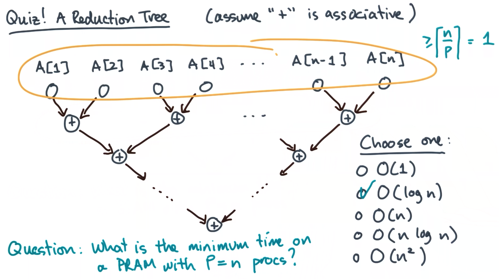
</center>

First, consider the load operations (as in the figure shown above). There are no input dependencies, and there are $n$ such load operations, therefore the required execution time is as follows:

$$
{T_P} \ge \left\lceil {{n \over P}} \right\rceil \underbrace  = _{{\rm{given\ }}n = P}1
$$

<center>
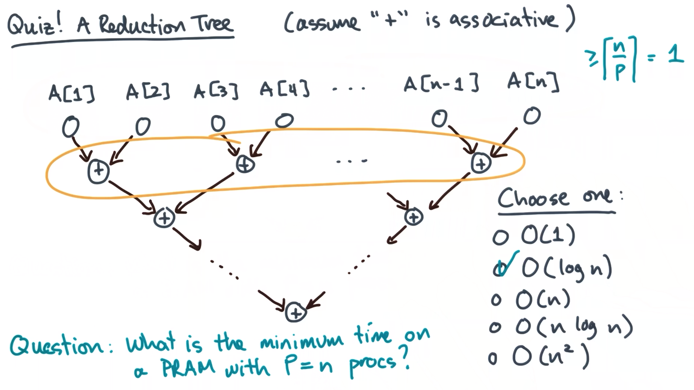
</center>

With respect to the addition operations (as in the figure shown above), at the first level, there are $N\over{2}$ nodes and $N$ available processors (i.e., a sufficient quantity of processors to execute all addition operations simultaneously), therefore the corresponding execution time is as follows:

$$
{T_P} = O(1)
$$

<center>
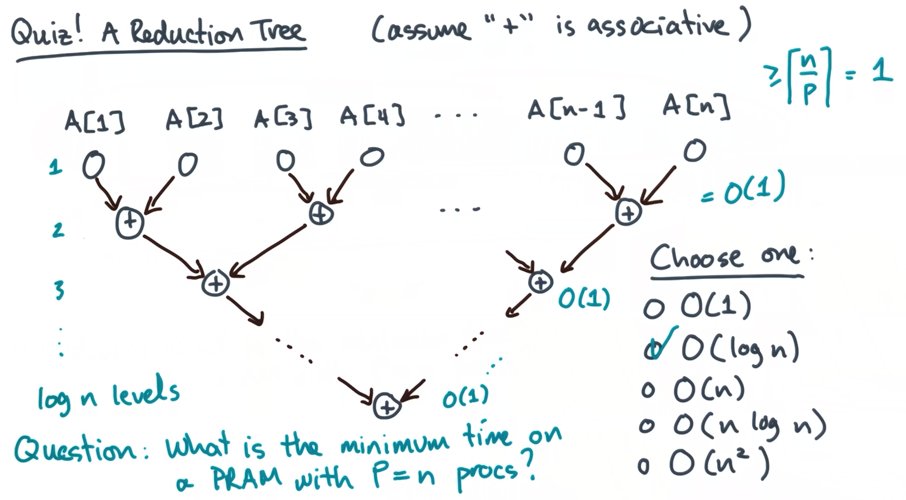
</center>

Furthermore, generalizing in this manner for the subsequent downstream addition operations (as in the figure shown above), this similarly implies a per-level execution time as follows:

$$
{T_P} = O(1)
$$

Essentially, the DAG is executed on a level-by-level basis, with each level requiring constant time of execution. Therefore, the total execution time across all such levels is given by the height of the (binary) tree, i.e.,:

$$
{T_P} = O(\log n)
$$

## 5. Work and Span

<center>
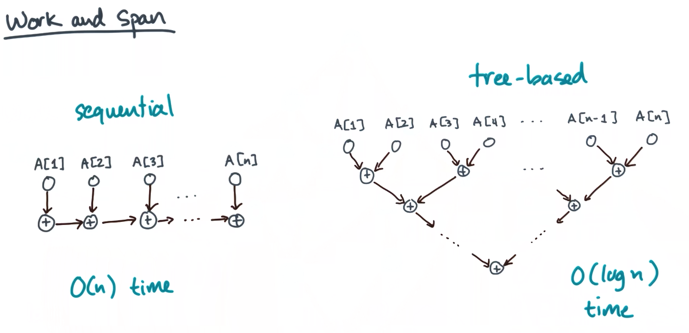
</center>

Given the directed acyclic graphs (DAGs) as in the figure shown above (both of which compute reductions), which one is better?

The sequential/linear DAG has a sequential chain of dependencies, and therefore it is fundamentally incapable of using more than one processor at a time, aside from the load operations.

Conversely, the tree-based DAG can utilize parallelism at every level of computation.

Correspondingly the respective execution times are as follows:

| DAG for performing reduction | Execution time |
|:--:|:--:|
| Sequential/linear | $O(n)$ |
| Tree-based | $O(\log n)$ |

Intuitively, given two DAGs both computing the same operations, then generally the DAG performing more parallelism is preferable (all else equal).

However, is this the only principal concern? Are there any other relevant factors of considerations? These questions (and others) are addressed in the remainder of this section via the formalism known as **work-span analysis**.

### Work-Span Analysis

<center>
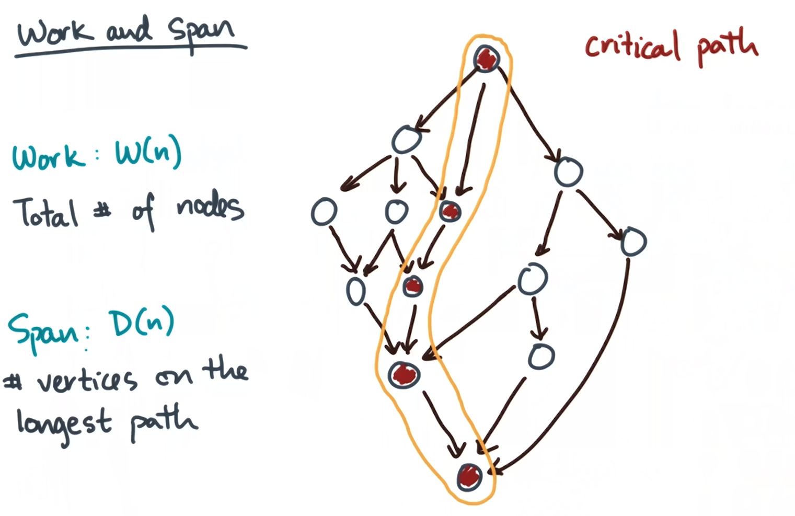
</center>

Given a directed acyclic graph (DAG) as in the figure shown above, two ***questions*** are of particular interest:
  * 1 - How many ***vertices*** does the DAG contain in total? → This is called **work**, denoted by $W(n)$ (i.e., the total number of operations generally depends on the size of the input, $n$ )
  * 2 - How long is the ***longest path*** (called the **critical path**) through the DAG? → This is called **span**, denoted by $D(n)$
    * The longest path is denoted in yellow outline in the figure shown above.
    * ***N.B.*** As a historical aside, the length of this critical path (or span) was historically called the **depth** (and hence denoted by symbol $D$ accordingly).

<center>
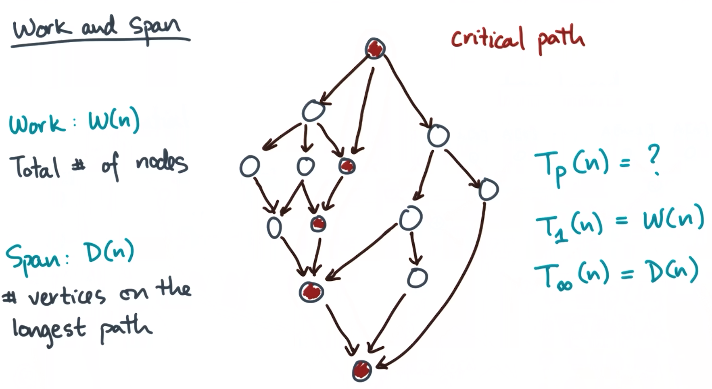
</center>

With respect to work $W(n)$ and span $D(n)$ , what can be said about the time ($T_P$ ) to execute the DAG on a parallel random access memory (PRAM) machine with $P$ processors? Observe the following:
  * If all of the operations have a ***unit cost***, then the time to execute this DAG using only ***one*** processor should be exactly the work, i.e., $T_{1}(n) = W(n)$ .
  * Conversely, if given an ***infinite*** number of processors executing corresponding unit-cost operations, then the time to execute this DAG using these infinite processors is still constrained by the critical path, i.e., $T_{\infty} = D(n)$ .

These two observations provide a useful set of heuristics, however, more discussion is necessary to further elucidate this work-span analysis, as discussed subsequently in this lesson.

## 6. Work and Span Quiz and Answers

Before proceeding further with work-span analysis, consider a review (cf. Section 5) of the basic definitions for work and span.

<center>
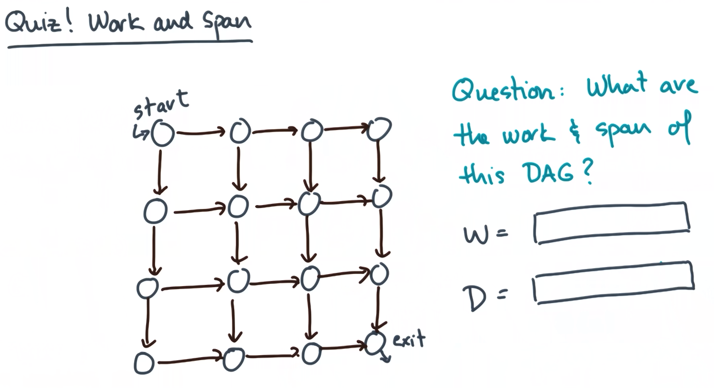
</center>

Given the directed acyclic graph (DAG) as in the figure shown above, what is the corresponding work $W(n)$ and span $D(n)$ ? (Provide integer/non-symbolic answers.)

### ***Answer and Explanation***:

<center>
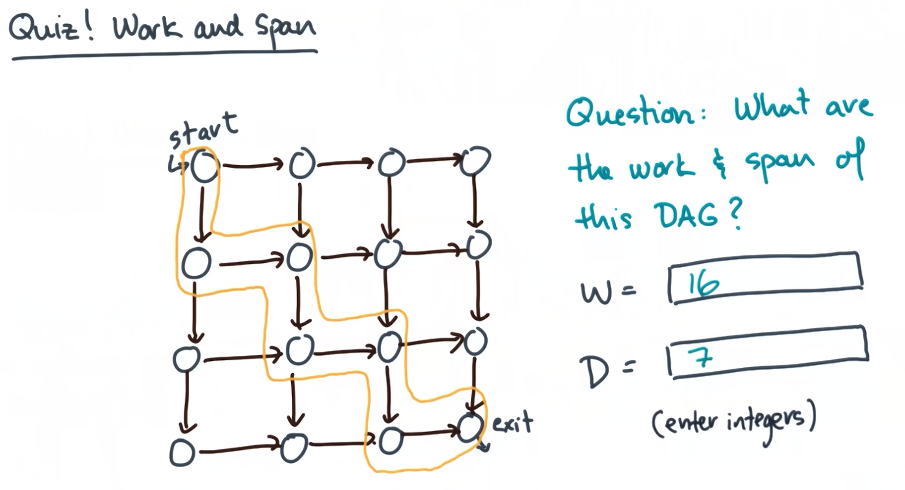
</center>

The corresponding work and span are (respectively) as follows:

$$
W(n) = 16
$$

$$
D(n) = 7
$$

The work $W(n)$ is simply the total count of vertices. Furthermore, the span $D(n)$ constitutes the longest path from start to finish (as denoted by yellow outline in the figure shown above).
  * ***N.B.*** In this particular DAG, by symmetry, all paths have the same span (i.e., $7$ vertices total); the figure shown above outlines one such representative critical path.

## 7. Work and Span for Reduction Quiz and Answers

Now, consider the application of work and span in a more abstract setting.

<center>
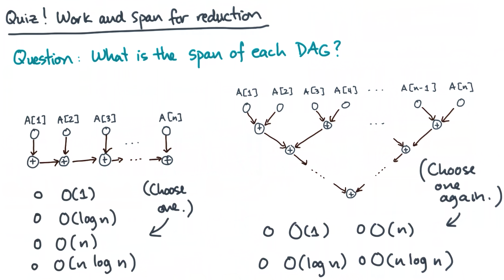
</center>

Recall (cf. Section 5) the two directed acyclic graphs (DAGs) for the reduction example (as in the figure shown above).

What are the respective spans $D(n)$ for each DAG? (Select one choice for each DAG among the following for choices.)
  * $O(1)$
  * $O(\log n)$
  * $O(n)$
  * $O(n \log n)$

### ***Answer and Explanation***:

<center>
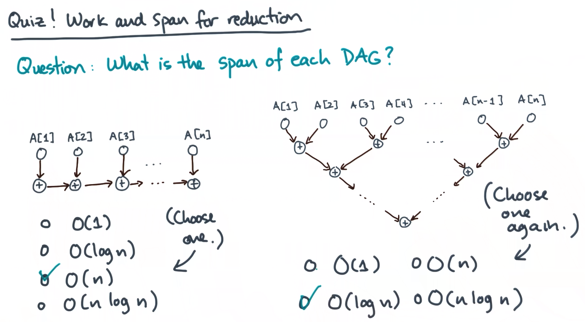
</center>

For the sequential/linear DAG, the critical path traverses all of the addition operations, and since there are $n$ such addition operations, this suggests the following:

$$
D(n) = O(n)
$$

For the tree-based DAG, all paths include at least one vertex from each level, and since there are $\log n$ levels in the tree, this suggests the following:

$$
D(n) = O(\log n)
$$

## 8. Basic Work-Span Laws

<center>
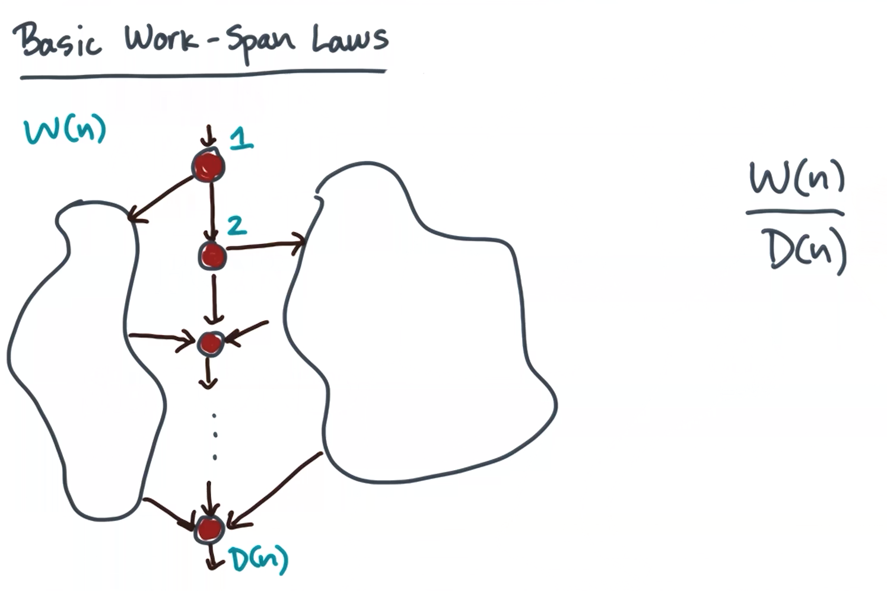
</center>

To further develop intuition, consider the directed acyclic graph (DAG) as in the figure shown above, comprised of work $W(n)$ and span $D(n)$ . Their ratio is as follows:

$$
W(n) \over D(n)
$$

This ratio has a special ***interpretation***: It measures the amount of work per critical-path vertex. Accordingly, at every critical path, there is an average amount of work. Therefore, this ratio indicates the **average available parallelism** in the DAG.

<center>
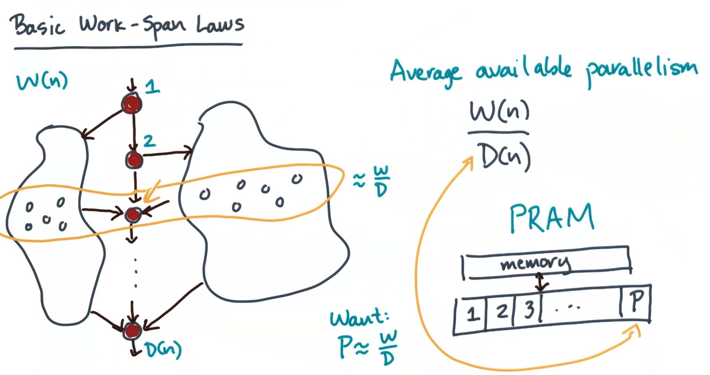
</center>

Consider a given critical-path vertex (as denoted by goldenrod arrow in the figure shown above). When this critical-path vertex executes, there is corresponding work performed, the average of which is characterized by $\approx {W \over D}$ .

The implications of this is that given a parallel random access memory (PRAM) machine with $P$ processors, presumably $P \approx {W \over D}$ available processors would be ideal in this scenario, thereby ensuring that the processors are fully utilized on average at any given time.

<center>
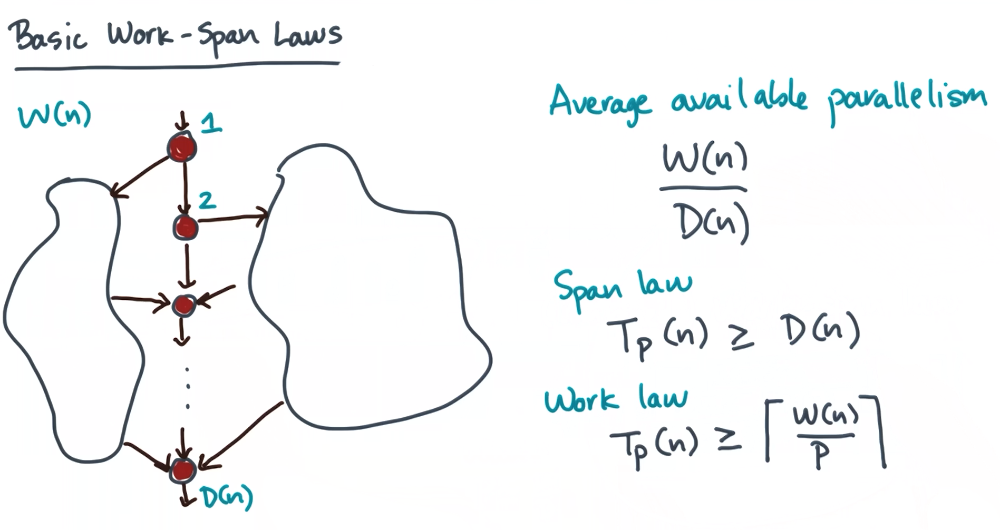
</center>

Work and span provide additional insight into this. Firstly, recall (cf. Section 5) that span is the lower bound on execution time, i.e.,:

$$
T_p(n) \ge D(n)
$$

This is called the **span law**.

Additionally, besides a lower bound on the span, there is also a lower bound on the work itself, whereby if there is no distinct critical path (within the scope of the overall work to be performed), then all of the work can be divided evenly among the $P$ processors, i.e.,:

$$
{T_p}(n) \ge \left\lceil {{{W(n)} \over P}} \right\rceil
$$

This is called the **work law**.

<center>
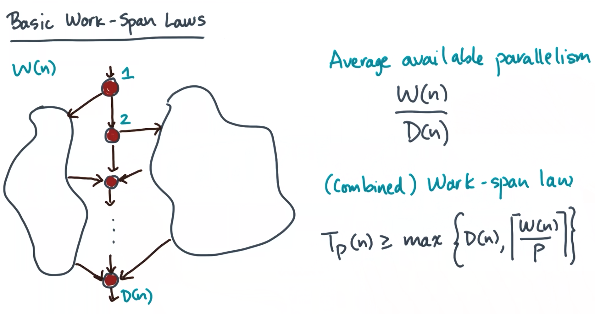
</center>

Furthermore, since both laws hold in general (and simultaneously), then these can be combined into the **(combined) work-span law** as follows:

```math
{T_p}(n) \ge \max \left\{ {D(n),\left\lceil {{{W(n)} \over P}} \right\rceil } \right\}
```

To summarize, the averaged available parallelism in the DAG is characterized by $W(n) \over {D(n)}$ , whereas the work-span law describes the ***lower bound*** with respect to $P$ available processors running the overall work of the DAG.

## 9. Brent's Theorem, Part 1 (Setup)

<center>
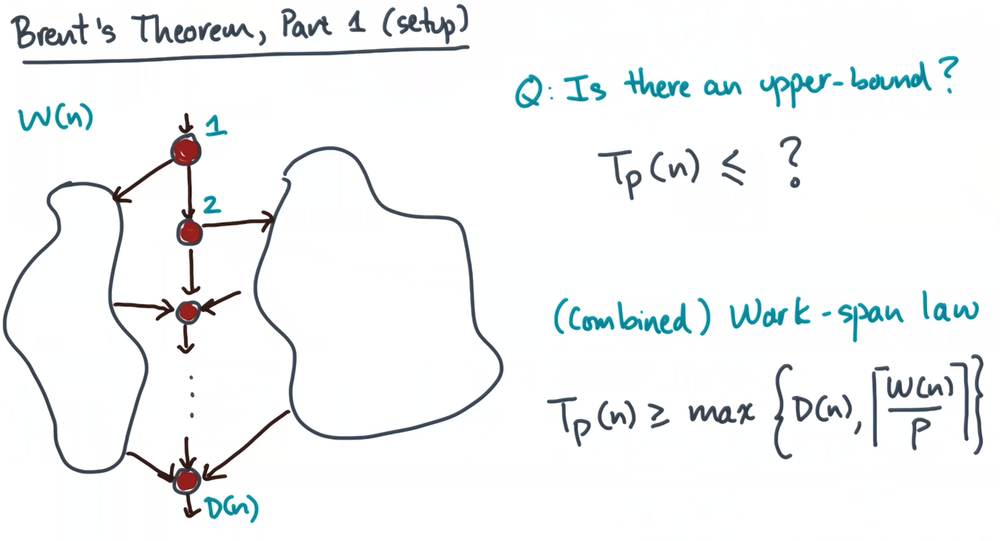
</center>

Recall (cf. Section 8) that work and span laws quantify the minimum possible time. However, consider an additional interesting question: Is there an ***upper bound*** on the time to execute the directed acyclic graph (DAG)? Symbolically:

$$
T_{P}(n) \le \rm{\ ?}
$$

In fact, such an upper bound does indeed exist, according to a **theorem** by Richard Brent (i.e., **Brent's theorem**).
  * ***N.B.*** This elegant theorem provides a lot of insight into parallel algorithms via its derivation, which is the corresponding focus in this and subsequent sections accordingly.

### Three Conditions to Define Execution Phases

<center>
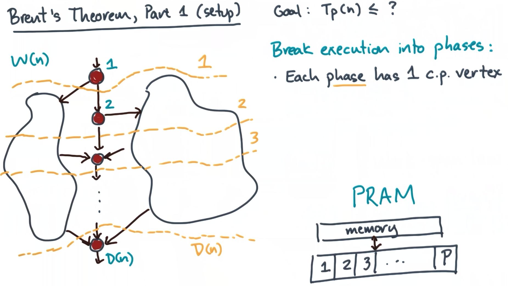
</center>

Given a DAG with a certain amount of work and a particular span (as in the figure shown above), the ***objective*** is to estimate an upper bound on the execution time of this DAG, i.e., $T_{P}(n) \le \rm{\ ?}$ .

Suppose that the system for its execution is given as a parallel random access memory (PRAM) machine with $P$ processors. In analyzing the execution of the DAG on this PRAM machine, the execution can be broken up into ***phases*** (as denoted by broken lines in the figure shown above), where each phase satisfies three **conditions**.

#### The First Condition

The **first condition** states that each phase has exactly ***one*** critical-path vertex.
  * This condition immediately implies that there must be $D(n)$ such phases accordingly (denoted in teal numbering as $1$ , $2$ , $\cdots$ , $D(n)$ in the figure shown above). Furthermore, note that since the critical-path vertices are numbered, and there is one critical-path vertex per phase, then the phases can be correspondingly numbered unambiguously with the associated critical-path vertex (denoted by numbered broken goldenrod curves as in the figure shown above).

#### The Second Condition

<center>

</center>

The **second condition** states that ***all*** non-critical-path vertices within a given phase are independent (as in the figure shown above).

<center>
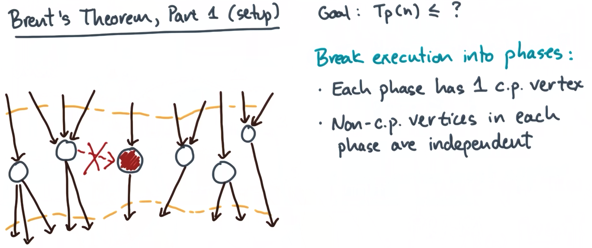
</center>

Given any phase with its single critical-path vertex (as in the figure shown above), any non-critical-path vertices which have been assigned to this same phase (denoted by white circles in the figure shown above) can only have vertices that enter the phase or exit the phase, but they cannot otherwise ever depend on one another (e.g., such an invalid dependency is denoted by broken red arrow in the figure shown above).

***N.B.*** The second condition is ***always*** possible to satisfy. The proof of this is left as an exercise to the reader. As a hint, consider basic facts about paths, and then apply this reasoning to the fact that the critical-path vertex lies on the longest path.

#### The Third Condition

<center>
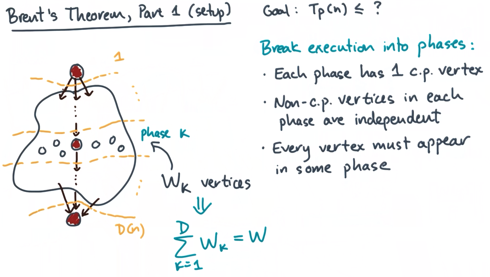
</center>

The **third condition** states that ***every*** vertex must appear in some phase, and ***only*** in one such phase (as in the figure shown above).

Given a DAG divided into phases (as in the figure shown above), every such phase $k$ will have some number of vertices associated with it, denoted by $W_k$ . Furthermore, note that this value $W_k$ includes the critical-path vertex.

By this third condition, the implication is that the sum of $W_k$'s across all of the phases yields the total number of vertices, i.e.,:

$$
\sum\limits_{k = 1}^D {{W_k}} = W
$$

<center>
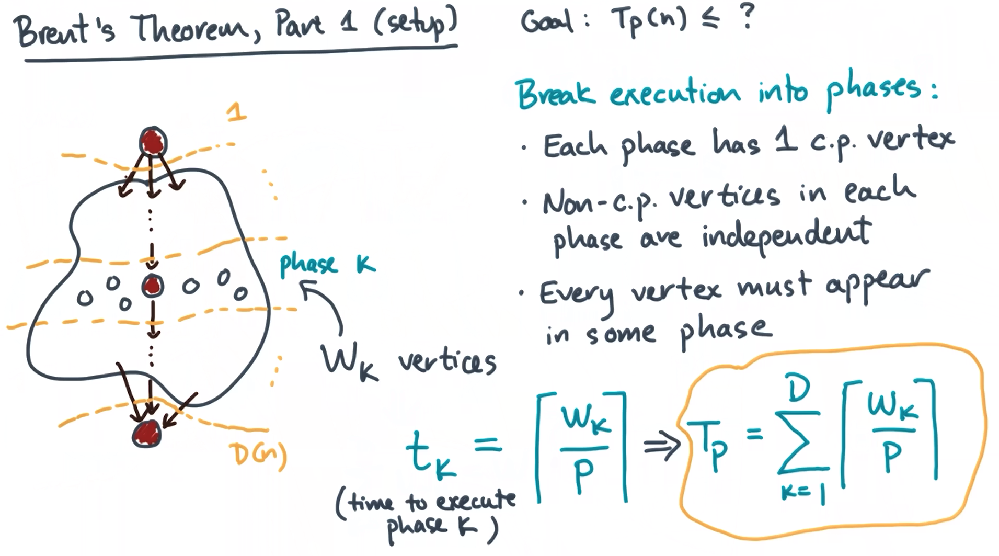
</center>

So, then, how long will it take to execute phase $k$ (as denoted by $t_k$ )?

Given $W_k$ units of independent work (as per the second condition) and $P$ available processors, then this implies (summing over all phases accordingly):

$$
{t_k} = \left\lceil {{{{W_k}} \over P}} \right\rceil  \Rightarrow {T_P} = \sum\limits_{k = 1}^D {{t_k}}
$$

***N.B.*** The utility of this intermediate result will become more apparent shortly.

## 10. Brent's Theorem Aside: Floor and Ceiling Identities Quiz and Answers

<center>
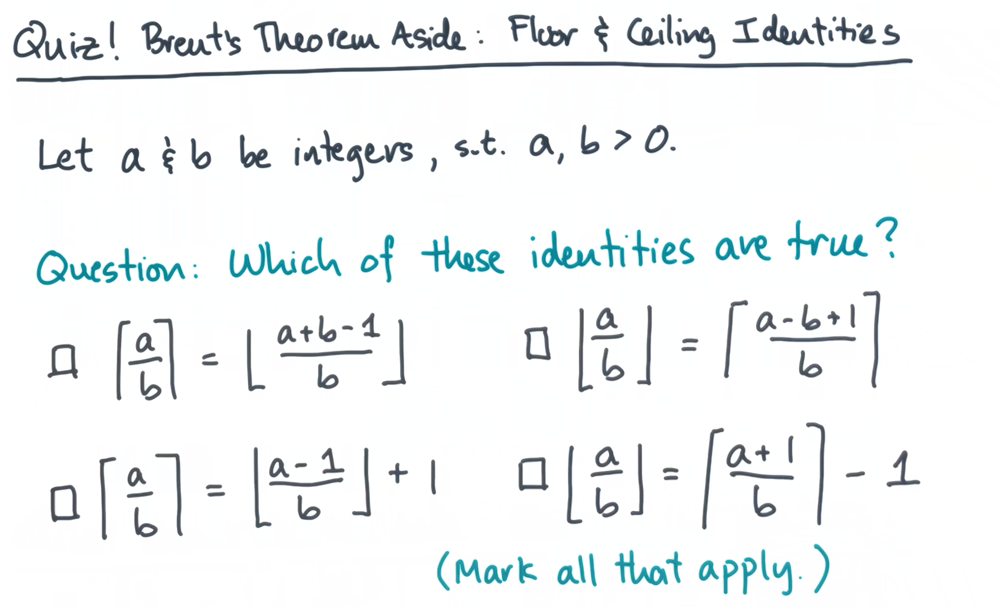
</center>

Suppose two positive integers $a$ and $b$ are given, such that $a, b > 0$ . Which of the following identities are true? (Select all that apply.)
  * $\left\lceil {{a \over b}} \right\rceil  = \left\lfloor {{{a + b - 1} \over b}} \right\rfloor$
  * $\left\lceil {{a \over b}} \right\rceil  = \left\lfloor {{{a - 1} \over b}} \right\rfloor  + 1$
  * $\left\lfloor {{a \over b}} \right\rfloor  = \left\lceil {{{a - b + 1} \over b}} \right\rceil$
  * $\left\lfloor {{a \over b}} \right\rfloor  = \left\lceil {{{a + 1} \over b}} \right\rceil  - 1$

### ***Answer and Explanation***:

<center>
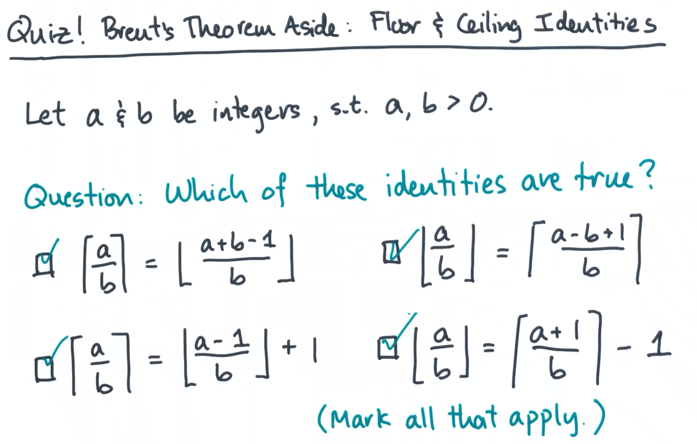
</center>

All of these identities are true.

### Instructor's Notes

This [page](https://en.wikipedia.org/wiki/Floor_and_ceiling_functions) on Wikipedia provides corresponding derivations for several of these identities.

## 11. Brent's Theorem, Part 2 (Finish)

<center>
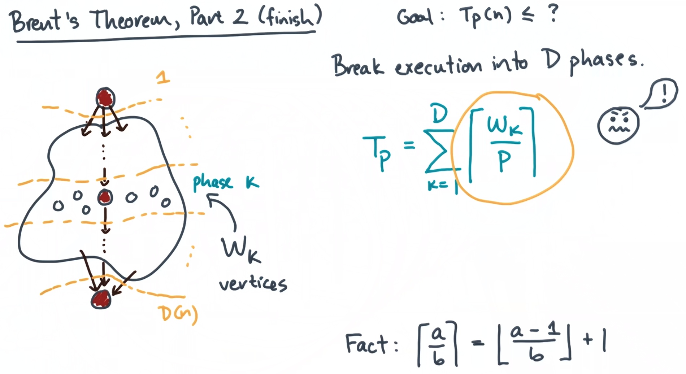
</center>

Recall (cf. Section 9) that the objective of Brent's Theorem is to provide an upper bound on the execution time.

To accomplish this objective, execution of the directed acyclic graph (DAG) on the parallel random access memory (PRAM) machine with $P$ processors was divided into corresponding **phases** (as in the figure shown above), with each phase $k$ performing $W_k$ unites of work. Furthermore, the time to execute each phase ($t_k$ ) can be used to define the overall execution time ($T_P$ ) as follows:

$$
{T_P} = \sum\limits_{k = 1}^D {\underbrace {\left\lceil {{{{W_k}} \over P}} \right\rceil }_{{t_k}}}
$$

With respect to the ceiling in this expression, note the following fact (cf. Section 10):

$$
\left\lceil {{a \over b}} \right\rceil  = \left\lfloor {{{a - 1} \over b}} \right\rfloor  + 1
$$

<center>
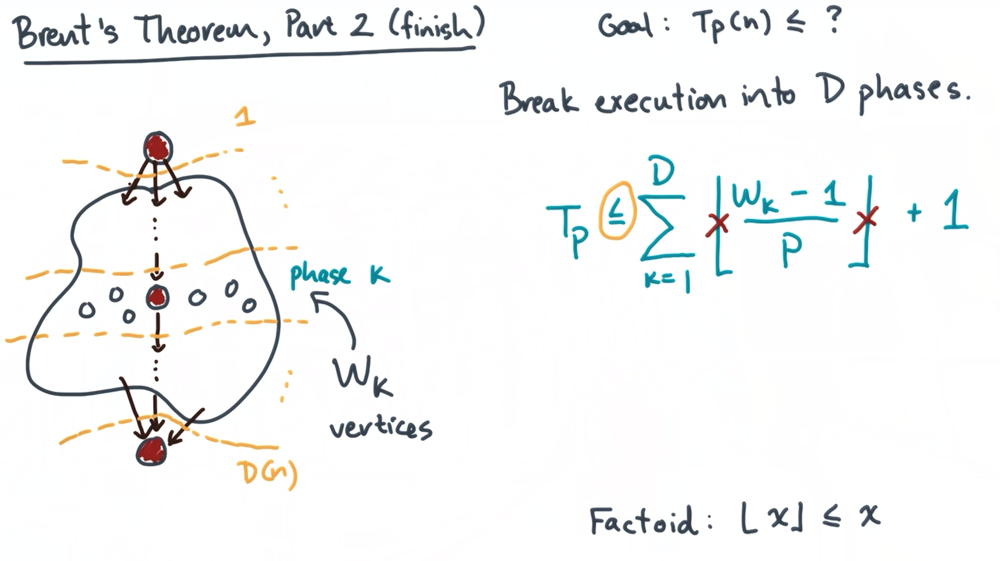
</center>

Using this fact, the ceiling can be converted to a floor as follows:

$$
{T_P} = \sum\limits_{k = 1}^D {\left( {\left\lfloor {{{{W_k} - 1} \over P}} \right\rfloor  + 1} \right)}
$$

While this may not appear to "improve" the ability to arrive at the objective, note that the objective is to determine the upper bound. Correspondingly, note the following in this vein:

$$
\left\lfloor x \right\rfloor \le x
$$

Therefore, the floor can be eliminated accordingly as follows:

$$
{T_P} \le \sum\limits_{k = 1}^D {\left( {{{{W_k} - 1} \over P} + 1} \right)}
$$

<center>
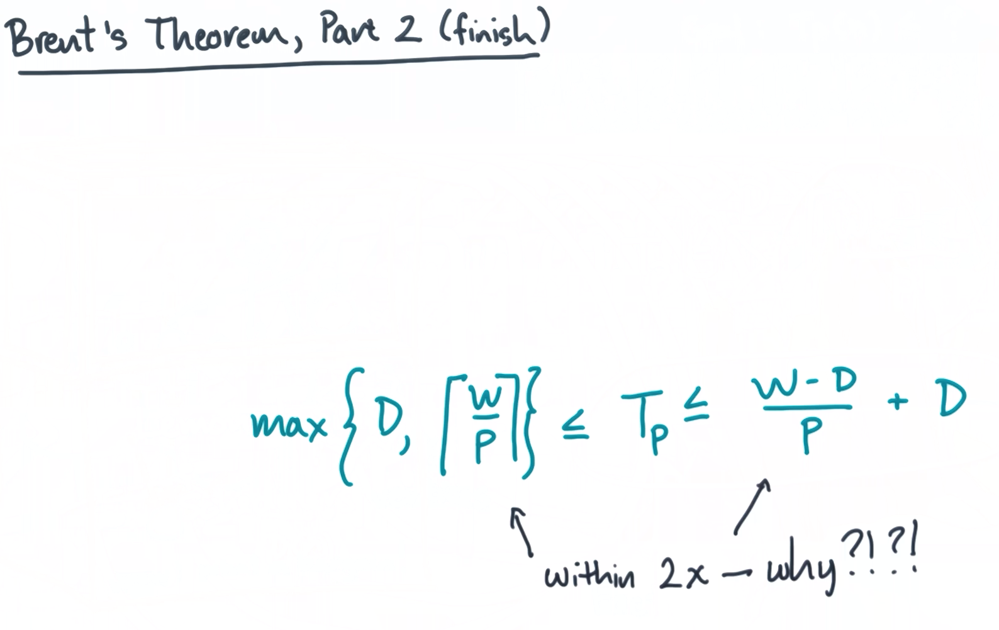
</center>

Evaluating the right-hand-side expression therefore yields the following:

$$
{T_P} \le {{W - D} \over P} + D
$$

In fact, this final result is **Brent's theorem**. Furthermore, note that this result is rather intuitive: It states that the time to execute the DAG ($T_P$ ) is no more than the sum of the time to execute the critical path ($D$ ) and the time to execute off of the critical path using the available $P$ processors (${W - D} \over {P}$ ).
  * ***N.B.*** Furthermore, this result sets a corresponding ***goal*** for any scheduler. When critically assessing a proposed scheduling algorithm, its ideal possible performance will be constrained by Brent's theorem accordingly.

As a final point, note that this derived result is an ***upper bound*** for a given DAG. However, recall (cf. Section 9) that the (combined) work-span law provides the corresponding ***lower bound*** as well, i.e.,:

```math
\max \left\{ {D(n),\left\lceil {{{W(n)} \over P}} \right\rceil } \right\} \le {T_P} \le {{W - D} \over P} + D
```

An interesting fact is that both the upper and lower bounds as given here are within a factor of $2 \times$ of each other. This implies that the DAG may be executed in a time that is otherwise ***less*** than that predicted by Brent's theorem (though, of course, the lower bound cannot be exceeded).

## 12. Applying Brent's Theorem, Part 1 Quiz and Answers

<center>
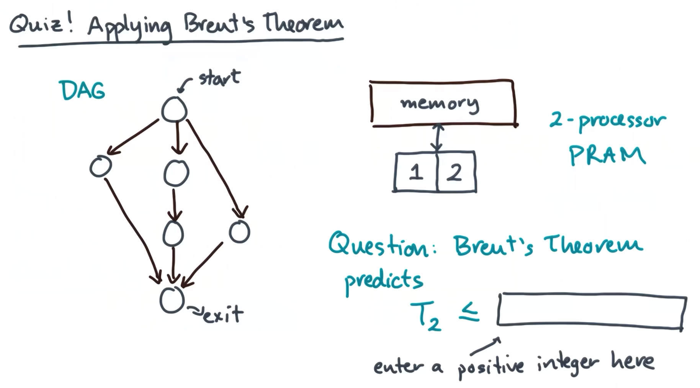
</center>

Consider running the directed acyclic graph (DAG) as in the figure shown above on a two-processor parallel random access memory (PRAM) machine. What is the upper bound predicted by Brent's Theorem? (Provide a positive integer.)

### ***Answer and Explanation***:

<center>
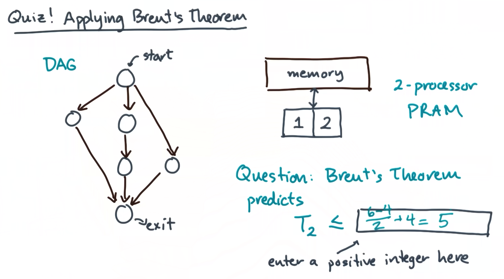
</center>

There are $6$ total units of work ($W$ ) and a critical-path length ($D$ ) of $4$ . Therefore, Brent's Theorem predicts the following upper bound:

$$
{T_2} \le {{6 - 4} \over 2} + 4 = 5
$$

## 13. Applying Brent's Theorem, Part 2 Quiz and Answers

Brent's theorem is an upper bound on the execution time. This means that given a directed acyclic graph (DAG) running on a parallel random access memory (PRAM) machine, the PRAM machine might run the DAG in less time than Brent's Theorem would otherwise predict.

<center>
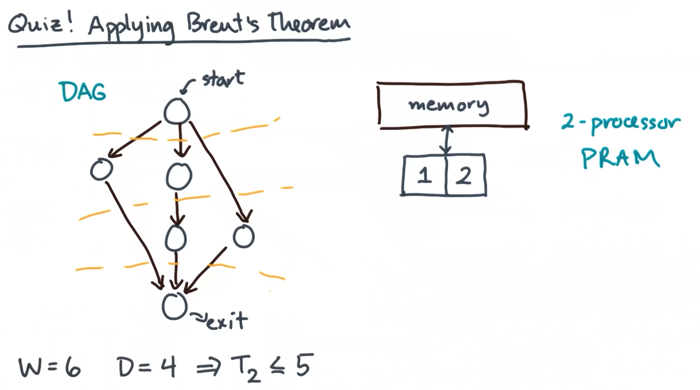
</center>

Returning to the previous example (cf. Section 12), it was shown that the predicted upper bound is $5$ time units (i.e., $T_{2} \le 5$ ).

By inspection, as this DAG suggests, it can be readily observed that execution is possible using only $4$ time units, by dividing into corresponding phases (as denoted by broken goldenrod lines in the figure shown above), with $4$ phases having at most $2$ units of work (i.e., with full utilization of the two processors at any given time). Accordingly, there is some "slack" in Brent's Theorem with respect to the upper bound.

<center>

</center>

Correspondingly, provide a different (but valid) assignment of the vertices to corresponding phases that instead takes $5$ time units rather than $4$ time units. (Denote by corresponding phase number in the boxes provided in the figure shown above.)
  * ***N.B.*** Recall (cf. Section 9) that the first condition states that every phase must include exactly ***one*** critical-path vertex.

### ***Answer and Explanation***:

<center>
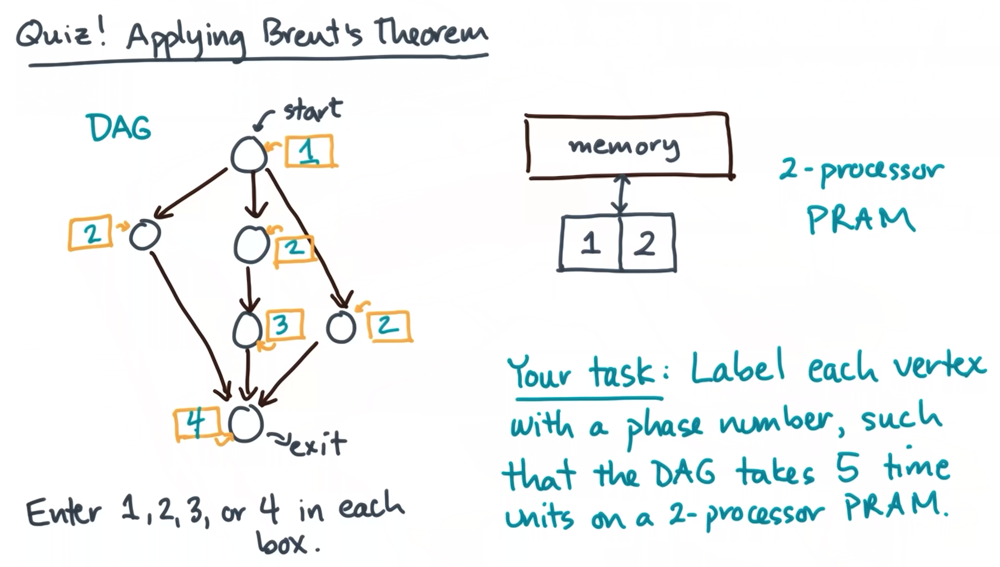
</center>

One possible assignment is as in the figure shown above. Here, after phase $1$ completes, any of the three downstream units can commence execution; assigning all three to phase $2$ accordingly, this creates a corresponding "bottleneck" with respect to the two-processor PRAM machine, thereby requiring two steps to execute this phase. This essentially demonstrates the "slack" introduced by the ceiling in Brent's Theorem.

Furthermore, observe that choosing such assignments of work to corresponding processors, and correspondingly breaking down the execution phases in this manner, is precisely what makes scheduling an inherently challenging objective (i.e., as the complexity of the DAG in question increases).

## 14. Desiderata: Speedup, Work-Optimality, and Weak-Scalability

<center>
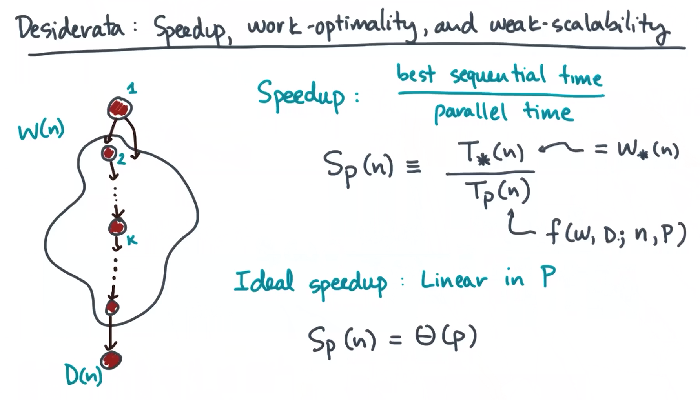
</center>

Given a directed acyclic graph (DAG) and a weight-estimated execution time, how to determine whether the performance of the DAG is good or bad? To determine this, first we will identify a metric of "goodness," and then this metric will be optimized accordingly.

The metric used for this purpose will be **speedup**, defined as follows:

```math
\underbrace {{S_P}(n)}_{{\rm{speedup}}} \equiv {{\overbrace {{T_* }(n)}^{{\rm{optimal\ sequential\ time}}}} \over {\underbrace {{T_P}(n)}_{{\rm{parallel\ time}}}}}
```

***N.B.*** Here, in general, $T_P(n) = f(W, D; n, P)$ (where $W$ is the work, $D$ is the span, $n$ is the problem size, and $P$ is the number of processors),  whereas $T_* (n)$ only depends on $n$ (i.e., the work performed by the optimal sequential algorithm); therefore, for notational consistency, $W_* (n)$ will be used to represent the latter for notational consistency.

So, then, what is particularly "optimal" about the best sequential time $W_* (n)$ ?

### Speedup

Given a parallel random access memory (PRAM) machine with $P$ processors, then, ideally, the parallel algorithms should perform $P$ times faster than this best sequential algorithm. This **ideal speedup** condition (also called **linear speedup**, **linear scaling**, or **ideal scaling**) is therefore defined as follows:

$$
S_P(n) = \Theta(P)
$$

***N.B.*** $\Theta$ notation is appropriate here, since constant factors are not of particular concern.

<center>
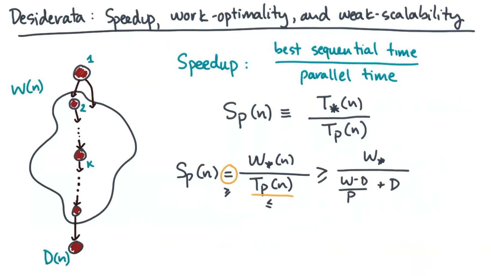
</center>

Now, consider the speedup in terms of the best sequential work and parallel time, i.e.,:

$$
S_P(n) = {{W_* (n)} \over {T_P(n)}}
$$

Furthermore, using Brent's Theorem (cf. Section 11), an upper bound on time can be applied (and consequently a lower bound on speedup), as follows:

```math
S_P(n) = {{W_* (n)} \over {T_P(n)}} \ge {{W_* } \over {{W - D} \over P} + D}
```

***N.B.*** For notational convenience, $(n)$ is omitted in the right-hand expression.

### Work-Optimality

<center>
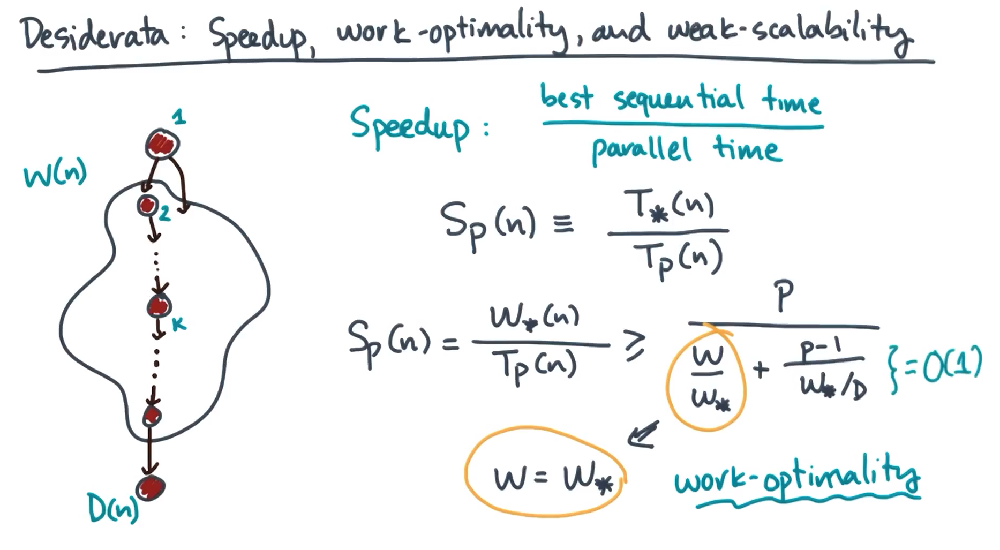
</center>

Furthermore, algebraic simplification of the right-hand side yields the following:

```math
S_P(n) = {{W_* (n)} \over {T_P(n)}} \ge {{P} \over {{W \over {W_* }} + {{P - 1} \over {{W_* }/D}}}}
```

In this form, it is more readily apparent what is necessary in order to achieve ideal scaling per the right-hand expression: Relative to the numerator $P$ (i.e., the number of processors), the corresponding penalty is determined by the denominator (i.e., in order to achieve ideal/linear scaling, the denominator must be constant, i.e., $O(1)$ ).

In order to achieve a constant denominator, consider each term in turn.

With respect to the first term in the denominator, this requires ${W = W_* }$ , a condition called **work-optimality**. Intuitively, work-optimality prevents a form of "cheating": Work-optimality implies that if a highly parallel algorithm is achieved simply by dramatically increasing the work relative to the best sequential algorithm, then this is actually *detrimental* to achieving speedup.

### Weak Scalability

<center>
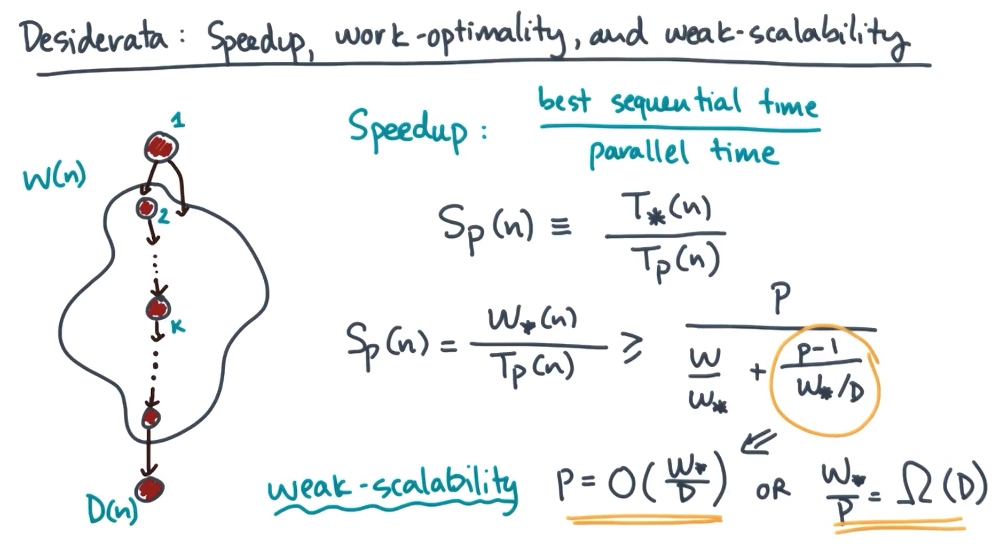
</center>

With respect to the second term in the denominator, in order for this term to be constant, this requires the following:

$$
P = O\left( {{{{W_ * }} \over D}} \right) \Rightarrow {{{W_ * }} \over P} = \Omega (D)
$$

This is similar to the idea of the average available parallelism (cf. Section 8), however, here it is expressed with respect to ${W_* }$ (i.e., rather than $W$ ). Furthermore, in the latter characterization (i.e., $W_* \over {P}$ , the work per processor) suggests that the work per processor must grow proportionally to the span $D$ (recall that $D$ depends on the problem size $n$ ). In the literature, this problem-size-dependent growth is called **weak scalability**, i.e., as the concurrency of the machine is increased, then in order to achieve adequate scaling, this may require a corresponding increase in the problem size.

### Recap

<center>
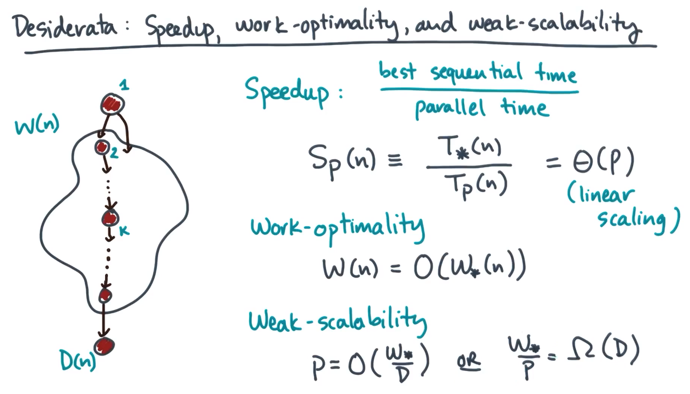
</center>

As a recap of the overall algorithm design goal, this is summarized as follows:

| Characteristic | Algorithmic time | Comment |
|:--:|:--:|:--:|
| Speedup | $S_P(n) \equiv {{T_* (n)} \over T_P(n)} = \Theta(P)$ | To achieve linear scaling, this requires work-optimality and weak-scalability (two fundamental principles of good parallel algorithm design) |
| Work-optimality | $W(n) = O(W_* (n))$ | The work of the parallel algorithm $W$ should match the work of the best sequential algorithm $W_* $ |
| Weak-scalability | $P = O({W_* \over D})$ or ${W_* \over P} = \Omega(D)$ | In the latter form, the work $W$ per processor $P$ should grow as a function of the input size $n$ (via span $D(n)$ ) |

## 15. Which Parallel Algorithm Is Better? Quiz and Answers

<center>
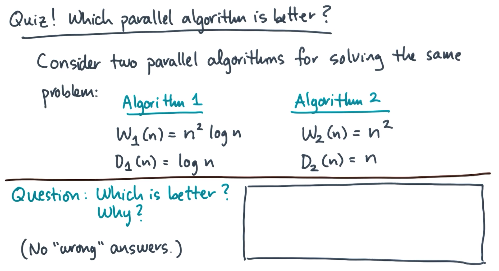
</center>

Consider the following two parallel algorithms:

| Algorithm | Work | Span |
|:--:|:--:|:--:|
| $1$ | $W_1(n) = n^{2} \log n$ | $D_1(n) = \log n$ |
| $2$ | $W_2(n) = n^2$ | $D_2(n) = n$ |

Which parallel algorithm has better performance? If so, why?
  * ***N.B.*** This is an open-ended question.

### ***Answer and Explanation:***

<center>
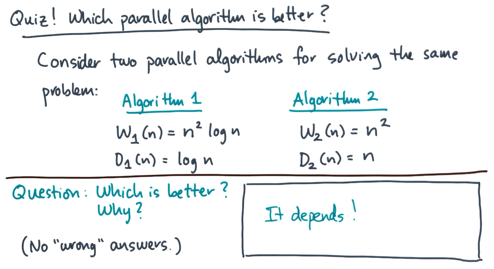
</center>

There is no definitively "better" among the two algorithms. "Better" in this context depends on what is being optimized for, i.e., work-optimality, lowest span, linear speedup, faster execution time, etc. For this purpose, there are many cases to consider accordingly.

### Instructor's Notes

See provided solution for Fall 2015 Question 1 for further elaboration.

## 16. Basic Concurrency Primitives: Spawn and Sync

In principle, a given directed acyclic graph (DAG) could be scheduled on a parallel random access memory (PRAM) machine. However, this begs the question: Where does such a DAG come from? The answer to this is that such a DAG is generated by a corresponding **programming model**. This section will highlight one such programming model, which is particularly clean and elegant.

### Sequential Algorithm

<center>
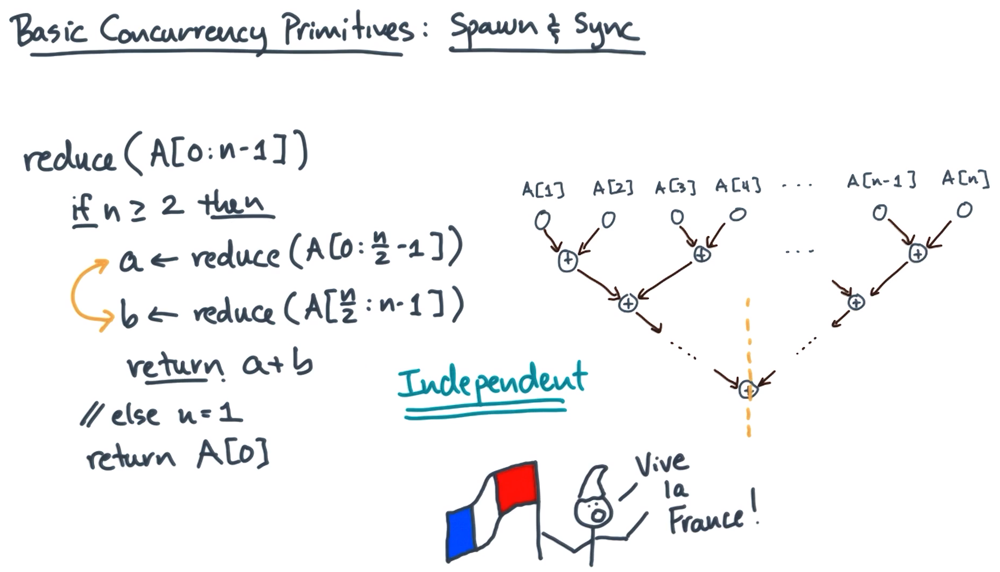
</center>

Consider the DAG for a divide-and-conquer algorithm to compute a reduction (as in the figure shown above). Recall (cf. Section 3) that it is work-optimal and has a logarithmic span.

Furthermore, consider the algorithm to produce this DAG, given as follows:

$$
\boxed{
\begin{array}{l}
{{\rm{reduce}}\left( {A[0:n - 1]} \right)}\\
\ \ \ \ {{\rm{if\ }}n \ge 2{\rm{\ then}}}\\
\ \ \ \ \ \ \ \ {a \leftarrow {\rm{reduce}}\left( {A\left[ {0:{n \over 2} - 1} \right]} \right)}\\
\ \ \ \ \ \ \ \ {b \leftarrow {\rm{reduce}}\left( {A\left[ {{n \over 2}:n - 1} \right]} \right)}\\
\ \ \ \ \ \ \ \ {{\rm{return\ }}a + b}\\
\ \ \ \ {{\rm{//\ else\ }}n = 1}\\
\ \ \ \ {{\rm{return\ }}A[0]}
\end{array}
}
$$

This algorithm implements the divide-and-conquer DAG in a sequential manner. In particular, the elements $a$ and $b$ are computed in a recursive, divide-and-conquer manner (splitting array $A$ in half with each level of recursion).

### Parallel Algorithm Using Concurrency Primitives

<center>
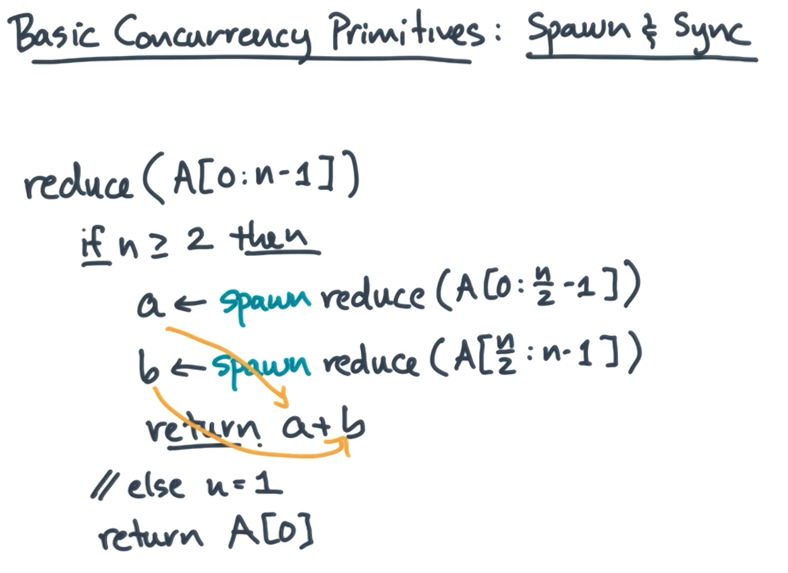
</center>

Observe that these two recursive calls to $\rm{reduce}$ are ***independent*** of one another. To denote this appropriately, the ***keyword*** $\rm{spawn}$ will be used accordingly, thereby modifying the algorithm as follows:

$$
\boxed{
\begin{array}{l}
{{\rm{reduce}}\left( {A[0:n - 1]} \right)}\\
\ \ \ \ {{\rm{if\ }}n \ge 2{\rm{\ then}}}\\
\ \ \ \ \ \ \ \ {a \leftarrow {\rm{spawn\ reduce}}\left( {A\left[ {0:{n \over 2} - 1} \right]} \right)}\\
\ \ \ \ \ \ \ \ {b \leftarrow {\rm{spawn\ reduce}}\left( {A\left[ {{n \over 2}:n - 1} \right]} \right)}\\
\ \ \ \ \ \ \ \ {{\rm{return\ }}a + b}\\
\ \ \ \ {{\rm{//\ else\ }}n = 1}\\
\ \ \ \ {{\rm{return\ }}A[0]}
\end{array}
}
$$

The **target** of a $\rm{spawn}$ is always either a function call or a procedure call (e.g., the function $\rm{reduce}$ , in this particular case). The keyword $\rm{spawn}$ is a signal to either the compiler or to the run-time system that the target is an ***independent unit of work***. By inserting a $\rm{spawn}$ in this manner, this effectively indicates that the target may be executed asynchronously from the caller, any time a processor is available.

Here, even though the two calls to $\rm{reduce}$ are independent units of work, observe that they produce the intermediate results $a$ and $b$ which must be subsequently combined (i.e., there is a dependence from $a$ and $b$ to the statement $\rm{return}$ ). Therefore, in addition to $\rm{spawn}$ , there must be another corresponding mechanism for denoting these kinds of dependencies.

<center>
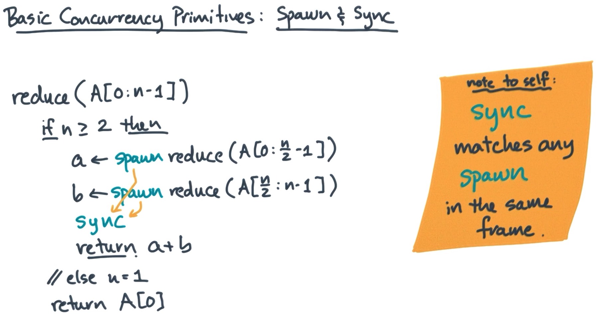
</center>

To denote such dependencies, the keyword $\rm{sync}$ is used accordingly, e.g.,:

$$
\boxed{
\begin{array}{l}
{{\rm{reduce}}\left( {A[0:n - 1]} \right)}\\
\ \ \ \ {{\rm{if\ }}n \ge 2{\rm{\ then}}}\\
\ \ \ \ \ \ \ \ {a \leftarrow {\rm{spawn\ reduce}}\left( {A\left[ {0:{n \over 2} - 1} \right]} \right)}\\
\ \ \ \ \ \ \ \ {b \leftarrow {\rm{spawn\ reduce}}\left( {A\left[ {{n \over 2}:n - 1} \right]} \right)}\\
\ \ \ \ \ \ \ \ {\rm{sync}}\\
\ \ \ \ \ \ \ \ {{\rm{return\ }}a + b}\\
\ \ \ \ {{\rm{//\ else\ }}n = 1}\\
\ \ \ \ {{\rm{return\ }}A[0]}
\end{array}
}
$$

This begs the question: To which upstream $\rm{spawn}$ does a given $\rm{sync}$ apply? For purposes of this course, a ***convention*** will be used whereby it will be generally ***assumed*** that a $\rm{sync}$ waits for ***any*** $\rm{spawn}$ that has occurred so far within the ***same*** stack frame.
  * ***N.B.*** The instructor's notes provide additional resources regarding call stacks and stack frames.

<center>
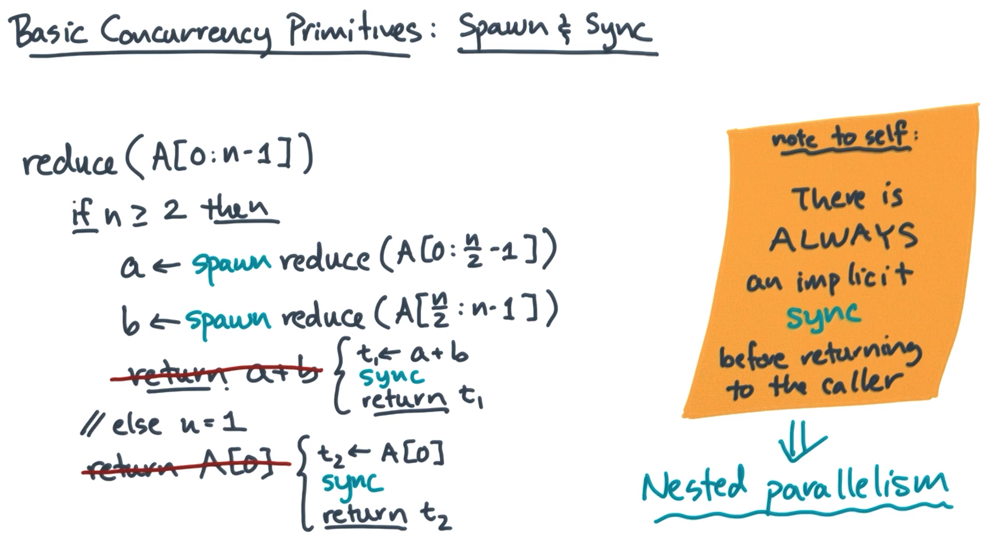
</center>

As a final note regarding $\rm{spawn}$ ans $\rm{sync}$ , suppose that the $\rm{sync}$ is omitted. In doing so, there will always be an implicit $\rm{sync}$ at the statement $\rm{return}$ immediately prior to returning to the caller. To see this explicitly, consider the corresponding transformation of $\rm{reduce}$ as in the figure shown above, with $\rm{return}$ statements replaced with corresponding $\rm{sync}$ equivalents.

Even with this transformation, the program is ***incorrect***. This is because the $\rm{sync}$ appears ***after*** the sum, whereas the two upstream $\rm{spawn}$ calls are only guaranteed to be completed ***at*** the $\rm{sync}$ (and therefore the values of $a$ and $b$ may still be invalid at the point of the sum).

Therefore, implicit $\rm{sync}$ operations in this manner will constrain the kinds of DAGs that this programming model can produce. The particular style of parallelism in such DAGs is sometimes called **nested parallelism**.
  * ***N.B.*** The term "nested parallelism" in this context will become more apparent once it is demonstrated how this pseudocode gives rise to a DAG.

### Executing the Parallel Algorithm on a Directed Acyclic Graph (DAG)

<center>
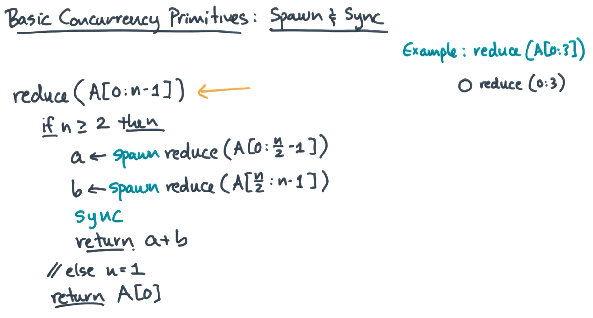
</center>

Returning to the correct version of the pseudocode (as in the figure shown above), consider a simulation of the algorithm in order to determine how the DAG unfolds. 

In particular, let execution commence with a $\rm{reduce}$ on an array of size $4$ (i.e., $\rm{reduce}(A[0:3])$ ). The first step is to ender the call to $\rm{reduce}$ , which creates the first unit of work within the DAG.

<center>
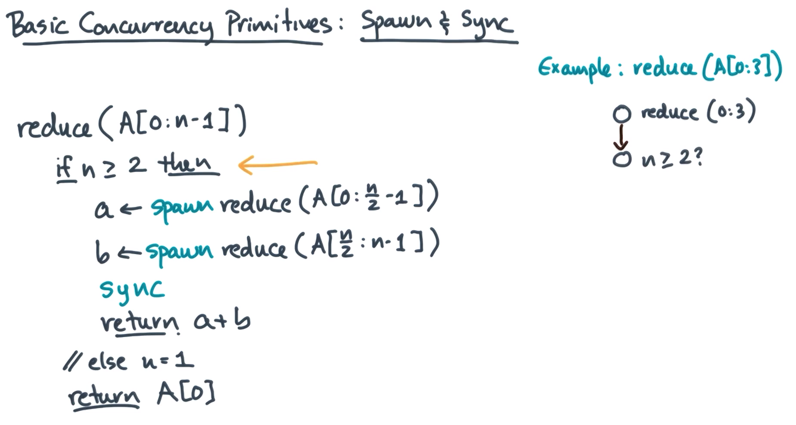
</center>

Next, there is the conditional test $n \ge 2$ (as in the figure shown above), which in turn (on successful pass of the test) results in encountering of the $\rm{spawn}$ .

<center>
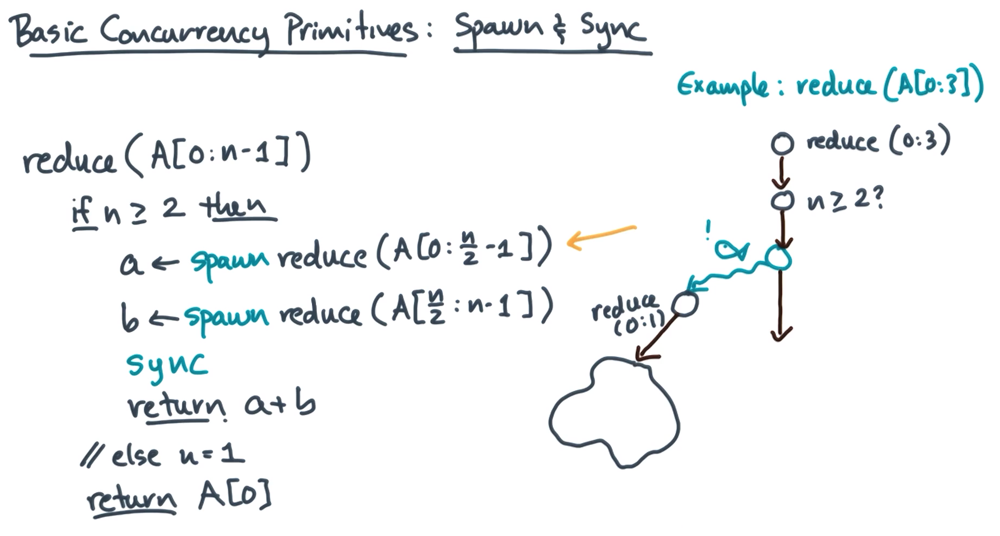
</center>

On encountering the $\rm{spawn}$ (as in the figure shown above), the the $\rm{spawn}$ creates a ***new branch*** in the DAG, since the $\rm{spawn}$ essentially signals tha there is a new independent unit of work that is ready to execute (i.e., $\rm{reduce}(A[0:1])$ ), thereby creating a corresponding new path in the DAG.

In the meantime, the current path proceeds as usual; therefore, the $\rm{spawn}$ creates two ***independent*** paths in this manner, with one carrying the new work and the other continuing execution immediately following the point of $\rm{spawn}$ .

While the main path proceeds as usual, the newly spawned path is a recursive call, thereby generating its own sub-graph (as in the figure shown above).

<center>
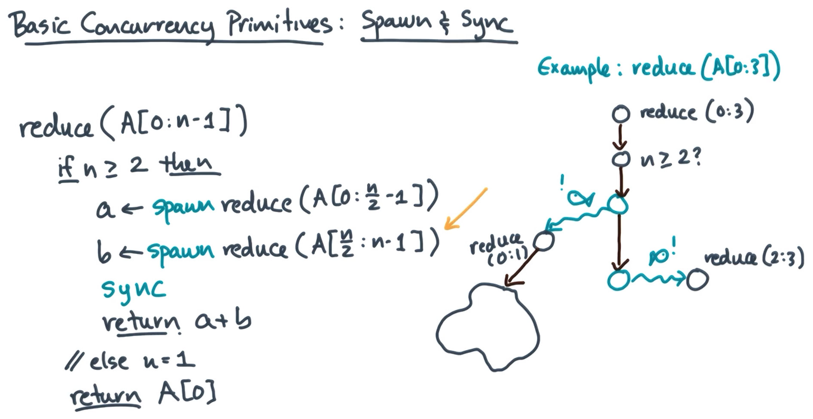
</center>

The main path subsequently encounters the other $\rm{spawn}$ (as in the figure shown above), resulting in another, separate branching as before.

<center>
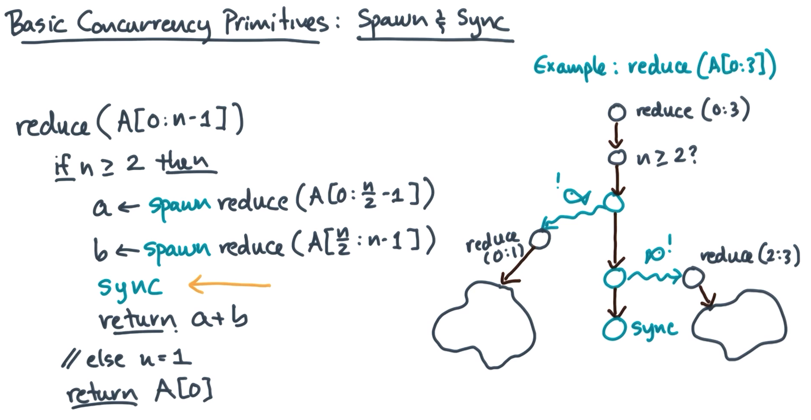
</center>

Next, the $\rm{sync}$ is reached (as in the figure shown above), which waits for the previous $\rm{spawn}$ operations to complete.

<center>
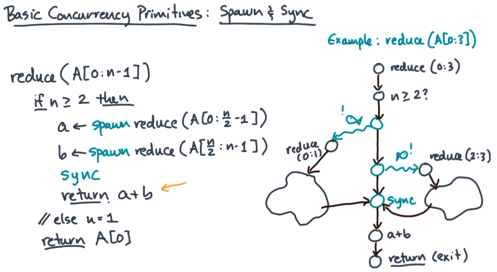
</center>

With respect to the DAG, this should create some dependence edges between the respective spawned branches' subgraphs and the point of $\rm{sync}$ (as in the figure shown above).

Lastly, control eventually goes to the statement $\rm{return}$ , which returns the resulting sum $a + b$ accordingly.

### Instructor's Notes

See [here](https://en.wikipedia.org/wiki/Call_stack) regarding call stacks.

## 17. A Subtle Point about Spawns Quiz and Answers

<center>
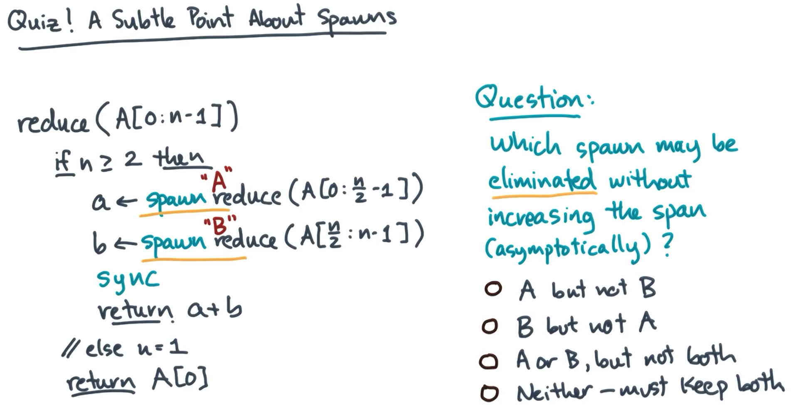
</center>

The example of a recursive reduction as examined previously (cf. Section 16) uses two $\rm{spawn}$ operations. However, are these ***both*** necessary in this specific example?

Posed another way: Which of these $\rm{spawn}$ operations may be eliminated without otherwise increasing the span (asymptotically)? (Select the correct option.)
  * $A$ but not $B$
  * $B$ but not $A$
  * $A$ or $B$ , but not both
  * Neither (must keep both)

### ***Answer and Explanation***:

<center>
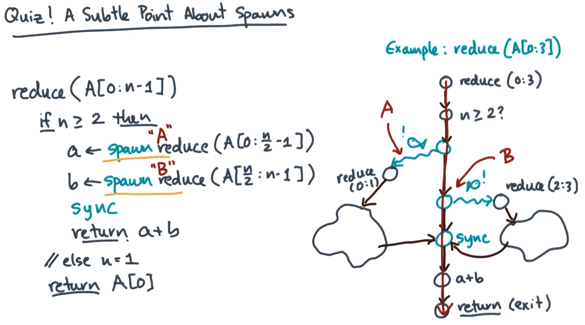
</center>

The $\rm{spawn}$ for $B$ *can* be eliminated, but *not* that for $A$ . This can be seen both intuitively, as well as more formally. This section will discuss the "intuitive" way, and the formal approach will be discussed subsequently in this lesson.

<center>
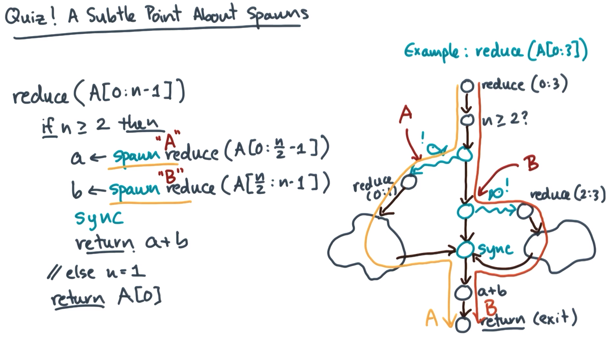
</center>

The intuitive argument is based on the depiction as in the figure shown above. Suppose that both "spawned" directed acyclic graphs (DAGs) for both $A$ and $B$ are kept. Observe that there are three possible paths, all of which are potential critical paths; therefore, it is necessary to understand how they grow.

The first path follows the "spine" of the DAG (as denoted by solid red arrow in the previous figure), comprised of a ***constant*** number of nodes along this path. This suggests that it is most likely ***not*** the critical path.

THe second path (denoted by $A$ and goldenrod curve in the figure shown above) follows the branch $A$ . This path interestingly goes through a sub-graph, which itself involves several recursive calls, thereby contributing to the growth in the length of the corresponding path.

The third path (denoted by $B$ and orange curve in the figure shown above) follows the branch $B$ . Similarly to the branch $A$ , the branch $B$ proceeds through a sub-graph.

Now, consider some hypothetical ***scenarios***.

<center>
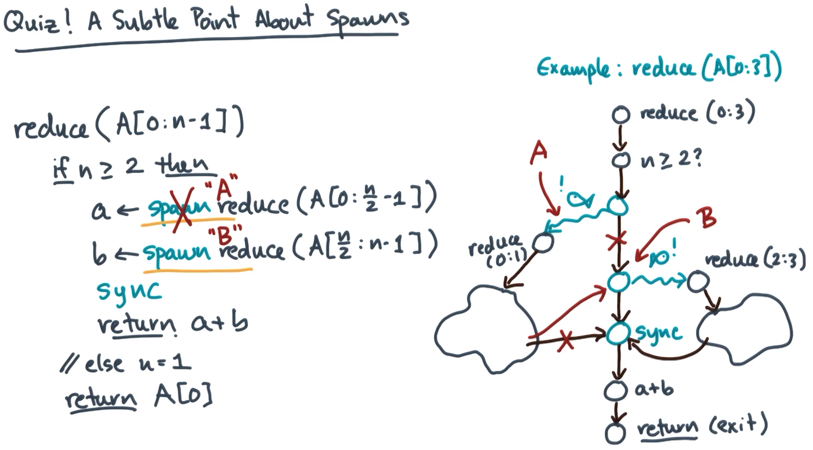
</center>

Suppose that the first $\rm{spawn}$ with respect to $A$ is eliminated. This results in a corresponding change in the structure of the DAG (as in the figure shown above), whereby the "spine" follows directly through the sub-graph of $A$ before returning back to the $\rm{spawn}$ point of $B$ .

<center>
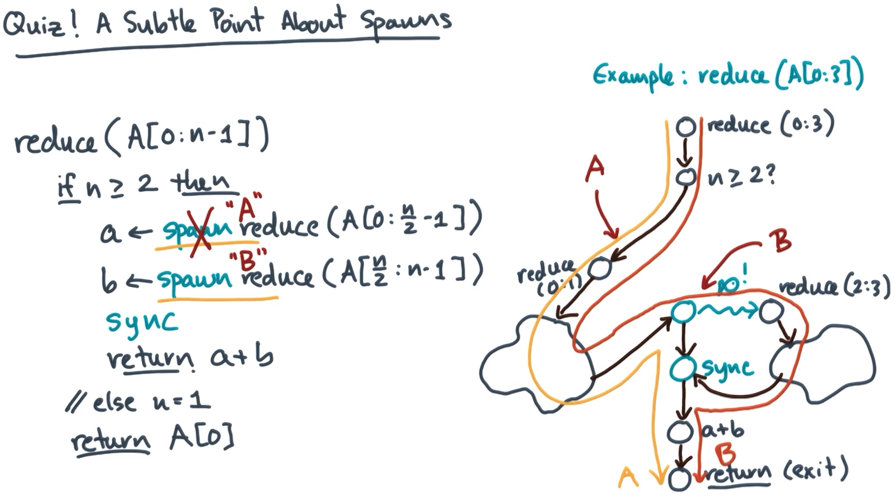
</center>

Consequently, this DAG now has two interesting paths (as in the figure shown above):
  * One (denoted by $A$ and goldenrod curve in the figure shown above) follows the $A$ statement
  * The other (denoted by $B$ and orange curve in the figure shown above) follows the $B$ statement

Observe that both paths overlap substantially, particularly including the sub-graph of $A$ . However, the $B$ path additionally continues through the sub-graph of $B$ . Additionally, note the following ***critical observation***:  The recursive calls in the sub-graph of $A$ occurs ***before*** that of $B$ , thereby implying that there is ***no*** concurrency among the two sub-graphs' respective executions. Therefore, this suggests that eliminating the first $\rm{spawn}$ (i.e., that associated with $A$ ) effectively eliminates the overall concurrency in the DAG at large.

<center>
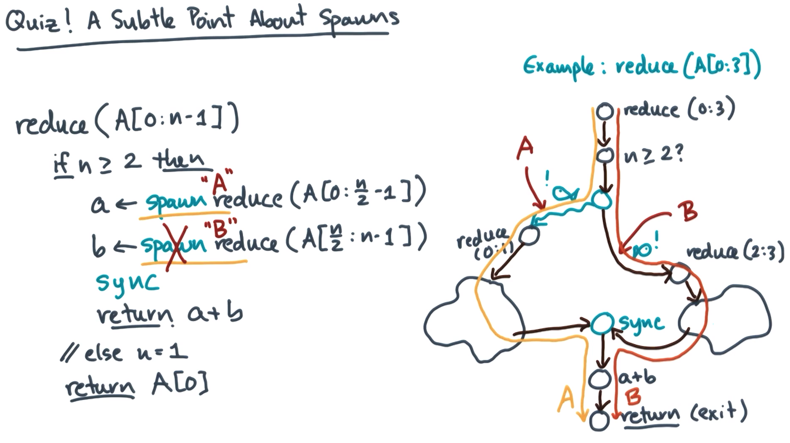
</center>

Now, Suppose that the second $\rm{spawn}$ with respect to $B$ is eliminated instead (as in the figure shown above). Per corresponding transformation of the DAG, observe that even with elimination of the second $\rm{spawn}$ (i.e., with respect to $B$ ), the two sub-graphs can still execute concurrently nevertheless (i.e., without otherwise materially impacting the span of the graph at large).

## 18. Basic Analysis of Work and Span

The $\rm{span-sync}$ framework allows to analyze the work and the span of algorithms in almost ***exactly*** the same way as is done for sequential algorithms. This section will demonstrate this premise by example.

### Sequential Algorithm Analysis

<center>
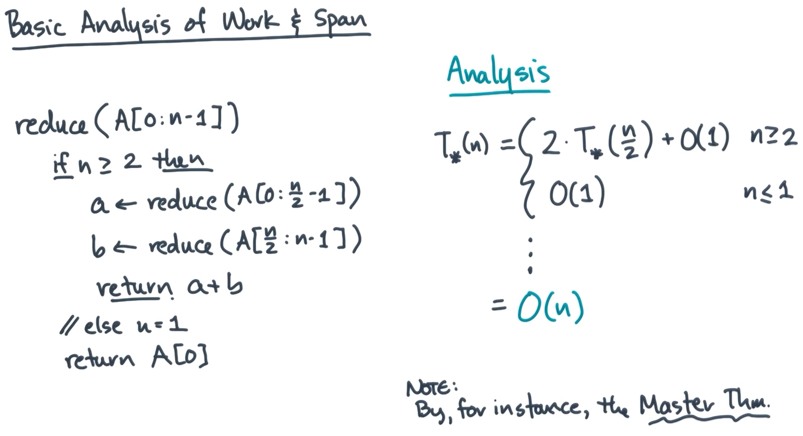
</center>

Recall (cf. Section 16) the pseudocode for performing a sequential reduction using divide and conquer, as follows:

$$
\boxed{
\begin{array}{l}
{{\rm{reduce}}\left( {A[0:n - 1]} \right)}\\
\ \ \ \ {{\rm{if\ }}n \ge 2{\rm{\ then}}}\\
\ \ \ \ \ \ \ \ {a \leftarrow {\rm{reduce}}\left( {A\left[ {0:{n \over 2} - 1} \right]} \right)}\\
\ \ \ \ \ \ \ \ {b \leftarrow {\rm{reduce}}\left( {A\left[ {{n \over 2}:n - 1} \right]} \right)}\\
\ \ \ \ \ \ \ \ {{\rm{return\ }}a + b}\\
\ \ \ \ {{\rm{//\ else\ }}n = 1}\\
\ \ \ \ {{\rm{return\ }}A[0]}
\end{array}
}
$$

To analyze this algorithm, begin with a recurrence relation, and then solve the relation, i.e.,:

$$
T_* (n) = 
\begin{cases} 
  {2 \cdot {T_* }({n \over 2}) + O(1)} & n \ge 2 \\
  {O(1)} & n \le 1 \\
\end{cases}
$$

The recurrence (case $n \ge 2$ ) corresponds to the two recursive calls to $\rm{reduce}$ , i.e., two sub-problems, each having half of the original problem size $n$ .

Solving this recurrence (e.g., via the Master Theorem) yields the following:

$$
T_* (n) = O(n)
$$

### Parallel Algorithm Analysis


Recall (cf. Sections 16 and 17) the pseudocode for performing a parallel reduction using divide and conquer, as follows:

$$
\boxed{
\begin{array}{l}
{{\rm{reduce}}\left( {A[0:n - 1]} \right)}\\
\ \ \ \ {{\rm{if\ }}n \ge 2{\rm{\ then}}}\\
\ \ \ \ \ \ \ \ {a \leftarrow {\rm{spawn\ reduce}}\left( {A\left[ {0:{n \over 2} - 1} \right]} \right)}\\
\ \ \ \ \ \ \ \ {b \leftarrow {\rm{reduce}}\left( {A\left[ {{n \over 2}:n - 1} \right]} \right)}\\
\ \ \ \ \ \ \ \ {\rm{sync}}\\
\ \ \ \ \ \ \ \ {{\rm{return\ }}a + b}\\
\ \ \ \ {{\rm{//\ else\ }}n = 1}\\
\ \ \ \ {{\rm{return\ }}A[0]}
\end{array}
}
$$

<center>
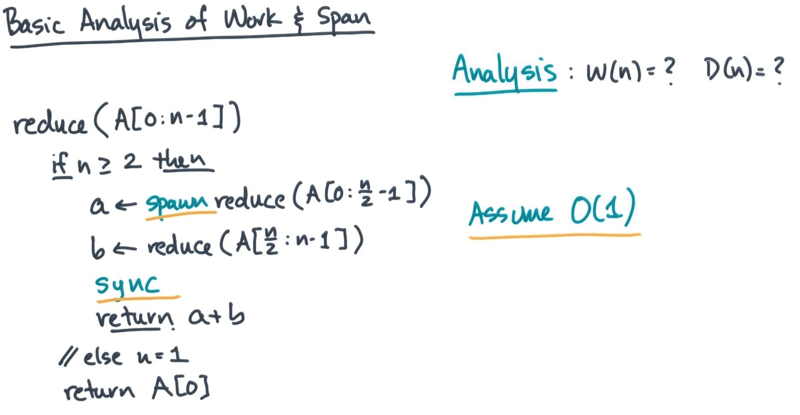
</center>

To analyze the work $W(n)$ and span $D(n)$ , ***assume*** that each $\rm{spawn}$ and $\rm{sync}$ is a constant-time operation (as it turns out, in practice, this is not a bad/invalid assumption).

<center>
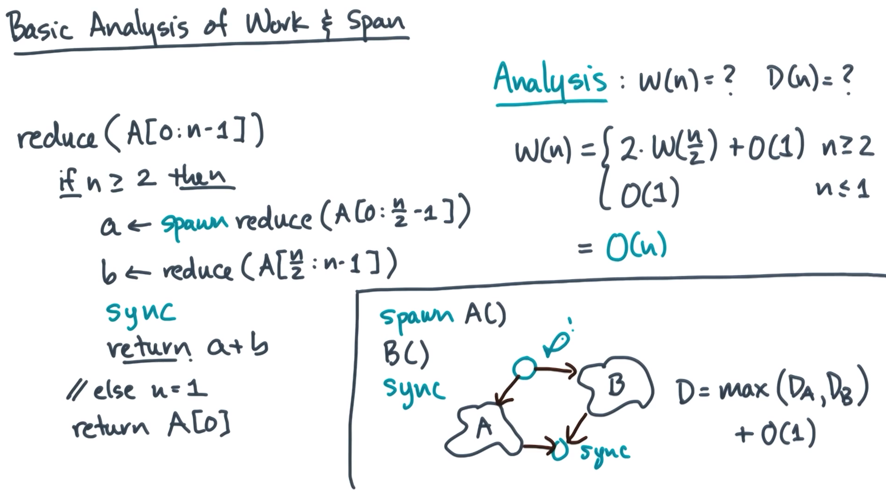
</center>

With this assumption, analysis of the work $W(n)$ proceeds as follows (i.e., otherwise ignoring $\rm{spawn}$ and $\rm{sync}$ for purposes of the resulting recurrence relation):

$$
W(n) = 
\begin{cases} 
  {2 \cdot W({n \over 2}) + O(1)} & n \ge 2 \\
  {O(1)} & n \le 1 \\
\end{cases}
$$

And therefore:

$$
W(n) = O(n)
$$

As this demonstrates, the corresponding parallel-algorithm analysis is no more complicated than the analogous sequential-algorithm analysis.

Furthermore, with respect to span $D(n)$ , this can be derived slightly differently. Consider a simpler example, as follows:

$$
\boxed{
\begin{array}{l}
{{\rm{spawn\ }}A()}\\
{B()}\\
{{\rm{sync}}}
\end{array}
}
$$

Recall (cf. Section 17) that the operation $\rm{spawn}$ creates a branch and a directed acyclic graph (DAG) which yields two, distinct paths (as in the figure shown above); the critical path is the longer of these two paths. Therefore, if the length of the respective paths through branches $A$ and $B$ were known, then the span $D(n)$ would simply be the longer of these two.

Correspondingly, mathematically, the span $D$ in this instance is therefore defined as:

$$
D = \max(D_A, D_B) + O(1)
$$

<center>
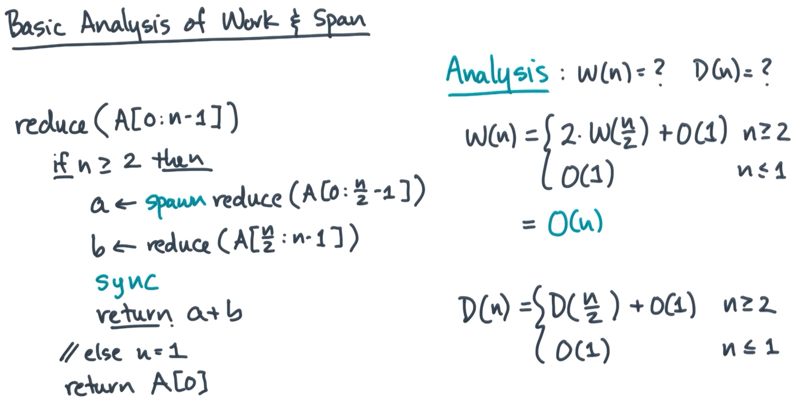
</center>

Furthermore, in this divide-and-conquer reduction, the span only depends on the problem size $n$ , with the recursive calls solving sub-problems of approximately equal size (i.e., $n \over 2$ ). Therefore, the corresponding recurrence relation is as follows:

$$
D(n) = 
\begin{cases} 
  {D({n \over 2}) + O(1)} & n \ge 2 \\
  {O(1)} & n \le 1 \\
\end{cases}
$$

***N.B.*** The solution of this recurrence relation is the topic of the next section.

### Instructor's Notes

See [here](https://en.wikipedia.org/wiki/Master_theorem) regarding the Master Theorem.

## 19. Solve a Recurrence Quiz and Answers

<center>
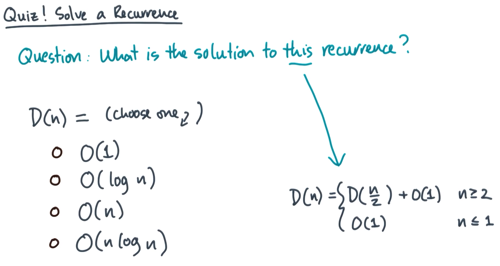
</center>

$$
D(n) = 
\begin{cases} 
  {D({n \over 2}) + O(1)} & n \ge 2 \\
  {O(1)} & n \le 1 \\
\end{cases}
$$

What is the solution to the recurrence relation shown above (cf. Section 18)? (Select the correct choice.)
  * $D(n) = O(1)$
  * $D(n) = O(\log n)$
  * $D(n) = O(n)$
  * $D(n) = O(n \log n)$

### ***Answer and Explanation:***

<center>
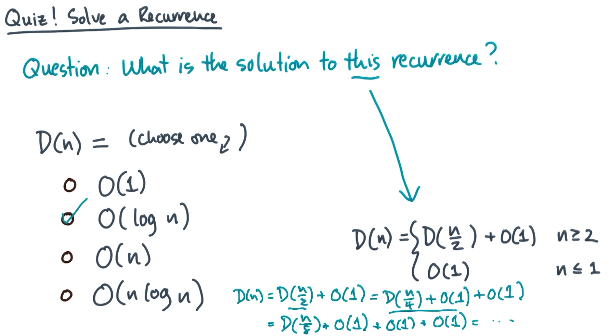
</center>

The solution to the recurrence relation is as follows:

$$
O(\log n)
$$

To arrive at this solution, either use the Master Theorem, or deduce this "by inspection" via examination of a few terms, i.e.,:

$$
D(n) = D\left( {{n \over 2}} \right) + O(1) = D\left( {{n \over 4}} \right) + O(1) + O(1) = D\left( {{n \over 8}} \right) + O(1) + O(1) + O(1) =  \cdots
$$

## 20. Desiderata for Work and Span

Before proceeding, consider briefly the **goals** of parallel algorithm design with respect to work and span.

<center>
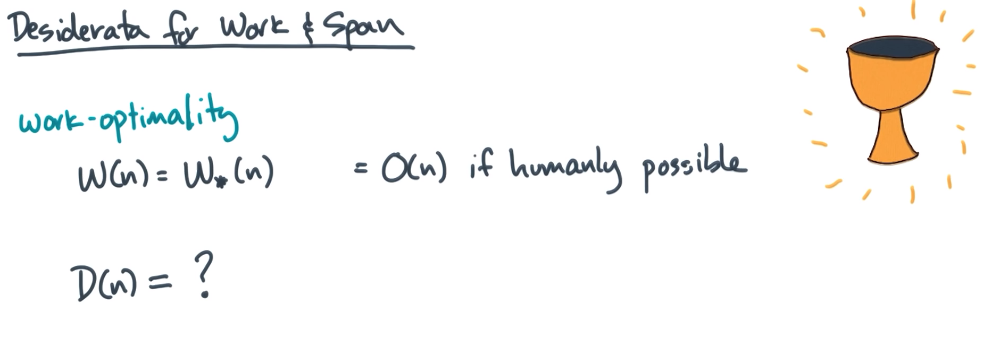
</center>

One goal of parallel algorithm design is to achieve a degree of ***work*** that matches the best sequential algorithm, i.e.,:

$$
W(n) = W_* (n)
$$

This goal is tantamount to achieving **work-optimality**.

Recalling from sequential algorithm analysis (i.e., in previous coursework, or equivalent), generally a "well performing" sequential algorithm is one which exhibits asymptotic linear time (i.e., $O(n)$ ), or perhaps even better.
  * ***N.B.*** It is not always possible to achieve this, however, it is generally performant if achieved.

Similarly, with respect to parallel algorithms, for work to be deemed "optimal," it should similarly exhibit $O(n)$ (or better) performance.

<center>
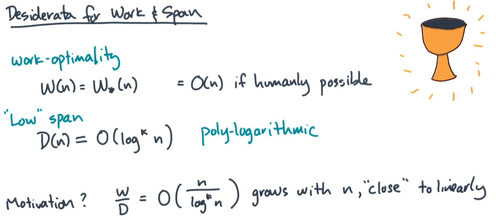
</center>

With respect to ***span***, another goal of parallel algorithm design is to achieve at least poly-logarithmic span, i.e.,:

$$
D(n) = O(\log^k n)
$$

***N.B.*** Per this notation, $\log^k n = (\log n)^k$ .

In this context, "poly-logarithmic" is synonymous with demonstrating a "low span."

Why is logarithmic growth noteworthy in this context? Since $\log^n n$ grows asymptotically much more slowly than $n$ , and since $O(n)$ is considered optimal with respect to work, then accordingly poly-logarithmic span ensures that the ***average available parallelism*** grows with $n$ , i.e.,:

$$
{W \over D} = {O \left( {n \over {\log^k n}} \right)}
$$

***N.B.*** Ultimately, discernment is necessary to determine whether a given parallel algorithm exhibits "acceptable" work and span characteristics. Nevertheless, these guidelines are provided here as a point of reference for this purpose.

## 21. Concurrency Primitive: Parallel-for (" $\rm{par-for}$ ")

<center>
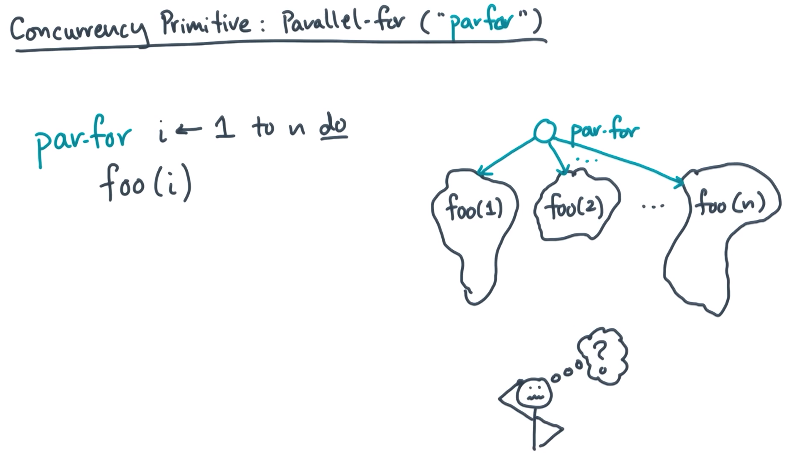
</center>

Another useful concurrency primitive is a **parallel for** loop, or $\rm{par-for}$ , e.g.,:

$$
\boxed{
\begin{array}{l}
{{\rm{par-for\ }}i \leftarrow 1{\rm{\ to\ }}n{\rm{\ do}}}\\
\ \ \ \ {{\rm{foo}}(i)}
\end{array}
}
$$

***N.B.*** Certain academic literature pertaining to parallel algorithms uses $\rm{for-any}$ , $\rm{for-all}$ , and similar to equivalently denote this construct.

A $\rm{par-for}$ specifies that all iterations are ***independent*** of one another, and therefore the iterations can be executed in any order accordingly

In the context of a directed acyclic graph (DAG), a $\rm{par-for}$ construct creates $n$ independent sub-paths (as in the figure shown above), which is equivalent to executing $n$ independent $\rm{spawn}$ sub-graphs simultaneously (provided this is possible/permissible, as will be discussed subsequently in this lesson).

<center>
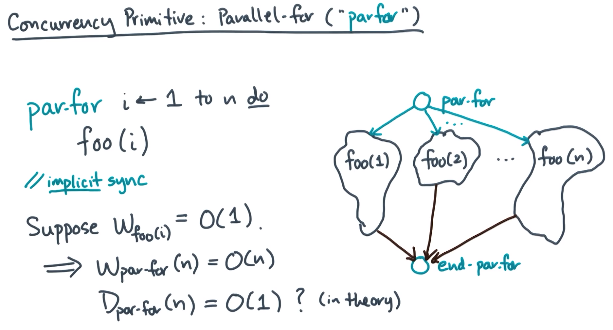
</center>

By convention, the end of a $\rm{par-for}$ loop construct includes an ***implicit*** $\rm{sync}$ point, i.e.,:

$$
\boxed{
\begin{array}{l}
{{\rm{par-for\ }}i \leftarrow 1{\rm{\ to\ }}n{\rm{\ do}}}\\
\ \ \ \ {{\rm{foo}}(i)}\\
\ \ \ \ {\rm{//\ implicit\ sync}}
\end{array}
}
$$

This implicit $\rm{sync}$ point forces all of the independent paths to ***join*** (as in the figure shown above).

Now, suppose that every ieration has a ***constant*** cost, i.e.,:

$$
W_{\rm{foo}(i)}(n) = O(1)
$$

If there are $n$ iterations, then the ***work*** of a $\rm{par-for}$ construct is consequently $O(n)$ , i.e.,:

$$
W_{\rm{par-for}}(n) = O(n)
$$

Furthermore, with respect to the ***span*** of the $\rm{par-for}$ construct, while in theory it should be constant given constant-cost work per iteration, in practice, the span actually grows with $n$ , especially when $n$ is really large.
  * ***N.B.*** In analogous terms with respect to electrical engineering, this is similar to a circuit having many (e.g., $10^{11}$ ) paths emitting from a gate.

To further understand the span of the $\rm{par-for}$ construct, consider two different implementations of this construct, using only $\rm{spawn}$ and $\rm{sync}$ (as discussed in the subsequent sections).

## 22. Implementing $\rm{par-for}$ (Part 1) Quiz and Answers

<center>
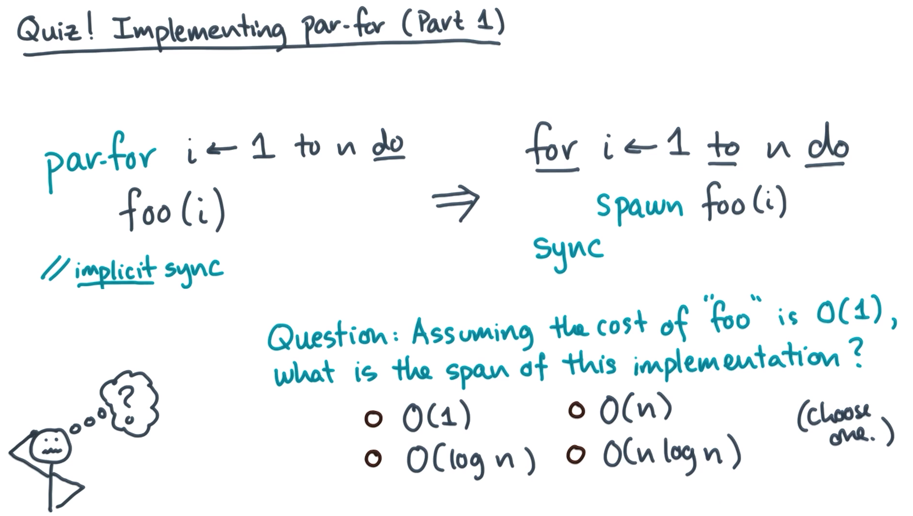
</center>

One way to implement $\rm{par-for}$ using only one $\rm{spawn}$ and one $\rm{sync}$ is as follows:

$$
\boxed{
\begin{array}{l}
{{\rm{for\ }}i \leftarrow 1{\rm{\ to\ }}n{\rm{\ do}}}\\
\ \ \ \ {{\rm{spawn\ foo}}(i)}\\
\ \ \ \ {\rm{sync}}
\end{array}
}
$$

Here, each iteration of the $\rm{for}$ loop results in a $\rm{spawn}$ , all of which are coordinated by the subsequent $\rm{sync}$ accordingly.

Assuming the cost of $\rm{foo}$ is $O(1)$ (i.e., constant), what is the span of this implementation? (Select the correct choice.)
  * $O(1)$
  * $O(n)$
  * $O(\log n)$
  * $O(n \log n)$

### ***Answer and Explanation***:

<center>
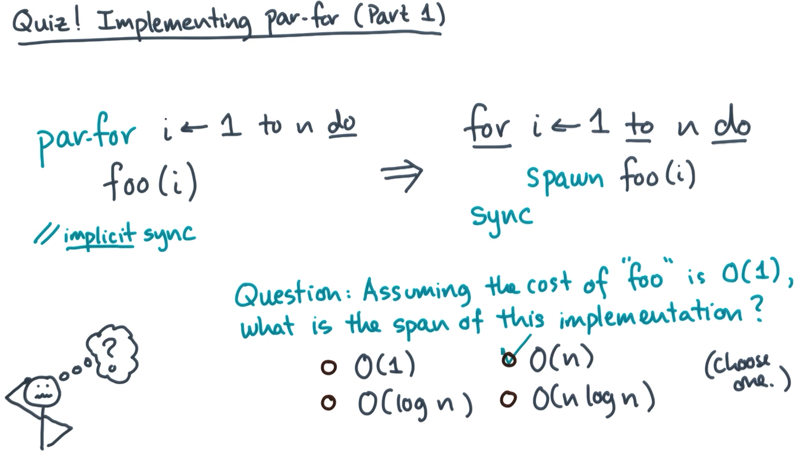
</center>

In this configuration, the span is $O(n)$ (i.e., linear).
  * ***N.B.*** This is relatively "bad" performance (i.e., worse than the "ideal" poly-logarithmic span, cf. Section 20).

<center>
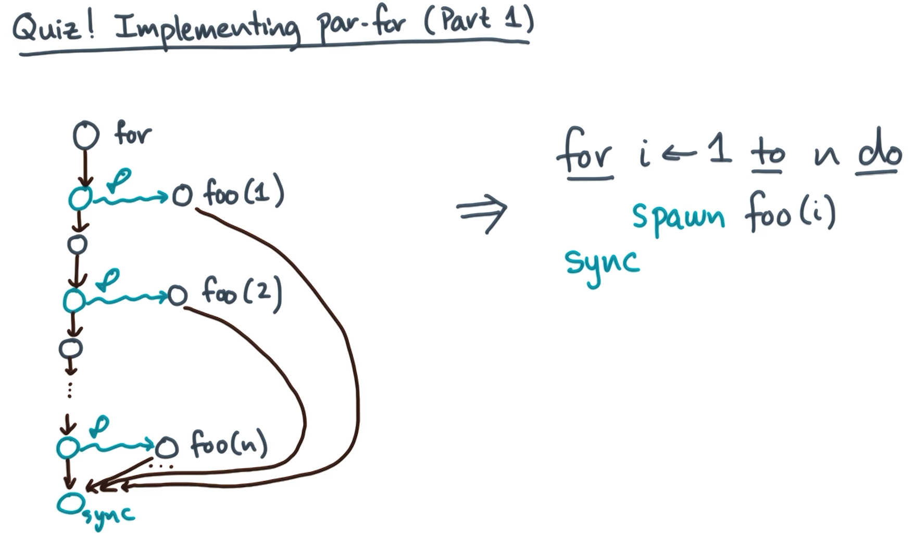
</center>

To understand the $O(n)$ span, consider how the directed acyclic graph (DAG) unfolds (as in the figure shown above).

Although a new path is created for each iteration, the corresponding $\rm{spawn}$ operations are nevertheless executed ***sequentially***. Consequently, this effectively forms a "sequential bottleneck" in the DAG itself (i.e., along the "main spine," denoted by vertically aligned downward brown arrows in the figure shown above).

***N.B.*** If it were the case that calling $\rm{foo}(i)$ is very expensive, then this "sequential bottleneck" may not be as directly perceptible. However, in the case of $O(1)$ with respect to $\rm{foo}(i)$ , this bottleneck *would* indeed be "perceptible."

## 23. Implementing $\rm{par-for}$ (Part 2)

<center>
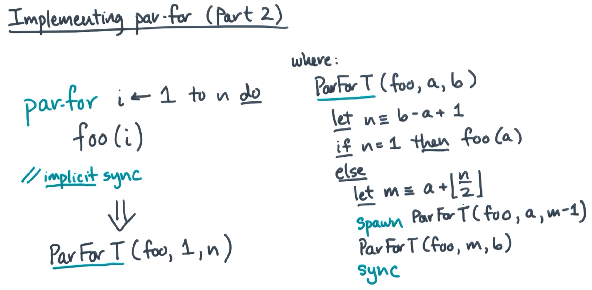
</center>

Now, suppose that $\rm{par-for}$ is implemented as procedure call ${\rm{ParForT}}({\rm{foo}},1,n)$ , where $\rm{ParForT}$ is defined as follows:

$$
\boxed{
\begin{array}{l}
{{\rm{ParForT}}({\rm{foo}},a,b)}\\
\ \ \ \ {{\rm{let }}n \equiv b - a + 1}\\
\ \ \ \ {{\rm{if\ }}n = 1{\rm{\ then\ foo}}(a)}\\
\ \ \ \ {{\rm{else}}}\\
\ \ \ \ \ \ \ \ {{\rm{let\ }}m \equiv a + \left\lfloor {{n \over 2}} \right\rfloor }\\
\ \ \ \ \ \ \ \ {{\rm{spawn\ ParForT}}({\rm{foo}},a,m - 1)}\\
\ \ \ \ \ \ \ \ {{\rm{ParForT}}({\rm{foo}},m,b)}\\
\ \ \ \ \ \ \ \ {{\rm{sync}}}
\end{array}
}
$$

where $n$ represents the number of iterations. In the trivial case of $n = 1$ this simply yields a call to $\rm{foo}(a)$ , otherwise a divide-and-conquer approach is followed, successively splitting iterations approximately in half via midpoint $m$ .

<center>
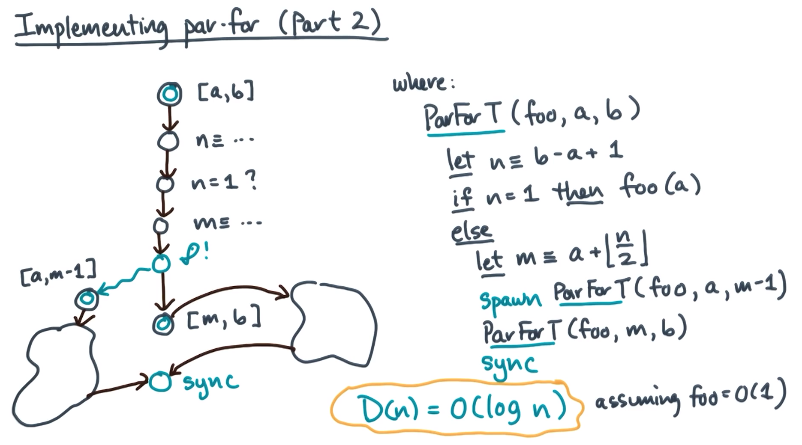
</center>

This scheme results in the "typical" binary-tree-like recursion (as in the figure shown above). Correspondingly, assuming $\rm{foo}(i) = O(1)$ , then the span for this directed acyclic graph (DAG) is logarithmic, i.e.,:

$$
D(n) = O(\log n)
$$

Note that this is a much more realistic way to implement a parallel for loop. Accordingly, it shall henceforth be ***assumed*** that this implementation is used accordingly.

## 24. Matrix-Vector Multiply Quiz and Answers

<center>
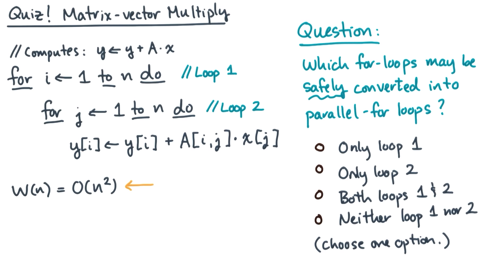
</center>

Consider a nested-loop implementation of a matrix-by-matrix multiplication as follows:

$$
\boxed{
\begin{array}{l}
{{\rm{//\ computes:\ }}y \leftarrow y + {\rm{A}} \cdot x}\\
{{\rm{for\ }}i \leftarrow 1{\rm{\ to\ }}n{\rm{\ do\ \ \ \ \ \ //\ Loop\ 1}}}\\
\ \ \ \ {{\rm{for\ }}j \leftarrow 1{\rm{\ to\ }}n{\rm{\ do\ //\ Loop\ 2}}}\\
\ \ \ \ \ \ \ \ {y[i] \leftarrow y[i] + A[i,j] \cdot x[j]}
\end{array}
}
$$

Given a square matrix $\rm{A}$ of size $n \times n$ and vectors $x$ and $y$ (each of length $n$ ), then this construct correspondingly computes $y \leftarrow y + {\rm{A}} \cdot x$ .

Given $n \times n$ nested loops, the complexity of this construct is as follows:

$$
W(n) = O(n^{2})
$$

Given these two $\rm{for}$ loops, which can be converted into a $\rm{par-for}$ ? (Select the correct choice.)
  * Only $\rm{Loop\ 1}$
  * Only $\rm{Loop\ 2}$
  * Both $\rm{Loop\ 1}$ and $\rm{Loop\ 2}$
  * Neither $\rm{Loop\ 1}$ nor $\rm{Loop\ 2}$

### ***Answer and Explanation***:

<center>
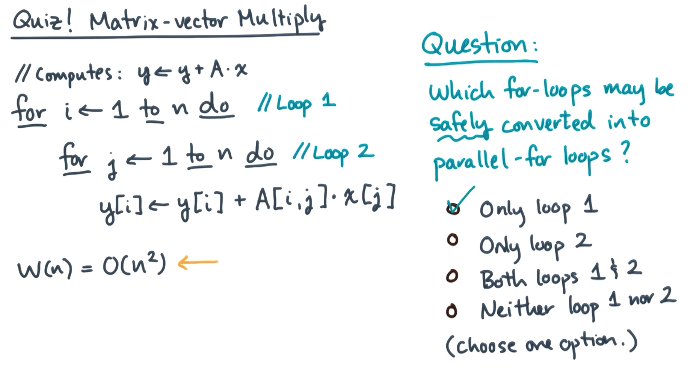
</center>

Only $\rm{Loop\ 1}$ can be safely converted to a $\rm{par-for}$ . The iterations of the $i$ loop are completed independently of one another, correspondingly updating separate/distinct values $y[i]$ .

Conversely, the iterations of the $j$ loop are different in this regard, because during each iteration of this inner look, subsequent iterations of $j$ may still be updating the ***same*** location $i$ (i.e., correspondingly, different $j$ iterations are ***not*** necessarily independent of one another).
  * ***N.B.*** As is discussed in a compilers course (or equivalent), in this context, the $j$ iterations ***carry a dependence***. The resulting problem created if attempting to parallelize the $j$ loop is a potential **race condition**.

## 25. Data Races and Race Conditions

<center>
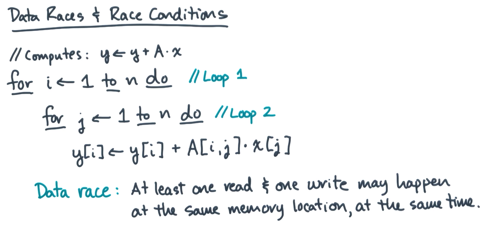
</center>

Consider again (cf. Section 24) the nested-loop implementation of a matrix-by-matrix multiplication as follows:

$$
\boxed{
\begin{array}{l}
{{\rm{//\ computes:\ }}y \leftarrow y + {\rm{A}} \cdot x}\\
{{\rm{for\ }}i \leftarrow 1{\rm{\ to\ }}n{\rm{\ do\ \ \ \ \ \ //\ Loop\ 1}}}\\
\ \ \ \ {{\rm{for\ }}j \leftarrow 1{\rm{\ to\ }}n{\rm{\ do\ //\ Loop\ 2}}}\\
\ \ \ \ \ \ \ \ {y[i] \leftarrow y[i] + A[i,j] \cdot x[j]}
\end{array}
}
$$

Let us further consider why it is ***not*** safe to make the innermost loop a $\rm{par-for}$ loop.

Firstly, observe that all iterations $j$ write to the ***same*** location $y[i]$ ; this situation is called a **data race**. More precisely, a data race is defined as occurring when at least one read and at least one write may occur at the ***same*** memory location ***simultaneously***.

As an example, consider two successive $j$ iterations (as discussed in the subsequent figures).

<center>
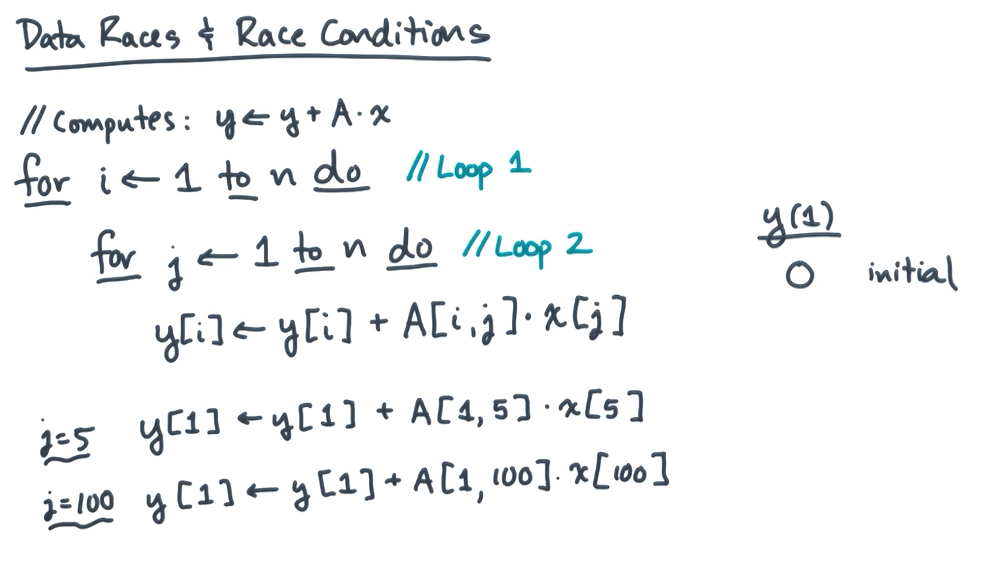
</center>

In the first two $j$ iterations, let the following values hold (with initial value given as $y[1] = 0$ ):

| Iteration | $i$ | $j$ | $y[i]$ |
|:--:|:--:|:--:|:--:|
| $0$ | $1$ | $1$ | $0$ |
| $1$ | $1$ | $5$ | $y[1] + {\rm{A}}[1,5] \cdot x[5]$ |
| $2$ | $1$ | $100$ | $y[1] + {\rm{A}}[1,100] \cdot x[100]$ |

<center>
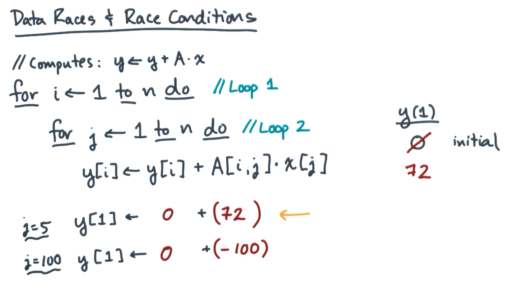
</center>

Suppose that iterations $1$ and $2$ execute simultaneously. Consequently, the expressions evaluate as follows:

| Iteration | $i$ | $j$ | $y[i]$ |
|:--:|:--:|:--:|:--:|
| $0$ | $1$ | $1$ | $0$ |
| $1$ | $1$ | $5$ | $y[1] + (72)$ |
| $2$ | $1$ | $100$ | $y[1] + (-100)$ |

Furthermore, suppose that $y[1]$ is read ***simultaneously*** in ***both*** iterations, yielding value $0$, i.e.,:

| Iteration | $i$ | $j$ | $y[i]$ |
|:--:|:--:|:--:|:--:|
| $0$ | $1$ | $1$ | $0$ |
| $1$ | $1$ | $5$ | $0 + (72)$ |
| $2$ | $1$ | $100$ | $0 + (-100)$ |

<center>
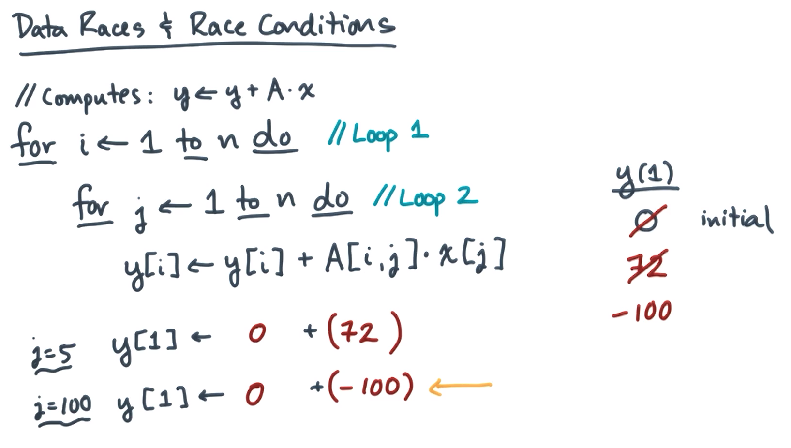
</center>

Now, suppose that iteration $1$ executes its write to $y[1]$ *first*, thereby updating corresponding value to $72$ . At this point, iteration $2$ is operating with a ***stale*** value of $y[1]$ (i.e., $-100$ ), resulting in an overwrite of the existing value (erroneous), rather than an accumulation (as intended).

<center>
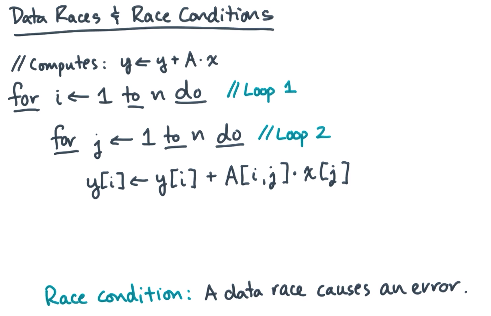
</center>

A data race which yields an error in this manner is called a **race condition**. Correspondingly, when designing parallel algorithms, one must be cautious to ***avoid*** such race conditions.
  * ***N.B.*** As a general ***heuristic***, it is often helpful to avoid data races regardless (i.e., for semantic correctness). However, it is important to note that a data race does ***not*** necessarily always yield a race condition (examples of this will be demonstrated subsequently in this course).

## 26Q. Putting It All Together, Part 1 Quiz and Answers
