# Comparison-Based Sorting

## 1. Introduction

This lesson is about parallel algorithms for ***sorting*** in the dynamic multi-threading model, and is comprised of two parts.

The first part of this lesson consists of videos, which cover the idea of a **sorting network**.

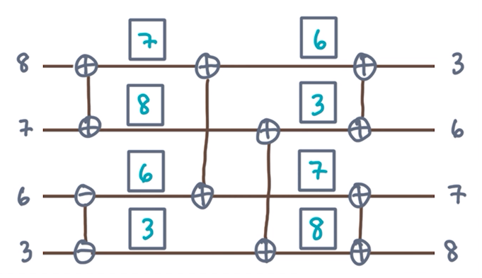

A sorting network is a special kind of circuit which performs sorting (as in the figure shown above).
  * ***N.B.*** This topic is not typically covered in a standard undergraduate algorithms course. It is therefore introduced here both for the edification and enjoyment of students in this course.

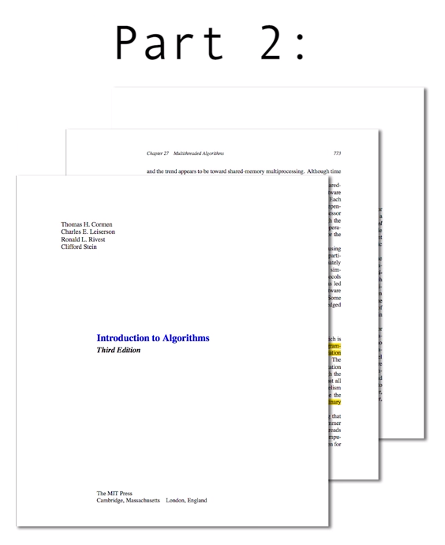

Separately from the videos component, this lesson also entails a short chapter on **parallel merge sort** from algorithm textbook CLRS (as in the figure shown above), intended to reinforce the main ideas behind the dynamic multi-threading model.

This lesson will also introduce some additional techniques to analyze algorithms in this model more formally.

## 2. Comparator Networks

Initially, parallel algorithms research centered around the idea of **sorting networks**.

### Comparators

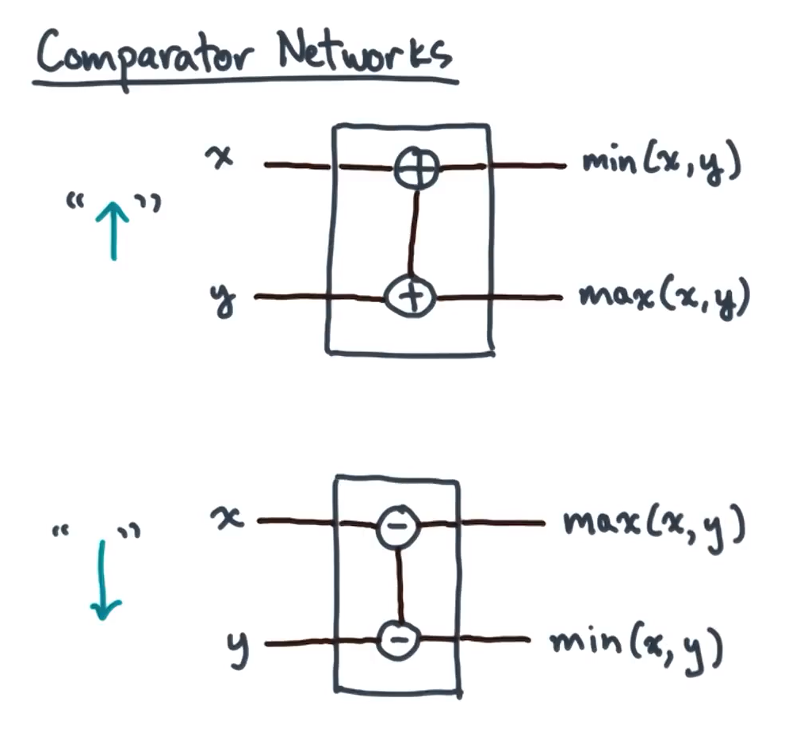

A **sorting network** is a fixed circuit which sorts its inputs (as in the figure shown above), using a special type of circuit element/gate called a **comparator**.

In a **comparator**, there are two inputs ($x$ and $y$ ) and two outputs.
  * The "↑" (increasing) or "+" comparator places the smaller of its two inputs on the top output wire (i.e., $\min(x,y)$ ) and the larger of its two inputs on te bottom output wire (i.e., $\max(x,y)$ )
  * Conversely, the "↓" (decreasing) or "-" comparator places the larger of its two inputs on the top wire (i.e., $\max(x,y)$ ) and the smaller of its two inputs on the top output wire (i.e., $\min(x,y)$ )

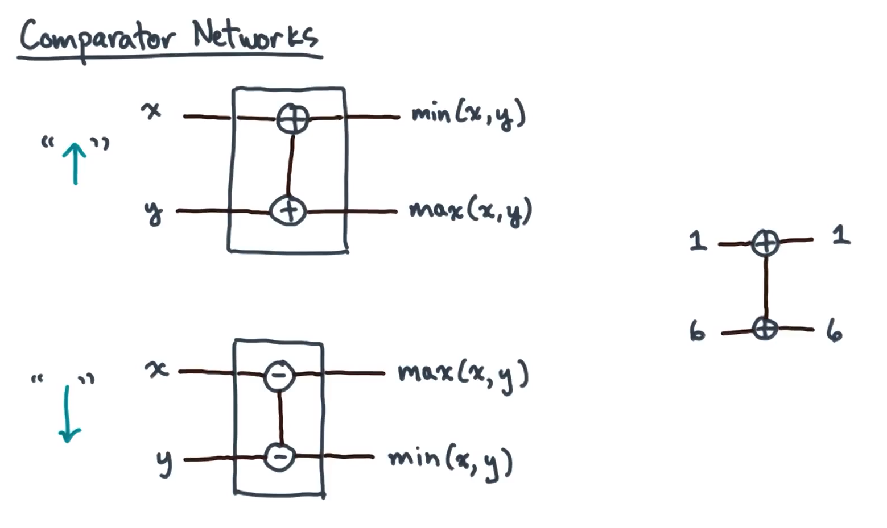

For example, consider the following examples (as in the figures shown above):

| Comparator type | $x$ | $y$ | Top output | Bottom output |
|:--:|:--:|:--:|:--:|:--:|
| + | 1 | 6 | $\min(x,y) = 1$ | $\max(x,y) = 6$ |
| - | 1 | 6 | $\min(x,y) = 6$ | $\max(x,y) = 1$ |

### Example: Sorting with Comparators

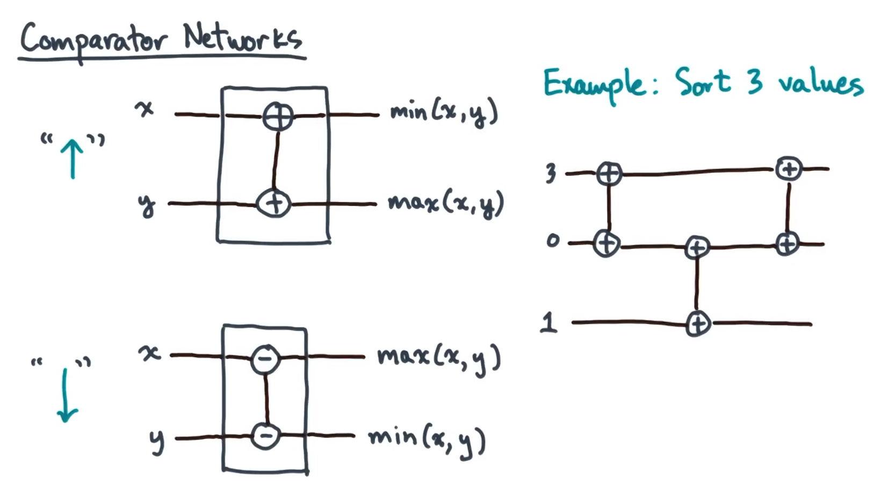

Similarly to an electrical circuit, comparators can be ***composed*** by connecting wires. For example, suppose that the values $3$ , $0$ , and $1$ are given (as in the figure shown above), with the intention of ***sorting*** them.

This can be accomplished using the circuit as in the figure shown above, which takes these three values as inputs, producing three correspondingly sorted outputs.

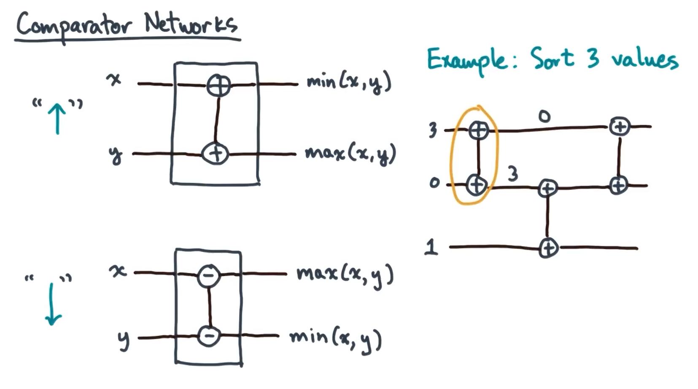

The first comparison produces the intermediate result as in the figure shown above.

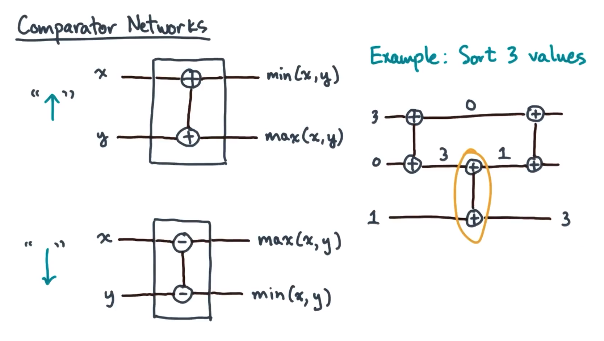

The next comparison produces the intermediate result as in the figure shown above.

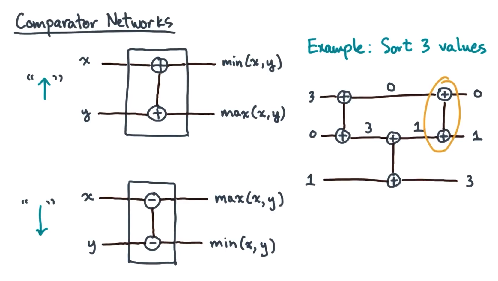

The final comparison produces the correspondingly sorted result as in the figure shown above.

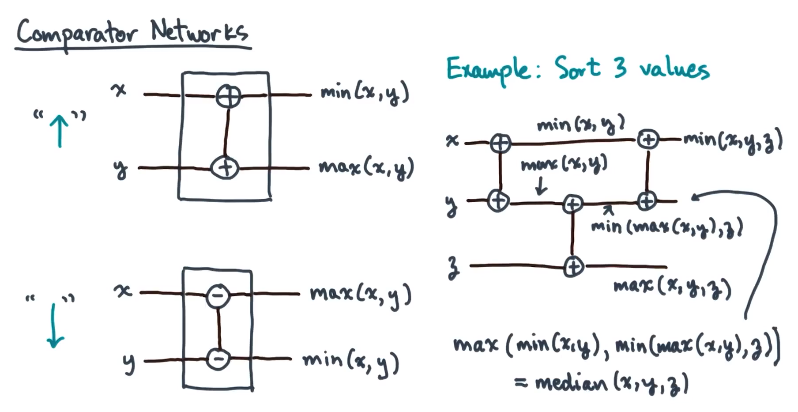

Symbolically, the intermediate sorting operations are represented as in the figure shown above, which represents the following overall operation (given inputs $x$ , $y$ and $z$ ):

$$
\max(\min(x,y), \min(\max(x,y), z)) = \rm{median}(x,y,z)
$$

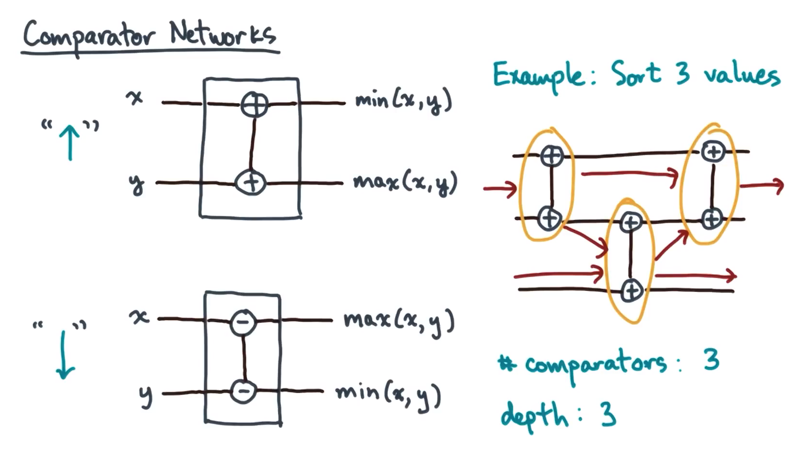

Furthermore, observe that this circuit is comprised of three comparators (as in the figure shown above), with a corresponding depth (or critical-path length) of $3$ (cf. Lesson 5), with dependencies among the comparators denoted by solid red lines in the figure shown above.
  * ***N.B.*** This analysis is reminiscent of work and span (cf. Lesson 5).

Therefore, by encoding an algorithm in a comparators-based circuit in this manner, the resulting circuit can be correspondingly analyzed with respect to how many operations it performs, as well as its critical-path length.

As a follow-up question: Suppose that you are only allowed to use these two types of comparators, then compared to this example circuit, is there a way to sort three elements either by using fewer comparators and/or by reducing the critical-path length?
  * ***N.B.*** This question is left as an exercise for the reader.

## 3. Sort Four Values Quiz and Answers

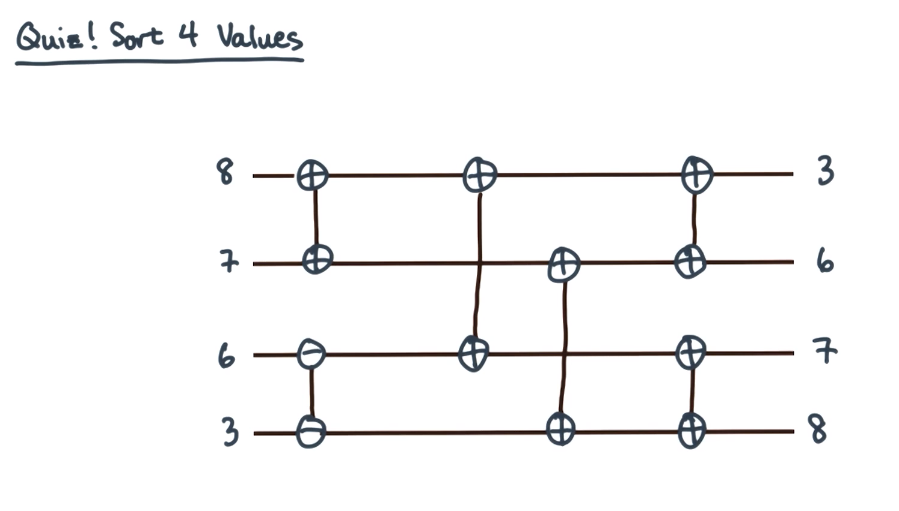

Consider the sorting of four input values $8$ , $7$ , $6$, and $3$ . Suppose it is claimed that this can be accomplished using the comparators-based circuit as in the figure shown above (comprised of one "-" comparator and five "+" comparators).

Trace the corresponding flow of intermediate comparisons, in order to substantiate this claim.

### ***Answer and Explanation***:

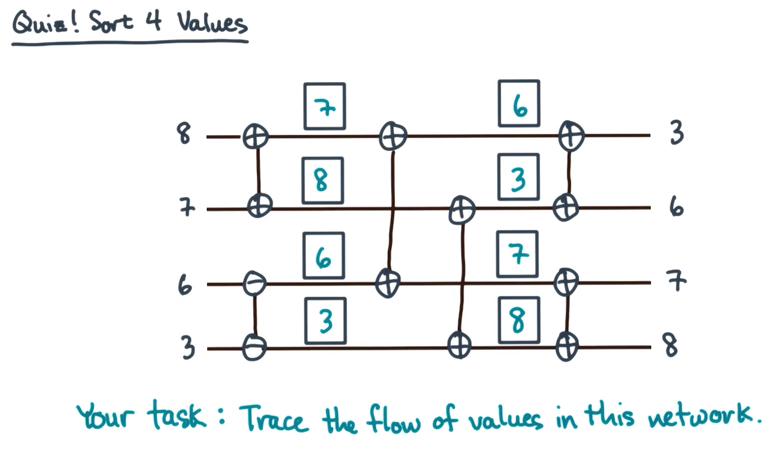

The corresponding comparisons are as in the figure shown above.

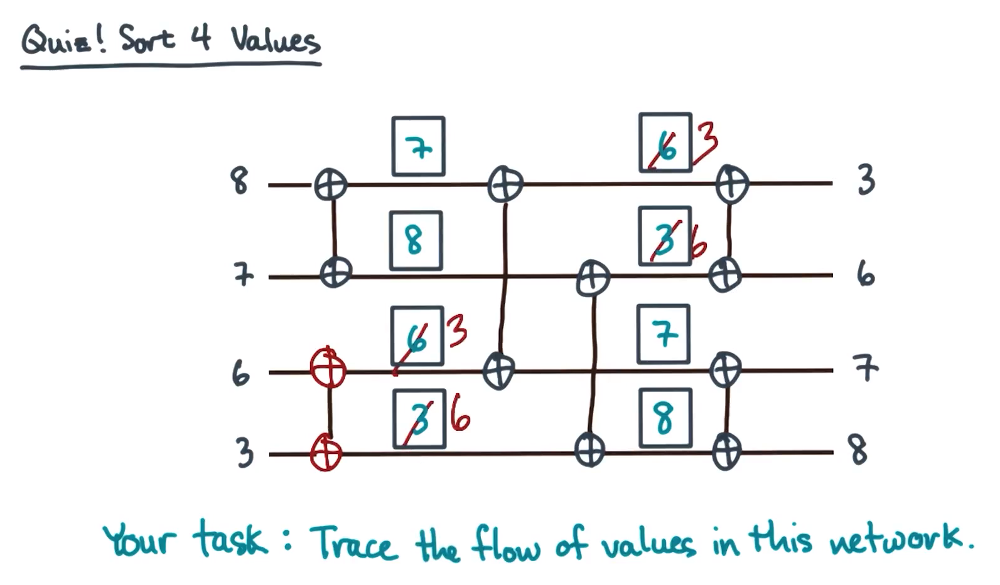

Now, suppose that the "-" comparator is changed to a "+" operator, as in the figure shown above.

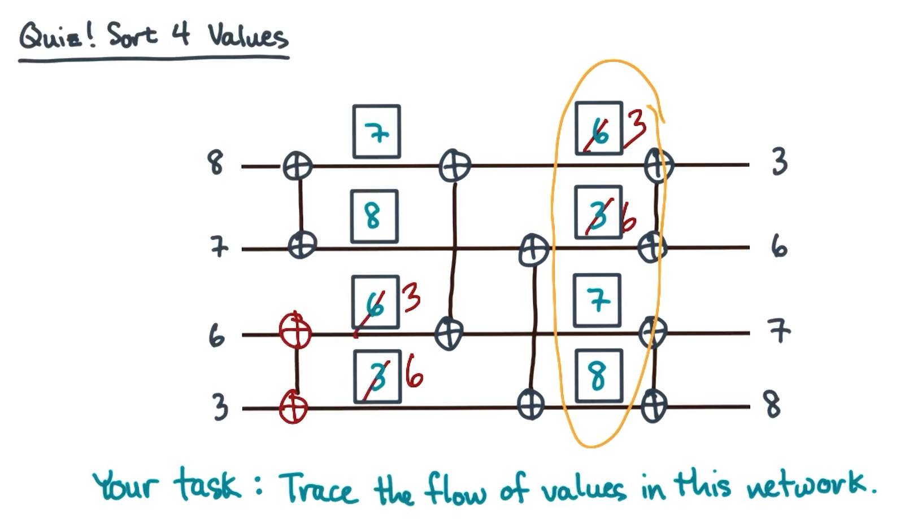

Consequently, observe that the sequence in the right column is already in sorted order (as denoted by goldenrod outline in the figure shown above).

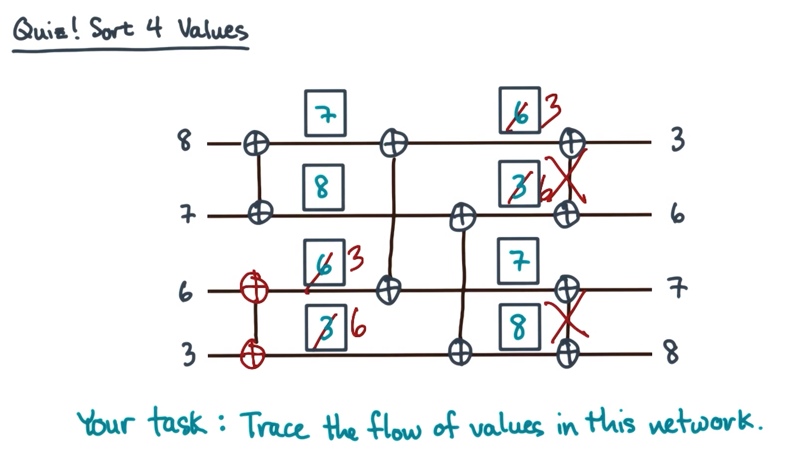

Therefore, the right-most comparators are evidently unnecessary in this particular example. However, is this strictly true (i.e., for any arbitrary input of four unsorted values)?
  * ***N.B.*** This question is left as an exercise for the reader.

## 4. Bitonic Sequences

Filling in intermediate values in the example circuit as in figure shown above (cf. Section 3), note the following observation: The first step produces sequences wherein the first half increases and the second half decreases (denoted by golden rod arrows in the figure shown above). In fact, this observation leads to a nice algorithm.

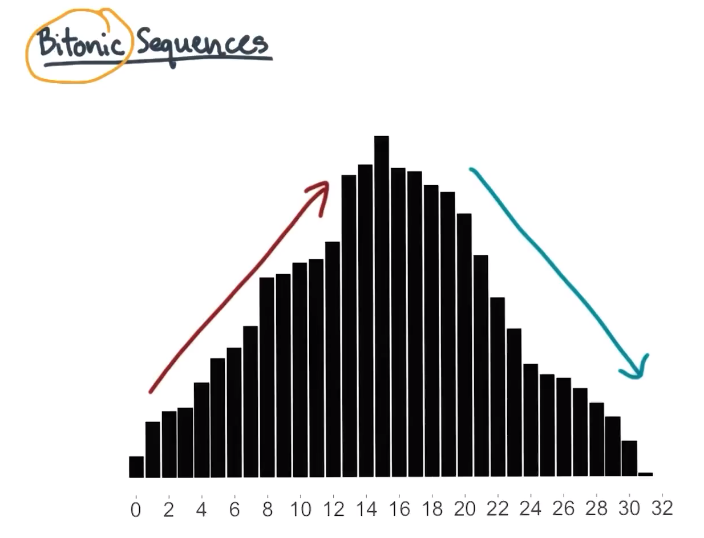

Consider a sequence of 32 values, depicted schematically in the figure shown above. Observe that the values begin increasing, and then eventually the values decrease. Such a sequence is called a **bitonic sequence** accordingly.
  * ***N.B.*** In this context, "bitonic" contrasts with the (perhaps previously familiar) "monotonic," whereby values are strictly non-decreasing or strictly non-increasing.

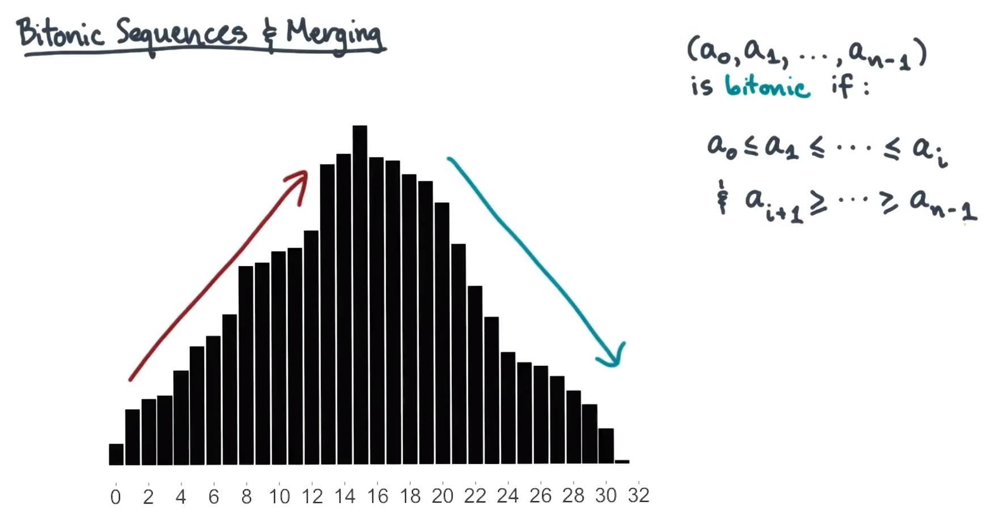

Defined more formally, a sequence $(a_0, a_1, \dots , a_{n-1})$ is **bitonic** if the following conditions hold (where element $a_i$ denotes the last-increasing element):

$$
a_0 \le a_1 \le \cdots \le a_i
$$

and

$$
a_{i+1} \ge \cdots \ge a_{n-1}
$$

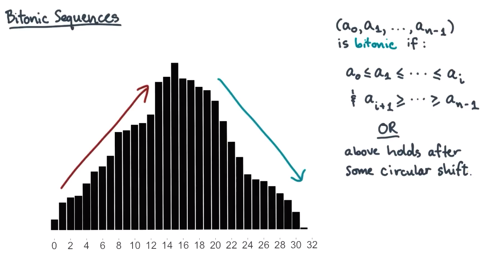

Furthermore, a more complete definition of **bitonic** additionally stipulates that these inequalities hold not only for the original sequence, but ***also*** after performing some arbitrary circular shift on the sequence.

The subsequent section will further demonstrate bitonic sequences by way of example.

## 5. Bitonic Sequences Quiz and Answers

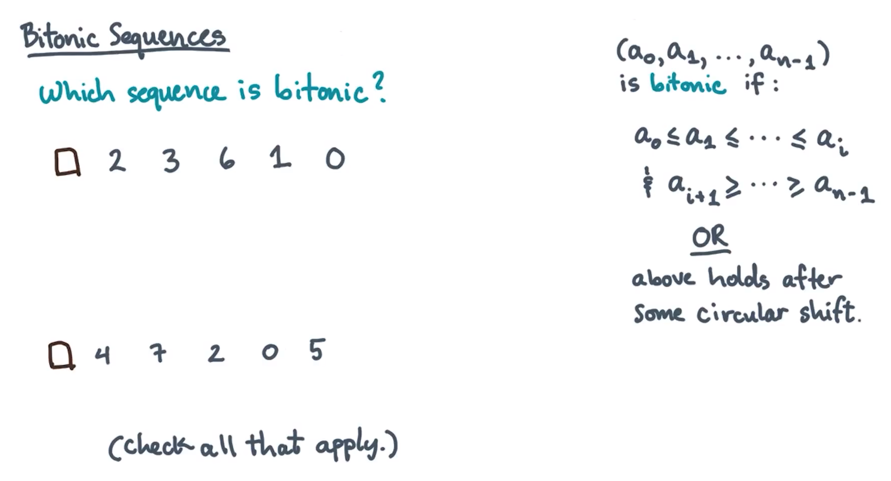

Consider the following two sequences (as in the figure shown above):
  * $2$ , $3$ , $6$ , $1$ , $0$
  * $4$ , $7$ , $2$ , $0$ , $5$

Which of these sequences is bitonic? (Select all that apply.)

### ***Answer and Explanation***:

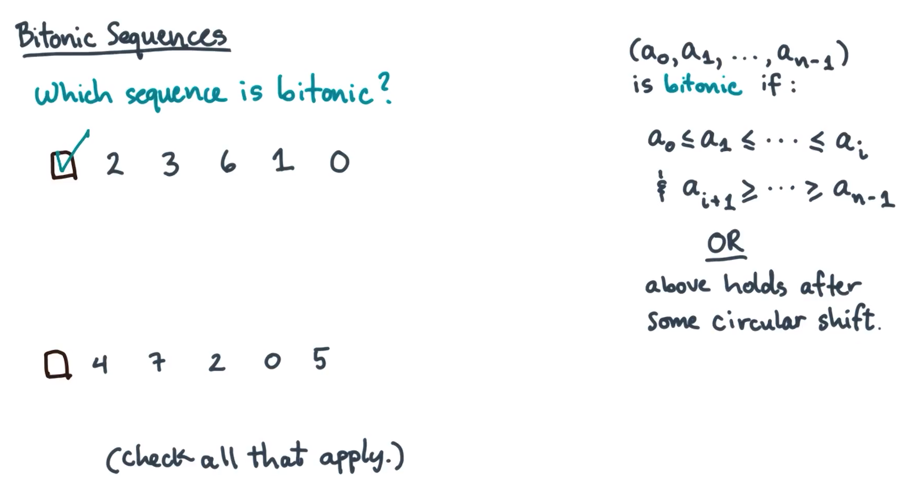

Only sequence $2$ , $3$ , $6$ , $1$ , $0$ is bitonic.

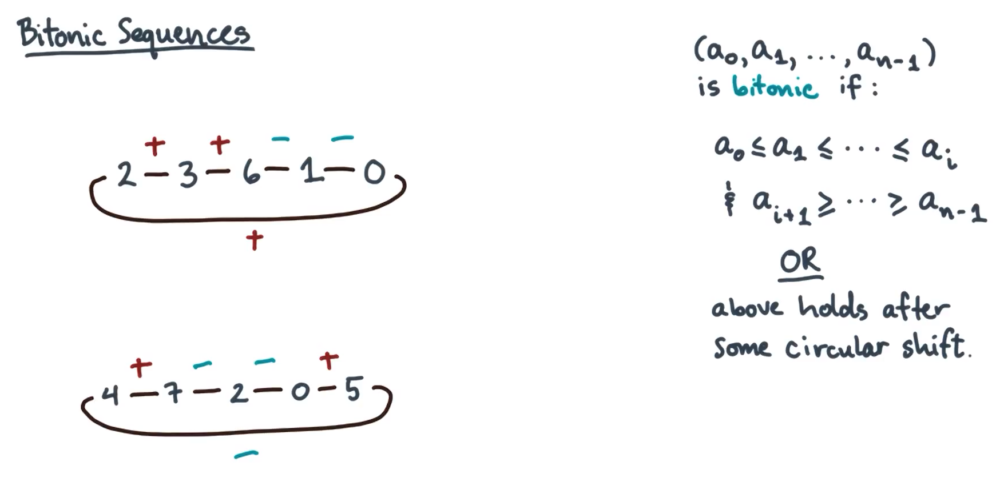

Recall (cf. Section 4) provides a stricter definition of bitonic by way of a circular shift.

In the sequence $2$ , $3$ , $6$ , $1$ , $0$ , clockwise examination indicates that all increases ("+") are consecutive and all decreases ("-") are consecutive. Correspondingly, this sequence is bitonic up to a circular shift.

Conversely, in the sequence $4$ , $7$ , $2$ , $0$ , $5$ , the increases ("+") and decreases ("-") are not strictly consecutive along the clockwise "ring" (i.e., there is no corresponding circular shift possible to satisfy the inequalities requirement among the elements).

## 6. Bitonic Splits

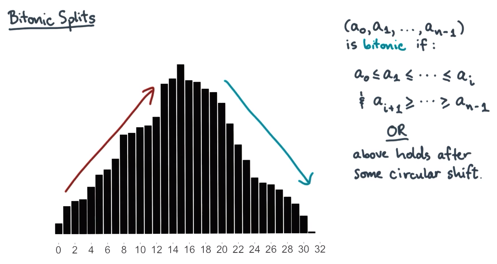

Recall (cf. Section 4) the definition for a **bitonic** sequence. Additionally, consider the following claim: Once a sequence is bitonic, it can be sorted trivially/easily. This claim will be further substantiated in this section.

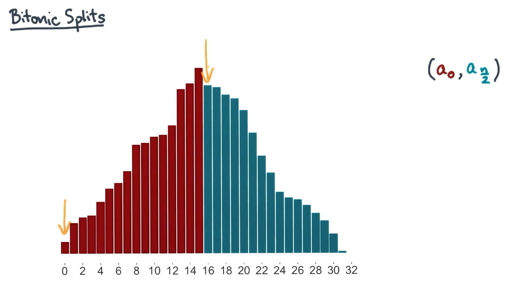

First, conceptually divide the given bitonic sequence into its two constituent halves (as in the figure shown above).
  * ***N.B.*** Here, for simplicity, it is assumed that division between the increasing sequences and the decreasing sequences occurs in the middle, however, this is not strictly necessary in general.

After splitting this sequence, now pair elements of the first sub-sequence with elements of the other sub-sequence, starting with the pair $(a_0, a_{n \over 2})$ (as denoted by goldenrod arrows in the figure shown above).

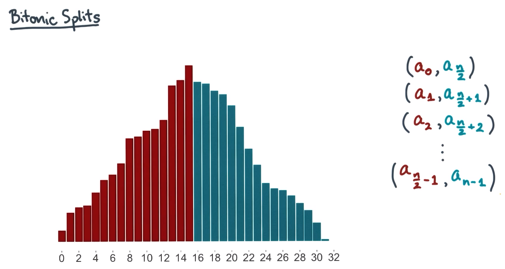

Similarly, pair elements of the respective sub-sequences in this manner until all are paired (as in the figure shown above), i.e.,:

$$
(a_0, a_{n \over 2})\\
(a_1, a_{{n \over 2} + 1})\\
(a_2, a_{{n \over 2} + 2})\\
\vdots\\
(a_{{n \over 2} - 1}, a_{n - 1})\\
$$

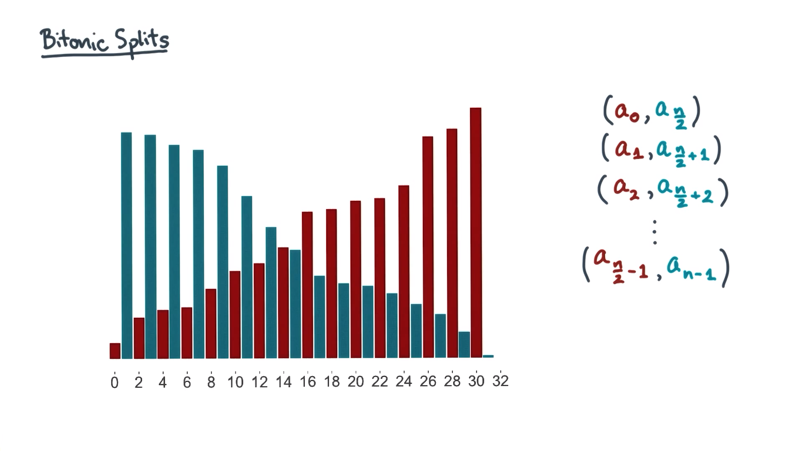

To observe this more readily, consider a corresponding visual pairing of these element pairs (as in the figure shown above).

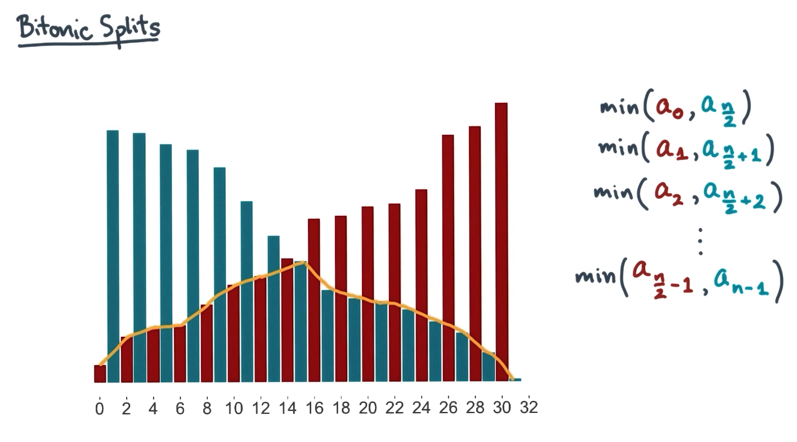

Now, consider taking the smallest of each pair (as in the figure shown above), i.e.,:

$$
\min(a_0, a_{n \over 2})\\
\min(a_1, a_{{n \over 2} + 1})\\
\min(a_2, a_{{n \over 2} + 2})\\
\vdots\\
\min(a_{{n \over 2} - 1}, a_{n - 1})\\
$$

In doing so, observe that the result forms a bitonic sequence (as denoted by goldenrod curve in the figure shown above).

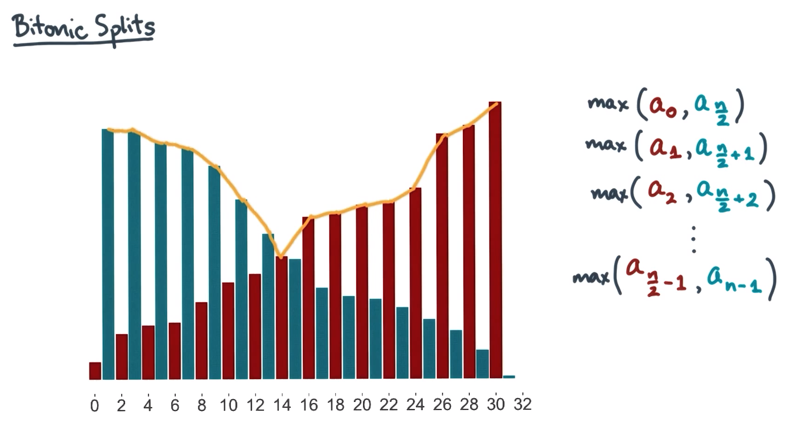

Similarly, taking the largest of each pair (as in the figure shown above), i.e.,:

$$
\max(a_0, a_{n \over 2})\\
\max(a_1, a_{{n \over 2} + 1})\\
\max(a_2, a_{{n \over 2} + 2})\\
\vdots\\
\max(a_{{n \over 2} - 1}, a_{n - 1})\\
$$

This also correspondingly yields a bitonic sequence (as denoted by goldenrod curve in the figure shown above), to within a circular shift of the previous (i.e., resulting from taking the minima of each pair).

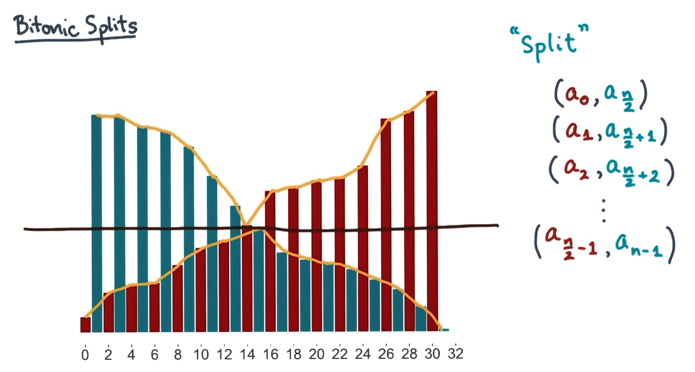

This general approach is called a **bitonic split**, i.e., the pairing of elements of a bitonic input sequence and subsequent application of $\min()$ or $\max()$ to these input pairs, resulting in two bitonic subsequences accordingly.

Furthermore, observe that all elements of the $\max()$ subsequence are greater than or equal to all elements of the $\min()$ subsequence (as delineated by solid black line in the figure shown above), thereby naturally suggesting a ***divide-and-conquer*** scheme.

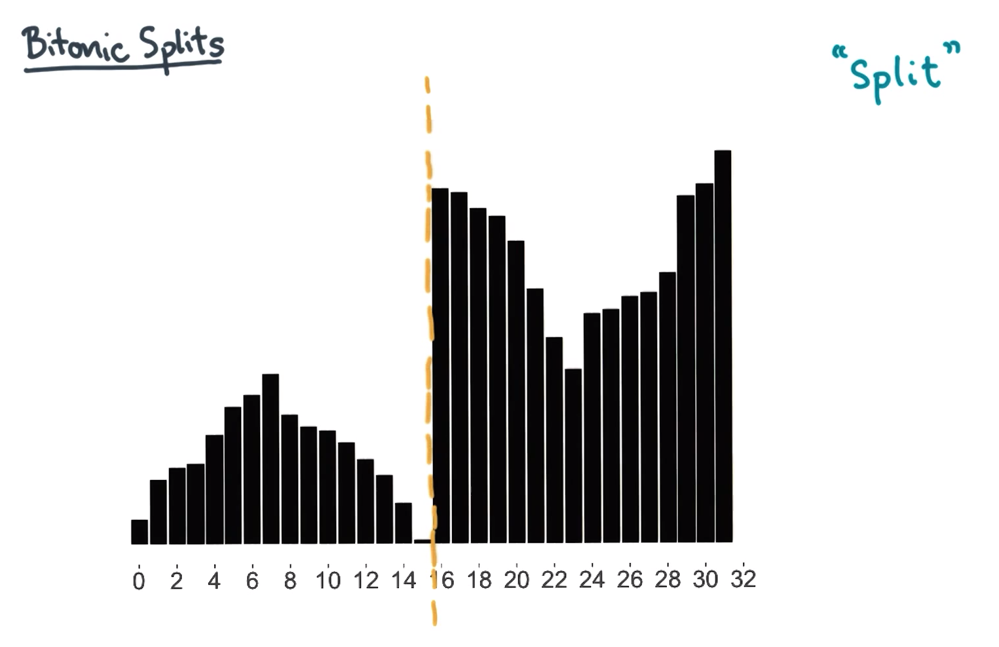

As is readily apparent, such splitting can be performed ***in-place*** (i.e., without otherwise requiring additional storage), visually resulting in two corresponding bitonic subsequences (as in the figure shown above).

## 7. Bitonic Splits Quiz and Answers

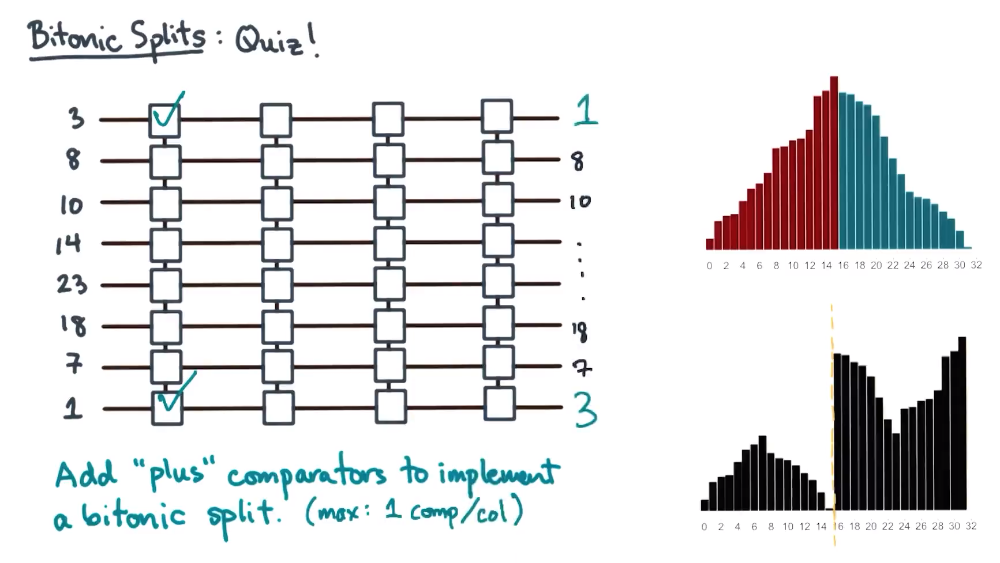

Recall (cf. Section 6) that a bitonic split takes a bitonic sequence as input and produces two bitonic sub-sequences as output (as in the figure shown above).

Consider an eight-element bitonic sequence (as in the figure shown above). Perform the corresponding bitonic split using a comparators-based circuit using "+" comparators, restricted to only ***one*** such comparator per stage/column (e.g., as a demonstrative example, inputs $3$ and $1$ are "checked" to form a comparator-inputs pair in the figure shown above, resulting in outputs $1, \cdots , 3$ accordingly).

### ***Answers and Explanation***:

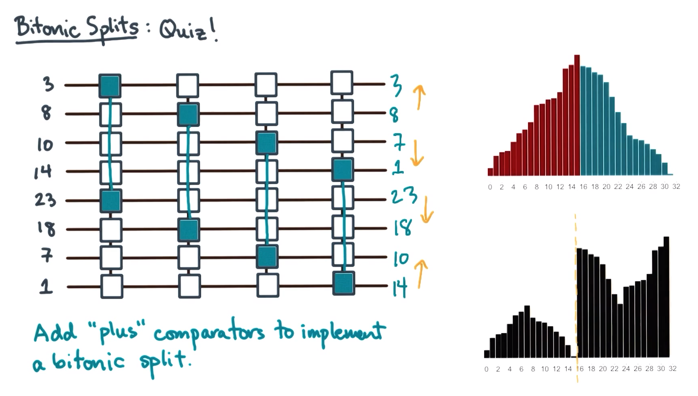

One possible solution is as in the figure shown above. Recall (cf. Section 6) that a bitonic split pairs elements from each half of the input bitonic sequence, and then for each such pair it subsequently segregates the smaller and the larger element, which is consistent with the operation of a "+" comparator accordingly.

Checking the outputs (as denoted by solid goldenrod arrows in the figure shown above), both haves in the corresponding output are bitonic, up to a circular shift.
  * ***N.B.*** Per this circular shift, any permutation of comparators would be equally valid, besides that as in the figure shown above.

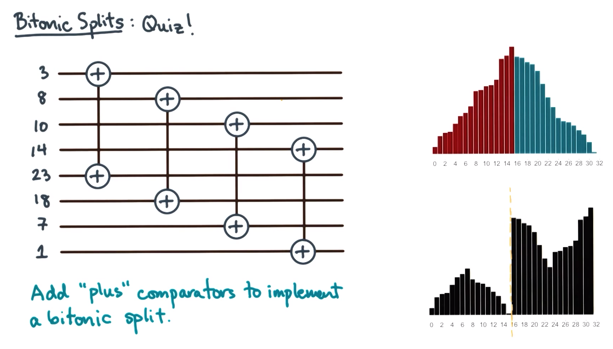

Therefore, a valid final bitonic split circuit is as in the figure shown above.
  * ***N.B.*** As an additional exercise, what is the corresponding work and span for this circuit?

## 8. Bitonic Splits: A Parallel Scheme

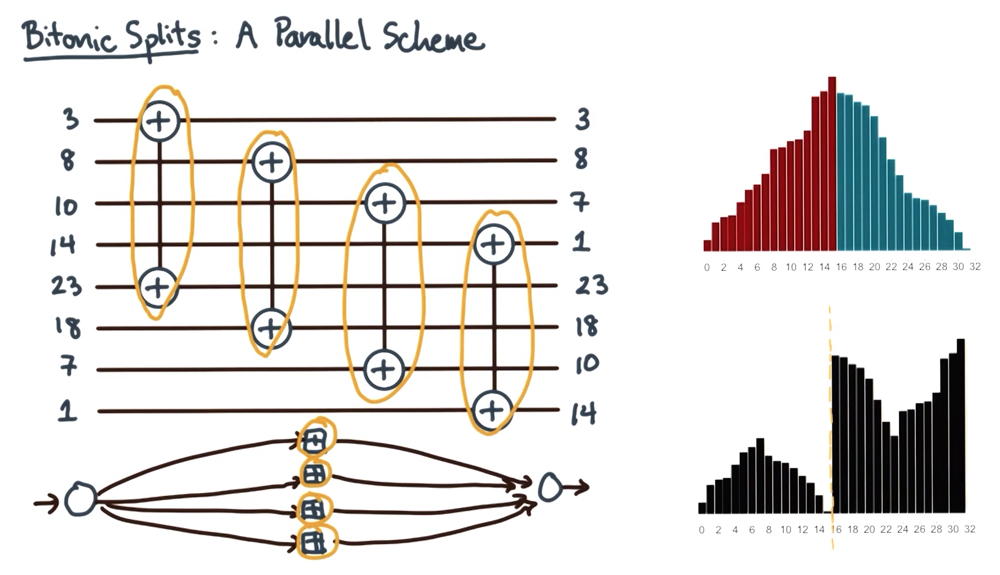

Recall (cf. Section 7) the eight-element bitonic splitting network (as in the figure shown above). Given a bitonic input sequence, this splitting network computes two bitonic sub-sequences as outputs, with elements of the first sub-sequence being strictly less than or equal to the elements of the second sub-sequence.

This circuit can be correspondingly viewed as a directed acyclic graph (DAG) of independent comparators (as in the figure shown above), with each comparator constituting a node/vertex in the DAG accordingly.

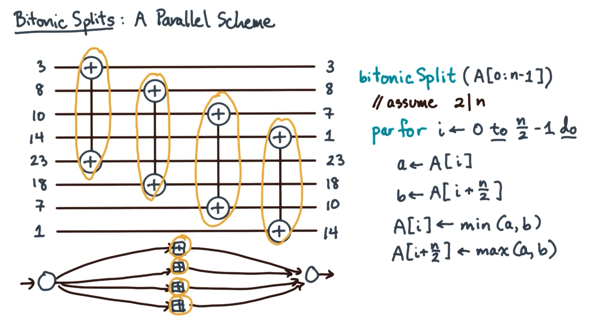

From this DAG-oriented observation, this naturally gives rise to the following parallel scheme (for simplicity, assume that $n$ is even, i.e., $2|n$ ):

$$
\boxed{
\begin{array}{l}
{{\rm{bitonicSplit}}\left( {A[0:n - 1]} \right)}\\
\ \ \ \ {{\rm{//\ assume\ }}2|n}\\
\ \ \ \ {{\rm{parfor\ }}i \leftarrow 0{\rm{\ to\ }}{n \over 2} - 1\;{\rm{do}}}\\
\ \ \ \ \ \ \ \ {a \leftarrow A[i]}\\
\ \ \ \ \ \ \ \ {b \leftarrow A\left[ {i + {n \over 2}} \right]}\\
\ \ \ \ \ \ \ \ {A[i] \leftarrow \min (a,b)}\\
\ \ \ \ \ \ \ \ {A\left[ {i + {n \over 2}} \right] \leftarrow \max (a,b)}
\end{array}
}
$$

Here, each pair is iterated over in parallel (i.e., via $\rm{parfor}$ ), correspondingly determining the minimum and maximum for each pair (and overwriting the respective outputs accordingly).

There is a ***subtle point*** to note, however: In the work-span model (cf. Lesson 5), the fixed-size circuit has a ***constant*** depth/span, whereas in general, the convention is to assume ***logarithmic*** depth/span for operations such as parallel for loops.

## 9. Bitonic Merge

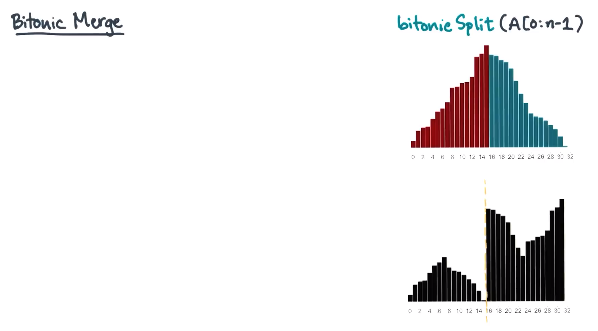

Recall (cf. Section 8) that a bitonic split naturally gives rise to a divide-and-conquer scheme for sorting any bitonic input sequence. To further demonstrate this, consider the following figures.

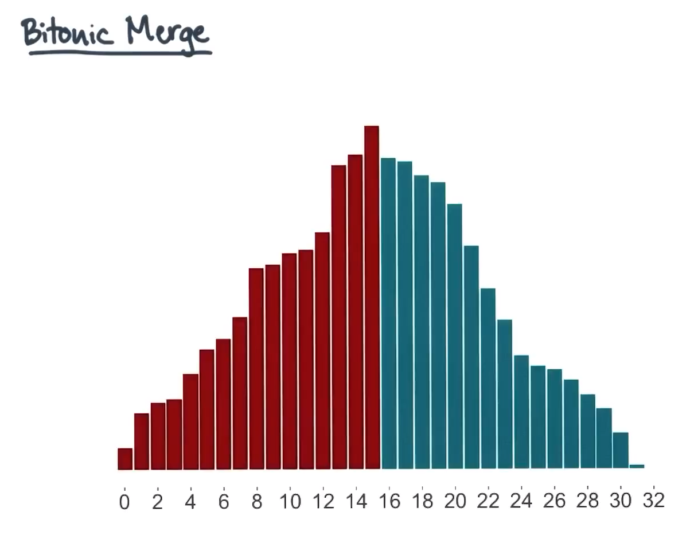

Given an input sequence (as in the figure shown above), split it into corresponding halves. 

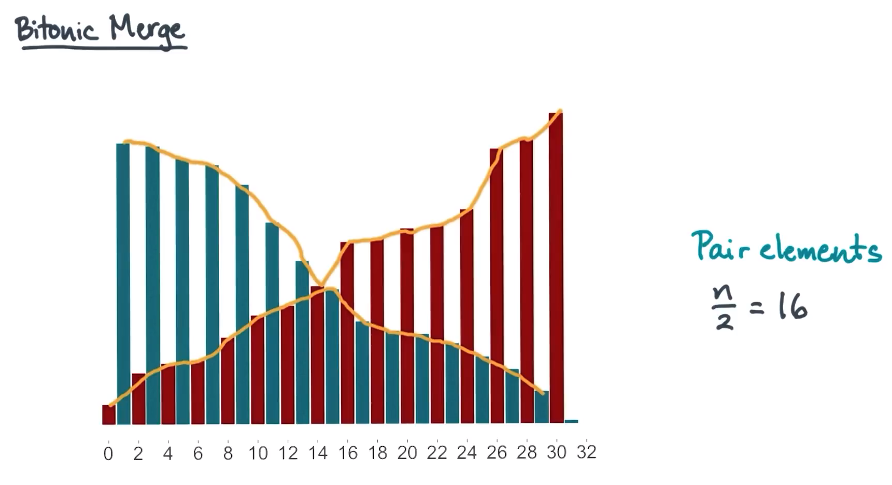

In this case, there are 32 inputs, so the elements are paired at a distance of ${n \over 2} = 16$ apart (as in the figure shown above).

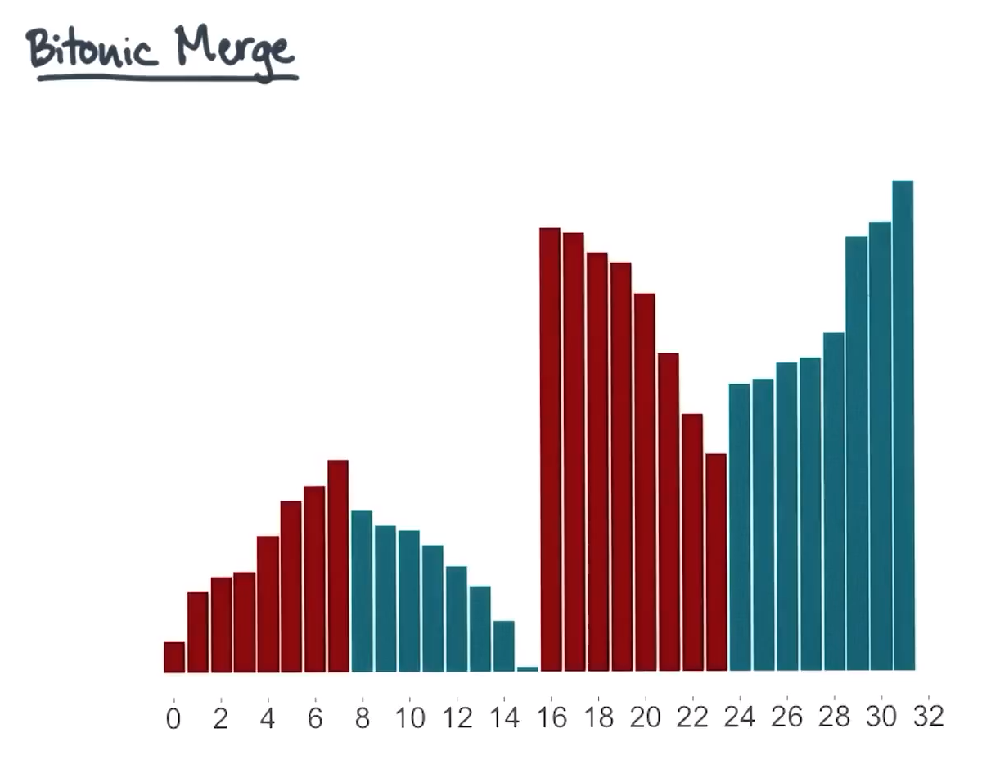

Subsequently to the first splitting step, the result is two bitonic sub-sequences, each of length 16 (as in the figure shown above).

This process is repeated accordingly, as follows.

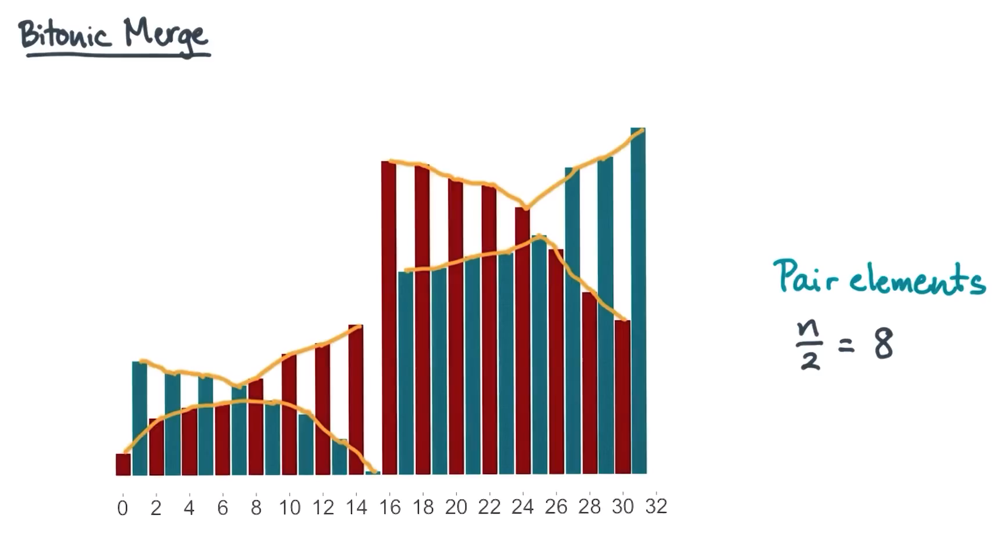

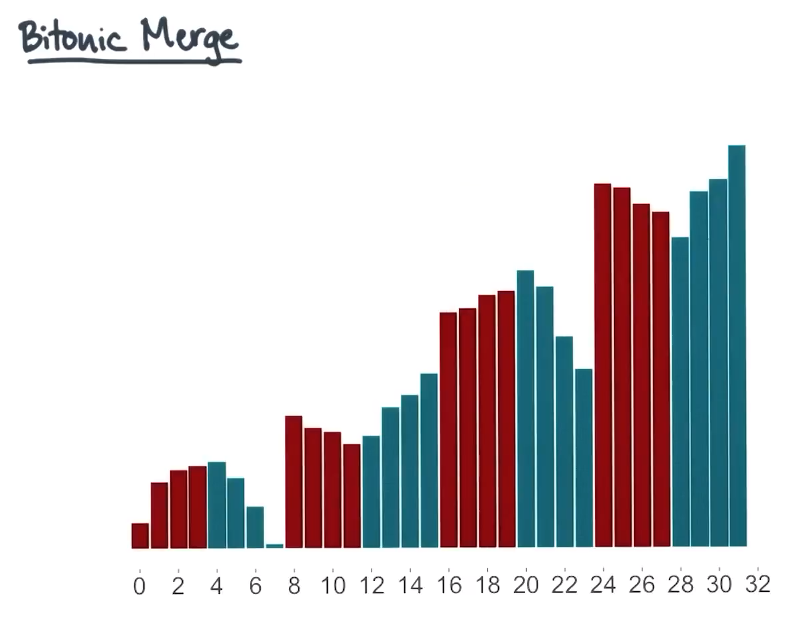

In the next splitting step, the elements are paired at a distance of 8 apart (as in the figures shown above), resulting in four bitonic sub-sequences, each of length 8.

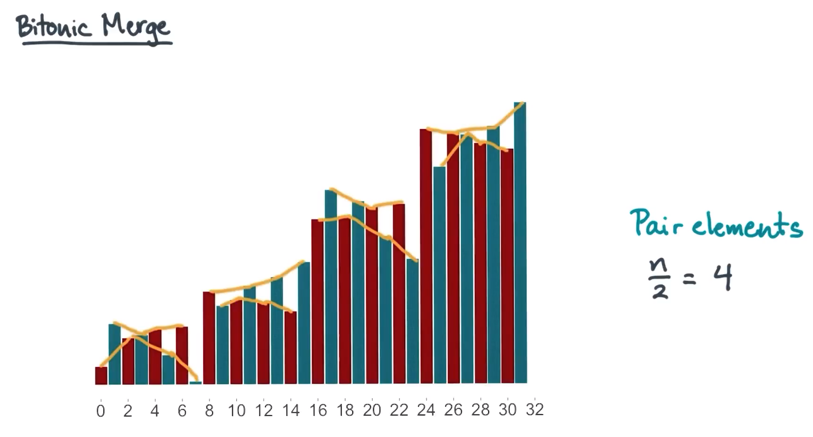

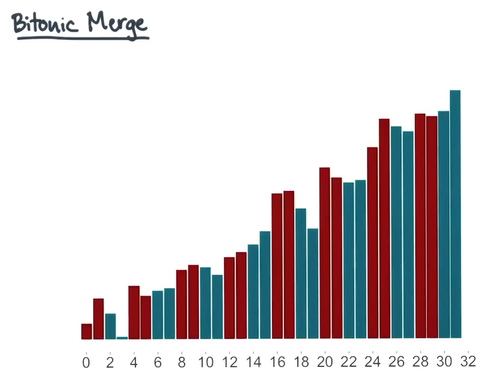

In the next splitting step, the elements are paired at a distance of 4 apart (as in the figures shown above), resulting in eight bitonic sub-sequences, each of length 4.

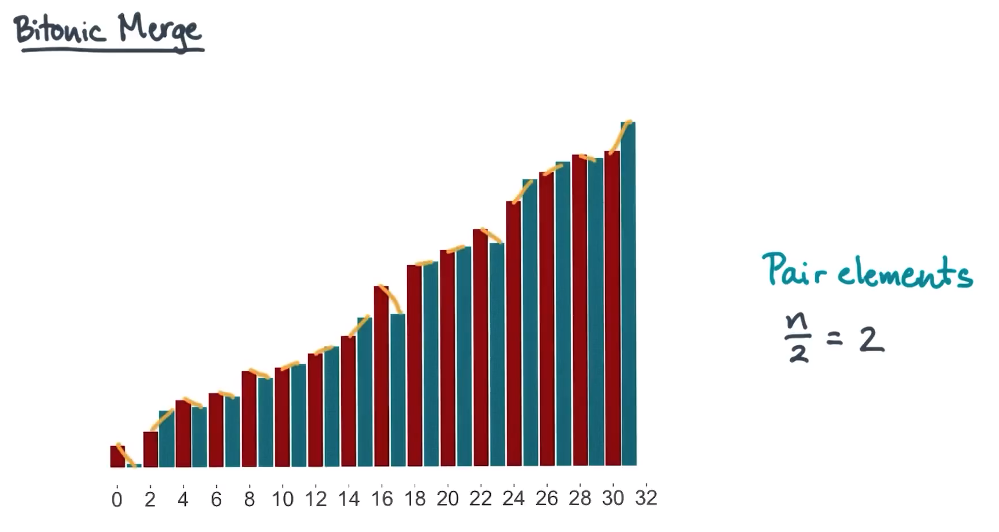

In the final splitting step, the elements are paired at a distance of 2 apart (as in the figure shown above), resulting in sixteen bitonic sub-sequences, each of length 2.

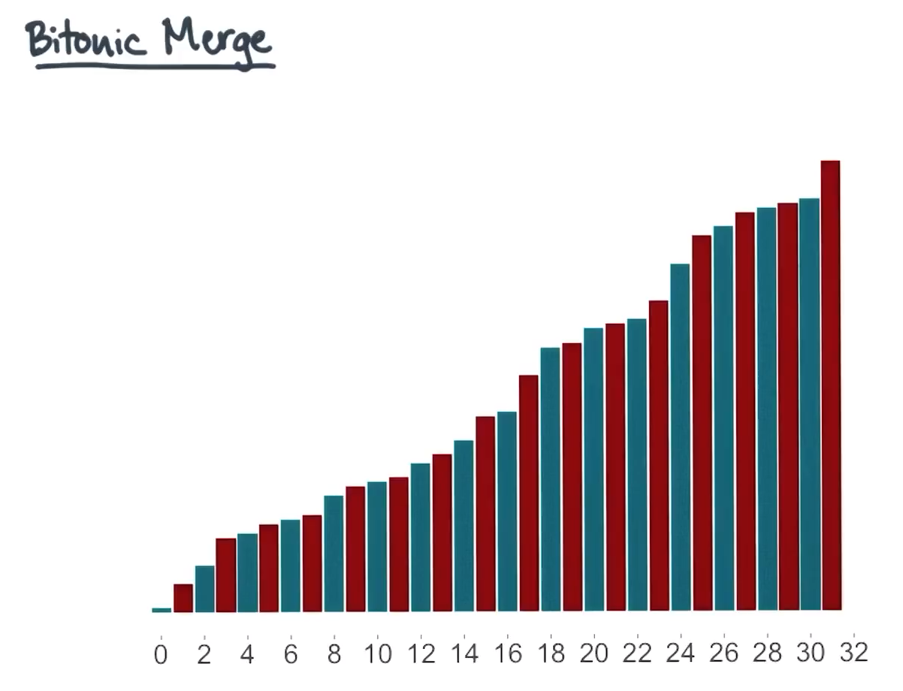

Finally, the sorted sequence results in the trivial case of thirty-two sorted elements (as in the figure shown above).

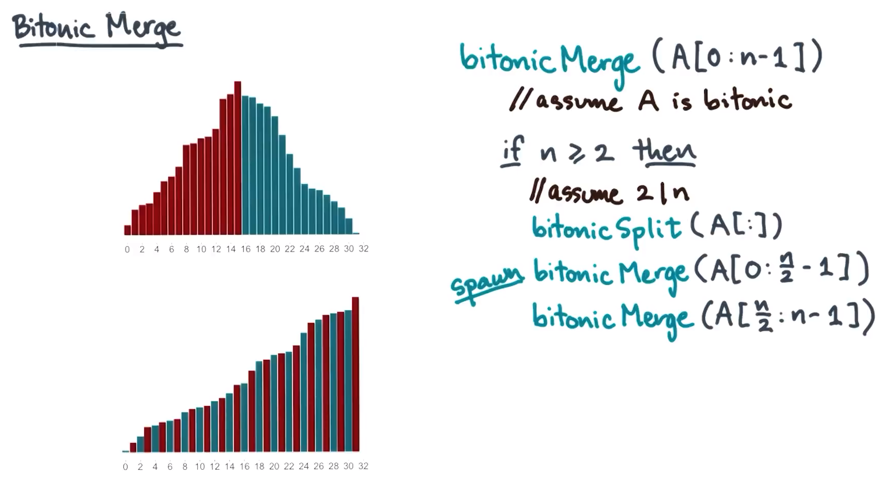

The aforementioned steps are called a **bitonic merge**, i.e., the transformation from a bitonic input sequence into a sorted output. The corresponding pseudocode for this operation is as follows:

$$
\boxed{
\begin{array}{l}
{{\rm{bitonicMerge}}\left( {A[0:n - 1]} \right)}\\
\ \ \ \ {{\rm{//\ assume\ }}A{\rm{\ is\ bitonic}}}\\
\ \ \ \ {{\rm{if\ }}n \ge 2{\rm{\ then}}}\\
\ \ \ \ \ \ \ \ {{\rm{//\ assume\ }}2|n}\\
\ \ \ \ \ \ \ \ {{\rm{bitonicSplit}}({A[:]})}\\
\ \ \ \ \ \ \ \ {{\rm{spawn\ bitonicMerge}}\left( {A\left[ {0:{n \over 2} - 1} \right]} \right)}\\
\ \ \ \ \ \ \ \ {{\rm{bitonicMerge}}\left( {A\left[ {{n \over 2}:n - 1} \right]} \right)}
\end{array}
}
$$

Here, $\rm{bitonicSplit}(A[:])$ splits the bitonic input sequence into two bitonic sub-sequences, each of which are subsequently merged.
  * ***N.B.*** Note that all elements of one sub-sequence are ***strictly*** less than or equal to all elements of the other sub-sequence. This ***independence*** property in turn allows to use a $\rm{spawn}$ operation accordingly.

## 10. Bitonic Merge Networks Quiz and Answers

Recall (cf. Section 9) that given a bitonic input sequence, a bitonic merge produces a correspondingly sorted output.

For this quiz, the task is to create a bitonic merge network, starting with the "empty" network as in the figure shown above. In each column, insert one or more non-overlapping "+" comparators, by correspondingly selecting an even number of boxes in each column.

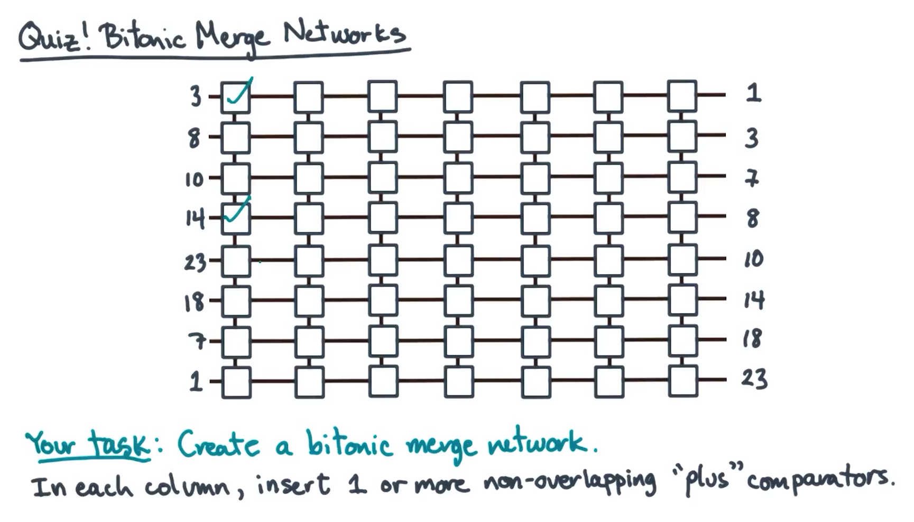

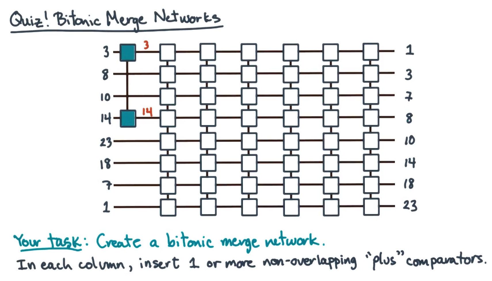

For example, if selecting the boxes for inputs $3$ and $14$ (as in the figures shown above), this implies a corresponding "+" comparator between these inputs accordingly.
  * ***N.B.*** This particular selection is shown for demonstration purposes, however, it of course does not yield the correctly sorted output.

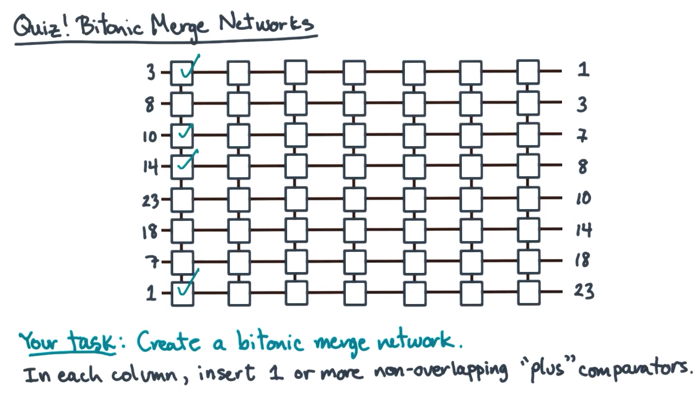

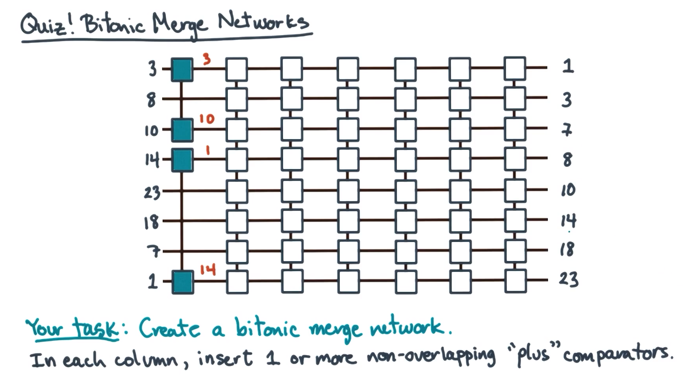

Conversely, consider selection of the four boxes as in the figures shown above, noting that comparators in a given column *cannot* overlap. (This still results in an incorrect output, however.)

In this manner, the outputs from one comparator can be "chained" to the inputs of the next.

Furthermore, note that the objective of this bitonic merge network is to sort ***any*** arbitrary eight-element input sequence, not only the particular sequence given here.

### ***Answers and Explanation***:

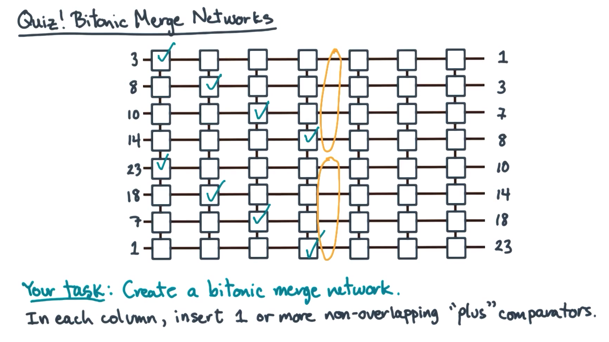

Recall (cf. Section 9) that a bitonic merge is simply a sequence of splits, whereby such a sequence of splits is constituted by a set of min-max pairs.

Furthermore, since the input is of length eight elements, correspondingly the first split should pair elements that are four away from each other (as in the figure shown above), resulting in two sets of four-element bitonic sequences at the respective outputs (denoted by goldenrod annotations in the figure shown above).


Proceeding in this manner, the two sets of four elements are similarly halved into four sets of two-element pairs at a distance of two elements apart (as in the figures shown above), eventually converging on the trivial case of four sets of adjacent pairs (denoted by goldenrod annotations in the figure shown above), thereby yielding the sorted output accordingly.

***N.B.*** The second figure in the pair of figures shown above annotates the traces of the intermediate values on each wire. As an additional follow-up exercise, compare this circuit with the pseudocode for $\rm{bitonicMerge}$ (cf. Section 9).

## 11. Generate a Bitonic Sequence Quiz and Answers


Given a bitonic input sequence, recall (cf. Section 10) that a network such as that in the figure shown above will sort it accordingly.

However, given an ***arbitrary*** input, how is such a bitonic-sequence input generated from it in the first place?


To further investigate this matter, create a comparator network that takes an arbitrary sequence (such as that in the figure shown above) and creates a bitonic sequence from it. Do this by inserting one or more non-overlapping comparators in each column. Use either "+" or "-" comparators as necessary.

To assist with this, the first and last columns are provided in the figure shown above. Furthermore, as an additional hint, the values of the first groups of comparators are annotated in the figure (denoted by orange font), as a prompt/reminder of the difference between the "+" and "-" comparators.

### ***Answer and Explanation***:


To determine this network, consider what this first group of comparators is doing: This group is creating up-and-down pairs (as denoted by arrows in the figure shown above). Furthermore, given that this is the case, then it is necessarily true that both the first-four and second-four elements comprise bitonic sub-sequences.


Now, the remaining task is to converge on a *single* bitonic sequence across the entire set of inputs, which can be accomplished by converting one of the four-element sub-sequences into an increasing sub-sequence, and the other four-element sub-sequence into a correspondingly decreasing sub-sequence.

Taking the top-half four-element sub-sequence into consideration (as denoted by goldenrod annotation in the figure shown above), given a bitonic sequence, in order to yield an increasing sub-sequence from this, a bitonic merge can be used accordingly.


Correspondingly, applying this idea yields the resulting network as in the figure shown above, where the bottom-half sub-sequence uses the analogous premise but with "-" comparators to produce a decreasing sub-sequence.
  * ***N.B.*** In this context, the provided first-column selections are effectively bitonic merges of size $2$ .


To further verify the result, note the trace of the intermediate values (as in the figure shown above). To summarize:
  * 1 - Starting with an arbitrary input, corresponding "+" and "-" bitonic merges of size 2 are performed.
  * 2 - Next, "+" and "-" bitonic merges of size 4 are performed.
  * 3 - Generalizing in this manner, subsequently double-sized bitonic merges are performed.

Therefore, to convert from an arbitrary input to a bitonic sequence, a corresponding series of bitonic merges of increasing size are performed accordingly (i.e., until yielding a single bitonic sequence).

## 12. Bitonic Sort

For completeness, consider a summary to recap with respect to sorting, using bitonic ideas.

First, given an arbitrary input (as in the figure shown above), the procedure to generate a bitonic sequence is as follows:

$$
\boxed{
\begin{array}{l}
{{\rm{genBitonic}}({A[0:n - 1]})}\\
\ \ \ \ {{\rm{if\ }}n \ge 2{\rm{\ then}}}\\
\ \ \ \ \ \ \ \ {{\rm{//\ assume\ }}2|n}\\
\ \ \ \ \ \ \ \ {{\rm{spawn\ genBitonic}}\left( {A\left[ {0:{n \over 2} - 1} \right]} \right)}\\
\ \ \ \ \ \ \ \ {{\rm{genBitonic}}\left( {A\left[ {{n \over 2}:n - 1} \right]} \right)}\\
\ \ \ \ \ \ \ \ {{\rm{sync}}}\\
\ \ \ \ \ \ \ \ {{\rm{spawn\ bitonicMerge}}{_ +}\left( {A\left[ {0:{n \over 2} - 1} \right]} \right)}\\
\ \ \ \ \ \ \ \ {{\rm{bitonicMerge}}{_\_}\left( {A\left[ {{n \over 2}:n - 1} \right]} \right)}
\end{array}
}
$$

This pseudocode follows a divide-and-conquer approach, whereby two bitonic sub-sequences are created, which are subsequently converted into respective increasing ("+") and decreasing ("-") sub-sequences.
  * ***N.B.*** "+" and "-" variations of procedure $\rm{bitonicMerge}$ are used to achieve the latter.


Given the primitive operation $\rm{benBitonic}$ , sorting is relatively simple to accomplish, i.e.,:

$$
\boxed{
\begin{array}{l}
{{\rm{bitonicSort}}\left( {A[0:n - 1]} \right)}\\
\ \ \ \ {{\rm{genBitonic}}\left( {A[:]} \right)}\\
\ \ \ \ {{\rm{bitonicMerge}}{_ +}\left( {A[:]} \right)}
\end{array}
}
$$

Schematically (as in the figure shown above), this effectively entails combining the "output stage" of the $\rm{genBitonic}$ circuit into the "input stage" of the $\rm{bitonicMerge}{_ +}$ circuit. 


The work $D(n)$ and $W(n)$ for $\rm{bitonicSort}$ are (respectively) as follows:

$$
W_{\rm{bs}}(n) = \Theta(n \log^2 n)
$$

$$
D_{\rm{bs}}(n) = \Theta(\log^2 n)
$$

With respect to span $D(n)$, $\rm{bitonicSort}$ is poly-logarithmic (as desired). However, with respect to work $W(n)$ , $\rm{bitonicSort}$ ***not*** work-optimal, relative to optimal $n \log n$ performance for a comparison sort. This then begs the question: Why even bother with bitonic sorting?

## 13. Conclusion

One key advantage of bitonic sorting is that it gives rise to a nice visual representation, which in turn connects it to the dynamic multi-threading model. Furthermore, bitonic sort has a fixed, regular parallel structure, lending itself to a natural implementation (e.g., field programmable gate arrays [FPGAs]). This regular structure also means that bitonic sorting maps well to fixed-data parallel hardware (e.g., single instruction multi data [SIMD], vector processing systems, graphics co-processors [GPUs], etc.).

However, a key downside of bitonic sorting is that it is not work-optimal, even when restricted to only the class of comparison-based algorithms. Therefore, in practice, this begets an engineering decision/trade-off with respect to the platform and the scale in question for intended use of the algorithm. The best way to understand this trade-off is to implement bitonic sorting and competing algorithms on real systems, and observe the resulting behavior.
